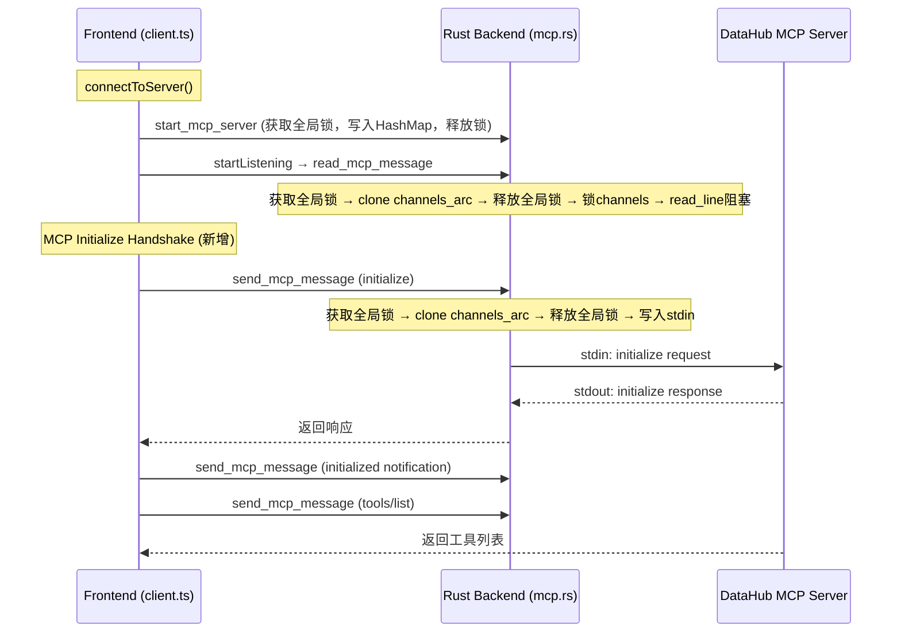

## Product Overview

修复 MCP DataHub 服务器连接超时问题，使得 AI Chat 能正常通过 MCP 协议调用 DataHub 工具

## Core Features

- 修复 Rust 后端全局 Mutex 死锁：`read_mcp_message` 在阻塞读期间持有全局锁，导致 `send_mcp_message` 无法获取锁写入请求，形成死锁
- 添加 MCP 协议 initialize 握手：当前代码直接发 `tools/list`，但 MCP 标准要求先完成 `initialize` + `initialized` 通知握手
- 确保 tools/list 和 tools/call 请求能正常发出并收到响应

## Tech Stack

- Rust (Tauri 后端): 修改 `mcp.rs` 锁策略
- TypeScript (前端): 修改 `client.ts` 添加 MCP 握手

## Implementation Approach

### 根因分析

两个致命问题导致 MCP 连接失败：

**问题1 - Rust 全局锁死锁（根因）**：`read_mcp_message` 在 `BufReader::read_line()` 阻塞期间持有 `MCP_SERVERS` 全局 Mutex。前端 `listenForMessages` 循环调用 `readMessage` 占住锁 → 前端发 `tools/list` 调用 `sendMessage` 等锁 → 消息写不进 stdin → 子进程无响应 → `readMessage` 永远阻塞 → 死锁。

**问题2 - 缺少 MCP initialize 握手**：MCP 标准协议要求客户端先发 `initialize` 请求，收到响应后发 `initialized` 通知，然后才能发 `tools/list`。当前直接发 `tools/list`，DataHub 服务端可能拒绝或忽略。

### 修复方案

**修复1 - Rust 端消除全局锁竞争**：在 `read_mcp_message` 和 `send_mcp_message` 中，快速获取全局锁找到 server 的 `channels Arc` 引用后**立即释放全局锁**，然后只锁定 `channels` 进行实际 I/O。这样读操作阻塞时不会阻止写操作。

**修复2 - 前端添加 MCP 握手**：在 `client.ts` 的 `connectToServer` 中，`startListening` 之后、`discoverTools` 之前，插入 `initialize` 请求 + `initialized` 通知。

### Performance & Reliability

- 锁粒度缩小后，读写可并行，不存在死锁风险
- MCP 握手是标准流程，完成后 tools/list 和 tools/call 才能正常工作
- `stop_mcp_server` 也需要调整，确保在移除 server 前释放全局锁

## Implementation Notes

- Rust: 使用作用域块 `{ let channels_arc = { ... }; // 全局锁释放 ... }` 模式确保全局锁尽早释放
- Rust: `read_line` 是同步阻塞调用，在 async Tauri command 中会占用 tokio 线程，但这在当前架构下可接受，因为每个 MCP server 只有一个 reader
- 前端: `initialize` 请求需要带 `protocolVersion`、`capabilities`、`clientInfo` 参数
- 前端: `initialized` 是通知（无 id），用 `sendNotification` 而非 `sendRequest`
- 前端: 需给 `initialize` 请求设置合理的超时（如 10 秒），避免握手阻塞整个连接流程

## Architecture Design



## Directory Structure

```
apps/desktop/src-tauri/src/
└── mcp.rs                   # [MODIFY] 重构 read/send/stop 的锁粒度，消除死锁

apps/desktop/src/services/MCPService/
└── client.ts                # [MODIFY] 在 connectToServer 中添加 MCP initialize 握手
```