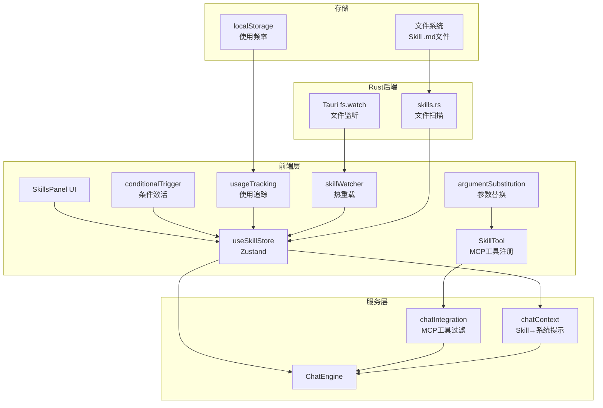

## 产品概述

将 PyIDE 的 Skill 系统从当前的"静态提示词片段"升级为参照 Claude Code 实现的"可执行技能单元"，使 Skill 具备参数化执行、工具权限强制、条件激活、热重载等核心能力。

## 核心功能

- **参数替换引擎**：支持 `$ARGUMENTS`、`$ARGUMENTS[0]`、`$0`、`$name`（命名参数）四级模板替换，让 Skill 可复用
- **工具权限强制**：Skill 的 `allowedTools` 在 Agent 模式执行时实际过滤可用 MCP 工具，AI 只能使用 Skill 声明的工具
- **SkillTool（AI 主动调用）**：AI 可通过 SkillTool 主动激活/调用 Skill，而非仅靠用户手动切换
- **条件路径激活**：根据 `paths` glob 模式（如 `**/*.py`）自动激活匹配当前编辑文件的 Skill
- **项目级 Skill 加载**：扫描 `[project]/.pyide/skills/` 目录，支持团队共享
- **目录结构支持**：从平面 `.md` 升级为 `<name>/SKILL.md` + `scripts/` + `reference.md`
- **文件变更热重载**：监听 Skill 文件变更，自动重新加载
- **使用频率追踪**：7天半衰期指数衰减评分，智能排序 Skill
- **SkillsPanel UI 升级**：展示参数提示、路径模式、使用频率、Skill 详情

## 技术栈

- 前端框架：React + TypeScript（复用现有项目架构）
- 状态管理：Zustand（复用现有 useSkillStore 模式）
- 后端：Tauri (Rust)（扩展现有 skills.rs）
- 文件监听：Tauri FS watcher（前端侧无需 chokidar，通过 Tauri event 监听文件变更）
- Glob 匹配：minimatch 或 picomatch（轻量 glob 库，用于 paths 条件匹配）
- 参数解析：自定义实现（参考 Claude Code 的 argumentSubstitution.ts）

## 实现方案

### 整体策略

采用**渐进式升级**策略，分 4 个阶段推进，每个阶段交付可独立运行的功能。核心思路：**保留现有 Skill 的向后兼容**（平面 .md 仍可加载），同时扩展新能力。

### 阶段一：基础能力（类型 + 参数替换 + 目录结构 + 项目级加载）

**1. 类型系统升级** — 扩展 `types/skill.ts`：

- 新增 `SkillArg` 类型（name, type, default, description, required）
- `SkillDefinition` 新增字段：`args`, `context('inline'|'fork')`, `hooks`, `files`, `source` 扩展为含 `'project'` 的联合类型
- `SkillFrontmatter` 对齐新字段（arguments, tools, context, hooks, files, paths）
- 保留对旧字段（allowed_tools, argument_hint）的兼容映射

**2. 参数替换引擎** — 新建 `utils/argumentSubstitution.ts`：

- 参考 Claude Code 的 `argumentSubstitution.ts`，实现四级替换
- 命名参数 `$name` → 按位置映射 `argumentNames[i]` → `parsedArgs[i]`
- 索引参数 `$ARGUMENTS[0]`, `$0` → 按索引替换
- 完整参数 `$ARGUMENTS` → 原始字符串
- 无占位符时自动追加 `ARGUMENTS: {args}`
- 参数解析使用简单的空格分割（非 shell-quote，避免引入额外依赖）

**3. SKILL.md 目录结构支持** — 修改 Rust 后端 `skills.rs`：

- `scan_skill_directories` 同时支持 `<name>/SKILL.md`（目录结构）和 `<name>.md`（平面文件）
- 新增 `scan_project_skills` 命令，扫描 `[workspace]/.pyide/skills/`
- 读取 `files` frontmatter 声明的支持文件列表（scripts/, reference.md）
- 返回扩展的 `SkillInfo` 结构，含 `support_files: Vec<String>`

**4. Store 升级** — 扩展 `SkillService/index.ts`：

- `loadSkills()` 新增项目级 Skill 加载（通过 platform.skills.scanProjectSkills）
- 加载优先级：bundled > project > user > clawhub
- `getActiveSkillContent()` 增加参数替换处理（传入用户参数）
- 新增 `resolveSkillContent(skillId, args?)` 方法，执行参数替换后返回内容

### 阶段二：执行模型（工具权限 + SkillTool + 条件激活）

**5. 工具权限强制** — 修改 `services/MCPService/chatIntegration.ts`：

- `getAvailableToolsForAI()` 接受可选的 `allowedTools` 过滤参数
- `useChat.ts` 中，当有 Skill 激活时，传入 Skill 的 `allowedTools` 过滤 MCP 工具列表
- 多个 Skill 同时激活时，取 allowedTools 并集
- 当 Skill 无 allowedTools 声明时，不限制（保持兼容）

**6. SkillTool（AI 主动调用 Skill）** — 新增 `services/SkillService/skillTool.ts`：

- 定义 SkillTool 的 MCP 工具描述：`{ name: "skill", description: "Execute a skill...", inputSchema: { skill: string, args?: string } }`
- 将 SkillTool 注册到 `mcpChatIntegration` 的可用工具列表
- AI 调用 SkillTool 时：查找 Skill → 执行参数替换 → 注入内容到对话 → 记录使用频率
- 在 `ChatEngine.buildSystemPrompt()` 中注入 Skill 列表摘要（预算感知：1% 上下文窗口）

**7. 条件路径激活** — 新建 `services/SkillService/conditionalTrigger.ts`：

- 使用 picomatch/minimatch 进行 glob 匹配
- 当用户打开/切换文件时，检查所有 Skill 的 `paths` 模式
- 匹配的 Skill 自动激活（不匹配的自动停用，除非用户手动激活）
- 通过 Tauri event 或 useChatContext 监听文件切换事件

**8. autoTrigger 升级** — 重构 `autoTrigger.ts`：

- 统一到 `conditionalTrigger.ts`，保留现有的 DataFrame/Error 触发逻辑
- 增加路径条件触发
- 触发时通过 Zustand store 更新状态，UI 侧展示通知（替代 console.log）

### 阶段三：生命周期与体验（热重载 + 使用追踪 + UI）

**9. 文件变更热重载** — 新建 `services/SkillService/skillWatcher.ts`：

- 通过 Tauri 的 `fs.watch` API 监听 Skill 目录变更
- 变更检测后 debounce 300ms，调用 `loadSkills()` 重新加载
- 通过 `useSkillStore.subscribe` 通知 UI 更新
- 首次加载时跳过（ignoreInitial）

**10. 使用频率追踪** — 新建 `services/SkillService/usageTracking.ts`：

- 参考 Claude Code 的 `skillUsageTracking.ts`
- `recordSkillUsage(skillName)` — 60秒进程级去抖，写入 localStorage
- `getSkillUsageScore(skillName)` — 7天半衰期：`usageCount * max(0.5^(daysSinceUse/7), 0.1)`
- Skill 列表排序：按 usageScore 降序

**11. SkillsPanel UI 升级** — 重构 `SkillsPanel.tsx`：

- Skill 卡片展示：参数提示、路径模式、使用频率、工具标签
- 新增"Skill 详情"弹窗：展示完整 content、支持文件列表、参数说明
- 新增"创建 Skill"入口（引导用户创建 .pyide/skills/ 下的 SKILL.md）
- 条件激活的 Skill 标记为"自动"标签
- 搜索/过滤功能

### 阶段四：高级特性（Hooks + Skillify）

**12. Hooks 集成** — 新建 `services/SkillService/skillHooks.ts`：

- 定义 SkillHook 类型：`PreToolUse | PostToolUse | Notification | Stop`
- Skill frontmatter 中声明 hooks，激活 Skill 时注册到 HookRegistry
- `PreToolUse` 钩子可在工具执行前拦截/修改参数
- `PostToolUse` 钩子可在工具执行后处理结果

**13. Skillify（对话转 Skill）** — 新建 `services/SkillService/skillify.ts`：

- AI 分析对话历史，提取可复用模式
- 生成 SKILL.md frontmatter + content
- 用户确认后保存到 `.pyide/skills/<name>/SKILL.md`
- 作为 SkillTool 的一个特殊调用：`skill: "skillify"`

## 实现注意事项

- **向后兼容**：旧的平面 .md Skill 文件仍可加载，无 frontmatter 时所有新字段使用默认值
- **性能**：参数替换在 Skill 激活时执行一次，不在每次消息时重复；Skill 列表注入系统提示时使用预算感知截断（1% 上下文窗口）
- **安全**：工具权限过滤在 `chatIntegration` 层强制执行，不可被 AI 绕过；项目级 Skill 不自动激活，需用户确认
- **Rust 后端**：Tauri 的 fs.watch 用于文件监听，无需前端引入 chokidar；所有文件 I/O 走 Tauri command

## 架构设计



## 目录结构

```
apps/desktop/src/
├── types/
│   └── skill.ts                              # [MODIFY] 扩展类型：SkillArg, context, hooks, files, project source
├── utils/
│   ├── skillParser.ts                        # [MODIFY] 扩展 frontmatter 解析，支持新字段
│   └── argumentSubstitution.ts               # [NEW] 参数替换引擎（$ARGUMENTS, $0, $name）
├── services/
│   ├── SkillService/
│   │   ├── index.ts                          # [MODIFY] 扩展 Store：项目级加载、resolveSkillContent、usageScore 排序
│   │   ├── bundledSkills.ts                  # [MODIFY] 内置 Skill 增加 args 字段示例
│   │   ├── autoTrigger.ts                    # [MODIFY] 重构为 conditionalTrigger 的子集
│   │   ├── clawhub.ts                        # [KEEP] 不变
│   │   ├── lockfile.ts                       # [KEEP] 不变
│   │   ├── conditionalTrigger.ts             # [NEW] 条件路径激活（paths glob 匹配）
│   │   ├── skillTool.ts                      # [NEW] SkillTool 定义，注册到 MCP 工具列表
│   │   ├── usageTracking.ts                  # [NEW] 使用频率追踪（7天半衰期）
│   │   ├── skillWatcher.ts                   # [NEW] 文件变更热重载
│   │   └── skillHooks.ts                     # [NEW] Hooks 注册与执行框架
│   ├── MCPService/
│   │   └── chatIntegration.ts                # [MODIFY] getAvailableToolsForAI 接受 allowedTools 过滤
│   └── ChatEngine.ts                         # [MODIFY] buildSystemPrompt 注入 Skill 列表摘要
├── hooks/
│   └── useChatContext.ts                     # [MODIFY] 传入 allowedTools、监听条件激活
├── components/
│   └── sidebar/
│       ├── SkillsPanel.tsx                   # [MODIFY] UI 升级：参数/路径/频率/详情/创建入口
│       └── SkillsPanel.css                   # [MODIFY] 对应样式升级
└── apps/desktop/src-tauri/src/
    └── skills.rs                             # [MODIFY] 支持 SKILL.md 目录结构 + scan_project_skills + 支持文件列表
```

## 关键类型定义

```typescript
// types/skill.ts 扩展

export interface SkillArg {
  name: string;
  type: 'string' | 'number' | 'boolean';
  default?: any;
  description?: string;
  required?: boolean;
}

export interface SkillDefinition {
  name: string;
  description: string;
  content: string;
  allowedTools: string[];
  argumentHint?: string;    // 保留兼容
  args?: SkillArg[];        // 新增：结构化参数定义
  whenToUse?: string;
  paths?: string[];         // 条件激活 glob 模式
  context?: 'inline' | 'fork';  // 执行上下文
  hooks?: SkillHooks;       // 生命周期钩子
  files?: string[];         // 支持文件列表
  source: 'bundled' | 'disk' | 'clawhub' | 'project';  // 新增 project
  directory: string;
}

export interface SkillHooks {
  PreToolUse?: HookHandler[];
  PostToolUse?: HookHandler[];
}

export interface SkillFrontmatter {
  name?: string;
  description?: string;
  allowed_tools?: string[];
  argument_hint?: string;
  arguments?: SkillArg[] | string;  // 新增：支持数组或空格分隔字符串
  when_to_use?: string;
  paths?: string[];
  context?: 'inline' | 'fork';
  hooks?: SkillHooks;
  files?: string[];
}
```

## 设计风格

采用深色主题 + Glassmorphism 风格，与 PyIDE 现有 IDE 界面风格统一。Skill 面板作为左侧栏的一部分，需要紧凑但信息丰富。

## 页面规划

### SkillsPanel 侧边栏面板

**块1：面板头部**
标题"Skills" + 搜索输入框 + ClawHub 入口按钮 + 创建 Skill 按钮。搜索支持按名称/描述过滤。

**块2：自动激活区**
展示当前因文件路径条件自动激活的 Skill，带"自动"标签，浅蓝色背景区分。点击可查看详情或手动停用。

**块3：Skill 列表**
按使用频率排序的 Skill 卡片列表。每张卡片：名称 + 描述(1行截断) + 激活开关 + 来源标签(bundled/project/user/clawhub) + 使用频率指示条。参数型 Skill 显示参数提示文本。

**块4：Skill 详情弹窗**
点击卡片展开详情：完整描述、参数说明表、工具白名单标签、路径模式、支持文件列表。底部：激活/停用按钮。

### SkillTool 调用确认

当 AI 主动调用 SkillTool 时，在对话流中展示内联确认卡片：Skill 名称 + 参数 + 允许/拒绝按钮。

## SubAgent

- **code-explorer**
- Purpose: 在实现每个阶段时，深入探索相关代码文件的最新实现细节，确保修改准确无误
- Expected outcome: 获取精确的函数签名、调用链路、依赖关系，避免修改引入回归

## Skill

- **skill-creator**
- Purpose: 在阶段四实现 Skillify 功能时，参考 skill-creator 的 Skill 创建最佳实践，确保自动生成的 Skill 符合规范
- Expected outcome: Skillify 生成的 SKILL.md 文件结构、frontmatter 格式、内容组织符合社区标准