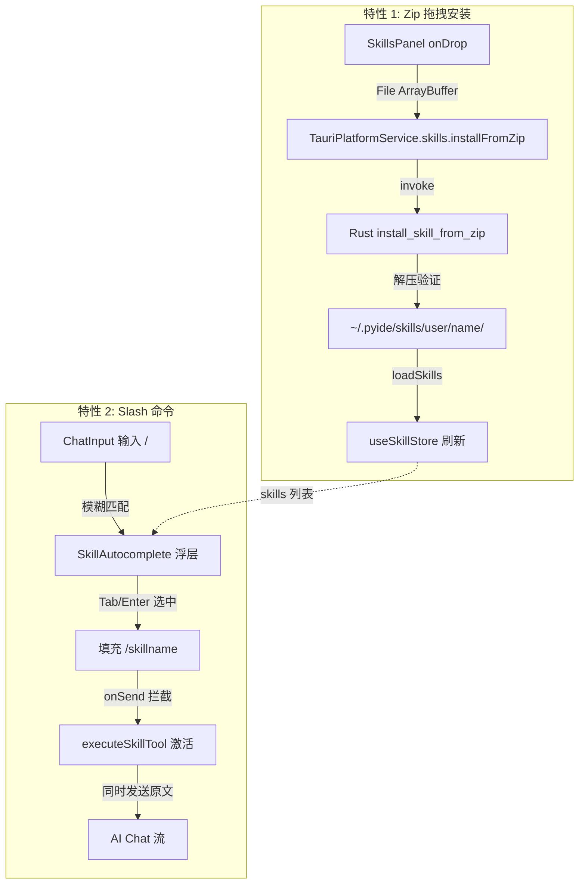

## 产品概述

为 PyIDE 的 Skill 系统新增两个交互特性：拖拽安装 zip 技能包和聊天窗口斜杠命令激活技能。

## 核心功能

### 特性 1：拖拽 zip 安装 Skill

- 用户将包含 SKILL.md（或 `<name>.md`）的 zip 文件拖拽至 SkillsPanel 面板区域
- 面板显示 drop zone 高亮视觉反馈（边框高亮 + 遮罩提示文字）
- 后端解压 zip 至 `~/.pyide/skills/user/<name>/` 目录
- 安装完成后自动刷新技能列表，新技能出现在 "User" 分组中
- 支持错误处理：非 zip 文件、无效技能结构、解压失败时显示错误提示

### 特性 2：聊天窗口 /xxx 斜杠命令激活 Skill

- 在 AI Chat 输入框中输入 `/` 字符后，弹出候选 skill 浮层
- 浮层支持模糊过滤：输入 `/ed` 显示 `/eda` 等
- 按 Tab 键自动补全选中的 skill 名称
- 按 Enter 或点击选中 skill 后，以 `/skillname` 格式填入输入框并发送
- 发送后直接在前端调用 `executeSkillTool()` 激活该 skill，而非仅依赖 AI 中介
- 若 skill 有参数提示（argumentHint），补全后保留光标位置供用户继续输入参数

## 技术栈

- **前端**: React + TypeScript + CSS Modules
- **后端**: Rust (Tauri 2)
- **状态管理**: Zustand (已有 useSkillStore)
- **Zip 处理**: Rust 端使用 `zip` crate；前端 Web API `File` 读取 zip 文件二进制数据

## 实现方案

### 整体策略

两个特性分别独立实现，共享已有 SkillService store 层。特性 1 需要 Rust 后端新增命令 + Platform 抽象层扩展；特性 2 纯前端实现，改造 ChatInput 组件。

### 特性 1：Zip 拖拽安装

**数据流**:

```
用户拖拽 zip → SkillsPanel onDrop → 读取 File 为 ArrayBuffer
  → invoke('install_skill_from_zip', { basePath, zipBytes, fileName })
  → Rust 解压到 ~/.pyide/skills/user/<name>/
  → 前端 loadSkills() 刷新列表
```

**关键决策**:

- zip 二进制数据通过 Tauri invoke 传递（而非先落盘临时文件），减少安全风险
- Rust 端使用 `zip` crate 的 `ZipArchive` 解压，验证内部必须包含 `SKILL.md` 或根级 `.md` 文件
- 解压目标为 `~/.pyide/skills/user/<zip文件名>/`（目录结构保持 zip 内部结构）
- 如果 zip 根目录只有一个子目录且包含 SKILL.md，则使用该子目录名作为 skill 名

**Rust 后端新增命令**:

```rust
#[tauri::command]
pub async fn install_skill_from_zip(
    base_path: String,      // home dir
    zip_bytes: Vec<u8>,     // zip 二进制数据
    file_name: String,      // 原始文件名（用于提取 skill 名）
) -> Result<InstallSkillResult, String>
```

返回值 `InstallSkillResult`:

```rust
pub struct InstallSkillResult {
    pub skill_name: String,
    pub install_path: String,
    pub support_files: Vec<String>,
}
```

**Platform 抽象层扩展**:

- `PlatformService.skills` 新增 `installFromZip(basePath: string, zipBytes: number[], fileName: string): Promise<InstallSkillResult>`
- `TauriPlatformService.skills` 实现对应的 `invoke` 调用
- `WebPlatformService.skills` 提供降级实现（抛出 "not supported"）

### 特性 2：Slash 命令 + 自动补全

**方案**: 在 `ChatInput.tsx` 中内联实现 autocomplete popup，不引入外部依赖。

**交互流程**:

```
用户输入 "/" → 检测 slash 模式 → 从 useSkillStore 获取 skills 列表
  → 显示候选浮层（定位在 textarea 上方）
  → 用户继续输入 "ed" → 模糊过滤候选
  → Tab / Enter 选中 → 将 "/eda " 填入 textarea → 发送消息
  → onSend 回调中拦截 slash 命令 → 调用 executeSkillTool() → 激活 skill
```

**关键决策**:

- 使用 `useSkillStore` 获取 skills 列表，避免额外 API 调用
- 浮层使用绝对定位，锚定到 textarea 上方（计算位置基于 textarea 的 getBoundingClientRect）
- 键盘导航：上/下箭头选择候选，Tab/Enter 确认，Escape 关闭浮层
- slash 命令在前端 `onSend` 中拦截：匹配到 skill 时调用 `executeSkillTool()` 激活后发送原始文本给 AI（AI 仍能看到用户意图），同时自动激活 skill
- 不阻塞 AI 的自然语言理解，斜杠命令是"快捷激活"而非"替换 AI 调用"

**ChatInput 改造要点**:

- 新增 `slashState: { active: boolean, query: string, selectedIndex: number }` 状态
- `handleKeyDown` 增加 Tab 处理和上/下箭头处理
- `handleChange` 检测当前行是否以 `/` 开头
- 新增 `SkillAutocomplete` 子组件（内联在 ChatInput 文件中）
- `onSend` 回调中检测 slash 前缀，匹配到 skill 后调用 `executeSkillTool()`

## 架构设计



## 目录结构

```
apps/desktop/
├── src-tauri/
│   ├── Cargo.toml                          # [MODIFY] 添加 zip crate 依赖
│   ├── src/
│   │   ├── lib.rs                          # [MODIFY] 注册 install_skill_from_zip 命令
│   │   └── skills.rs                       # [MODIFY] 新增 install_skill_from_zip 命令实现
│
├── src/
│   ├── components/
│   │   ├── sidebar/
│   │   │   ├── SkillsPanel.tsx             # [MODIFY] 添加 onDragOver/onDrop/drop zone UI
│   │   │   └── SkillsPanel.css             # [MODIFY] 添加 .drop-zone/.drop-zone-active 样式
│   │   └── chat/
│       ├── ChatInput.tsx                   # [MODIFY] 添加 slash 检测、autocomplete 浮层、键盘导航
│       └── ChatInput.module.css            # [MODIFY] 添加 autocomplete popup 样式
│   │
│   ├── services/
│   │   └── SkillService/
│   │       └── index.ts                    # [MODIFY] 新增 installFromZip store 方法
│   │
│   └── hooks/
│       └── useChat.ts                      # [MODIFY] sendMessage 中拦截 slash 命令激活 skill

packages/platform/src/
├── types.ts                                # [MODIFY] 新增 InstallSkillResult 类型
├── PlatformService.ts                      # [MODIFY] skills 接口新增 installFromZip
└── TauriPlatformService.ts                 # [MODIFY] 实现 installFromZip invoke 调用
```

## 实现注意事项

- **zip crate 版本**: 使用 `zip = "2"` (最新稳定版)，API 与 v1 有 breaking changes，需用 `ZipArchive::new(Cursor::new(bytes))`
- **二进制传输**: Tauri invoke 传递 `Vec<u8>` 时前端需要将 `ArrayBuffer` 转为 `Uint8Array` 再通过 invoke 传参；Tauri 2 的 invoke 对 `Vec<u8>` 参数使用 base64 编码传输
- **性能**: autocomplete 浮层渲染使用 `useMemo` 缓存过滤结果；`useSkillStore` 选择器只订阅 skills 数组避免不必要的重渲染
- **兼容性**: slash 命令拦截与现有 AI 中介模式并行工作，不破坏已有的 `skill` MCP 工具调用链
- **错误处理**: zip 安装失败时在 SkillsPanel 显示 toast/内联错误信息，不使用 alert

## 设计风格

延续 PyIDE 现有的暗色主题 IDE 风格（Catppuccin Mocha 配色体系），所有新增 UI 元素与现有组件保持视觉一致性。

## 页面规划

### SkillsPanel Drop Zone (拖拽安装区域)

- 整个 SkillsPanel 作为 drop zone
- 拖拽文件进入时：显示半透明蓝色遮罩层 + 居中图标和提示文字 "拖拽 skill zip 文件到此处安装"
- 边框变为蓝色高亮（与 accent 色一致）
- 安装中显示 loading 状态
- 安装失败显示红色错误提示

### ChatInput Skill Autocomplete (斜杠命令自动补全)

- 浮层定位在 textarea 正上方
- 最大高度 200px，超出可滚动
- 每个候选项显示：skill 名称（monospace 高亮）、来源标签、描述（截断）
- 选中项使用 accent 色背景高亮
- 键盘导航时选中项平滑跟随

## Agent Extensions

### SubAgent

- **code-explorer**
- Purpose: 在实现过程中探索 Platform 抽象层 WebPlatformService 的实现，确保新增方法的降级处理正确
- Expected outcome: 确认 WebPlatformService 中 skills 模块的完整结构，保证 installFromZip 降级实现的一致性