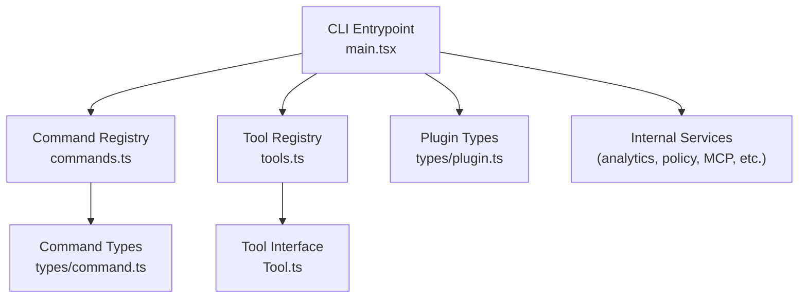
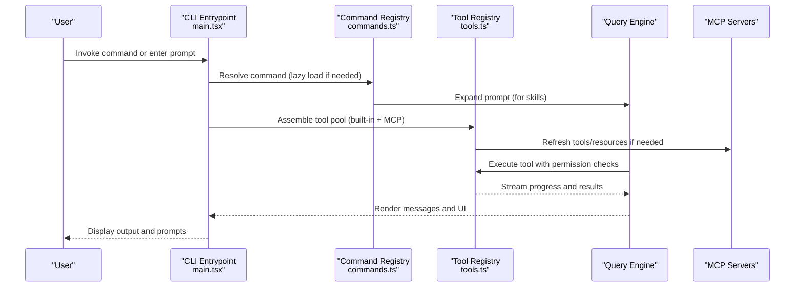
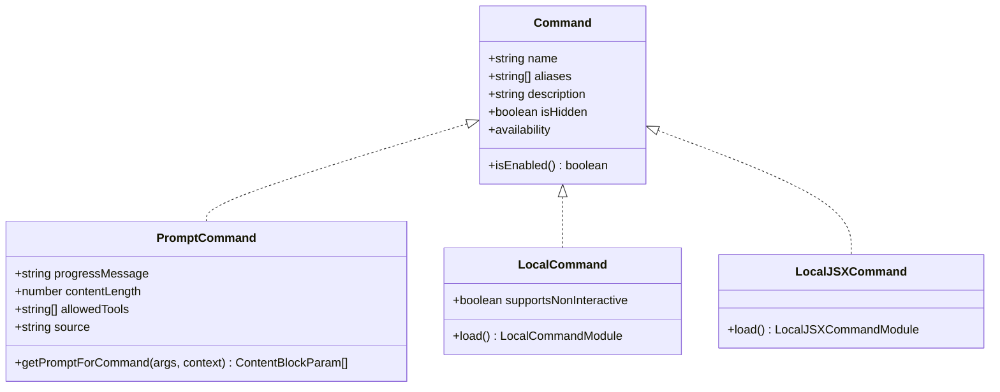
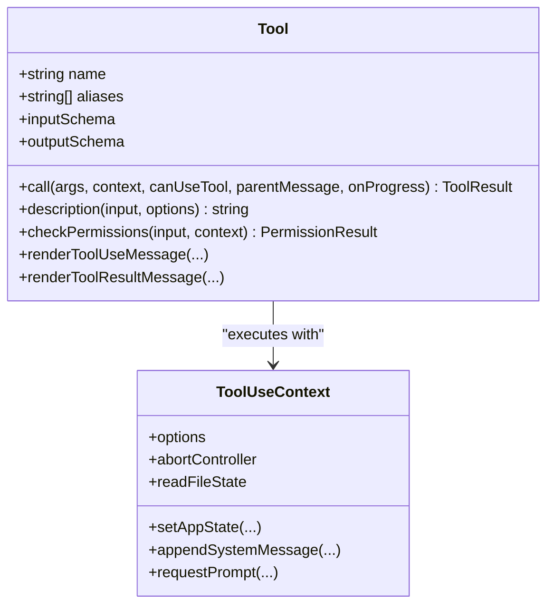
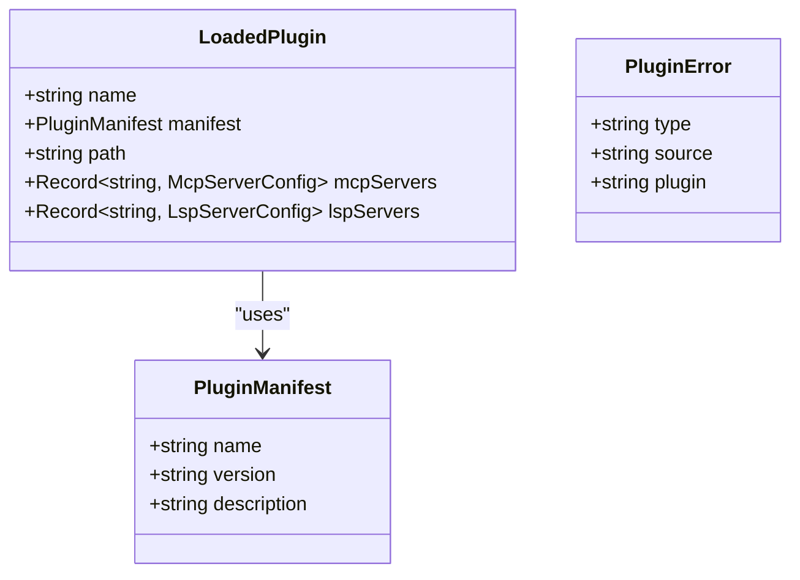
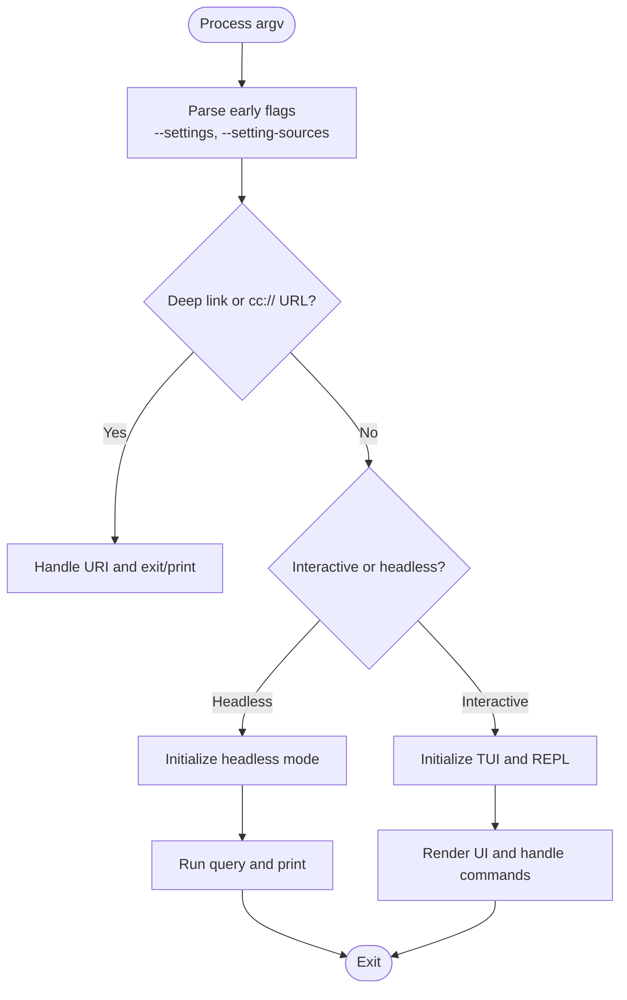
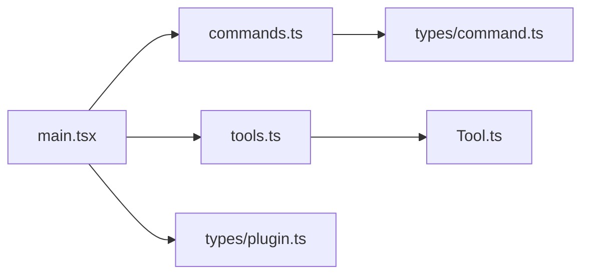

# API Reference

<cite>
**Referenced Files in This Document**
- [README.md](file://README.md)
- [main.tsx](file://restored-src/src/main.tsx)
- [commands.ts](file://restored-src/src/commands.ts)
- [tools.ts](file://restored-src/src/tools.ts)
- [Tool.ts](file://restored-src/src/Tool.ts)
- [types/command.ts](file://restored-src/src/types/command.ts)
- [types/plugin.ts](file://restored-src/src/types/plugin.ts)
</cite>

## Table of Contents
1. [Introduction](#introduction)
2. [Project Structure](#project-structure)
3. [Core Components](#core-components)
4. [Architecture Overview](#architecture-overview)
5. [Detailed Component Analysis](#detailed-component-analysis)
6. [Dependency Analysis](#dependency-analysis)
7. [Performance Considerations](#performance-considerations)
8. [Troubleshooting Guide](#troubleshooting-guide)
9. [Conclusion](#conclusion)
10. [Appendices](#appendices)

## Introduction
This document provides a comprehensive API reference for the Claude Code Python IDE. It covers the command API (interfaces, registration patterns, execution models), the tool API (interfaces, implementation patterns, lifecycle), the plugin API (interfaces, development patterns, integration points), the CLI API (command-line interfaces, parameter schemas, output formats), and internal service APIs, data structures, and type definitions. It also includes concrete usage patterns, error handling, and guidance for versioning and compatibility.

## Project Structure
The repository is a TypeScript/React-based CLI and TUI application with a modular architecture:
- CLI entrypoint initializes environment, telemetry, settings, and command/tool registries.
- Commands are centrally defined and lazily loaded; they can be prompt-based, local, or JSX-based.
- Tools are typed with Zod schemas, permission checks, and rendering hooks.
- Plugins contribute commands, skills, hooks, MCP/LSP servers, and output styles.
- Services integrate with Anthropic APIs, MCP, analytics, and policy enforcement.

**Diagram sources**
- [main.tsx:585-800](file://restored-src/src/main.tsx#L585-L800)
- [commands.ts:258-346](file://restored-src/src/commands.ts#L258-L346)
- [tools.ts:193-327](file://restored-src/src/tools.ts#L193-L327)
- [types/command.ts:205-217](file://restored-src/src/types/command.ts#L205-L217)
- [Tool.ts:362-473](file://restored-src/src/Tool.ts#L362-L473)
- [types/plugin.ts:48-70](file://restored-src/src/types/plugin.ts#L48-L70)

**Section sources**
- [README.md:13-49](file://README.md#L13-L49)
- [main.tsx:585-800](file://restored-src/src/main.tsx#L585-L800)

## Core Components
- Command API: Centralized command registry, availability gating, and dynamic loading. Commands support prompt expansion, local execution, and JSX rendering.
- Tool API: Strongly typed tool interface with Zod schemas, permission checks, progress rendering, and result messaging.
- Plugin API: Plugin manifests, component loading, MCP/LSP integration, and error modeling.
- CLI API: Entrypoint logic, early argv processing, deep-link handling, and session modes.
- Internal Services: Telemetry, policy limits, MCP configuration, and analytics.

**Section sources**
- [commands.ts:258-517](file://restored-src/src/commands.ts#L258-L517)
- [tools.ts:193-327](file://restored-src/src/tools.ts#L193-L327)
- [types/plugin.ts:48-289](file://restored-src/src/types/plugin.ts#L48-L289)
- [main.tsx:585-800](file://restored-src/src/main.tsx#L585-L800)

## Architecture Overview
The system orchestrates commands and tools around a central query engine. Commands can be invoked by users or by the model (skills). Tools are permission-checked, executed, and rendered with progress and result UI. Plugins extend capabilities and integrate MCP/LSP servers.

**Diagram sources**
- [main.tsx:585-800](file://restored-src/src/main.tsx#L585-L800)
- [commands.ts:476-517](file://restored-src/src/commands.ts#L476-L517)
- [tools.ts:345-389](file://restored-src/src/tools.ts#L345-L389)

## Detailed Component Analysis

### Command API
- Interfaces and Registration
  - Central registry aggregates built-in, plugin, and dynamic skills. Availability gating and enablement checks are enforced.
  - Commands support prompt expansion, local execution, and JSX rendering with lazy loading.
- Execution Model
  - Prompt commands expand into model-visible content.
  - Local commands return text or compact results; JSX commands render UI and can modify state.
  - Bridge-safe command allowlist restricts remote execution to safe commands.

**Diagram sources**
- [types/command.ts:205-217](file://restored-src/src/types/command.ts#L205-L217)
- [types/command.ts:25-57](file://restored-src/src/types/command.ts#L25-L57)
- [types/command.ts:74-78](file://restored-src/src/types/command.ts#L74-L78)
- [types/command.ts:144-152](file://restored-src/src/types/command.ts#L144-L152)

- Key Functions and Patterns
  - getCommands: Loads and merges commands from multiple sources, applies availability and enablement filters, and inserts dynamic skills.
  - filterCommandsForRemoteMode: Pre-filters commands for remote mode safety.
  - getMcpSkillCommands: Extracts MCP-provided skills.
  - getSkillToolCommands and getSlashCommandToolSkills: Build skill lists for model invocation and slash commands.

**Section sources**
- [commands.ts:476-517](file://restored-src/src/commands.ts#L476-L517)
- [commands.ts:619-686](file://restored-src/src/commands.ts#L619-L686)
- [commands.ts:547-559](file://restored-src/src/commands.ts#L547-L559)
- [commands.ts:563-608](file://restored-src/src/commands.ts#L563-L608)

### Tool API
- Interfaces and Implementation
  - Tool interface defines call, description, schemas, permission checks, progress rendering, and result messaging.
  - Tools are assembled from built-in and MCP sources, filtered by deny rules, and deduplicated by name.
- Lifecycle Management
  - Permission context governs allow/deny/ask rules and working directories.
  - ToolUseContext carries options, abort signals, file state, and callbacks for UI updates.
  - Tool pools are merged with MCP tools, respecting prompt-cache stability.

**Diagram sources**
- [Tool.ts:362-473](file://restored-src/src/Tool.ts#L362-L473)
- [Tool.ts:158-300](file://restored-src/src/Tool.ts#L158-L300)

- Key Functions and Patterns
  - getTools: Returns filtered tools based on permission context and mode flags.
  - assembleToolPool: Combines built-in and MCP tools, deduplicating by name and sorting for cache stability.
  - getMergedTools: Returns combined list including MCP tools.
  - filterToolsByDenyRules: Applies deny rules to MCP and built-in tools.

**Section sources**
- [tools.ts:271-327](file://restored-src/src/tools.ts#L271-L327)
- [tools.ts:345-389](file://restored-src/src/tools.ts#L345-L389)
- [Tool.ts:123-148](file://restored-src/src/Tool.ts#L123-L148)

### Plugin API
- Interfaces and Development Patterns
  - Plugin manifest and component types define commands, agents, skills, hooks, output styles, MCP/LSP servers, and settings.
  - Built-in plugins ship with the CLI and can be toggled by users.
  - Plugin loader returns enabled/disabled lists and detailed errors.
- Integration Points
  - Plugins contribute commands and skills to the command registry.
  - MCP/LSP servers are validated and integrated into the tooling pipeline.

**Diagram sources**
- [types/plugin.ts:11-11](file://restored-src/src/types/plugin.ts#L11-L11)
- [types/plugin.ts:48-70](file://restored-src/src/types/plugin.ts#L48-L70)
- [types/plugin.ts:101-283](file://restored-src/src/types/plugin.ts#L101-L283)

- Key Types and Patterns
  - BuiltinPluginDefinition: Defines built-in plugin metadata and availability.
  - LoadedPlugin: Aggregates plugin state, paths, and components.
  - PluginError: Discriminated union of error types with display helpers.

**Section sources**
- [types/plugin.ts:18-35](file://restored-src/src/types/plugin.ts#L18-L35)
- [types/plugin.ts:48-70](file://restored-src/src/types/plugin.ts#L48-L70)
- [types/plugin.ts:101-283](file://restored-src/src/types/plugin.ts#L101-L283)

### CLI API
- Entrypoint and Early Processing
  - Initializes telemetry, settings, and environment; handles deep links, direct connect, SSH, and assistant modes.
  - Parses flags like --settings and --setting-sources early to filter settings before init.
- Command-Line Interfaces and Parameter Schemas
  - Supports headless mode (-p/--print) and non-interactive sessions.
  - Handles MCP serve command detection and entrypoint routing.
- Output Formats
  - Supports structured output and NDJSON-safe printing for machine consumption.

**Diagram sources**
- [main.tsx:517-540](file://restored-src/src/main.tsx#L517-L540)
- [main.tsx:585-800](file://restored-src/src/main.tsx#L585-L800)

**Section sources**
- [main.tsx:517-540](file://restored-src/src/main.tsx#L517-L540)
- [main.tsx:585-800](file://restored-src/src/main.tsx#L585-L800)

### Internal Service APIs, Data Structures, and Type Definitions
- Command Types
  - CommandBase, PromptCommand, LocalCommand, LocalJSXCommand define the command contract and execution modes.
- Tool Types
  - ToolUseContext, ToolPermissionContext, ToolProgressData, ValidationResult, and ToolResult define the tool execution and rendering contracts.
- Plugin Types
  - PluginManifest, LoadedPlugin, PluginError define plugin metadata, lifecycle, and error reporting.

**Section sources**
- [types/command.ts:16-217](file://restored-src/src/types/command.ts#L16-L217)
- [Tool.ts:158-300](file://restored-src/src/Tool.ts#L158-L300)
- [Tool.ts:362-473](file://restored-src/src/Tool.ts#L362-L473)
- [types/plugin.ts:18-35](file://restored-src/src/types/plugin.ts#L18-L35)

## Dependency Analysis
- Command Registry depends on:
  - Command definitions, availability gating, enablement checks, and dynamic skill discovery.
- Tool Registry depends on:
  - Permission context, MCP tool integration, and REPL mode filtering.
- CLI Entrypoint depends on:
  - Command and tool registries, telemetry, settings, and deep-link handlers.

**Diagram sources**
- [commands.ts:258-346](file://restored-src/src/commands.ts#L258-L346)
- [tools.ts:193-327](file://restored-src/src/tools.ts#L193-L327)
- [Tool.ts:362-473](file://restored-src/src/Tool.ts#L362-L473)
- [types/command.ts:205-217](file://restored-src/src/types/command.ts#L205-L217)
- [types/plugin.ts:48-70](file://restored-src/src/types/plugin.ts#L48-L70)
- [main.tsx:585-800](file://restored-src/src/main.tsx#L585-L800)

**Section sources**
- [commands.ts:258-346](file://restored-src/src/commands.ts#L258-L346)
- [tools.ts:193-327](file://restored-src/src/tools.ts#L193-L327)
- [main.tsx:585-800](file://restored-src/src/main.tsx#L585-L800)

## Performance Considerations
- Deferred prefetches: Background warm-up tasks are deferred post-render to reduce startup latency.
- Memoization: Command and skill loading are memoized by working directory to avoid repeated disk I/O.
- Prompt-cache stability: Tool pools are sorted and deduplicated to maintain stable cache keys across sessions.
- Non-interactive mode: Certain prefetches are skipped to minimize overhead in scripted runs.

[No sources needed since this section provides general guidance]

## Troubleshooting Guide
- Command Not Found
  - Use getCommand to locate a command by name or alias; the function throws with a descriptive message listing available commands.
- Plugin Load Failures
  - PluginError discriminated union provides detailed error types (e.g., manifest parse/validation, marketplace load, MCP/LSP server issues). Use getPluginErrorMessage for user-friendly messages.
- Permission Denied
  - Tool.checkPermissions returns a PermissionResult; permission context includes allow/deny/ask rules and additional working directories.
- Migration Issues
  - runMigrations coordinates versioned migrations; ensure migrationVersion is updated after applying changes.

**Section sources**
- [commands.ts:688-719](file://restored-src/src/commands.ts#L688-L719)
- [types/plugin.ts:101-283](file://restored-src/src/types/plugin.ts#L101-L283)
- [Tool.ts:500-503](file://restored-src/src/Tool.ts#L500-L503)
- [main.tsx:326-352](file://restored-src/src/main.tsx#L326-L352)

## Conclusion
The Claude Code Python IDE exposes a robust, typed API surface for commands, tools, plugins, and CLI operations. Its architecture emphasizes modularity, permission safety, and performance. By leveraging the provided interfaces and patterns, developers can extend capabilities through plugins, add new commands and tools, and integrate with MCP/LSP ecosystems while maintaining compatibility and reliability.

[No sources needed since this section summarizes without analyzing specific files]

## Appendices

### Versioning, Compatibility, and Migration Guidance
- Migration Versioning
  - CURRENT_MIGRATION_VERSION tracks applied migrations; runMigrations ensures consistent upgrades across versions.
- Model String Migrations
  - Example: runMigrations includes model string migrations (e.g., Sonnet versions) to align with provider updates.
- Backward Compatibility
  - Tool interfaces include default implementations for optional methods to reduce breaking changes.
  - Command interfaces support aliases and user-facing names to accommodate renaming without disrupting user workflows.

**Section sources**
- [main.tsx:326-352](file://restored-src/src/main.tsx#L326-L352)
- [Tool.ts:757-792](file://restored-src/src/Tool.ts#L757-L792)
- [types/command.ts:209-211](file://restored-src/src/types/command.ts#L209-L211)