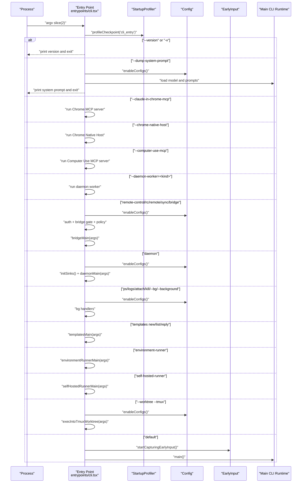
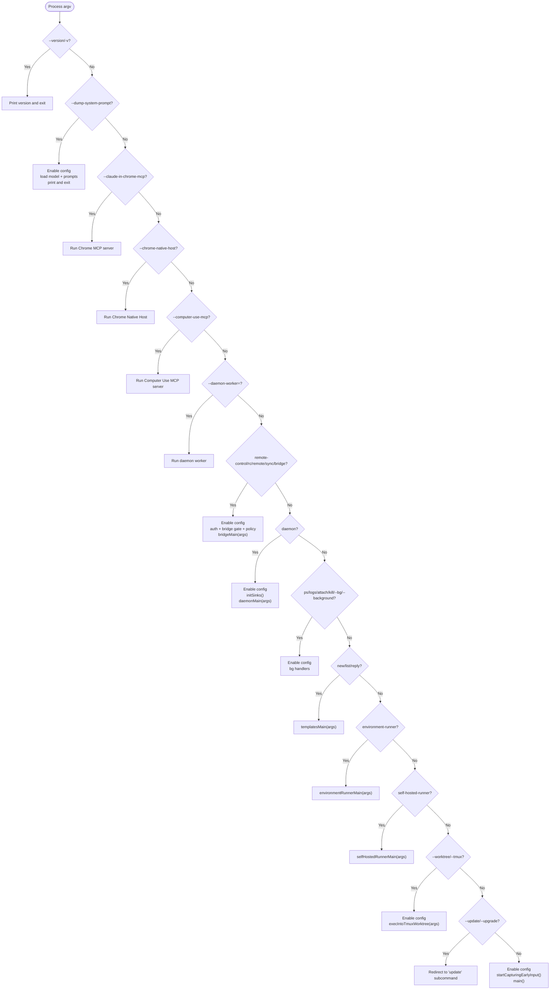
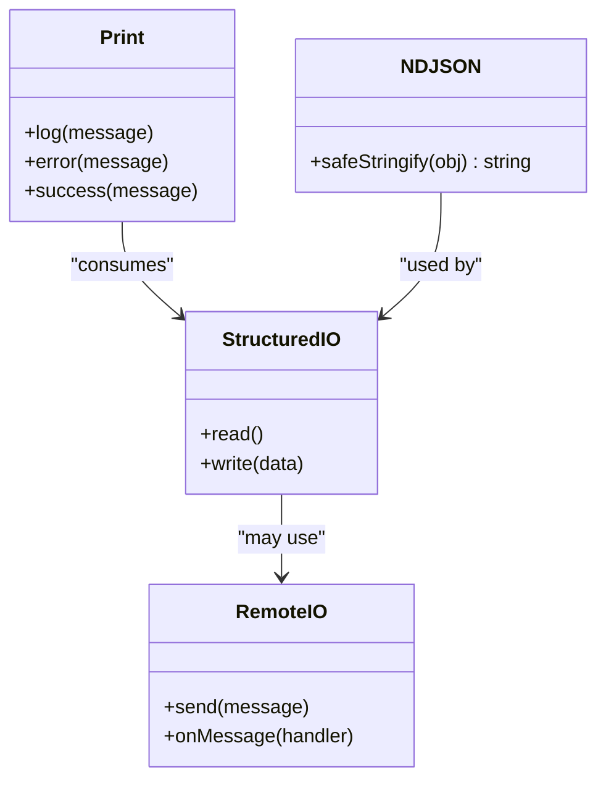
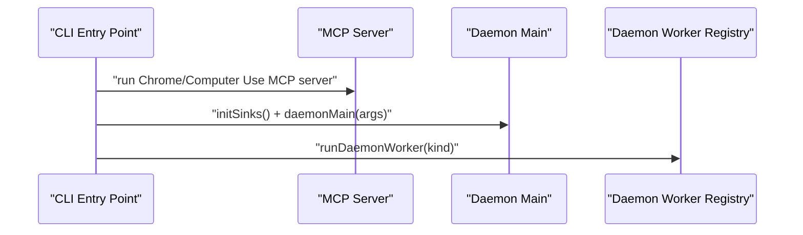
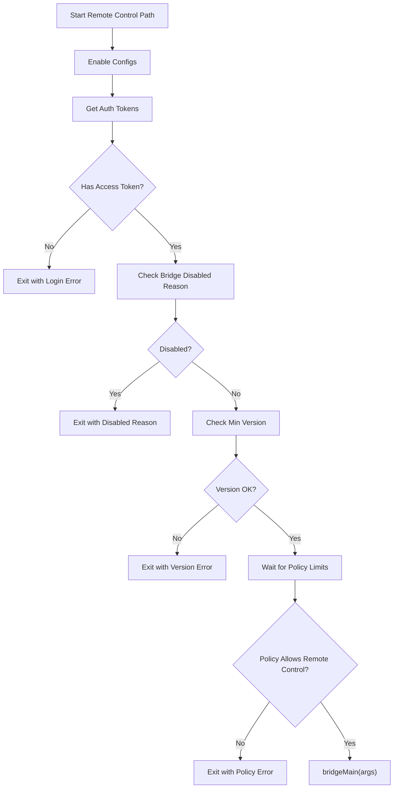
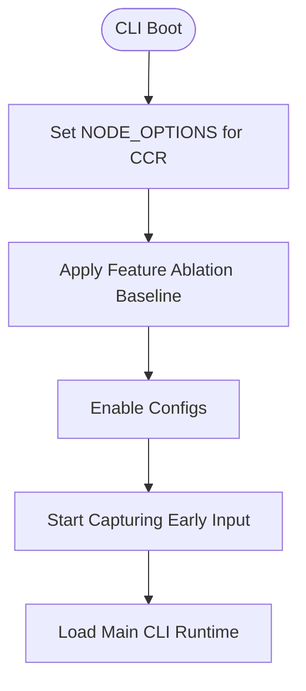

# CLI API

<cite>
**Referenced Files in This Document**
- [cli.tsx](file://restored-src/src/entrypoints/cli.tsx)
- [print.ts](file://restored-src/src/cli/print.ts)
- [remoteIO.ts](file://restored-src/src/cli/remoteIO.ts)
- [structuredIO.ts](file://restored-src/src/cli/structuredIO.ts)
- [ndjsonSafeStringify.ts](file://restored-src/src/cli/ndjsonSafeStringify.ts)
- [exit.ts](file://restored-src/src/cli/exit.ts)
- [update.ts](file://restored-src/src/cli/update.ts)
- [config.js](file://restored-src/src/utils/config.js)
- [model.js](file://restored-src/src/utils/model/model.js)
- [prompts.js](file://restored-src/src/constants/prompts.js)
- [startupProfiler.js](file://restored-src/src/utils/startupProfiler.js)
- [process.js](file://restored-src/src/utils/process.js)
- [auth.js](file://restored-src/src/utils/auth.js)
- [policyLimits/index.js](file://restored-src/src/services/policyLimits/index.js)
- [earlyInput.js](file://restored-src/src/utils/earlyInput.js)
- [worktreeModeEnabled.js](file://restored-src/src/utils/worktreeModeEnabled.js)
- [worktree.js](file://restored-src/src/utils/worktree.js)
- [sinks.js](file://restored-src/src/utils/sinks.js)
- [daemon/main.js](file://restored-src/src/daemon/main.js)
- [daemon/workerRegistry.js](file://restored-src/src/daemon/workerRegistry.js)
- [bridge/bridgeEnabled.js](file://restored-src/src/bridge/bridgeEnabled.js)
- [bridge/bridgeMain.js](file://restored-src/src/bridge/bridgeMain.js)
- [bridge/types.js](file://restored-src/src/bridge/types.js)
- [environment-runner/main.js](file://restored-src/src/environment-runner/main.js)
- [self-hosted-runner/main.js](file://restored-src/src/self-hosted-runner/main.js)
- [claudeInChrome/mcpServer.js](file://restored-src/src/utils/claudeInChrome/mcpServer.js)
- [claudeInChrome/chromeNativeHost.js](file://restored-src/src/utils/claudeInChrome/chromeNativeHost.js)
- [computerUse/mcpServer.js](file://restored-src/src/utils/computerUse/mcpServer.js)
</cite>

## Table of Contents
1. [Introduction](#introduction)
2. [Project Structure](#project-structure)
3. [Core Components](#core-components)
4. [Architecture Overview](#architecture-overview)
5. [Detailed Component Analysis](#detailed-component-analysis)
6. [Dependency Analysis](#dependency-analysis)
7. [Performance Considerations](#performance-considerations)
8. [Troubleshooting Guide](#troubleshooting-guide)
9. [Conclusion](#conclusion)
10. [Appendices](#appendices)

## Introduction
This document describes the Command Line Interface (CLI) entry points, argument parsing, command dispatching, and output formatting for the project. It explains how the CLI boots, recognizes special flags, performs fast-path dispatches, and integrates with transports and communication protocols. It also documents configuration, environment variables, runtime options, and security controls. Examples are provided by referencing actual source locations to guide practical usage.

## Project Structure
The CLI entrypoint is defined in the entrypoints module and orchestrates fast-path routes before delegating to the main CLI runtime. Supporting modules handle printing, structured I/O, NDJSON serialization, exit handling, updates, and environment configuration.

```mermaid
graph TB
EP["Entry Point<br/>entrypoints/cli.tsx"] --> CFG["Config Enable<br/>utils/config.js"]
EP --> PROF["Startup Profiler<br/>utils/startupProfiler.js"]
EP --> AUTH["Auth Tokens<br/>utils/auth.js"]
EP --> PROMPT["System Prompt<br/>constants/prompts.js"]
EP --> MODEL["Model Selector<br/>utils/model/model.js"]
EP --> PROC["Process Utils<br/>utils/process.js"]
EP --> POL["Policy Limits<br/>services/policyLimits/index.js"]
EP --> BRDG["Bridge Gate & Main<br/>bridge/bridgeEnabled.js<br/>bridge/bridgeMain.js<br/>bridge/types.js"]
EP --> DAEM["Daemon Main<br/>daemon/main.js"]
EP --> WRKR["Daemon Worker Registry<br/>daemon/workerRegistry.js"]
EP --> ENV["Environment Runner<br/>environment-runner/main.js"]
EP --> SHR["Self-Hosted Runner<br/>self-hosted-runner/main.js"]
EP --> CHRM["Chrome MCP Server<br/>utils/claudeInChrome/mcpServer.js"]
EP --> CHRN["Chrome Native Host<br/>utils/claudeInChrome/chromeNativeHost.js"]
EP --> CMPC["Computer Use MCP Server<br/>utils/computerUse/mcpServer.js"]
EP --> EINP["Early Input Capture<br/>utils/earlyInput.js"]
EP --> WTEN["Worktree Mode Enabled<br/>utils/worktreeModeEnabled.js"]
EP --> WTK["Worktree Exec<br/>utils/worktree.js"]
EP --> SINK["Sinks Init<br/>utils/sinks.js"]
OUT["Output Formatting<br/>cli/print.ts"] --> NDJ["NDJSON Safe Stringify<br/>cli/ndjsonSafeStringify.ts"]
IO["Structured I/O<br/>cli/structuredIO.ts"] --> REM["Remote I/O<br/>cli/remoteIO.ts"]
CLI["Main CLI Runtime<br/>main.js (imported dynamically)"] --> OUT
CLI --> IO
CLI --> REM
```

**Diagram sources**
- [cli.tsx](file://restored-src/src/entrypoints/cli.tsx)
- [config.js](file://restored-src/src/utils/config.js)
- [startupProfiler.js](file://restored-src/src/utils/startupProfiler.js)
- [auth.js](file://restored-src/src/utils/auth.js)
- [prompts.js](file://restored-src/src/constants/prompts.js)
- [model.js](file://restored-src/src/utils/model/model.js)
- [process.js](file://restored-src/src/utils/process.js)
- [policyLimits/index.js](file://restored-src/src/services/policyLimits/index.js)
- [bridge/bridgeEnabled.js](file://restored-src/src/bridge/bridgeEnabled.js)
- [bridge/bridgeMain.js](file://restored-src/src/bridge/bridgeMain.js)
- [bridge/types.js](file://restored-src/src/bridge/types.js)
- [daemon/main.js](file://restored-src/src/daemon/main.js)
- [daemon/workerRegistry.js](file://restored-src/src/daemon/workerRegistry.js)
- [environment-runner/main.js](file://restored-src/src/environment-runner/main.js)
- [self-hosted-runner/main.js](file://restored-src/src/self-hosted-runner/main.js)
- [claudeInChrome/mcpServer.js](file://restored-src/src/utils/claudeInChrome/mcpServer.js)
- [claudeInChrome/chromeNativeHost.js](file://restored-src/src/utils/claudeInChrome/chromeNativeHost.js)
- [computerUse/mcpServer.js](file://restored-src/src/utils/computerUse/mcpServer.js)
- [earlyInput.js](file://restored-src/src/utils/earlyInput.js)
- [worktreeModeEnabled.js](file://restored-src/src/utils/worktreeModeEnabled.js)
- [worktree.js](file://restored-src/src/utils/worktree.js)
- [sinks.js](file://restored-src/src/utils/sinks.js)
- [print.ts](file://restored-src/src/cli/print.ts)
- [structuredIO.ts](file://restored-src/src/cli/structuredIO.ts)
- [remoteIO.ts](file://restored-src/src/cli/remoteIO.ts)
- [ndjsonSafeStringify.ts](file://restored-src/src/cli/ndjsonSafeStringify.ts)

**Section sources**
- [cli.tsx](file://restored-src/src/entrypoints/cli.tsx)

## Core Components
- CLI Entry Point: Orchestrates fast-path detection and dynamic imports for specialized modes.
- Startup Profiling: Records timing checkpoints for performance diagnostics.
- Configuration and Environment: Enables configuration and sets environment variables for resource limits.
- Authentication and Policy: Validates tokens, checks feature gates, enforces policy limits.
- Transport and Communication: Provides structured I/O, remote I/O, and NDJSON-safe serialization for output.
- Exit and Update Utilities: Centralized exit handling and update redirection.

**Section sources**
- [cli.tsx](file://restored-src/src/entrypoints/cli.tsx)
- [startupProfiler.js](file://restored-src/src/utils/startupProfiler.js)
- [config.js](file://restored-src/src/utils/config.js)
- [auth.js](file://restored-src/src/utils/auth.js)
- [policyLimits/index.js](file://restored-src/src/services/policyLimits/index.js)
- [process.js](file://restored-src/src/utils/process.js)
- [print.ts](file://restored-src/src/cli/print.ts)
- [structuredIO.ts](file://restored-src/src/cli/structuredIO.ts)
- [remoteIO.ts](file://restored-src/src/cli/remoteIO.ts)
- [ndjsonSafeStringify.ts](file://restored-src/src/cli/ndjsonSafeStringify.ts)
- [update.ts](file://restored-src/src/cli/update.ts)

## Architecture Overview
The CLI bootstraps by inspecting process arguments and routing to specialized handlers when applicable. Otherwise, it initializes configuration, captures early input, and delegates to the main CLI runtime.

**Diagram sources**
- [cli.tsx](file://restored-src/src/entrypoints/cli.tsx)
- [startupProfiler.js](file://restored-src/src/utils/startupProfiler.js)
- [config.js](file://restored-src/src/utils/config.js)
- [earlyInput.js](file://restored-src/src/utils/earlyInput.js)
- [daemon/main.js](file://restored-src/src/daemon/main.js)
- [daemon/workerRegistry.js](file://restored-src/src/daemon/workerRegistry.js)
- [bridge/bridgeEnabled.js](file://restored-src/src/bridge/bridgeEnabled.js)
- [bridge/bridgeMain.js](file://restored-src/src/bridge/bridgeMain.js)
- [environment-runner/main.js](file://restored-src/src/environment-runner/main.js)
- [self-hosted-runner/main.js](file://restored-src/src/self-hosted-runner/main.js)
- [claudeInChrome/mcpServer.js](file://restored-src/src/utils/claudeInChrome/mcpServer.js)
- [claudeInChrome/chromeNativeHost.js](file://restored-src/src/utils/claudeInChrome/chromeNativeHost.js)
- [computerUse/mcpServer.js](file://restored-src/src/utils/computerUse/mcpServer.js)

## Detailed Component Analysis

### CLI Entry Point and Argument Parsing
- Fast-path detection for version, system prompt dumping, Chrome MCP, Chrome Native Host, Computer Use MCP, daemon worker, remote control, daemon, background sessions, templates, environment runner, self-hosted runner, tmux worktree, and update redirection.
- Special environment variable settings for containerized environments and feature ablation baselines.
- Dynamic imports to minimize module evaluation for fast paths.

**Diagram sources**
- [cli.tsx](file://restored-src/src/entrypoints/cli.tsx)

**Section sources**
- [cli.tsx](file://restored-src/src/entrypoints/cli.tsx)

### Output Formatting and Structured I/O
- Printing utilities provide consistent output formatting.
- Structured I/O and remote I/O define transport boundaries for CLI interactions.
- NDJSON-safe serialization ensures robust JSON streaming.

**Diagram sources**
- [print.ts](file://restored-src/src/cli/print.ts)
- [structuredIO.ts](file://restored-src/src/cli/structuredIO.ts)
- [remoteIO.ts](file://restored-src/src/cli/remoteIO.ts)
- [ndjsonSafeStringify.ts](file://restored-src/src/cli/ndjsonSafeStringify.ts)

**Section sources**
- [print.ts](file://restored-src/src/cli/print.ts)
- [structuredIO.ts](file://restored-src/src/cli/structuredIO.ts)
- [remoteIO.ts](file://restored-src/src/cli/remoteIO.ts)
- [ndjsonSafeStringify.ts](file://restored-src/src/cli/ndjsonSafeStringify.ts)

### Transport Mechanisms and Communication Protocols
- The CLI integrates with MCP servers for Chrome and Computer Use scenarios.
- Daemon and worker processes are supported for long-running operations.
- Background session management is available for process lifecycle control.

**Diagram sources**
- [cli.tsx](file://restored-src/src/entrypoints/cli.tsx)
- [daemon/main.js](file://restored-src/src/daemon/main.js)
- [daemon/workerRegistry.js](file://restored-src/src/daemon/workerRegistry.js)
- [claudeInChrome/mcpServer.js](file://restored-src/src/utils/claudeInChrome/mcpServer.js)
- [computerUse/mcpServer.js](file://restored-src/src/utils/computerUse/mcpServer.js)

**Section sources**
- [cli.tsx](file://restored-src/src/entrypoints/cli.tsx)
- [daemon/main.js](file://restored-src/src/daemon/main.js)
- [daemon/workerRegistry.js](file://restored-src/src/daemon/workerRegistry.js)
- [claudeInChrome/mcpServer.js](file://restored-src/src/utils/claudeInChrome/mcpServer.js)
- [computerUse/mcpServer.js](file://restored-src/src/utils/computerUse/mcpServer.js)

### Security, Authentication, and Authorization
- Authentication tokens are validated before enabling bridge features.
- Feature gates and minimum version checks ensure compatibility.
- Policy limits enforce organizational controls for remote control capabilities.

**Diagram sources**
- [cli.tsx](file://restored-src/src/entrypoints/cli.tsx)
- [auth.js](file://restored-src/src/utils/auth.js)
- [bridge/bridgeEnabled.js](file://restored-src/src/bridge/bridgeEnabled.js)
- [bridge/types.js](file://restored-src/src/bridge/types.js)
- [policyLimits/index.js](file://restored-src/src/services/policyLimits/index.js)

**Section sources**
- [cli.tsx](file://restored-src/src/entrypoints/cli.tsx)
- [auth.js](file://restored-src/src/utils/auth.js)
- [bridge/bridgeEnabled.js](file://restored-src/src/bridge/bridgeEnabled.js)
- [bridge/types.js](file://restored-src/src/bridge/types.js)
- [policyLimits/index.js](file://restored-src/src/services/policyLimits/index.js)

### Configuration, Environment Variables, and Runtime Options
- Environment variables are set for containerized execution and feature ablation.
- Configuration enabling is centralized and invoked at appropriate fast-path stages.
- Early input capture is initiated before loading the main runtime.

**Diagram sources**
- [cli.tsx](file://restored-src/src/entrypoints/cli.tsx)
- [config.js](file://restored-src/src/utils/config.js)
- [earlyInput.js](file://restored-src/src/utils/earlyInput.js)

**Section sources**
- [cli.tsx](file://restored-src/src/entrypoints/cli.tsx)
- [config.js](file://restored-src/src/utils/config.js)
- [earlyInput.js](file://restored-src/src/utils/earlyInput.js)

### Examples of CLI Usage Patterns
- Version query: pass a single argument that matches the version flags to print the version and exit without loading the rest of the CLI.
- System prompt dump: pass the system prompt dump flag to render and print the current system prompt, then exit.
- Chrome integration: pass the Chrome MCP or Chrome Native Host flags to run the respective server/host.
- Daemon operations: pass the daemon worker flag with a kind to spawn a worker, or pass the daemon command to run the supervisor.
- Remote control: pass the remote control family of commands to enable bridge mode after validating auth, gates, and policy.
- Background sessions: pass ps/logs/attach/kill or background flags to manage sessions.
- Templates: pass new/list/reply to run template jobs.
- Environment runner: pass the environment runner command to run a headless BYOC runner.
- Self-hosted runner: pass the self-hosted runner command to run a headless runner against the SelfHostedRunnerWorkerService API.
- Worktree and tmux: combine worktree flags with tmux to execute into tmux before normal CLI execution.

Note: These behaviors are implemented in the entrypoint and specialized handlers. Refer to the sources for exact invocation semantics.

**Section sources**
- [cli.tsx](file://restored-src/src/entrypoints/cli.tsx)

## Dependency Analysis
The CLI entrypoint depends on configuration, profiling, authentication, policy enforcement, and specialized handlers. Output and I/O modules depend on each other to provide robust transport and formatting.

```mermaid
graph TB
CLI["entrypoints/cli.tsx"] --> CFG["utils/config.js"]
CLI --> PROF["utils/startupProfiler.js"]
CLI --> AUTH["utils/auth.js"]
CLI --> PROMPT["constants/prompts.js"]
CLI --> MODEL["utils/model/model.js"]
CLI --> PROC["utils/process.js"]
CLI --> POL["services/policyLimits/index.js"]
CLI --> BRDG["bridge/*"]
CLI --> DAEM["daemon/*"]
CLI --> ENV["environment-runner/main.js"]
CLI --> SHR["self-hosted-runner/main.js"]
CLI --> CHRM["utils/claudeInChrome/mcpServer.js"]
CLI --> CHRN["utils/claudeInChrome/chromeNativeHost.js"]
CLI --> CMPC["utils/computerUse/mcpServer.js"]
CLI --> EINP["utils/earlyInput.js"]
CLI --> WTEN["utils/worktreeModeEnabled.js"]
CLI --> WTK["utils/worktree.js"]
CLI --> SINK["utils/sinks.js"]
OUT["cli/print.ts"] --> NDJ["cli/ndjsonSafeStringify.ts"]
IO["cli/structuredIO.ts"] --> REM["cli/remoteIO.ts"]
```

**Diagram sources**
- [cli.tsx](file://restored-src/src/entrypoints/cli.tsx)
- [config.js](file://restored-src/src/utils/config.js)
- [startupProfiler.js](file://restored-src/src/utils/startupProfiler.js)
- [auth.js](file://restored-src/src/utils/auth.js)
- [prompts.js](file://restored-src/src/constants/prompts.js)
- [model.js](file://restored-src/src/utils/model/model.js)
- [process.js](file://restored-src/src/utils/process.js)
- [policyLimits/index.js](file://restored-src/src/services/policyLimits/index.js)
- [bridge/bridgeEnabled.js](file://restored-src/src/bridge/bridgeEnabled.js)
- [bridge/bridgeMain.js](file://restored-src/src/bridge/bridgeMain.js)
- [bridge/types.js](file://restored-src/src/bridge/types.js)
- [daemon/main.js](file://restored-src/src/daemon/main.js)
- [daemon/workerRegistry.js](file://restored-src/src/daemon/workerRegistry.js)
- [environment-runner/main.js](file://restored-src/src/environment-runner/main.js)
- [self-hosted-runner/main.js](file://restored-src/src/self-hosted-runner/main.js)
- [claudeInChrome/mcpServer.js](file://restored-src/src/utils/claudeInChrome/mcpServer.js)
- [claudeInChrome/chromeNativeHost.js](file://restored-src/src/utils/claudeInChrome/chromeNativeHost.js)
- [computerUse/mcpServer.js](file://restored-src/src/utils/computerUse/mcpServer.js)
- [earlyInput.js](file://restored-src/src/utils/earlyInput.js)
- [worktreeModeEnabled.js](file://restored-src/src/utils/worktreeModeEnabled.js)
- [worktree.js](file://restored-src/src/utils/worktree.js)
- [sinks.js](file://restored-src/src/utils/sinks.js)
- [print.ts](file://restored-src/src/cli/print.ts)
- [structuredIO.ts](file://restored-src/src/cli/structuredIO.ts)
- [remoteIO.ts](file://restored-src/src/cli/remoteIO.ts)
- [ndjsonSafeStringify.ts](file://restored-src/src/cli/ndjsonSafeStringify.ts)

**Section sources**
- [cli.tsx](file://restored-src/src/entrypoints/cli.tsx)

## Performance Considerations
- Fast-path routes avoid loading heavy modules by using dynamic imports and feature flags.
- Startup profiling checkpoints are inserted around major transitions to identify bottlenecks.
- Early input capture is started before importing the main runtime to reduce latency.

[No sources needed since this section provides general guidance]

## Troubleshooting Guide
- Version and system prompt dumps: Use the documented flags to quickly diagnose versions or system prompts.
- Authentication errors: Remote control requires valid access tokens; otherwise, the CLI exits with a login error.
- Bridge disabled reasons: If the bridge is disabled by policy or environment, the CLI exits with the specific reason.
- Policy limit violations: Remote control may be disabled by organizational policy; the CLI exits with an explanatory message.
- Exit utilities: Centralized exit handling ensures consistent error reporting and exit codes.

**Section sources**
- [cli.tsx](file://restored-src/src/entrypoints/cli.tsx)
- [process.js](file://restored-src/src/utils/process.js)
- [auth.js](file://restored-src/src/utils/auth.js)
- [bridge/bridgeEnabled.js](file://restored-src/src/bridge/bridgeEnabled.js)
- [bridge/types.js](file://restored-src/src/bridge/types.js)
- [policyLimits/index.js](file://restored-src/src/services/policyLimits/index.js)

## Conclusion
The CLI employs a fast-path-first strategy to optimize startup and route specialized commands efficiently. It integrates tightly with configuration, authentication, policy enforcement, and transport mechanisms. Output formatting and structured I/O provide robust communication channels. The documented entry points, environment variables, and runtime options enable reliable operation across diverse deployment contexts.

[No sources needed since this section summarizes without analyzing specific files]

## Appendices
- Example invocation patterns:
  - Version: pass the version flag to print the version and exit immediately.
  - System prompt: pass the system prompt dump flag to render and print the system prompt.
  - Chrome MCP: pass the Chrome MCP flag to run the server.
  - Chrome Native Host: pass the Chrome Native Host flag to run the host.
  - Computer Use MCP: pass the Computer Use MCP flag to run the server.
  - Daemon worker: pass the daemon worker flag with a kind to spawn a worker.
  - Daemon: pass the daemon command to run the supervisor.
  - Remote control: pass the remote control family of commands to enable bridge mode after validation.
  - Background sessions: pass ps/logs/attach/kill or background flags to manage sessions.
  - Templates: pass new/list/reply to run template jobs.
  - Environment runner: pass the environment runner command to run a headless BYOC runner.
  - Self-hosted runner: pass the self-hosted runner command to run a headless runner.
  - Worktree and tmux: combine worktree flags with tmux to execute into tmux before normal CLI execution.

[No sources needed since this section provides general guidance]