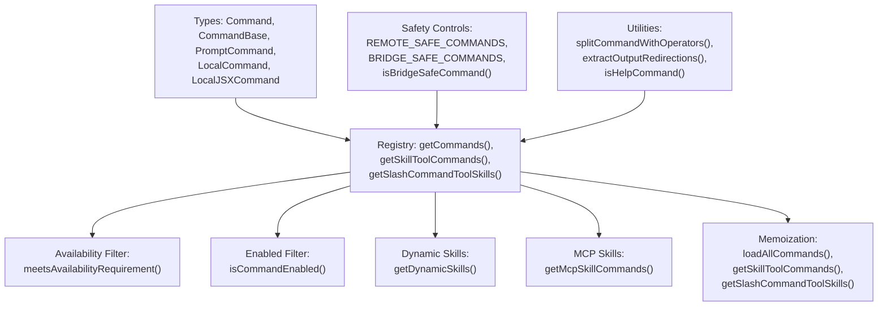
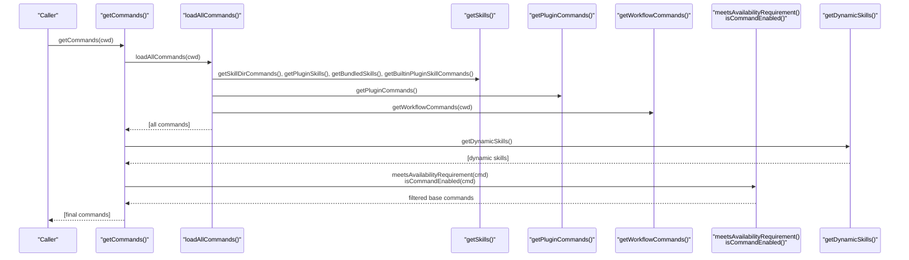
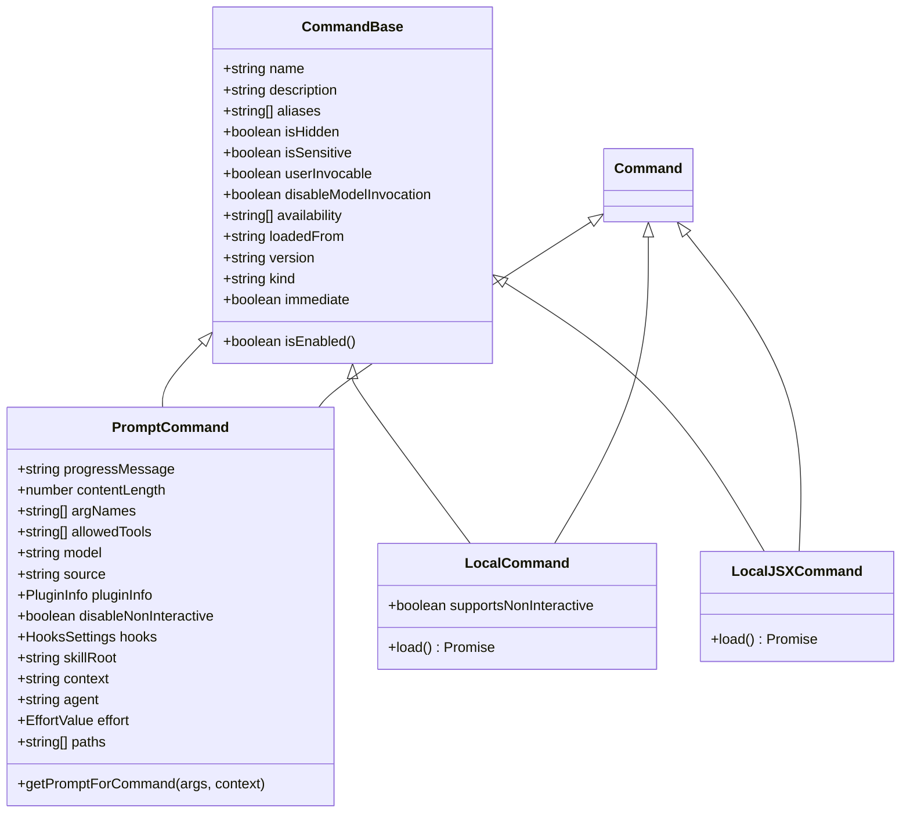
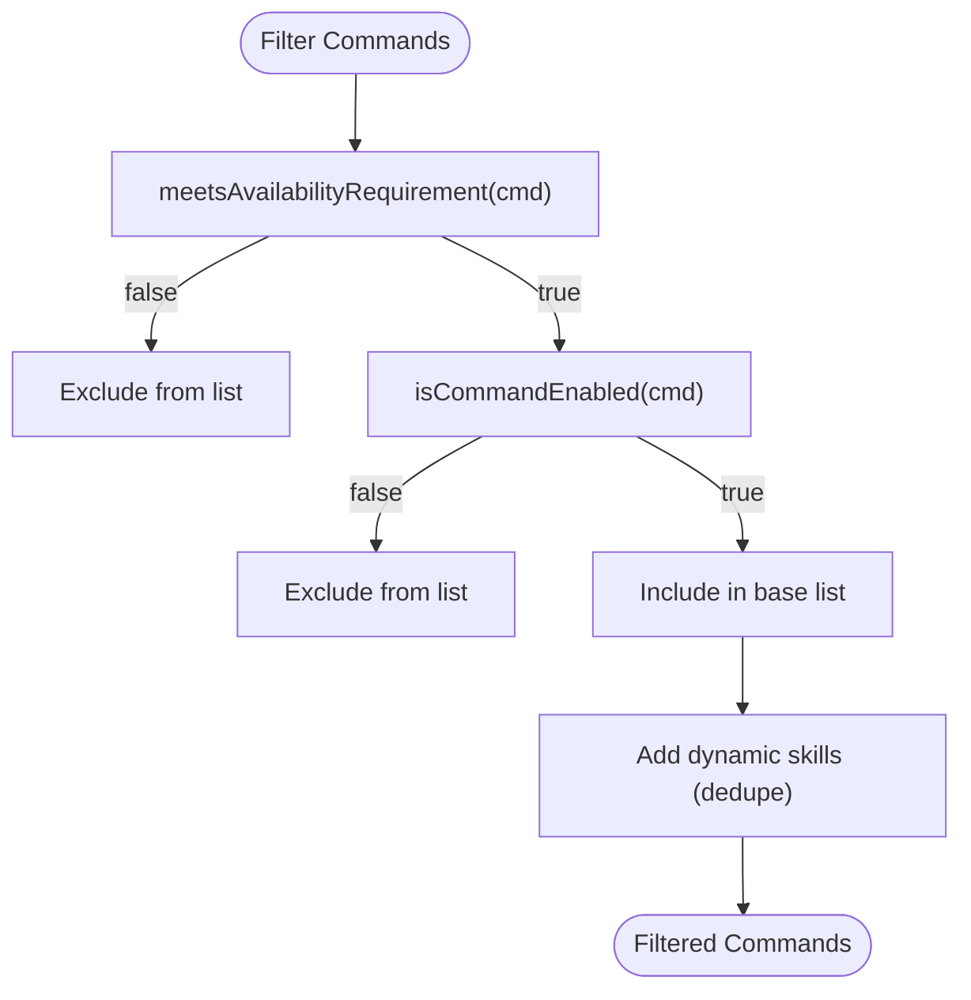
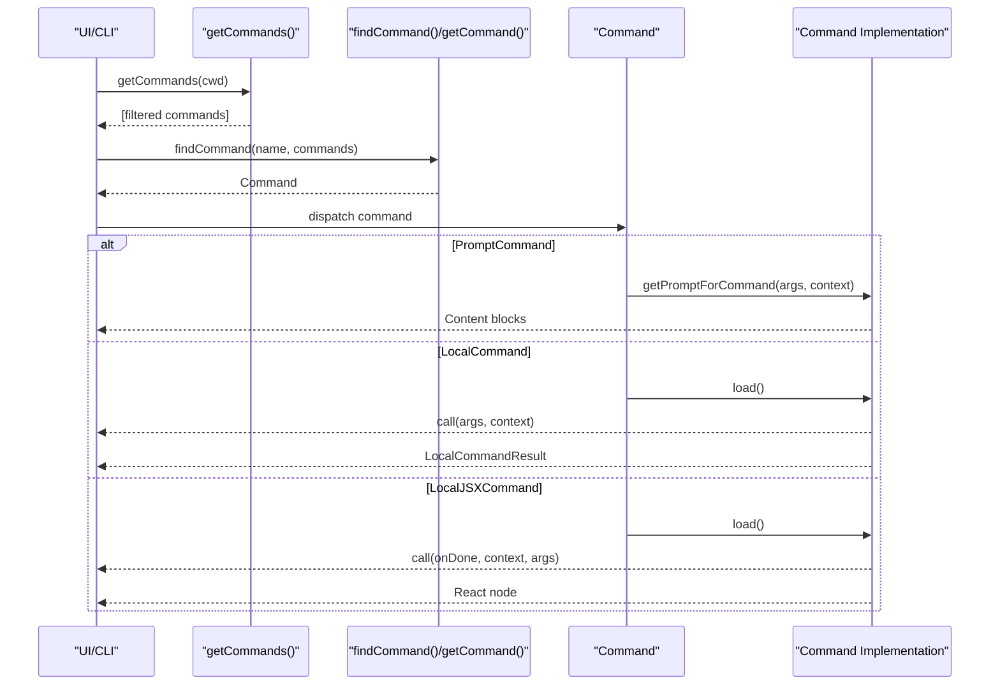
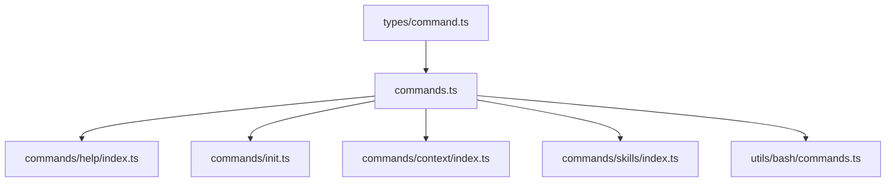

# Command API

<cite>
**Referenced Files in This Document**
- [command.ts](file://src/types/command.ts)
- [commands.ts](file://src/commands.ts)
- [init.ts](file://src/commands/init.ts)
- [index.ts](file://src/commands/help/index.ts)
- [index.ts](file://src/commands/context/index.ts)
- [index.ts](file://src/commands/skills/index.ts)
- [commands.ts](file://src/utils/bash/commands.ts)
</cite>

## Table of Contents
1. [Introduction](#introduction)
2. [Project Structure](#project-structure)
3. [Core Components](#core-components)
4. [Architecture Overview](#architecture-overview)
5. [Detailed Component Analysis](#detailed-component-analysis)
6. [Dependency Analysis](#dependency-analysis)
7. [Performance Considerations](#performance-considerations)
8. [Troubleshooting Guide](#troubleshooting-guide)
9. [Conclusion](#conclusion)

## Introduction
This document describes the Command System used to define, register, filter, and execute commands across the application. It covers the Command interface, command types (built-in, plugin, skill), availability gating, filtering mechanisms, memoization and caching strategies, and safety controls for remote execution and bridge communication. It also provides practical examples of command creation, registration, and execution workflows drawn from the codebase.

## Project Structure
The Command System spans several modules:
- Central type definitions for commands and their execution contexts
- A registry that aggregates built-in, plugin, MCP, and dynamic skills
- Filtering and availability logic for provider gating and feature flags
- Safety lists for remote and bridge execution
- Utility modules for parameter handling and permission gating (for shell commands)

**Diagram sources**
- [commands.ts:417-443](file://src/commands.ts#L417-L443)
- [commands.ts:476-517](file://src/commands.ts#L476-L517)
- [commands.ts:563-608](file://src/commands.ts#L563-L608)
- [commands.ts:619-676](file://src/commands.ts#L619-L676)
- [commands.ts:684-719](file://src/commands.ts#L684-L719)
- [command.ts:175-211](file://src/types/command.ts#L175-L211)
- [commands.ts:85-249](file://src/utils/bash/commands.ts#L85-L249)

**Section sources**
- [commands.ts:258-346](file://src/commands.ts#L258-L346)
- [commands.ts:417-443](file://src/commands.ts#L417-L443)
- [commands.ts:476-517](file://src/commands.ts#L476-L517)
- [commands.ts:619-676](file://src/commands.ts#L619-L676)
- [command.ts:175-211](file://src/types/command.ts#L175-L211)

## Core Components
- Command interface and variants:
  - CommandBase: shared metadata (name, description, availability, isEnabled, isHidden, aliases, etc.)
  - PromptCommand: model-invocable skills that expand to prompt content
  - LocalCommand: synchronous local command with lazy load
  - LocalJSXCommand: UI-rendering command with lazy load
- Execution contexts:
  - LocalJSXCommandContext augments ToolUseContext with UI hooks and options
  - LocalCommandResult supports text, compact, and skip outputs
- Availability and enablement:
  - availability gates commands by provider/auth type
  - isEnabled allows feature-flag or environment-based toggles
- Safety:
  - REMOTE_SAFE_COMMANDS: commands safe for remote mode
  - BRIDGE_SAFE_COMMANDS: commands safe for bridge execution
  - isBridgeSafeCommand: predicate to decide if a command can run remotely

**Section sources**
- [command.ts:16-24](file://src/types/command.ts#L16-L24)
- [command.ts:25-57](file://src/types/command.ts#L25-L57)
- [command.ts:74-98](file://src/types/command.ts#L74-L98)
- [command.ts:144-152](file://src/types/command.ts#L144-L152)
- [command.ts:175-211](file://src/types/command.ts#L175-L211)
- [commands.ts:619-676](file://src/commands.ts#L619-L676)

## Architecture Overview
The Command System composes commands from multiple sources and applies filters and memoization to produce a final, user-available list. It also exposes convenience functions to retrieve skills for model invocation and for slash-command listings.

**Diagram sources**
- [commands.ts:449-469](file://src/commands.ts#L449-L469)
- [commands.ts:353-398](file://src/commands.ts#L353-L398)
- [commands.ts:476-517](file://src/commands.ts#L476-L517)

## Detailed Component Analysis

### Command Interface and Variants
- CommandBase: central metadata and flags
  - availability: provider gating
  - isEnabled: runtime enablement
  - isHidden: hide from autocomplete
  - aliases, version, kind, immediate, isSensitive
  - loadedFrom, userInvocable, disableModelInvocation
- PromptCommand: model-facing skills
  - getPromptForCommand(args, context)
  - context and agent for forked execution
  - hooks and skillRoot for dynamic MCP config
- LocalCommand and LocalJSXCommand: local execution
  - load(): Promise<call>
  - LocalJSXCommandContext augments ToolUseContext with UI hooks and options

**Diagram sources**
- [command.ts:175-211](file://src/types/command.ts#L175-L211)
- [command.ts:25-57](file://src/types/command.ts#L25-L57)
- [command.ts:74-98](file://src/types/command.ts#L74-L98)
- [command.ts:144-152](file://src/types/command.ts#L144-L152)

**Section sources**
- [command.ts:175-211](file://src/types/command.ts#L175-L211)
- [command.ts:25-57](file://src/types/command.ts#L25-L57)
- [command.ts:74-98](file://src/types/command.ts#L74-L98)
- [command.ts:144-152](file://src/types/command.ts#L144-L152)

### Command Registration Patterns
- Built-in commands are aggregated in a memoized list and exported for discovery.
- Conditional feature flags gate additional commands.
- Dynamic skills are appended after plugin skills and before built-ins.
- Plugin commands and MCP skills are loaded asynchronously and merged.

Key registration points:
- Central memoized list of built-in commands
- Conditional feature-based inclusion
- Dynamic skills insertion
- Plugin and MCP command loading

**Section sources**
- [commands.ts:258-346](file://src/commands.ts#L258-L346)
- [commands.ts:449-469](file://src/commands.ts#L449-L469)
- [commands.ts:476-517](file://src/commands.ts#L476-L517)

### Filtering Mechanisms and Availability Requirements
- Provider gating:
  - meetsAvailabilityRequirement checks availability against auth/provider state
  - Supports 'claude-ai' and 'console' gating
- Runtime enablement:
  - isCommandEnabled falls back to true when not defined
- Visibility:
  - isHidden can suppress commands from autocomplete
- Model invocation:
  - disableModelInvocation excludes commands from model-driven skill lists

**Diagram sources**
- [commands.ts:417-443](file://src/commands.ts#L417-L443)
- [commands.ts:476-517](file://src/commands.ts#L476-L517)
- [command.ts:213-216](file://src/types/command.ts#L213-L216)

**Section sources**
- [commands.ts:417-443](file://src/commands.ts#L417-L443)
- [commands.ts:476-517](file://src/commands.ts#L476-L517)
- [command.ts:213-216](file://src/types/command.ts#L213-L216)

### Command Lifecycle: Registration to Execution
- Registration:
  - Built-in commands are imported and memoized
  - Dynamic skills and plugin/MCP commands are loaded asynchronously
- Discovery:
  - getCommands returns filtered, deduplicated commands
  - getSkillToolCommands and getSlashCommandToolSkills expose subsets for model and UI
- Execution:
  - PromptCommand: getPromptForCommand(args, context) produces prompt content
  - LocalCommand: load() returns call(args, context) -> LocalCommandResult
  - LocalJSXCommand: load() returns call(onDone, context, args) -> React node

**Diagram sources**
- [commands.ts:688-719](file://src/commands.ts#L688-L719)
- [command.ts:53-56](file://src/types/command.ts#L53-L56)
- [command.ts:62-65](file://src/types/command.ts#L62-L65)
- [command.ts:131-135](file://src/types/command.ts#L131-L135)

**Section sources**
- [commands.ts:688-719](file://src/commands.ts#L688-L719)
- [command.ts:53-56](file://src/types/command.ts#L53-L56)
- [command.ts:62-65](file://src/types/command.ts#L62-L65)
- [command.ts:131-135](file://src/types/command.ts#L131-L135)

### Memoization Strategies and Caching
- loadAllCommands(cwd): memoized by working directory to avoid repeated disk I/O and dynamic imports
- getSkillToolCommands(cwd) and getSlashCommandToolSkills(cwd): memoized skill sets
- clearCommandMemoizationCaches: clears memoization caches without touching skill caches
- clearCommandsCache: clears all caches including plugin and skill caches

**Section sources**
- [commands.ts:449-469](file://src/commands.ts#L449-L469)
- [commands.ts:563-581](file://src/commands.ts#L563-L581)
- [commands.ts:586-608](file://src/commands.ts#L586-L608)
- [commands.ts:523-539](file://src/commands.ts#L523-L539)

### Built-in Commands, Plugin Commands, and Skill Commands
- Built-in commands:
  - Aggregated centrally and conditionally included based on feature flags
  - Example: init, help, context, skills
- Plugin commands:
  - Loaded via getPluginCommands and merged into the command list
- Skill commands:
  - Loaded from skills directories, bundled, and plugin-provided
  - getSkillToolCommands and getSlashCommandToolSkills filter skills for model and UI respectively

Concrete examples from the codebase:
- Built-in prompt command: init
- Built-in JSX command: help
- Built-in JSX and local variants: context and contextNonInteractive
- Built-in JSX command: skills

**Section sources**
- [commands.ts:258-346](file://src/commands.ts#L258-L346)
- [commands.ts:353-398](file://src/commands.ts#L353-L398)
- [init.ts:226-254](file://src/commands/init.ts#L226-L254)
- [index.ts:3-8](file://src/commands/help/index.ts#L3-L8)
- [index.ts:4-24](file://src/commands/context/index.ts#L4-L24)
- [index.ts:3-8](file://src/commands/skills/index.ts#L3-L8)

### Parameter Handling and Result Formatting
- PromptCommand.getPromptForCommand(args, context) returns content blocks for model consumption
- LocalCommandResult supports:
  - text: string output
  - compact: structured compaction result with optional displayText
  - skip: suppress message emission
- LocalJSXCommandOnDone supports:
  - result: optional user-visible message
  - options: display mode, shouldQuery, metaMessages, nextInput, submitNextInput

**Section sources**
- [command.ts:16-24](file://src/types/command.ts#L16-L24)
- [command.ts:53-56](file://src/types/command.ts#L53-L56)
- [command.ts:117-126](file://src/types/command.ts#L117-L126)

### Safety Mechanisms for Remote Execution and Bridge Communication
- REMOTE_SAFE_COMMANDS: set of commands safe for remote mode (no local filesystem/git/IDE dependencies)
- BRIDGE_SAFE_COMMANDS: set of built-in 'local' commands safe for bridge execution
- isBridgeSafeCommand: predicate that returns true for prompt-type skills and explicitly allowed local commands
- filterCommandsForRemoteMode: pre-filtering helper for REPL rendering in remote mode

**Section sources**
- [commands.ts:619-676](file://src/commands.ts#L619-L676)
- [commands.ts:684-686](file://src/commands.ts#L684-L686)

### Permission Gating and Shell Command Utilities
While not part of the core Command interface, the system includes utilities for safe shell command parsing and permission gating:
- splitCommandWithOperators: robustly splits commands while neutralizing injection risks
- extractOutputRedirections: extracts and validates output redirection targets
- isHelpCommand: identifies benign help invocations
- isUnsafeCompoundCommand_DEPRECATED: legacy compound command safety check

These utilities support permission prompts and safety validations for shell-based operations.

**Section sources**
- [commands.ts:85-249](file://src/utils/bash/commands.ts#L85-L249)
- [commands.ts:634-790](file://src/utils/bash/commands.ts#L634-L790)
- [commands.ts:388-436](file://src/utils/bash/commands.ts#L388-L436)

## Dependency Analysis
The Command System depends on:
- Type definitions for Command variants
- Registry and filtering functions
- Asynchronous loaders for skills and plugins
- Memoization for performance
- Safety sets and predicates

**Diagram sources**
- [command.ts:175-211](file://src/types/command.ts#L175-L211)
- [commands.ts:258-346](file://src/commands.ts#L258-L346)
- [index.ts:3-8](file://src/commands/help/index.ts#L3-L8)
- [init.ts:226-254](file://src/commands/init.ts#L226-L254)
- [index.ts:4-24](file://src/commands/context/index.ts#L4-L24)
- [index.ts:3-8](file://src/commands/skills/index.ts#L3-L8)
- [commands.ts:85-249](file://src/utils/bash/commands.ts#L85-L249)

**Section sources**
- [commands.ts:258-346](file://src/commands.ts#L258-L346)
- [commands.ts:449-469](file://src/commands.ts#L449-L469)
- [commands.ts:563-581](file://src/commands.ts#L563-L581)
- [commands.ts:586-608](file://src/commands.ts#L586-L608)

## Performance Considerations
- Memoization:
  - loadAllCommands caches by cwd to avoid repeated I/O
  - getSkillToolCommands and getSlashCommandToolSkills cache computed skill sets
- Asynchronous loading:
  - Skills, plugins, and workflows are loaded concurrently
- Minimal recomputation:
  - Availability and isEnabled are evaluated fresh per getCommands call to reflect auth changes

[No sources needed since this section provides general guidance]

## Troubleshooting Guide
- Command not found:
  - Use getCommand to retrieve a command by name or alias; it throws with a descriptive message listing available commands
- Command appears but is not visible:
  - Check isHidden and availability gating; verify meetsAvailabilityRequirement and isCommandEnabled
- Remote execution issues:
  - Ensure the command is in REMOTE_SAFE_COMMANDS or isBridgeSafeCommand returns true
- Performance problems:
  - Clear memoization caches with clearCommandMemoizationCaches or clearCommandsCache when dynamic skills change

**Section sources**
- [commands.ts:688-719](file://src/commands.ts#L688-L719)
- [commands.ts:417-443](file://src/commands.ts#L417-L443)
- [commands.ts:619-676](file://src/commands.ts#L619-L676)
- [commands.ts:523-539](file://src/commands.ts#L523-L539)

## Conclusion
The Command System provides a flexible, extensible, and safe framework for defining, registering, filtering, and executing commands across built-in, plugin, and skill sources. Its memoization and asynchronous loading strategies ensure responsiveness, while availability gating and safety lists protect users in remote and bridge contexts. The examples in the codebase demonstrate practical patterns for implementing prompt, local, and JSX commands, along with robust filtering and caching mechanisms.