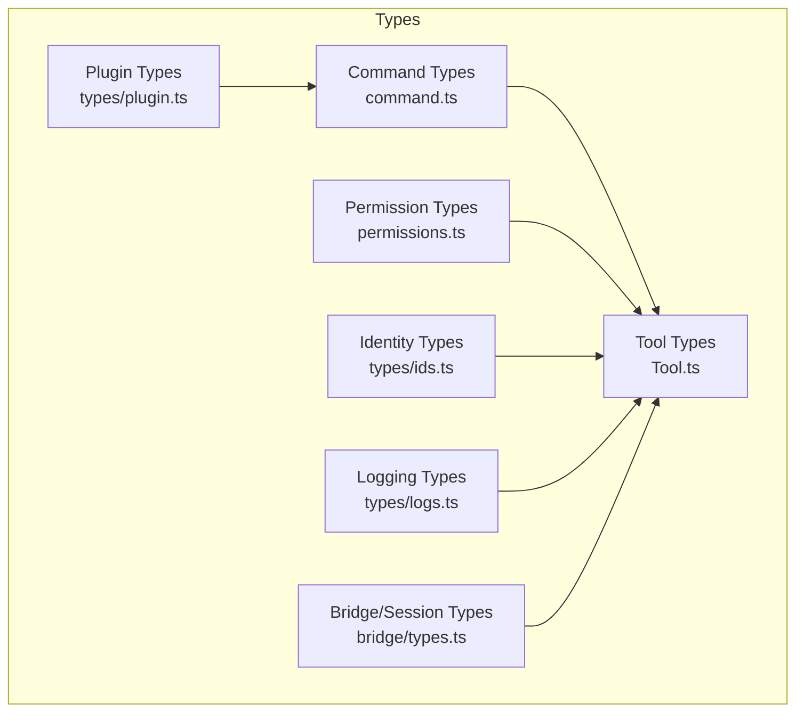
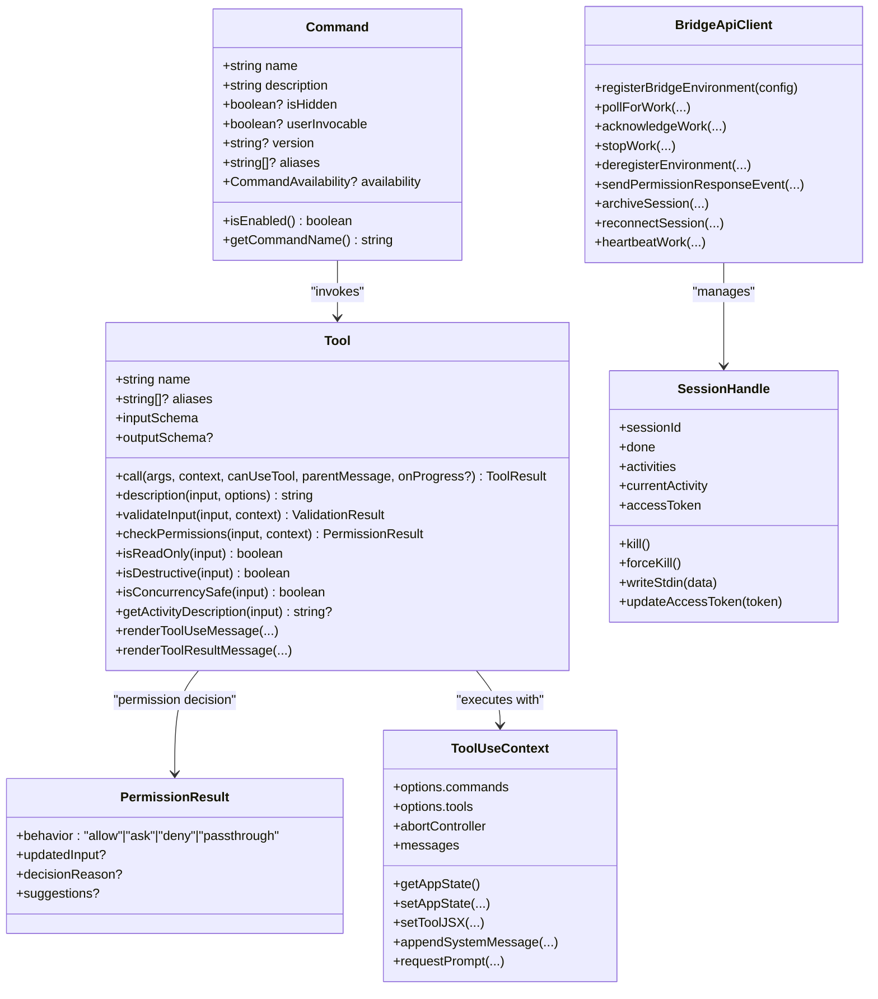
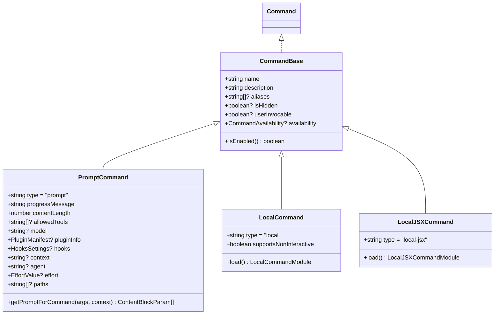
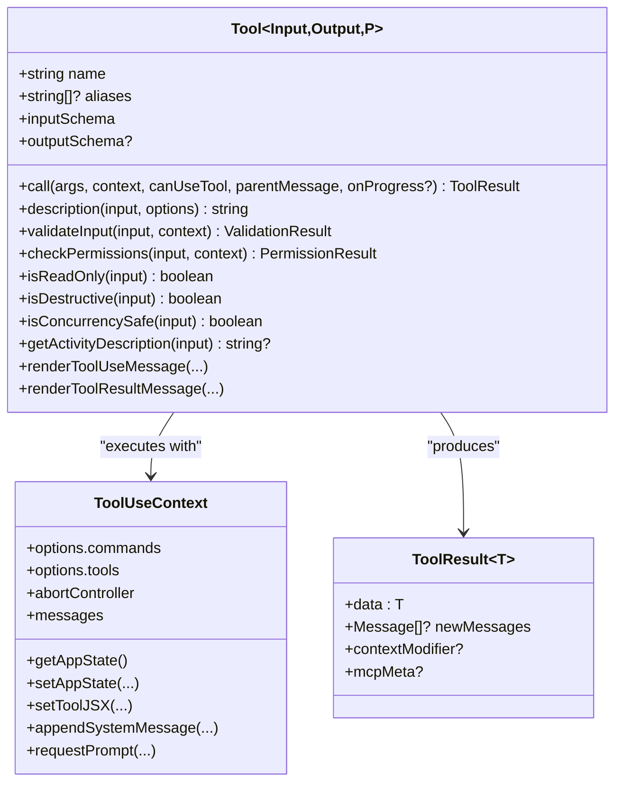
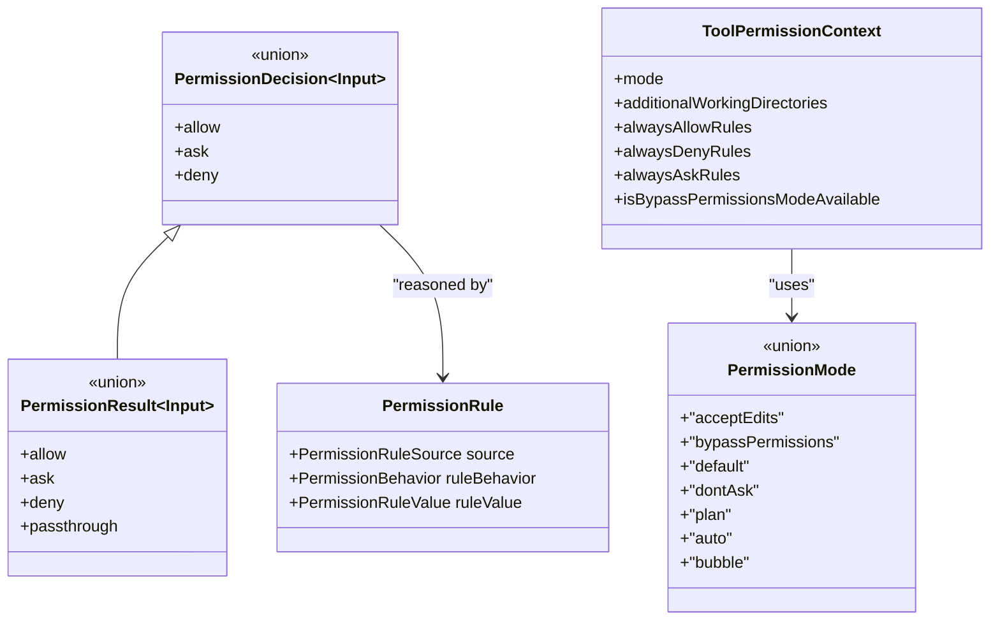
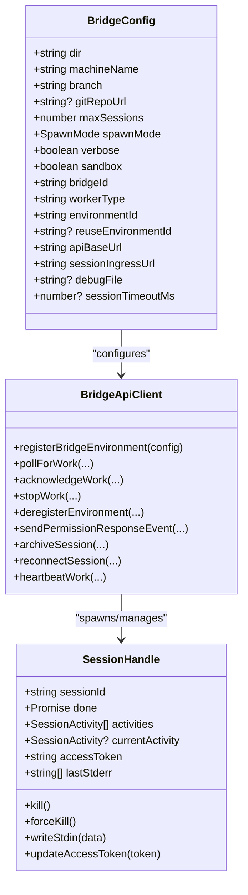
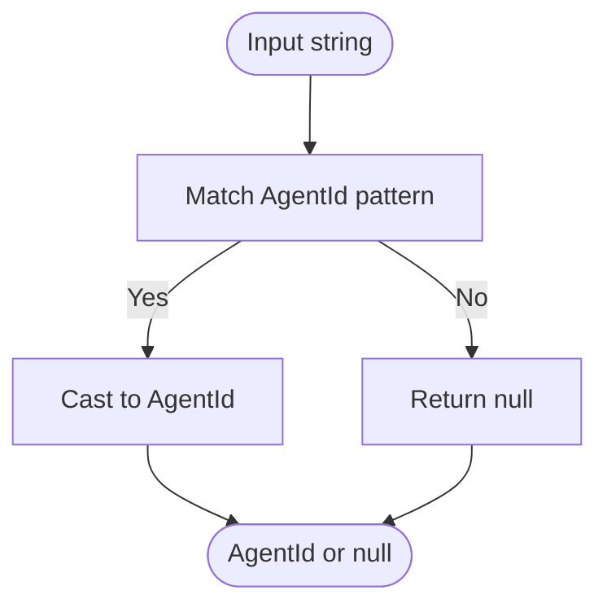
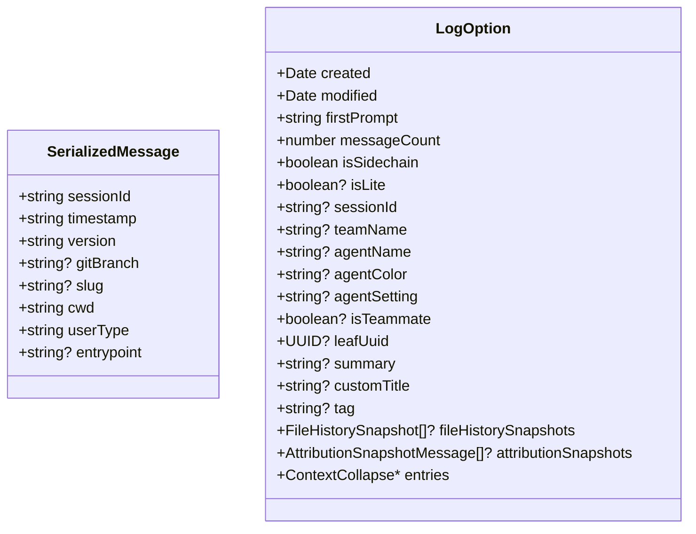
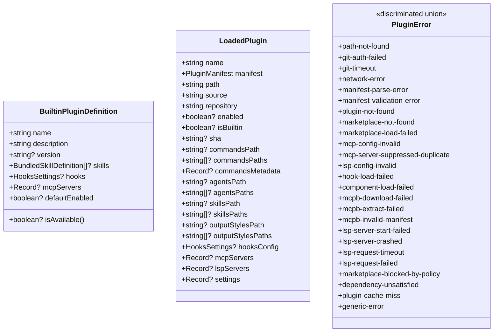
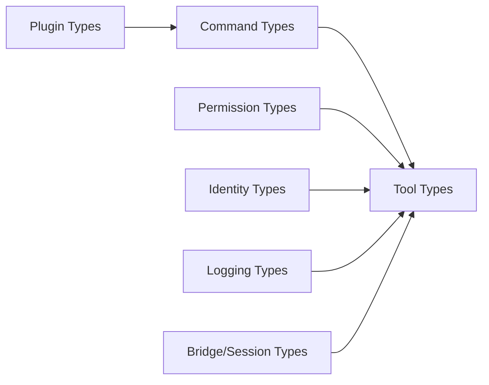

# Data Types and Interfaces

<cite>
**Referenced Files in This Document**
- [command.ts](file://src/types/command.ts)
- [permissions.ts](file://src/types/permissions.ts)
- [Tool.ts](file://src/Tool.ts)
- [types.ts](file://src/bridge/types.ts)
- [ids.ts](file://src/types/ids.ts)
- [logs.ts](file://src/types/logs.ts)
- [plugin.ts](file://src/types/plugin.ts)
</cite>

## Table of Contents
1. [Introduction](#introduction)
2. [Project Structure](#project-structure)
3. [Core Components](#core-components)
4. [Architecture Overview](#architecture-overview)
5. [Detailed Component Analysis](#detailed-component-analysis)
6. [Dependency Analysis](#dependency-analysis)
7. [Performance Considerations](#performance-considerations)
8. [Troubleshooting Guide](#troubleshooting-guide)
9. [Conclusion](#conclusion)

## Introduction
This document provides comprehensive coverage of the core data types and interfaces that define the system’s command, tool, permission, and session abstractions. It explains type hierarchies, polymorphic patterns, validation and safety mechanisms, constants and enums, and serialization semantics. It also highlights how these types integrate across the broader architecture, including command invocation, tool execution, permission gating, and session lifecycle management.

## Project Structure
The relevant type definitions are organized by domain:
- Command types: command invocation, prompt composition, and local JSX command execution
- Permission types: permission modes, rules, decisions, and classifier results
- Tool types: tool contracts, progress, validation, and permission checks
- Bridge/session types: session lifecycle, environment registration, and transport interfaces
- Identity types: branded identifiers for sessions and agents
- Logging types: serialized logs and metadata entries
- Plugin types: plugin manifests, repositories, and error handling

**Diagram sources**
- [command.ts:1-217](file://src/types/command.ts#L1-L217)
- [permissions.ts:1-442](file://src/types/permissions.ts#L1-L442)
- [Tool.ts:1-793](file://src/Tool.ts#L1-L793)
- [types.ts:1-263](file://src/bridge/types.ts#L1-L263)
- [ids.ts:1-45](file://src/types/ids.ts#L1-L45)
- [logs.ts:1-331](file://src/types/logs.ts#L1-L331)
- [plugin.ts:1-364](file://src/types/plugin.ts#L1-L364)

**Section sources**
- [command.ts:1-217](file://src/types/command.ts#L1-L217)
- [permissions.ts:1-442](file://src/types/permissions.ts#L1-L442)
- [Tool.ts:1-793](file://src/Tool.ts#L1-L793)
- [types.ts:1-263](file://src/bridge/types.ts#L1-L263)
- [ids.ts:1-45](file://src/types/ids.ts#L1-L45)
- [logs.ts:1-331](file://src/types/logs.ts#L1-L331)
- [plugin.ts:1-364](file://src/types/plugin.ts#L1-L364)

## Core Components
This section introduces the primary types and interfaces that underpin the system.

- Command
  - Discriminated union of command variants: prompt-based, local, and local JSX commands
  - Shared base properties for availability, description, enablement, and metadata
  - Utility helpers to resolve display names and enablement status

- Tool
  - Generic tool contract with input/output schemas, progress reporting, and permission checks
  - Extensible interface supporting read-only, destructive, concurrency-safe operations
  - Factory to build tools with safe defaults for optional methods

- Permission
  - Permission modes, behaviors, and rules
  - Decision types for allow/ask/deny with rich metadata and reasons
  - Classifier results and usage telemetry
  - Tool permission context and working directory scopes

- Session/Bridge
  - Session lifecycle types, spawn modes, and activity tracking
  - Bridge configuration, environment registration, and client API interface
  - Logger interface for status and activity updates

- Identity
  - Branded types for session and agent IDs with validation helpers

- Logging
  - Serialized message and log option schemas
  - Extended metadata entries for titles, tags, attribution, worktrees, and context collapse

- Plugin
  - Plugin manifest, repository, and loaded plugin structure
  - Comprehensive discriminated union of plugin error types with helpful messages

**Section sources**
- [command.ts:16-217](file://src/types/command.ts#L16-L217)
- [Tool.ts:15-793](file://src/Tool.ts#L15-L793)
- [permissions.ts:16-442](file://src/types/permissions.ts#L16-L442)
- [types.ts:1-263](file://src/bridge/types.ts#L1-L263)
- [ids.ts:1-45](file://src/types/ids.ts#L1-L45)
- [logs.ts:8-331](file://src/types/logs.ts#L8-L331)
- [plugin.ts:18-364](file://src/types/plugin.ts#L18-L364)

## Architecture Overview
The type system enforces strong contracts across command execution, tool invocation, and permission gating. Commands describe intent and capabilities; tools encapsulate operations with validated inputs and controlled side effects; permissions mediate access with explicit modes and decisions; sessions orchestrate environment lifecycles; identities prevent accidental misuse; logs capture durable state; plugins extend functionality with typed manifests and error handling.

**Diagram sources**
- [command.ts:175-207](file://src/types/command.ts#L175-L207)
- [Tool.ts:362-695](file://src/Tool.ts#L362-L695)
- [permissions.ts:241-267](file://src/types/permissions.ts#L241-L267)
- [Tool.ts:158-300](file://src/Tool.ts#L158-L300)
- [types.ts:133-176](file://src/bridge/types.ts#L133-L176)
- [types.ts:178-190](file://src/bridge/types.ts#L178-L190)

## Detailed Component Analysis

### Command Types
- Purpose: Define command shapes, availability, and execution modes.
- Key types:
  - CommandBase: shared metadata and flags
  - PromptCommand: prompt composition and execution context
  - LocalCommand and LocalJSXCommand: lazy-loaded command modules
  - Command: union of all command variants
- Polymorphism: discriminated union allows safe branching on command type
- Constants/enums:
  - CommandAvailability: 'claude-ai' | 'console'
  - ResumeEntrypoint: enumeration of resume triggers
  - CommandResultDisplay: 'skip' | 'system' | 'user'

**Diagram sources**
- [command.ts:175-207](file://src/types/command.ts#L175-L207)
- [command.ts:25-57](file://src/types/command.ts#L25-L57)
- [command.ts:74-78](file://src/types/command.ts#L74-L78)
- [command.ts:144-152](file://src/types/command.ts#L144-L152)

**Section sources**
- [command.ts:16-217](file://src/types/command.ts#L16-L217)

### Tool Types
- Purpose: Define the tool contract, progress, validation, and permission integration.
- Key types:
  - Tool<TInput, TOutput, TProgress>: generic tool interface
  - ToolUseContext: execution context for tool calls
  - ToolResult: tool output with optional messages and context modifiers
  - Tools: readonly array of tools
  - ToolDef and buildTool: factory with safe defaults
- Validation and safety:
  - validateInput: hook for pre-execution validation
  - checkPermissions: integrates with permission system
  - isReadOnly/isDestructive/isConcurrencySafe: safety flags
- Progress and rendering:
  - ToolProgressData and progress callbacks
  - renderToolUseMessage and renderToolResultMessage for UI

**Diagram sources**
- [Tool.ts:362-695](file://src/Tool.ts#L362-L695)
- [Tool.ts:158-300](file://src/Tool.ts#L158-L300)
- [Tool.ts:321-336](file://src/Tool.ts#L321-L336)

**Section sources**
- [Tool.ts:15-793](file://src/Tool.ts#L15-L793)

### Permission Types
- Purpose: Enforce permission gating with modes, rules, and decisions.
- Key types:
  - PermissionMode: 'acceptEdits' | 'bypassPermissions' | 'default' | 'dontAsk' | 'plan' | 'auto' | 'bubble'
  - PermissionRule and PermissionRuleSource
  - PermissionDecision and PermissionResult unions
  - ToolPermissionContext: immutable permission context
  - Classifier types: results, usage, and telemetry
- Decision reasons: structured explanations for allow/ask/deny decisions
- Working directory scopes: AdditionalWorkingDirectory and ToolPermissionRulesBySource

**Diagram sources**
- [permissions.ts:28-29](file://src/types/permissions.ts#L28-L29)
- [permissions.ts:75-79](file://src/types/permissions.ts#L75-L79)
- [permissions.ts:241-247](file://src/types/permissions.ts#L241-L247)
- [permissions.ts:251-266](file://src/types/permissions.ts#L251-L266)
- [permissions.ts:427-441](file://src/types/permissions.ts#L427-L441)

**Section sources**
- [permissions.ts:16-442](file://src/types/permissions.ts#L16-L442)

### Session and Bridge Types
- Purpose: Manage remote session lifecycle, environment registration, and transport.
- Key types:
  - BridgeConfig: environment registration and session parameters
  - BridgeApiClient: environment and session operations
  - SessionHandle: session lifecycle and IO
  - WorkSecret and WorkResponse: session secrets and work items
  - SessionActivity and SessionActivityType: activity tracking
  - SpawnMode and BridgeWorkerType: spawn and worker classification

**Diagram sources**
- [types.ts:81-115](file://src/bridge/types.ts#L81-L115)
- [types.ts:133-176](file://src/bridge/types.ts#L133-L176)
- [types.ts:178-190](file://src/bridge/types.ts#L178-L190)

**Section sources**
- [types.ts:1-263](file://src/bridge/types.ts#L1-L263)

### Identity Types
- Purpose: Prevent mixing session and agent IDs at compile time.
- Key types:
  - SessionId and AgentId branded string types
  - asSessionId/asAgentId casts
  - toAgentId validation with pattern matching

**Diagram sources**
- [ids.ts:35-44](file://src/types/ids.ts#L35-L44)

**Section sources**
- [ids.ts:1-45](file://src/types/ids.ts#L1-L45)

### Logging Types
- Purpose: Capture durable conversation state and metadata for persistence and resume.
- Key types:
  - SerializedMessage and LogOption: message and log containers
  - Extended metadata entries: titles, tags, attribution, worktrees, context collapse
  - Sorting and filtering helpers

**Diagram sources**
- [logs.ts:8-53](file://src/types/logs.ts#L8-L53)
- [logs.ts:221-231](file://src/types/logs.ts#L221-L231)

**Section sources**
- [logs.ts:1-331](file://src/types/logs.ts#L1-L331)

### Plugin Types
- Purpose: Describe plugin manifests, repositories, and error handling.
- Key types:
  - BuiltinPluginDefinition and LoadedPlugin
  - PluginRepository and PluginConfig
  - PluginError: discriminated union of error cases with contextual data
  - PluginLoadResult: categorized results

**Diagram sources**
- [plugin.ts:18-35](file://src/types/plugin.ts#L18-L35)
- [plugin.ts:48-70](file://src/types/plugin.ts#L48-L70)
- [plugin.ts:101-283](file://src/types/plugin.ts#L101-L283)

**Section sources**
- [plugin.ts:1-364](file://src/types/plugin.ts#L1-L364)

## Dependency Analysis
- Cohesion: Each module groups related types by domain (command, permission, tool, bridge, identity, logs, plugin)
- Coupling:
  - Tool depends on Command, PermissionResult, and ToolUseContext
  - Command integrates with plugin manifests and hooks
  - Bridge types depend on session and environment lifecycles
  - Logs and plugins interoperate with session metadata
- Safety:
  - Branded IDs prevent ID mix-ups
  - PermissionResult enforces explicit decision semantics
  - Tool factory ensures consistent defaults for optional methods

**Diagram sources**
- [command.ts:1-217](file://src/types/command.ts#L1-L217)
- [Tool.ts:1-793](file://src/Tool.ts#L1-L793)
- [permissions.ts:1-442](file://src/types/permissions.ts#L1-L442)
- [ids.ts:1-45](file://src/types/ids.ts#L1-L45)
- [logs.ts:1-331](file://src/types/logs.ts#L1-L331)
- [plugin.ts:1-364](file://src/types/plugin.ts#L1-L364)
- [types.ts:1-263](file://src/bridge/types.ts#L1-L263)

**Section sources**
- [command.ts:1-217](file://src/types/command.ts#L1-L217)
- [Tool.ts:1-793](file://src/Tool.ts#L1-L793)
- [permissions.ts:1-442](file://src/types/permissions.ts#L1-L442)
- [ids.ts:1-45](file://src/types/ids.ts#L1-L45)
- [logs.ts:1-331](file://src/types/logs.ts#L1-L331)
- [plugin.ts:1-364](file://src/types/plugin.ts#L1-L364)
- [types.ts:1-263](file://src/bridge/types.ts#L1-L263)

## Performance Considerations
- Lazy-loading commands: LocalJSXCommand defers heavy dependencies until invoked, reducing startup costs
- Tool defaults: buildTool provides safe defaults to avoid repeated null checks and reduce branching overhead
- Permission decisions: classifier-based async approval minimizes UI blocking for low-risk operations
- Streaming progress: ToolProgressData and progress callbacks enable responsive UI updates without blocking execution
- Branded IDs: Lightweight runtime cast prevents accidental misuse without allocation overhead

## Troubleshooting Guide
- Command resolution
  - Verify availability and enablement flags before invoking commands
  - Use getCommandName to resolve display names consistently
- Tool validation
  - Implement validateInput to fail fast on invalid inputs
  - Use isReadOnly/isDestructive to inform users and prevent unintended changes
- Permission gating
  - Inspect PermissionDecisionReason to diagnose allow/ask/deny outcomes
  - Use ToolPermissionContext to enforce working directory scopes and mode constraints
- Session lifecycle
  - Monitor SessionActivity and SessionHandle for diagnostics
  - Use heartbeatWork to maintain liveness and detect stale sessions
- Logging and resume
  - Ensure LogOption includes required metadata for accurate resume
  - Confirm ContentReplacementEntry and context collapse entries when restoring complex sessions
- Plugins
  - Use getPluginErrorMessage to present actionable messages for PluginError cases
  - Validate manifests and configurations before enabling plugins

**Section sources**
- [command.ts:209-216](file://src/types/command.ts#L209-L216)
- [Tool.ts:489-503](file://src/Tool.ts#L489-L503)
- [permissions.ts:271-324](file://src/types/permissions.ts#L271-L324)
- [types.ts:178-190](file://src/bridge/types.ts#L178-L190)
- [logs.ts:297-317](file://src/types/logs.ts#L297-L317)
- [plugin.ts:295-363](file://src/types/plugin.ts#L295-L363)

## Conclusion
The type system establishes strong contracts across commands, tools, permissions, sessions, identities, logs, and plugins. It enforces safety, clarity, and extensibility while enabling efficient runtime behavior through lazy loading, defaults, and progress streaming. These types collectively support robust integration and maintainability across the system.