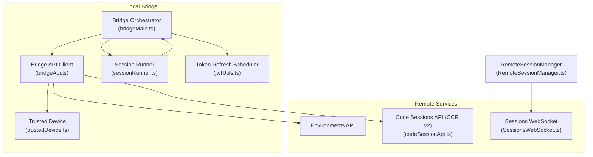
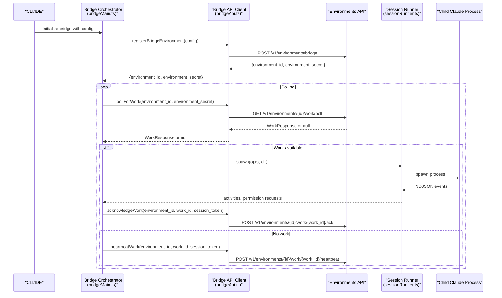
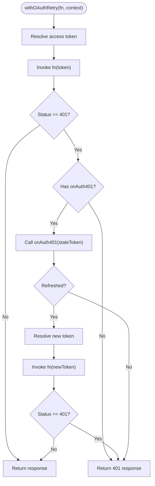
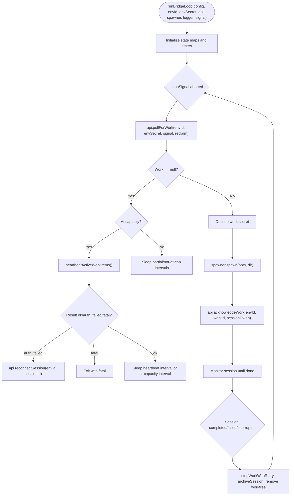
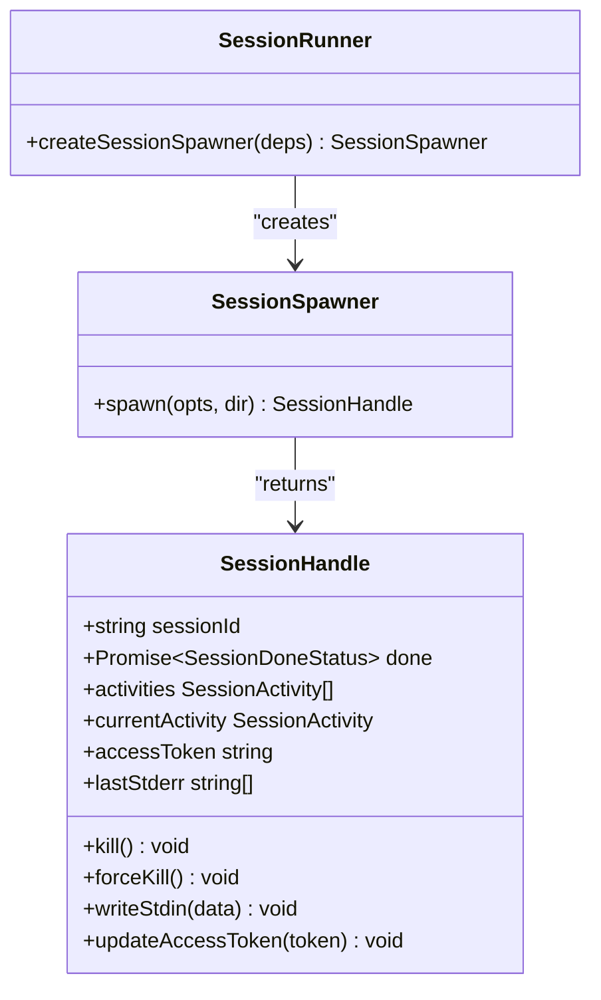
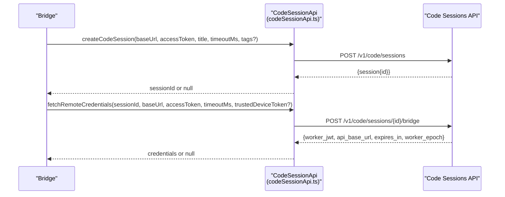
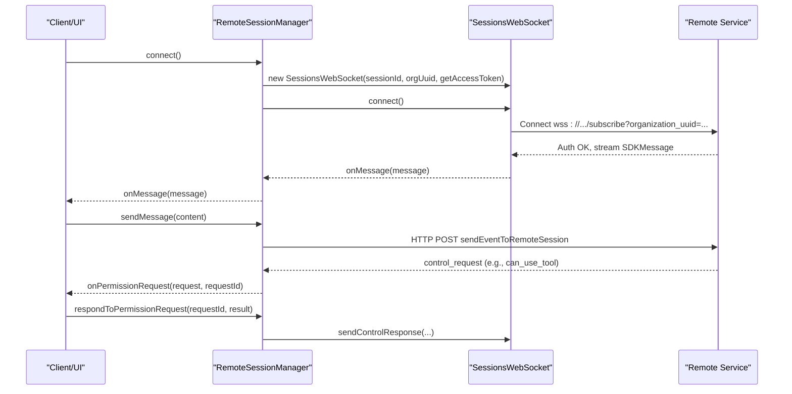
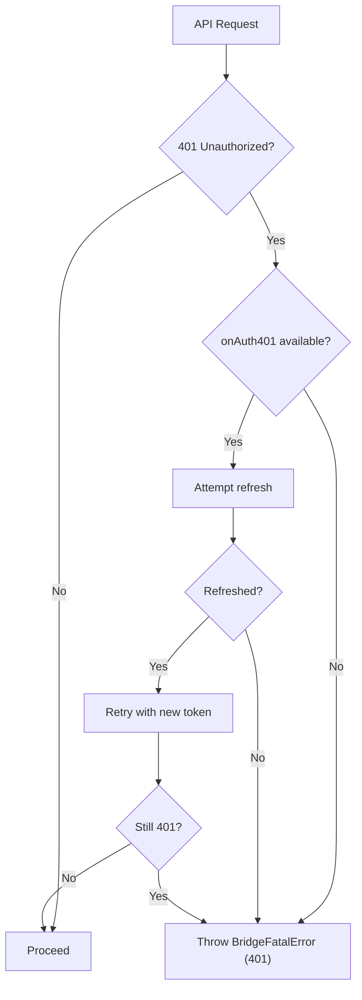
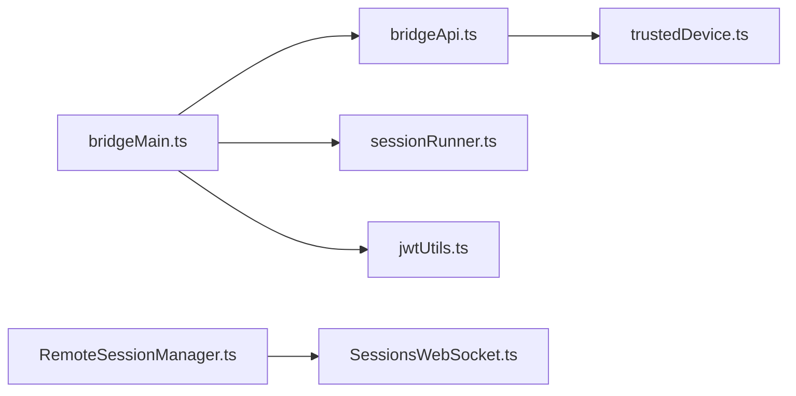

# Internal Service APIs

<cite>
**Referenced Files in This Document**
- [bridgeApi.ts](file://restored-src/src/bridge/bridgeApi.ts)
- [bridgeMain.ts](file://restored-src/src/bridge/bridgeMain.ts)
- [types.ts](file://restored-src/src/bridge/types.ts)
- [sessionRunner.ts](file://restored-src/src/bridge/sessionRunner.ts)
- [codeSessionApi.ts](file://restored-src/src/bridge/codeSessionApi.ts)
- [trustedDevice.ts](file://restored-src/src/bridge/trustedDevice.ts)
- [jwtUtils.ts](file://restored-src/src/bridge/jwtUtils.ts)
- [RemoteSessionManager.ts](file://restored-src/src/remote/RemoteSessionManager.ts)
- [SessionsWebSocket.ts](file://restored-src/src/remote/SessionsWebSocket.ts)
</cite>

## Table of Contents
1. [Introduction](#introduction)
2. [Project Structure](#project-structure)
3. [Core Components](#core-components)
4. [Architecture Overview](#architecture-overview)
5. [Detailed Component Analysis](#detailed-component-analysis)
6. [Dependency Analysis](#dependency-analysis)
7. [Performance Considerations](#performance-considerations)
8. [Troubleshooting Guide](#troubleshooting-guide)
9. [Conclusion](#conclusion)

## Introduction
This document describes the Internal Service Interfaces that power the Claude Code Remote Control (CCR) system. It focuses on the service layer architecture, API integration patterns, and data service contracts used for internal communication between the local bridge, the remote CCR infrastructure, and the IDE/CLI. It covers:
- Internal communication protocols (HTTP and WebSocket)
- Message formats and event handling
- Service initialization, configuration, and lifecycle management
- API client interfaces, error handling, and retry mechanisms
- Examples of service integration patterns, data transformation, and caching strategies
- Security, authentication, and authorization

## Project Structure
The internal service interfaces span several modules:
- Bridge API client and orchestration: [bridgeApi.ts](file://restored-src/src/bridge/bridgeApi.ts), [bridgeMain.ts](file://restored-src/src/bridge/bridgeMain.ts)
- Types and contracts: [types.ts](file://restored-src/src/bridge/types.ts)
- Session spawning and lifecycle: [sessionRunner.ts](file://restored-src/src/bridge/sessionRunner.ts)
- Code session API (CCR v2): [codeSessionApi.ts](file://restored-src/src/bridge/codeSessionApi.ts)
- Security and trusted device tokens: [trustedDevice.ts](file://restored-src/src/bridge/trustedDevice.ts)
- Token refresh scheduling: [jwtUtils.ts](file://restored-src/src/bridge/jwtUtils.ts)
- Remote session management and WebSocket transport: [RemoteSessionManager.ts](file://restored-src/src/remote/RemoteSessionManager.ts), [SessionsWebSocket.ts](file://restored-src/src/remote/SessionsWebSocket.ts)

**Diagram sources**
- [bridgeApi.ts:1-540](file://restored-src/src/bridge/bridgeApi.ts#L1-L540)
- [bridgeMain.ts:141-800](file://restored-src/src/bridge/bridgeMain.ts#L141-L800)
- [sessionRunner.ts:248-551](file://restored-src/src/bridge/sessionRunner.ts#L248-L551)
- [codeSessionApi.ts:26-169](file://restored-src/src/bridge/codeSessionApi.ts#L26-L169)
- [trustedDevice.ts:54-211](file://restored-src/src/bridge/trustedDevice.ts#L54-L211)
- [jwtUtils.ts:72-257](file://restored-src/src/bridge/jwtUtils.ts#L72-L257)
- [RemoteSessionManager.ts:95-344](file://restored-src/src/remote/RemoteSessionManager.ts#L95-L344)
- [SessionsWebSocket.ts:82-405](file://restored-src/src/remote/SessionsWebSocket.ts#L82-L405)

**Section sources**
- [bridgeApi.ts:68-452](file://restored-src/src/bridge/bridgeApi.ts#L68-L452)
- [bridgeMain.ts:141-800](file://restored-src/src/bridge/bridgeMain.ts#L141-L800)
- [types.ts:133-263](file://restored-src/src/bridge/types.ts#L133-L263)
- [sessionRunner.ts:248-551](file://restored-src/src/bridge/sessionRunner.ts#L248-L551)
- [codeSessionApi.ts:26-169](file://restored-src/src/bridge/codeSessionApi.ts#L26-L169)
- [trustedDevice.ts:54-211](file://restored-src/src/bridge/trustedDevice.ts#L54-L211)
- [jwtUtils.ts:72-257](file://restored-src/src/bridge/jwtUtils.ts#L72-L257)
- [RemoteSessionManager.ts:95-344](file://restored-src/src/remote/RemoteSessionManager.ts#L95-L344)
- [SessionsWebSocket.ts:82-405](file://restored-src/src/remote/SessionsWebSocket.ts#L82-L405)

## Core Components
- Bridge API Client: Provides typed HTTP methods for environment registration, work polling, acknowledgments, stopping work, deregistration, permission events, session archiving, reconnect, and heartbeats. Includes OAuth-aware retry logic and fatal error classification.
- Bridge Orchestrator: Runs the main poll loop, manages active sessions, heartbeat maintenance, capacity handling, and lifecycle transitions.
- Session Runner: Spawns and supervises child Claude processes, captures NDJSON streams, extracts activities, handles permission requests, and manages stdin/stdout/stderr.
- Code Session API (CCR v2): Thin HTTP wrappers for creating code sessions and fetching remote credentials for CCR v2.
- Trusted Device: Manages elevated security tier tokens and enrollment for bridge sessions.
- Token Refresh Scheduler: Proactively refreshes session access tokens before expiry and coordinates with transports.
- Remote Session Manager and WebSocket: Manages WebSocket subscriptions, control message exchange, and HTTP-based messaging for remote sessions.

**Section sources**
- [bridgeApi.ts:68-452](file://restored-src/src/bridge/bridgeApi.ts#L68-L452)
- [bridgeMain.ts:141-800](file://restored-src/src/bridge/bridgeMain.ts#L141-L800)
- [sessionRunner.ts:248-551](file://restored-src/src/bridge/sessionRunner.ts#L248-L551)
- [codeSessionApi.ts:26-169](file://restored-src/src/bridge/codeSessionApi.ts#L26-L169)
- [trustedDevice.ts:54-211](file://restored-src/src/bridge/trustedDevice.ts#L54-L211)
- [jwtUtils.ts:72-257](file://restored-src/src/bridge/jwtUtils.ts#L72-L257)
- [RemoteSessionManager.ts:95-344](file://restored-src/src/remote/RemoteSessionManager.ts#L95-L344)
- [SessionsWebSocket.ts:82-405](file://restored-src/src/remote/SessionsWebSocket.ts#L82-L405)

## Architecture Overview
The system integrates local and remote services through:
- HTTP APIs for environment and session management
- WebSocket for real-time session streaming and control
- Local orchestration coordinating polling, spawning, and lifecycle

**Diagram sources**
- [bridgeApi.ts:141-451](file://restored-src/src/bridge/bridgeApi.ts#L141-L451)
- [bridgeMain.ts:600-784](file://restored-src/src/bridge/bridgeMain.ts#L600-L784)
- [sessionRunner.ts:248-551](file://restored-src/src/bridge/sessionRunner.ts#L248-L551)

**Section sources**
- [bridgeApi.ts:141-451](file://restored-src/src/bridge/bridgeApi.ts#L141-L451)
- [bridgeMain.ts:600-784](file://restored-src/src/bridge/bridgeMain.ts#L600-L784)
- [sessionRunner.ts:248-551](file://restored-src/src/bridge/sessionRunner.ts#L248-L551)

## Detailed Component Analysis

### Bridge API Client
Responsibilities:
- Construct HTTP requests with standardized headers and anthropic-version
- OAuth-aware retry on 401 with optional token refresh callback
- Fatal error classification and suppression rules
- Work polling, acknowledgment, stop, deregister, permission events, archive, reconnect, and heartbeat
- ID validation for URL-safe identifiers

Key behaviors:
- withOAuthRetry: Attempts token refresh and retries once on 401
- handleErrorStatus: Throws BridgeFatalError for unrecoverable statuses; maps 403/404/410 to user-actionable messages
- isSuppressible403: Suppressible permission errors for specific scopes

**Diagram sources**
- [bridgeApi.ts:106-139](file://restored-src/src/bridge/bridgeApi.ts#L106-L139)

**Section sources**
- [bridgeApi.ts:68-452](file://restored-src/src/bridge/bridgeApi.ts#L68-L452)

### Bridge Orchestrator (Poll Loop)
Responsibilities:
- Manage active sessions, work IDs, ingress tokens, timers, and cleanup
- Heartbeat active work items; handle auth failures by reconnecting sessions
- Spawn sessions via SessionRunner; manage lifecycle and completion
- Handle capacity throttling, sleep detection, and backoff strategies
- Archive sessions and stop work with retry

**Diagram sources**
- [bridgeMain.ts:141-800](file://restored-src/src/bridge/bridgeMain.ts#L141-L800)
- [bridgeApi.ts:199-417](file://restored-src/src/bridge/bridgeApi.ts#L199-L417)
- [sessionRunner.ts:248-551](file://restored-src/src/bridge/sessionRunner.ts#L248-L551)

**Section sources**
- [bridgeMain.ts:141-800](file://restored-src/src/bridge/bridgeMain.ts#L141-L800)

### Session Runner
Responsibilities:
- Spawn child Claude processes with environment variables and arguments
- Parse NDJSON from stdout to extract activities and permission requests
- Capture stderr for diagnostics
- Provide SessionHandle with kill/forceKill, stdin write, and token update
- Derive session titles from first user messages

**Diagram sources**
- [sessionRunner.ts:248-551](file://restored-src/src/bridge/sessionRunner.ts#L248-L551)
- [types.ts:178-211](file://restored-src/src/bridge/types.ts#L178-L211)

**Section sources**
- [sessionRunner.ts:248-551](file://restored-src/src/bridge/sessionRunner.ts#L248-L551)

### Code Session API (CCR v2)
Responsibilities:
- Create a code session and return a session ID
- Fetch remote credentials (worker JWT, base URL, expiration, worker epoch)

**Diagram sources**
- [codeSessionApi.ts:26-169](file://restored-src/src/bridge/codeSessionApi.ts#L26-L169)

**Section sources**
- [codeSessionApi.ts:26-169](file://restored-src/src/bridge/codeSessionApi.ts#L26-L169)

### Remote Session Management and WebSocket
Responsibilities:
- Establish and maintain a WebSocket subscription to a session
- Route SDK messages and control messages
- Send user messages via HTTP
- Handle permission requests and responses
- Reconnect on transient failures

**Diagram sources**
- [RemoteSessionManager.ts:95-344](file://restored-src/src/remote/RemoteSessionManager.ts#L95-L344)
- [SessionsWebSocket.ts:82-405](file://restored-src/src/remote/SessionsWebSocket.ts#L82-L405)

**Section sources**
- [RemoteSessionManager.ts:95-344](file://restored-src/src/remote/RemoteSessionManager.ts#L95-L344)
- [SessionsWebSocket.ts:82-405](file://restored-src/src/remote/SessionsWebSocket.ts#L82-L405)

### Security, Authentication, and Authorization
- OAuth bearer tokens for API calls; anthropic-version header
- Optional trusted device token for elevated security tier (ELEVATED) sessions
- 401 handling with optional token refresh; fatal error classification for 403/404/410
- Suppressible 403 errors for specific permission scopes

**Diagram sources**
- [bridgeApi.ts:106-139](file://restored-src/src/bridge/bridgeApi.ts#L106-L139)
- [bridgeApi.ts:454-500](file://restored-src/src/bridge/bridgeApi.ts#L454-L500)

**Section sources**
- [bridgeApi.ts:76-89](file://restored-src/src/bridge/bridgeApi.ts#L76-L89)
- [bridgeApi.ts:454-500](file://restored-src/src/bridge/bridgeApi.ts#L454-L500)
- [trustedDevice.ts:54-87](file://restored-src/src/bridge/trustedDevice.ts#L54-L87)

## Dependency Analysis
- Bridge Orchestrator depends on Bridge API Client, Session Runner, Token Refresh Scheduler, and Logger
- Session Runner depends on child process spawning and NDJSON parsing utilities
- RemoteSessionManager depends on SessionsWebSocket and HTTP helpers for event delivery
- Bridge API Client depends on Axios and shared debug/error utilities
- Trusted Device integration influences header composition for elevated sessions

**Diagram sources**
- [bridgeMain.ts:141-800](file://restored-src/src/bridge/bridgeMain.ts#L141-L800)
- [bridgeApi.ts:68-452](file://restored-src/src/bridge/bridgeApi.ts#L68-L452)
- [sessionRunner.ts:248-551](file://restored-src/src/bridge/sessionRunner.ts#L248-L551)
- [jwtUtils.ts:72-257](file://restored-src/src/bridge/jwtUtils.ts#L72-L257)
- [trustedDevice.ts:54-211](file://restored-src/src/bridge/trustedDevice.ts#L54-L211)
- [RemoteSessionManager.ts:95-344](file://restored-src/src/remote/RemoteSessionManager.ts#L95-L344)
- [SessionsWebSocket.ts:82-405](file://restored-src/src/remote/SessionsWebSocket.ts#L82-L405)

**Section sources**
- [bridgeMain.ts:141-800](file://restored-src/src/bridge/bridgeMain.ts#L141-L800)
- [bridgeApi.ts:68-452](file://restored-src/src/bridge/bridgeApi.ts#L68-L452)
- [sessionRunner.ts:248-551](file://restored-src/src/bridge/sessionRunner.ts#L248-L551)
- [jwtUtils.ts:72-257](file://restored-src/src/bridge/jwtUtils.ts#L72-L257)
- [trustedDevice.ts:54-211](file://restored-src/src/bridge/trustedDevice.ts#L54-L211)
- [RemoteSessionManager.ts:95-344](file://restored-src/src/remote/RemoteSessionManager.ts#L95-L344)
- [SessionsWebSocket.ts:82-405](file://restored-src/src/remote/SessionsWebSocket.ts#L82-L405)

## Performance Considerations
- Polling backoff and capacity-aware throttling reduce server load and CPU usage
- Heartbeat-only mode at capacity avoids redundant polling while maintaining liveness
- Token refresh scheduling minimizes auth-related interruptions for long-running sessions
- NDJSON streaming and ring buffers limit memory footprint for activity and error logs

## Troubleshooting Guide
Common issues and handling:
- Authentication failures (401): Trigger OAuth refresh retry; if refresh fails, fatal error is thrown
- Access denied (403): Distinguish between suppressible permission errors and fatal errors
- Not found (404) or session expired (410): Treat as unrecoverable; suggest restarting remote control
- Rate limited (429): Indicates excessive polling; adjust poll intervals
- Session stuck or dead: Heartbeat auth failures trigger reconnect; fatal errors (404/410) halt further retries
- WebSocket transient drops: Automatic reconnect with capped attempts; permanent close codes stop reconnecting

**Section sources**
- [bridgeApi.ts:454-500](file://restored-src/src/bridge/bridgeApi.ts#L454-L500)
- [bridgeMain.ts:202-270](file://restored-src/src/bridge/bridgeMain.ts#L202-L270)
- [SessionsWebSocket.ts:234-288](file://restored-src/src/remote/SessionsWebSocket.ts#L234-L288)

## Conclusion
The Internal Service Interfaces integrate a robust, resilient pipeline for managing remote-controlled sessions. The Bridge API Client encapsulates HTTP contracts and error semantics, the Bridge Orchestrator coordinates lifecycle and capacity, the Session Runner supervises child processes, and the Remote Session Manager provides real-time WebSocket connectivity. Security is enforced through OAuth, optional trusted device tokens, and strict error classification. Together, these components deliver a scalable, observable, and maintainable foundation for internal service communication.