# Plugin API

<cite>
**Referenced Files in This Document**
- [builtinPlugins.ts](file://src/plugins/builtinPlugins.ts)
- [index.ts](file://src/plugins/bundled/index.ts)
- [plugin.ts](file://src/types/plugin.ts)
- [PluginInstallationManager.ts](file://src/services/plugins/PluginInstallationManager.ts)
- [installedPluginsManager.ts](file://src/utils/plugins/installedPluginsManager.ts)
- [pluginLoader.ts](file://src/utils/plugins/pluginLoader.ts)
- [marketplaceManager.ts](file://src/utils/plugins/marketplaceManager.ts)
- [dependencyResolver.ts](file://src/utils/plugins/dependencyResolver.ts)
- [plugin.tsx](file://src/commands/plugin/plugin.tsx)
</cite>

## Table of Contents
1. [Introduction](#introduction)
2. [Project Structure](#project-structure)
3. [Core Components](#core-components)
4. [Architecture Overview](#architecture-overview)
5. [Detailed Component Analysis](#detailed-component-analysis)
6. [Dependency Analysis](#dependency-analysis)
7. [Performance Considerations](#performance-considerations)
8. [Troubleshooting Guide](#troubleshooting-guide)
9. [Conclusion](#conclusion)
10. [Appendices](#appendices)

## Introduction
This document describes the Plugin System for the IDE, focusing on plugin interfaces, loading mechanisms, lifecycle management, installation, registration, discovery, configuration, settings, dependency resolution, and security considerations. It synthesizes the plugin architecture from the repository’s TypeScript modules and presents practical guidance for plugin authors and integrators.

## Project Structure
The plugin system spans several layers:
- Types and definitions for plugins and manifests
- Built-in plugin registry and initialization
- Marketplaces and installation management
- Plugin loader and caching
- Dependency resolution and enforcement
- UI command entry points for plugin settings

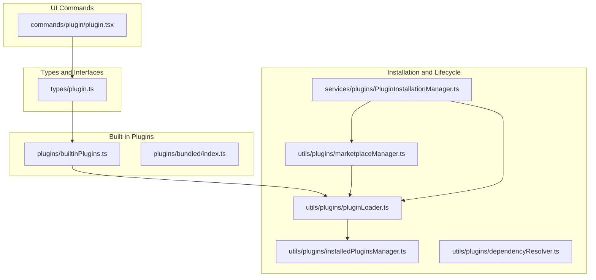

**Diagram sources**
- [plugin.ts:1-364](file://src/types/plugin.ts#L1-L364)
- [builtinPlugins.ts:1-160](file://src/plugins/builtinPlugins.ts#L1-L160)
- [index.ts:1-24](file://src/plugins/bundled/index.ts#L1-L24)
- [PluginInstallationManager.ts:1-185](file://src/services/plugins/PluginInstallationManager.ts#L1-L185)
- [installedPluginsManager.ts:1-800](file://src/utils/plugins/installedPluginsManager.ts#L1-L800)
- [pluginLoader.ts:1-800](file://src/utils/plugins/pluginLoader.ts#L1-L800)
- [marketplaceManager.ts:1-800](file://src/utils/plugins/marketplaceManager.ts#L1-L800)
- [dependencyResolver.ts:1-306](file://src/utils/plugins/dependencyResolver.ts#L1-L306)
- [plugin.tsx:1-7](file://src/commands/plugin/plugin.tsx#L1-L7)

**Section sources**
- [plugin.ts:1-364](file://src/types/plugin.ts#L1-L364)
- [builtinPlugins.ts:1-160](file://src/plugins/builtinPlugins.ts#L1-L160)
- [index.ts:1-24](file://src/plugins/bundled/index.ts#L1-L24)
- [PluginInstallationManager.ts:1-185](file://src/services/plugins/PluginInstallationManager.ts#L1-L185)
- [installedPluginsManager.ts:1-800](file://src/utils/plugins/installedPluginsManager.ts#L1-L800)
- [pluginLoader.ts:1-800](file://src/utils/plugins/pluginLoader.ts#L1-L800)
- [marketplaceManager.ts:1-800](file://src/utils/plugins/marketplaceManager.ts#L1-L800)
- [dependencyResolver.ts:1-306](file://src/utils/plugins/dependencyResolver.ts#L1-L306)
- [plugin.tsx:1-7](file://src/commands/plugin/plugin.tsx#L1-L7)

## Core Components
- Plugin types and error model define the contract for plugin metadata, components, and error reporting.
- Built-in plugin registry exposes a declarative API for registering and enumerating built-in plugins.
- Marketplace manager coordinates known marketplaces, caching, and updates.
- Plugin loader discovers, validates, and caches plugin content from multiple sources.
- Installed plugins manager maintains persistent installation records and migration logic.
- Dependency resolver enforces presence guarantees across plugins and detects cycles or cross-marketplace violations.
- Installation manager orchestrates background reconciliation of marketplaces and plugin refresh.

**Section sources**
- [plugin.ts:1-364](file://src/types/plugin.ts#L1-L364)
- [builtinPlugins.ts:1-160](file://src/plugins/builtinPlugins.ts#L1-L160)
- [marketplaceManager.ts:1-800](file://src/utils/plugins/marketplaceManager.ts#L1-L800)
- [pluginLoader.ts:1-800](file://src/utils/plugins/pluginLoader.ts#L1-L800)
- [installedPluginsManager.ts:1-800](file://src/utils/plugins/installedPluginsManager.ts#L1-L800)
- [dependencyResolver.ts:1-306](file://src/utils/plugins/dependencyResolver.ts#L1-L306)
- [PluginInstallationManager.ts:1-185](file://src/services/plugins/PluginInstallationManager.ts#L1-L185)

## Architecture Overview
The plugin system integrates discovery, installation, caching, and runtime loading with robust error handling and security controls.

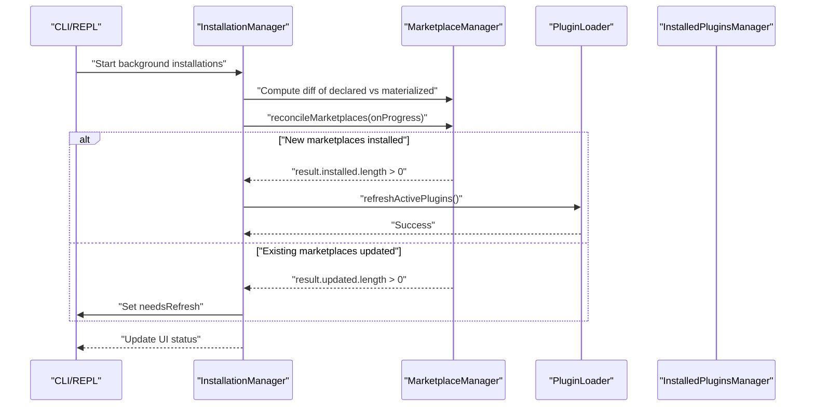

**Diagram sources**
- [PluginInstallationManager.ts:60-185](file://src/services/plugins/PluginInstallationManager.ts#L60-L185)
- [marketplaceManager.ts:1-800](file://src/utils/plugins/marketplaceManager.ts#L1-L800)
- [pluginLoader.ts:1-800](file://src/utils/plugins/pluginLoader.ts#L1-L800)

## Detailed Component Analysis

### Built-in Plugin Registry
Built-in plugins are registered at startup and exposed as toggleable components. They appear in the plugin UI under a “Built-in” section and can provide skills, hooks, and MCP servers.

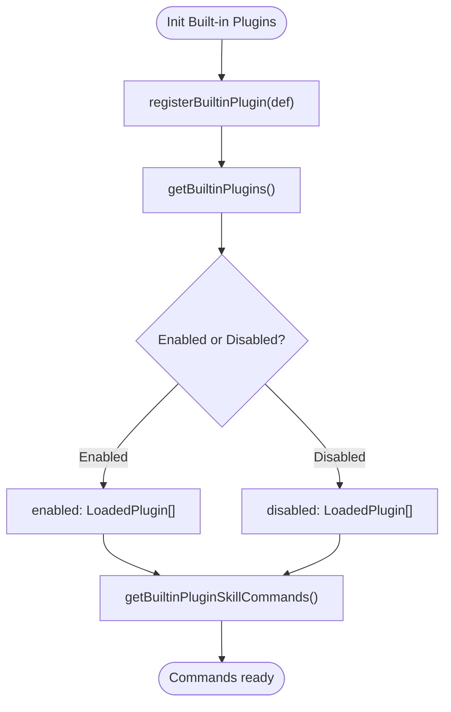

**Diagram sources**
- [builtinPlugins.ts:25-121](file://src/plugins/builtinPlugins.ts#L25-L121)
- [index.ts:17-23](file://src/plugins/bundled/index.ts#L17-L23)

**Section sources**
- [builtinPlugins.ts:1-160](file://src/plugins/builtinPlugins.ts#L1-L160)
- [index.ts:1-24](file://src/plugins/bundled/index.ts#L1-L24)

### Plugin Types and Manifest Contracts
The type definitions establish:
- Plugin manifest and metadata
- Loaded plugin representation with component paths and settings
- Error discriminated union for precise diagnostics
- Component categories (commands, agents, skills, hooks, output-styles)

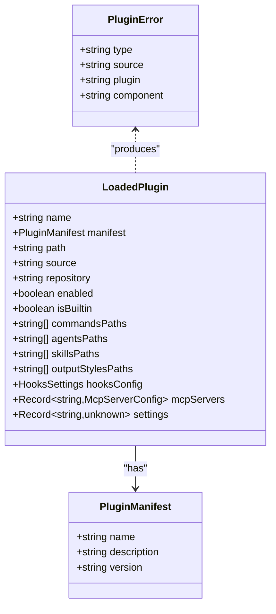

**Diagram sources**
- [plugin.ts:48-70](file://src/types/plugin.ts#L48-L70)
- [plugin.ts:101-283](file://src/types/plugin.ts#L101-L283)

**Section sources**
- [plugin.ts:1-364](file://src/types/plugin.ts#L1-L364)

### Marketplace Management and Installation
Marketplaces are declared and reconciled. The system supports URL-based, GitHub, and local sources, with caching and update logic.

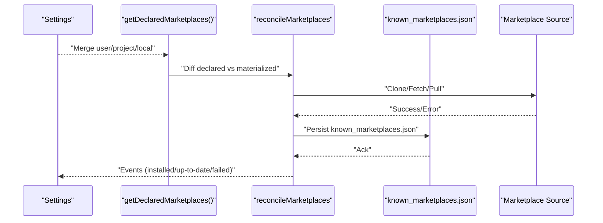

**Diagram sources**
- [marketplaceManager.ts:161-192](file://src/utils/plugins/marketplaceManager.ts#L161-L192)
- [marketplaceManager.ts:264-298](file://src/utils/plugins/marketplaceManager.ts#L264-L298)
- [marketplaceManager.ts:327-350](file://src/utils/plugins/marketplaceManager.ts#L327-L350)

**Section sources**
- [marketplaceManager.ts:1-800](file://src/utils/plugins/marketplaceManager.ts#L1-L800)

### Plugin Loader and Caching
The loader resolves plugin paths, copies to versioned cache, supports ZIP cache mode, and handles git subdirectory extraction and npm installs.

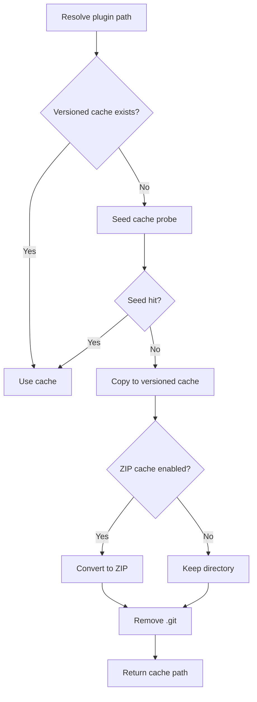

**Diagram sources**
- [pluginLoader.ts:266-287](file://src/utils/plugins/pluginLoader.ts#L266-L287)
- [pluginLoader.ts:400-465](file://src/utils/plugins/pluginLoader.ts#L400-L465)
- [pluginLoader.ts:491-524](file://src/utils/plugins/pluginLoader.ts#L491-L524)

**Section sources**
- [pluginLoader.ts:1-800](file://src/utils/plugins/pluginLoader.ts#L1-L800)

### Installed Plugins Persistence and Migration
Installed plugins are tracked in a single consolidated file with versioned entries and scopes. Migration logic consolidates legacy formats and cleans up legacy cache directories.

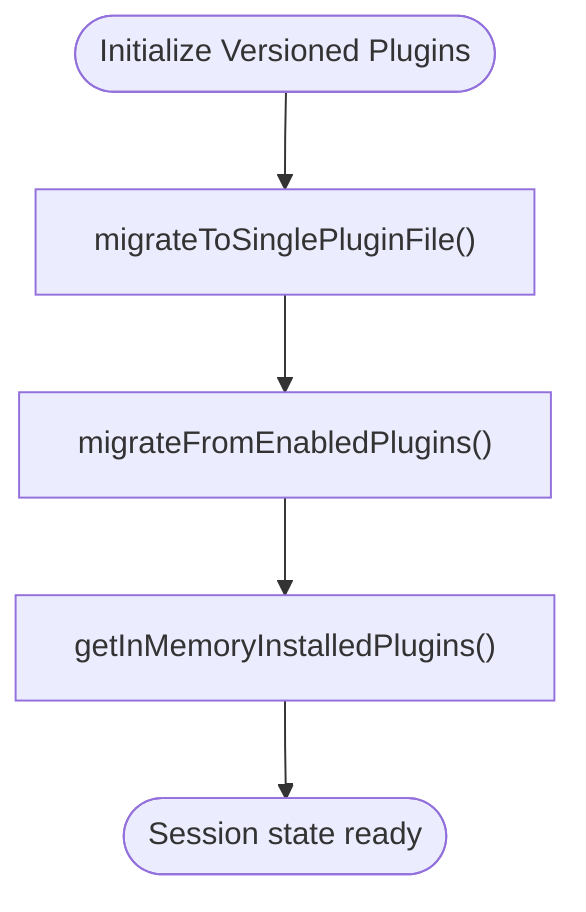

**Diagram sources**
- [installedPluginsManager.ts:714-734](file://src/utils/plugins/installedPluginsManager.ts#L714-L734)

**Section sources**
- [installedPluginsManager.ts:1-800](file://src/utils/plugins/installedPluginsManager.ts#L1-L800)

### Dependency Resolution and Enforcement
Dependencies are resolved with security boundaries and load-time verification. Cross-marketplace dependencies are blocked unless explicitly allowed by the root marketplace.

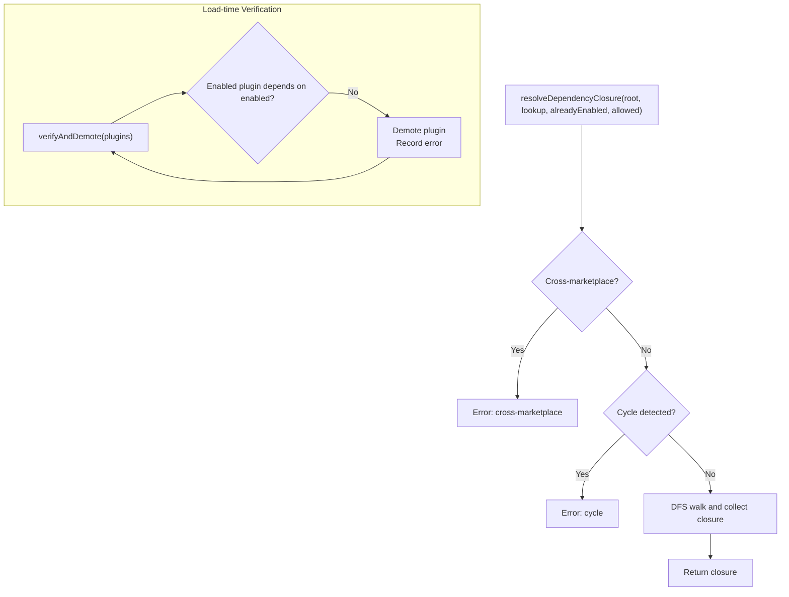

**Diagram sources**
- [dependencyResolver.ts:95-159](file://src/utils/plugins/dependencyResolver.ts#L95-L159)
- [dependencyResolver.ts:177-234](file://src/utils/plugins/dependencyResolver.ts#L177-L234)

**Section sources**
- [dependencyResolver.ts:1-306](file://src/utils/plugins/dependencyResolver.ts#L1-L306)

### Plugin Installation Manager (Background)
Performs background marketplace reconciliation and auto-refreshes plugins when new marketplaces are installed, or sets a needsRefresh flag when updates occur.

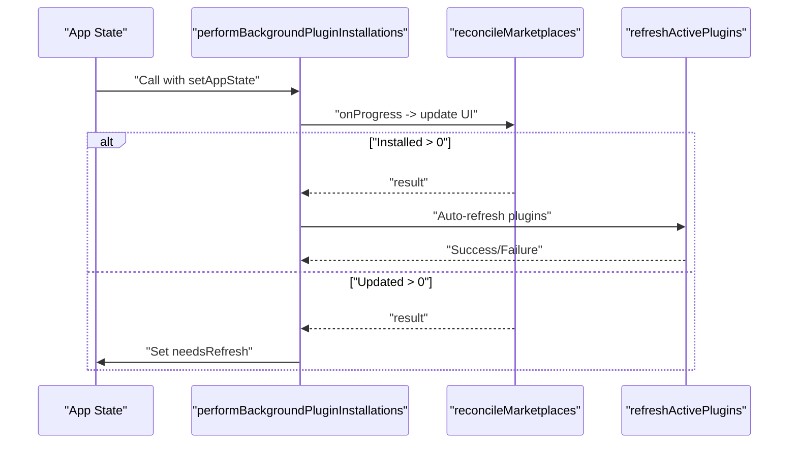

**Diagram sources**
- [PluginInstallationManager.ts:60-185](file://src/services/plugins/PluginInstallationManager.ts#L60-L185)

**Section sources**
- [PluginInstallationManager.ts:1-185](file://src/services/plugins/PluginInstallationManager.ts#L1-L185)

### Plugin Settings UI Command
The plugin settings command renders a React component to manage plugin settings.

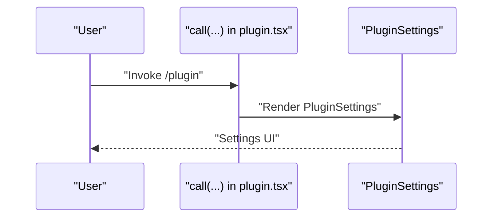

**Diagram sources**
- [plugin.tsx:1-7](file://src/commands/plugin/plugin.tsx#L1-L7)

**Section sources**
- [plugin.tsx:1-7](file://src/commands/plugin/plugin.tsx#L1-L7)

## Dependency Analysis
The plugin system exhibits layered cohesion:
- Types define contracts consumed by registry, loader, and managers.
- Registry depends on types and settings to enumerate built-in plugins.
- Loader depends on marketplace manager, installed plugins manager, and filesystem utilities.
- Installation manager depends on marketplace manager and loader for refresh.
- Dependency resolver operates independently on loaded plugin sets.

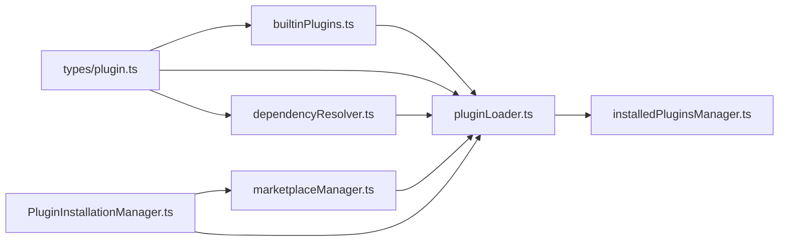

**Diagram sources**
- [plugin.ts:1-364](file://src/types/plugin.ts#L1-L364)
- [builtinPlugins.ts:1-160](file://src/plugins/builtinPlugins.ts#L1-L160)
- [marketplaceManager.ts:1-800](file://src/utils/plugins/marketplaceManager.ts#L1-L800)
- [pluginLoader.ts:1-800](file://src/utils/plugins/pluginLoader.ts#L1-L800)
- [installedPluginsManager.ts:1-800](file://src/utils/plugins/installedPluginsManager.ts#L1-L800)
- [dependencyResolver.ts:1-306](file://src/utils/plugins/dependencyResolver.ts#L1-L306)
- [PluginInstallationManager.ts:1-185](file://src/services/plugins/PluginInstallationManager.ts#L1-L185)

**Section sources**
- [plugin.ts:1-364](file://src/types/plugin.ts#L1-L364)
- [builtinPlugins.ts:1-160](file://src/plugins/builtinPlugins.ts#L1-L160)
- [marketplaceManager.ts:1-800](file://src/utils/plugins/marketplaceManager.ts#L1-L800)
- [pluginLoader.ts:1-800](file://src/utils/plugins/pluginLoader.ts#L1-L800)
- [installedPluginsManager.ts:1-800](file://src/utils/plugins/installedPluginsManager.ts#L1-L800)
- [dependencyResolver.ts:1-306](file://src/utils/plugins/dependencyResolver.ts#L1-L306)
- [PluginInstallationManager.ts:1-185](file://src/services/plugins/PluginInstallationManager.ts#L1-L185)

## Performance Considerations
- Versioned cache paths and optional ZIP cache reduce I/O overhead and improve cold-start performance.
- Seed cache probing short-circuits expensive downloads for first-boot scenarios.
- Memoization and caching of marketplace data minimize repeated network and disk operations.
- Background reconciliation defers heavy operations to avoid blocking startup.

[No sources needed since this section provides general guidance]

## Troubleshooting Guide
Common issues and diagnostics:
- Plugin not found in marketplace: indicates missing or outdated cache; trigger refresh or reinstall.
- Dependency unsatisfied: verify enabled state and marketplace scope; use reverse-dependency hints.
- Network/Git errors: inspect telemetry and error messages for timeouts, authentication, or host key verification failures.
- Marketplace blocked by policy: confirm allowed marketplaces and enterprise policies.

**Section sources**
- [plugin.ts:295-363](file://src/types/plugin.ts#L295-L363)
- [dependencyResolver.ts:177-234](file://src/utils/plugins/dependencyResolver.ts#L177-L234)
- [marketplaceManager.ts:649-709](file://src/utils/plugins/marketplaceManager.ts#L649-L709)

## Conclusion
The Plugin System provides a robust, secure, and extensible framework for plugin discovery, installation, caching, and runtime management. Its type-safe error model, dependency enforcement, and background reconciliation mechanisms support reliable plugin workflows across diverse environments.

[No sources needed since this section summarizes without analyzing specific files]

## Appendices

### Plugin Development Guidelines
- Manifest and metadata: Define plugin metadata and optional dependencies in the manifest schema.
- Component registration: Expose commands, agents, skills, hooks, and output styles via plugin paths.
- Tool integration: Integrate with MCP servers and LSP servers through configuration objects.
- UI components: Render settings and options using the provided command interface.

**Section sources**
- [plugin.ts:1-364](file://src/types/plugin.ts#L1-L364)
- [builtinPlugins.ts:1-160](file://src/plugins/builtinPlugins.ts#L1-L160)
- [pluginLoader.ts:1-800](file://src/utils/plugins/pluginLoader.ts#L1-L800)

### Plugin Installation and Registration Patterns
- Built-in plugins: Register at startup and expose toggleable features.
- Marketplace plugins: Declare marketplaces, reconcile, and refresh as needed.
- Session-only plugins: Use inline sources for development and testing.

**Section sources**
- [index.ts:1-24](file://src/plugins/bundled/index.ts#L1-L24)
- [PluginInstallationManager.ts:60-185](file://src/services/plugins/PluginInstallationManager.ts#L60-L185)
- [pluginLoader.ts:1-800](file://src/utils/plugins/pluginLoader.ts#L1-L800)

### Configuration and Settings Management
- Persistent installation records: Consolidated JSON with versioned entries and scopes.
- Migration: Automatic migration from legacy formats and cleanup of legacy cache directories.
- Settings synchronization: Sync enabled plugin state to installed records.

**Section sources**
- [installedPluginsManager.ts:1-800](file://src/utils/plugins/installedPluginsManager.ts#L1-L800)

### Dependency Resolution and Security
- Presence guarantees: Dependencies are enforced at load time; unsatisfied dependencies demote offending plugins.
- Cross-marketplace restrictions: Auto-install across marketplaces is blocked unless explicitly allowed by the root marketplace.
- Cycle detection: DFS-based resolution detects circular dependencies.

**Section sources**
- [dependencyResolver.ts:1-306](file://src/utils/plugins/dependencyResolver.ts#L1-L306)

### Examples from the Codebase
- Built-in plugin registration and enumeration
  - [builtinPlugins.ts:25-121](file://src/plugins/builtinPlugins.ts#L25-L121)
  - [index.ts:17-23](file://src/plugins/bundled/index.ts#L17-L23)
- Marketplace reconciliation and caching
  - [marketplaceManager.ts:161-192](file://src/utils/plugins/marketplaceManager.ts#L161-L192)
  - [marketplaceManager.ts:264-298](file://src/utils/plugins/marketplaceManager.ts#L264-L298)
- Plugin loader and cache copy
  - [pluginLoader.ts:400-465](file://src/utils/plugins/pluginLoader.ts#L400-L465)
- Installed plugins persistence and migration
  - [installedPluginsManager.ts:714-734](file://src/utils/plugins/installedPluginsManager.ts#L714-L734)
- Dependency resolution and verification
  - [dependencyResolver.ts:95-159](file://src/utils/plugins/dependencyResolver.ts#L95-L159)
  - [dependencyResolver.ts:177-234](file://src/utils/plugins/dependencyResolver.ts#L177-L234)
- Background installation orchestration
  - [PluginInstallationManager.ts:60-185](file://src/services/plugins/PluginInstallationManager.ts#L60-L185)
- Plugin settings UI command
  - [plugin.tsx:1-7](file://src/commands/plugin/plugin.tsx#L1-L7)