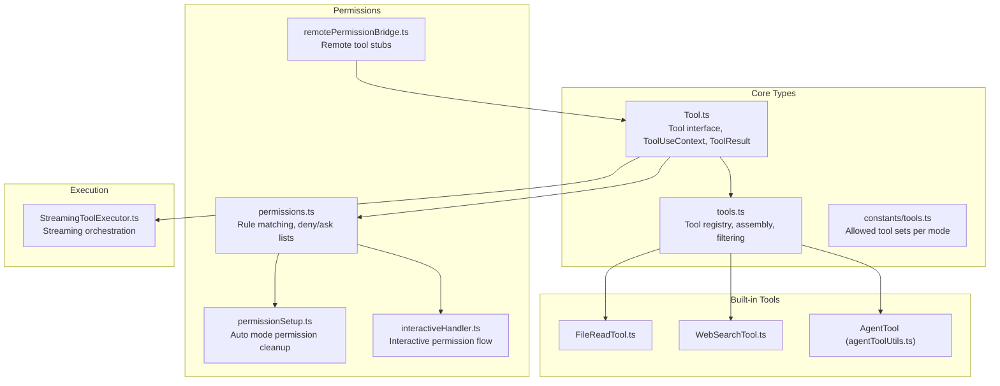
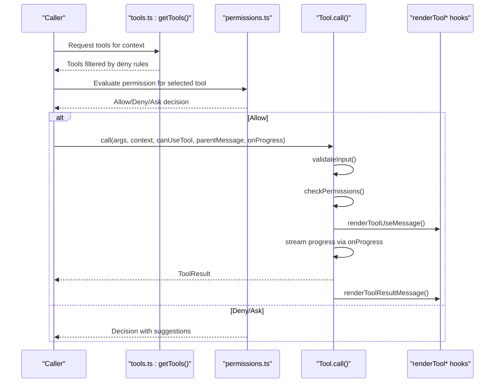
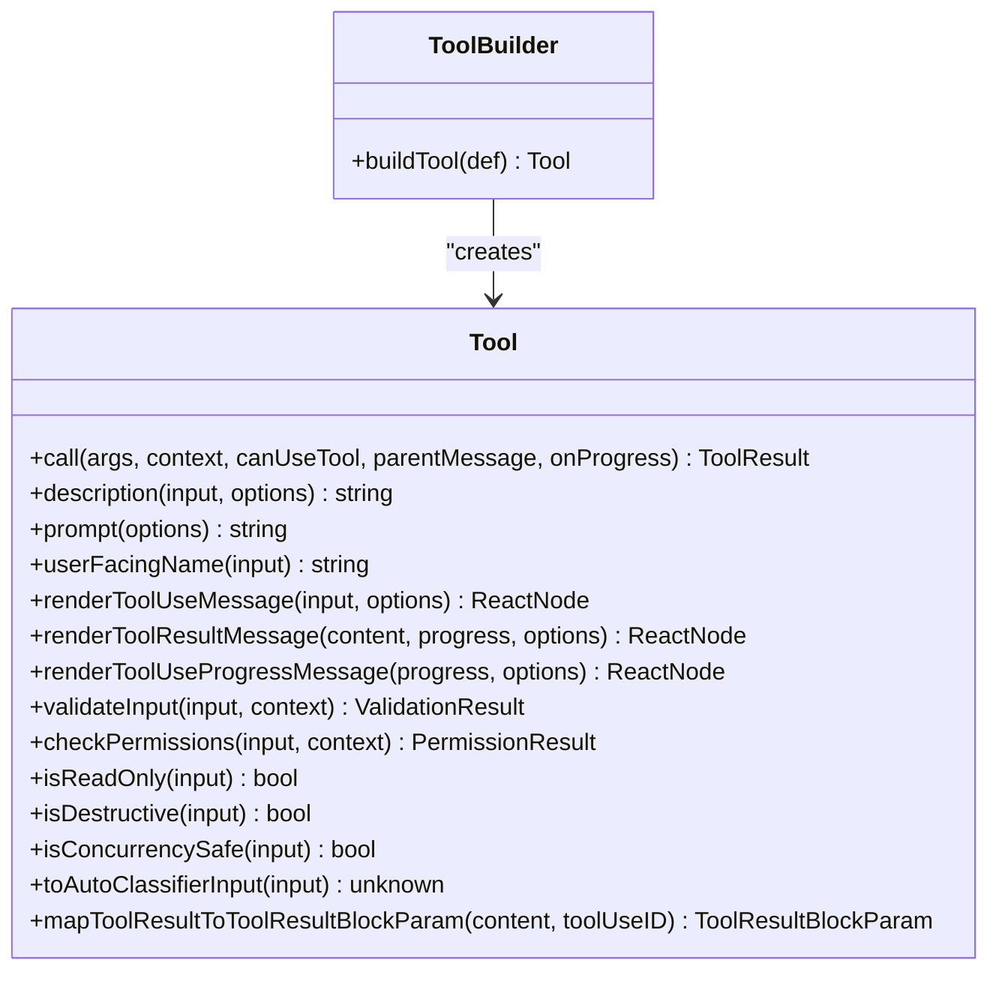
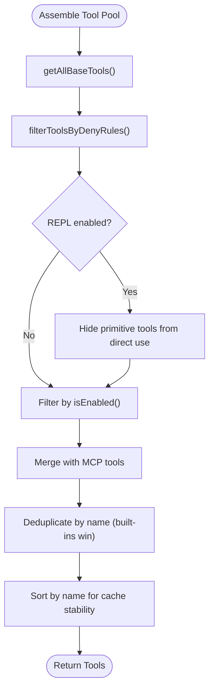
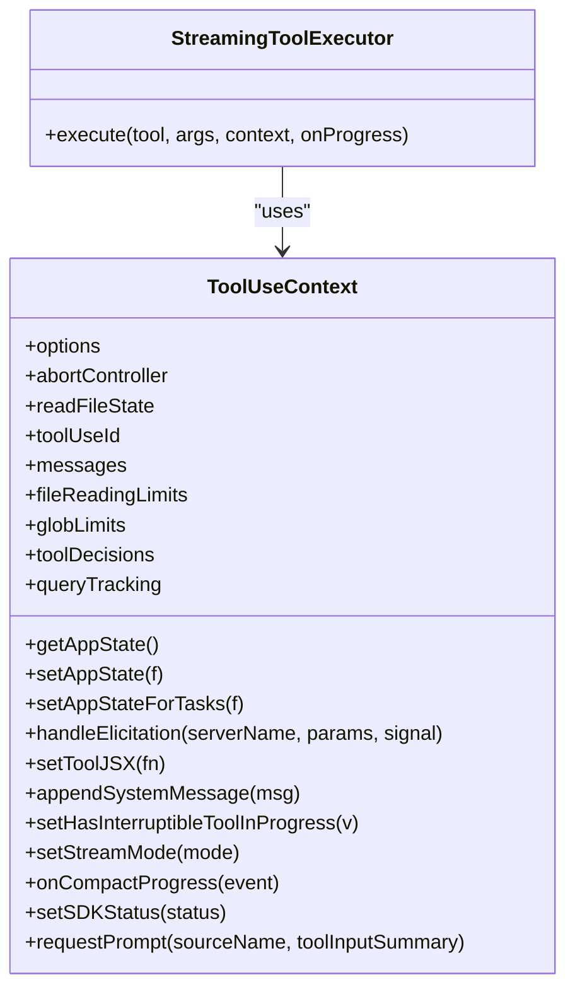
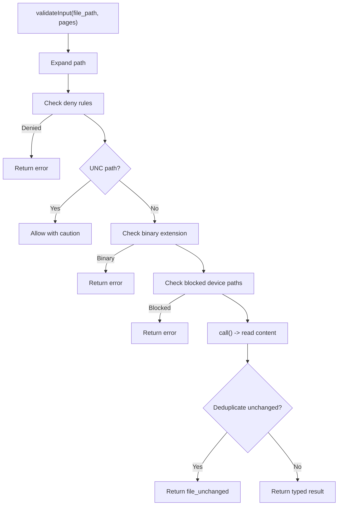
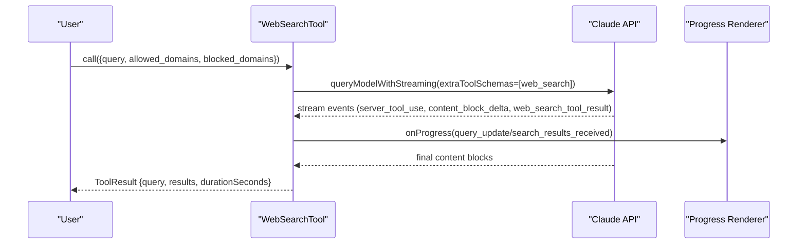
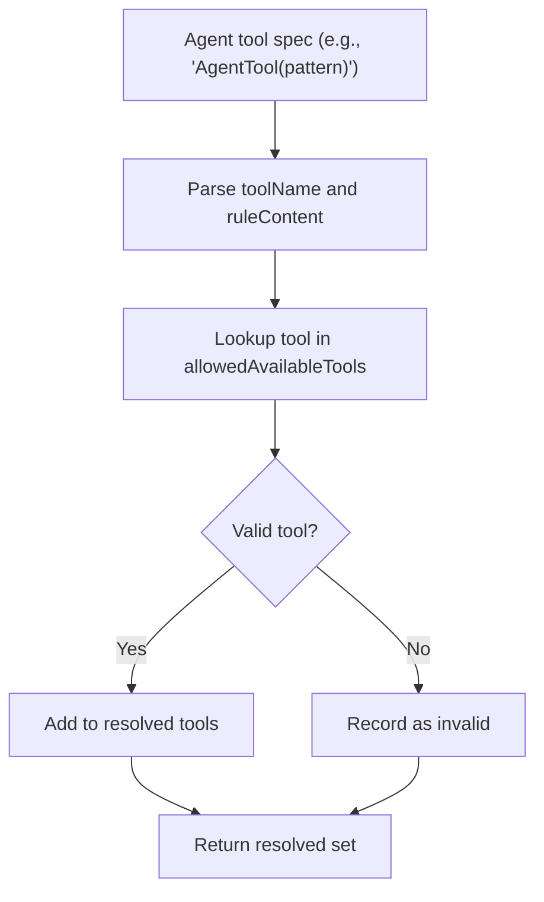
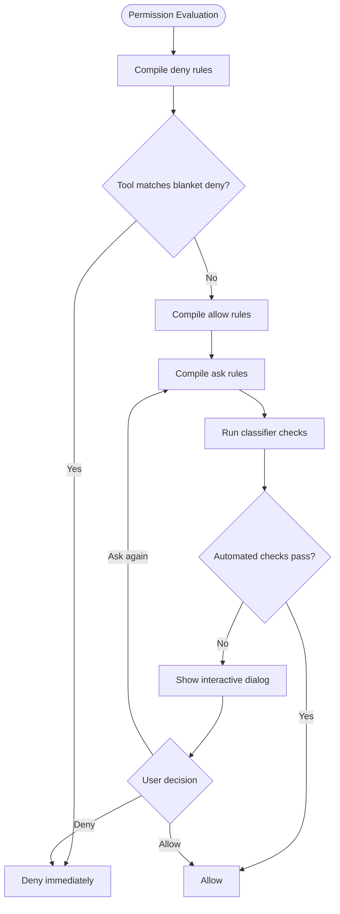
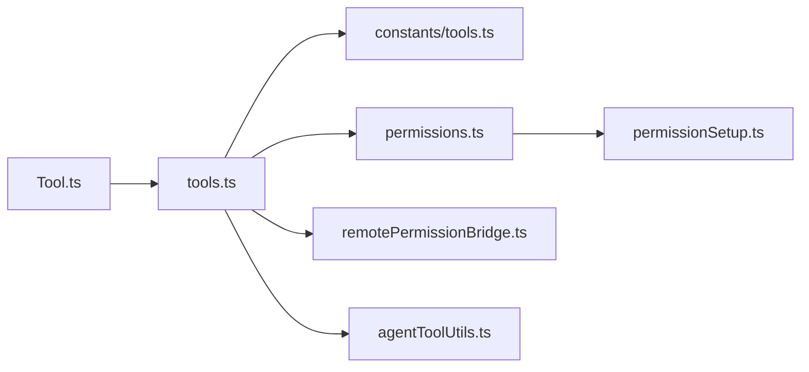

# Tool API

<cite>
**Referenced Files in This Document**
- [Tool.ts](file://src/Tool.ts)
- [tools.ts](file://src/tools.ts)
- [tools.ts (constants)](file://src/constants/tools.ts)
- [FileReadTool.ts](file://src/tools/FileReadTool/FileReadTool.ts)
- [WebSearchTool.ts](file://src/tools/WebSearchTool/WebSearchTool.ts)
- [permissionSetup.ts](file://src/utils/permissions/permissionSetup.ts)
- [permissions.ts](file://src/utils/permissions/permissions.ts)
- [remotePermissionBridge.ts](file://src/remote/remotePermissionBridge.ts)
- [interactiveHandler.ts](file://src/hooks/toolPermission/handlers/interactiveHandler.ts)
- [agentToolUtils.ts](file://src/tools/AgentTool/agentToolUtils.ts)
- [StreamingToolExecutor.ts](file://src/services/tools/StreamingToolExecutor.ts)
</cite>

## Table of Contents
1. [Introduction](#introduction)
2. [Project Structure](#project-structure)
3. [Core Components](#core-components)
4. [Architecture Overview](#architecture-overview)
5. [Detailed Component Analysis](#detailed-component-analysis)
6. [Dependency Analysis](#dependency-analysis)
7. [Performance Considerations](#performance-considerations)
8. [Troubleshooting Guide](#troubleshooting-guide)
9. [Conclusion](#conclusion)

## Introduction
This document describes the Tool System API used to define, register, and execute tools within the application. It covers the Tool interface, execution context, permission system, built-in tools for file operations, web search, and agent coordination, and the orchestration patterns for streaming and progress reporting. It also includes practical examples drawn from the codebase to illustrate implementation patterns, parameter schemas, and security considerations.

## Project Structure
The Tool System spans several modules:
- Core type definitions and builder for tools
- Tool registry and assembly logic
- Built-in tools for file operations, shell, web search, and agent coordination
- Permission system and UI handlers
- Streaming executor and progress reporting

**Diagram sources**
- [Tool.ts](file://src/Tool.ts)
- [tools.ts](file://src/tools.ts)
- [constants/tools.ts](file://src/constants/tools.ts)
- [FileReadTool.ts](file://src/tools/FileReadTool/FileReadTool.ts)
- [WebSearchTool.ts](file://src/tools/WebSearchTool/WebSearchTool.ts)
- [permissionSetup.ts](file://src/utils/permissions/permissionSetup.ts)
- [permissions.ts](file://src/utils/permissions/permissions.ts)
- [remotePermissionBridge.ts](file://src/remote/remotePermissionBridge.ts)
- [interactiveHandler.ts](file://src/hooks/toolPermission/handlers/interactiveHandler.ts)
- [StreamingToolExecutor.ts](file://src/services/tools/StreamingToolExecutor.ts)

**Section sources**
- [Tool.ts](file://src/Tool.ts)
- [tools.ts](file://src/tools.ts)
- [constants/tools.ts](file://src/constants/tools.ts)

## Core Components
- Tool interface: Defines the contract for all tools, including execute, permission, validation, rendering, and progress hooks.
- ToolUseContext: Provides runtime context for tool execution, including options, abort controller, file state cache, and UI hooks.
- ToolResult: Encapsulates tool output, optional new messages, and MCP metadata.
- Tool builder: A factory that fills in safe defaults for optional methods and ensures consistent behavior across tools.

Key capabilities:
- Parameter validation and schema enforcement via Zod schemas
- Permission gating with allow/deny/ask rules and classifier integration
- Concurrency safety and destructive/read-only flags
- Streaming progress reporting and UI rendering hooks
- Defer/loading behavior for tools that benefit from search-first discovery

**Section sources**
- [Tool.ts](file://src/Tool.ts)
- [tools.ts](file://src/tools.ts)

## Architecture Overview
The Tool System orchestrates tool execution through a layered pipeline:
- Registry and assembly: Collects built-in and MCP tools, filters by permission context, and deduplicates by name.
- Permission evaluation: Applies deny/ask/allow rules, optionally involving classifier checks and interactive dialogs.
- Execution: Calls tool.call with ToolUseContext and optional progress callbacks.
- Rendering: Produces UI messages, progress messages, and result blocks for transcripts.

**Diagram sources**
- [tools.ts](file://src/tools.ts)
- [permissions.ts](file://src/utils/permissions/permissions.ts)
- [Tool.ts](file://src/Tool.ts)

## Detailed Component Analysis

### Tool Interface and Builder
The Tool interface defines:
- call: Executes the tool with input, context, and optional progress callback
- description, prompt: Human-facing descriptions and system prompts
- inputSchema/outputSchema: Parameter and result schemas
- Permission and validation hooks: validateInput, checkPermissions
- Rendering and UI hooks: renderToolUseMessage, renderToolResultMessage, progress rendering
- Behavior flags: isReadOnly, isDestructive, isConcurrencySafe, shouldDefer, alwaysLoad
- MCP and LSP flags, path extraction, and observable input backfill

The builder fills in safe defaults for commonly stubbed methods and ensures consistent behavior.

**Diagram sources**
- [Tool.ts](file://src/Tool.ts)

**Section sources**
- [Tool.ts](file://src/Tool.ts)

### Tool Registration Patterns and Lifecycle
- Centralized registry: getAllBaseTools composes built-in tools, conditionally enabling features and environment-specific tools.
- Filtering: filterToolsByDenyRules removes tools matched by blanket deny rules; getTools further filters by isEnabled and REPL visibility.
- Assembly: assembleToolPool merges built-in and MCP tools, deduplicating by name and sorting for cache stability.
- Lifecycle: Tools are instantiated via buildTool, validated via validateInput, permission-checked via checkPermissions, and executed via call with optional progress callbacks.

**Diagram sources**
- [tools.ts](file://src/tools.ts)

**Section sources**
- [tools.ts](file://src/tools.ts)

### Execution Context and Orchestration
ToolUseContext provides:
- Options: commands, debug flags, thinking config, MCP clients/resources, agent definitions, budget, system prompts, query source
- Runtime helpers: AbortController, file state cache, AppState getters/setters, notification/UI hooks
- Streaming and telemetry: Spinner mode, compact progress, SDK status, and metrics hooks

StreamingToolExecutor coordinates streaming tool execution, emitting progress events and aggregating results.

**Diagram sources**
- [Tool.ts](file://src/Tool.ts)
- [StreamingToolExecutor.ts](file://src/services/tools/StreamingToolExecutor.ts)

**Section sources**
- [Tool.ts](file://src/Tool.ts)
- [StreamingToolExecutor.ts](file://src/services/tools/StreamingToolExecutor.ts)

### Built-in Tools

#### FileReadTool
- Purpose: Read files with support for text, images, PDFs, notebooks, and partial ranges.
- Validation: Path expansion, deny rule checks, UNC path awareness, binary extension checks, blocked device files.
- Limits: Enforces max tokens and max size via context-provided limits; deduplicates unchanged reads.
- Security: Includes cyber risk mitigation reminders for supported models; emits analytics on overrides and dedup hits.
- Rendering: Provides concise summaries and specialized UI for different content types.

**Diagram sources**
- [FileReadTool.ts](file://src/tools/FileReadTool/FileReadTool.ts)

**Section sources**
- [FileReadTool.ts](file://src/tools/FileReadTool/FileReadTool.ts)

#### WebSearchTool
- Purpose: Perform web searches using a specialized tool schema and stream results.
- Permission: Requires explicit permission; suggests adding allow rules to local settings.
- Streaming: Emits progress events for query updates and search results arrival.
- Output: Aggregates textual commentary and search hits; maps to a transcript-friendly result block.

**Diagram sources**
- [WebSearchTool.ts](file://src/tools/WebSearchTool/WebSearchTool.ts)

**Section sources**
- [WebSearchTool.ts](file://src/tools/WebSearchTool/WebSearchTool.ts)

#### AgentTool and Agent Coordination
- AgentTool integrates agent definitions and manages agent availability per mode.
- agentToolUtils resolves agent tool specs, supports wildcard and permission patterns, and validates against allowed tool sets.

**Diagram sources**
- [agentToolUtils.ts](file://src/tools/AgentTool/agentToolUtils.ts)

**Section sources**
- [agentToolUtils.ts](file://src/tools/AgentTool/agentToolUtils.ts)
- [constants/tools.ts](file://src/constants/tools.ts)

### Permission System
- Classification: Tools can opt-in to classifier input via toAutoClassifierInput; sensitive tools should provide meaningful inputs.
- Validation: validateInput performs early checks to fail fast and provide actionable error codes.
- Rules: deny/ask/allow rules are compiled into PermissionRule arrays; blanket denies filter tools before runtime.
- Interactive flow: interactiveHandler coordinates automated checks and user dialogs, resolving permission decisions asynchronously.
- Auto mode cleanup: stripDangerousPermissionsForAutoMode removes rules that would bypass the classifier.

**Diagram sources**
- [permissions.ts](file://src/utils/permissions/permissions.ts)
- [permissionSetup.ts](file://src/utils/permissions/permissionSetup.ts)
- [interactiveHandler.ts](file://src/hooks/toolPermission/handlers/interactiveHandler.ts)

**Section sources**
- [permissions.ts](file://src/utils/permissions/permissions.ts)
- [permissionSetup.ts](file://src/utils/permissions/permissionSetup.ts)
- [interactiveHandler.ts](file://src/hooks/toolPermission/handlers/interactiveHandler.ts)

### Remote Tool Stubs and MCP Integration
- Remote environments may expose tools not present locally; remotePermissionBridge creates minimal Tool stubs that route to fallback permission handling.

**Section sources**
- [remotePermissionBridge.ts](file://src/remote/remotePermissionBridge.ts)

### Tool Implementation Patterns and Examples
- Parameter schemas: Use lazySchema with Zod strictObject to define inputs and outputs; ensure schemas are exported for tool choice and validation.
- Validation: Implement validateInput to enforce constraints early; return structured ValidationResult with error codes for UI.
- Permissions: Implement checkPermissions to integrate with classifier and rule systems; return PermissionResult with suggestions when needed.
- Streaming: Emit ToolProgress via onProgress; implement renderToolUseProgressMessage to reflect progress in UI.
- Rendering: Provide renderToolUseMessage, renderToolResultMessage, and optional renderToolUseErrorMessage/renderToolUseRejectedMessage for rich UI.

Concrete examples from the codebase:
- FileReadTool demonstrates path expansion, deny rule checks, binary detection, device file blocking, deduplication, and cyber risk mitigation.
- WebSearchTool demonstrates streaming progress, domain constraints, and structured output mapping.

**Section sources**
- [FileReadTool.ts](file://src/tools/FileReadTool/FileReadTool.ts)
- [WebSearchTool.ts](file://src/tools/WebSearchTool/WebSearchTool.ts)
- [Tool.ts](file://src/Tool.ts)

## Dependency Analysis
- Tool.ts depends on central types for permissions, progress, messages, and UI hooks.
- tools.ts aggregates tools, respects environment flags and features, and enforces mode-specific restrictions.
- constants/tools.ts defines allowed tool sets for agent modes and coordinator mode.
- permissions.ts and permissionSetup.ts provide rule compilation, matching, and auto-mode cleanup.
- remotePermissionBridge.ts bridges permission handling for remote tool stubs.
- agentToolUtils.ts resolves agent tool specs and validates against allowed sets.

**Diagram sources**
- [Tool.ts](file://src/Tool.ts)
- [tools.ts](file://src/tools.ts)
- [constants/tools.ts](file://src/constants/tools.ts)
- [permissions.ts](file://src/utils/permissions/permissions.ts)
- [permissionSetup.ts](file://src/utils/permissions/permissionSetup.ts)
- [remotePermissionBridge.ts](file://src/remote/remotePermissionBridge.ts)
- [agentToolUtils.ts](file://src/tools/AgentTool/agentToolUtils.ts)

**Section sources**
- [Tool.ts](file://src/Tool.ts)
- [tools.ts](file://src/tools.ts)
- [constants/tools.ts](file://src/constants/tools.ts)
- [permissions.ts](file://src/utils/permissions/permissions.ts)
- [permissionSetup.ts](file://src/utils/permissions/permissionSetup.ts)
- [remotePermissionBridge.ts](file://src/remote/remotePermissionBridge.ts)
- [agentToolUtils.ts](file://src/tools/AgentTool/agentToolUtils.ts)

## Performance Considerations
- Concurrency safety: Mark tools as isConcurrencySafe when safe to run concurrently to maximize throughput.
- Streaming: Use onProgress to avoid long blocking periods and provide responsive UI feedback.
- Caching and deduplication: FileReadTool deduplicates unchanged reads to reduce token usage and latency.
- Schema validation: Keep schemas strict and minimal to reduce overhead during validation.
- MCP tool merging: Maintain sorted order and deduplicate by name to preserve prompt-cache stability.

## Troubleshooting Guide
Common issues and resolutions:
- Permission denials: Review deny rules and consider adding allow rules or adjusting working directory allowances.
- Interactive permission delays: Configure awaitAutomatedChecksBeforeDialog to wait for classifier checks before showing dialogs.
- UNC path warnings: UNC paths are allowed with caution; ensure network credentials are handled securely.
- Binary file errors: Use appropriate tools for binary analysis; FileReadTool rejects unsupported binary files.
- Streaming progress: Ensure onProgress is wired to UI components; verify progress message filtering and rendering hooks.

**Section sources**
- [permissions.ts](file://src/utils/permissions/permissions.ts)
- [interactiveHandler.ts](file://src/hooks/toolPermission/handlers/interactiveHandler.ts)
- [FileReadTool.ts](file://src/tools/FileReadTool/FileReadTool.ts)
- [Tool.ts](file://src/Tool.ts)

## Conclusion
The Tool System provides a robust, secure, and extensible framework for defining and executing tools. Its strong typing, permission system, streaming support, and rich rendering hooks enable both powerful automation and safe user experiences. By following the implementation patterns outlined here—strict schemas, early validation, classifier-aware permissions, and streaming progress—developers can build reliable tools that integrate seamlessly with the broader system.