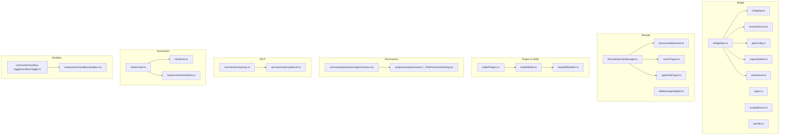
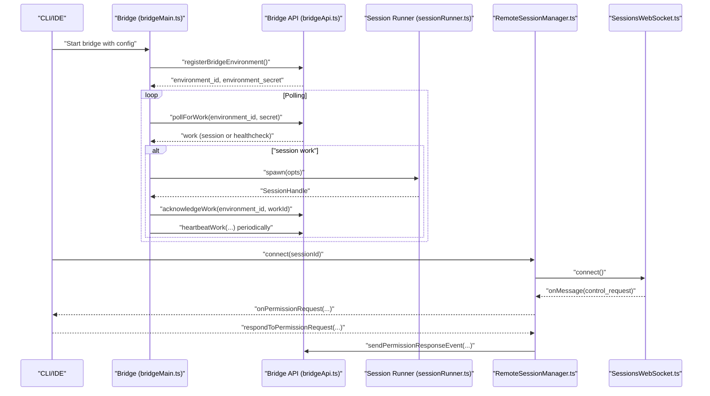
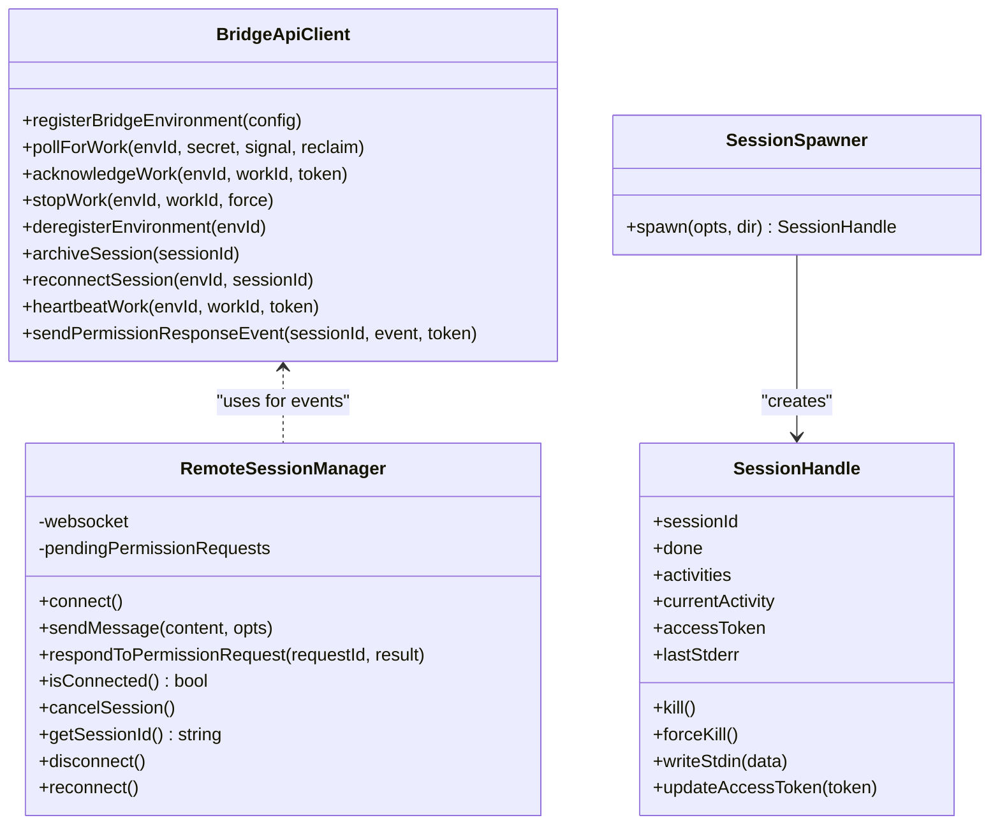
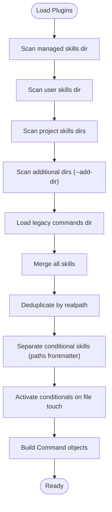
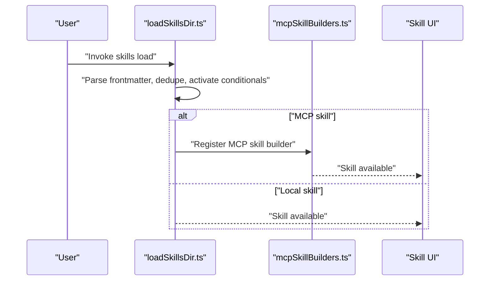
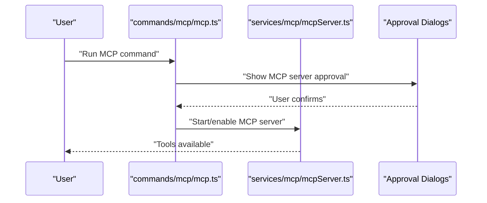
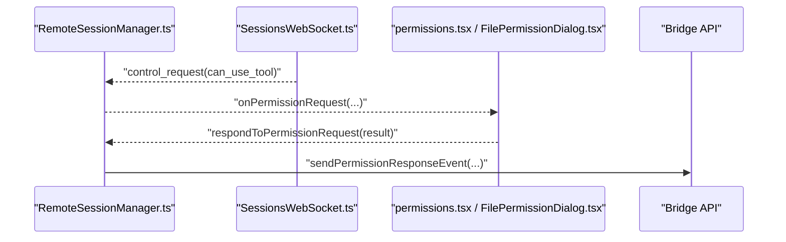
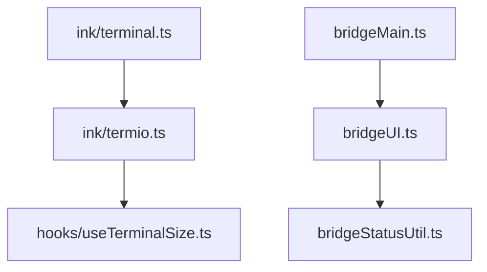
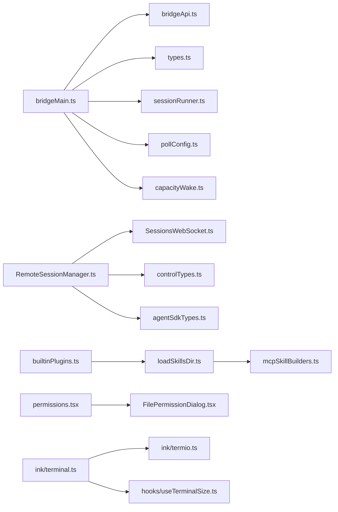

# Advanced Features

<cite>
**Referenced Files in This Document**
- [bridgeMain.ts](file://claude_code_src/restored-src/src/bridge/bridgeMain.ts)
- [bridgeApi.ts](file://claude_code_src/restored-src/src/bridge/bridgeApi.ts)
- [types.ts](file://claude_code_src/restored-src/src/bridge/types.ts)
- [RemoteSessionManager.ts](file://claude_code_src/restored-src/src/remote/RemoteSessionManager.ts)
- [builtinPlugins.ts](file://claude_code_src/restored-src/src/plugins/builtinPlugins.ts)
- [loadSkillsDir.ts](file://claude_code_src/restored-src/src/skills/loadSkillsDir.ts)
- [index.tsx](file://claude_code_src/restored-src/src/components/permissions/FilePermissionDialog/FilePermissionDialog.tsx)
- [permissions.tsx](file://claude_code_src/restored-src/src/commands/permissions/permissions.tsx)
- [sessionsWebSocket.ts](file://claude_code_src/restored-src/src/remote/SessionsWebSocket.ts)
- [sdk/controlTypes.ts](file://claude_code_src/restored-src/src/entrypoints/sdk/controlTypes.ts)
- [agentSdkTypes.ts](file://claude_code_src/restored-src/src/entrypoints/agentSdkTypes.ts)
- [mcpSkillBuilders.ts](file://claude_code_src/restored-src/src/skills/mcpSkillBuilders.ts)
- [mcpServer.ts](file://claude_code_src/restored-src/src/services/mcp/mcpServer.ts)
- [mcp.ts](file://claude_code_src/restored-src/src/commands/mcp/mcp.ts)
- [terminalSetup.ts](file://claude_code_src/restored-src/src/commands/terminalSetup/terminalSetup.ts)
- [terminal.ts](file://claude_code_src/restored-src/src/ink/terminal.ts)
- [termio.ts](file://claude_code_src/restored-src/src/ink/termio.ts)
- [useTerminalSize.ts](file://claude_code_src/restored-src/src/hooks/useTerminalSize.ts)
- [sandbox.ts](file://claude_code_src/restored-src/src/components/sandbox/sandbox.tsx)
- [sandboxToggle.ts](file://claude_code_src/restored-src/src/commands/sandbox-toggle/sandboxToggle.ts)
- [trustedDevice.ts](file://claude_code_src/restored-src/src/bridge/trustedDevice.ts)
- [jwtUtils.ts](file://claude_code_src/restored-src/src/bridge/jwtUtils.ts)
- [pollConfig.ts](file://claude_code_src/restored-src/src/bridge/pollConfig.ts)
- [sessionRunner.ts](file://claude_code_src/restored-src/src/bridge/sessionRunner.ts)
- [workSecret.ts](file://claude_code_src/restored-src/src/bridge/workSecret.ts)
- [sessionIdCompat.ts](file://claude_code_src/restored-src/src/bridge/sessionIdCompat.ts)
- [bridgeUI.ts](file://claude_code_src/restored-src/src/bridge/bridgeUI.ts)
- [bridgeStatusUtil.ts](file://claude_code_src/restored-src/src/bridge/bridgeStatusUtil.ts)
- [bridgeMessaging.ts](file://claude_code_src/restored-src/src/bridge/bridgeMessaging.ts)
- [bridgePointer.ts](file://claude_code_src/restored-src/src/bridge/bridgePointer.ts)
- [bridgeEnabled.ts](file://claude_code_src/restored-src/src/bridge/bridgeEnabled.ts)
- [envLessBridgeConfig.ts](file://claude_code_src/restored-src/src/bridge/envLessBridgeConfig.ts)
- [flushGate.ts](file://claude_code_src/restored-src/src/bridge/flushGate.ts)
- [inboundMessages.ts](file://claude_code_src/restored-src/src/bridge/inboundMessages.ts)
- [inboundAttachments.ts](file://claude_code_src/restored-src/src/bridge/inboundAttachments.ts)
- [initReplBridge.ts](file://claude_code_src/restored-src/src/bridge/initReplBridge.ts)
- [replBridge.ts](file://claude_code_src/restored-src/src/bridge/replBridge.ts)
- [replBridgeTransport.ts](file://claude_code_src/restored-src/src/bridge/replBridgeTransport.ts)
- [replBridgeHandle.ts](file://claude_code_src/restored-src/src/bridge/replBridgeHandle.ts)
- [capacityWake.ts](file://claude_code_src/restored-src/src/bridge/capacityWake.ts)
- [bridgeDebug.ts](file://claude_code_src/restored-src/src/bridge/bridgeDebug.ts)
- [debugUtils.ts](file://claude_code_src/restored-src/src/bridge/debugUtils.ts)
- [bridgeConfig.ts](file://claude_code_src/restored-src/src/bridge/bridgeConfig.ts)
- [bridgePermissionCallbacks.ts](file://claude_code_src/restored-src/src/bridge/bridgePermissionCallbacks.ts)
- [sdkMessageAdapter.ts](file://claude_code_src/restored-src/src/remote/sdkMessageAdapter.ts)
- [createDirectConnectSession.ts](file://claude_code_src/restored-src/src/server/createDirectConnectSession.ts)
- [directConnectManager.ts](file://claude_code_src/restored-src/src/server/directConnectManager.ts)
- [types.ts](file://claude_code_src/restored-src/src/server/types.ts)
</cite>

## Table of Contents
1. [Introduction](#introduction)
2. [Project Structure](#project-structure)
3. [Core Components](#core-components)
4. [Architecture Overview](#architecture-overview)
5. [Detailed Component Analysis](#detailed-component-analysis)
6. [Dependency Analysis](#dependency-analysis)
7. [Performance Considerations](#performance-considerations)
8. [Troubleshooting Guide](#troubleshooting-guide)
9. [Conclusion](#conclusion)
10. [Appendices](#appendices)

## Introduction
This document explains the advanced features of the Claude Code Python IDE with a focus on:
- Remote collaboration system: bridge architecture, environment/session orchestration, and remote session management
- Sophisticated plugin system: dynamic loading, toggling, and composition of built-in plugins and skills
- Skill system: declarative skill authoring, conditional activation, and MCP-backed skills
- Model Context Protocol (MCP) integration: server approval, skill builders, and tool access
- Permission system and security: permission prompts, trusted device enforcement, and sandboxing
- Advanced UI components: terminal customization, status displays, and permission dialogs
- Integration patterns: WebSocket sessions, SDK messaging, and direct connect flows
- Performance optimization, troubleshooting, and expert usage best practices

## Project Structure
The advanced features span several subsystems:
- Bridge: environment registration, work polling, session spawning, heartbeat, and lifecycle management
- Remote: WebSocket-based session coordination, control messages, and permission flows
- Plugins and Skills: built-in plugin registry, dynamic skill loading, and MCP skill builders
- Permissions: UI components and command handlers for permission requests
- MCP: server approval, service integration, and command wiring
- Terminal/UI: terminal rendering, sizing hooks, and status displays
- Sandbox: sandbox toggle and UI integration

**Diagram sources**
- [bridgeMain.ts:141-900](file://claude_code_src/restored-src/src/bridge/bridgeMain.ts#L141-L900)
- [bridgeApi.ts:133-451](file://claude_code_src/restored-src/src/bridge/bridgeApi.ts#L133-L451)
- [types.ts:81-263](file://claude_code_src/restored-src/src/bridge/types.ts#L81-L263)
- [sessionRunner.ts](file://claude_code_src/restored-src/src/bridge/sessionRunner.ts)
- [workSecret.ts](file://claude_code_src/restored-src/src/bridge/workSecret.ts)
- [pollConfig.ts](file://claude_code_src/restored-src/src/bridge/pollConfig.ts)
- [trustedDevice.ts](file://claude_code_src/restored-src/src/bridge/trustedDevice.ts)
- [jwtUtils.ts](file://claude_code_src/restored-src/src/bridge/jwtUtils.ts)
- [capacityWake.ts](file://claude_code_src/restored-src/src/bridge/capacityWake.ts)
- [RemoteSessionManager.ts:95-324](file://claude_code_src/restored-src/src/remote/RemoteSessionManager.ts#L95-L324)
- [SessionsWebSocket.ts](file://claude_code_src/restored-src/src/remote/SessionsWebSocket.ts)
- [controlTypes.ts](file://claude_code_src/restored-src/src/entrypoints/sdk/controlTypes.ts)
- [agentSdkTypes.ts](file://claude_code_src/restored-src/src/entrypoints/agentSdkTypes.ts)
- [sdkMessageAdapter.ts](file://claude_code_src/restored-src/src/remote/sdkMessageAdapter.ts)
- [builtinPlugins.ts:21-121](file://claude_code_src/restored-src/src/plugins/builtinPlugins.ts#L21-L121)
- [loadSkillsDir.ts:638-800](file://claude_code_src/restored-src/src/skills/loadSkillsDir.ts#L638-L800)
- [mcpSkillBuilders.ts](file://claude_code_src/restored-src/src/skills/mcpSkillBuilders.ts)
- [commands/permissions/permissions.tsx](file://claude_code_src/restored-src/src/commands/permissions/permissions.tsx)
- [components/permissions/.../FilePermissionDialog.tsx](file://claude_code_src/restored-src/src/components/permissions/FilePermissionDialog/FilePermissionDialog.tsx)
- [commands/mcp/mcp.ts](file://claude_code_src/restored-src/src/commands/mcp/mcp.ts)
- [services/mcp/mcpServer.ts](file://claude_code_src/restored-src/src/services/mcp/mcpServer.ts)
- [ink/terminal.ts](file://claude_code_src/restored-src/src/ink/terminal.ts)
- [ink/termio.ts](file://claude_code_src/restored-src/src/ink/termio.ts)
- [hooks/useTerminalSize.ts](file://claude_code_src/restored-src/src/hooks/useTerminalSize.ts)
- [components/sandbox/sandbox.tsx](file://claude_code_src/restored-src/src/components/sandbox/sandbox.tsx)
- [commands/sandbox-toggle/sandboxToggle.ts](file://claude_code_src/restored-src/src/commands/sandbox-toggle/sandboxToggle.ts)

**Section sources**
- [bridgeMain.ts:141-900](file://claude_code_src/restored-src/src/bridge/bridgeMain.ts#L141-L900)
- [RemoteSessionManager.ts:95-324](file://claude_code_src/restored-src/src/remote/RemoteSessionManager.ts#L95-L324)
- [builtinPlugins.ts:21-121](file://claude_code_src/restored-src/src/plugins/builtinPlugins.ts#L21-L121)
- [loadSkillsDir.ts:638-800](file://claude_code_src/restored-src/src/skills/loadSkillsDir.ts#L638-L800)

## Core Components
- Bridge orchestration: continuously polls for work, spawns sessions, manages heartbeats, and handles lifecycle transitions
- Remote session manager: coordinates WebSocket messaging, permission requests, and control flows
- Plugin registry: registers built-in plugins and exposes enabled/disabled lists for UI and runtime
- Skills loader: parses frontmatter, deduplicates, activates conditionally, and constructs commands
- MCP integration: server approval dialogs, skill builders, and tool access via MCP servers
- Permissions: UI dialogs and command handlers for tool use approvals
- Terminal/UI: terminal rendering, sizing hooks, and status displays
- Sandbox: toggle and UI integration for sandboxed execution

**Section sources**
- [bridgeMain.ts:141-900](file://claude_code_src/restored-src/src/bridge/bridgeMain.ts#L141-L900)
- [RemoteSessionManager.ts:95-324](file://claude_code_src/restored-src/src/remote/RemoteSessionManager.ts#L95-L324)
- [builtinPlugins.ts:21-121](file://claude_code_src/restored-src/src/plugins/builtinPlugins.ts#L21-L121)
- [loadSkillsDir.ts:638-800](file://claude_code_src/restored-src/src/skills/loadSkillsDir.ts#L638-L800)

## Architecture Overview
The system integrates a bridge daemon that registers an environment, polls for work, spawns local sessions, and maintains heartbeats. Remote sessions communicate via WebSocket with control messages for permissions and interrupts. Plugins and skills extend capabilities, while MCP servers provide third-party tool access under permission control.

**Diagram sources**
- [bridgeMain.ts:141-900](file://claude_code_src/restored-src/src/bridge/bridgeMain.ts#L141-L900)
- [bridgeApi.ts:133-451](file://claude_code_src/restored-src/src/bridge/bridgeApi.ts#L133-L451)
- [sessionRunner.ts](file://claude_code_src/restored-src/src/bridge/sessionRunner.ts)
- [RemoteSessionManager.ts:95-324](file://claude_code_src/restored-src/src/remote/RemoteSessionManager.ts#L95-L324)
- [SessionsWebSocket.ts](file://claude_code_src/restored-src/src/remote/SessionsWebSocket.ts)

## Detailed Component Analysis

### Remote Collaboration System: Bridge and Remote Session Management
- Bridge architecture:
  - Registers environment, polls for work, spawns sessions, and manages heartbeats
  - Supports multi-session modes and capacity-aware polling
  - Handles token refresh and reconnect semantics for CCR v2
- Remote session management:
  - WebSocket-based session coordination
  - Control message handling for permission requests and cancellations
  - Interrupt signaling and reconnection logic

**Diagram sources**
- [types.ts:133-263](file://claude_code_src/restored-src/src/bridge/types.ts#L133-L263)
- [RemoteSessionManager.ts:95-324](file://claude_code_src/restored-src/src/remote/RemoteSessionManager.ts#L95-L324)

**Section sources**
- [bridgeMain.ts:141-900](file://claude_code_src/restored-src/src/bridge/bridgeMain.ts#L141-L900)
- [bridgeApi.ts:133-451](file://claude_code_src/restored-src/src/bridge/bridgeApi.ts#L133-L451)
- [types.ts:81-263](file://claude_code_src/restored-src/src/bridge/types.ts#L81-L263)
- [RemoteSessionManager.ts:95-324](file://claude_code_src/restored-src/src/remote/RemoteSessionManager.ts#L95-L324)

### Sophisticated Plugin System: Dynamic Loading and Management
- Built-in plugin registry:
  - Registers plugins with hooks, skills, and MCP servers
  - Persists enablement state and exposes enabled/disabled lists
- Skills loading:
  - Loads from managed, user, project, and additional directories
  - Deduplicates by file identity, supports conditional skills, and constructs commands

**Diagram sources**
- [builtinPlugins.ts:21-121](file://claude_code_src/restored-src/src/plugins/builtinPlugins.ts#L21-L121)
- [loadSkillsDir.ts:638-800](file://claude_code_src/restored-src/src/skills/loadSkillsDir.ts#L638-L800)

**Section sources**
- [builtinPlugins.ts:21-121](file://claude_code_src/restored-src/src/plugins/builtinPlugins.ts#L21-L121)
- [loadSkillsDir.ts:638-800](file://claude_code_src/restored-src/src/skills/loadSkillsDir.ts#L638-L800)

### Skill System: Custom Command Development
- Declarative authoring via frontmatter:
  - Allowed tools, arguments, effort, agent, shell execution, and context
- Conditional skills:
  - Paths frontmatter activates skills when matching files change
- MCP-backed skills:
  - Builder integration for remote/untrusted skills

**Diagram sources**
- [loadSkillsDir.ts:638-800](file://claude_code_src/restored-src/src/skills/loadSkillsDir.ts#L638-L800)
- [mcpSkillBuilders.ts](file://claude_code_src/restored-src/src/skills/mcpSkillBuilders.ts)

**Section sources**
- [loadSkillsDir.ts:638-800](file://claude_code_src/restored-src/src/skills/loadSkillsDir.ts#L638-L800)
- [mcpSkillBuilders.ts](file://claude_code_src/restored-src/src/skills/mcpSkillBuilders.ts)

### Model Context Protocol (MCP) Integration
- Server approval and dialogs:
  - MCP server approval UI and dialogs guide users through enabling servers
- Command wiring:
  - MCP command orchestrates server discovery and tool exposure
- Service integration:
  - MCP server service manages server lifecycles and tool availability

**Diagram sources**
- [commands/mcp/mcp.ts](file://claude_code_src/restored-src/src/commands/mcp/mcp.ts)
- [services/mcp/mcpServer.ts](file://claude_code_src/restored-src/src/services/mcp/mcpServer.ts)

**Section sources**
- [commands/mcp/mcp.ts](file://claude_code_src/restored-src/src/commands/mcp/mcp.ts)
- [services/mcp/mcpServer.ts](file://claude_code_src/restored-src/src/services/mcp/mcpServer.ts)

### Permission System Architecture and Security
- Permission request flow:
  - Remote session receives control_request for tool use
  - UI dialogs present choices; responses sent as control_response
- Trusted device enforcement:
  - Optional trusted device token header for elevated security tiers
- Bridge fatal errors and suppressible 403 handling:
  - Distinguishes unrecoverable vs. non-user-visible permission errors

**Diagram sources**
- [RemoteSessionManager.ts:95-324](file://claude_code_src/restored-src/src/remote/RemoteSessionManager.ts#L95-L324)
- [SessionsWebSocket.ts](file://claude_code_src/restored-src/src/remote/SessionsWebSocket.ts)
- [permissions.tsx](file://claude_code_src/restored-src/src/commands/permissions/permissions.tsx)
- [FilePermissionDialog.tsx](file://claude_code_src/restored-src/src/components/permissions/FilePermissionDialog/FilePermissionDialog.tsx)
- [bridgeApi.ts:419-450](file://claude_code_src/restored-src/src/bridge/bridgeApi.ts#L419-L450)

**Section sources**
- [RemoteSessionManager.ts:95-324](file://claude_code_src/restored-src/src/remote/RemoteSessionManager.ts#L95-L324)
- [permissions.tsx](file://claude_code_src/restored-src/src/commands/permissions/permissions.tsx)
- [FilePermissionDialog.tsx](file://claude_code_src/restored-src/src/components/permissions/FilePermissionDialog/FilePermissionDialog.tsx)
- [bridgeApi.ts:419-450](file://claude_code_src/restored-src/src/bridge/bridgeApi.ts#L419-L450)
- [trustedDevice.ts](file://claude_code_src/restored-src/src/bridge/trustedDevice.ts)
- [bridgeApi.ts:55-66](file://claude_code_src/restored-src/src/bridge/bridgeApi.ts#L55-L66)

### Sandbox and Security Features
- Sandbox toggle command and UI integration
- Sandbox UI component for sandboxed execution contexts

**Section sources**
- [commands/sandbox-toggle/sandboxToggle.ts](file://claude_code_src/restored-src/src/commands/sandbox-toggle/sandboxToggle.ts)
- [components/sandbox/sandbox.tsx](file://claude_code_src/restored-src/src/components/sandbox/sandbox.tsx)

### Advanced UI Components and Terminal Interface Customization
- Terminal rendering and IO:
  - Ink terminal and termio abstractions for rendering and input
- Terminal sizing:
  - Hook to compute and react to terminal dimensions
- Status displays:
  - Bridge UI utilities for status banners, counts, and activity trails

**Diagram sources**
- [ink/terminal.ts](file://claude_code_src/restored-src/src/ink/terminal.ts)
- [ink/termio.ts](file://claude_code_src/restored-src/src/ink/termio.ts)
- [hooks/useTerminalSize.ts](file://claude_code_src/restored-src/src/hooks/useTerminalSize.ts)
- [bridgeMain.ts:371-420](file://claude_code_src/restored-src/src/bridge/bridgeMain.ts#L371-L420)
- [bridgeUI.ts](file://claude_code_src/restored-src/src/bridge/bridgeUI.ts)
- [bridgeStatusUtil.ts](file://claude_code_src/restored-src/src/bridge/bridgeStatusUtil.ts)

**Section sources**
- [ink/terminal.ts](file://claude_code_src/restored-src/src/ink/terminal.ts)
- [ink/termio.ts](file://claude_code_src/restored-src/src/ink/termio.ts)
- [hooks/useTerminalSize.ts](file://claude_code_src/restored-src/src/hooks/useTerminalSize.ts)
- [bridgeMain.ts:371-420](file://claude_code_src/restored-src/src/bridge/bridgeMain.ts#L371-L420)
- [bridgeUI.ts](file://claude_code_src/restored-src/src/bridge/bridgeUI.ts)
- [bridgeStatusUtil.ts](file://claude_code_src/restored-src/src/bridge/bridgeStatusUtil.ts)

### Integration Patterns
- Direct connect sessions:
  - Creation and management of direct connect sessions
- SDK message adapter:
  - Adapts SDK messages for remote sessions

**Section sources**
- [createDirectConnectSession.ts](file://claude_code_src/restored-src/src/server/createDirectConnectSession.ts)
- [directConnectManager.ts](file://claude_code_src/restored-src/src/server/directConnectManager.ts)
- [types.ts](file://claude_code_src/restored-src/src/server/types.ts)
- [sdkMessageAdapter.ts](file://claude_code_src/restored-src/src/remote/sdkMessageAdapter.ts)

## Dependency Analysis
The advanced features exhibit layered dependencies:
- Bridge depends on API clients, session runners, and configuration utilities
- Remote session manager depends on WebSocket transport and control types
- Skills depend on frontmatter parsing and MCP builders
- Permissions depend on UI dialogs and command handlers
- Terminal/UI depends on rendering and sizing hooks

**Diagram sources**
- [bridgeMain.ts:141-900](file://claude_code_src/restored-src/src/bridge/bridgeMain.ts#L141-L900)
- [bridgeApi.ts:133-451](file://claude_code_src/restored-src/src/bridge/bridgeApi.ts#L133-L451)
- [types.ts:81-263](file://claude_code_src/restored-src/src/bridge/types.ts#L81-L263)
- [sessionRunner.ts](file://claude_code_src/restored-src/src/bridge/sessionRunner.ts)
- [pollConfig.ts](file://claude_code_src/restored-src/src/bridge/pollConfig.ts)
- [capacityWake.ts](file://claude_code_src/restored-src/src/bridge/capacityWake.ts)
- [RemoteSessionManager.ts:95-324](file://claude_code_src/restored-src/src/remote/RemoteSessionManager.ts#L95-L324)
- [SessionsWebSocket.ts](file://claude_code_src/restored-src/src/remote/SessionsWebSocket.ts)
- [controlTypes.ts](file://claude_code_src/restored-src/src/entrypoints/sdk/controlTypes.ts)
- [agentSdkTypes.ts](file://claude_code_src/restored-src/src/entrypoints/agentSdkTypes.ts)
- [builtinPlugins.ts:21-121](file://claude_code_src/restored-src/src/plugins/builtinPlugins.ts#L21-L121)
- [loadSkillsDir.ts:638-800](file://claude_code_src/restored-src/src/skills/loadSkillsDir.ts#L638-L800)
- [mcpSkillBuilders.ts](file://claude_code_src/restored-src/src/skills/mcpSkillBuilders.ts)
- [permissions.tsx](file://claude_code_src/restored-src/src/commands/permissions/permissions.tsx)
- [FilePermissionDialog.tsx](file://claude_code_src/restored-src/src/components/permissions/FilePermissionDialog/FilePermissionDialog.tsx)
- [ink/terminal.ts](file://claude_code_src/restored-src/src/ink/terminal.ts)
- [ink/termio.ts](file://claude_code_src/restored-src/src/ink/termio.ts)
- [hooks/useTerminalSize.ts](file://claude_code_src/restored-src/src/hooks/useTerminalSize.ts)

**Section sources**
- [bridgeMain.ts:141-900](file://claude_code_src/restored-src/src/bridge/bridgeMain.ts#L141-L900)
- [RemoteSessionManager.ts:95-324](file://claude_code_src/restored-src/src/remote/RemoteSessionManager.ts#L95-L324)
- [builtinPlugins.ts:21-121](file://claude_code_src/restored-src/src/plugins/builtinPlugins.ts#L21-L121)
- [loadSkillsDir.ts:638-800](file://claude_code_src/restored-src/src/skills/loadSkillsDir.ts#L638-L800)

## Performance Considerations
- Backoff and capacity-aware polling:
  - Configurable backoff and at-capacity sleep to reduce server load
- Heartbeat-only mode:
  - Minimizes polling when capacity is reached, relying on heartbeats
- Token refresh scheduling:
  - Proactive refresh to avoid session token expiration for CCR v2
- Deduplication and memoization:
  - Realpath-based deduplication and memoized skill loading reduce I/O overhead
- Terminal rendering optimizations:
  - Efficient rendering and sizing hooks minimize redraw costs

[No sources needed since this section provides general guidance]

## Troubleshooting Guide
- Bridge fatal errors:
  - Distinguish between auth failures, environment expiry, and suppressible 403s
- Permission denials:
  - Use permission dialogs and commands to approve or deny tool usage
- Remote session connectivity:
  - Monitor WebSocket connection state and reconnection attempts
- Session timeouts and interruptions:
  - Investigate session logs and capacity wake signals

**Section sources**
- [bridgeApi.ts:454-540](file://claude_code_src/restored-src/src/bridge/bridgeApi.ts#L454-L540)
- [RemoteSessionManager.ts:95-324](file://claude_code_src/restored-src/src/remote/RemoteSessionManager.ts#L95-L324)
- [permissions.tsx](file://claude_code_src/restored-src/src/commands/permissions/permissions.tsx)
- [FilePermissionDialog.tsx](file://claude_code_src/restored-src/src/components/permissions/FilePermissionDialog/FilePermissionDialog.tsx)

## Conclusion
The Claude Code Python IDE’s advanced features center around a robust bridge and remote collaboration system, a flexible plugin and skill framework, MCP integration for third-party tools, and a comprehensive permission and security model. The architecture balances performance with safety, offering expert users powerful controls for session orchestration, UI customization, and secure tool access.

[No sources needed since this section summarizes without analyzing specific files]

## Appendices
- Expert usage tips:
  - Tune poll intervals and capacity settings for heavy workloads
  - Use conditional skills to limit scope and improve responsiveness
  - Enable sandbox for sensitive operations and toggle as needed
  - Leverage terminal sizing hooks for responsive UI layouts

[No sources needed since this section provides general guidance]