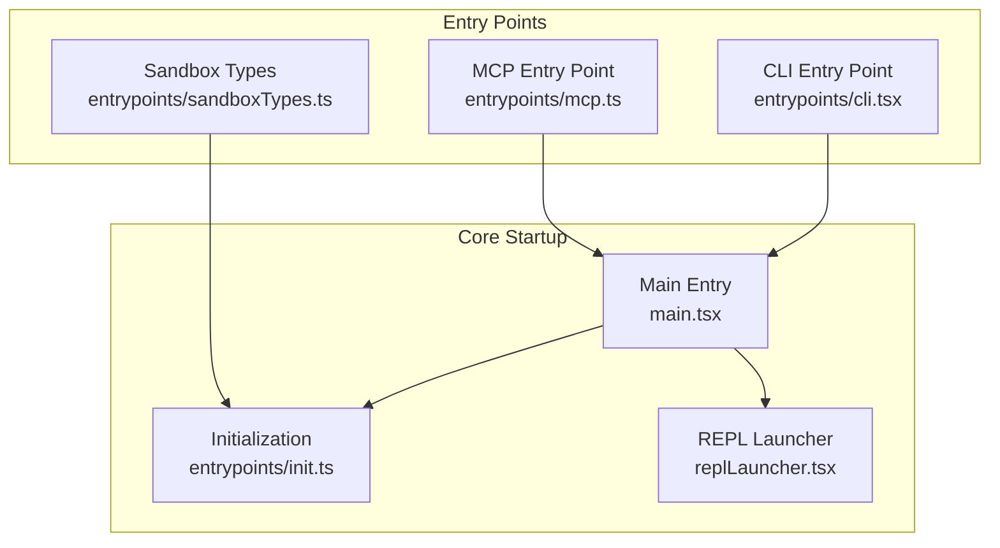
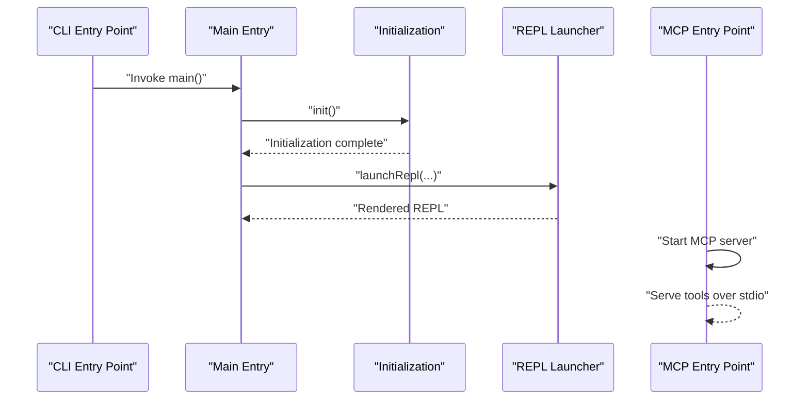
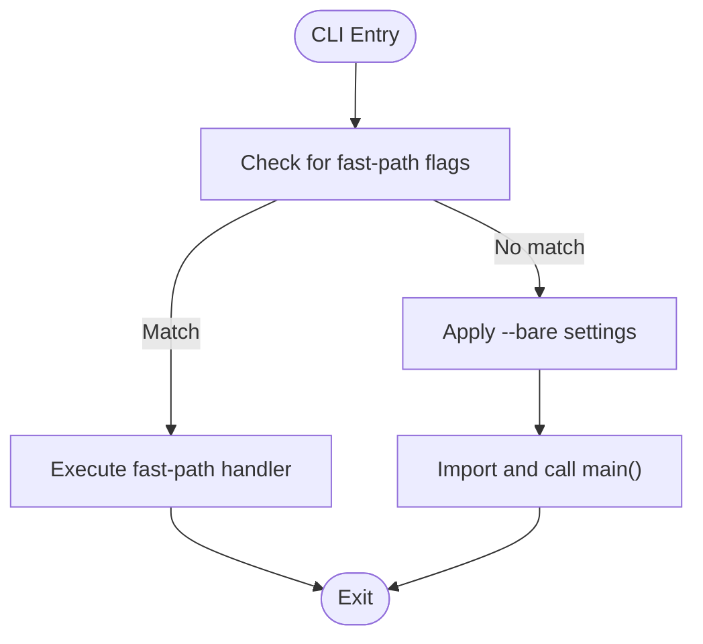
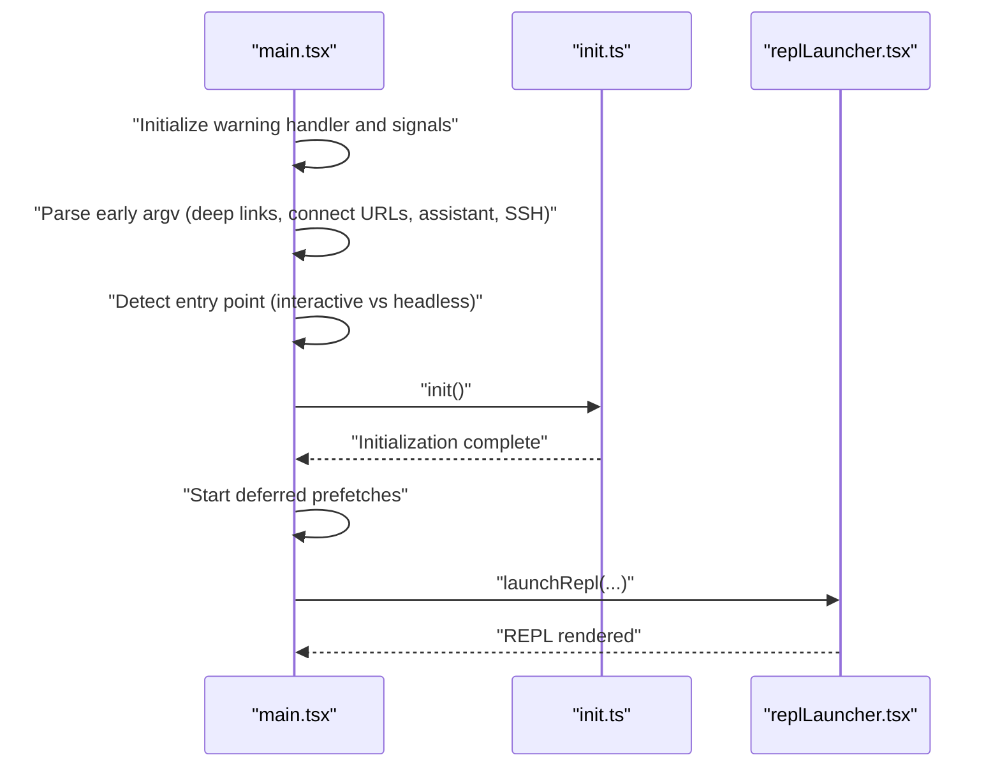
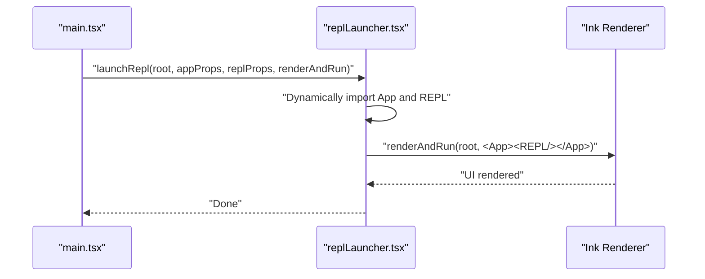
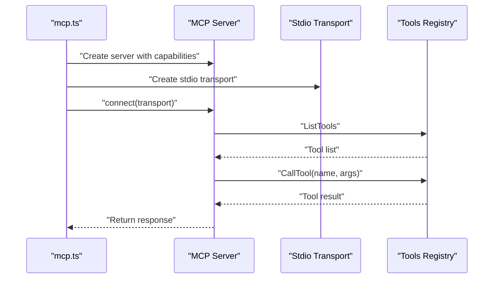
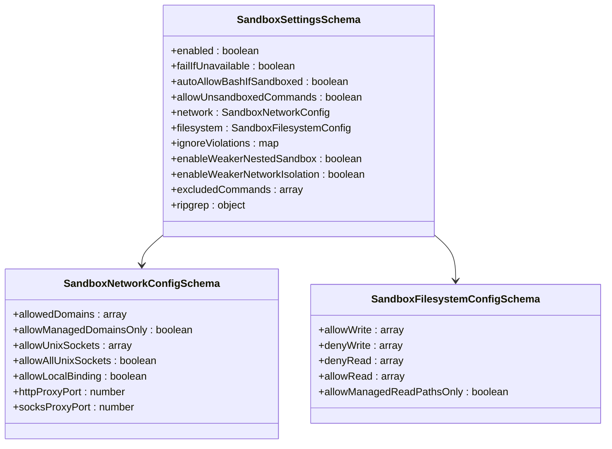
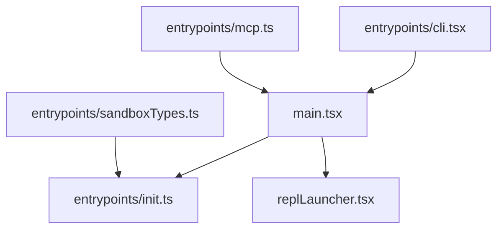

# Application Entry Points

<cite>
**Referenced Files in This Document**
- [main.tsx](file://claude_code_src/restored-src/src/main.tsx)
- [replLauncher.tsx](file://claude_code_src/restored-src/src/replLauncher.tsx)
- [cli.tsx](file://claude_code_src/restored-src/src/entrypoints/cli.tsx)
- [mcp.ts](file://claude_code_src/restored-src/src/entrypoints/mcp.ts)
- [sandboxTypes.ts](file://claude_code_src/restored-src/src/entrypoints/sandboxTypes.ts)
- [init.ts](file://claude_code_src/restored-src/src/entrypoints/init.ts)
</cite>

## Table of Contents
1. [Introduction](#introduction)
2. [Project Structure](#project-structure)
3. [Core Components](#core-components)
4. [Architecture Overview](#architecture-overview)
5. [Detailed Component Analysis](#detailed-component-analysis)
6. [Dependency Analysis](#dependency-analysis)
7. [Performance Considerations](#performance-considerations)
8. [Troubleshooting Guide](#troubleshooting-guide)
9. [Conclusion](#conclusion)

## Introduction
This document explains the Claude Code Python IDE’s startup architecture and application entry points. It focuses on the main entry point (main.tsx), its role in initializing the entire system, side-effect imports, startup profiling, environment setup, and REPL launcher integration with the Ink framework for terminal UI rendering. It also covers the CLI interface entry point, the MCP protocol handler entry point, and sandbox configuration types. The document details the initialization sequence, dependency loading order, and startup optimization strategies, including how the system bootstraps components, handles different execution modes (interactive vs headless), and manages entry point detection. Finally, it describes the relationship between entry points and the broader application architecture, including coordination with state management, command systems, and plugin loading.

## Project Structure
The application entry points are organized around three primary entry points:
- CLI interface entry point: a fast-path loader that defers heavy imports until needed and delegates to the main startup routine.
- MCP protocol handler entry point: a dedicated server that exposes tools via the MCP protocol over stdio.
- Sandbox configuration types: a centralized schema definition for sandbox settings used across the SDK and settings validation.

**Diagram sources**
- [cli.tsx:33-302](file://claude_code_src/restored-src/src/entrypoints/cli.tsx#L33-L302)
- [mcp.ts:35-196](file://claude_code_src/restored-src/src/entrypoints/mcp.ts#L35-L196)
- [main.tsx:585-800](file://claude_code_src/restored-src/src/main.tsx#L585-L800)
- [init.ts:57-238](file://claude_code_src/restored-src/src/entrypoints/init.ts#L57-L238)
- [replLauncher.tsx:12-22](file://claude_code_src/restored-src/src/replLauncher.tsx#L12-L22)

**Section sources**
- [cli.tsx:33-302](file://claude_code_src/restored-src/src/entrypoints/cli.tsx#L33-L302)
- [mcp.ts:35-196](file://claude_code_src/restored-src/src/entrypoints/mcp.ts#L35-L196)
- [main.tsx:585-800](file://claude_code_src/restored-src/src/main.tsx#L585-L800)
- [init.ts:57-238](file://claude_code_src/restored-src/src/entrypoints/init.ts#L57-L238)
- [replLauncher.tsx:12-22](file://claude_code_src/restored-src/src/replLauncher.tsx#L12-L22)

## Core Components
- CLI Entry Point (entrypoints/cli.tsx): Implements fast-path detection for common flags and subcommands to minimize module evaluation. It sets environment variables for containerized environments, applies feature-gated ablations, and routes to specialized handlers or the main startup routine.
- Main Entry (main.tsx): Orchestrates the full startup sequence, including side-effect imports for profiling and prefetching, environment setup, trust dialog gating, telemetry initialization, deferred prefetches, and REPL rendering. It detects entry points and execution modes, handles deep links and special command patterns, and coordinates with state management and plugin loading.
- Initialization (entrypoints/init.ts): Provides a memoized initialization routine that configures environment variables, telemetry, network agents, proxy/mTLS settings, preconnections, and cleanup hooks. It defers expensive telemetry initialization until after trust is granted.
- REPL Launcher (replLauncher.tsx): Renders the REPL UI using the Ink framework by composing the App and REPL components and delegating to the renderAndRun function.
- MCP Entry Point (entrypoints/mcp.ts): Starts an MCP server over stdio, exposing tools and handling tool discovery and invocation requests.
- Sandbox Types (entrypoints/sandboxTypes.ts): Defines Zod schemas for sandbox configuration, ensuring consistent validation across SDK and settings.

**Section sources**
- [cli.tsx:33-302](file://claude_code_src/restored-src/src/entrypoints/cli.tsx#L33-L302)
- [main.tsx:585-800](file://claude_code_src/restored-src/src/main.tsx#L585-L800)
- [init.ts:57-238](file://claude_code_src/restored-src/src/entrypoints/init.ts#L57-L238)
- [replLauncher.tsx:12-22](file://claude_code_src/restored-src/src/replLauncher.tsx#L12-L22)
- [mcp.ts:35-196](file://claude_code_src/restored-src/src/entrypoints/mcp.ts#L35-L196)
- [sandboxTypes.ts:11-157](file://claude_code_src/restored-src/src/entrypoints/sandboxTypes.ts#L11-L157)

## Architecture Overview
The startup architecture follows a layered approach:
- Entry points detect execution mode and environment, then delegate to the main startup routine.
- The main routine performs environment setup, trust gating, telemetry initialization, and deferred prefetches.
- The REPL launcher integrates with the Ink framework to render the terminal UI.
- The MCP entry point provides a protocol-compliant server for tool invocation.
- Sandbox configuration types ensure consistent validation across the system.

**Diagram sources**
- [cli.tsx:287-298](file://claude_code_src/restored-src/src/entrypoints/cli.tsx#L287-L298)
- [main.tsx:585-800](file://claude_code_src/restored-src/src/main.tsx#L585-L800)
- [init.ts:57-238](file://claude_code_src/restored-src/src/entrypoints/init.ts#L57-L238)
- [replLauncher.tsx:12-22](file://claude_code_src/restored-src/src/replLauncher.tsx#L12-L22)
- [mcp.ts:35-196](file://claude_code_src/restored-src/src/entrypoints/mcp.ts#L35-L196)

## Detailed Component Analysis

### CLI Entry Point
The CLI entry point implements fast-path detection for common flags and subcommands to minimize module evaluation. It:
- Sets environment variables for containerized environments.
- Applies feature-gated ablations for harness-science experiments.
- Handles special commands (e.g., dump system prompt, Chrome integrations, daemon workers, bridge mode, daemon, background sessions, templates, environment runners, self-hosted runners, tmux worktree).
- Delegates to the main startup routine when no fast-path matches.

**Diagram sources**
- [cli.tsx:33-302](file://claude_code_src/restored-src/src/entrypoints/cli.tsx#L33-L302)

**Section sources**
- [cli.tsx:33-302](file://claude_code_src/restored-src/src/entrypoints/cli.tsx#L33-L302)

### Main Entry Point
The main entry point orchestrates the full startup sequence:
- Security and environment setup (e.g., PATH hardening).
- Warning handler initialization and signal handling.
- Early argument parsing for deep links, connect URLs, assistant sessions, and SSH sessions.
- Entry point detection based on execution mode and flags.
- Initialization of configuration, telemetry, and policy limits.
- Deferred prefetches for user context, tips, credentials, and model capabilities.
- Telemetry logging and migration handling.

**Diagram sources**
- [main.tsx:585-800](file://claude_code_src/restored-src/src/main.tsx#L585-L800)
- [init.ts:57-238](file://claude_code_src/restored-src/src/entrypoints/init.ts#L57-L238)
- [replLauncher.tsx:12-22](file://claude_code_src/restored-src/src/replLauncher.tsx#L12-L22)

**Section sources**
- [main.tsx:585-800](file://claude_code_src/restored-src/src/main.tsx#L585-L800)

### REPL Launcher and Ink Integration
The REPL launcher integrates with the Ink framework to render the terminal UI:
- Dynamically imports the App and REPL components.
- Composes the App wrapper with REPL props and renders via renderAndRun.

**Diagram sources**
- [replLauncher.tsx:12-22](file://claude_code_src/restored-src/src/replLauncher.tsx#L12-L22)

**Section sources**
- [replLauncher.tsx:12-22](file://claude_code_src/restored-src/src/replLauncher.tsx#L12-L22)

### MCP Protocol Handler
The MCP entry point starts a server that:
- Creates a server with name/version metadata.
- Exposes tool discovery and tool invocation handlers.
- Converts tool schemas to MCP-compatible JSON schemas.
- Executes tools with permission checks and abort controller support.

**Diagram sources**
- [mcp.ts:35-196](file://claude_code_src/restored-src/src/entrypoints/mcp.ts#L35-L196)

**Section sources**
- [mcp.ts:35-196](file://claude_code_src/restored-src/src/entrypoints/mcp.ts#L35-L196)

### Sandbox Configuration Types
Sandbox configuration types define:
- Network configuration schema (allowed domains, proxies, Unix sockets).
- Filesystem configuration schema (read/write allow/deny paths).
- Top-level sandbox settings (enablement, platform gating, auto-allow bash, unsandboxed commands, violations, nested sandbox, network isolation, excluded commands, ripgrep overrides).

**Diagram sources**
- [sandboxTypes.ts:91-144](file://claude_code_src/restored-src/src/entrypoints/sandboxTypes.ts#L91-L144)
- [sandboxTypes.ts:14-42](file://claude_code_src/restored-src/src/entrypoints/sandboxTypes.ts#L14-L42)
- [sandboxTypes.ts:47-86](file://claude_code_src/restored-src/src/entrypoints/sandboxTypes.ts#L47-L86)

**Section sources**
- [sandboxTypes.ts:11-157](file://claude_code_src/restored-src/src/entrypoints/sandboxTypes.ts#L11-L157)

## Dependency Analysis
The entry points depend on shared initialization and state management:
- CLI entry point depends on main.tsx for full startup and on specialized handlers for fast paths.
- Main entry point depends on init.ts for environment setup and telemetry, and on replLauncher.tsx for UI rendering.
- MCP entry point depends on tools and permission contexts for tool execution.
- Sandbox types are used across initialization and settings validation.

**Diagram sources**
- [cli.tsx:287-298](file://claude_code_src/restored-src/src/entrypoints/cli.tsx#L287-L298)
- [main.tsx:585-800](file://claude_code_src/restored-src/src/main.tsx#L585-L800)
- [init.ts:57-238](file://claude_code_src/restored-src/src/entrypoints/init.ts#L57-L238)
- [replLauncher.tsx:12-22](file://claude_code_src/restored-src/src/replLauncher.tsx#L12-L22)
- [mcp.ts:35-196](file://claude_code_src/restored-src/src/entrypoints/mcp.ts#L35-L196)
- [sandboxTypes.ts:11-157](file://claude_code_src/restored-src/src/entrypoints/sandboxTypes.ts#L11-L157)

**Section sources**
- [cli.tsx:287-298](file://claude_code_src/restored-src/src/entrypoints/cli.tsx#L287-L298)
- [main.tsx:585-800](file://claude_code_src/restored-src/src/main.tsx#L585-L800)
- [init.ts:57-238](file://claude_code_src/restored-src/src/entrypoints/init.ts#L57-L238)
- [replLauncher.tsx:12-22](file://claude_code_src/restored-src/src/replLauncher.tsx#L12-L22)
- [mcp.ts:35-196](file://claude_code_src/restored-src/src/entrypoints/mcp.ts#L35-L196)
- [sandboxTypes.ts:11-157](file://claude_code_src/restored-src/src/entrypoints/sandboxTypes.ts#L11-L157)

## Performance Considerations
- Side-effect imports and prefetching: The main entry point triggers parallel prefetches for MDM and keychain data to overlap with module evaluation.
- Deferred prefetches: Background work (user context, tips, credentials, model capabilities) is deferred until after the REPL is rendered to reduce critical path latency.
- Feature-gated ablations: A harness-science baseline applies environment variables to disable specific features for controlled experiments.
- Containerized environments: Node heap size is adjusted for remote/containerized environments to improve stability.
- Lazy telemetry: Telemetry initialization is deferred and conditionally initialized after trust is granted to avoid unnecessary overhead.

[No sources needed since this section provides general guidance]

## Troubleshooting Guide
- Debugging detection: The main entry point checks for debugging/inspection flags and exits early if detected, preventing unexpected behavior in debuggers.
- Configuration errors: During initialization, configuration errors are handled differently in interactive vs headless modes. In headless mode, errors are logged to stderr and the process exits; in interactive mode, a dialog is shown.
- Signal handling: SIGINT is handled to avoid premature termination during headless print mode; otherwise, the process exits cleanly on interrupt.
- Deep link and connect URL handling: Early argument parsing supports rewriting deep links and connect URLs to appropriate internal commands, with special handling for headless mode.

**Section sources**
- [main.tsx:232-271](file://claude_code_src/restored-src/src/main.tsx#L232-L271)
- [init.ts:215-237](file://claude_code_src/restored-src/src/entrypoints/init.ts#L215-L237)
- [main.tsx:595-606](file://claude_code_src/restored-src/src/main.tsx#L595-L606)

## Conclusion
The Claude Code Python IDE’s entry points form a robust, layered startup architecture. The CLI entry point optimizes for fast-path execution, while the main entry point coordinates environment setup, trust gating, telemetry, and REPL rendering. The MCP entry point provides a protocol-compliant server for tool invocation, and sandbox configuration types ensure consistent validation. Together, these components enable flexible execution modes (interactive and headless), efficient startup, and seamless integration with state management, command systems, and plugin loading.