# CLI Interface

<cite>
**Referenced Files in This Document**
- [cli.tsx](file://claude_code_src/restored-src/src/entrypoints/cli.tsx)
- [main.tsx](file://claude_code_src/restored-src/src/main.tsx)
- [cliArgs.ts](file://claude_code_src/restored-src/src/utils/cliArgs.ts)
- [print.ts](file://claude_code_src/restored-src/src/cli/print.ts)
- [structuredIO.ts](file://claude_code_src/restored-src/src/cli/structuredIO.ts)
- [remoteIO.ts](file://claude_code_src/restored-src/src/cli/remoteIO.ts)
- [exit.ts](file://claude_code_src/restored-src/src/cli/exit.ts)
- [update.ts](file://claude_code_src/restored-src/src/cli/update.ts)
- [ndjsonSafeStringify.ts](file://claude_code_src/restored-src/src/cli/ndjsonSafeStringify.ts)
- [envLessBridgeConfig.ts](file://claude_code_src/restored-src/src/bridge/envLessBridgeConfig.ts)
- [bridgeMain.ts](file://claude_code_src/restored-src/src/bridge/bridgeMain.ts)
- [bridgeEnabled.ts](file://claude_code_src/restored-src/src/bridge/bridgeEnabled.ts)
- [types.ts](file://claude_code_src/restored-src/src/bridge/types.ts)
- [process.js](file://claude_code_src/restored-src/src/utils/process.js)
- [config.js](file://claude_code_src/restored-src/src/utils/config.js)
- [model.js](file://claude_code_src/restored-src/src/utils/model/model.js)
- [prompts.js](file://claude_code_src/restored-src/src/constants/prompts.js)
- [startupProfiler.js](file://claude_code_src/restored-src/src/utils/startupProfiler.js)
- [earlyInput.js](file://claude_code_src/restored-src/src/utils/earlyInput.js)
- [interactiveHelpers.tsx](file://claude_code_src/restored-src/src/interactiveHelpers.tsx)
- [daemon/main.js](file://claude_code_src/restored-src/src/daemon/main.js)
- [daemon/workerRegistry.js](file://claude_code_src/restored-src/src/daemon/workerRegistry.js)
- [bg.js](file://claude_code_src/restored-src/src/cli/bg.js)
- [templateJobs.js](file://claude_code_src/restored-src/src/cli/handlers/templateJobs.js)
- [environment-runner/main.js](file://claude_code_src/restored-src/src/environment-runner/main.js)
- [self-hosted-runner/main.js](file://claude_code_src/restored-src/src/self-hosted-runner/main.js)
- [worktreeModeEnabled.js](file://claude_code_src/restored-src/src/utils/worktreeModeEnabled.js)
- [worktree.js](file://claude_code_src/restored-src/src/utils/worktree.js)
- [auth.js](file://claude_code_src/restored-src/src/utils/auth.js)
- [policyLimits/index.js](file://claude_code_src/restored-src/src/services/policyLimits/index.js)
- [sinks.js](file://claude_code_src/restored-src/src/utils/sinks.js)
- [commands.js](file://claude_code_src/restored-src/src/commands.js)
- [bootstrap/state.ts](file://claude_code_src/restored-src/src/bootstrap/state.ts)
- [platform.js](file://claude_code_src/restored-src/src/utils/platform.js)
- [renderOptions.js](file://claude_code_src/restored-src/src/utils/renderOptions.js)
- [sessionIngressAuth.js](file://claude_code_src/restored-src/src/utils/sessionIngressAuth.js)
- [filesApi.js](file://claude_code_src/restored-src/src/services/api/filesApi.js)
- [worktreeModeEnabled.js](file://claude_code_src/restored-src/src/utils/worktreeModeEnabled.js)
- [worktree.js](file://claude_code_src/restored-src/src/utils/worktree.js)
- [envUtils.js](file://claude_code_src/restored-src/src/utils/envUtils.js)
- [telemetry/pluginTelemetry.js](file://claude_code_src/restored-src/src/utils/telemetry/pluginTelemetry.js)
- [telemetry/skillLoadedEvent.js](file://claude_code_src/restored-src/src/utils/telemetry/skillLoadedEvent.js)
- [tempfile.js](file://claude_code_src/restored-src/src/utils/tempfile.js)
- [json.js](file://claude_code_src/restored-src/src/utils/json.js)
- [log.js](file://claude_code_src/restored-src/src/utils/log.js)
- [permissions/permissionSetup.js](file://claude_code_src/restored-src/src/utils/permissions/permissionSetup.js)
- [plugins/pluginLoader.js](file://claude_code_src/restored-src/src/utils/plugins/pluginLoader.js)
- [releaseNotes.js](file://claude_code_src/restored-src/src/utils/releaseNotes.js)
- [sandbox/sandbox-adapter.js](file://claude_code_src/restored-src/src/utils/sandbox/sandbox-adapter.js)
- [teleport/api.js](file://claude_code_src/restored-src/src/utils/teleport/api.js)
- [thinking.js](file://claude_code_src/restored-src/src/utils/thinking.js)
- [user.js](file://claude_code_src/restored-src/src/utils/user.js)
- [worktree.js](file://claude_code_src/restored-src/src/utils/worktree.js)
- [eventLoopStallDetector.js](file://claude_code_src/restored-src/src/utils/eventLoopStallDetector.js)
- [analytics/growthbook.js](file://claude_code_src/restored-src/src/services/analytics/growthbook.js)
- [analytics/sink.js](file://claude_code_src/restored-src/src/services/analytics/sink.js)
- [remoteManagedSettings/index.js](file://claude_code_src/restored-src/src/services/remoteManagedSettings/index.js)
- [settingsSync/index.js](file://claude_code_src/restored-src/src/services/settingsSync/index.js)
- [mcp/officialRegistry.js](file://claude_code_src/restored-src/src/services/mcp/officialRegistry.js)
- [mcp/client.js](file://claude_code_src/restored-src/src/services/mcp/client.js)
- [mcp/config.js](file://claude_code_src/restored-src/src/services/mcp/config.js)
- [mcp/utils.js](file://claude_code_src/restored-src/src/services/mcp/utils.js)
- [mcp/xaaIdpLogin.js](file://claude_code_src/restored-src/src/services/mcp/xaaIdpLogin.js)
- [tips/tipRegistry.js](file://claude_code_src/restored-src/src/services/tips/tipRegistry.js)
- [api.js](file://claude_code_src/restored-src/src/utils/api.js)
- [claudeInChrome/mcpServer.js](file://claude_code_src/restored-src/src/utils/claudeInChrome/mcpServer.js)
- [claudeInChrome/chromeNativeHost.js](file://claude_code_src/restored-src/src/utils/claudeInChrome/chromeNativeHost.js)
- [computerUse/mcpServer.js](file://claude_code_src/restored-src/src/utils/computerUse/mcpServer.js)
- [init.ts](file://claude_code_src/restored-src/src/entrypoints/init.ts)
- [replLauncher.tsx](file://claude_code_src/restored-src/src/replLauncher.tsx)
- [context.ts](file://claude_code_src/restored-src/src/context.ts)
- [history.ts](file://claude_code_src/restored-src/src/history.ts)
- [ink.ts](file://claude_code_src/restored-src/src/ink.ts)
- [dialogLaunchers.tsx](file://claude_code_src/restored-src/src/dialogLaunchers.tsx)
- [teammate.js](file://claude_code_src/restored-src/src/utils/teammate.js)
- [swarm/teammatePromptAddendum.js](file://claude_code_src/restored-src/src/utils/swarm/teammatePromptAddendum.js)
- [swarm/backends/teammateModeSnapshot.js](file://claude_code_src/restored-src/src/utils/swarm/backends/teammateModeSnapshot.js)
- [coordinator/coordinatorMode.js](file://claude_code_src/restored-src/src/coordinator/coordinatorMode.js)
- [assistant/index.js](file://claude_code_src/restored-src/src/assistant/index.js)
- [assistant/gate.js](file://claude_code_src/restored-src/src/assistant/gate.js)
- [tools.js](file://claude_code_src/restored-src/src/tools.js)
- [advisor.js](file://claude_code_src/restored-src/src/utils/advisor.js)
- [agentSwarmsEnabled.js](file://claude_code_src/restored-src/src/utils/agentSwarmsEnabled.js)
- [asciicast.js](file://claude_code_src/restored-src/src/utils/asciicast.js)
- [auth.js](file://claude_code_src/restored-src/src/utils/auth.js)
- [config.js](file://claude_code_src/restored-src/src/utils/config.js)
- [fastMode.js](file://claude_code_src/restored-src/src/utils/fastMode.js)
- [managedEnv.js](file://claude_code_src/restored-src/src/utils/managedEnv.js)
- [messages.js](file://claude_code_src/restored-src/src/utils/messages.js)
- [sessionStorage.js](file://claude_code_src/restored-src/src/utils/sessionStorage.js)
- [settings/settings.js](file://claude_code_src/restored-src/src/utils/settings/settings.js)
- [settings/changeDetector.js](file://claude_code_src/restored-src/src/utils/settings/changeDetector.js)
- [skills/skillChangeDetector.js](file://claude_code_src/restored-src/src/utils/skills/skillChangeDetector.js)
- [tasks.js](file://claude_code_src/restored-src/src/utils/tasks.js)
- [telemetry/pluginTelemetry.js](file://claude_code_src/restored-src/src/utils/telemetry/pluginTelemetry.js)
- [telemetry/skillLoadedEvent.js](file://claude_code_src/restored-src/src/utils/telemetry/skillLoadedEvent.js)
- [tempfile.js](file://claude_code_src/restored-src/src/utils/tempfile.js)
- [uuid.js](file://claude_code_src/restored-src/src/utils/uuid.js)
- [cleanupRegistry.js](file://claude_code_src/restored-src/src/utils/cleanupRegistry.js)
- [hooks/hookEvents.js](file://claude_code_src/restored-src/src/utils/hooks/hookEvents.js)
- [model/modelCapabilities.js](file://claude_code_src/restored-src/src/utils/model/modelCapabilities.js)
- [process.js](file://claude_code_src/restored-src/src/utils/process.js)
- [Shell.js](file://claude_code_src/restored-src/src/utils/Shell.js)
- [sessionRestore.js](file://claude_code_src/restored-src/src/utils/sessionRestore.js)
- [settings/constants.js](file://claude_code_src/restored-src/src/utils/settings/constants.js)
- [stringUtils.js](file://claude_code_src/restored-src/src/utils/stringUtils.js)
- [teleport.js](file://claude_code_src/restored-src/src/utils/teleport.js)
- [user.js](file://claude_code_src/restored-src/src/utils/user.js)
- [worktree.js](file://claude_code_src/restored-src/src/utils/worktree.js)
</cite>

## Table of Contents
1. [Introduction](#introduction)
2. [Project Structure](#project-structure)
3. [Core Components](#core-components)
4. [Architecture Overview](#architecture-overview)
5. [Detailed Component Analysis](#detailed-component-analysis)
6. [Dependency Analysis](#dependency-analysis)
7. [Performance Considerations](#performance-considerations)
8. [Troubleshooting Guide](#troubleshooting-guide)
9. [Conclusion](#conclusion)
10. [Appendices](#appendices)

## Introduction
This document explains the CLI interface entry point and its integration with the broader application. It covers command parsing, argument processing, interactive versus non-interactive modes, headless and batch execution, completion and error handling, output formatting, and the relationship between the CLI and the main application’s state, command system, and plugin loading. Practical usage patterns, chaining commands, and integration with external tools are included.

## Project Structure
The CLI entry point is implemented as a small bootstrap that performs fast-path checks and then delegates to the main application. The main application initializes the command framework, registers commands, and orchestrates interactive and non-interactive execution.

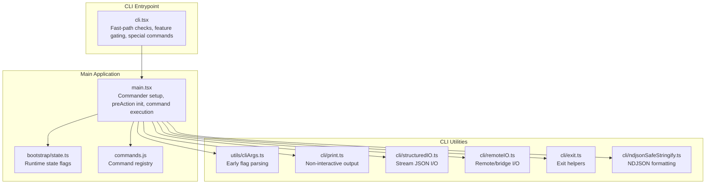

**Diagram sources**
- [cli.tsx:33-299](file://claude_code_src/restored-src/src/entrypoints/cli.tsx#L33-L299)
- [main.tsx:884-967](file://claude_code_src/restored-src/src/main.tsx#L884-L967)
- [cliArgs.ts:13-29](file://claude_code_src/restored-src/src/utils/cliArgs.ts#L13-L29)
- [print.ts](file://claude_code_src/restored-src/src/cli/print.ts)
- [structuredIO.ts](file://claude_code_src/restored-src/src/cli/structuredIO.ts)
- [remoteIO.ts](file://claude_code_src/restored-src/src/cli/remoteIO.ts)
- [exit.ts](file://claude_code_src/restored-src/src/cli/exit.ts)
- [ndjsonSafeStringify.ts](file://claude_code_src/restored-src/src/cli/ndjsonSafeStringify.ts)

**Section sources**
- [cli.tsx:33-299](file://claude_code_src/restored-src/src/entrypoints/cli.tsx#L33-L299)
- [main.tsx:884-967](file://claude_code_src/restored-src/src/main.tsx#L884-L967)

## Core Components
- CLI entrypoint: Performs fast-path checks for version, dump system prompt, special modes (bridge, daemon, background sessions, templates, environment runners), and tmux worktree integration. It then optionally sets early flags and loads the main application.
- Main application: Initializes Commander, sets up help and options, defers initialization to a preAction hook, registers commands, and executes the selected command.
- CLI utilities: Provide early flag parsing, non-interactive printing, structured I/O, remote/bridge I/O, exit helpers, and NDJSON formatting.

Key responsibilities:
- Argument parsing and validation
- Interactive vs non-interactive mode detection
- Headless and batch execution
- Output formatting and streaming
- Integration with state management and plugin loading

**Section sources**
- [cli.tsx:33-299](file://claude_code_src/restored-src/src/entrypoints/cli.tsx#L33-L299)
- [main.tsx:884-967](file://claude_code_src/restored-src/src/main.tsx#L884-L967)
- [cliArgs.ts:13-29](file://claude_code_src/restored-src/src/utils/cliArgs.ts#L13-L29)

## Architecture Overview
The CLI architecture separates concerns between the entrypoint (fast-path decisions), the main application (command framework and orchestration), and specialized utilities (printing, I/O, exit handling). Feature flags gate optional capabilities, and environment variables influence behavior.

```mermaid
sequenceDiagram
participant User as "User"
participant CLI as "cli.tsx"
participant Prof as "startupProfiler.js"
participant Main as "main.tsx"
participant Cmd as "Commander"
participant State as "bootstrap/state.ts"
User->>CLI : "claude [flags] [command]"
CLI->>Prof : "profileCheckpoint('cli_entry')"
alt Special fast-path
CLI->>CLI : "Handle --version / dump-system-prompt / bridge / daemon / bg / templates / runners"
CLI-->>User : "Immediate output/exit"
else Normal path
CLI->>Prof : "profileCheckpoint('cli_before_main_import')"
CLI->>Main : "await import('../main.js'); await cliMain()"
Main->>Prof : "profileCheckpoint('main_before_run')"
Main->>Cmd : "program = new CommanderCommand()"
Main->>Cmd : "configureHelp(), addOptions()"
Cmd->>Main : "preAction hook"
Main->>State : "setIsInteractive(), setClientType()"
Main->>Cmd : "program.action(handler)"
Cmd->>Main : "execute selected command"
Main-->>User : "Interactive or non-interactive output"
end
```

**Diagram sources**
- [cli.tsx:33-299](file://claude_code_src/restored-src/src/entrypoints/cli.tsx#L33-L299)
- [main.tsx:884-967](file://claude_code_src/restored-src/src/main.tsx#L884-L967)
- [startupProfiler.js](file://claude_code_src/restored-src/src/utils/startupProfiler.js)
- [bootstrap/state.ts](file://claude_code_src/restored-src/src/bootstrap/state.ts)

## Detailed Component Analysis

### CLI Entrypoint (Fast Paths and Special Modes)
The entrypoint evaluates arguments quickly and routes to specialized handlers when applicable:
- Version and system prompt dumping
- Special modes: bridge, daemon, background sessions, templates, environment runners, self-hosted runners
- tmux worktree integration
- Early flag normalization and environment setup

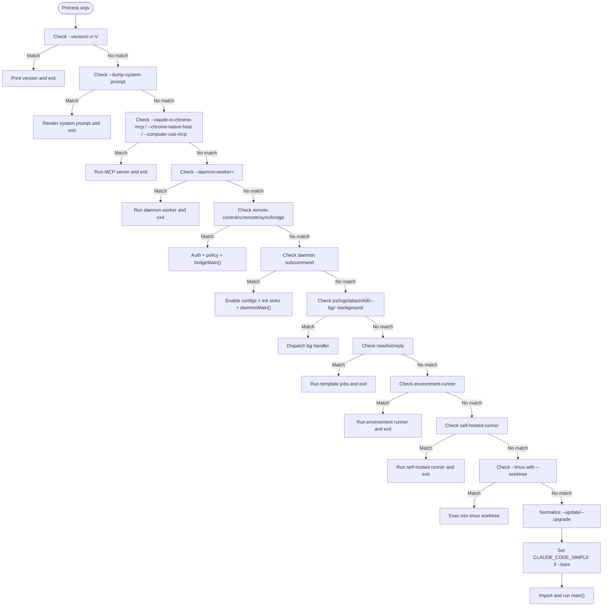

**Diagram sources**
- [cli.tsx:33-299](file://claude_code_src/restored-src/src/entrypoints/cli.tsx#L33-L299)

**Section sources**
- [cli.tsx:33-299](file://claude_code_src/restored-src/src/entrypoints/cli.tsx#L33-L299)

### Main Application: Command Framework and Execution
The main application sets up Commander, defines options and help, and executes commands via a preAction hook that initializes the app state and services.

Key aspects:
- Help configuration with sorted subcommands and options
- PreAction hook: async initialization, sinks, migrations, remote settings, plugin sync
- Options include debug, print, bare, output/input formats, budgets, tools, MCP configs, permission modes, resume/continue, and more
- Action handler validates flags, prepares contexts (sessions, files, MCP), and coordinates interactive or non-interactive execution

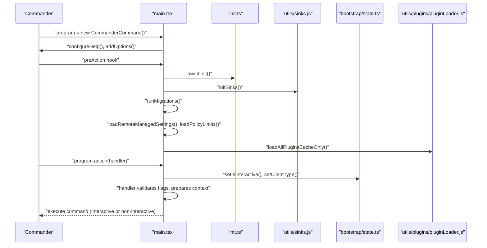

**Diagram sources**
- [main.tsx:884-967](file://claude_code_src/restored-src/src/main.tsx#L884-L967)
- [init.ts](file://claude_code_src/restored-src/src/entrypoints/init.ts)
- [sinks.js](file://claude_code_src/restored-src/src/utils/sinks.js)
- [bootstrap/state.ts](file://claude_code_src/restored-src/src/bootstrap/state.ts)
- [plugins/pluginLoader.js](file://claude_code_src/restored-src/src/utils/plugins/pluginLoader.js)

**Section sources**
- [main.tsx:884-967](file://claude_code_src/restored-src/src/main.tsx#L884-L967)

### Interactive vs Non-Interactive Modes
Mode detection is based on flags and TTY availability:
- Interactive: default when stdout is a TTY and no print/init-only/sdk-url flags
- Non-interactive: -p/--print, --init-only, --sdk-url, or when stdout is not a TTY
- Early input capture is stopped for non-interactive modes
- Telemetry and session setup differ between modes

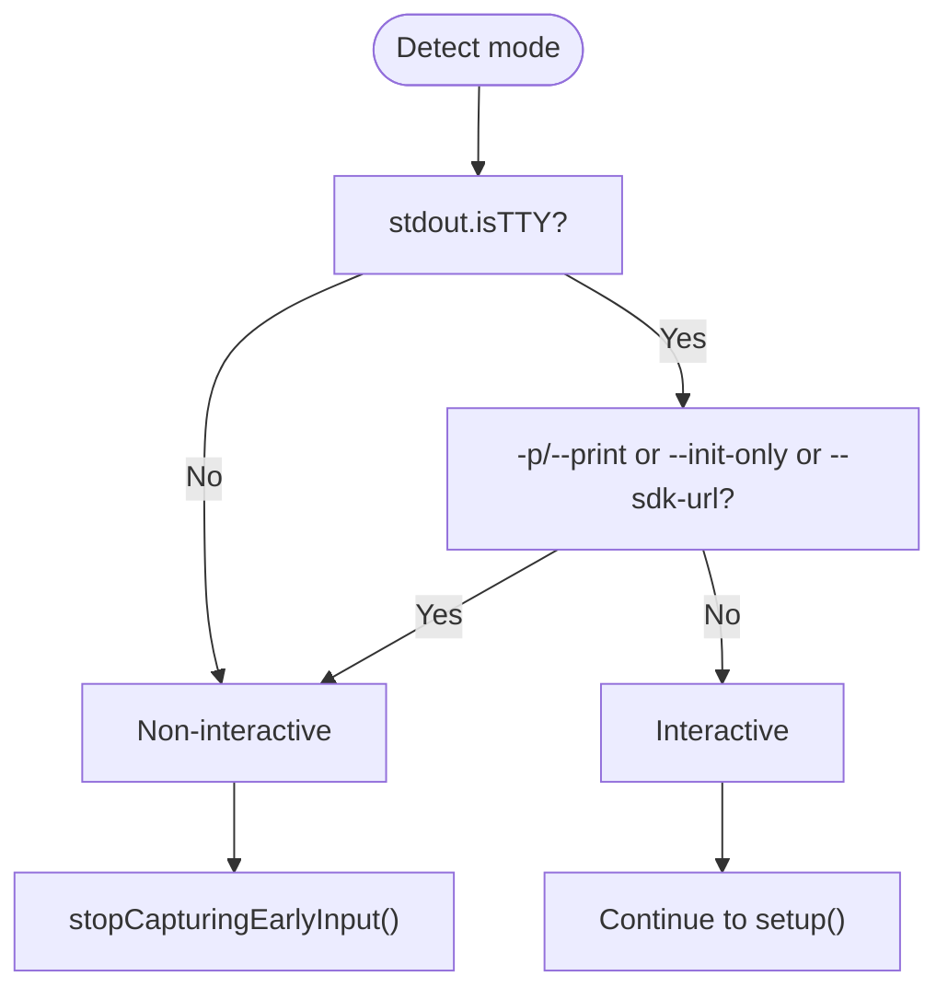

**Diagram sources**
- [main.tsx:800-808](file://claude_code_src/restored-src/src/main.tsx#L800-L808)

**Section sources**
- [main.tsx:800-808](file://claude_code_src/restored-src/src/main.tsx#L800-L808)

### Argument Parsing and Validation
Early parsing utilities:
- Eager flag parsing for flags that must be known before init (e.g., --settings)
- Double-dash separator handling for subcommand passthrough

Validation and processing in the action handler:
- Output/input formats, budgets, tool lists, MCP configs, permission modes, session IDs, system prompts, file downloads, and more
- Strict MCP config enforcement and enterprise policy filtering
- Reserved MCP server names and dynamic config scoping

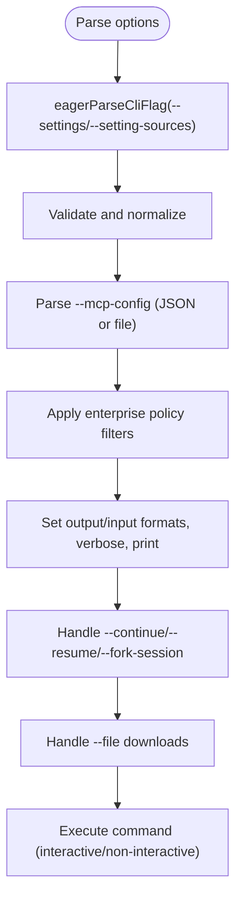

**Diagram sources**
- [cliArgs.ts:13-29](file://claude_code_src/restored-src/src/utils/cliArgs.ts#L13-L29)
- [main.tsx:1413-1523](file://claude_code_src/restored-src/src/main.tsx#L1413-L1523)

**Section sources**
- [cliArgs.ts:13-29](file://claude_code_src/restored-src/src/utils/cliArgs.ts#L13-L29)
- [main.tsx:1413-1523](file://claude_code_src/restored-src/src/main.tsx#L1413-L1523)

### Headless and Batch Execution
Headless mode is enabled by -p/--print or non-TTY output. The action handler sets flags and formats for non-interactive execution, including:
- Stream JSON input/output when requested
- Structured output with JSON schema validation
- Hook events and partial messages when enabled
- Session persistence toggles and replay options

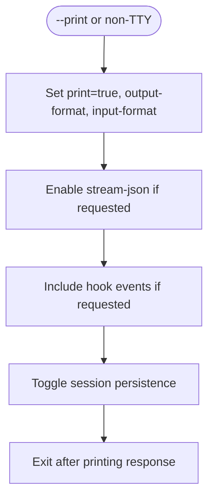

**Diagram sources**
- [main.tsx:1006-1016](file://claude_code_src/restored-src/src/main.tsx#L1006-L1016)

**Section sources**
- [main.tsx:1006-1016](file://claude_code_src/restored-src/src/main.tsx#L1006-L1016)

### Output Formatting and Streaming
The CLI supports multiple output formats and streaming:
- Text, JSON (single result), and stream-json (realtime)
- Replay user messages for bidirectional acknowledgment
- NDJSON-safe serialization for robust streaming

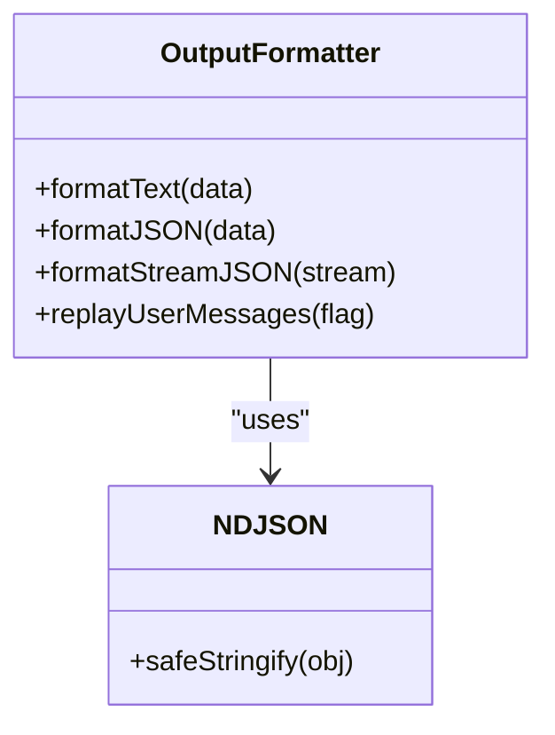

**Diagram sources**
- [main.tsx:971-1000](file://claude_code_src/restored-src/src/main.tsx#L971-L1000)
- [ndjsonSafeStringify.ts](file://claude_code_src/restored-src/src/cli/ndjsonSafeStringify.ts)

**Section sources**
- [main.tsx:971-1000](file://claude_code_src/restored-src/src/main.tsx#L971-L1000)
- [ndjsonSafeStringify.ts](file://claude_code_src/restored-src/src/cli/ndjsonSafeStringify.ts)

### Command Registration and Execution Flow
Commands are registered centrally and executed through the main application. The CLI entrypoint may short-circuit for special commands, while others are handled by the main application’s command framework.

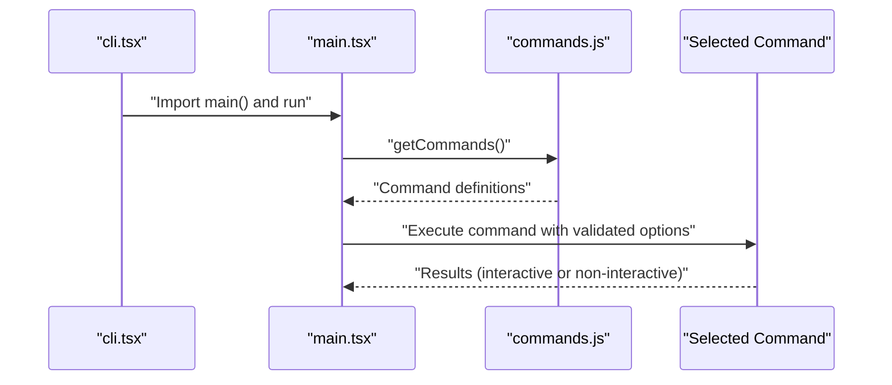

**Diagram sources**
- [cli.tsx:288-299](file://claude_code_src/restored-src/src/entrypoints/cli.tsx#L288-L299)
- [main.tsx:884-967](file://claude_code_src/restored-src/src/main.tsx#L884-L967)
- [commands.js](file://claude_code_src/restored-src/src/commands.js)

**Section sources**
- [cli.tsx:288-299](file://claude_code_src/restored-src/src/entrypoints/cli.tsx#L288-L299)
- [main.tsx:884-967](file://claude_code_src/restored-src/src/main.tsx#L884-L967)
- [commands.js](file://claude_code_src/restored-src/src/commands.js)

### Special Modes and Integrations
- Bridge mode: Validates auth, policy, and minimum version before serving as a bridge environment
- Daemon: Long-running supervisor with worker kinds
- Background sessions: ps/logs/attach/kill and --bg/--background flags
- Templates: Template job commands
- Environment runners: Headless BYOC and self-hosted runners
- tmux worktree: Exec into tmux with worktree mode

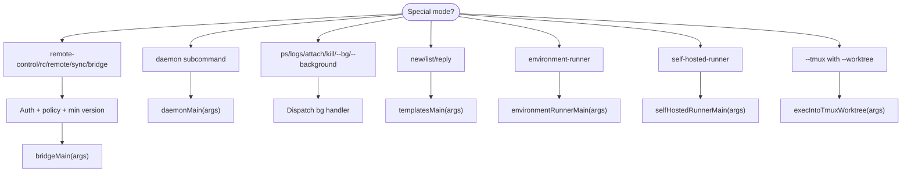

**Diagram sources**
- [cli.tsx:108-180](file://claude_code_src/restored-src/src/entrypoints/cli.tsx#L108-L180)
- [cli.tsx:182-245](file://claude_code_src/restored-src/src/entrypoints/cli.tsx#L182-L245)
- [cli.tsx:247-274](file://claude_code_src/restored-src/src/entrypoints/cli.tsx#L247-L274)

**Section sources**
- [cli.tsx:108-180](file://claude_code_src/restored-src/src/entrypoints/cli.tsx#L108-L180)
- [cli.tsx:182-245](file://claude_code_src/restored-src/src/entrypoints/cli.tsx#L182-L245)
- [cli.tsx:247-274](file://claude_code_src/restored-src/src/entrypoints/cli.tsx#L247-L274)

### Interactive Helpers and State Management
Interactive helpers manage exit signals, cursor visibility, and rendering. State management tracks interactive mode, client type, and session source, influencing telemetry and behavior.

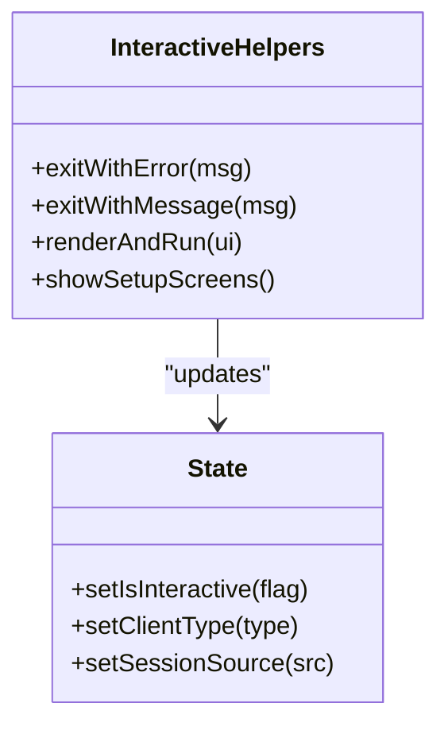

**Diagram sources**
- [interactiveHelpers.tsx](file://claude_code_src/restored-src/src/interactiveHelpers.tsx)
- [bootstrap/state.ts](file://claude_code_src/restored-src/src/bootstrap/state.ts)

**Section sources**
- [interactiveHelpers.tsx](file://claude_code_src/restored-src/src/interactiveHelpers.tsx)
- [bootstrap/state.ts](file://claude_code_src/restored-src/src/bootstrap/state.ts)

### Plugin Loading and Telemetry
Plugins are initialized and telemetry is collected around skills and plugin loading. In non-interactive mode, telemetry is logged before headless execution.

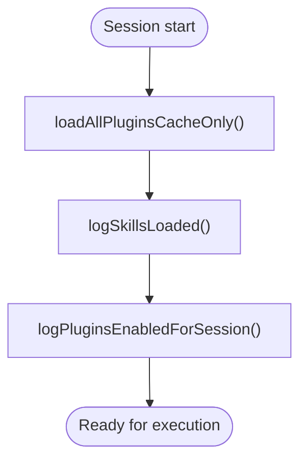

**Diagram sources**
- [main.tsx:279-290](file://claude_code_src/restored-src/src/main.tsx#L279-L290)
- [plugins/pluginLoader.js](file://claude_code_src/restored-src/src/utils/plugins/pluginLoader.js)
- [telemetry/pluginTelemetry.js](file://claude_code_src/restored-src/src/utils/telemetry/pluginTelemetry.js)
- [telemetry/skillLoadedEvent.js](file://claude_code_src/restored-src/src/utils/telemetry/skillLoadedEvent.js)

**Section sources**
- [main.tsx:279-290](file://claude_code_src/restored-src/src/main.tsx#L279-L290)
- [plugins/pluginLoader.js](file://claude_code_src/restored-src/src/utils/plugins/pluginLoader.js)
- [telemetry/pluginTelemetry.js](file://claude_code_src/restored-src/src/utils/telemetry/pluginTelemetry.js)
- [telemetry/skillLoadedEvent.js](file://claude_code_src/restored-src/src/utils/telemetry/skillLoadedEvent.js)

## Dependency Analysis
The CLI entrypoint depends on feature flags and environment variables to gate optional capabilities. The main application depends on state, configuration, and services for initialization and execution.

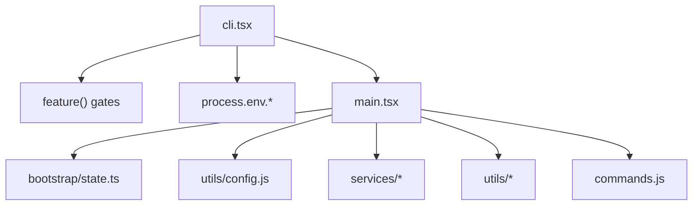

**Diagram sources**
- [cli.tsx:1-26](file://claude_code_src/restored-src/src/entrypoints/cli.tsx#L1-L26)
- [main.tsx:1-100](file://claude_code_src/restored-src/src/main.tsx#L1-L100)

**Section sources**
- [cli.tsx:1-26](file://claude_code_src/restored-src/src/entrypoints/cli.tsx#L1-L26)
- [main.tsx:1-100](file://claude_code_src/restored-src/src/main.tsx#L1-L100)

## Performance Considerations
- Startup profiling checkpoints track performance across fast-path decisions and main import/execution
- Early input capture is stopped for non-interactive modes to avoid unnecessary work
- Deferred prefetches are skipped in bare mode to reduce overhead
- Stream JSON I/O minimizes intermediate buffering for large outputs

[No sources needed since this section provides general guidance]

## Troubleshooting Guide
Common issues and resolutions:
- Authentication errors in bridge mode: ensure access token exists and policy allows remote control
- Policy violations: enterprise policy may block certain MCP servers or flags
- Session ID conflicts: when using --session-id with --continue/--resume, --fork-session is required
- File downloads: require a session ingress token; ensure CLAUDE_CODE_SESSION_ACCESS_TOKEN is set
- tmux worktree: requires --worktree and tmux availability; not supported on Windows

**Section sources**
- [cli.tsx:132-161](file://claude_code_src/restored-src/src/entrypoints/cli.tsx#L132-L161)
- [main.tsx:1276-1302](file://claude_code_src/restored-src/src/main.tsx#L1276-L1302)
- [main.tsx:1304-1331](file://claude_code_src/restored-src/src/main.tsx#L1304-L1331)
- [main.tsx:1168-1182](file://claude_code_src/restored-src/src/main.tsx#L1168-L1182)

## Conclusion
The CLI interface provides a fast, feature-rich entry point that integrates tightly with the main application’s command framework, state management, and services. It supports interactive and non-interactive modes, headless execution, structured output, and specialized integrations, all while maintaining performance and reliability through careful initialization and validation.

## Appendices

### Practical Usage Patterns
- Interactive chat: claude "your prompt"
- Non-interactive output: claude -p "your prompt" | jq
- Streaming output: claude --output-format stream-json -p "..."
- Resume previous session: claude --resume <session-id>
- Continue latest: claude -c
- Configure tools and MCP: claude --tools Bash,Edit --mcp-config ./mcp.json
- Headless with stdin: cat prompt.txt | claude --input-format text --output-format json

### Command Chaining and External Tools
- Pipe to external tools: claude -p "..." | grep "pattern" | wc -l
- Use with shell scripts: pass --bare for minimal overhead in CI
- Combine with file downloads: claude --file file_id:dest.txt -p "..."

### Configuration and Environment Variables
- Early flags: --settings (file path or JSON), --setting-sources
- Runtime flags: --debug, --verbose, --bare, --output-format, --json-schema
- Environment variables: NODE_OPTIONS, CLAUDE_CODE_* flags affecting behavior and performance

**Section sources**
- [main.tsx:432-496](file://claude_code_src/restored-src/src/main.tsx#L432-L496)
- [envUtils.js](file://claude_code_src/restored-src/src/utils/envUtils.js)