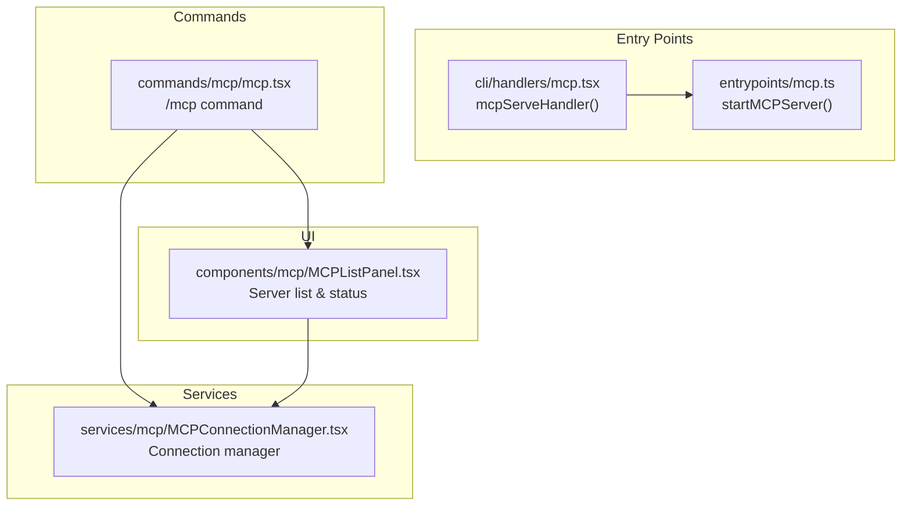
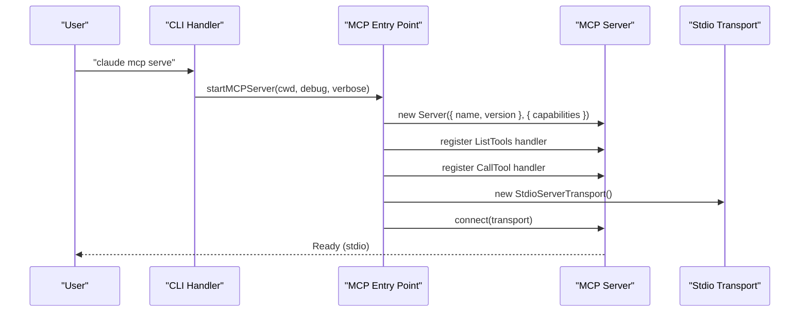
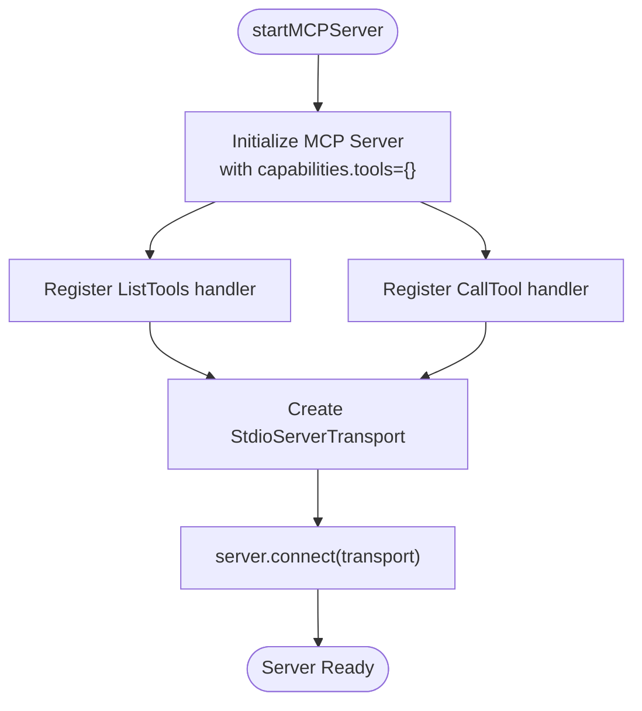
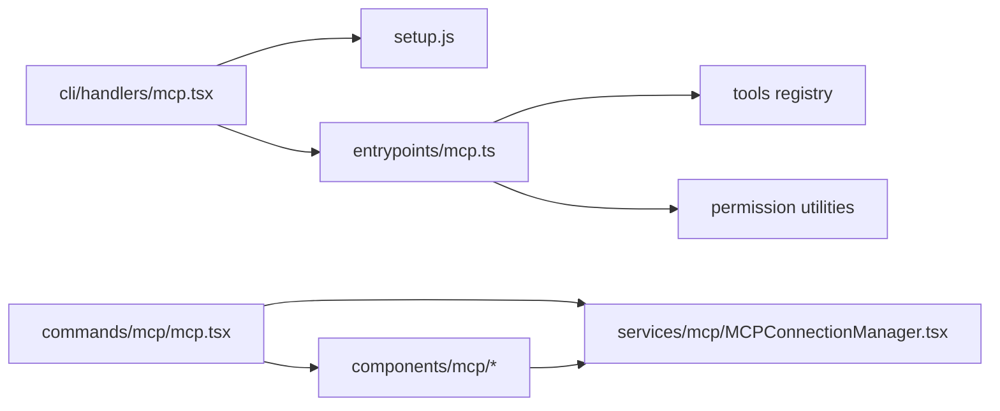

# MCP Protocol Handler

<cite>
**Referenced Files in This Document**
- [mcp.ts](file://claude_code_src/restored-src/src/entrypoints/mcp.ts)
- [mcp.tsx](file://claude_code_src/restored-src/src/cli/handlers/mcp.tsx)
- [mcp.tsx](file://claude_code_src/restored-src/src/commands/mcp/mcp.tsx)
- [MCPListPanel.tsx](file://claude_code_src/restored-src/src/components/mcp/MCPListPanel.tsx)
- [MCPConnectionManager.tsx](file://claude_code_src/restored-src/src/services/mcp/MCPConnectionManager.tsx)
</cite>

## Table of Contents
1. [Introduction](#introduction)
2. [Project Structure](#project-structure)
3. [Core Components](#core-components)
4. [Architecture Overview](#architecture-overview)
5. [Detailed Component Analysis](#detailed-component-analysis)
6. [Dependency Analysis](#dependency-analysis)
7. [Performance Considerations](#performance-considerations)
8. [Troubleshooting Guide](#troubleshooting-guide)
9. [Conclusion](#conclusion)

## Introduction
This document explains the Model Context Protocol (MCP) protocol handler entry point and its integration with the broader application system. It covers the MCP server lifecycle, client-server communication patterns, capability negotiation, message routing, authentication mechanisms, and operational controls. It also documents how MCP servers interact with the tool system, permission management, and the CLI interface, along with practical setup examples and security/performance considerations.

## Project Structure
The MCP implementation spans several areas:
- Entry point for standalone MCP servers
- CLI handlers for managing MCP configurations and connectivity
- Commands for interactive MCP management
- UI components for listing and approving MCP servers
- Service layer for connection management and state coordination

**Diagram sources**
- [mcp.ts:35-196](file://claude_code_src/restored-src/src/entrypoints/mcp.ts#L35-L196)
- [mcp.tsx:42-71](file://claude_code_src/restored-src/src/cli/handlers/mcp.tsx#L42-L71)
- [mcp.tsx:63-84](file://claude_code_src/restored-src/src/commands/mcp/mcp.tsx#L63-L84)
- [MCPListPanel.tsx:92-484](file://claude_code_src/restored-src/src/components/mcp/MCPListPanel.tsx#L92-L484)
- [MCPConnectionManager.tsx:38-72](file://claude_code_src/restored-src/src/services/mcp/MCPConnectionManager.tsx#L38-L72)

**Section sources**
- [mcp.ts:1-197](file://claude_code_src/restored-src/src/entrypoints/mcp.ts#L1-L197)
- [mcp.tsx:1-362](file://claude_code_src/restored-src/src/cli/handlers/mcp.tsx#L1-L362)
- [mcp.tsx:1-85](file://claude_code_src/restored-src/src/commands/mcp/mcp.tsx#L1-L85)
- [MCPListPanel.tsx:1-504](file://claude_code_src/restored-src/src/components/mcp/MCPListPanel.tsx#L1-L504)
- [MCPConnectionManager.tsx:1-73](file://claude_code_src/restored-src/src/services/mcp/MCPConnectionManager.tsx#L1-L73)

## Core Components
- MCP Server Entry Point: Initializes an MCP server with tool discovery and execution capabilities, using stdio transport.
- CLI Handlers: Provide commands to start, list, get, add, remove, and reset MCP server configurations.
- Commands: Interactive command surface (/mcp) for enabling/disabling servers and reconnecting.
- UI Components: Visual server list with health status and configuration details.
- Connection Manager: Centralized service for toggling and reconnecting MCP servers.

Key responsibilities:
- Capability negotiation via server metadata and tool schemas
- Tool discovery and validation using application tool registry
- Tool execution with permission checks and abort control
- Transport setup (stdio) and lifecycle management
- Authentication readiness and status reporting

**Section sources**
- [mcp.ts:35-196](file://claude_code_src/restored-src/src/entrypoints/mcp.ts#L35-L196)
- [mcp.tsx:42-190](file://claude_code_src/restored-src/src/cli/handlers/mcp.tsx#L42-L190)
- [mcp.tsx:63-84](file://claude_code_src/restored-src/src/commands/mcp/mcp.tsx#L63-L84)
- [MCPListPanel.tsx:92-484](file://claude_code_src/restored-src/src/components/mcp/MCPListPanel.tsx#L92-L484)
- [MCPConnectionManager.tsx:38-72](file://claude_code_src/restored-src/src/services/mcp/MCPConnectionManager.tsx#L38-L72)

## Architecture Overview
The MCP protocol handler integrates with the application through:
- A dedicated entry point that creates an MCP server instance
- CLI commands that orchestrate server lifecycle and configuration
- Commands that expose interactive controls for enabling/disabling and reconnecting servers
- UI components that visualize server status and facilitate approvals
- A service layer that manages connections and state transitions

**Diagram sources**
- [mcp.tsx:42-71](file://claude_code_src/restored-src/src/cli/handlers/mcp.tsx#L42-L71)
- [mcp.ts:35-196](file://claude_code_src/restored-src/src/entrypoints/mcp.ts#L35-L196)

## Detailed Component Analysis

### MCP Server Entry Point
The entry point initializes an MCP server with:
- Server identity and version
- Capabilities declaration (tools)
- Request handlers for tool discovery and invocation
- Stdio transport for client-server communication

Processing logic:
- Tool discovery: Enumerates tools, converts schemas to JSON Schema, and computes descriptions
- Tool invocation: Validates inputs, executes tools with permission checks, and returns structured results
- Error handling: Captures errors, formats messages, and returns isError responses

**Diagram sources**
- [mcp.ts:35-196](file://claude_code_src/restored-src/src/entrypoints/mcp.ts#L35-L196)

**Section sources**
- [mcp.ts:35-196](file://claude_code_src/restored-src/src/entrypoints/mcp.ts#L35-L196)

### CLI Handlers for MCP Management
CLI handlers provide:
- Serve: Starts an MCP server in the current working directory
- List: Checks health of configured servers and prints statuses
- Get: Displays detailed configuration and status for a named server
- Add JSON: Adds a server configuration from JSON with optional client secret
- Import from Desktop: Imports servers from Claude Desktop configuration
- Reset choices: Clears project-scoped server approval decisions

Operational notes:
- Health checks use batched concurrent connections
- Graceful shutdown ensures proper cleanup of child processes
- Secure storage cleanup for removed servers

**Section sources**
- [mcp.tsx:42-190](file://claude_code_src/restored-src/src/cli/handlers/mcp.tsx#L42-L190)
- [mcp.tsx:192-283](file://claude_code_src/restored-src/src/cli/handlers/mcp.tsx#L192-L283)
- [mcp.tsx:285-314](file://claude_code_src/restored-src/src/cli/handlers/mcp.tsx#L285-L314)
- [mcp.tsx:316-349](file://claude_code_src/restored-src/src/cli/handlers/mcp.tsx#L316-L349)
- [mcp.tsx:351-361](file://claude_code_src/restored-src/src/cli/handlers/mcp.tsx#L351-L361)

### Interactive MCP Command (/mcp)
The /mcp command provides:
- Settings redirection and optional bypass for testing
- Reconnect actions for specific servers
- Enable/disable operations for individual or all servers
- Integration with plugin settings for ant users

Implementation highlights:
- Filters out IDE-specific clients
- Uses connection manager to toggle server states
- Provides completion callbacks for UX feedback

**Section sources**
- [mcp.tsx:63-84](file://claude_code_src/restored-src/src/commands/mcp/mcp.tsx#L63-L84)

### MCP Server List UI
The MCP list panel:
- Groups servers by configuration scope
- Displays health status per server (connected, pending, needs-auth, failed)
- Shows server type and configuration details
- Provides keyboard navigation and selection

Features:
- Scope ordering and labeling
- Dynamic servers rendering
- Debug mode hints for error logs

**Section sources**
- [MCPListPanel.tsx:92-484](file://claude_code_src/restored-src/src/components/mcp/MCPListPanel.tsx#L92-L484)

### Connection Management Service
The connection manager:
- Exposes functions to reconnect and toggle server enablement
- Wraps state in a React context provider
- Delegates to underlying connection management logic

Usage:
- Provides hooks for reconnect and toggle operations
- Centralizes state updates for server lists and approvals

**Section sources**
- [MCPConnectionManager.tsx:38-72](file://claude_code_src/restored-src/src/services/mcp/MCPConnectionManager.tsx#L38-L72)

## Dependency Analysis
High-level dependencies:
- CLI handlers depend on setup and entry point modules
- Entry point depends on tool registry and permission utilities
- Commands depend on UI components and connection manager
- UI components depend on configuration utilities and analytics

**Diagram sources**
- [mcp.tsx:62-67](file://claude_code_src/restored-src/src/cli/handlers/mcp.tsx#L62-L67)
- [mcp.ts:10-28](file://claude_code_src/restored-src/src/entrypoints/mcp.ts#L10-L28)
- [mcp.tsx:3-8](file://claude_code_src/restored-src/src/commands/mcp/mcp.tsx#L3-L8)

**Section sources**
- [mcp.tsx:62-67](file://claude_code_src/restored-src/src/cli/handlers/mcp.tsx#L62-L67)
- [mcp.ts:10-28](file://claude_code_src/restored-src/src/entrypoints/mcp.ts#L10-L28)
- [mcp.tsx:3-8](file://claude_code_src/restored-src/src/commands/mcp/mcp.tsx#L3-L8)

## Performance Considerations
- Concurrency: CLI list operations use batched concurrent connections to reduce latency
- Caching: File read state caching limits memory growth during tool execution
- Transport: Stdio transport is lightweight and suitable for local tool execution
- Graceful shutdown: Ensures cleanup of child processes and resources

[No sources needed since this section provides general guidance]

## Troubleshooting Guide
Common scenarios:
- Server fails to start: Verify working directory accessibility and setup steps
- Connection failures: Check server health and network/oauth configuration
- Authentication issues: Review OAuth client configuration and stored secrets
- Permission errors: Confirm tool permissions and permission callbacks

Operational tips:
- Use debug mode to reveal error logs inline
- Reset project choices to re-evaluate approvals
- Graceful shutdown prevents orphaned child processes

**Section sources**
- [mcp.tsx:26-39](file://claude_code_src/restored-src/src/cli/handlers/mcp.tsx#L26-L39)
- [mcp.tsx:351-361](file://claude_code_src/restored-src/src/cli/handlers/mcp.tsx#L351-L361)

## Conclusion
The MCP protocol handler provides a robust foundation for third-party tool integration and server management. It supports capability negotiation, tool discovery and execution, authentication readiness, and seamless integration with the application’s CLI and UI surfaces. The design emphasizes clear separation of concerns, efficient resource management, and operability through standardized protocols and transports.