# Main Entry Point

<cite>
**Referenced Files in This Document**
- [main.tsx](file://claude_code_src/restored-src/src/main.tsx)
- [init.ts](file://claude_code_src/restored-src/src/entrypoints/init.ts)
- [startupProfiler.js](file://claude_code_src/restored-src/src/utils/startupProfiler.js)
- [mdm/rawRead.js](file://claude_code_src/restored-src/src/utils/settings/mdm/rawRead.js)
- [keychainPrefetch.js](file://claude_code_src/restored-src/src/utils/secureStorage/keychainPrefetch.js)
- [managedEnv.js](file://claude_code_src/restored-src/src/utils/managedEnv.js)
- [envUtils.js](file://claude_code_src/restored-src/src/utils/envUtils.js)
- [deepLink/protocolHandler.js](file://claude_code_src/restored-src/src/utils/deepLink/protocolHandler.js)
- [parseConnectUrl.js](file://claude_code_src/restored-src/src/server/parseConnectUrl.js)
- [createDirectConnectSession.js](file://claude_code_src/restored-src/src/server/createDirectConnectSession.js)
- [ssh/createSSHSession.js](file://claude_code_src/restored-src/src/ssh/createSSHSession.js)
- [assistant/sessionDiscovery.js](file://claude_code_src/restored-src/src/assistant/sessionDiscovery.js)
- [bootstrap/state.js](file://claude_code_src/restored-src/src/bootstrap/state.js)
- [setup.js](file://claude_code_src/restored-src/src/setup.js)
- [interactiveHelpers.js](file://claude_code_src/restored-src/src/interactiveHelpers.js)
- [ink.ts](file://claude_code_src/restored-src/src/ink.ts)
- [replLauncher.tsx](file://claude_code_src/restored-src/src/replLauncher.tsx)
- [cli/print.ts](file://claude_code_src/restored-src/src/cli/print.ts)
- [state/AppStateStore.tsx](file://claude_code_src/restored-src/src/state/AppStateStore.tsx)
- [state/store.ts](file://claude_code_src/restored-src/src/state/store.ts)
- [utils/sinks.js](file://claude_code_src/restored-src/src/utils/sinks.js)
- [utils/plugins/installedPluginsManager.js](file://claude_code_src/restored-src/src/utils/plugins/installedPluginsManager.js)
- [utils/plugins/cacheUtils.js](file://claude_code_src/restored-src/src/utils/plugins/cacheUtils.js)
- [utils/plugins/pluginLoader.js](file://claude_code_src/restored-src/src/utils/plugins/pluginLoader.js)
- [services/mcp/client.js](file://claude_code_src/restored-src/src/services/mcp/client.js)
- [services/mcp/config.js](file://claude_code_src/restored-src/src/services/mcp/config.js)
- [utils/telemetry/pluginTelemetry.js](file://claude_code_src/restored-src/src/utils/telemetry/pluginTelemetry.js)
- [utils/telemetry/skillLoadedEvent.js](file://claude_code_src/restored-src/src/utils/telemetry/skillLoadedEvent.js)
- [utils/diagLogs.js](file://claude_code_src/restored-src/src/utils/diagLogs.js)
- [utils/debug.js](file://claude_code_src/restored-src/src/utils/debug.js)
- [utils/gracefulShutdown.js](file://claude_code_src/restored-src/src/utils/gracefulShutdown.js)
- [utils/process.js](file://claude_code_src/restored-src/src/utils/process.js)
- [utils/errors.js](file://claude_code_src/restored-src/src/utils/errors.js)
- [utils/cleanupRegistry.js](file://claude_code_src/restored-src/src/utils/cleanupRegistry.js)
- [utils/cliArgs.js](file://claude_code_src/restored-src/src/utils/cliArgs.js)
- [utils/concurrentSessions.js](file://claude_code_src/restored-src/src/utils/concurrentSessions.js)
- [utils/sessionRestore.js](file://claude_code_src/restored-src/src/utils/sessionRestore.js)
- [utils/teleport.js](file://claude_code_src/restored-src/src/utils/teleport.js)
- [utils/teleport/api.js](file://claude_code_src/restored-src/src/utils/teleport/api.js)
- [remote/RemoteSessionManager.ts](file://claude_code_src/restored-src/src/remote/RemoteSessionManager.ts)
- [utils/model/model.js](file://claude_code_src/restored-src/src/utils/model/model.js)
- [utils/model/modelCapabilities.js](file://claude_code_src/restored-src/src/utils/model/modelCapabilities.js)
- [utils/context.js](file://claude_code_src/restored-src/src/utils/context.js)
- [utils/permissions/permissionSetup.js](file://claude_code_src/restored-src/src/utils/permissions/permissionSetup.js)
- [utils/permissions/autoModeState.js](file://claude_code_src/restored-src/src/utils/permissions/autoModeState.js)
- [utils/permissions/PermissionMode.js](file://claude_code_src/restored-src/src/utils/permissions/PermissionMode.js)
- [utils/earlyInput.js](file://claude_code_src/restored-src/src/utils/earlyInput.js)
- [utils/warningHandler.js](file://claude_code_src/restored-src/src/utils/warningHandler.js)
- [utils/sessionStart.js](file://claude_code_src/restored-src/src/utils/sessionStart.js)
- [utils/sessionStorage.js](file://claude_code_src/restored-src/src/utils/sessionStorage.js)
- [utils/conversationRecovery.js](file://claude_code_src/restored-src/src/utils/conversationRecovery.js)
- [utils/ripgrep.js](file://claude_code_src/restored-src/src/utils/ripgrep.js)
- [utils/fpsTracker.js](file://claude_code_src/restored-src/src/utils/fpsTracker.js)
- [utils/telemetry/index.js](file://claude_code_src/restored-src/src/utils/telemetry/index.js)
- [utils/api.js](file://claude_code_src/restored-src/src/utils/api.js)
- [utils/betas.js](file://claude_code_src/restored-src/src/utils/betas.js)
- [utils/bundledMode.js](file://claude_code_src/restored-src/src/utils/bundledMode.js)
- [utils/user.js](file://claude_code_src/restored-src/src/utils/user.js)
- [utils/sandbox/sandbox-adapter.js](file://claude_code_src/restored-src/src/utils/sandbox/sandbox-adapter.js)
- [utils/thinking.js](file://claude_code_src/restored-src/src/utils/thinking.js)
- [utils/worktreeModeEnabled.js](file://claude_code_src/restored-src/src/utils/worktreeModeEnabled.js)
- [utils/worktree.js](file://claude_code_src/restored-src/src/utils/worktree.js)
- [utils/claudeInChrome/setup.js](file://claude_code_src/restored-src/src/utils/claudeInChrome/setup.js)
- [utils/claudeInChrome/prompt.js](file://claude_code_src/restored-src/src/utils/claudeInChrome/prompt.js)
- [utils/claudeInChrome/common.js](file://claude_code_src/restored-src/src/utils/claudeInChrome/common.js)
- [utils/computerUse/setup.js](file://claude_code_src/restored-src/src/utils/computerUse/setup.js)
- [utils/computerUse/gates.js](file://claude_code_src/restored-src/src/utils/computerUse/gates.js)
- [utils/computerUse/common.js](file://claude_code_src/restored-src/src/utils/computerUse/common.js)
- [utils/agentSwarmsEnabled.js](file://claude_code_src/restored-src/src/utils/agentSwarmsEnabled.js)
- [utils/swarm/reconnection.js](file://claude_code_src/restored-src/src/utils/swarm/reconnection.js)
- [utils/swarm/teammatePromptAddendum.js](file://claude_code_src/restored-src/src/utils/swarm/teammatePromptAddendum.js)
- [utils/swarm/backends/teammateModeSnapshot.js](file://claude_code_src/restored-src/src/utils/swarm/backends/teammateModeSnapshot.js)
- [utils/teammate.js](file://claude_code_src/restored-src/src/utils/teammate.js)
- [utils/teammatePromptAddendum.js](file://claude_code_src/restored-src/src/utils/teammatePromptAddendum.js)
- [utils/teammateModeSnapshot.js](file://claude_code_src/restored-src/src/utils/teammateModeSnapshot.js)
- [utils/telemetry/pluginTelemetry.js](file://claude_code_src/restored-src/src/utils/telemetry/pluginTelemetry.js)
- [utils/telemetry/skillLoadedEvent.js](file://claude_code_src/restored-src/src/utils/telemetry/skillLoadedEvent.js)
- [utils/telemetry/pluginTelemetry.js](file://claude_code_src/restored-src/src/utils/telemetry/pluginTelemetry.js)
- [utils/telemetry/skillLoadedEvent.js](file://claude_code_src/restored-src/src/utils/telemetry/skillLoadedEvent.js)
- [utils/telemetry/pluginTelemetry.js](file://claude_code_src/restored-src/src/utils/telemetry/pluginTelemetry.js)
- [utils/telemetry/skillLoadedEvent.js](file://claude_code_src/restored-src/src/utils/telemetry/skillLoadedEvent.js)
- [utils/telemetry/pluginTelemetry.js](file://claude_code_src/restored-src/src/utils/telemetry/pluginTelemetry.js)
- [utils/telemetry/skillLoadedEvent.js](file://claude_code_src/restored-src/src/utils/telemetry/skillLoadedEvent.js)
- [utils/telemetry/pluginTelemetry.js](file://claude_code_src/restored-src/src/utils/telemetry/pluginTelemetry.js)
- [utils/telemetry/skillLoadedEvent.js](file://claude_code_src/restored-src/src/utils/telemetry/skillLoadedEvent.js)
- [utils/telemetry/pluginTelemetry.js](file://claude_code_src/restored-src/src/utils/telemetry/pluginTelemetry.js)
- [utils/telemetry/skillLoadedEvent.js](file://claude_code_src/restored-src/src/utils/telemetry/skillLoadedEvent.js)
- [utils/telemetry/pluginTelemetry.js](file://claude_code_src/restored-src/src/utils/telemetry/pluginTelemetry.js)
- [utils/telemetry/skillLoadedEvent.js](file://claude_code_src/restored-src/src/utils/telemetry/skillLoadedEvent.js)
- [utils/telemetry/pluginTelemetry.js](file://claude_code_src/restored-src/src/utils/telemetry/pluginTelemetry.js)
- [utils/telemetry/skillLoadedEvent.js](file://claude_code_src/restored-src/src/utils/telemetry/skillLoadedEvent.js)
- [utils/telemetry/pluginTelemetry.js](file://claude_code_src/restored-src/src/utils/telemetry/pluginTelemetry.js)
- [utils/telemetry/skillLoadedEvent.js](file://claude_code_src/restored-src/src/utils/telemetry/skillLoadedEvent.js)
- [utils/telemetry/pluginTelemetry.js](file://claude_code_src/restored-src/src/utils/telemetry/pluginTe......)
</cite>

## Table of Contents
1. [Introduction](#introduction)
2. [Project Structure](#project-structure)
3. [Core Components](#core-components)
4. [Architecture Overview](#architecture-overview)
5. [Detailed Component Analysis](#detailed-component-analysis)
6. [Dependency Analysis](#dependency-analysis)
7. [Performance Considerations](#performance-considerations)
8. [Troubleshooting Guide](#troubleshooting-guide)
9. [Conclusion](#conclusion)

## Introduction
This document explains the main entry point of the application, focusing on main.tsx and its role as the primary application initializer. It details the critical side-effect imports that must execute before other modules, including startup profiling, MDM subprocess initialization, and keychain prefetching for parallel processing. It documents the initialization sequence from profileCheckpoint markers through environment setup, dependency loading order, and startup optimization strategies. Security measures such as Windows PATH hijacking prevention and debugging mode detection are covered, along with command-line argument processing, deep link handling, and entry point detection logic. Practical examples illustrate how the system bootstraps components, handles different execution modes (interactive vs headless), and manages entry point detection. Finally, it describes the relationship between the main entry point and the broader application architecture, including coordination with state management, command systems, and plugin loading.

## Project Structure
The main entry point orchestrates a complex initialization pipeline that spans several subsystems:
- Startup profiling and environment preparation
- Parallel prefetching of MDM and keychain data
- Command-line argument parsing and deep link handling
- Environment variable application and trust establishment
- Plugin and skill initialization
- Interactive REPL or headless execution paths
- MCP configuration and resource prefetching
- Telemetry and analytics initialization

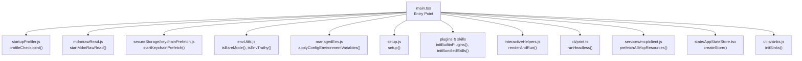

**Diagram sources**
- [main.tsx:1-200](file://claude_code_src/restored-src/src/main.tsx#L1-L200)
- [startupProfiler.js](file://claude_code_src/restored-src/src/utils/startupProfiler.js)
- [mdm/rawRead.js](file://claude_code_src/restored-src/src/utils/settings/mdm/rawRead.js)
- [keychainPrefetch.js](file://claude_code_src/restored-src/src/utils/secureStorage/keychainPrefetch.js)
- [envUtils.js](file://claude_code_src/restored-src/src/utils/envUtils.js)
- [managedEnv.js](file://claude_code_src/restored-src/src/utils/managedEnv.js)
- [setup.js](file://claude_code_src/restored-src/src/setup.js)
- [interactiveHelpers.js](file://claude_code_src/restored-src/src/interactiveHelpers.js)
- [cli/print.ts](file://claude_code_src/restored-src/src/cli/print.ts)
- [services/mcp/client.js](file://claude_code_src/restored-src/src/services/mcp/client.js)
- [state/AppStateStore.tsx](file://claude_code_src/restored-src/src/state/AppStateStore.tsx)
- [utils/sinks.js](file://claude_code_src/restored-src/src/utils/sinks.js)

**Section sources**
- [main.tsx:1-200](file://claude_code_src/restored-src/src/main.tsx#L1-L200)

## Core Components
- Side-effect imports and startup profiling: The entry point defines critical side effects that must run before other imports, including startup checkpoint markers, MDM subprocess initialization, and keychain prefetching. These are executed before any other module evaluation to maximize parallelism and reduce startup latency.
- Debugging mode detection: The entry point checks for debugging/inspection modes and exits early if debugging is detected, preventing unexpected behavior during development.
- Command-line argument processing: The entry point parses flags like -p/--print, --init-only, --sdk-url, and determines interactive vs non-interactive mode. It also initializes entrypoint detection based on mode.
- Deep link and URL handling: Early handling of cc:// and cc+unix:// deep links rewrites arguments to ensure the main command handles them, while also supporting macOS URL scheme launches.
- Environment and trust setup: Environment variables are applied after trust is established (or implicitly in non-interactive mode), ensuring potentially dangerous variables are only applied when safe.
- Plugin and skill initialization: Bundled plugins and skills are registered before loading commands and agents to ensure availability during setup.
- Interactive vs headless execution: The entry point branches into interactive REPL mode (with Ink) or headless mode (print.ts) depending on the execution mode and flags.
- MCP configuration and prefetching: MCP configs are loaded and resources prefetched in parallel with setup to minimize first-turn latency.
- Telemetry and analytics: Telemetry initialization occurs after environment variables are applied, ensuring observability is available for both interactive and headless modes.

**Section sources**
- [main.tsx:1-200](file://claude_code_src/restored-src/src/main.tsx#L1-L200)
- [main.tsx:231-271](file://claude_code_src/restored-src/src/main.tsx#L231-L271)
- [main.tsx:517-540](file://claude_code_src/restored-src/src/main.tsx#L517-L540)
- [main.tsx:612-677](file://claude_code_src/restored-src/src/main.tsx#L612-L677)
- [main.tsx:800-856](file://claude_code_src/restored-src/src/main.tsx#L800-L856)
- [main.tsx:1918-1936](file://claude_code_src/restored-src/src/main.tsx#L1918-L1936)
- [main.tsx:2584-2861](file://claude_code_src/restored-src/src/main.tsx#L2584-L2861)
- [main.tsx:2400-2430](file://claude_code_src/restored-src/src/main.tsx#L2400-L2430)

## Architecture Overview
The main entry point coordinates a sophisticated initialization pipeline that integrates with multiple subsystems. The flow begins with side-effect imports and profiling, proceeds through environment and trust setup, and culminates in either interactive REPL rendering or headless execution. Key integration points include state management, command systems, plugin loading, and MCP configuration.

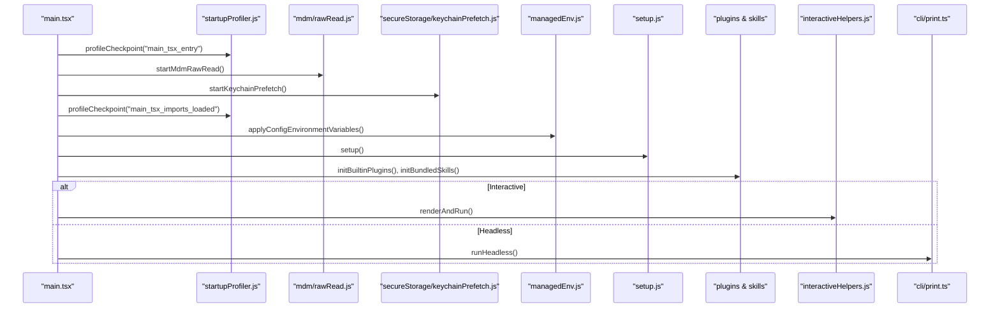

**Diagram sources**
- [main.tsx:1-200](file://claude_code_src/restored-src/src/main.tsx#L1-L200)
- [startupProfiler.js](file://claude_code_src/restored-src/src/utils/startupProfiler.js)
- [mdm/rawRead.js](file://claude_code_src/restored-src/src/utils/settings/mdm/rawRead.js)
- [keychainPrefetch.js](file://claude_code_src/restored-src/src/utils/secureStorage/keychainPrefetch.js)
- [managedEnv.js](file://claude_code_src/restored-src/src/utils/managedEnv.js)
- [setup.js](file://claude_code_src/restored-src/src/setup.js)
- [interactiveHelpers.js](file://claude_code_src/restored-src/src/interactiveHelpers.js)
- [cli/print.ts](file://claude_code_src/restored-src/src/cli/print.ts)

## Detailed Component Analysis

### Side-Effect Imports and Startup Profiling
The entry point defines critical side effects that must execute before other imports:
- Startup checkpoint markers: profileCheckpoint is used extensively to track initialization phases and optimize startup performance.
- MDM subprocess initialization: startMdmRawRead initiates background subprocesses (plutil/reg queries) to run in parallel with module imports.
- Keychain prefetching: startKeychainPrefetch performs parallel keychain reads (OAuth + legacy API key) to avoid sequential waits later.

These side effects are placed at the top of the file to ensure they execute before any other module evaluation, maximizing parallelism and reducing startup latency.

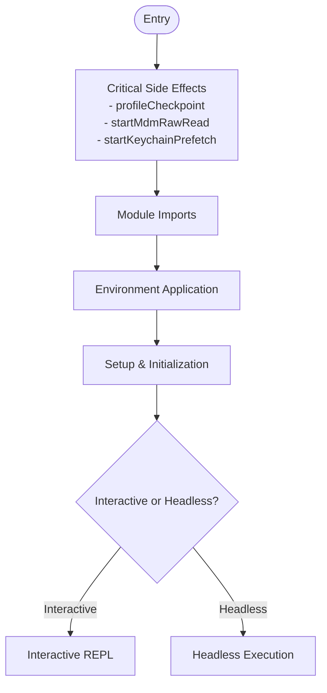

**Diagram sources**
- [main.tsx:1-200](file://claude_code_src/restored-src/src/main.tsx#L1-L200)

**Section sources**
- [main.tsx:1-200](file://claude_code_src/restored-src/src/main.tsx#L1-L200)
- [startupProfiler.js](file://claude_code_src/restored-src/src/utils/startupProfiler.js)
- [mdm/rawRead.js](file://claude_code_src/restored-src/src/utils/settings/mdm/rawRead.js)
- [keychainPrefetch.js](file://claude_code_src/restored-src/src/utils/secureStorage/keychainPrefetch.js)

### Security Measures: Windows PATH Hijacking Prevention and Debugging Mode Detection
The entry point implements critical security measures:
- Windows PATH hijacking prevention: Sets process.env.NoDefaultCurrentDirectoryInExePath to prevent executing commands from the current directory, mitigating PATH hijacking attacks.
- Debugging mode detection: Checks for inspect flags in process arguments and NODE_OPTIONS, and verifies inspector availability. If debugging is detected, the process exits early to prevent unintended behavior during development.

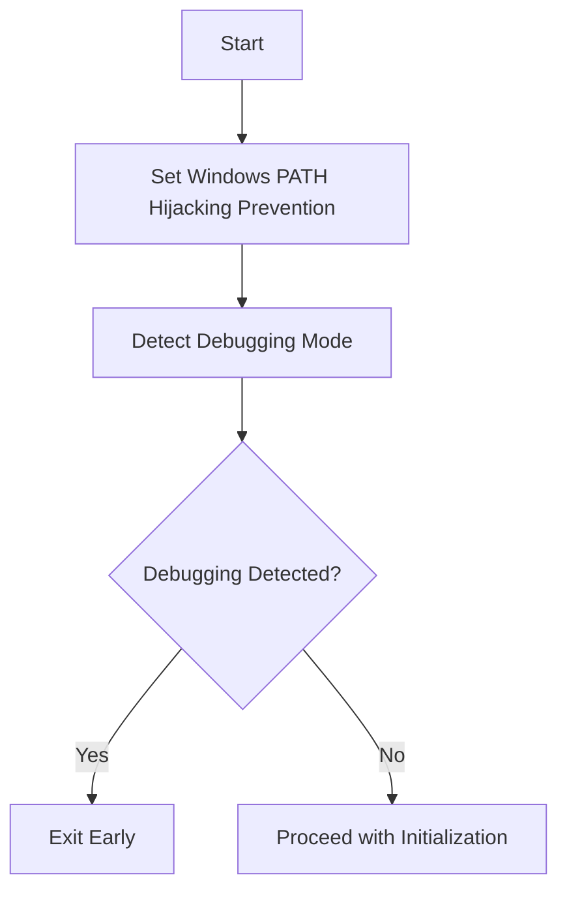

**Diagram sources**
- [main.tsx:588-592](file://claude_code_src/restored-src/src/main.tsx#L588-L592)
- [main.tsx:231-271](file://claude_code_src/restored-src/src/main.tsx#L231-L271)

**Section sources**
- [main.tsx:588-592](file://claude_code_src/restored-src/src/main.tsx#L588-L592)
- [main.tsx:231-271](file://claude_code_src/restored-src/src/main.tsx#L231-L271)

### Command-Line Argument Processing and Entry Point Detection
The entry point processes command-line arguments to determine execution mode and entry point:
- Determines interactive vs non-interactive mode based on flags like -p/--print, --init-only, --sdk-url, and TTY availability.
- Initializes entrypoint detection before any event logging, setting CLAUDE_CODE_ENTRYPOINT based on mode and special commands like mcp serve or GitHub Actions.
- Parses settings flags early to ensure settings are filtered from the start of initialization.

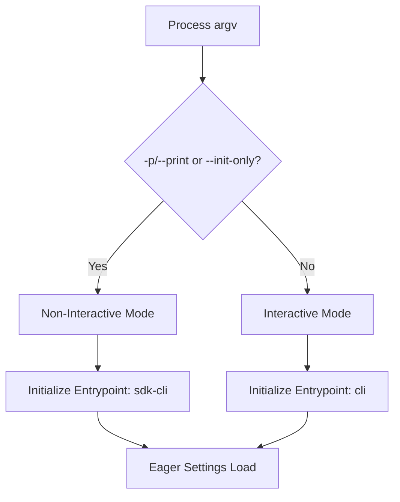

**Diagram sources**
- [main.tsx:800-815](file://claude_code_src/restored-src/src/main.tsx#L800-L815)
- [main.tsx:517-540](file://claude_code_src/restored-src/src/main.tsx#L517-L540)
- [main.tsx:502-516](file://claude_code_src/restored-src/src/main.tsx#L502-L516)

**Section sources**
- [main.tsx:800-815](file://claude_code_src/restored-src/src/main.tsx#L800-L815)
- [main.tsx:517-540](file://claude_code_src/restored-src/src/main.tsx#L517-L540)
- [main.tsx:502-516](file://claude_code_src/restored-src/src/main.tsx#L502-L516)

### Deep Link Handling and URL Rewriting
The entry point handles deep links and URL rewriting:
- Detects cc:// and cc+unix:// URLs and rewrites arguments to ensure the main command handles them, providing the full interactive TUI instead of a stripped-down subcommand.
- Supports macOS URL scheme launches via LaunchServices, enabling seamless integration with the operating system.
- Handles --handle-uri flags for universal deep linking scenarios.

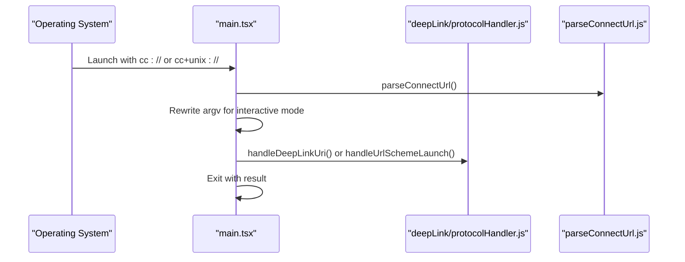

**Diagram sources**
- [main.tsx:612-677](file://claude_code_src/restored-src/src/main.tsx#L612-L677)
- [deepLink/protocolHandler.js](file://claude_code_src/restored-src/src/utils/deepLink/protocolHandler.js)
- [parseConnectUrl.js](file://claude_code_src/restored-src/src/server/parseConnectUrl.js)

**Section sources**
- [main.tsx:612-677](file://claude_code_src/restored-src/src/main.tsx#L612-L677)

### Environment Setup and Trust Establishment
Environment setup and trust establishment occur after side effects and argument processing:
- Applies configuration environment variables after trust is established (or implicitly in non-interactive mode).
- Initializes telemetry after environment variables are applied to ensure observability is available.
- Prefetches system context and user context in a safe manner, considering trust and non-interactive mode.

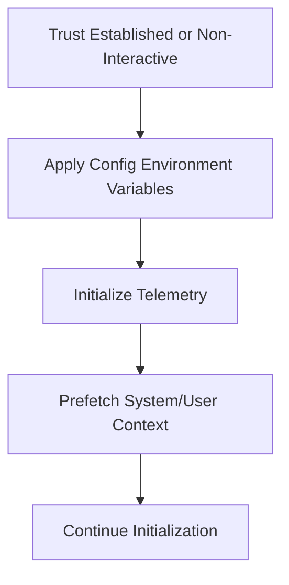

**Diagram sources**
- [main.tsx:1952-1990](file://claude_code_src/restored-src/src/main.tsx#L1952-L1990)
- [main.tsx:2590-2597](file://claude_code_src/restored-src/src/main.tsx#L2590-L2597)
- [managedEnv.js](file://claude_code_src/restored-src/src/utils/managedEnv.js)

**Section sources**
- [main.tsx:1952-1990](file://claude_code_src/restored-src/src/main.tsx#L1952-L1990)
- [main.tsx:2590-2597](file://claude_code_src/restored-src/src/main.tsx#L2590-L2597)

### Plugin and Skill Initialization
Plugin and skill initialization occurs before loading commands and agents:
- Registers bundled plugins and skills to ensure availability during setup.
- Initializes versioned plugins and performs orphan cleanup in interactive mode, while deferring to headless mode for performance.

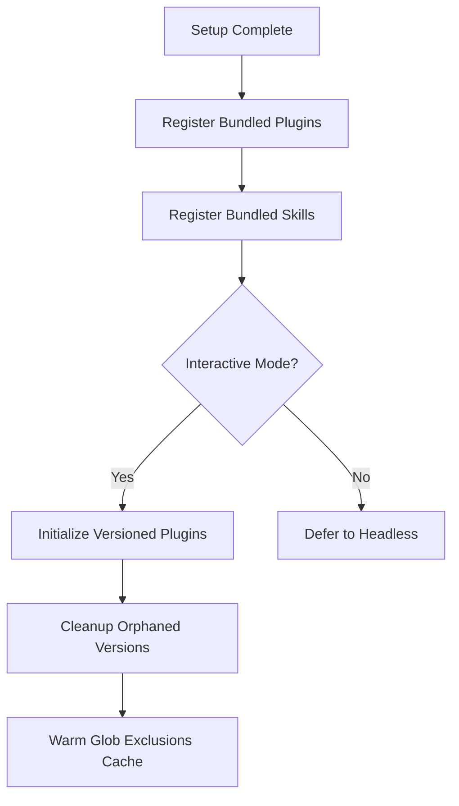

**Diagram sources**
- [main.tsx:1923-1926](file://claude_code_src/restored-src/src/main.tsx#L1923-L1926)
- [main.tsx:2555-2570](file://claude_code_src/restored-src/src/main.tsx#L2555-L2570)
- [utils/plugins/installedPluginsManager.js](file://claude_code_src/restored-src/src/utils/plugins/installedPluginsManager.js)
- [utils/plugins/cacheUtils.js](file://claude_code_src/restored-src/src/utils/plugins/cacheUtils.js)
- [utils/plugins/pluginLoader.js](file://claude_code_src/restored-src/src/utils/plugins/pluginLoader.js)

**Section sources**
- [main.tsx:1923-1926](file://claude_code_src/restored-src/src/main.tsx#L1923-L1926)
- [main.tsx:2555-2570](file://claude_code_src/restored-src/src/main.tsx#L2555-L2570)

### Interactive vs Headless Execution Paths
The entry point branches into different execution paths:
- Interactive mode: Renders the REPL using Ink, initializes LSP manager after trust, and handles setup screens and onboarding.
- Headless mode: Initializes telemetry, connects MCP servers, and executes runHeadless to produce output without a TUI.

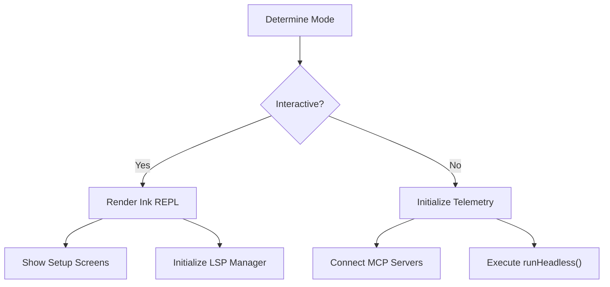

**Diagram sources**
- [main.tsx:2217-2321](file://claude_code_src/restored-src/src/main.tsx#L2217-L2321)
- [main.tsx:2584-2861](file://claude_code_src/restored-src/src/main.tsx#L2584-L2861)
- [interactiveHelpers.js](file://claude_code_src/restored-src/src/interactiveHelpers.js)
- [cli/print.ts](file://claude_code_src/restored-src/src/cli/print.ts)

**Section sources**
- [main.tsx:2217-2321](file://claude_code_src/restored-src/src/main.tsx#L2217-L2321)
- [main.tsx:2584-2861](file://claude_code_src/restored-src/src/main.tsx#L2584-L2861)

### MCP Configuration and Resource Prefetching
MCP configuration and resource prefetching occur in parallel with setup:
- Loads MCP configs from various sources (local, dynamic, claude.ai) and filters according to policy.
- Prefetches MCP resources to minimize first-turn latency and ensure tools are available when needed.

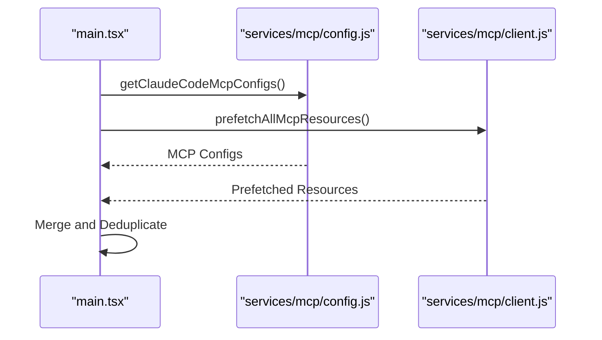

**Diagram sources**
- [main.tsx:2380-2430](file://claude_code_src/restored-src/src/main.tsx#L2380-L2430)
- [services/mcp/config.js](file://claude_code_src/restored-src/src/services/mcp/config.js)
- [services/mcp/client.js](file://claude_code_src/restored-src/src/services/mcp/client.js)

**Section sources**
- [main.tsx:2380-2430](file://claude_code_src/restored-src/src/main.tsx#L2380-L2430)

### Relationship to Broader Application Architecture
The main entry point coordinates with state management, command systems, and plugin loading:
- State management: Creates the initial application state, integrates with state stores, and manages session persistence.
- Command systems: Loads commands and agents, filters them for remote mode when applicable, and integrates with the REPL.
- Plugin loading: Initializes plugins and skills, manages plugin versions, and logs telemetry for plugin usage.

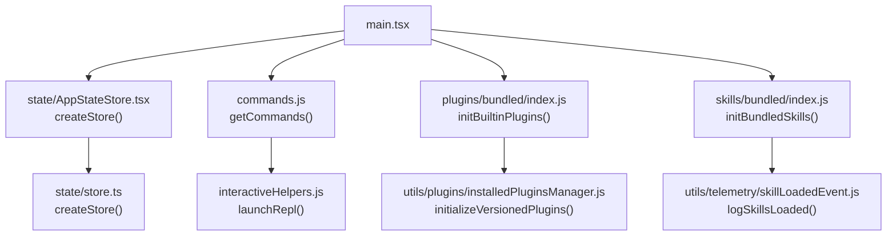

**Diagram sources**
- [main.tsx:2926-3036](file://claude_code_src/restored-src/src/main.tsx#L2926-L3036)
- [state/AppStateStore.tsx](file://claude_code_src/restored-src/src/state/AppStateStore.tsx)
- [state/store.ts](file://claude_code_src/restored-src/src/state/store.ts)
- [interactiveHelpers.js](file://claude_code_src/restored-src/src/interactiveHelpers.js)
- [utils/plugins/installedPluginsManager.js](file://claude_code_src/restored-src/src/utils/plugins/installedPluginsManager.js)
- [utils/telemetry/skillLoadedEvent.js](file://claude_code_src/restored-src/src/utils/telemetry/skillLoadedEvent.js)

**Section sources**
- [main.tsx:2926-3036](file://claude_code_src/restored-src/src/main.tsx#L2926-L3036)
- [state/AppStateStore.tsx](file://claude_code_src/restored-src/src/state/AppStateStore.tsx)
- [state/store.ts](file://claude_code_src/restored-src/src/state/store.ts)
- [interactiveHelpers.js](file://claude_code_src/restored-src/src/interactiveHelpers.js)
- [utils/plugins/installedPluginsManager.js](file://claude_code_src/restored-src/src/utils/plugins/installedPluginsManager.js)
- [utils/telemetry/skillLoadedEvent.js](file://claude_code_src/restored-src/src/utils/telemetry/skillLoadedEvent.js)

## Dependency Analysis
The main entry point has dependencies across multiple subsystems, with careful attention to initialization order and parallelization:
- Startup profiling and environment preparation depend on early side effects and argument processing.
- Plugin and skill initialization depends on setup completion and environment application.
- Interactive and headless paths diverge after trust establishment and telemetry initialization.
- MCP configuration depends on environment variables and policy limits.

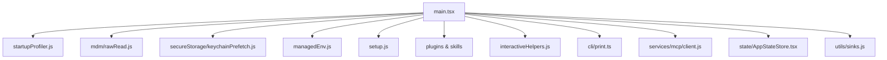

**Diagram sources**
- [main.tsx:1-200](file://claude_code_src/restored-src/src/main.tsx#L1-L200)
- [startupProfiler.js](file://claude_code_src/restored-src/src/utils/startupProfiler.js)
- [mdm/rawRead.js](file://claude_code_src/restored-src/src/utils/settings/mdm/rawRead.js)
- [keychainPrefetch.js](file://claude_code_src/restored-src/src/utils/secureStorage/keychainPrefetch.js)
- [managedEnv.js](file://claude_code_src/restored-src/src/utils/managedEnv.js)
- [setup.js](file://claude_code_src/restored-src/src/setup.js)
- [interactiveHelpers.js](file://claude_code_src/restored-src/src/interactiveHelpers.js)
- [cli/print.ts](file://claude_code_src/restored-src/src/cli/print.ts)
- [services/mcp/client.js](file://claude_code_src/restored-src/src/services/mcp/client.js)
- [state/AppStateStore.tsx](file://claude_code_src/restored-src/src/state/AppStateStore.tsx)
- [utils/sinks.js](file://claude_code_src/restored-src/src/utils/sinks.js)

**Section sources**
- [main.tsx:1-200](file://claude_code_src/restored-src/src/main.tsx#L1-L200)

## Performance Considerations
- Parallel prefetching: MDM subprocesses and keychain reads are initiated early to run in parallel with module imports, minimizing startup latency.
- Deferred prefetches: Background prefetches are deferred until after the REPL renders to reduce event loop contention and child process spawning during the critical startup path.
- Bare mode optimization: --bare mode skips prefetches and certain background work to optimize startup performance for scripted calls.
- MCP resource prefetching: MCP resources are prefetched in parallel with setup to minimize first-turn latency.
- Telemetry throttling: Startup prefetches are throttled based on configuration to avoid excessive network calls during frequent startups.

[No sources needed since this section provides general guidance]

## Troubleshooting Guide
Common issues and their resolutions:
- Debugging mode detected: The process exits early if debugging/inspection flags are present, preventing unexpected behavior during development.
- Windows PATH hijacking: Ensure process.env.NoDefaultCurrentDirectoryInExePath is set to prevent executing commands from the current directory.
- Deep link handling: Verify cc:// and cc+unix:// URLs are properly detected and rewritten to ensure the main command handles them.
- Trust dialog issues: If trust is not established, certain operations may be blocked or delayed; ensure the trust dialog is completed before proceeding.
- Plugin and skill initialization: If plugins fail to initialize, check for errors and ensure proper environment variables are applied.
- MCP configuration issues: Validate MCP configurations and ensure policy limits are respected; enterprise configurations may restrict dynamic MCP server additions.

**Section sources**
- [main.tsx:231-271](file://claude_code_src/restored-src/src/main.tsx#L231-L271)
- [main.tsx:588-592](file://claude_code_src/restored-src/src/main.tsx#L588-L592)
- [main.tsx:612-677](file://claude_code_src/restored-src/src/main.tsx#L612-L677)
- [main.tsx:2323-2336](file://claude_code_src/restored-src/src/main.tsx#L2323-L2336)
- [utils/plugins/installedPluginsManager.js](file://claude_code_src/restored-src/src/utils/plugins/installedPluginsManager.js)
- [services/mcp/config.js](file://claude_code_src/restored-src/src/services/mcp/config.js)

## Conclusion
The main entry point serves as the orchestrator for a complex initialization pipeline that prioritizes performance, security, and correctness. By executing critical side effects early, implementing robust security measures, and coordinating with multiple subsystems, it ensures reliable startup across interactive and headless modes. The careful ordering of environment setup, plugin/skill initialization, and MCP configuration enables optimal performance and user experience.