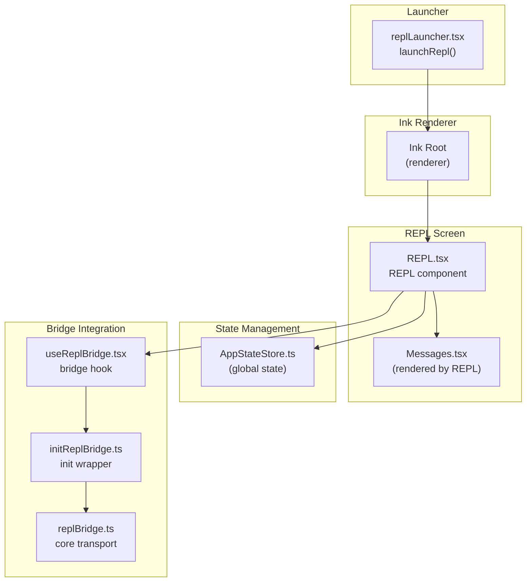
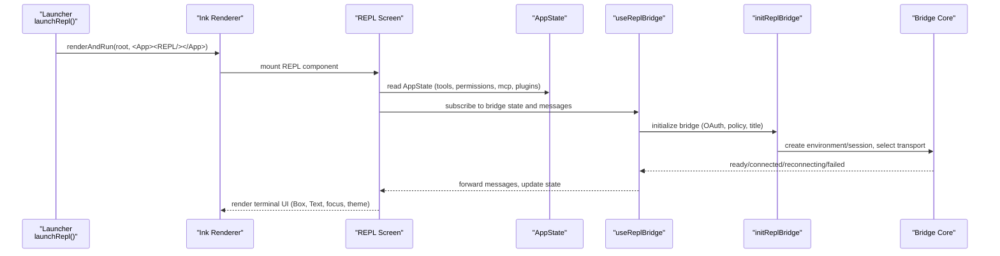
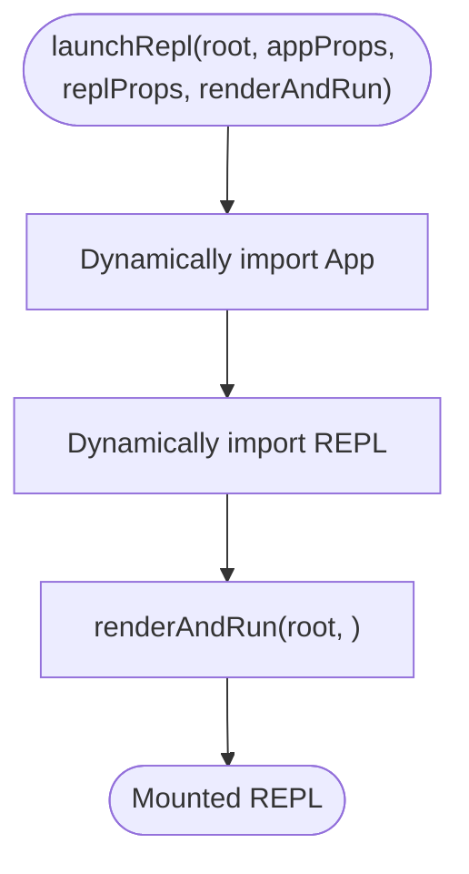
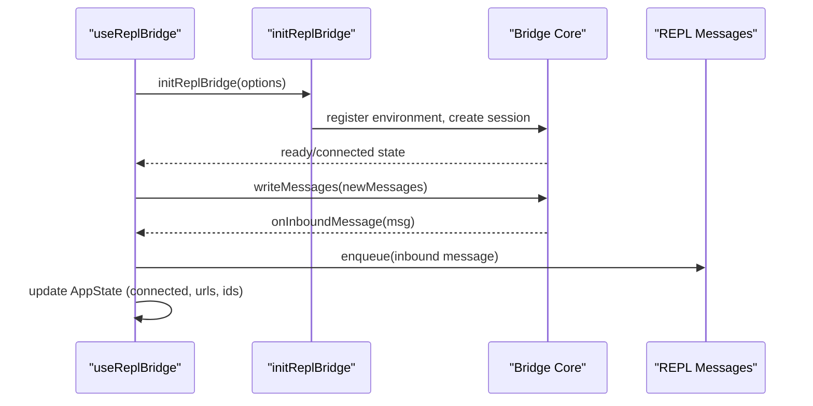
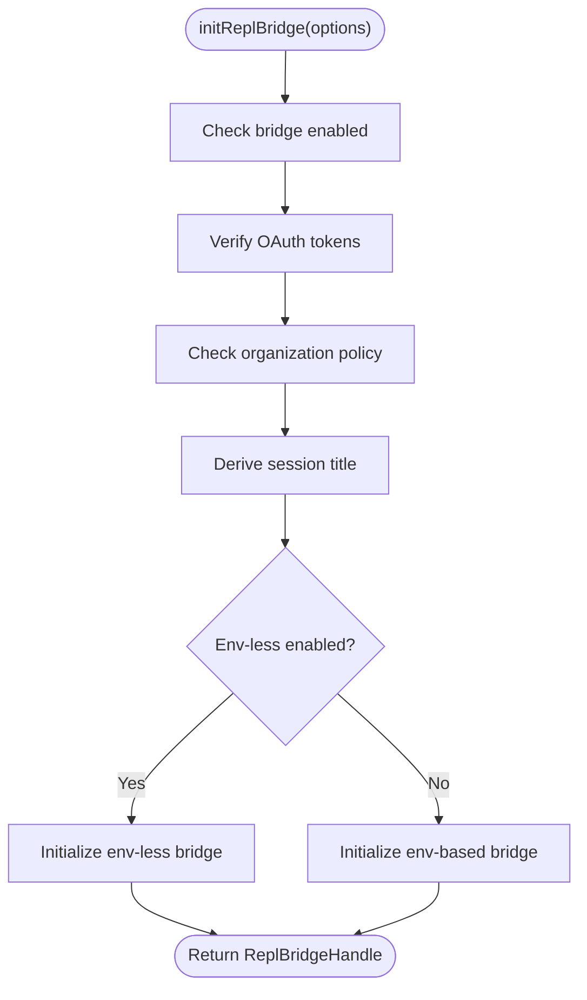
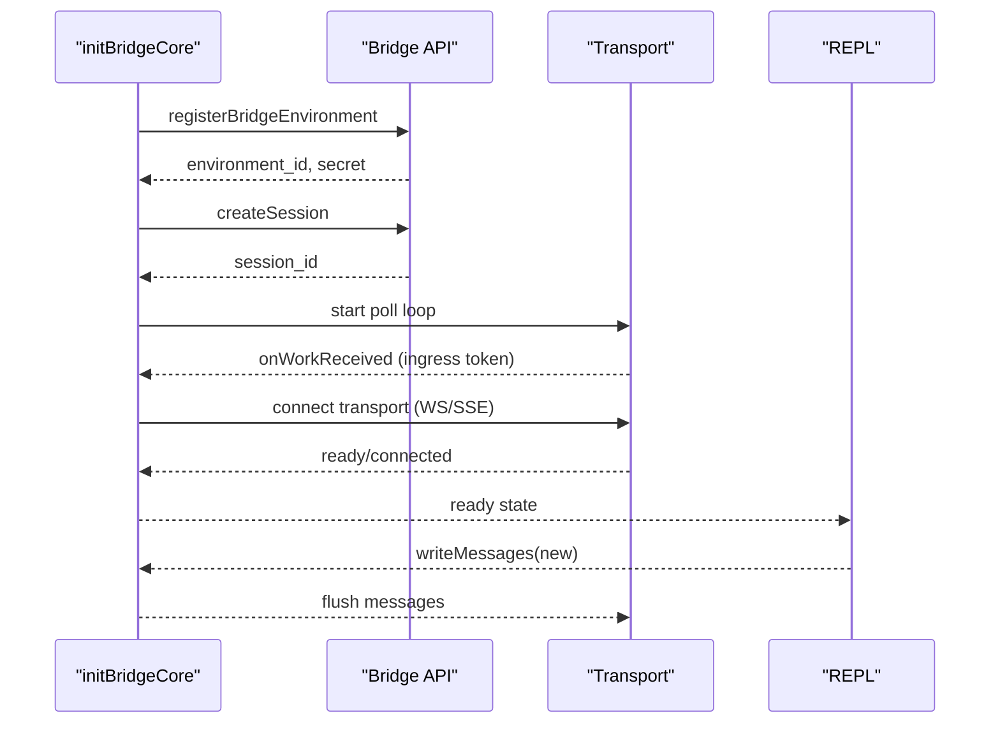
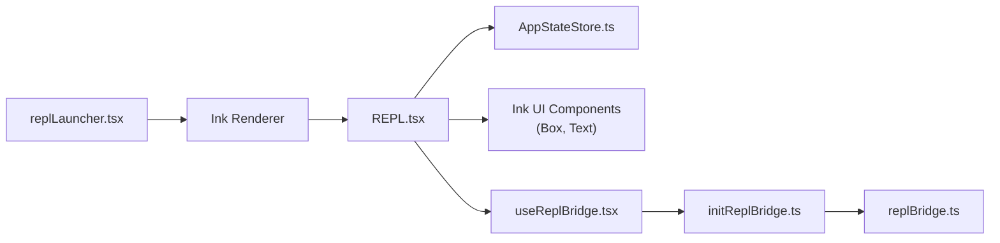

# REPL Launcher

<cite>
**Referenced Files in This Document**
- [replLauncher.tsx](file://src/replLauncher.tsx)
- [REPL.tsx](file://src/screens/REPL.tsx)
- [useReplBridge.tsx](file://src/hooks/useReplBridge.tsx)
- [initReplBridge.ts](file://src/bridge/initReplBridge.ts)
- [replBridge.ts](file://src/bridge/replBridge.ts)
</cite>

## Table of Contents
1. [Introduction](#introduction)
2. [Project Structure](#project-structure)
3. [Core Components](#core-components)
4. [Architecture Overview](#architecture-overview)
5. [Detailed Component Analysis](#detailed-component-analysis)
6. [Dependency Analysis](#dependency-analysis)
7. [Performance Considerations](#performance-considerations)
8. [Troubleshooting Guide](#troubleshooting-guide)
9. [Conclusion](#conclusion)

## Introduction
This document explains the REPL launcher system that integrates the Ink framework for terminal UI rendering and orchestrates the REPL runtime. It covers how the launcher initializes the terminal interface, mounts the REPL screen, coordinates with the main application state, and integrates with the Ink rendering pipeline. It also documents the REPL startup sequence, component lifecycle, terminal-specific features, input/output handling, styling mechanisms, and performance considerations. Practical examples demonstrate initialization patterns, component composition, and state management integration.

## Project Structure
The REPL launcher system spans several modules:
- Launcher: Initializes the Ink renderer and mounts the REPL screen with application props.
- REPL Screen: The primary terminal UI component that renders messages, handles input, and manages state.
- Bridge Integration Hooks: Manage the always-on bridge connection and synchronize messages between the REPL and remote sessions.
- Bridge Core: Implements environment registration, session creation, transport selection, and lifecycle management.

**Diagram sources**
- [replLauncher.tsx:12-22](file://src/replLauncher.tsx#L12-L22)
- [REPL.tsx:572-598](file://src/screens/REPL.tsx#L572-L598)
- [useReplBridge.tsx:53-722](file://src/hooks/useReplBridge.tsx#L53-L722)
- [initReplBridge.ts:110-545](file://src/bridge/initReplBridge.ts#L110-L545)
- [replBridge.ts:260-545](file://src/bridge/replBridge.ts#L260-L545)

**Section sources**
- [replLauncher.tsx:12-22](file://src/replLauncher.tsx#L12-L22)
- [REPL.tsx:572-598](file://src/screens/REPL.tsx#L572-L598)

## Core Components
- REPL Launcher: Provides the entry point to initialize the Ink renderer and mount the REPL screen with application props.
- REPL Screen: Renders the terminal UI, manages input, handles terminal features (focus, title, tab status), and coordinates with state and tools.
- Bridge Hook: Manages the persistent bridge connection, forwards messages, and synchronizes state with the remote session.
- Bridge Initialization: Orchestrates OAuth checks, policy gating, environment/session creation, and transport selection.
- Bridge Core: Implements transport lifecycle, reconnection strategies, and message flushing.

**Section sources**
- [replLauncher.tsx:12-22](file://src/replLauncher.tsx#L12-L22)
- [REPL.tsx:572-598](file://src/screens/REPL.tsx#L572-L598)
- [useReplBridge.tsx:53-722](file://src/hooks/useReplBridge.tsx#L53-L722)
- [initReplBridge.ts:110-545](file://src/bridge/initReplBridge.ts#L110-L545)
- [replBridge.ts:260-545](file://src/bridge/replBridge.ts#L260-L545)

## Architecture Overview
The REPL launcher initializes the Ink renderer and mounts the REPL screen. The REPL composes terminal UI components (Box, Text, focus, theme, terminal title) and integrates with state management. The bridge hook establishes a persistent connection to the remote control service, forwarding messages and reflecting state changes. The bridge initialization enforces gates (OAuth, policy, version), computes session metadata, and selects between environment-based and environment-less transport paths. The bridge core manages environment registration, session creation, polling, and transport switching.

**Diagram sources**
- [replLauncher.tsx:12-22](file://src/replLauncher.tsx#L12-L22)
- [REPL.tsx:610-640](file://src/screens/REPL.tsx#L610-L640)
- [useReplBridge.tsx:95-133](file://src/hooks/useReplBridge.tsx#L95-L133)
- [initReplBridge.ts:134-241](file://src/bridge/initReplBridge.ts#L134-L241)
- [replBridge.ts:318-371](file://src/bridge/replBridge.ts#L318-L371)

## Detailed Component Analysis

### REPL Launcher
The launcher defines a single asynchronous function that dynamically imports the App and REPL components and mounts them within the Ink renderer. It receives application wrapper props (FPS metrics, stats, initial state) and REPL props (commands, tools, initial messages, system prompts, etc.). The launcher delegates rendering to the provided renderAndRun callback, ensuring the REPL is rendered within the Ink root.

**Diagram sources**
- [replLauncher.tsx:12-22](file://src/replLauncher.tsx#L12-L22)

**Section sources**
- [replLauncher.tsx:12-22](file://src/replLauncher.tsx#L12-L22)

### REPL Screen
The REPL screen is a complex terminal UI component that:
- Initializes terminal features: focus state, theme, terminal title, tab status.
- Manages state via AppState (tools, permissions, MCP clients, plugins, tasks, agent definitions).
- Composes terminal UI components (Box, Text) and specialized components (Messages, PromptInput, TaskListV2).
- Integrates with hooks for terminal size, search, notifications, and bridge control.
- Handles input/output, including prompt submission, command processing, and message rendering.
- Supports advanced features: virtual scrolling, transcript mode, search highlighting, and terminal title animations.

Key responsibilities:
- Lifecycle logging and state initialization.
- Tool and command assembly, including dynamic MCP configuration.
- Bridge integration via useReplBridge, including inbound message injection and outbound message forwarding.
- Terminal-specific UX: focus management, title updates, tab status, and keyboard shortcuts.

**Section sources**
- [REPL.tsx:572-640](file://src/screens/REPL.tsx#L572-L640)
- [REPL.tsx:676-721](file://src/screens/REPL.tsx#L676-L721)
- [REPL.tsx:727-781](file://src/screens/REPL.tsx#L727-L781)
- [REPL.tsx:797-800](file://src/screens/REPL.tsx#L797-L800)

### Bridge Integration Hook
The useReplBridge hook manages the persistent bridge connection:
- Watches AppState flags for bridge enablement and mode.
- Initializes the bridge via initReplBridge with OAuth, policy, and session metadata checks.
- Forwards new messages to the bridge and reflects inbound messages into the REPL.
- Updates AppState with bridge state (connected, session URLs, environment/session IDs).
- Handles permission mode transitions, model changes, and control requests/responses.
- Implements safeguards: consecutive failure limits, auto-disable timers, and outbound-only mirror mode.

**Diagram sources**
- [useReplBridge.tsx:95-133](file://src/hooks/useReplBridge.tsx#L95-L133)
- [useReplBridge.tsx:387-481](file://src/hooks/useReplBridge.tsx#L387-L481)
- [useReplBridge.tsx:685-713](file://src/hooks/useReplBridge.tsx#L685-L713)

**Section sources**
- [useReplBridge.tsx:53-722](file://src/hooks/useReplBridge.tsx#L53-L722)

### Bridge Initialization
The initReplBridge wrapper enforces runtime gates and prepares session metadata:
- Checks bridge enablement, OAuth availability, and organization policy.
- Computes session title precedence: explicit name, stored title, last meaningful user message, or slug fallback.
- Selects between environment-based and environment-less transport paths.
- Gathers git context and worker type, then delegates to the bridge core.

**Diagram sources**
- [initReplBridge.ts:134-241](file://src/bridge/initReplBridge.ts#L134-L241)
- [initReplBridge.ts:410-452](file://src/bridge/initReplBridge.ts#L410-L452)

**Section sources**
- [initReplBridge.ts:110-545](file://src/bridge/initReplBridge.ts#L110-L545)

### Bridge Core Transport
The bridge core manages environment registration, session creation, polling, and transport selection:
- Registers the bridge environment and creates a session with metadata (title, git context, worker type).
- Starts a poll loop for work items, then establishes an ingress WebSocket or SSE transport.
- Implements reconnection strategies when environments are lost or connections drop.
- Coordinates message flushing, echo filtering, and UUID deduplication.

**Diagram sources**
- [replBridge.ts:318-371](file://src/bridge/replBridge.ts#L318-L371)
- [replBridge.ts:529-571](file://src/bridge/replBridge.ts#L529-L571)
- [replBridge.ts:605-760](file://src/bridge/replBridge.ts#L605-L760)

**Section sources**
- [replBridge.ts:260-545](file://src/bridge/replBridge.ts#L260-L545)

## Dependency Analysis
The REPL launcher depends on the Ink renderer and mounts the REPL screen. The REPL depends on:
- AppState for global state (tools, permissions, MCP, plugins, tasks).
- Terminal UI components (Box, Text) and specialized components (Messages, PromptInput).
- Hooks for terminal features (focus, theme, size, search, notifications).
- Bridge integration via useReplBridge.

The bridge integration depends on:
- initReplBridge for gating and session metadata preparation.
- replBridge core for environment/session management and transport.

**Diagram sources**
- [replLauncher.tsx:12-22](file://src/replLauncher.tsx#L12-L22)
- [REPL.tsx:572-598](file://src/screens/REPL.tsx#L572-L598)
- [useReplBridge.tsx:53-722](file://src/hooks/useReplBridge.tsx#L53-L722)
- [initReplBridge.ts:110-545](file://src/bridge/initReplBridge.ts#L110-L545)
- [replBridge.ts:260-545](file://src/bridge/replBridge.ts#L260-L545)

**Section sources**
- [replLauncher.tsx:12-22](file://src/replLauncher.tsx#L12-L22)
- [REPL.tsx:572-598](file://src/screens/REPL.tsx#L572-L598)
- [useReplBridge.tsx:53-722](file://src/hooks/useReplBridge.tsx#L53-L722)
- [initReplBridge.ts:110-545](file://src/bridge/initReplBridge.ts#L110-L545)
- [replBridge.ts:260-545](file://src/bridge/replBridge.ts#L260-L545)

## Performance Considerations
- Rendering optimization: The REPL leverages virtual scrolling and memoization to minimize re-renders during large transcripts. Conditional rendering and feature flags reduce unnecessary computations.
- Bridge message deduplication: Uses bounded UUID sets and indices to prevent duplicate message forwarding and echo injection.
- Transport efficiency: SSE transport with sequence number carryover avoids replaying entire histories on reconnect.
- Terminal-specific optimizations: Terminal title animations are isolated to leaf components to avoid re-rendering the entire REPL tree.
- Startup checks: Early gating (OAuth, policy, version) prevents wasted initialization attempts and reduces error noise.

[No sources needed since this section provides general guidance]

## Troubleshooting Guide
Common issues and remedies:
- Bridge not enabled: Verify bridge enablement flags and organization policy. Check OAuth tokens and re-login if needed.
- OAuth expired or unrefreshable: Dead token detection persists across processes; re-login to refresh tokens.
- Version too old: Upgrade the client to meet minimum version requirements for environment-less or environment-based paths.
- Environment lost: The system automatically reconnects with strategies to reuse sessions or create fresh ones.
- Bridge failures: Consecutive failure limits and auto-disable timers prevent retry storms; inspect notifications and logs for details.

**Section sources**
- [initReplBridge.ts:134-241](file://src/bridge/initReplBridge.ts#L134-L241)
- [useReplBridge.tsx:113-128](file://src/hooks/useReplBridge.tsx#L113-L128)
- [useReplBridge.tsx:340-363](file://src/hooks/useReplBridge.tsx#L340-L363)

## Conclusion
The REPL launcher system integrates the Ink framework to deliver a robust terminal UI, coordinating with the main application state and the bridge infrastructure. The launcher initializes the renderer and mounts the REPL, which composes terminal UI components and manages input/output. The bridge integration ensures reliable synchronization with remote sessions, with careful gating, transport selection, and lifecycle management. Together, these components provide a responsive, efficient, and terminal-friendly REPL experience.