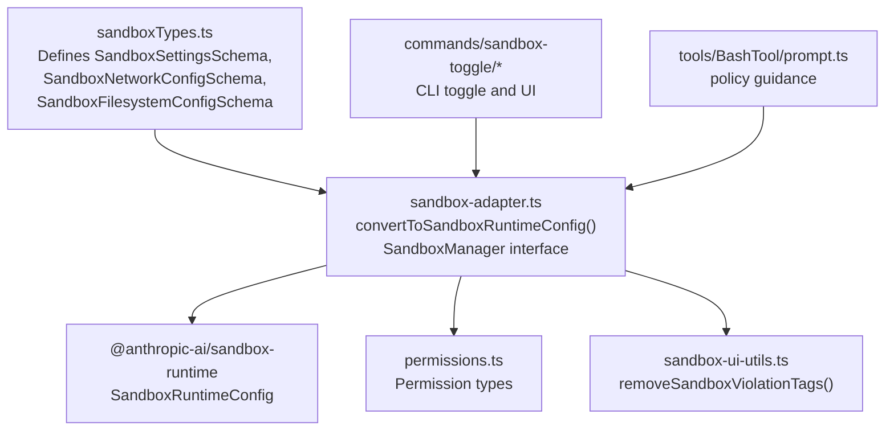
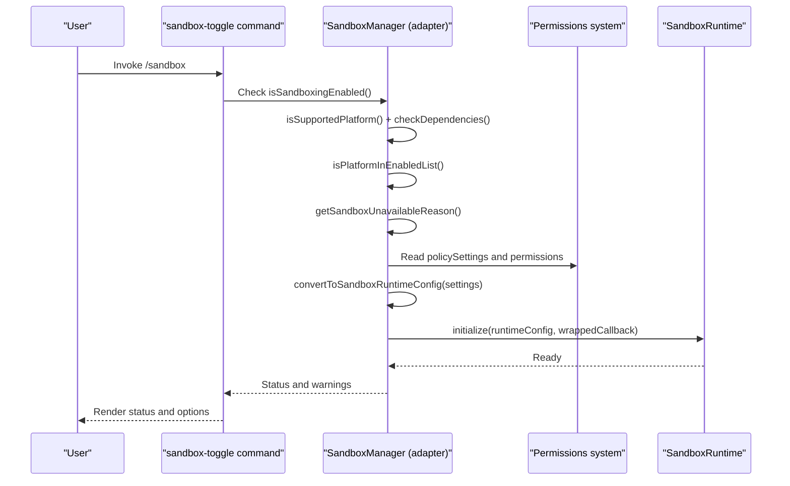
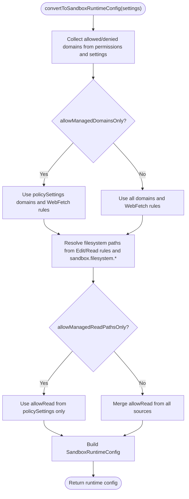
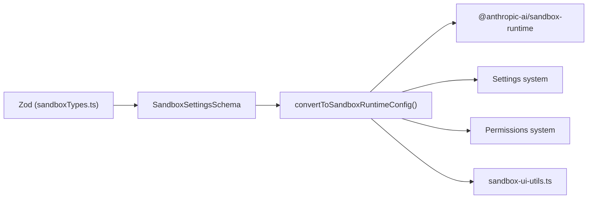

# Sandbox Types

<cite>
**Referenced Files in This Document**
- [sandboxTypes.ts](file://src/entrypoints/sandboxTypes.ts)
- [sandbox-adapter.ts](file://src/utils/sandbox/sandbox-adapter.ts)
- [sandbox-ui-utils.ts](file://src/utils/sandbox/sandbox-ui-utils.ts)
- [permissions.ts](file://src/types/permissions.ts)
- [PermissionRule.ts](file://src/utils/permissions/PermissionRule.ts)
- [prompt.ts](file://src/tools/BashTool/prompt.ts)
- [index.ts](file://src/commands/sandbox-toggle/index.ts)
- [sandbox-toggle.tsx](file://src/commands/sandbox-toggle/sandbox-toggle.tsx)
</cite>

## Table of Contents
1. [Introduction](#introduction)
2. [Project Structure](#project-structure)
3. [Core Components](#core-components)
4. [Architecture Overview](#architecture-overview)
5. [Detailed Component Analysis](#detailed-component-analysis)
6. [Dependency Analysis](#dependency-analysis)
7. [Performance Considerations](#performance-considerations)
8. [Troubleshooting Guide](#troubleshooting-guide)
9. [Conclusion](#conclusion)

## Introduction
This document explains the sandbox type system and its entry point for type definitions and configuration schemas. It covers how sandbox types are defined, validated, and integrated across the application, including relationships with permission systems, security policies, and command execution. It also documents practical usage patterns, configuration options, and the adapter layer that bridges the external sandbox runtime with Claude Code’s settings and tool integrations.

## Project Structure
The sandbox type system centers on a single source-of-truth file that defines Zod schemas for sandbox configuration, and an adapter that converts these settings into a runtime configuration for the sandbox runtime. Supporting files define permission types and integrate with the broader permission system and command UI.



**Diagram sources**
- [sandboxTypes.ts:1-157](file://src/entrypoints/sandboxTypes.ts#L1-L157)
- [sandbox-adapter.ts:166-381](file://src/utils/sandbox/sandbox-adapter.ts#L166-L381)
- [permissions.ts:1-442](file://src/types/permissions.ts#L1-L442)
- [sandbox-ui-utils.ts:1-13](file://src/utils/sandbox/sandbox-ui-utils.ts#L1-L13)
- [index.ts:1-50](file://src/commands/sandbox-toggle/index.ts#L1-L50)
- [sandbox-toggle.tsx:22-58](file://src/commands/sandbox-toggle/sandbox-toggle.tsx#L22-L58)
- [prompt.ts:247-256](file://src/tools/BashTool/prompt.ts#L247-L256)

**Section sources**
- [sandboxTypes.ts:1-157](file://src/entrypoints/sandboxTypes.ts#L1-L157)
- [sandbox-adapter.ts:1-986](file://src/utils/sandbox/sandbox-adapter.ts#L1-L986)
- [permissions.ts:1-442](file://src/types/permissions.ts#L1-L442)
- [sandbox-ui-utils.ts:1-13](file://src/utils/sandbox/sandbox-ui-utils.ts#L1-L13)
- [index.ts:1-50](file://src/commands/sandbox-toggle/index.ts#L1-L50)
- [sandbox-toggle.tsx:22-58](file://src/commands/sandbox-toggle/sandbox-toggle.tsx#L22-L58)
- [prompt.ts:247-256](file://src/tools/BashTool/prompt.ts#L247-L256)

## Core Components
- Sandbox configuration schemas:
  - Network configuration schema for allowed domains, Unix socket allowances, local binding, and proxy ports.
  - Filesystem configuration schema for allow/deny read/write paths and managed-read-path-only controls.
  - Top-level sandbox settings schema including enablement, failure behavior, platform gating, auto-allow bash, unsandboxed fallback, ignore-violations, nested sandbox toggles, network isolation, excluded commands, and ripgrep configuration.
- Type inference:
  - Derived TypeScript types from the schemas for compile-time safety.
- Adapter layer:
  - Converts merged settings into a SandboxRuntimeConfig consumed by the sandbox runtime.
  - Provides a cohesive SandboxManager interface wrapping the runtime with Claude-specific integrations (path resolution, policy enforcement, dependency checks, settings subscriptions, and cleanup).
- UI utilities:
  - Helpers to sanitize sandbox violation messages for display.

**Section sources**
- [sandboxTypes.ts:11-157](file://src/entrypoints/sandboxTypes.ts#L11-L157)
- [sandbox-adapter.ts:166-381](file://src/utils/sandbox/sandbox-adapter.ts#L166-L381)
- [sandbox-ui-utils.ts:1-13](file://src/utils/sandbox/sandbox-ui-utils.ts#L1-L13)

## Architecture Overview
The sandbox type system is the single source of truth for sandbox configuration types. The adapter consumes these types and settings to produce a runtime configuration, while respecting policy settings and permission rules. The command system surfaces sandbox status and configuration to users, and the permission system coordinates with sandbox enforcement.



**Diagram sources**
- [sandbox-adapter.ts:528-592](file://src/utils/sandbox/sandbox-adapter.ts#L528-L592)
- [sandbox-adapter.ts:727-792](file://src/utils/sandbox/sandbox-adapter.ts#L727-L792)
- [sandbox-adapter.ts:166-381](file://src/utils/sandbox/sandbox-adapter.ts#L166-L381)
- [index.ts:5-48](file://src/commands/sandbox-toggle/index.ts#L5-L48)
- [sandbox-toggle.tsx:22-58](file://src/commands/sandbox-toggle/sandbox-toggle.tsx#L22-L58)

## Detailed Component Analysis

### Sandbox Type Definitions
- Network configuration:
  - allowedDomains: array of domain strings.
  - allowManagedDomainsOnly: when true (policy), only managed domains and WebFetch allow rules are respected; user/project/local/flag domains are ignored; denied domains still apply from all sources.
  - allowUnixSockets: array of paths (macOS only).
  - allowAllUnixSockets: boolean to disable seccomp filtering.
  - allowLocalBinding: boolean to allow binding to localhost.
  - httpProxyPort and socksProxyPort: numeric ports for proxies.
- Filesystem configuration:
  - allowWrite, denyWrite, denyRead, allowRead: arrays of path patterns.
  - allowManagedReadPathsOnly: when true (policy), only allowRead paths from policy settings are used.
- Sandbox settings:
  - enabled, failIfUnavailable, autoAllowBashIfSandboxed, allowUnsandboxedCommands, network, filesystem, ignoreViolations, enableWeakerNestedSandbox, enableWeakerNetworkIsolation, excludedCommands, ripgrep.
  - passthrough() allows additional fields for extensibility.

These schemas are lazily constructed to support self-referencing and are used to derive TypeScript types for compile-time safety.

**Section sources**
- [sandboxTypes.ts:11-157](file://src/entrypoints/sandboxTypes.ts#L11-L157)

### Adapter Layer and Runtime Conversion
- convertToSandboxRuntimeConfig(settings):
  - Aggregates allowed and denied domains from WebFetch permission rules and configured domains.
  - Resolves filesystem paths from Edit/Read permission rules and sandbox.filesystem settings, applying CC-specific path semantics and managed-read-path-only policy.
  - Blocks sensitive locations (settings.json, managed settings drop-in, .claude/skills) and git bare-repo artifacts.
  - Builds a SandboxRuntimeConfig with network, filesystem, ignoreViolations, and ripgrep overrides.
- SandboxManager interface:
  - Exposes lifecycle and configuration APIs: initialize, isSandboxingEnabled, isSupportedPlatform, checkDependencies, wrapWithSandbox, refreshConfig, reset, and getters for runtime config segments.
  - Wraps callbacks to enforce allowManagedDomainsOnly policy.
  - Subscribes to settings changes to update runtime configuration dynamically.



**Diagram sources**
- [sandbox-adapter.ts:166-381](file://src/utils/sandbox/sandbox-adapter.ts#L166-L381)

**Section sources**
- [sandbox-adapter.ts:166-381](file://src/utils/sandbox/sandbox-adapter.ts#L166-L381)
- [sandbox-adapter.ts:880-967](file://src/utils/sandbox/sandbox-adapter.ts#L880-L967)

### Permission System Integration
- PermissionRule types and schemas define the structure for permission rules, behaviors, and sources.
- The adapter resolves CC-specific path patterns and standard filesystem semantics for sandbox.filesystem.* settings.
- Policy settings can override user/project/local settings for domains and read paths, ensuring compliance in managed environments.

```mermaid
classDiagram
class PermissionRule {
+string toolName
+string ruleContent
}
class PermissionRuleValue {
+string toolName
+string ruleContent
}
class PermissionRuleSource {
<<enum>>
"userSettings"
"projectSettings"
"localSettings"
"flagSettings"
"policySettings"
"cliArg"
"command"
"session"
}
class SandboxSettingsSchema {
+boolean enabled
+boolean failIfUnavailable
+boolean autoAllowBashIfSandboxed
+boolean allowUnsandboxedCommands
+SandboxNetworkConfigSchema network
+SandboxFilesystemConfigSchema filesystem
+map ignoreViolations
+boolean enableWeakerNestedSandbox
+boolean enableWeakerNetworkIsolation
+string[] excludedCommands
+object ripgrep
}
PermissionRule --> PermissionRuleValue : "contains"
SandboxSettingsSchema --> SandboxNetworkConfigSchema : "has"
SandboxSettingsSchema --> SandboxFilesystemConfigSchema : "has"
```

**Diagram sources**
- [permissions.ts:54-79](file://src/types/permissions.ts#L54-L79)
- [PermissionRule.ts:35-40](file://src/utils/permissions/PermissionRule.ts#L35-L40)
- [sandboxTypes.ts:89-144](file://src/entrypoints/sandboxTypes.ts#L89-L144)

**Section sources**
- [permissions.ts:1-442](file://src/types/permissions.ts#L1-L442)
- [PermissionRule.ts:1-41](file://src/utils/permissions/PermissionRule.ts#L1-L41)
- [sandbox-adapter.ts:121-146](file://src/utils/sandbox/sandbox-adapter.ts#L121-L146)

### Security Policies and Managed Settings
- allowManagedDomainsOnly:
  - When true in policy settings, only managed domains and WebFetch allow rules are considered; user/project/local/flag domains are ignored.
- allowManagedReadPathsOnly:
  - When true in policy settings, only allowRead paths from policy settings are used.
- Policy overrides:
  - Higher-priority sources (flagSettings, policySettings) can lock sandbox settings, preventing local changes.

**Section sources**
- [sandboxTypes.ts:18-24](file://src/entrypoints/sandboxTypes.ts#L18-L24)
- [sandboxTypes.ts:78-83](file://src/entrypoints/sandboxTypes.ts#L78-L83)
- [sandbox-adapter.ts:148-164](file://src/utils/sandbox/sandbox-adapter.ts#L148-L164)
- [sandbox-adapter.ts:644-664](file://src/utils/sandbox/sandbox-adapter.ts#L644-L664)

### Practical Usage Patterns and Integration
- Enabling sandbox:
  - Use sandbox.enabled to enable; failIfUnavailable can force startup failure if sandbox cannot start.
  - autoAllowBashIfSandboxed enables automatic allowance for bash when sandboxed.
  - allowUnsandboxedCommands allows commands to run unsandboxed via a parameter; policy can disable this.
- Excluding commands:
  - excludedCommands prevents specific commands from being sandboxed; adapter supports adding patterns based on permission suggestions.
- Proxy and network isolation:
  - httpProxyPort and socksProxyPort configure outbound proxies; enableWeakerNetworkIsolation relaxes macOS network isolation at reduced security.
- Ripgrep integration:
  - ripgrep.command and args customize bundled ripgrep behavior within the sandbox.

**Section sources**
- [sandboxTypes.ts:91-144](file://src/entrypoints/sandboxTypes.ts#L91-L144)
- [sandbox-adapter.ts:824-874](file://src/utils/sandbox/sandbox-adapter.ts#L824-L874)

### Command System Integration
- The sandbox toggle command surfaces sandbox status, dependency checks, platform gating, and policy locks to users.
- It conditionally renders UI and enforces policy constraints before allowing changes.

**Section sources**
- [index.ts:5-48](file://src/commands/sandbox-toggle/index.ts#L5-L48)
- [sandbox-toggle.tsx:22-58](file://src/commands/sandbox-toggle/sandbox-toggle.tsx#L22-L58)

### Policy Guidance in Tools
- Bash tool prompt reflects policy constraints:
  - If policy disables unsandboxed commands, guidance emphasizes sandbox-only operation and suggests adjusting sandbox settings instead of bypassing.

**Section sources**
- [prompt.ts:247-256](file://src/tools/BashTool/prompt.ts#L247-L256)

## Dependency Analysis
- sandboxTypes.ts depends on Zod and a lazy schema helper to define recursive and self-referential schemas.
- sandbox-adapter.ts depends on:
  - @anthropic-ai/sandbox-runtime types and manager for runtime configuration and lifecycle.
  - Settings system for merging and reading policy/user/project/local settings.
  - Permissions system for interpreting allow/deny rules and path patterns.
  - Platform and path utilities for resolving CC-specific path semantics.
- UI utilities depend on basic string manipulation for sanitizing sandbox violation messages.



**Diagram sources**
- [sandboxTypes.ts:8-9](file://src/entrypoints/sandboxTypes.ts#L8-L9)
- [sandbox-adapter.ts:1-46](file://src/utils/sandbox/sandbox-adapter.ts#L1-L46)
- [sandbox-ui-utils.ts:1-13](file://src/utils/sandbox/sandbox-ui-utils.ts#L1-L13)

**Section sources**
- [sandboxTypes.ts:1-10](file://src/entrypoints/sandboxTypes.ts#L1-L10)
- [sandbox-adapter.ts:1-46](file://src/utils/sandbox/sandbox-adapter.ts#L1-L46)
- [sandbox-ui-utils.ts:1-13](file://src/utils/sandbox/sandbox-ui-utils.ts#L1-L13)

## Performance Considerations
- Memoization is used for platform support and dependency checks to avoid repeated expensive operations.
- Settings subscription updates runtime configuration dynamically without restarting the sandbox, minimizing disruption.
- Path resolution and glob pattern warnings are computed on demand and filtered by platform to reduce unnecessary work.

[No sources needed since this section provides general guidance]

## Troubleshooting Guide
- Sandbox unavailable:
  - getSandboxUnavailableReason() surfaces platform support, enabledPlatforms restriction, and missing dependencies.
- Dependency failures:
  - checkDependencies() returns structured errors and warnings; address missing tools or platform limitations.
- Platform gating:
  - isPlatformInEnabledList() restricts sandbox to specific platforms; adjust sandbox.enabledPlatforms if needed.
- Policy overrides:
  - areSandboxSettingsLockedByPolicy() detects higher-priority sources; modify flagSettings or policySettings instead of localSettings.
- Violation handling:
  - ignoreViolations can suppress specific violations; use sparingly and review security implications.
- UI sanitization:
  - removeSandboxViolationTags() cleans error messages for display.

**Section sources**
- [sandbox-adapter.ts:562-592](file://src/utils/sandbox/sandbox-adapter.ts#L562-L592)
- [sandbox-adapter.ts:447-457](file://src/utils/sandbox/sandbox-adapter.ts#L447-L457)
- [sandbox-adapter.ts:495-526](file://src/utils/sandbox/sandbox-adapter.ts#L495-L526)
- [sandbox-adapter.ts:644-664](file://src/utils/sandbox/sandbox-adapter.ts#L644-L664)
- [sandbox-ui-utils.ts:10-12](file://src/utils/sandbox/sandbox-ui-utils.ts#L10-L12)

## Conclusion
The sandbox type system provides a robust, type-safe foundation for sandbox configuration across the application. By centralizing schema definitions and leveraging an adapter layer, the system integrates tightly with settings, permissions, and the command/UI surfaces. It enforces security policies through managed settings, supports dynamic configuration updates, and offers practical controls for network, filesystem, and tool behaviors. Together, these components maintain type safety and secure defaults while enabling flexible deployment scenarios.