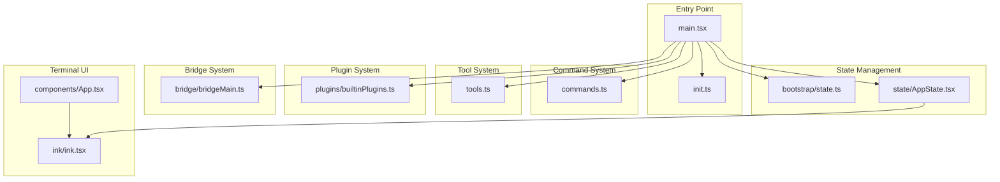
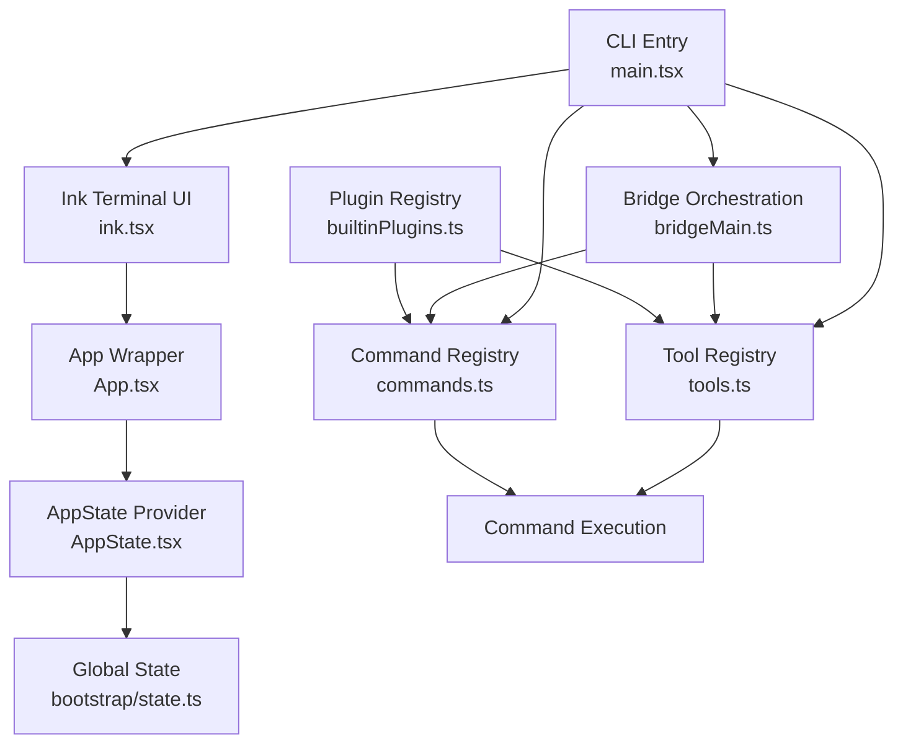
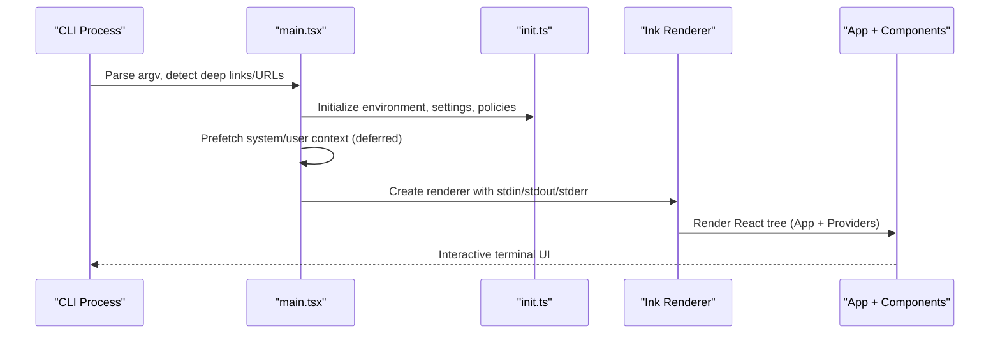
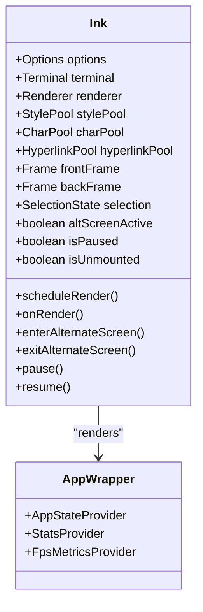
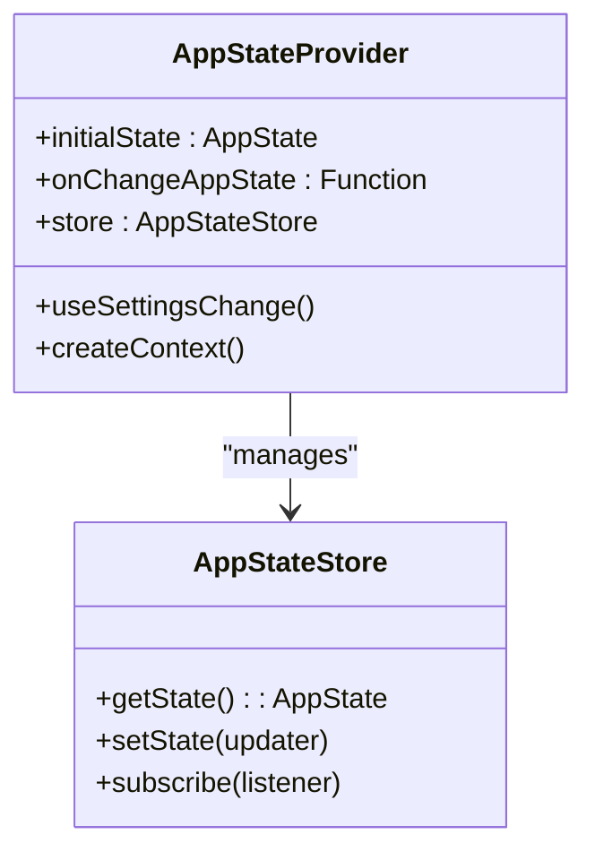
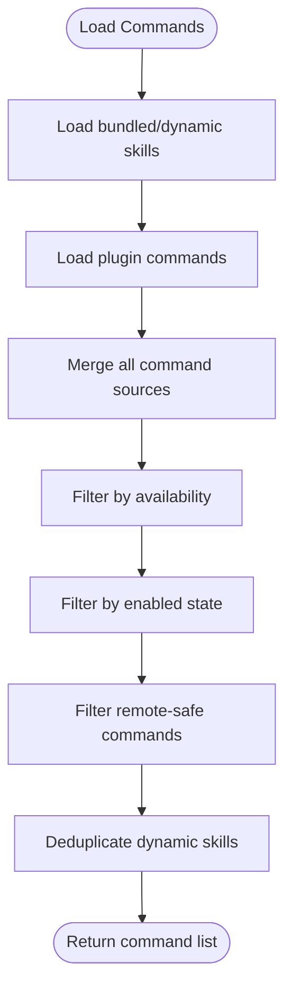
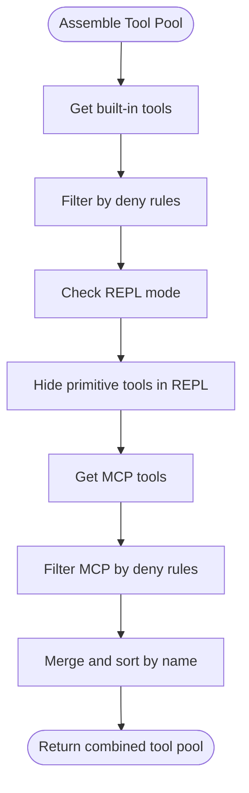
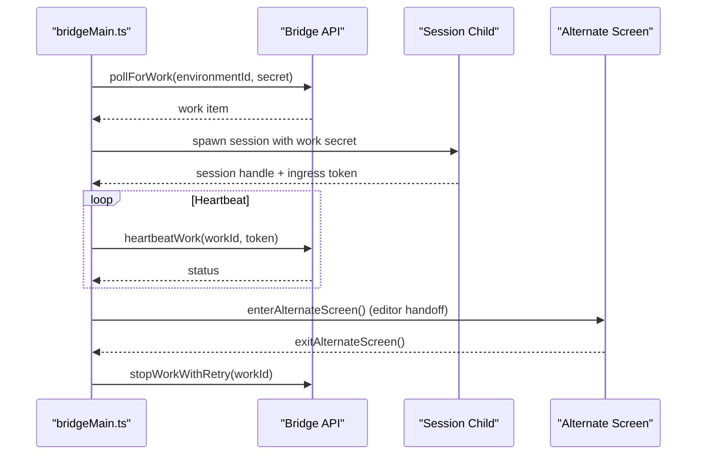
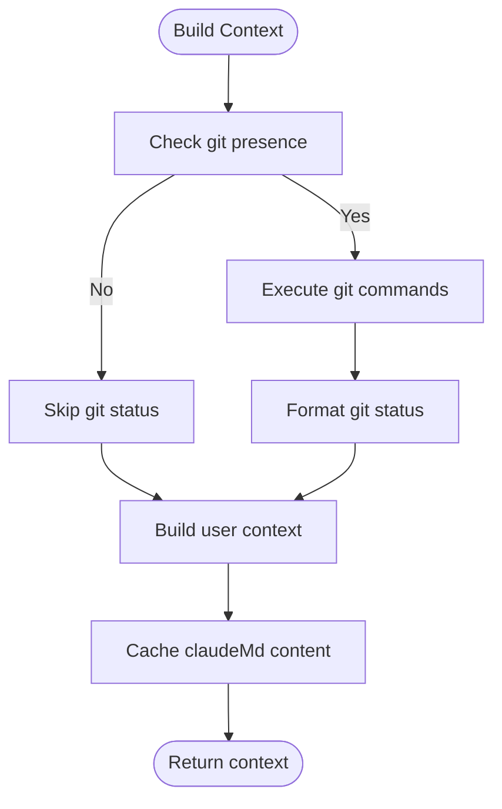
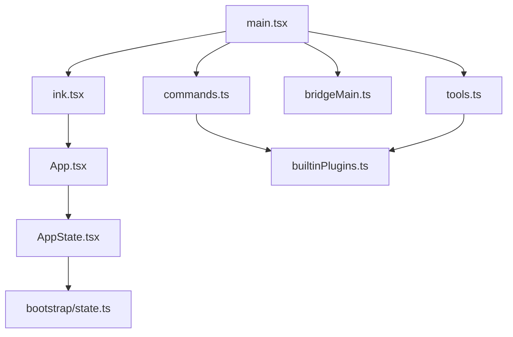

# Architecture and Design

<cite>
**Referenced Files in This Document**
- [README.md](file://README.md)
- [main.tsx](file://restored-src/src/main.tsx)
- [state.ts](file://restored-src/src/bootstrap/state.ts)
- [commands.ts](file://restored-src/src/commands.ts)
- [tools.ts](file://restored-src/src/tools.ts)
- [AppState.tsx](file://restored-src/src/state/AppState.tsx)
- [builtinPlugins.ts](file://restored-src/src/plugins/builtinPlugins.ts)
- [bridgeMain.ts](file://restored-src/src/bridge/bridgeMain.ts)
- [ink.tsx](file://restored-src/src/ink/ink.tsx)
- [App.tsx](file://restored-src/src/components/App.tsx)
- [context.ts](file://restored-src/src/context.ts)
</cite>

## Table of Contents
1. [Introduction](#introduction)
2. [Project Structure](#project-structure)
3. [Core Components](#core-components)
4. [Architecture Overview](#architecture-overview)
5. [Detailed Component Analysis](#detailed-component-analysis)
6. [Dependency Analysis](#dependency-analysis)
7. [Performance Considerations](#performance-considerations)
8. [Troubleshooting Guide](#troubleshooting-guide)
9. [Conclusion](#conclusion)

## Introduction
This document describes the architecture and design of the Claude Code Python IDE system. It focuses on the React-based terminal UI built with Ink, the command pattern implementation, and the modular plugin architecture. The system integrates a layered design with UI components, business logic, and data services, orchestrated by a central entry point. The technology stack includes React 18+, TypeScript, Ink for terminal rendering, and Bun runtime.

## Project Structure
The repository is organized around a CLI entry point, state management, command and tool registries, plugin systems, and a terminal UI built on Ink. Key areas include:
- Entry point and orchestration: main entry, CLI parsing, initialization, and startup telemetry
- State management: global state and React context providers
- Command system: command registry, availability filtering, and remote-safe command handling
- Tool system: tool registry, permission filtering, and MCP tool integration
- Plugin system: built-in plugin registry and skill/command exposure
- Bridge system: remote session management and multi-session orchestration
- Terminal UI: Ink renderer, alternate screen handling, and rendering pipeline



**Diagram sources**
- [main.tsx:585-800](file://restored-src/src/main.tsx#L585-L800)
- [state.ts:43-120](file://restored-src/src/bootstrap/state.ts#L43-L120)
- [AppState.tsx:27-120](file://restored-src/src/state/AppState.tsx#L27-L120)
- [commands.ts:258-346](file://restored-src/src/commands.ts#L258-L346)
- [tools.ts:193-251](file://restored-src/src/tools.ts#L193-L251)
- [builtinPlugins.ts:21-102](file://restored-src/src/plugins/builtinPlugins.ts#L21-L102)
- [bridgeMain.ts:141-200](file://restored-src/src/bridge/bridgeMain.ts#L141-L200)
- [ink.tsx:76-120](file://restored-src/src/ink/ink.tsx#L76-L120)
- [App.tsx:19-55](file://restored-src/src/components/App.tsx#L19-L55)

**Section sources**
- [README.md:24-42](file://README.md#L24-L42)
- [main.tsx:585-800](file://restored-src/src/main.tsx#L585-L800)

## Core Components
- CLI Entry Point: Initializes environment, parses arguments, prefetches context, initializes analytics, and renders the terminal UI via Ink.
- State Management: Centralized global state with React context providers for app state, stats, and FPS metrics.
- Command System: Central registry of commands with availability checks, dynamic skills, and remote-safe filtering.
- Tool System: Registry of tools with permission filtering, MCP integration, and mode-specific presets.
- Plugin System: Built-in plugin registry enabling/disabling and exposing skills/commands.
- Bridge System: Multi-session orchestration for remote environments with polling, heartbeats, and capacity management.
- Terminal UI: Ink renderer managing frames, diff optimization, alternate screen handling, and cursor positioning.

**Section sources**
- [main.tsx:585-800](file://restored-src/src/main.tsx#L585-L800)
- [AppState.tsx:27-120](file://restored-src/src/state/AppState.tsx#L27-L120)
- [commands.ts:258-346](file://restored-src/src/commands.ts#L258-L346)
- [tools.ts:193-251](file://restored-src/src/tools.ts#L193-L251)
- [builtinPlugins.ts:21-102](file://restored-src/src/plugins/builtinPlugins.ts#L21-L102)
- [bridgeMain.ts:141-200](file://restored-src/src/bridge/bridgeMain.ts#L141-L200)
- [ink.tsx:76-120](file://restored-src/src/ink/ink.tsx#L76-L120)

## Architecture Overview
The system follows a layered architecture:
- Presentation Layer: Ink-based terminal UI with React components and alternate screen management
- Application Layer: CLI entry, initialization, command routing, and plugin orchestration
- Domain Layer: State management, command execution, tool invocation, and context building
- Infrastructure Layer: Bridge orchestration, analytics, telemetry, and file system integrations



**Diagram sources**
- [ink.tsx:76-120](file://restored-src/src/ink/ink.tsx#L76-L120)
- [App.tsx:19-55](file://restored-src/src/components/App.tsx#L19-L55)
- [AppState.tsx:27-120](file://restored-src/src/state/AppState.tsx#L27-L120)
- [state.ts:43-120](file://restored-src/src/bootstrap/state.ts#L43-L120)
- [commands.ts:258-346](file://restored-src/src/commands.ts#L258-L346)
- [tools.ts:193-251](file://restored-src/src/tools.ts#L193-L251)
- [builtinPlugins.ts:21-102](file://restored-src/src/plugins/builtinPlugins.ts#L21-L102)
- [bridgeMain.ts:141-200](file://restored-src/src/bridge/bridgeMain.ts#L141-L200)
- [main.tsx:585-800](file://restored-src/src/main.tsx#L585-L800)

## Detailed Component Analysis

### CLI Entry Point and Startup Flow
The CLI entry orchestrates initialization, context prefetching, analytics, and UI rendering. It handles deep links, direct connect URLs, SSH sessions, and remote mode considerations. Deferred prefetches are started after the first render to minimize startup latency.



**Diagram sources**
- [main.tsx:585-800](file://restored-src/src/main.tsx#L585-L800)
- [ink.tsx:76-120](file://restored-src/src/ink/ink.tsx#L76-L120)
- [App.tsx:19-55](file://restored-src/src/components/App.tsx#L19-L55)

**Section sources**
- [main.tsx:585-800](file://restored-src/src/main.tsx#L585-L800)

### React-Based Terminal UI Architecture (Ink)
Ink provides a React renderer for terminal environments. It manages frames, diff optimization, alternate screen handling, and cursor positioning. The renderer integrates with React's commit phase for layout calculation and uses a log-update diff engine for efficient terminal updates.



**Diagram sources**
- [ink.tsx:76-120](file://restored-src/src/ink/ink.tsx#L76-L120)
- [App.tsx:19-55](file://restored-src/src/components/App.tsx#L19-L55)

**Section sources**
- [ink.tsx:76-120](file://restored-src/src/ink/ink.tsx#L76-L120)
- [App.tsx:19-55](file://restored-src/src/components/App.tsx#L19-L55)

### State Management with React Context
AppStateProvider establishes a global state store with React context, enabling selective subscriptions via useAppState. It integrates with settings change listeners and permission contexts, ensuring consistent state updates across the UI.



**Diagram sources**
- [AppState.tsx:27-120](file://restored-src/src/state/AppState.tsx#L27-L120)

**Section sources**
- [AppState.tsx:27-120](file://restored-src/src/state/AppState.tsx#L27-L120)
- [state.ts:43-120](file://restored-src/src/bootstrap/state.ts#L43-L120)

### Command Pattern Implementation
The command system centralizes command definitions, availability checks, and dynamic discovery. Commands are filtered by availability (auth/provider), enabled state, and remote-safe constraints. Dynamic skills are merged into the command list with deduplication.



**Diagram sources**
- [commands.ts:449-517](file://restored-src/src/commands.ts#L449-L517)

**Section sources**
- [commands.ts:258-346](file://restored-src/src/commands.ts#L258-L346)
- [commands.ts:449-517](file://restored-src/src/commands.ts#L449-L517)

### Tool Registry and Permission Filtering
The tool system aggregates built-in and MCP tools, applying permission deny rules and mode-specific filtering. Tool pools are assembled with deterministic ordering for prompt-cache stability.



**Diagram sources**
- [tools.ts:345-367](file://restored-src/src/tools.ts#L345-L367)

**Section sources**
- [tools.ts:193-251](file://restored-src/src/tools.ts#L193-L251)
- [tools.ts:345-367](file://restored-src/src/tools.ts#L345-L367)

### Plugin Architecture (Built-in Plugins)
Built-in plugins are registered at startup and exposed as commands/skills. Their enabled state is derived from user settings with defaults, and they are distinguished by a special marketplace identifier.

```mermaid
classDiagram
class BuiltinPluginRegistry {
+registerBuiltinPlugin(definition)
+getBuiltinPlugins() : {enabled, disabled}
+getBuiltinPluginSkillCommands() : Command[]
+isBuiltinPluginId(id) : boolean
}
class BuiltinPluginDefinition {
+name : string
+description : string
+version : string
+defaultEnabled : boolean
+isAvailable() : boolean
+skills : BundledSkillDefinition[]
+hooks : HooksConfig
+mcpServers : MCPConfig[]
}
BuiltinPluginRegistry --> BuiltinPluginDefinition : "manages"
```

**Diagram sources**
- [builtinPlugins.ts:21-102](file://restored-src/src/plugins/builtinPlugins.ts#L21-L102)

**Section sources**
- [builtinPlugins.ts:21-102](file://restored-src/src/plugins/builtinPlugins.ts#L21-L102)

### Bridge System and Multi-Session Orchestration
The bridge manages multiple sessions, polling for work, handling heartbeats, and coordinating capacity. It supports token refresh, session lifecycle, and alternate-screen integration for UI handoffs.



**Diagram sources**
- [bridgeMain.ts:141-200](file://restored-src/src/bridge/bridgeMain.ts#L141-L200)
- [bridgeMain.ts:442-591](file://restored-src/src/bridge/bridgeMain.ts#L442-L591)

**Section sources**
- [bridgeMain.ts:141-200](file://restored-src/src/bridge/bridgeMain.ts#L141-L200)
- [bridgeMain.ts:442-591](file://restored-src/src/bridge/bridgeMain.ts#L442-L591)

### Context Building for Conversations
System and user context are memoized and cached per session. Git status and ClaudeMd content are included to enrich conversations, with safeguards for performance and privacy.



**Diagram sources**
- [context.ts:116-150](file://restored-src/src/context.ts#L116-L150)
- [context.ts:155-189](file://restored-src/src/context.ts#L155-L189)

**Section sources**
- [context.ts:116-150](file://restored-src/src/context.ts#L116-L150)
- [context.ts:155-189](file://restored-src/src/context.ts#L155-L189)

## Dependency Analysis
The system exhibits low coupling between UI and domain logic through React context and centralized stores. Commands and tools are decoupled from UI rendering via registries and permission contexts. Plugins integrate through a built-in registry that exposes commands/skills without tight coupling to the UI.



**Diagram sources**
- [main.tsx:585-800](file://restored-src/src/main.tsx#L585-L800)
- [commands.ts:258-346](file://restored-src/src/commands.ts#L258-L346)
- [tools.ts:193-251](file://restored-src/src/tools.ts#L193-L251)
- [builtinPlugins.ts:21-102](file://restored-src/src/plugins/builtinPlugins.ts#L21-L102)
- [bridgeMain.ts:141-200](file://restored-src/src/bridge/bridgeMain.ts#L141-L200)
- [ink.tsx:76-120](file://restored-src/src/ink/ink.tsx#L76-L120)
- [App.tsx:19-55](file://restored-src/src/components/App.tsx#L19-L55)
- [AppState.tsx:27-120](file://restored-src/src/state/AppState.tsx#L27-L120)
- [state.ts:43-120](file://restored-src/src/bootstrap/state.ts#L43-L120)

**Section sources**
- [main.tsx:585-800](file://restored-src/src/main.tsx#L585-L800)
- [commands.ts:258-346](file://restored-src/src/commands.ts#L258-L346)
- [tools.ts:193-251](file://restored-src/src/tools.ts#L193-L251)
- [builtinPlugins.ts:21-102](file://restored-src/src/plugins/builtinPlugins.ts#L21-L102)
- [bridgeMain.ts:141-200](file://restored-src/src/bridge/bridgeMain.ts#L141-L200)
- [ink.tsx:76-120](file://restored-src/src/ink/ink.tsx#L76-L120)
- [App.tsx:19-55](file://restored-src/src/components/App.tsx#L19-L55)
- [AppState.tsx:27-120](file://restored-src/src/state/AppState.tsx#L27-L120)
- [state.ts:43-120](file://restored-src/src/bootstrap/state.ts#L43-L120)

## Performance Considerations
- Deferred prefetches: Heavy operations (analytics, model capabilities, file counts) are deferred after the first render to reduce startup latency.
- Memoization: Context builders and command/tool loaders use memoization to avoid redundant computations.
- Rendering optimization: Ink's diff optimization and frame buffering minimize terminal writes and improve throughput.
- Capacity management: Bridge uses heartbeat-only polling at capacity to reduce server load while maintaining liveness.

## Troubleshooting Guide
- Startup issues: Review initialization logs and environment variable checks in the CLI entry point.
- Command availability: Verify provider requirements and enabled state in the command registry.
- Tool permissions: Check deny rules and permission context for tool filtering.
- Bridge connectivity: Inspect heartbeat failures, token refresh scheduling, and session lifecycle transitions.
- Terminal rendering: Confirm alternate screen handling and cursor positioning in the Ink renderer.

**Section sources**
- [main.tsx:585-800](file://restored-src/src/main.tsx#L585-L800)
- [commands.ts:417-443](file://restored-src/src/commands.ts#L417-L443)
- [tools.ts:262-269](file://restored-src/src/tools.ts#L262-L269)
- [bridgeMain.ts:202-270](file://restored-src/src/bridge/bridgeMain.ts#L202-L270)
- [ink.tsx:420-420](file://restored-src/src/ink/ink.tsx#L420-L420)

## Conclusion
The Claude Code Python IDE employs a layered architecture with a React-based terminal UI powered by Ink, a robust command and tool registry, and a modular plugin system. The CLI entry orchestrates initialization, context building, and UI rendering, while state management and permission contexts ensure consistent behavior across components. The bridge system enables scalable multi-session orchestration for remote environments. Together, these patterns deliver a responsive, extensible, and maintainable terminal IDE.