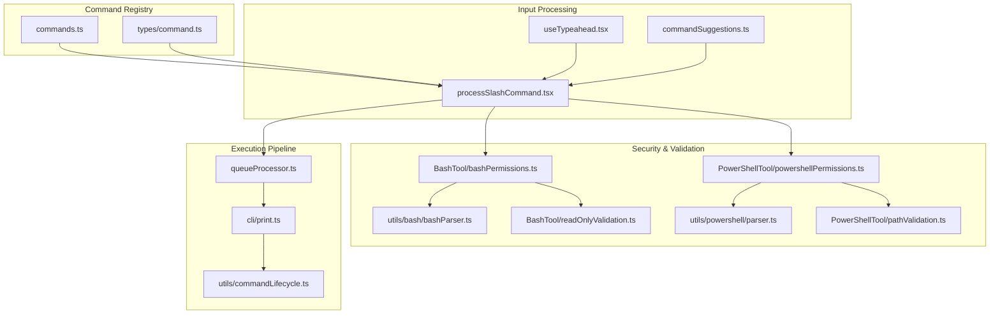
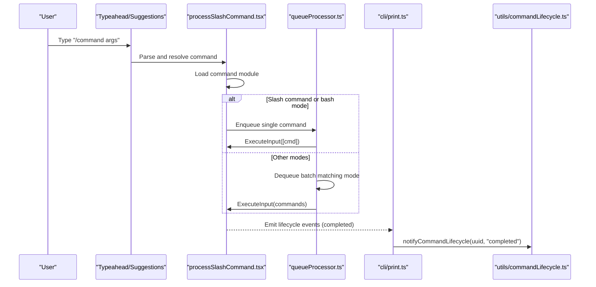
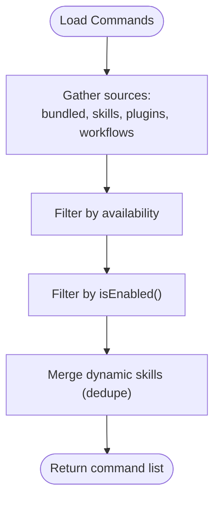
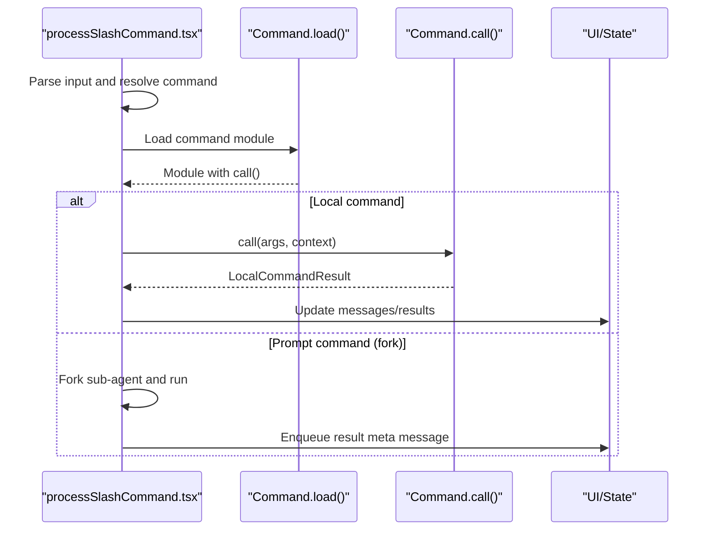
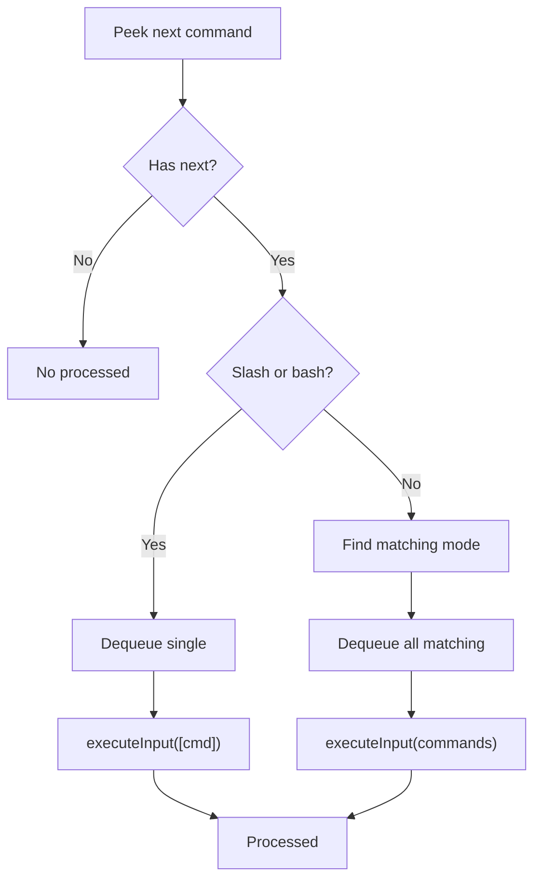
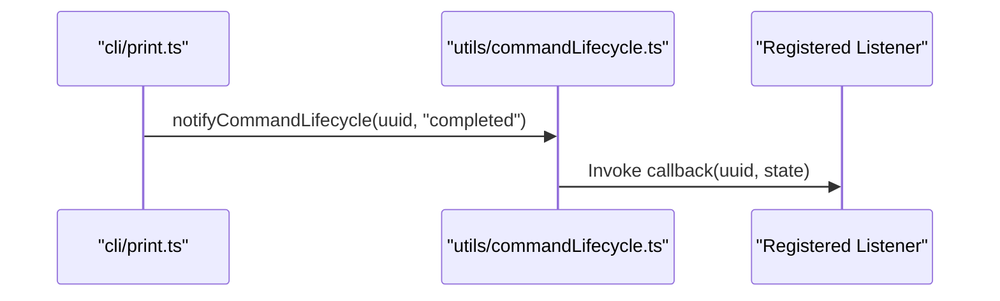
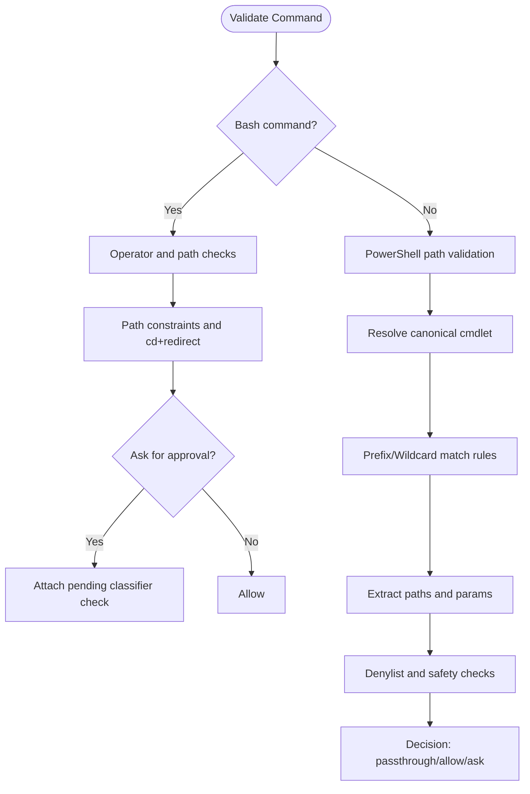
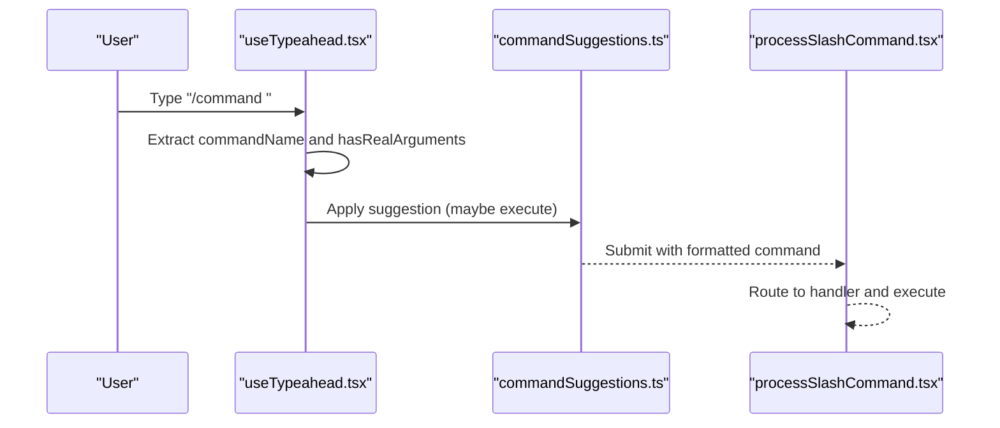
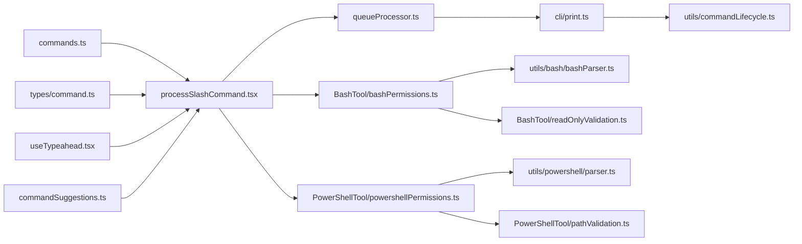

# Command Execution and Lifecycle

<cite>
**Referenced Files in This Document**
- [commands.ts](file://claude_code_src/restored-src/src/commands.ts)
- [command.ts](file://claude_code_src/restored-src/src/types/command.ts)
- [processSlashCommand.tsx](file://claude_code_src/restored-src/src/utils/processUserInput/processSlashCommand.tsx)
- [queueProcessor.ts](file://claude_code_src/restored-src/src/utils/queueProcessor.ts)
- [commandLifecycle.ts](file://claude_code_src/restored-src/src/utils/commandLifecycle.ts)
- [print.ts](file://claude_code_src/restored-src/src/cli/print.ts)
- [bashPermissions.ts](file://claude_code_src/restored-src/src/tools/BashTool/bashPermissions.ts)
- [powershellPermissions.ts](file://claude_code_src/restored-src/src/tools/PowerShellTool/powershellPermissions.ts)
- [bashParser.ts](file://claude_code_src/restored-src/src/utils/bash/bashParser.ts)
- [parser.ts](file://claude_code_src/restored-src/src/utils/powershell/parser.ts)
- [pathValidation.ts](file://claude_code_src/restored-src/src/tools/PowerShellTool/pathValidation.ts)
- [readOnlyValidation.ts](file://claude_code_src/restored-src/src/tools/BashTool/readOnlyValidation.ts)
- [commandSuggestions.ts](file://claude_code_src/restored-src/src/utils/suggestions/commandSuggestions.ts)
- [useTypeahead.tsx](file://claude_code_src/restored-src/src/hooks/useTypeahead.tsx)
</cite>

## Table of Contents
1. [Introduction](#introduction)
2. [Project Structure](#project-structure)
3. [Core Components](#core-components)
4. [Architecture Overview](#architecture-overview)
5. [Detailed Component Analysis](#detailed-component-analysis)
6. [Dependency Analysis](#dependency-analysis)
7. [Performance Considerations](#performance-considerations)
8. [Troubleshooting Guide](#troubleshooting-guide)
9. [Conclusion](#conclusion)

## Introduction
This document explains the command execution and lifecycle management system. It covers how user input is parsed, validated, routed to appropriate handlers, executed, monitored, and cleaned up. It also documents the integration with the tool system, including permission gating, and how commands interact with state management and the broader application.

## Project Structure
The command system spans several modules:
- Command registry and discovery: centralizes command definitions, availability, and filtering
- Input processing and routing: parses slash commands, prepares context, and dispatches to handlers
- Execution pipeline: queues, batch processing, and execution of commands
- Lifecycle management: event notifications for started/completed states
- Permission and validation: security checks for Bash and PowerShell commands
- CLI integration: lifecycle updates and control flows for non-interactive sessions

**Diagram sources**
- [commands.ts:258-346](file://claude_code_src/restored-src/src/commands.ts#L258-L346)
- [processSlashCommand.tsx:1-200](file://claude_code_src/restored-src/src/utils/processSlashCommand.tsx#L1-L200)
- [queueProcessor.ts:63-95](file://claude_code_src/restored-src/src/utils/queueProcessor.ts#L63-L95)
- [cli/print.ts:2807-2828](file://claude_code_src/restored-src/src/cli/print.ts#L2807-L2828)
- [commandLifecycle.ts:1-22](file://claude_code_src/restored-src/src/utils/commandLifecycle.ts#L1-L22)
- [bashPermissions.ts:1973-2076](file://claude_code_src/restored-src/src/tools/BashTool/bashPermissions.ts#L1973-L2076)
- [powershellPermissions.ts:282-328](file://claude_code_src/restored-src/src/tools/PowerShellTool/powershellPermissions.ts#L282-L328)
- [bashParser.ts:873-973](file://claude_code_src/restored-src/src/utils/bash/bashParser.ts#L873-L973)
- [parser.ts:928-968](file://claude_code_src/restored-src/src/utils/powershell/parser.ts#L928-L968)
- [pathValidation.ts:1313-1474](file://claude_code_src/restored-src/src/tools/PowerShellTool/pathValidation.ts#L1313-L1474)
- [readOnlyValidation.ts:1241-1280](file://claude_code_src/restored-src/src/tools/BashTool/readOnlyValidation.ts#L1241-L1280)
- [useTypeahead.tsx:736-744](file://claude_code_src/restored-src/src/hooks/useTypeahead.tsx#L736-L744)
- [commandSuggestions.ts:500-544](file://claude_code_src/restored-src/src/utils/suggestions/commandSuggestions.ts#L500-L544)

**Section sources**
- [commands.ts:258-346](file://claude_code_src/restored-src/src/commands.ts#L258-L346)
- [processSlashCommand.tsx:1-200](file://claude_code_src/restored-src/src/utils/processSlashCommand.tsx#L1-L200)
- [queueProcessor.ts:63-95](file://claude_code_src/restored-src/src/utils/queueProcessor.ts#L63-L95)
- [cli/print.ts:2807-2828](file://claude_code_src/restored-src/src/cli/print.ts#L2807-L2828)
- [commandLifecycle.ts:1-22](file://claude_code_src/restored-src/src/utils/commandLifecycle.ts#L1-L22)

## Core Components
- Command registry and discovery: builds the command catalog, merges skills, plugins, workflows, and built-ins; filters by availability and enablement; exposes helpers to find and format commands
- Input processing and routing: parses slash commands, constructs user messages, loads command modules, and routes to prompt or local execution paths
- Execution pipeline: queues commands, batches by mode, and executes either individually (slash and bash) or in bulk (non-slash)
- Lifecycle management: notifies listeners when commands start and complete
- Security and validation: enforces permissions and validates commands for Bash and PowerShell, including path constraints and operator handling
- CLI integration: drives lifecycle updates and control flows for non-interactive sessions

**Section sources**
- [commands.ts:476-517](file://claude_code_src/restored-src/src/commands.ts#L476-L517)
- [processSlashCommand.tsx:657-760](file://claude_code_src/restored-src/src/utils/processSlashCommand.tsx#L657-L760)
- [queueProcessor.ts:63-95](file://claude_code_src/restored-src/src/utils/queueProcessor.ts#L63-L95)
- [commandLifecycle.ts:10-21](file://claude_code_src/restored-src/src/utils/commandLifecycle.ts#L10-L21)
- [bashPermissions.ts:1973-2076](file://claude_code_src/restored-src/src/tools/BashTool/bashPermissions.ts#L1973-L2076)
- [powershellPermissions.ts:282-328](file://claude_code_src/restored-src/src/tools/PowerShellTool/powershellPermissions.ts#L282-L328)

## Architecture Overview
The command execution pipeline integrates input parsing, command routing, execution, and lifecycle notifications. It supports both interactive and non-interactive modes, with distinct handling for slash commands, local commands, and prompt-based commands.

**Diagram sources**
- [processSlashCommand.tsx:657-760](file://claude_code_src/restored-src/src/utils/processSlashCommand.tsx#L657-L760)
- [queueProcessor.ts:63-95](file://claude_code_src/restored-src/src/utils/queueProcessor.ts#L63-L95)
- [cli/print.ts:2807-2828](file://claude_code_src/restored-src/src/cli/print.ts#L2807-L2828)
- [commandLifecycle.ts:16-21](file://claude_code_src/restored-src/src/utils/commandLifecycle.ts#L16-L21)

## Detailed Component Analysis

### Command Registry and Discovery
- Builds the command catalog from bundled, plugin, skill, and workflow sources
- Applies availability and enablement filters; deduplicates dynamic skills
- Exposes helpers to find commands, format descriptions, and filter for remote/bridge-safe commands

**Diagram sources**
- [commands.ts:449-469](file://claude_code_src/restored-src/src/commands.ts#L449-L469)
- [commands.ts:476-517](file://claude_code_src/restored-src/src/commands.ts#L476-L517)

**Section sources**
- [commands.ts:258-346](file://claude_code_src/restored-src/src/commands.ts#L258-L346)
- [commands.ts:476-517](file://claude_code_src/restored-src/src/commands.ts#L476-L517)
- [commands.ts:688-719](file://claude_code_src/restored-src/src/commands.ts#L688-L719)
- [commands.ts:728-754](file://claude_code_src/restored-src/src/commands.ts#L728-L754)

### Input Parsing and Routing
- Parses slash commands, constructs user messages, and loads command modules
- Routes to prompt or local execution depending on command type
- Supports forked execution for prompt commands and handles abort/interrupt scenarios

**Diagram sources**
- [processSlashCommand.tsx:657-760](file://claude_code_src/restored-src/src/utils/processSlashCommand.tsx#L657-L760)
- [processSlashCommand.tsx:600-799](file://claude_code_src/restored-src/src/utils/processSlashCommand.tsx#L600-L799)

**Section sources**
- [processSlashCommand.tsx:657-760](file://claude_code_src/restored-src/src/utils/processSlashCommand.tsx#L657-L760)
- [processSlashCommand.tsx:600-799](file://claude_code_src/restored-src/src/utils/processSlashCommand.tsx#L600-L799)
- [command.ts:25-57](file://claude_code_src/restored-src/src/types/command.ts#L25-L57)
- [command.ts:74-98](file://claude_code_src/restored-src/src/types/command.ts#L74-L98)

### Execution Pipeline and Batching
- Single-item vs batch execution:
  - Slash commands and bash-mode commands are processed individually for isolation and progress UI
  - Non-slash commands are batched by mode to improve throughput
- Queue probing and draining are exposed for triggering processing

**Diagram sources**
- [queueProcessor.ts:63-95](file://claude_code_src/restored-src/src/utils/queueProcessor.ts#L63-L95)

**Section sources**
- [queueProcessor.ts:63-95](file://claude_code_src/restored-src/src/utils/queueProcessor.ts#L63-L95)

### Lifecycle Management
- Centralized listener for command lifecycle events
- CLI integration emits “completed” notifications for non-user/control events with uuids

**Diagram sources**
- [cli/print.ts:2807-2828](file://claude_code_src/restored-src/src/cli/print.ts#L2807-L2828)
- [commandLifecycle.ts:16-21](file://claude_code_src/restored-src/src/utils/commandLifecycle.ts#L16-L21)

**Section sources**
- [commandLifecycle.ts:10-21](file://claude_code_src/restored-src/src/utils/commandLifecycle.ts#L10-L21)
- [cli/print.ts:2807-2828](file://claude_code_src/restored-src/src/cli/print.ts#L2807-L2828)

### Security and Permission Validation
- Bash:
  - Operator-level checks and path constraint validation
  - Compound command handling and classifier gating
- PowerShell:
  - Canonicalization, prefix/wildcard matching, and path extraction
  - Denylist enforcement and expression-type safety checks

**Diagram sources**
- [bashPermissions.ts:1973-2076](file://claude_code_src/restored-src/src/tools/BashTool/bashPermissions.ts#L1973-L2076)
- [powershellPermissions.ts:282-328](file://claude_code_src/restored-src/src/tools/PowerShellTool/powershellPermissions.ts#L282-L328)
- [pathValidation.ts:1313-1474](file://claude_code_src/restored-src/src/tools/PowerShellTool/pathValidation.ts#L1313-L1474)
- [readOnlyValidation.ts:1241-1280](file://claude_code_src/restored-src/src/tools/BashTool/readOnlyValidation.ts#L1241-L1280)

**Section sources**
- [bashPermissions.ts:1973-2076](file://claude_code_src/restored-src/src/tools/BashTool/bashPermissions.ts#L1973-L2076)
- [powershellPermissions.ts:282-328](file://claude_code_src/restored-src/src/tools/PowerShellTool/powershellPermissions.ts#L282-L328)
- [pathValidation.ts:1313-1474](file://claude_code_src/restored-src/src/tools/PowerShellTool/pathValidation.ts#L1313-L1474)
- [readOnlyValidation.ts:1241-1280](file://claude_code_src/restored-src/src/tools/BashTool/readOnlyValidation.ts#L1241-L1280)

### Command Routing and User Interaction
- Typeahead and suggestions:
  - Extract command name and arguments
  - Apply suggestions and optionally submit immediately if no args expected
- Command parsing and submission:
  - Detects command boundaries and trailing spaces
  - Submits slash commands when ready

**Diagram sources**
- [useTypeahead.tsx:736-744](file://claude_code_src/restored-src/src/hooks/useTypeahead.tsx#L736-L744)
- [commandSuggestions.ts:500-544](file://claude_code_src/restored-src/src/utils/suggestions/commandSuggestions.ts#L500-L544)
- [processSlashCommand.tsx:657-760](file://claude_code_src/restored-src/src/utils/processSlashCommand.tsx#L657-L760)

**Section sources**
- [useTypeahead.tsx:736-744](file://claude_code_src/restored-src/src/hooks/useTypeahead.tsx#L736-L744)
- [commandSuggestions.ts:500-544](file://claude_code_src/restored-src/src/utils/suggestions/commandSuggestions.ts#L500-L544)
- [processSlashCommand.tsx:657-760](file://claude_code_src/restored-src/src/utils/processSlashCommand.tsx#L657-L760)

## Dependency Analysis
- Command registry depends on:
  - Command definitions and availability rules
  - Skill and plugin loaders
  - Feature flags and environment checks
- Input processing depends on:
  - Command registry for resolution
  - Typeahead and suggestions for UX
  - Tool permissions and security validators
- Execution pipeline depends on:
  - Queue processor for batching and scheduling
  - CLI for lifecycle updates and control flows
- Security validators depend on:
  - Parser utilities for AST/tokenization
  - Path and parameter extraction logic

**Diagram sources**
- [commands.ts:258-346](file://claude_code_src/restored-src/src/commands.ts#L258-L346)
- [processSlashCommand.tsx:1-200](file://claude_code_src/restored-src/src/utils/processSlashCommand.tsx#L1-L200)
- [queueProcessor.ts:63-95](file://claude_code_src/restored-src/src/utils/queueProcessor.ts#L63-L95)
- [cli/print.ts:2807-2828](file://claude_code_src/restored-src/src/cli/print.ts#L2807-L2828)
- [commandLifecycle.ts:1-22](file://claude_code_src/restored-src/src/utils/commandLifecycle.ts#L1-L22)
- [bashPermissions.ts:1973-2076](file://claude_code_src/restored-src/src/tools/BashTool/bashPermissions.ts#L1973-L2076)
- [powershellPermissions.ts:282-328](file://claude_code_src/restored-src/src/tools/PowerShellTool/powershellPermissions.ts#L282-L328)
- [bashParser.ts:873-973](file://claude_code_src/restored-src/src/utils/bash/bashParser.ts#L873-L973)
- [parser.ts:928-968](file://claude_code_src/restored-src/src/utils/powershell/parser.ts#L928-L968)
- [pathValidation.ts:1313-1474](file://claude_code_src/restored-src/src/tools/PowerShellTool/pathValidation.ts#L1313-L1474)
- [readOnlyValidation.ts:1241-1280](file://claude_code_src/restored-src/src/tools/BashTool/readOnlyValidation.ts#L1241-L1280)

**Section sources**
- [commands.ts:258-346](file://claude_code_src/restored-src/src/commands.ts#L258-L346)
- [processSlashCommand.tsx:1-200](file://claude_code_src/restored-src/src/utils/processSlashCommand.tsx#L1-L200)
- [queueProcessor.ts:63-95](file://claude_code_src/restored-src/src/utils/queueProcessor.ts#L63-L95)
- [cli/print.ts:2807-2828](file://claude_code_src/restored-src/src/cli/print.ts#L2807-L2828)
- [commandLifecycle.ts:1-22](file://claude_code_src/restored-src/src/utils/commandLifecycle.ts#L1-L22)

## Performance Considerations
- Batch execution for non-slash commands reduces overhead by grouping similar-mode commands
- Forked execution for prompt commands enables parallelism and avoids blocking the main queue
- Memoization in command loading minimizes repeated disk I/O and dynamic imports
- Early exit paths (e.g., skip results) reduce unnecessary UI updates and message processing

[No sources needed since this section provides general guidance]

## Troubleshooting Guide
- Command not found:
  - Verify availability and enablement filters; confirm command name and aliases
- Permission denials:
  - Review Bash operator and path constraints; ensure commands meet allowlist rules
  - For PowerShell, check canonicalization and parameter extraction logic
- Interrupts and aborts:
  - Abort errors surface as interruption messages; ensure abort controller is active
- CLI lifecycle issues:
  - Confirm uuid presence in non-user/control events; ensure lifecycle listener is set

**Section sources**
- [commands.ts:688-719](file://claude_code_src/restored-src/src/commands.ts#L688-L719)
- [bashPermissions.ts:1973-2076](file://claude_code_src/restored-src/src/tools/BashTool/bashPermissions.ts#L1973-L2076)
- [powershellPermissions.ts:282-328](file://claude_code_src/restored-src/src/tools/PowerShellTool/powershellPermissions.ts#L282-L328)
- [processSlashCommand.tsx:732-759](file://claude_code_src/restored-src/src/utils/processSlashCommand.tsx#L732-L759)
- [cli/print.ts:2807-2828](file://claude_code_src/restored-src/src/cli/print.ts#L2807-L2828)

## Conclusion
The command execution and lifecycle system combines a robust command registry, secure validation, efficient batching, and lifecycle notifications to deliver a responsive and safe user experience. It integrates tightly with the tool system for permissions and with state management for UI updates, supporting both interactive and non-interactive modes.