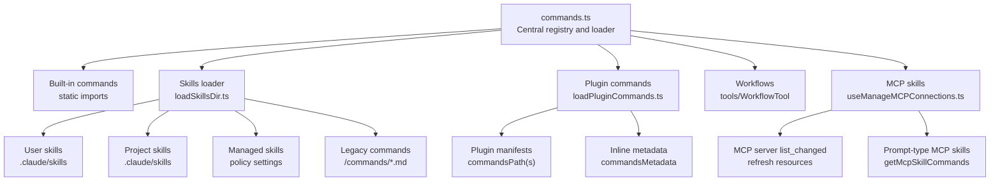
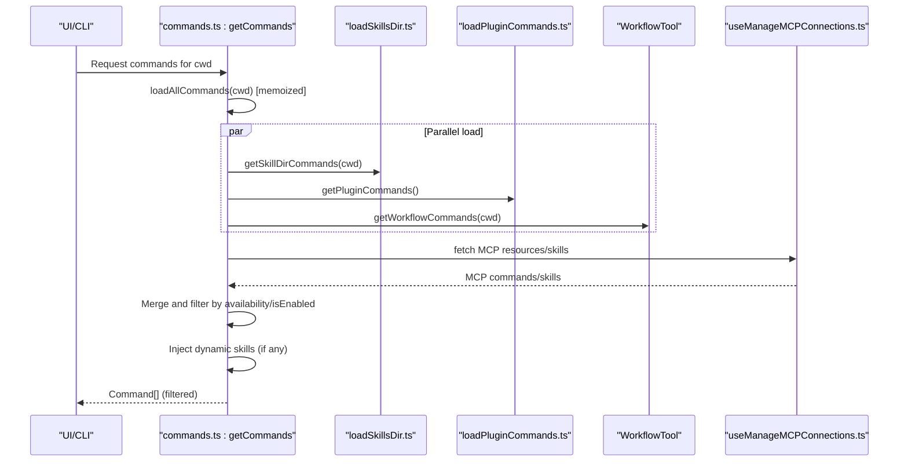
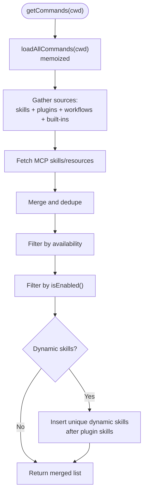
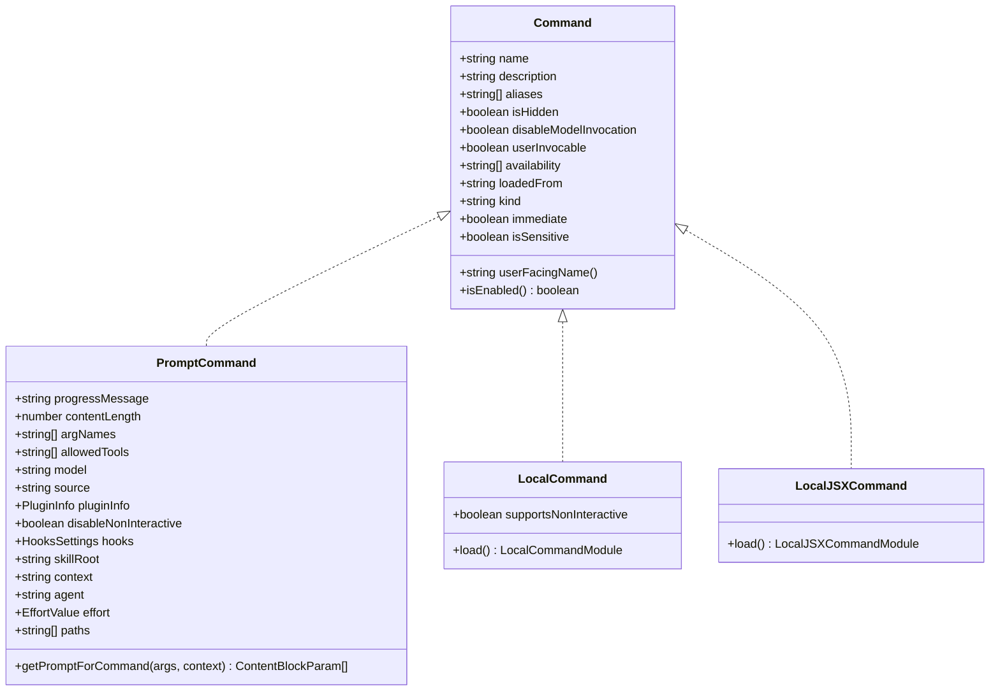
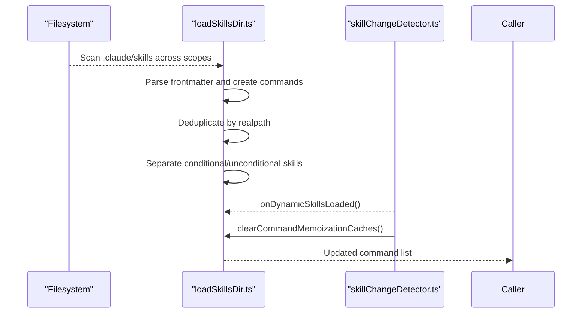
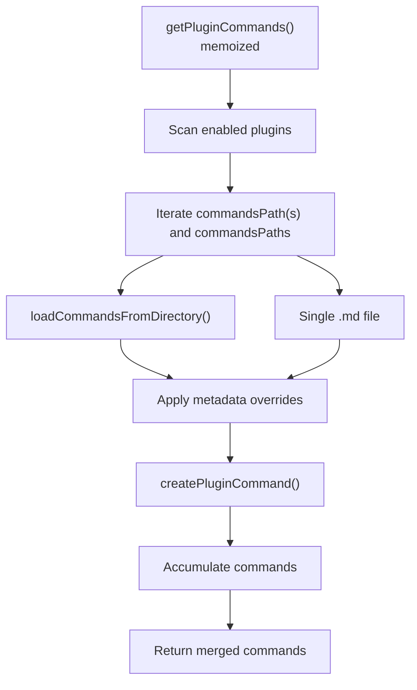
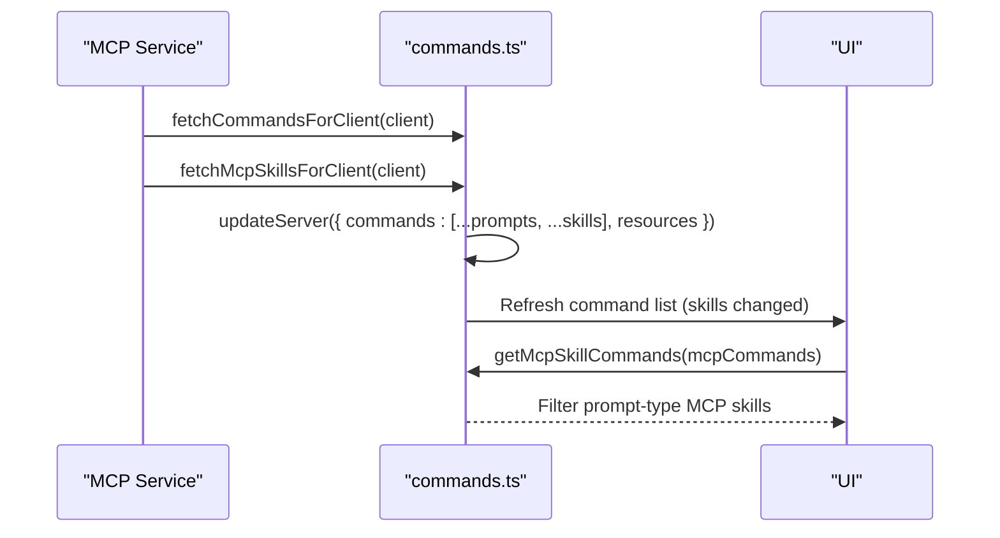
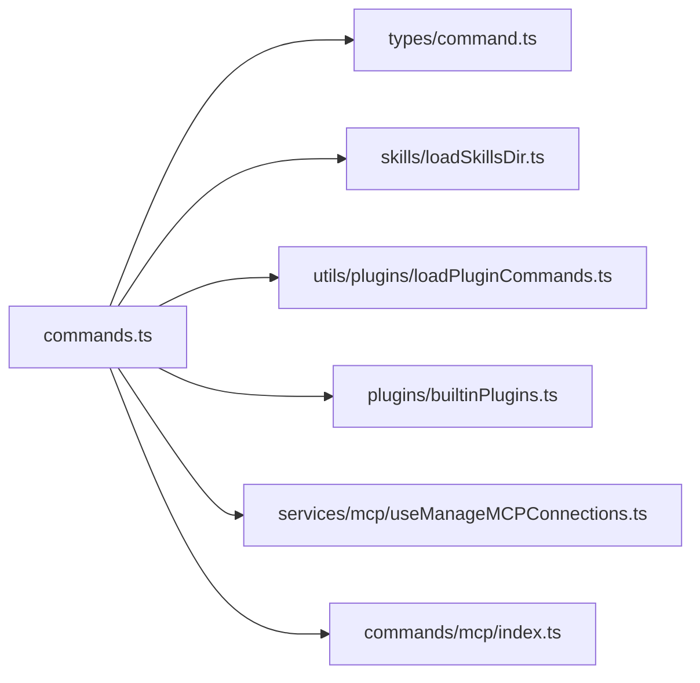

# Command Registration and Discovery

<cite>
**Referenced Files in This Document**
- [commands.ts](file://src/commands.ts)
- [command.ts](file://src/types/command.ts)
- [loadSkillsDir.ts](file://src/skills/loadSkillsDir.ts)
- [loadPluginCommands.ts](file://src/utils/plugins/loadPluginCommands.ts)
- [builtinPlugins.ts](file://src/plugins/builtinPlugins.ts)
- [index.ts](file://src/commands/mcp/index.ts)
- [useManageMCPConnections.ts](file://src/services/mcp/useManageMCPConnections.ts)
- [skillChangeDetector.ts](file://src/utils/skills/skillChangeDetector.ts)
- [init.ts](file://src/commands/init.ts)
- [init-verifiers.ts](file://src/commands/init-verifiers.ts)
</cite>

## Table of Contents
1. [Introduction](#introduction)
2. [Project Structure](#project-structure)
3. [Core Components](#core-components)
4. [Architecture Overview](#architecture-overview)
5. [Detailed Component Analysis](#detailed-component-analysis)
6. [Dependency Analysis](#dependency-analysis)
7. [Performance Considerations](#performance-considerations)
8. [Troubleshooting Guide](#troubleshooting-guide)
9. [Conclusion](#conclusion)

## Introduction
This document explains the command registration and discovery system that powers the slash command ecosystem. It covers how built-in commands, skills, plugins, workflows, and MCP servers are registered, discovered, and loaded. It also documents the command loading pipeline, memoization strategies, dynamic loading mechanisms, availability filtering, and lifecycle management. Practical examples demonstrate how to register custom commands and implement discovery hooks, and how the system integrates with state management, permission systems, and remote collaboration features.

## Project Structure
The command system is centered around a central registry and loader that aggregates commands from multiple sources:
- Built-in commands: statically imported and memoized
- Skills: discovered from user/project directories and legacy locations
- Plugins: loaded from enabled plugin manifests and inline metadata
- Workflows: dynamically created from workflow tool definitions
- MCP servers: integrated via service hooks and resource discovery

**Diagram sources**
- [commands.ts:258-469](file://src/commands.ts#L258-L469)
- [loadSkillsDir.ts:638-800](file://src/skills/loadSkillsDir.ts#L638-L800)
- [loadPluginCommands.ts:414-677](file://src/utils/plugins/loadPluginCommands.ts#L414-L677)
- [useManageMCPConnections.ts:728-753](file://src/services/mcp/useManageMCPConnections.ts#L728-L753)

**Section sources**
- [commands.ts:1-755](file://src/commands.ts#L1-L755)

## Core Components
- Central registry and loader: aggregates commands from all sources, applies availability and feature-flag filters, and exposes memoized getters for command lists and filtered subsets.
- Command type system: defines the shape of prompt, local, and local-jsx commands, including metadata like availability, visibility, and source attribution.
- Skills discovery: scans user/project/managed directories and legacy locations, parses frontmatter, and constructs command objects.
- Plugin command loader: reads plugin manifests, traverses commands directories, resolves metadata overrides, and generates command objects.
- MCP integration: discovers MCP-provided skills and resources, updates server state, and exposes prompt-type MCP skills for the model.

**Section sources**
- [commands.ts:205-222](file://src/commands.ts#L205-L222)
- [command.ts:16-217](file://src/types/command.ts#L16-L217)
- [loadSkillsDir.ts:638-800](file://src/skills/loadSkillsDir.ts#L638-L800)
- [loadPluginCommands.ts:414-677](file://src/utils/plugins/loadPluginCommands.ts#L414-L677)
- [useManageMCPConnections.ts:728-753](file://src/services/mcp/useManageMCPConnections.ts#L728-L753)

## Architecture Overview
The command system follows a layered architecture:
- Source layer: built-in, skills, plugins, workflows, MCP
- Aggregation layer: central loader merges sources and applies filters
- Memoization layer: caches expensive operations keyed by working directory or plugin state
- Presentation layer: filtered command lists for UI, autocomplete, and model invocation

**Diagram sources**
- [commands.ts:449-517](file://src/commands.ts#L449-L517)
- [loadSkillsDir.ts:638-800](file://src/skills/loadSkillsDir.ts#L638-L800)
- [loadPluginCommands.ts:414-677](file://src/utils/plugins/loadPluginCommands.ts#L414-L677)
- [useManageMCPConnections.ts:728-753](file://src/services/mcp/useManageMCPConnections.ts#L728-L753)

## Detailed Component Analysis

### Central Command Registry and Loader
- Memoized command list: COMMANDS() is memoized to avoid repeated static imports and alias computation.
- Availability filtering: meetsAvailabilityRequirement() enforces auth/provider gating before feature-flag checks.
- Dynamic skills insertion: unique dynamic skills are inserted after plugin skills but before built-in commands.
- Memoization invalidation: clearCommandMemoizationCaches() clears command caches without wiping skill caches; clearCommandsCache() clears all caches including skills.

**Diagram sources**
- [commands.ts:449-517](file://src/commands.ts#L449-L517)

**Section sources**
- [commands.ts:258-351](file://src/commands.ts#L258-L351)
- [commands.ts:417-443](file://src/commands.ts#L417-L443)
- [commands.ts:449-517](file://src/commands.ts#L449-L517)
- [commands.ts:523-539](file://src/commands.ts#L523-L539)

### Command Type System
- Command variants:
  - Prompt command: expands to model prompts; supports allowed tools, effort, paths, and user invocation flags.
  - Local command: executes locally with text or compact output.
  - Local JSX command: renders UI and defers heavy imports via load().
- Metadata: availability, description, aliases, loadedFrom, kind, immediate, sensitivity flags, and user-facing name resolution.

**Diagram sources**
- [command.ts:16-217](file://src/types/command.ts#L16-L217)

**Section sources**
- [command.ts:16-217](file://src/types/command.ts#L16-L217)

### Skills Discovery Pipeline
- Sources: managed, user, project, additional directories (--add-dir), and legacy /commands/.
- Deduplication: resolves real paths to handle symlinks and overlapping directories.
- Conditional skills: skills with paths frontmatter are stored and activated when matching files are touched.
- Dynamic skill reload: skillChangeDetector.ts listens for dynamic skills and clears memoization caches to reflect new skills.

**Diagram sources**
- [loadSkillsDir.ts:638-800](file://src/skills/loadSkillsDir.ts#L638-L800)
- [skillChangeDetector.ts:89-101](file://src/utils/skills/skillChangeDetector.ts#L89-L101)

**Section sources**
- [loadSkillsDir.ts:638-800](file://src/skills/loadSkillsDir.ts#L638-L800)
- [skillChangeDetector.ts:89-101](file://src/utils/skills/skillChangeDetector.ts#L89-L101)

### Plugin Command Loader
- Reads enabled plugins and traverses commandsPath(s) and commandsPaths.
- Handles both directory-based commands and single-file commands with metadata overrides.
- Applies plugin variable substitution and user config substitution in content.
- Supports inline content commands via manifest metadata.

**Diagram sources**
- [loadPluginCommands.ts:414-677](file://src/utils/plugins/loadPluginCommands.ts#L414-L677)
- [loadPluginCommands.ts:169-213](file://src/utils/plugins/loadPluginCommands.ts#L169-L213)
- [loadPluginCommands.ts:218-412](file://src/utils/plugins/loadPluginCommands.ts#L218-L412)

**Section sources**
- [loadPluginCommands.ts:414-677](file://src/utils/plugins/loadPluginCommands.ts#L414-L677)
- [loadPluginCommands.ts:169-213](file://src/utils/plugins/loadPluginCommands.ts#L169-L213)
- [loadPluginCommands.ts:218-412](file://src/utils/plugins/loadPluginCommands.ts#L218-L412)

### Built-in Plugin Skills
- Built-in plugins are registered at startup and exposed via getBuiltinPlugins().
- Enabled built-in plugins contribute skills as Command objects with source 'bundled'.

**Section sources**
- [builtinPlugins.ts:108-121](file://src/plugins/builtinPlugins.ts#L108-L121)
- [builtinPlugins.ts:132-160](file://src/plugins/builtinPlugins.ts#L132-L160)

### MCP Integration and Discovery
- MCP skills are fetched and refreshed upon list_changed notifications.
- Prompt-type MCP skills are filtered for inclusion in the Skill tool listings.
- The MCP command itself is a local-jsx command that manages MCP server toggles.

**Diagram sources**
- [useManageMCPConnections.ts:728-753](file://src/services/mcp/useManageMCPConnections.ts#L728-L753)
- [commands.ts:547-559](file://src/commands.ts#L547-L559)
- [index.ts:1-12](file://src/commands/mcp/index.ts#L1-L12)

**Section sources**
- [useManageMCPConnections.ts:728-753](file://src/services/mcp/useManageMCPConnections.ts#L728-L753)
- [commands.ts:547-559](file://src/commands.ts#L547-L559)
- [index.ts:1-12](file://src/commands/mcp/index.ts#L1-L12)

### Command Filtering and Availability
- Availability requirements: meetsAvailabilityRequirement() checks provider/auth contexts (e.g., claude-ai subscriber vs console user).
- Feature flags and isEnabled(): commands may be gated by feature flags or runtime isEnabled() checks.
- Remote-safe and bridge-safe commands: explicit allowlists for remote mode and bridge transport.

**Section sources**
- [commands.ts:417-443](file://src/commands.ts#L417-L443)
- [commands.ts:619-676](file://src/commands.ts#L619-L676)

### Practical Examples

#### Registering a Custom Built-in Command
- Add a new command object to the central registry and export it from the commands index.
- Example pattern: see the init command definition and its prompt generation logic.

**Section sources**
- [init.ts:226-257](file://src/commands/init.ts#L226-L257)

#### Creating a Verifier Skill
- Use the init-verifiers command to scaffold verifier skills for web, CLI, and API targets.
- The command generates skills with appropriate allowed tools and authentication guidance.

**Section sources**
- [init-verifiers.ts:1-263](file://src/commands/init-verifiers.ts#L1-L263)

#### Implementing a Discovery Hook for Dynamic Skills
- Listen for dynamic skills via skillChangeDetector.ts and clear memoization caches to refresh command lists.

**Section sources**
- [skillChangeDetector.ts:89-101](file://src/utils/skills/skillChangeDetector.ts#L89-L101)

#### Managing Command Lifecycles
- Clear caches when reloading plugins or skills:
  - clearCommandMemoizationCaches(): clears command-level memoization
  - clearCommandsCache(): clears all caches including skills and plugins

**Section sources**
- [commands.ts:523-539](file://src/commands.ts#L523-L539)

## Dependency Analysis
The command system exhibits low coupling and high cohesion:
- Central loader depends on modular loaders for skills, plugins, workflows, and MCP.
- Availability and feature-flag checks are applied consistently across sources.
- Memoization isolates expensive operations (filesystem scanning, dynamic imports) and enables incremental updates.

**Diagram sources**
- [commands.ts:1-755](file://src/commands.ts#L1-L755)
- [command.ts:1-217](file://src/types/command.ts#L1-L217)
- [loadSkillsDir.ts:1-800](file://src/skills/loadSkillsDir.ts#L1-L800)
- [loadPluginCommands.ts:1-677](file://src/utils/plugins/loadPluginCommands.ts#L1-L677)
- [builtinPlugins.ts:1-160](file://src/plugins/builtinPlugins.ts#L1-L160)
- [index.ts:1-12](file://src/commands/mcp/index.ts#L1-L12)

**Section sources**
- [commands.ts:1-755](file://src/commands.ts#L1-L755)

## Performance Considerations
- Memoization: COMMANDS(), loadAllCommands(), and skill/tool getters are memoized to avoid repeated disk I/O and dynamic imports.
- Parallel loading: Skills, plugins, workflows, and MCP resources are fetched concurrently.
- Conditional skills: Only unconditional skills are immediately available; conditional skills are stored and activated on file touch to reduce initial load.
- Cache invalidation: Use targeted cache clearing (e.g., clearCommandMemoizationCaches()) when dynamic content changes to minimize recomputation.

## Troubleshooting Guide
- Commands not appearing:
  - Verify availability requirements (meetsAvailabilityRequirement()) and feature flags (isEnabled()).
  - Ensure skills are not hidden (isHidden) or lack descriptions when required for listings.
- Dynamic skills not reflected:
  - Trigger cache invalidation via clearCommandMemoizationCaches() after adding new skills.
- Plugin commands missing:
  - Confirm plugin is enabled and commandsPath(s) are valid; check for metadata overrides and inline content.
- MCP skills not showing:
  - Ensure MCP server is connected and list_changed notifications are firing; verify prompt-type MCP skills are not disabled.

**Section sources**
- [commands.ts:417-443](file://src/commands.ts#L417-L443)
- [commands.ts:523-539](file://src/commands.ts#L523-L539)
- [loadPluginCommands.ts:414-677](file://src/utils/plugins/loadPluginCommands.ts#L414-L677)
- [useManageMCPConnections.ts:728-753](file://src/services/mcp/useManageMCPConnections.ts#L728-L753)

## Conclusion
The command registration and discovery system is designed for extensibility, performance, and correctness. By consolidating sources, applying strict availability and feature-flag filters, and leveraging memoization, it provides a responsive command ecosystem. Dynamic loading and cache invalidation keep the system fresh as skills, plugins, and MCP resources evolve. Integrations with state management, permissions, and remote collaboration ensure commands remain safe and effective across diverse environments.