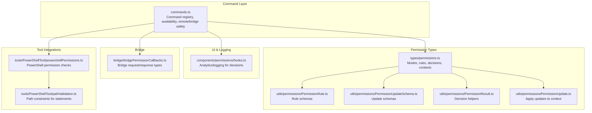
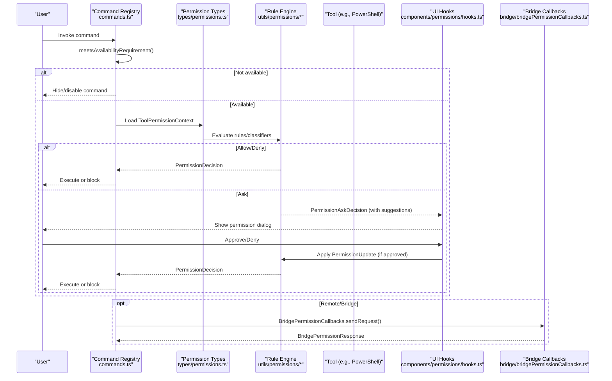
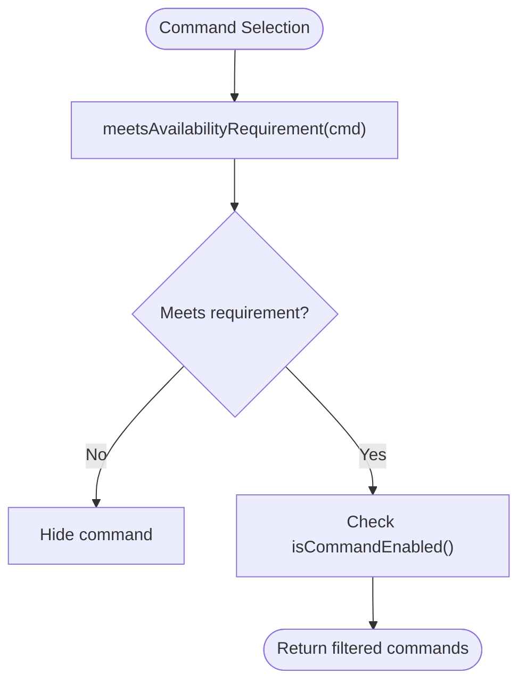
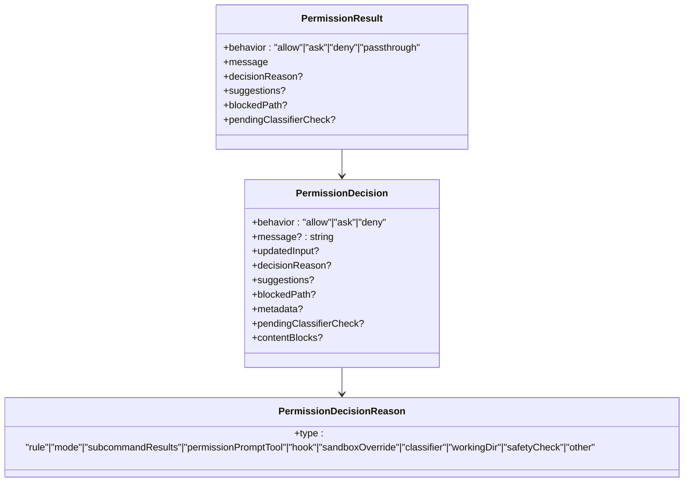
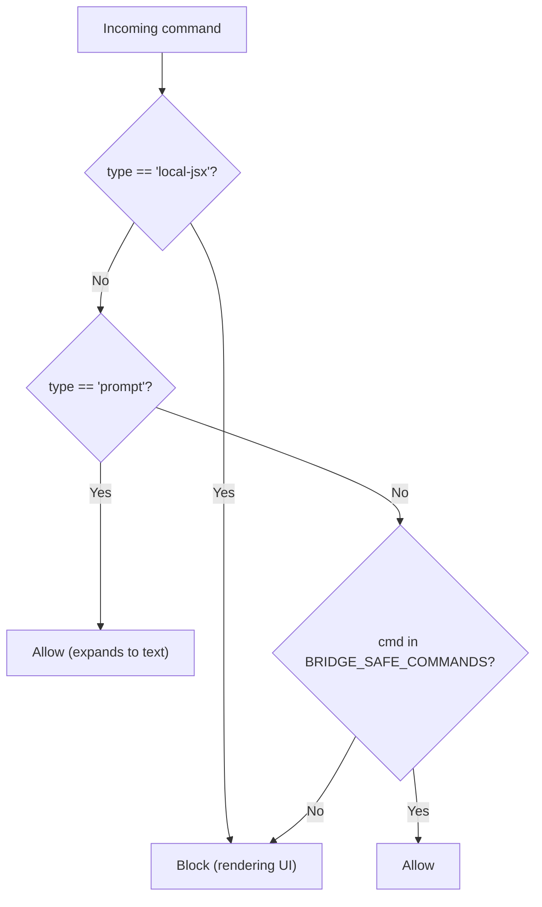
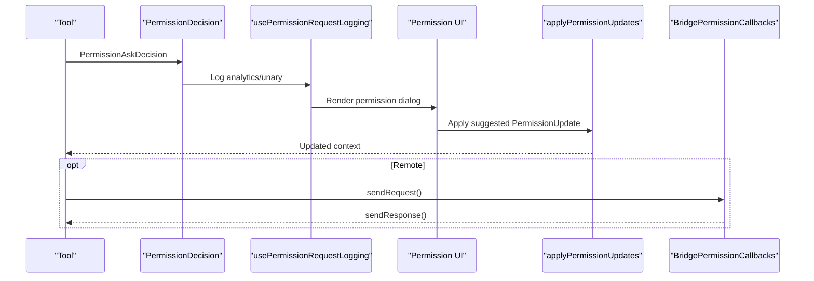
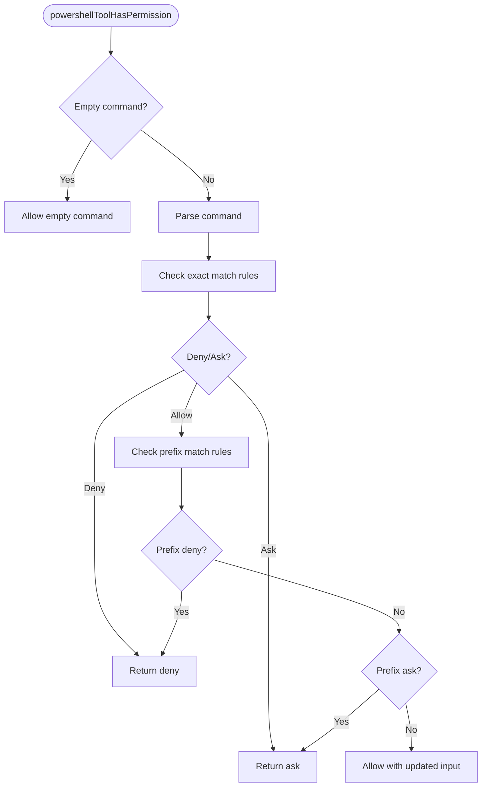
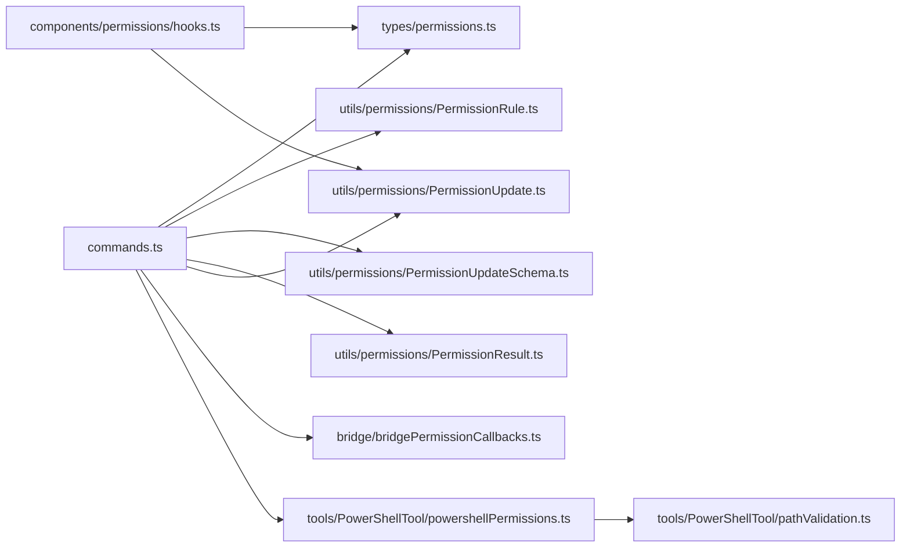

# Command Security and Permissions

<cite>
**Referenced Files in This Document**
- [commands.ts](file://claude_code_src/restored-src/src/commands.ts)
- [permissions.ts](file://claude_code_src/restored-src/src/types/permissions.ts)
- [PermissionRule.ts](file://claude_code_src/restored-src/src/utils/permissions/PermissionRule.ts)
- [PermissionUpdateSchema.ts](file://claude_code_src/restored-src/src/utils/permissions/PermissionUpdateSchema.ts)
- [PermissionResult.ts](file://claude_code_src/restored-src/src/utils/permissions/PermissionResult.ts)
- [PermissionUpdate.ts](file://claude_code_src/restored-src/src/utils/permissions/PermissionUpdate.ts)
- [hooks.ts](file://claude_code_src/restored-src/src/components/permissions/hooks.ts)
- [bridgePermissionCallbacks.ts](file://claude_code_src/restored-src/src/bridge/bridgePermissionCallbacks.ts)
- [index.ts](file://claude_code_src/restored-src/src/commands/permissions/index.ts)
- [powershellPermissions.ts](file://claude_code_src/restored-src/src/tools/PowerShellTool/powershellPermissions.ts)
- [pathValidation.ts](file://claude_code_src/restored-src/src/tools/PowerShellTool/pathValidation.ts)
</cite>

## Table of Contents
1. [Introduction](#introduction)
2. [Project Structure](#project-structure)
3. [Core Components](#core-components)
4. [Architecture Overview](#architecture-overview)
5. [Detailed Component Analysis](#detailed-component-analysis)
6. [Dependency Analysis](#dependency-analysis)
7. [Performance Considerations](#performance-considerations)
8. [Troubleshooting Guide](#troubleshooting-guide)
9. [Conclusion](#conclusion)

## Introduction
This document explains the command-level security and permission system. It covers how commands are filtered by availability and authorization, how permission decisions are evaluated, and how the system integrates with authentication, authorization frameworks, and audit/logging. It also documents bridge-safe command filtering, remote mode restrictions, and the permission request/approval workflow, including user consent handling. Practical examples show how to implement secure command handlers, configure permission requirements, and manage denials.

## Project Structure
The permission system spans several areas:
- Command registry and availability gating
- Permission types, rules, and updates
- Decision types and result handling
- UI hooks for logging and analytics
- Bridge callbacks for remote permission requests
- Tool-specific permission checks (e.g., PowerShell)
- Remote and bridge safety filters



**Diagram sources**
- [commands.ts:408-676](file://claude_code_src/restored-src/src/commands.ts#L408-L676)
- [permissions.ts:12-441](file://claude_code_src/restored-src/src/types/permissions.ts#L12-L441)
- [PermissionRule.ts:1-41](file://claude_code_src/restored-src/src/utils/permissions/PermissionRule.ts#L1-L41)
- [PermissionUpdateSchema.ts:1-79](file://claude_code_src/restored-src/src/utils/permissions/PermissionUpdateSchema.ts#L1-L79)
- [PermissionResult.ts:1-36](file://claude_code_src/restored-src/src/utils/permissions/PermissionResult.ts#L1-L36)
- [PermissionUpdate.ts:45-206](file://claude_code_src/restored-src/src/utils/permissions/PermissionUpdate.ts#L45-L206)
- [hooks.ts:1-210](file://claude_code_src/restored-src/src/components/permissions/hooks.ts#L1-L210)
- [bridgePermissionCallbacks.ts:1-44](file://claude_code_src/restored-src/src/bridge/bridgePermissionCallbacks.ts#L1-L44)
- [powershellPermissions.ts:379-514](file://claude_code_src/restored-src/src/tools/PowerShellTool/powershellPermissions.ts#L379-L514)
- [pathValidation.ts:1541-1567](file://claude_code_src/restored-src/src/tools/PowerShellTool/pathValidation.ts#L1541-L1567)

**Section sources**
- [commands.ts:408-676](file://claude_code_src/restored-src/src/commands.ts#L408-L676)
- [permissions.ts:12-441](file://claude_code_src/restored-src/src/types/permissions.ts#L12-L441)

## Core Components
- Permission modes and behaviors define how commands are evaluated (allow/deny/ask) and how the system behaves globally.
- Permission rules and updates capture allow/deny/ask policies and persist them across destinations (user/project/local/session/cli).
- Decision types unify allow/ask/deny outcomes and metadata for tracing and logging.
- Availability gating filters commands by authentication/provider requirements before enabling them.
- Remote and bridge safety sets restrict which commands can run locally or remotely.

Key responsibilities:
- Enforce availability requirements before enabling commands
- Evaluate permission rules and classifiers for tool use
- Gate remote and bridge commands to safe subsets
- Log and audit permission decisions
- Handle bridge permission requests and responses

**Section sources**
- [permissions.ts:12-441](file://claude_code_src/restored-src/src/types/permissions.ts#L12-L441)
- [PermissionRule.ts:1-41](file://claude_code_src/restored-src/src/utils/permissions/PermissionRule.ts#L1-L41)
- [PermissionUpdateSchema.ts:1-79](file://claude_code_src/restored-src/src/utils/permissions/PermissionUpdateSchema.ts#L1-L79)
- [PermissionResult.ts:1-36](file://claude_code_src/restored-src/src/utils/permissions/PermissionResult.ts#L1-L36)
- [commands.ts:408-676](file://claude_code_src/restored-src/src/commands.ts#L408-L676)

## Architecture Overview
The permission system orchestrates command-level security across three planes:
- Command plane: availability gating and safety filters
- Permission plane: rule evaluation, classifier checks, and decision generation
- Integration plane: UI logging, bridge callbacks, and tool integrations



**Diagram sources**
- [commands.ts:408-676](file://claude_code_src/restored-src/src/commands.ts#L408-L676)
- [permissions.ts:12-441](file://claude_code_src/restored-src/src/types/permissions.ts#L12-L441)
- [PermissionUpdate.ts:45-206](file://claude_code_src/restored-src/src/utils/permissions/PermissionUpdate.ts#L45-L206)
- [hooks.ts:1-210](file://claude_code_src/restored-src/src/components/permissions/hooks.ts#L1-L210)
- [bridgePermissionCallbacks.ts:1-44](file://claude_code_src/restored-src/src/bridge/bridgePermissionCallbacks.ts#L1-L44)

## Detailed Component Analysis

### Command Availability and Authorization
- Availability requirements filter commands by authentication/provider status before enabling them. This runs prior to feature flags and command enablement checks.
- Provider gating supports Claude AI subscriber and console API key users, excluding third-party providers and custom base URLs.



**Diagram sources**
- [commands.ts:408-443](file://claude_code_src/restored-src/src/commands.ts#L408-L443)

**Section sources**
- [commands.ts:408-443](file://claude_code_src/restored-src/src/commands.ts#L408-L443)

### Permission Modes, Rules, and Updates
- Modes: global operational modes (e.g., accept edits, bypass permissions, default, don’t ask, plan, auto) influence automatic handling.
- Rules: allow/deny/ask rules scoped by source (user, project, local, flag, policy, CLI, command, session).
- Updates: add/replace/remove rules, set mode, manage additional working directories, and persist to destinations.

```mermaid
classDiagram
class PermissionMode {
+modes : string[]
}
class PermissionRule {
+source : string
+behavior : "allow"|"deny"|"ask"
+value : {toolName, ruleContent?}
}
class PermissionUpdate {
+type : "addRules"|"replaceRules"|"removeRules"|"setMode"|"addDirectories"|"removeDirectories"
+destination : string
+rules? : RuleValue[]
+behavior? : "allow"|"deny"|"ask"
+mode? : string
+directories? : string[]
}
PermissionMode <.. PermissionUpdate : "applies to"
PermissionRule --> PermissionUpdate : "used by"
```

**Diagram sources**
- [permissions.ts:12-132](file://claude_code_src/restored-src/src/types/permissions.ts#L12-L132)
- [PermissionRule.ts:19-40](file://claude_code_src/restored-src/src/utils/permissions/PermissionRule.ts#L19-L40)
- [PermissionUpdateSchema.ts:24-79](file://claude_code_src/restored-src/src/utils/permissions/PermissionUpdateSchema.ts#L24-L79)

**Section sources**
- [permissions.ts:12-132](file://claude_code_src/restored-src/src/types/permissions.ts#L12-L132)
- [PermissionRule.ts:19-40](file://claude_code_src/restored-src/src/utils/permissions/PermissionRule.ts#L19-L40)
- [PermissionUpdateSchema.ts:24-79](file://claude_code_src/restored-src/src/utils/permissions/PermissionUpdateSchema.ts#L24-L79)

### Permission Decisions and Classifier Integration
- Decisions unify allow/ask/deny outcomes with metadata (reasons, suggestions, content blocks).
- Classifier integration enables asynchronous allow checks and auto-approval for sensitive contexts.
- Decision reasons enumerate rule, mode, subcommand results, hook, sandbox override, classifier, working directory, safety checks, and other categories.



**Diagram sources**
- [permissions.ts:152-325](file://claude_code_src/restored-src/src/types/permissions.ts#L152-L325)

**Section sources**
- [permissions.ts:152-325](file://claude_code_src/restored-src/src/types/permissions.ts#L152-L325)

### Remote and Bridge Safety Filters
- Remote-safe commands: a curated set of local-only commands safe for remote mode (no local filesystem/git/shell/IDE dependencies).
- Bridge-safe commands: a curated set of local commands safe to execute when received over the Remote Control bridge; prompt-type commands are allowed by construction; JSX commands are blocked; exact allowlist governs local commands.
- isBridgeSafeCommand determines whether a command is safe to execute from bridge input.



**Diagram sources**
- [commands.ts:619-676](file://claude_code_src/restored-src/src/commands.ts#L619-L676)

**Section sources**
- [commands.ts:619-676](file://claude_code_src/restored-src/src/commands.ts#L619-L676)

### Permission Request and Approval Workflow
- When a decision reaches “ask,” the UI logs the event, shows a permission dialog, and applies suggested updates upon approval.
- Bridge permission callbacks support sending requests, receiving responses, and cancellation.



**Diagram sources**
- [hooks.ts:101-210](file://claude_code_src/restored-src/src/components/permissions/hooks.ts#L101-L210)
- [PermissionUpdate.ts:196-206](file://claude_code_src/restored-src/src/utils/permissions/PermissionUpdate.ts#L196-L206)
- [bridgePermissionCallbacks.ts:10-44](file://claude_code_src/restored-src/src/bridge/bridgePermissionCallbacks.ts#L10-L44)

**Section sources**
- [hooks.ts:101-210](file://claude_code_src/restored-src/src/components/permissions/hooks.ts#L101-L210)
- [PermissionUpdate.ts:196-206](file://claude_code_src/restored-src/src/utils/permissions/PermissionUpdate.ts#L196-L206)
- [bridgePermissionCallbacks.ts:10-44](file://claude_code_src/restored-src/src/bridge/bridgePermissionCallbacks.ts#L10-L44)

### Tool-Specific Permission Checks (PowerShell)
- Exact-match and prefix-match rule evaluation for PowerShell commands.
- Security checks run before parsing to ensure deny rules apply even on parse failure.
- Path constraints enforced across statements with deny precedence over ask.



**Diagram sources**
- [powershellPermissions.ts:639-668](file://claude_code_src/restored-src/src/tools/PowerShellTool/powershellPermissions.ts#L639-L668)
- [powershellPermissions.ts:379-514](file://claude_code_src/restored-src/src/tools/PowerShellTool/powershellPermissions.ts#L379-L514)

**Section sources**
- [powershellPermissions.ts:379-514](file://claude_code_src/restored-src/src/tools/PowerShellTool/powershellPermissions.ts#L379-L514)
- [powershellPermissions.ts:639-668](file://claude_code_src/restored-src/src/tools/PowerShellTool/powershellPermissions.ts#L639-L668)
- [pathValidation.ts:1541-1567](file://claude_code_src/restored-src/src/tools/PowerShellTool/pathValidation.ts#L1541-L1567)

### Permissions Management Command
- The permissions command exposes a UI to manage allow/deny rules and related settings.

**Section sources**
- [index.ts:1-12](file://claude_code_src/restored-src/src/commands/permissions/index.ts#L1-L12)

## Dependency Analysis
- commands.ts depends on availability checks and safety filters to gate commands before execution.
- Permission types and schemas are decoupled from implementations to avoid circular dependencies.
- UI hooks rely on permission results to log analytics and track user interactions.
- Bridge callbacks integrate remote permission flows with local decision-making.



**Diagram sources**
- [commands.ts:408-676](file://claude_code_src/restored-src/src/commands.ts#L408-L676)
- [permissions.ts:12-441](file://claude_code_src/restored-src/src/types/permissions.ts#L12-L441)
- [PermissionRule.ts:1-41](file://claude_code_src/restored-src/src/utils/permissions/PermissionRule.ts#L1-L41)
- [PermissionUpdateSchema.ts:1-79](file://claude_code_src/restored-src/src/utils/permissions/PermissionUpdateSchema.ts#L1-L79)
- [PermissionResult.ts:1-36](file://claude_code_src/restored-src/src/utils/permissions/PermissionResult.ts#L1-L36)
- [PermissionUpdate.ts:45-206](file://claude_code_src/restored-src/src/utils/permissions/PermissionUpdate.ts#L45-L206)
- [hooks.ts:1-210](file://claude_code_src/restored-src/src/components/permissions/hooks.ts#L1-L210)
- [bridgePermissionCallbacks.ts:1-44](file://claude_code_src/restored-src/src/bridge/bridgePermissionCallbacks.ts#L1-L44)
- [powershellPermissions.ts:379-514](file://claude_code_src/restored-src/src/tools/PowerShellTool/powershellPermissions.ts#L379-L514)
- [pathValidation.ts:1541-1567](file://claude_code_src/restored-src/src/tools/PowerShellTool/pathValidation.ts#L1541-L1567)

**Section sources**
- [commands.ts:408-676](file://claude_code_src/restored-src/src/commands.ts#L408-L676)
- [permissions.ts:12-441](file://claude_code_src/restored-src/src/types/permissions.ts#L12-L441)
- [hooks.ts:1-210](file://claude_code_src/restored-src/src/components/permissions/hooks.ts#L1-L210)

## Performance Considerations
- Memoization of command loading reduces repeated disk I/O and dynamic imports.
- Asynchronous classifier checks avoid blocking user interactions while maintaining safety.
- Two-pass path validation ensures deny rules take precedence without redundant user prompts.

[No sources needed since this section provides general guidance]

## Troubleshooting Guide
Common scenarios and resolutions:
- Command not visible: Verify availability requirements (authentication/provider) and feature flags.
- Unexpected permission prompts: Review rule sources and behaviors; confirm suggestions and working directory scope.
- Bridge permission failures: Ensure bridge callbacks are wired and request/response types are validated.
- PowerShell command blocked: Confirm exact/prefix rules and path constraints; check deny rules take precedence.

**Section sources**
- [commands.ts:408-443](file://claude_code_src/restored-src/src/commands.ts#L408-L443)
- [permissions.ts:152-325](file://claude_code_src/restored-src/src/types/permissions.ts#L152-L325)
- [bridgePermissionCallbacks.ts:29-44](file://claude_code_src/restored-src/src/bridge/bridgePermissionCallbacks.ts#L29-L44)
- [pathValidation.ts:1541-1567](file://claude_code_src/restored-src/src/tools/PowerShellTool/pathValidation.ts#L1541-L1567)

## Conclusion
The command security and permission system enforces a layered approach: availability gating, permission rules and modes, classifier-driven decisions, and strict remote/bridge safety filters. It integrates tightly with UI logging and analytics, supports bridge-based permission flows, and provides robust tool-specific checks. By configuring rules, modes, and working directories appropriately, developers can implement secure command handlers while preserving usability and transparency.