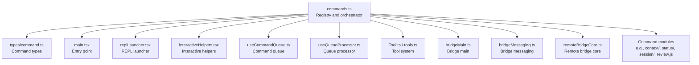
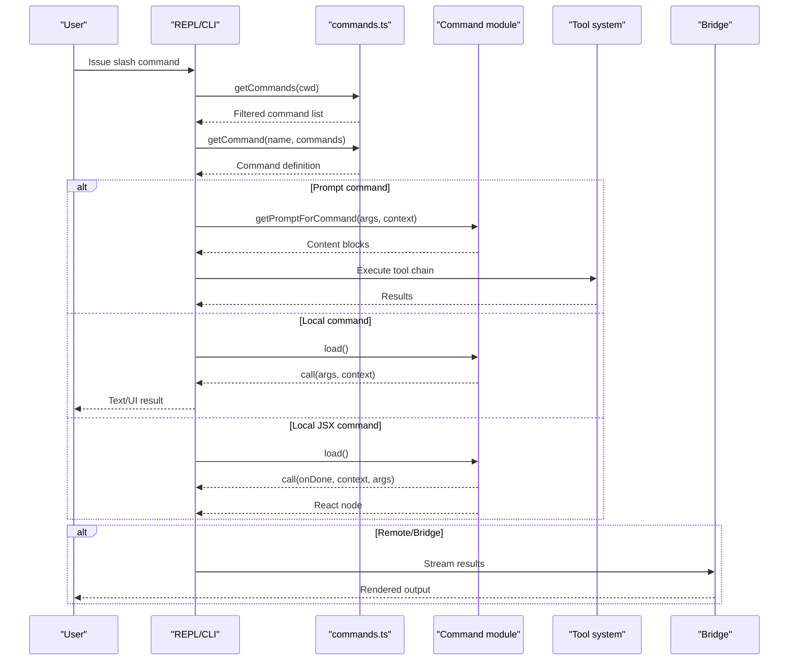
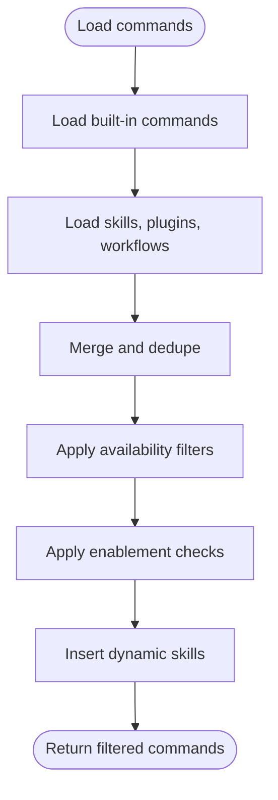
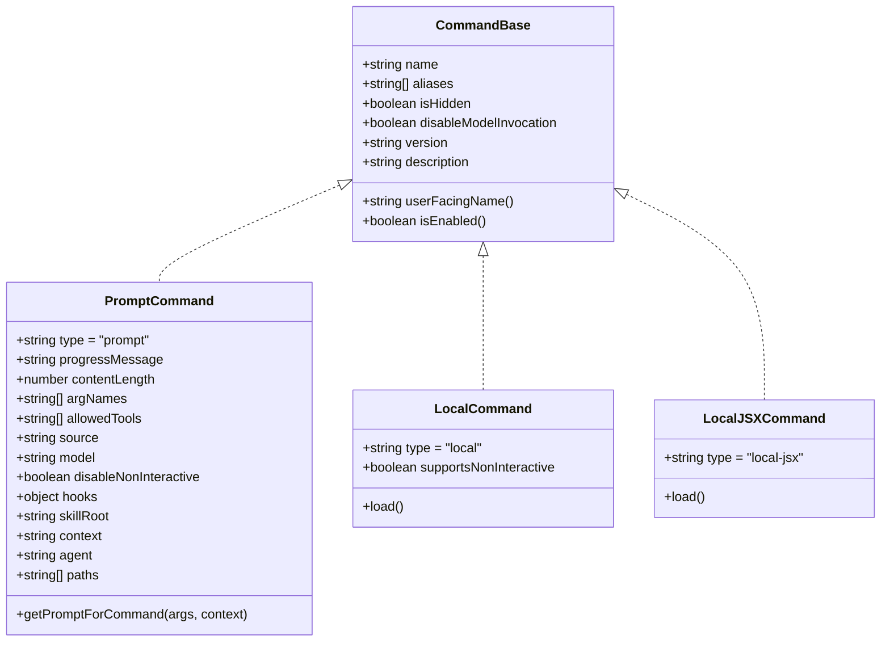
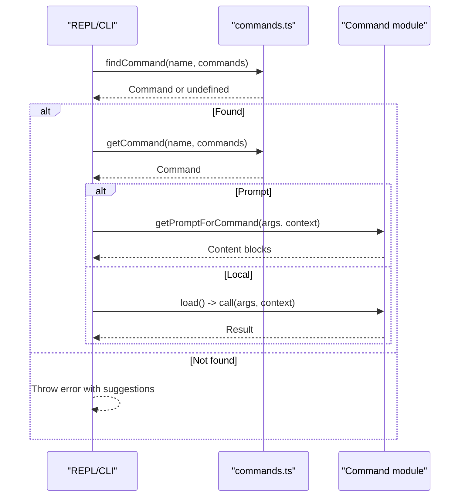
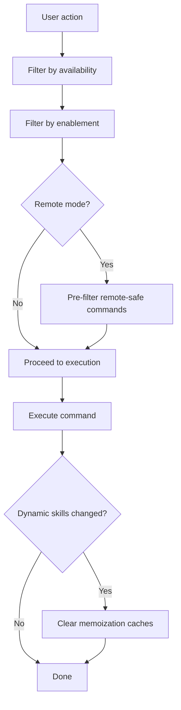
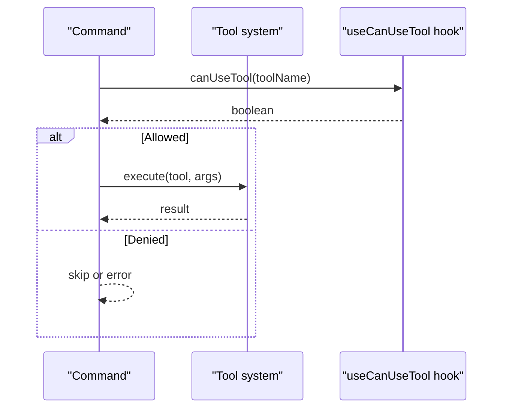
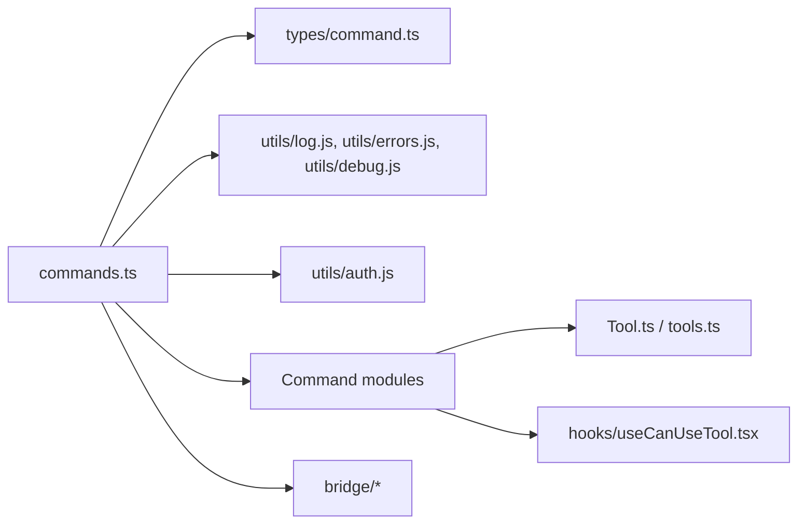

# Command System Architecture

<cite>
**Referenced Files in This Document**
- [commands.ts](file://restored-src/src/commands.ts)
- [command.ts](file://restored-src/src/types/command.ts)
- [main.tsx](file://restored-src/src/main.tsx)
- [replLauncher.tsx](file://restored-src/src/replLauncher.tsx)
- [interactiveHelpers.tsx](file://restored-src/src/interactiveHelpers.tsx)
- [useCommandQueue.ts](file://restored-src/src/hooks/useCommandQueue.ts)
- [useQueueProcessor.ts](file://restored-src/src/hooks/useQueueProcessor.ts)
- [useCanUseTool.tsx](file://restored-src/src/hooks/useCanUseTool.tsx)
- [Tool.ts](file://restored-src/src/Tool.ts)
- [tools.ts](file://restored-src/src/tools.ts)
- [bridgeMain.ts](file://restored-src/src/bridge/bridgeMain.ts)
- [bridgeMessaging.ts](file://restored-src/src/bridge/bridgeMessaging.ts)
- [remoteBridgeCore.ts](file://restored-src/src/bridge/remoteBridgeCore.ts)
- [remoteControlServer/index.js](file://restored-src/src/commands/remoteControlServer/index.js)
- [context/index.js](file://restored-src/src/commands/context/index.js)
- [status/index.js](file://restored-src/src/commands/status/index.js)
- [session/index.js](file://restored-src/src/commands/session/index.js)
- [review.js](file://restored-src/src/commands/review.js)
- [init.ts](file://restored-src/src/commands/init.ts)
- [help/index.ts](file://restored-src/src/commands/help/index.ts)
- [clear/index.js](file://restored-src/src/commands/clear/index.js)
- [theme/index.js](file://restored-src/src/commands/theme/index.js)
- [keybindings/index.js](file://restored-src/src/commands/keybindings/index.js)
- [tasks/index.js](file://restored-src/src/commands/tasks/index.js)
- [files/index.js](file://restored-src/src/commands/files/index.js)
- [stats/index.js](file://restored-src/src/commands/stats/index.js)
- [usage/index.js](file://restored-src/src/commands/usage/index.js)
- [cost/index.js](file://restored-src/src/commands/cost/index.js)
- [copy/index.js](file://restored-src/src/commands/copy/index.js)
- [feedback/index.js](file://restored-src/src/commands/feedback/index.js)
- [thinkback/index.js](file://restored-src/src/commands/thinkback/index.js)
- [thinkback-play/index.js](file://restored-src/src/commands/thinkback-play/index.js)
- [permissions/index.js](file://restored-src/src/commands/permissions/index.js)
- [plan/index.js](file://restored-src/src/commands/plan/index.js)
- [privacy-settings/index.js](file://restored-src/src/commands/privacy-settings/index.js)
- [hooks/index.js](file://restored-src/src/commands/hooks/index.js)
- [branch/index.js](file://restored-src/src/commands/branch/index.js)
- [agents/index.js](file://restored-src/src/commands/agents/index.js)
- [plugin/index.js](file://restored-src/src/commands/plugin/index.js)
- [reload-plugins/index.js](file://restored-src/src/commands/reload-plugins/index.js)
- [rewind/index.js](file://restored-src/src/commands/rewind/index.js)
- [heapdump/index.js](file://restored-src/src/commands/heapdump/index.js)
- [mock-limits/index.js](file://restored-src/src/commands/mock-limits/index.js)
- [bridge-kick.js](file://restored-src/src/commands/bridge-kick.js)
- [version.js](file://restored-src/src/commands/version.js)
- [summary/index.js](file://restored-src/src/commands/summary/index.js)
- [teleport/index.js](file://restored-src/src/commands/teleport/index.js)
- [ant-trace/index.js](file://restored-src/src/commands/ant-trace/index.js)
- [perf-issue/index.js](file://restored-src/src/commands/perf-issue/index.js)
- [env/index.js](file://restored-src/src/commands/env/index.js)
- [oauth-refresh/index.js](file://restored-src/src/commands/oauth-refresh/index.js)
- [debug-tool-call/index.js](file://restored-src/src/commands/debug-tool-call/index.js)
- [advisor.ts](file://restored-src/src/commands/advisor.ts)
- [security-review.ts](file://restored-src/src/commands/security-review.ts)
- [bughunter/index.js](file://restored-src/src/commands/bughunter/index.js)
- [terminalSetup/index.js](file://restored-src/src/commands/terminalSetup/index.js)
- [rate-limit-options/index.js](file://restored-src/src/commands/rate-limit-options/index.js)
- [statusline.js](file://restored-src/src/commands/statusline.js)
- [effort/index.js](file://restored-src/src/commands/effort/index.js)
- [output-style/index.js](file://restored-src/src/commands/output-style/index.js)
- [remote-env/index.js](file://restored-src/src/commands/remote-env/index.js)
- [upgrade/index.js](file://restored-src/src/commands/upgrade/index.js)
- [extra-usage/index.js](file://restored-src/src/commands/extra-usage/index.js)
- [passes/index.js](file://restored-src/src/commands/passes/index.js)
- [sticker/index.js](file://restored-src/src/commands/stickers/index.js)
- [mobile/index.js](file://restored-src/src/commands/mobile/index.js)
- [vim/index.js](file://restored-src/src/commands/vim/index.js)
- [fast/index.js](file://restored-src/src/commands/fast/index.js)
- [memory/index.js](file://restored-src/src/commands/memory/index.js)
- [doctor/index.js](file://restored-src/src/commands/doctor/index.js)
- [diff/index.js](file://restored-src/src/commands/diff/index.js)
- [ctx_viz/index.js](file://restored-src/src/commands/ctx_viz/index.js)
- [exit/index.js](file://restored-src/src/commands/exit/index.js)
- [export/index.js](file://restored-src/src/commands/export/index.js)
- [sandbox-toggle/index.js](file://restored-src/src/commands/sandbox-toggle/index.js)
- [model/index.js](file://restored-src/src/commands/model/index.js)
- [tag/index.js](file://restored-src/src/commands/tag/index.js)
- [onboarding/index.js](file://restored-src/src/commands/onboarding/index.js)
- [pr_comments/index.js](file://restored-src/src/commands/pr_comments/index.js)
- [release-notes/index.js](file://restored-src/src/commands/release-notes/index.js)
- [rename/index.js](file://restored-src/src/commands/rename/index.js)
- [resume/index.js](file://restored-src/src/commands/resume/index.js)
- [share/index.js](file://restored-src/src/commands/share/index.js)
- [skills/index.js](file://restored-src/src/commands/skills/index.js)
- [login/index.js](file://restored-src/src/commands/login/index.js)
- [logout/index.js](file://restored-src/src/commands/logout/index.js)
- [install-github-app/index.js](file://restored-src/src/commands/install-github-app/index.js)
- [install-slack-app/index.js](file://restored-src/src/commands/install-slack-app/index.js)
- [break-cache/index.js](file://restored-src/src/commands/break-cache/index.js)
- [mcp/index.js](file://restored-src/src/commands/mcp/index.js)
- [ide/index.js](file://restored-src/src/commands/ide/index.js)
- [add-dir/index.js](file://restored-src/src/commands/add-dir/index.js)
- [autofix-pr/index.js](file://restored-src/src/commands/autofix-pr/index.js)
- [backfill-sessions/index.js](file://restored-src/src/commands/backfill-sessions/index.js)
- [btw/index.js](file://restored-src/src/commands/btw/index.js)
- [good-claude/index.js](file://restored-src/src/commands/good-claude/index.js)
- [issue/index.js](file://restored-src/src/commands/issue/index.js)
- [color/index.js](file://restored-src/src/commands/color/index.js)
- [compact/index.js](file://restored-src/src/commands/compact/index.js)
- [config/index.js](file://restored-src/src/commands/config/index.js)
- [ctx_viz/index.js](file://restored-src/src/commands/ctx_viz/index.js)
- [debug-tool-call/index.js](file://restored-src/src/commands/debug-tool-call/index.js)
- [proactive.js](file://restored-src/src/commands/proactive.js)
- [brief.js](file://restored-src/src/commands/brief.js)
- [assistant/index.js](file://restored-src/src/commands/assistant/index.js)
- [bridge/index.js](file://restored-src/src/commands/bridge/index.js)
- [remoteControlServer/index.js](file://restored-src/src/commands/remoteControlServer/index.js)
- [voice/index.js](file://restored-src/src/commands/voice/index.js)
- [force-snip.js](file://restored-src/src/commands/force-snip.js)
- [workflows/index.js](file://restored-src/src/commands/workflows/index.js)
- [remote-setup/index.js](file://restored-src/src/commands/remote-setup/index.js)
- [subscribe-pr.js](file://restored-src/src/commands/subscribe-pr.js)
- [ultraplan.js](file://restored-src/src/commands/ultraplan.js)
- [torch.js](file://restored-src/src/commands/torch.js)
- [peers/index.js](file://restored-src/src/commands/peers/index.js)
- [fork/index.js](file://restored-src/src/commands/fork/index.js)
- [buddy/index.js](file://restored-src/src/commands/buddy/index.js)
- [reset-limits/index.js](file://restored-src/src/commands/reset-limits/index.js)
- [extra-usage/index.js](file://restored-src/src/commands/extra-usage/index.js)
- [logError](file://restored-src/src/utils/log.js)
- [toError](file://restored-src/src/utils/errors.js)
- [logForDebugging](file://restored-src/src/utils/debug.js)
- [isUsing3PServices](file://restored-src/src/utils/auth.js)
- [isClaudeAISubscriber](file://restored-src/src/utils/auth.js)
</cite>

## Table of Contents
1. [Introduction](#introduction)
2. [Project Structure](#project-structure)
3. [Core Components](#core-components)
4. [Architecture Overview](#architecture-overview)
5. [Detailed Component Analysis](#detailed-component-analysis)
6. [Dependency Analysis](#dependency-analysis)
7. [Performance Considerations](#performance-considerations)
8. [Troubleshooting Guide](#troubleshooting-guide)
9. [Conclusion](#conclusion)
10. [Appendices](#appendices)

## Introduction
This document explains the command system architecture used by the Claude Code Python IDE. It focuses on how commands are defined, registered, validated, routed, and executed—covering both CLI-style slash commands and interactive commands. It also documents the relationship between commands and the tool system, permission gating, remote collaboration safety, and performance optimizations.

## Project Structure
The command system centers around a single registry that aggregates built-in commands, skills, plugins, and workflows, and exposes filtering and lookup utilities. The core files are:
- Command registry and orchestration: [commands.ts](file://restored-src/src/commands.ts)
- Command type definitions: [command.ts](file://restored-src/src/types/command.ts)
- Application entry points that consume commands: [main.tsx](file://restored-src/src/main.tsx), [replLauncher.tsx](file://restored-src/src/replLauncher.tsx)
- Interactive helpers and queues: [interactiveHelpers.tsx](file://restored-src/src/interactiveHelpers.tsx), [useCommandQueue.ts](file://restored-src/src/hooks/useCommandQueue.ts), [useQueueProcessor.ts](file://restored-src/src/hooks/useQueueProcessor.ts)
- Tool integration: [Tool.ts](file://restored-src/src/Tool.ts), [tools.ts](file://restored-src/src/tools.ts)
- Bridge and remote execution: [bridgeMain.ts](file://restored-src/src/bridge/bridgeMain.ts), [bridgeMessaging.ts](file://restored-src/src/bridge/bridgeMessaging.ts), [remoteBridgeCore.ts](file://restored-src/src/bridge/remoteBridgeCore.ts)
- Representative command implementations: [context/index.js](file://restored-src/src/commands/context/index.js), [status/index.js](file://restored-src/src/commands/status/index.js), [session/index.js](file://restored-src/src/commands/session/index.js), [review.js](file://restored-src/src/commands/review.js), [init.ts](file://restored-src/src/commands/init.ts), [help/index.ts](file://restored-src/src/commands/help/index.ts), [clear/index.js](file://restored-src/src/commands/clear/index.js), [theme/index.js](file://restored-src/src/commands/theme/index.js), [keybindings/index.js](file://restored-src/src/commands/keybindings/index.js), [tasks/index.js](file://restored-src/src/commands/tasks/index.js), [files/index.js](file://restored-src/src/commands/files/index.js), [stats/index.js](file://restored-src/src/commands/stats/index.js), [usage/index.js](file://restored-src/src/commands/usage/index.js), [cost/index.js](file://restored-src/src/commands/cost/index.js), [copy/index.js](file://restored-src/src/commands/copy/index.js), [feedback/index.js](file://restored-src/src/commands/feedback/index.js), [thinkback/index.js](file://restored-src/src/commands/thinkback/index.js), [thinkback-play/index.js](file://restored-src/src/commands/thinkback-play/index.js), [permissions/index.js](file://restored-src/src/commands/permissions/index.js), [plan/index.js](file://restored-src/src/commands/plan/index.js), [privacy-settings/index.js](file://restored-src/src/commands/privacy-settings/index.js), [hooks/index.js](file://restored-src/src/commands/hooks/index.js), [branch/index.js](file://restored-src/src/commands/branch/index.js), [agents/index.js](file://restored-src/src/commands/agents/index.js), [plugin/index.js](file://restored-src/src/commands/plugin/index.js), [reload-plugins/index.js](file://restored-src/src/commands/reload-plugins/index.js), [rewind/index.js](file://restored-src/src/commands/rewind/index.js), [heapdump/index.js](file://restored-src/src/commands/heapdump/index.js), [mock-limits/index.js](file://restored-src/src/commands/mock-limits/index.js), [bridge-kick.js](file://restored-src/src/commands/bridge-kick.js), [version.js](file://restored-src/src/commands/version.js), [summary/index.js](file://restored-src/src/commands/summary/index.js), [teleport/index.js](file://restored-src/src/commands/teleport/index.js), [ant-trace/index.js](file://restored-src/src/commands/ant-trace/index.js), [perf-issue/index.js](file://restored-src/src/commands/perf-issue/index.js), [env/index.js](file://restored-src/src/commands/env/index.js), [oauth-refresh/index.js](file://restored-src/src/commands/oauth-refresh/index.js), [debug-tool-call/index.js](file://restored-src/src/commands/debug-tool-call/index.js), [advisor.ts](file://restored-src/src/commands/advisor.ts), [security-review.ts](file://restored-src/src/commands/security-review.ts), [bughunter/index.js](file://restored-src/src/commands/bughunter/index.js), [terminalSetup/index.js](file://restored-src/src/commands/terminalSetup/index.js), [rate-limit-options/index.js](file://restored-src/src/commands/rate-limit-options/index.js), [statusline.js](file://restored-src/src/commands/statusline.js), [effort/index.js](file://restored-src/src/commands/effort/index.js), [output-style/index.js](file://restored-src/src/commands/output-style/index.js), [remote-env/index.js](file://restored-src/src/commands/remote-env/index.js), [upgrade/index.js](file://restored-src/src/commands/upgrade/index.js), [extra-usage/index.js](file://restored-src/src/commands/extra-usage/index.js), [passes/index.js](file://restored-src/src/commands/passes/index.js), [sticker/index.js](file://restored-src/src/commands/stickers/index.js), [mobile/index.js](file://restored-src/src/commands/mobile/index.js), [vim/index.js](file://restored-src/src/commands/vim/index.js), [fast/index.js](file://restored-src/src/commands/fast/index.js), [memory/index.js](file://restored-src/src/commands/memory/index.js), [doctor/index.js](file://restored-src/src/commands/doctor/index.js), [diff/index.js](file://restored-src/src/commands/diff/index.js), [ctx_viz/index.js](file://restored-src/src/commands/ctx_viz/index.js), [exit/index.js](file://restored-src/src/commands/exit/index.js), [export/index.js](file://restored-src/src/commands/export/index.js), [sandbox-toggle/index.js](file://restored-src/src/commands/sandbox-toggle/index.js), [model/index.js](file://restored-src/src/commands/model/index.js), [tag/index.js](file://restored-src/src/commands/tag/index.js), [onboarding/index.js](file://restored-src/src/commands/onboarding/index.js), [pr_comments/index.js](file://restored-src/src/commands/pr_comments/index.js), [release-notes/index.js](file://restored-src/src/commands/release-notes/index.js), [rename/index.js](file://restored-src/src/commands/rename/index.js), [resume/index.js](file://restored-src/src/commands/resume/index.js), [share/index.js](file://restored-src/src/commands/share/index.js), [skills/index.js](file://restored-src/src/commands/skills/index.js), [login/index.js](file://restored-src/src/commands/login/index.js), [logout/index.js](file://restored-src/src/commands/logout/index.js), [install-github-app/index.js](file://restored-src/src/commands/install-github-app/index.js), [install-slack-app/index.js](file://restored-src/src/commands/install-slack-app/index.js), [break-cache/index.js](file://restored-src/src/commands/break-cache/index.js), [mcp/index.js](file://restored-src/src/commands/mcp/index.js), [ide/index.js](file://restored-src/src/commands/ide/index.js), [add-dir/index.js](file://restored-src/src/commands/add-dir/index.js), [autofix-pr/index.js](file://restored-src/src/commands/autofix-pr/index.js), [backfill-sessions/index.js](file://restored-src/src/commands/backfill-sessions/index.js), [btw/index.js](file://restored-src/src/commands/btw/index.js), [good-claude/index.js](file://restored-src/src/commands/good-claude/index.js), [issue/index.js](file://restored-src/src/commands/issue/index.js), [color/index.js](file://restored-src/src/commands/color/index.js), [compact/index.js](file://restored-src/src/commands/compact/index.js), [config/index.js](file://restored-src/src/commands/config/index.js), [ctx_viz/index.js](file://restored-src/src/commands/ctx_viz/index.js), [debug-tool-call/index.js](file://restored-src/src/commands/debug-tool-call/index.js), [proactive.js](file://restored-src/src/commands/proactive.js), [brief.js](file://restored-src/src/commands/brief.js), [assistant/index.js](file://restored-src/src/commands/assistant/index.js), [bridge/index.js](file://restored-src/src/commands/bridge/index.js), [remoteControlServer/index.js](file://restored-src/src/commands/remoteControlServer/index.js), [voice/index.js](file://restored-src/src/commands/voice/index.js), [force-snip.js](file://restored-src/src/commands/force-snip.js), [workflows/index.js](file://restored-src/src/commands/workflows/index.js), [remote-setup/index.js](file://restored-src/src/commands/remote-setup/index.js), [subscribe-pr.js](file://restored-src/src/commands/subscribe-pr.js), [ultraplan.js](file://restored-src/src/commands/ultraplan.js), [torch.js](file://restored-src/src/commands/torch.js), [peers/index.js](file://restored-src/src/commands/peers/index.js), [fork/index.js](file://restored-src/src/commands/fork/index.js), [buddy/index.js](file://restored-src/src/commands/buddy/index.js), [reset-limits/index.js](file://restored-src/src/commands/reset-limits/index.js)

**Diagram sources**
- [commands.ts:256-346](file://restored-src/src/commands.ts#L256-L346)
- [command.ts:16-206](file://restored-src/src/types/command.ts#L16-L206)
- [main.tsx](file://restored-src/src/main.tsx)
- [replLauncher.tsx](file://restored-src/src/replLauncher.tsx)
- [interactiveHelpers.tsx](file://restored-src/src/interactiveHelpers.tsx)
- [useCommandQueue.ts](file://restored-src/src/hooks/useCommandQueue.ts)
- [useQueueProcessor.ts](file://restored-src/src/hooks/useQueueProcessor.ts)
- [Tool.ts](file://restored-src/src/Tool.ts)
- [tools.ts](file://restored-src/src/tools.ts)
- [bridgeMain.ts](file://restored-src/src/bridge/bridgeMain.ts)
- [bridgeMessaging.ts](file://restored-src/src/bridge/bridgeMessaging.ts)
- [remoteBridgeCore.ts](file://restored-src/src/bridge/remoteBridgeCore.ts)

**Section sources**
- [commands.ts:256-346](file://restored-src/src/commands.ts#L256-L346)
- [command.ts:16-206](file://restored-src/src/types/command.ts#L16-L206)

## Core Components
- Command registry and discovery:
  - Central memoized registry aggregates built-in commands, skills, plugins, workflows, and dynamic skills.
  - Availability filtering by provider/auth type and per-command enablement flags.
  - Dynamic skill insertion and deduplication.
- Command types:
  - Three command kinds: prompt-based skills, local commands (text/UI), and local JSX commands (UI rendering).
  - Rich metadata: aliases, visibility, sensitivity, invocation contexts, and source attribution.
- Execution pipeline:
  - Lookup by name/alias, validation, optional non-interactive support, and execution via lazy loaders for heavy UI commands.
- Safety and remote execution:
  - Allowlists for remote-safe commands and bridge-safe commands.
  - Filtering for remote mode to avoid exposing local-only commands prematurely.

**Section sources**
- [commands.ts:417-443](file://restored-src/src/commands.ts#L417-L443)
- [commands.ts:449-469](file://restored-src/src/commands.ts#L449-L469)
- [commands.ts:476-517](file://restored-src/src/commands.ts#L476-L517)
- [commands.ts:619-686](file://restored-src/src/commands.ts#L619-L686)
- [command.ts:25-57](file://restored-src/src/types/command.ts#L25-L57)
- [command.ts:74-78](file://restored-src/src/types/command.ts#L74-L78)
- [command.ts:144-152](file://restored-src/src/types/command.ts#L144-L152)

## Architecture Overview
The command system is a layered architecture:
- Registry layer: loads and normalizes commands from multiple sources, applies availability and enablement filters, and exposes lookup and filtering APIs.
- Type layer: defines the contract for all commands, including prompt expansion, local execution, and JSX rendering.
- Execution layer: routes commands to their implementations, manages lazy loading for UI-heavy commands, and integrates with the tool system.
- Safety layer: enforces remote and bridge safety policies to prevent unsafe operations in remote contexts.
- Integration layer: connects with REPL, bridge, state, and plugin ecosystems.

**Diagram sources**
- [commands.ts:476-517](file://restored-src/src/commands.ts#L476-L517)
- [commands.ts:688-719](file://restored-src/src/commands.ts#L688-L719)
- [command.ts:53-56](file://restored-src/src/types/command.ts#L53-L56)
- [command.ts:62-72](file://restored-src/src/types/command.ts#L62-L72)
- [command.ts:131-135](file://restored-src/src/types/command.ts#L131-L135)
- [bridgeMain.ts](file://restored-src/src/bridge/bridgeMain.ts)
- [bridgeMessaging.ts](file://restored-src/src/bridge/bridgeMessaging.ts)

## Detailed Component Analysis

### Command Registration and Discovery
- Built-in commands are imported and memoized into a central registry.
- Skills, plugins, and workflows are loaded asynchronously and merged with built-ins.
- Dynamic skills discovered during file operations are inserted after plugin skills and before built-ins, with deduplication by name.
- Availability filtering considers provider/auth requirements and per-command enablement flags.

**Diagram sources**
- [commands.ts:256-346](file://restored-src/src/commands.ts#L256-L346)
- [commands.ts:449-469](file://restored-src/src/commands.ts#L449-L469)
- [commands.ts:476-517](file://restored-src/src/commands.ts#L476-L517)
- [commands.ts:417-443](file://restored-src/src/commands.ts#L417-L443)

**Section sources**
- [commands.ts:256-346](file://restored-src/src/commands.ts#L256-L346)
- [commands.ts:449-469](file://restored-src/src/commands.ts#L449-L469)
- [commands.ts:476-517](file://restored-src/src/commands.ts#L476-L517)
- [commands.ts:417-443](file://restored-src/src/commands.ts#L417-L443)

### Command Types and Execution Patterns
- Prompt commands: Expand to content blocks for model consumption; include metadata for tool allowances, effort, and context.
- Local commands: Produce text/UI results; support non-interactive execution.
- Local JSX commands: Render UI nodes lazily; provide callbacks for completion and state updates.

**Diagram sources**
- [command.ts:175-203](file://restored-src/src/types/command.ts#L175-L203)
- [command.ts:25-57](file://restored-src/src/types/command.ts#L25-L57)
- [command.ts:74-78](file://restored-src/src/types/command.ts#L74-L78)
- [command.ts:144-152](file://restored-src/src/types/command.ts#L144-L152)

**Section sources**
- [command.ts:16-206](file://restored-src/src/types/command.ts#L16-L206)

### Command Routing and Parameter Parsing
- Lookup by exact name, user-facing name, or alias.
- Non-interactive support is indicated per command; interactive commands may require UI context.
- Prompt commands delegate argument parsing to their getPromptForCommand implementation, enabling flexible parameter handling.

**Diagram sources**
- [commands.ts:688-719](file://restored-src/src/commands.ts#L688-L719)
- [command.ts:53-56](file://restored-src/src/types/command.ts#L53-L56)
- [command.ts:62-72](file://restored-src/src/types/command.ts#L62-L72)

**Section sources**
- [commands.ts:688-719](file://restored-src/src/commands.ts#L688-L719)
- [command.ts:53-56](file://restored-src/src/types/command.ts#L53-L56)
- [command.ts:62-72](file://restored-src/src/types/command.ts#L62-L72)

### Command Lifecycle Management
- Availability checks occur before enablement checks to hide provider-gated commands.
- Memoization caches are invalidated when dynamic skills change or plugin/command caches are cleared.
- Remote and bridge safety predicates gate execution in remote contexts.

**Diagram sources**
- [commands.ts:417-443](file://restored-src/src/commands.ts#L417-L443)
- [commands.ts:476-517](file://restored-src/src/commands.ts#L476-L517)
- [commands.ts:619-686](file://restored-src/src/commands.ts#L619-L686)
- [commands.ts:523-539](file://restored-src/src/commands.ts#L523-L539)

**Section sources**
- [commands.ts:417-443](file://restored-src/src/commands.ts#L417-L443)
- [commands.ts:476-517](file://restored-src/src/commands.ts#L476-L517)
- [commands.ts:619-686](file://restored-src/src/commands.ts#L619-L686)
- [commands.ts:523-539](file://restored-src/src/commands.ts#L523-L539)

### Relationship Between CLI and Interactive Commands
- Both share the same registry and execution pipeline.
- Interactive commands often leverage UI context and state updates; CLI commands typically return text results.
- The REPL and CLI entry points use the same getCommands and getCommand utilities.

**Section sources**
- [commands.ts:476-517](file://restored-src/src/commands.ts#L476-L517)
- [commands.ts:688-719](file://restored-src/src/commands.ts#L688-L719)
- [main.tsx](file://restored-src/src/main.tsx)
- [replLauncher.tsx](file://restored-src/src/replLauncher.tsx)

### Integration With the Tool System
- Prompt commands integrate with the tool system by expanding to content blocks; tool execution is managed by the tool subsystem.
- Local commands can invoke tools via the tool system and return structured results.
- Tool permissions and capability checks are integrated into the command execution context.

**Diagram sources**
- [command.ts:80-98](file://restored-src/src/types/command.ts#L80-L98)
- [useCanUseTool.tsx](file://restored-src/src/hooks/useCanUseTool.tsx)
- [Tool.ts](file://restored-src/src/Tool.ts)
- [tools.ts](file://restored-src/src/tools.ts)

**Section sources**
- [command.ts:80-98](file://restored-src/src/types/command.ts#L80-L98)
- [useCanUseTool.tsx](file://restored-src/src/hooks/useCanUseTool.tsx)
- [Tool.ts](file://restored-src/src/Tool.ts)
- [tools.ts](file://restored-src/src/tools.ts)

### Security and Permission Considerations
- Provider/auth gating via availability filters.
- Sensitive arguments can be marked to redact from conversation history.
- Remote and bridge safety allowlists prevent unsafe UI or local-only operations in remote contexts.
- Permission checks are integrated into the command context for tool invocation.

**Section sources**
- [commands.ts:417-443](file://restored-src/src/commands.ts#L417-L443)
- [commands.ts:619-686](file://restored-src/src/commands.ts#L619-L686)
- [commands.ts:672-676](file://restored-src/src/commands.ts#L672-L676)
- [command.ts:199-200](file://restored-src/src/types/command.ts#L199-L200)
- [command.ts:80-98](file://restored-src/src/types/command.ts#L80-L98)

### Practical Examples

#### Example 1: Registering a New Built-in Command
- Add a new command module under the commands directory with a name, description, and appropriate type (prompt/local/local-jsx).
- Import and add it to the central registry array.
- Optionally add aliases and availability filters.

**Section sources**
- [commands.ts:256-346](file://restored-src/src/commands.ts#L256-L346)

#### Example 2: Executing a Prompt Command
- The REPL resolves the command by name, delegates to getPromptForCommand to build content blocks, and sends them to the model.
- Tool execution is handled by the tool system based on allowed tools and context.

**Section sources**
- [commands.ts:688-719](file://restored-src/src/commands.ts#L688-L719)
- [command.ts:53-56](file://restored-src/src/types/command.ts#L53-L56)

#### Example 3: Developing a Local JSX Command
- Define a local-jsx command with a load() function that returns a call() implementation.
- Use LocalJSXCommandContext to update messages, handle theme changes, and resume sessions.

**Section sources**
- [command.ts:144-152](file://restored-src/src/types/command.ts#L144-L152)
- [command.ts:80-98](file://restored-src/src/types/command.ts#L80-L98)

## Dependency Analysis
The command system exhibits low coupling and high cohesion:
- Registry depends on type definitions and utility modules for logging and auth.
- Command modules are decoupled and loaded lazily when needed.
- Tool integration is centralized, allowing commands to reuse tool execution logic.

**Diagram sources**
- [commands.ts:153-170](file://restored-src/src/commands.ts#L153-L170)
- [command.ts:1-14](file://restored-src/src/types/command.ts#L1-L14)
- [Tool.ts](file://restored-src/src/Tool.ts)
- [tools.ts](file://restored-src/src/tools.ts)
- [useCanUseTool.tsx](file://restored-src/src/hooks/useCanUseTool.tsx)
- [bridgeMain.ts](file://restored-src/src/bridge/bridgeMain.ts)

**Section sources**
- [commands.ts:153-170](file://restored-src/src/commands.ts#L153-L170)
- [command.ts:1-14](file://restored-src/src/types/command.ts#L1-L14)

## Performance Considerations
- Memoization of command loading and skill indexing reduces repeated disk I/O and dynamic imports.
- Lazy loading of JSX commands defers heavy UI rendering until invoked.
- Availability and enablement checks are performed fresh on each getCommands call to reflect auth changes without recomputing expensive loads.
- Deduplication of dynamic skills avoids redundant command entries.

**Section sources**
- [commands.ts:449-469](file://restored-src/src/commands.ts#L449-L469)
- [commands.ts:523-539](file://restored-src/src/commands.ts#L523-L539)
- [commands.ts:491-516](file://restored-src/src/commands.ts#L491-L516)

## Troubleshooting Guide
- Command not found: The system throws a ReferenceError with a sorted list of available commands and their aliases.
- Logging and debugging: Errors are logged via centralized utilities; debugging messages indicate partial failures while continuing gracefully.
- Remote execution issues: Verify the command is included in remote-safe or bridge-safe sets depending on the execution context.

**Section sources**
- [commands.ts:704-719](file://restored-src/src/commands.ts#L704-L719)
- [logError](file://restored-src/src/utils/log.js)
- [toError](file://restored-src/src/utils/errors.js)
- [logForDebugging](file://restored-src/src/utils/debug.js)
- [commands.ts:619-686](file://restored-src/src/commands.ts#L619-L686)

## Conclusion
The command system provides a robust, extensible framework for defining, registering, validating, and executing commands across CLI and interactive contexts. Its integration with the tool system, permission checks, and remote execution safety ensures secure and efficient operation. The use of memoization, lazy loading, and dynamic skill insertion delivers strong performance characteristics while maintaining flexibility for plugins, workflows, and evolving command catalogs.

## Appendices

### Appendix A: Representative Command Implementations
- Prompt command example: [context/index.js](file://restored-src/src/commands/context/index.js)
- Interactive command example: [status/index.js](file://restored-src/src/commands/status/index.js)
- Session command example: [session/index.js](file://restored-src/src/commands/session/index.js)
- Review command example: [review.js](file://restored-src/src/commands/review.js)
- Initialization command example: [init.ts](file://restored-src/src/commands/init.ts)
- Help command example: [help/index.ts](file://restored-src/src/commands/help/index.ts)
- Clear command example: [clear/index.js](file://restored-src/src/commands/clear/index.js)
- Theme command example: [theme/index.js](file://restored-src/src/commands/theme/index.js)
- Keybindings command example: [keybindings/index.js](file://restored-src/src/commands/keybindings/index.js)
- Tasks command example: [tasks/index.js](file://restored-src/src/commands/tasks/index.js)
- Files command example: [files/index.js](file://restored-src/src/commands/files/index.js)
- Stats command example: [stats/index.js](file://restored-src/src/commands/stats/index.js)
- Usage command example: [usage/index.js](file://restored-src/src/commands/usage/index.js)
- Cost command example: [cost/index.js](file://restored-src/src/commands/cost/index.js)
- Copy command example: [copy/index.js](file://restored-src/src/commands/copy/index.js)
- Feedback command example: [feedback/index.js](file://restored-src/src/commands/feedback/index.js)
- Thinkback command example: [thinkback/index.js](file://restored-src/src/commands/thinkback/index.js)
- Thinkback-play command example: [thinkback-play/index.js](file://restored-src/src/commands/thinkback-play/index.js)
- Permissions command example: [permissions/index.js](file://restored-src/src/commands/permissions/index.js)
- Plan command example: [plan/index.js](file://restored-src/src/commands/plan/index.js)
- Privacy-settings command example: [privacy-settings/index.js](file://restored-src/src/commands/privacy-settings/index.js)
- Hooks command example: [hooks/index.js](file://restored-src/src/commands/hooks/index.js)
- Branch command example: [branch/index.js](file://restored-src/src/commands/branch/index.js)
- Agents command example: [agents/index.js](file://restored-src/src/commands/agents/index.js)
- Plugin command example: [plugin/index.js](file://restored-src/src/commands/plugin/index.js)
- Reload-plugins command example: [reload-plugins/index.js](file://restored-src/src/commands/reload-plugins/index.js)
- Rewind command example: [rewind/index.js](file://restored-src/src/commands/rewind/index.js)
- Heapdump command example: [heapdump/index.js](file://restored-src/src/commands/heapdump/index.js)
- Mock-limits command example: [mock-limits/index.js](file://restored-src/src/commands/mock-limits/index.js)
- Bridge-kick command example: [bridge-kick.js](file://restored-src/src/commands/bridge-kick.js)
- Version command example: [version.js](file://restored-src/src/commands/version.js)
- Summary command example: [summary/index.js](file://restored-src/src/commands/summary/index.js)
- Teleport command example: [teleport/index.js](file://restored-src/src/commands/teleport/index.js)
- Ant-trace command example: [ant-trace/index.js](file://restored-src/src/commands/ant-trace/index.js)
- Perf-issue command example: [perf-issue/index.js](file://restored-src/src/commands/perf-issue/index.js)
- Env command example: [env/index.js](file://restored-src/src/commands/env/index.js)
- Oauth-refresh command example: [oauth-refresh/index.js](file://restored-src/src/commands/oauth-refresh/index.js)
- Debug-tool-call command example: [debug-tool-call/index.js](file://restored-src/src/commands/debug-tool-call/index.js)
- Advisor command example: [advisor.ts](file://restored-src/src/commands/advisor.ts)
- Security-review command example: [security-review.ts](file://restored-src/src/commands/security-review.ts)
- Bughunter command example: [bughunter/index.js](file://restored-src/src/commands/bughunter/index.js)
- TerminalSetup command example: [terminalSetup/index.js](file://restored-src/src/commands/terminalSetup/index.js)
- Rate-limit-options command example: [rate-limit-options/index.js](file://restored-src/src/commands/rate-limit-options/index.js)
- Statusline command example: [statusline.js](file://restored-src/src/commands/statusline.js)
- Effort command example: [effort/index.js](file://restored-src/src/commands/effort/index.js)
- Output-style command example: [output-style/index.js](file://restored-src/src/commands/output-style/index.js)
- Remote-env command example: [remote-env/index.js](file://restored-src/src/commands/remote-env/index.js)
- Upgrade command example: [upgrade/index.js](file://restored-src/src/commands/upgrade/index.js)
- Extra-usage command example: [extra-usage/index.js](file://restored-src/src/commands/extra-usage/index.js)
- Passes command example: [passes/index.js](file://restored-src/src/commands/passes/index.js)
- Stickers command example: [sticker/index.js](file://restored-src/src/commands/stickers/index.js)
- Mobile command example: [mobile/index.js](file://restored-src/src/commands/mobile/index.js)
- Vim command example: [vim/index.js](file://restored-src/src/commands/vim/index.js)
- Fast command example: [fast/index.js](file://restored-src/src/commands/fast/index.js)
- Memory command example: [memory/index.js](file://restored-src/src/commands/memory/index.js)
- Doctor command example: [doctor/index.js](file://restored-src/src/commands/doctor/index.js)
- Diff command example: [diff/index.js](file://restored-src/src/commands/diff/index.js)
- Ctx_viz command example: [ctx_viz/index.js](file://restored-src/src/commands/ctx_viz/index.js)
- Exit command example: [exit/index.js](file://restored-src/src/commands/exit/index.js)
- Export command example: [export/index.js](file://restored-src/src/commands/export/index.js)
- Sandbox-toggle command example: [sandbox-toggle/index.js](file://restored-src/src/commands/sandbox-toggle/index.js)
- Model command example: [model/index.js](file://restored-src/src/commands/model/index.js)
- Tag command example: [tag/index.js](file://restored-src/src/commands/tag/index.js)
- Onboarding command example: [onboarding/index.js](file://restored-src/src/commands/onboarding/index.js)
- Pr_comments command example: [pr_comments/index.js](file://restored-src/src/commands/pr_comments/index.js)
- Release-notes command example: [release-notes/index.js](file://restored-src/src/commands/release-notes/index.js)
- Rename command example: [rename/index.js](file://restored-src/src/commands/rename/index.js)
- Resume command example: [resume/index.js](file://restored-src/src/commands/resume/index.js)
- Share command example: [share/index.js](file://restored-src/src/commands/share/index.js)
- Skills command example: [skills/index.js](file://restored-src/src/commands/skills/index.js)
- Login command example: [login/index.js](file://restored-src/src/commands/login/index.js)
- Logout command example: [logout/index.js](file://restored-src/src/commands/logout/index.js)
- Install-github-app command example: [install-github-app/index.js](file://restored-src/src/commands/install-github-app/index.js)
- Install-slack-app command example: [install-slack-app/index.js](file://restored-src/src/commands/install-slack-app/index.js)
- Break-cache command example: [break-cache/index.js](file://restored-src/src/commands/break-cache/index.js)
- Mcp command example: [mcp/index.js](file://restored-src/src/commands/mcp/index.js)
- Ide command example: [ide/index.js](file://restored-src/src/commands/ide/index.js)
- Add-dir command example: [add-dir/index.js](file://restored-src/src/commands/add-dir/index.js)
- Autofix-pr command example: [autofix-pr/index.js](file://restored-src/src/commands/autofix-pr/index.js)
- Backfill-sessions command example: [backfill-sessions/index.js](file://restored-src/src/commands/backfill-sessions/index.js)
- Btw command example: [btw/index.js](file://restored-src/src/commands/btw/index.js)
- Good-claude command example: [good-claude/index.js](file://restored-src/src/commands/good-claude/index.js)
- Issue command example: [issue/index.js](file://restored-src/src/commands/issue/index.js)
- Color command example: [color/index.js](file://restored-src/src/commands/color/index.js)
- Compact command example: [compact/index.js](file://restored-src/src/commands/compact/index.js)
- Config command example: [config/index.js](file://restored-src/src/commands/config/index.js)
- Ctx_viz command example: [ctx_viz/index.js](file://restored-src/src/commands/ctx_viz/index.js)
- Debug-tool-call command example: [debug-tool-call/index.js](file://restored-src/src/commands/debug-tool-call/index.js)
- Proactive command example: [proactive.js](file://restored-src/src/commands/proactive.js)
- Brief command example: [brief.js](file://restored-src/src/commands/brief.js)
- Assistant command example: [assistant/index.js](file://restored-src/src/commands/assistant/index.js)
- Bridge command example: [bridge/index.js](file://restored-src/src/commands/bridge/index.js)
- RemoteControlServer command example: [remoteControlServer/index.js](file://restored-src/src/commands/remoteControlServer/index.js)
- Voice command example: [voice/index.js](file://restored-src/src/commands/voice/index.js)
- Force-snip command example: [force-snip.js](file://restored-src/src/commands/force-snip.js)
- Workflows command example: [workflows/index.js](file://restored-src/src/commands/workflows/index.js)
- Remote-setup command example: [remote-setup/index.js](file://restored-src/src/commands/remote-setup/index.js)
- Subscribe-pr command example: [subscribe-pr.js](file://restored-src/src/commands/subscribe-pr.js)
- Ultraplan command example: [ultraplan.js](file://restored-src/src/commands/ultraplan.js)
- Torch command example: [torch.js](file://restored-src/src/commands/torch.js)
- Peers command example: [peers/index.js](file://restored-src/src/commands/peers/index.js)
- Fork command example: [fork/index.js](file://restored-src/src/commands/fork/index.js)
- Buddy command example: [buddy/index.js](file://restored-src/src/commands/buddy/index.js)
- Reset-limits command example: [reset-limits/index.js](file://restored-src/src/commands/reset-limits/index.js)
- Extra-usage command example: [extra-usage/index.js](file://restored-src/src/commands/extra-usage/index.js)