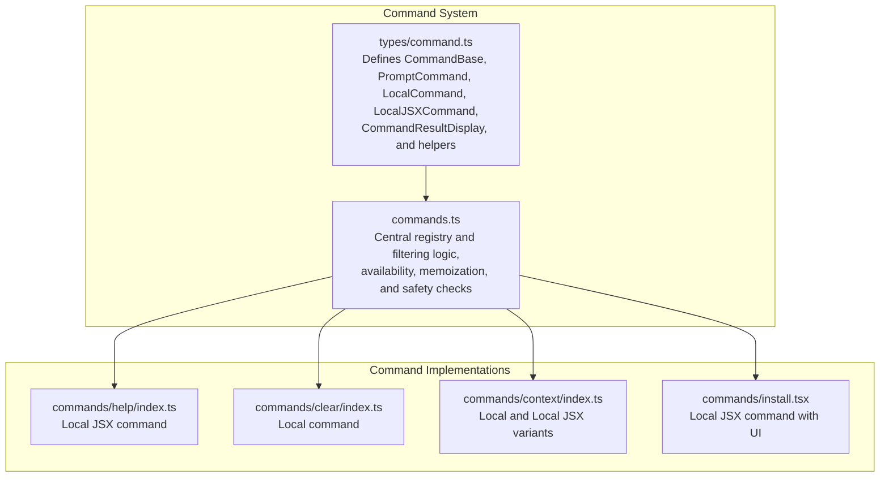
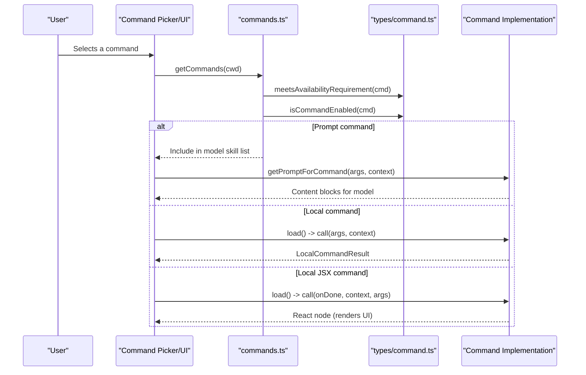
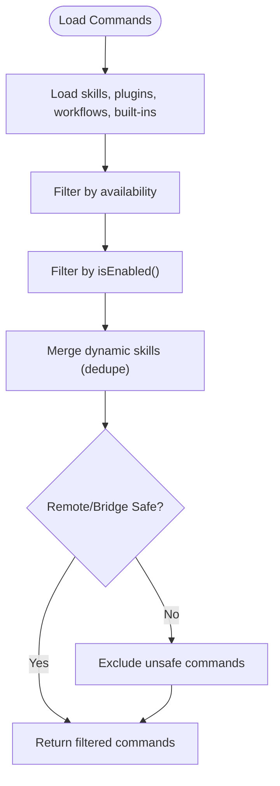
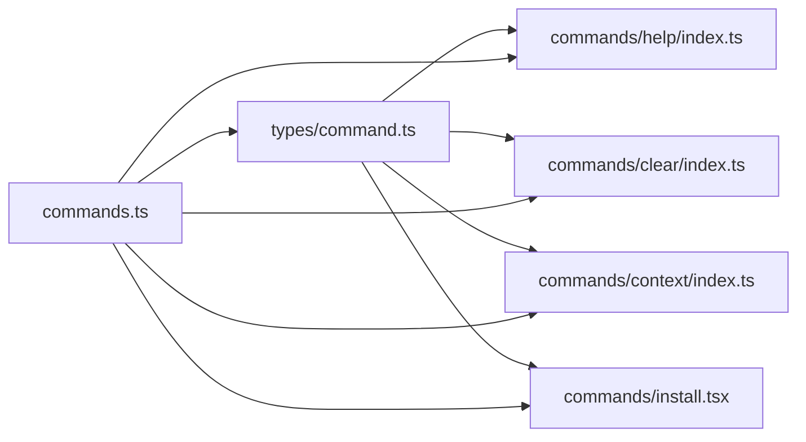

# Command Types and Interfaces

<cite>
**Referenced Files in This Document**
- [types/command.ts](file://src/types/command.ts)
- [commands.ts](file://src/commands.ts)
- [commands/context/index.ts](file://src/commands/context/index.ts)
- [commands/clear/index.ts](file://src/commands/clear/index.ts)
- [commands/help/index.ts](file://src/commands/help/index.ts)
- [commands/install.tsx](file://src/commands/install.tsx)
</cite>

## Table of Contents
1. [Introduction](#introduction)
2. [Project Structure](#project-structure)
3. [Core Components](#core-components)
4. [Architecture Overview](#architecture-overview)
5. [Detailed Component Analysis](#detailed-component-analysis)
6. [Dependency Analysis](#dependency-analysis)
7. [Performance Considerations](#performance-considerations)
8. [Troubleshooting Guide](#troubleshooting-guide)
9. [Conclusion](#conclusion)

## Introduction
This document explains the command type system and interface definitions used across the application. It covers the three primary command types—prompt commands, local commands, and JSX commands—detailing their characteristics, use cases, and implementation requirements. It also documents the command interface specifications, metadata, schemas, validation mechanisms, and how these integrate with UI rendering, permission systems, and execution frameworks.

## Project Structure
The command system is defined centrally and composed from multiple sources:
- Central type definitions and command composition logic live in the types and commands modules.
- Individual commands are organized under dedicated folders and exported via the central registry.

**Diagram sources**
- [types/command.ts:175-216](file://src/types/command.ts#L175-L216)
- [commands.ts:258-346](file://src/commands.ts#L258-L346)
- [commands/help/index.ts:1-11](file://src/commands/help/index.ts#L1-L11)
- [commands/clear/index.ts:1-20](file://src/commands/clear/index.ts#L1-L20)
- [commands/context/index.ts:1-25](file://src/commands/context/index.ts#L1-L25)
- [commands/install.tsx:279-300](file://src/commands/install.tsx#L279-L300)

**Section sources**
- [types/command.ts:175-216](file://src/types/command.ts#L175-L216)
- [commands.ts:258-346](file://src/commands.ts#L258-L346)

## Core Components
This section defines the core command interfaces and their roles.

- CommandBase: Shared metadata and flags that apply to all command types.
- PromptCommand: A command that expands into model-facing prompts and can be invoked by models.
- LocalCommand: A command that executes locally and produces text results.
- LocalJSXCommand: A command that renders UI (Ink) and can interact with the app’s runtime context.

Key types and helpers:
- CommandResultDisplay: Controls how command results are presented to users.
- LocalJSXCommandOnDone: Callback used by JSX commands to signal completion and optionally inject follow-up behavior.
- getCommandName and isCommandEnabled: Helpers to normalize display names and resolve enablement.

**Section sources**
- [types/command.ts:175-216](file://src/types/command.ts#L175-L216)
- [types/command.ts:107-126](file://src/types/command.ts#L107-L126)
- [types/command.ts:208-216](file://src/types/command.ts#L208-L216)

## Architecture Overview
The command architecture integrates command discovery, availability gating, and execution across UI and model invocation paths.

**Diagram sources**
- [commands.ts:417-443](file://src/commands.ts#L417-L443)
- [commands.ts:476-517](file://src/commands.ts#L476-L517)
- [types/command.ts:25-57](file://src/types/command.ts#L25-L57)
- [types/command.ts:74-78](file://src/types/command.ts#L74-L78)
- [types/command.ts:144-152](file://src/types/command.ts#L144-L152)

## Detailed Component Analysis

### Prompt Commands
Prompt commands are designed to be model-invocable skills that expand into content blocks for the model. They support:
- Progress messaging and content length hints for token estimation.
- Optional tool allowances and model overrides.
- Source annotations (builtin, plugin, mcp, bundled).
- Optional hooks and skill root for plugin contexts.
- Context modes: inline or fork (sub-agent with separate budget).
- Path-based visibility constraints.
- Effort hints and optional non-interactive disabling.

Implementation requirements:
- Provide getPromptForCommand(args, context) to produce content blocks.
- Optionally set availability, kind, and loadedFrom metadata.

Common use cases:
- Generating reports, summaries, or structured analyses.
- Integrating with plugins or MCP servers as skills.

Validation rules:
- disableModelInvocation controls whether a prompt command appears in model-facing lists.
- availability gates visibility per auth/provider.
- isEnabled allows feature-flag or environment-based toggles.

**Section sources**
- [types/command.ts:25-57](file://src/types/command.ts#L25-L57)
- [commands.ts:563-581](file://src/commands.ts#L563-L581)
- [commands.ts:586-608](file://src/commands.ts#L586-L608)

### Local Commands
Local commands execute locally and return text-based results. They are ideal for:
- Lightweight operations that do not require UI rendering.
- Non-interactive automation or quick actions.

Characteristics:
- SupportsNonInteractive indicates whether the command can run without user interaction.
- load() returns a module with a call(args, context) method.
- Results are typed via LocalCommandResult, supporting text, compact results, or skip.

Implementation requirements:
- Implement call(args, context) to compute and return a LocalCommandResult.
- Optionally expose supportsNonInteractive and set isEnabled/isHidden for gating.

Common use cases:
- Clearing conversation history, toggling settings, or lightweight diagnostics.

**Section sources**
- [types/command.ts:16-24](file://src/types/command.ts#L16-L24)
- [types/command.ts:74-78](file://src/types/command.ts#L74-L78)
- [commands/clear/index.ts:10-19](file://src/commands/clear/index.ts#L10-L19)

### JSX Commands
JSX commands render interactive UI using the application’s Ink-based renderer. They are suited for:
- Interactive wizards, pickers, and multi-step flows.
- Commands requiring user input or dynamic UI updates.

Characteristics:
- load() returns a module with a call(onDone, context, args) method.
- onDone callback supports result display control, optional model queries, and meta messages.
- LocalJSXCommandContext augments ToolUseContext with UI-related hooks and options.

Implementation requirements:
- Implement call(onDone, context, args) to render UI and call onDone upon completion.
- Use LocalJSXCommandOnDone to control result presentation and optional follow-up actions.

Common use cases:
- Help and guidance UI, installer flows, and context visualization.

**Section sources**
- [types/command.ts:107-126](file://src/types/command.ts#L107-L126)
- [types/command.ts:131-142](file://src/types/command.ts#L131-L142)
- [types/command.ts:80-98](file://src/types/command.ts#L80-L98)
- [commands/help/index.ts:3-8](file://src/commands/help/index.ts#L3-L8)
- [commands/install.tsx:279-300](file://src/commands/install.tsx#L279-L300)

### Command Metadata and Schema
CommandBase defines the schema and validation semantics:
- availability: Provider/auth gating (claude-ai, console).
- description and aliases: Human-readable labeling and discoverability.
- isEnabled: Conditional enablement via feature flags or environment checks.
- isHidden: Suppress from typeahead/help.
- argumentHint and whenToUse: UX hints and usage guidance.
- version and userInvocable: Versioning and user invocation capability.
- loadedFrom: Source provenance (skills, plugin, bundled, mcp).
- kind: Workflow marker for autocomplete badges.
- immediate: Bypass queue and execute immediately.
- isSensitive: Redact arguments from conversation history.
- userFacingName: Override for display names.

Validation and filtering:
- meetsAvailabilityRequirement filters by provider/auth.
- isCommandEnabled resolves defaults and feature flags.
- getCommand and findCommand locate commands by name or alias.

**Section sources**
- [types/command.ts:175-203](file://src/types/command.ts#L175-L203)
- [commands.ts:417-443](file://src/commands.ts#L417-L443)
- [commands.ts:688-719](file://src/commands.ts#L688-L719)

### Command Composition and Safety
The central registry composes commands from multiple sources and enforces safety:
- Memoized loading of skills, plugins, workflows, and built-ins.
- Availability and enablement filters applied before UI exposure.
- Remote-safe and bridge-safe sets restrict execution in remote contexts.

**Diagram sources**
- [commands.ts:449-469](file://src/commands.ts#L449-L469)
- [commands.ts:476-517](file://src/commands.ts#L476-L517)
- [commands.ts:619-676](file://src/commands.ts#L619-L676)

**Section sources**
- [commands.ts:449-469](file://src/commands.ts#L449-L469)
- [commands.ts:619-676](file://src/commands.ts#L619-L676)

### Practical Examples

- Implementing a prompt command:
  - Define a Command with type "prompt".
  - Provide getPromptForCommand(args, context) to return content blocks.
  - Set description, source, and optional availability/kind metadata.

- Implementing a local command:
  - Define a Command with type "local".
  - Provide load() returning a module with call(args, context) that returns LocalCommandResult.
  - Optionally set supportsNonInteractive and isEnabled.

- Implementing a JSX command:
  - Define a Command with type "local-jsx".
  - Provide load() returning a module with call(onDone, context, args) that renders UI.
  - Use onDone to control result display and optional model follow-ups.

- Extending with custom types:
  - Add a new command variant by extending the Command union and updating loaders.
  - Ensure proper availability, enablement, and safety checks.

**Section sources**
- [types/command.ts:205-206](file://src/types/command.ts#L205-L206)
- [commands.ts:258-346](file://src/commands.ts#L258-L346)

## Dependency Analysis
Command dependencies and relationships:
- Central types define the contract; implementations depend on these types.
- The registry aggregates commands from multiple sources and applies filters.
- UI components depend on the registry for command discovery and safety checks.

**Diagram sources**
- [types/command.ts:175-216](file://src/types/command.ts#L175-L216)
- [commands.ts:258-346](file://src/commands.ts#L258-L346)
- [commands/help/index.ts:1-11](file://src/commands/help/index.ts#L1-L11)
- [commands/clear/index.ts:1-20](file://src/commands/clear/index.ts#L1-L20)
- [commands/context/index.ts:1-25](file://src/commands/context/index.ts#L1-L25)
- [commands/install.tsx:279-300](file://src/commands/install.tsx#L279-L300)

**Section sources**
- [commands.ts:258-346](file://src/commands.ts#L258-L346)

## Performance Considerations
- Lazy loading: Local and JSX commands defer heavy imports until invoked, reducing startup time.
- Memoization: Command loading and derived lists are memoized to avoid repeated disk I/O and dynamic imports.
- Filtering: Availability and enablement checks are performed fresh on each request to reflect auth changes.

[No sources needed since this section provides general guidance]

## Troubleshooting Guide
- Command not found:
  - Use getCommand(commandName, commands) to locate and surface available commands with aliases.
- Command hidden or unavailable:
  - Check availability gating and isEnabled; adjust feature flags or auth state accordingly.
- Remote/Bridge safety:
  - Verify isBridgeSafeCommand and REMOTE_SAFE_COMMANDS/BRIDGE_SAFE_COMMANDS for allowed execution contexts.

**Section sources**
- [commands.ts:688-719](file://src/commands.ts#L688-L719)
- [commands.ts:619-676](file://src/commands.ts#L619-L676)

## Conclusion
The command type system provides a flexible, extensible foundation for integrating prompt-driven skills, local actions, and interactive UI flows. By adhering to the CommandBase schema, applying availability and enablement rules, and leveraging lazy loading and safety checks, developers can implement robust commands that integrate seamlessly with the application’s UI, permission systems, and execution frameworks.