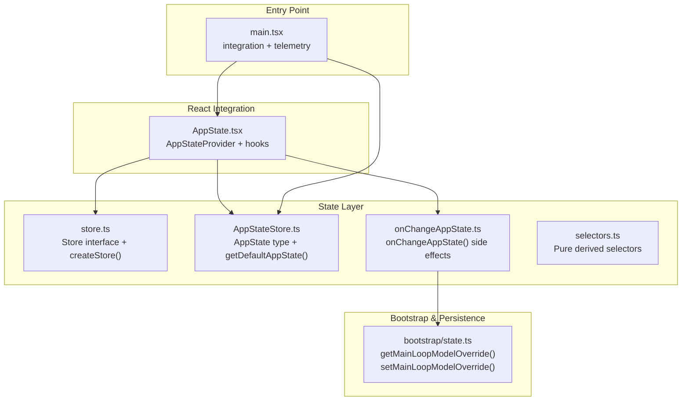
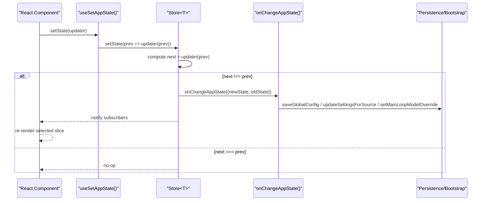
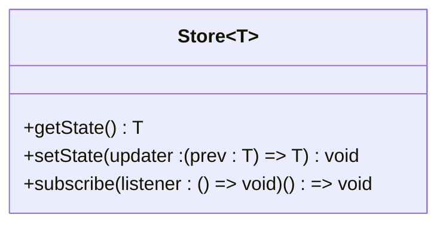
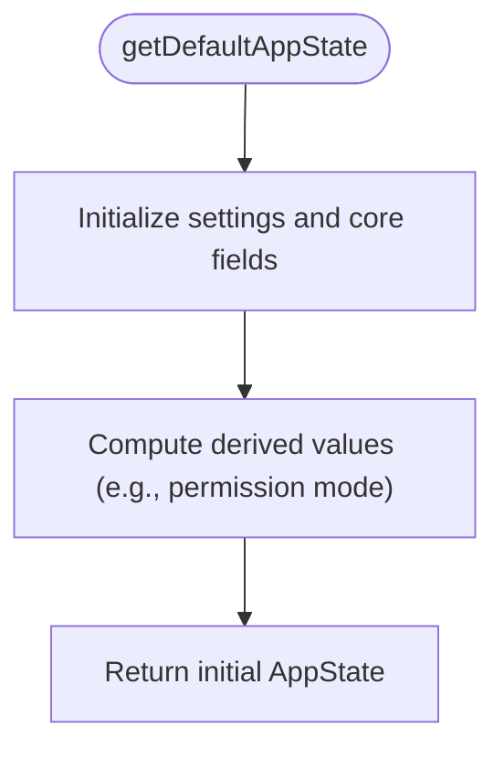
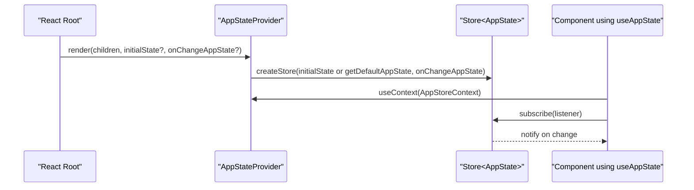
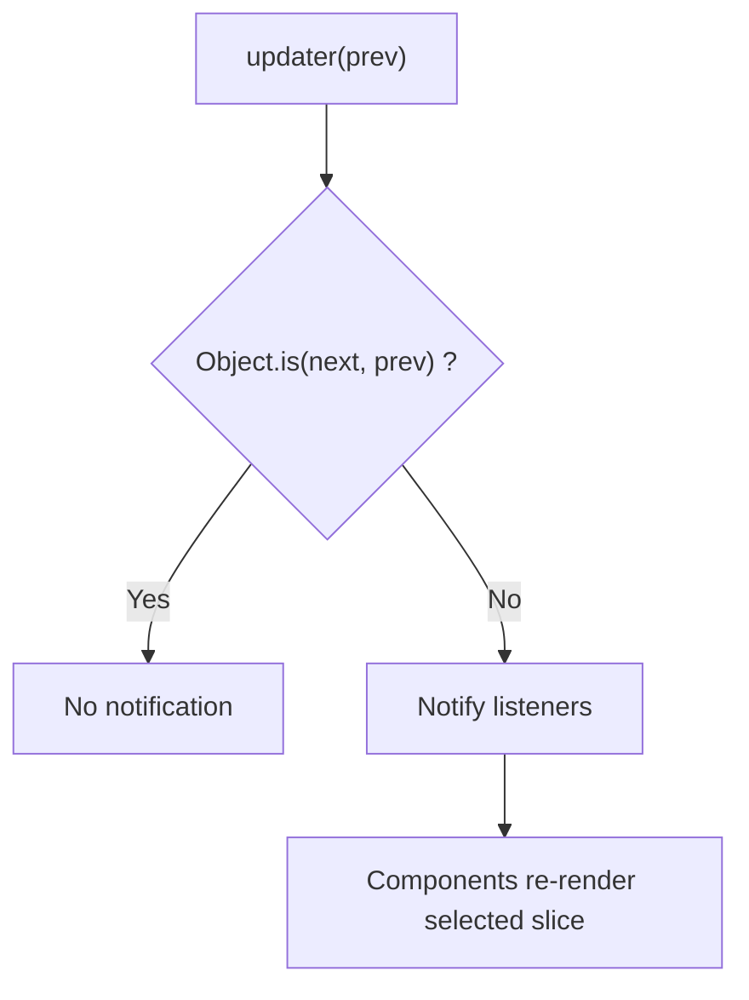
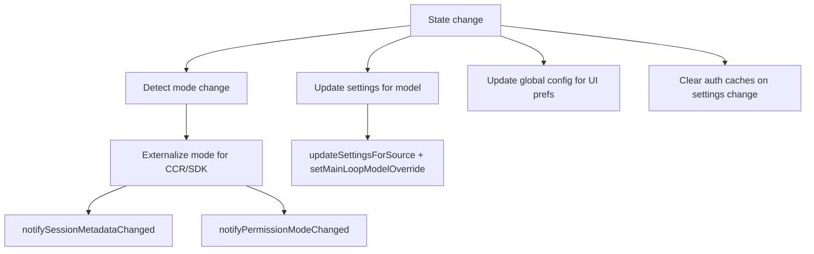
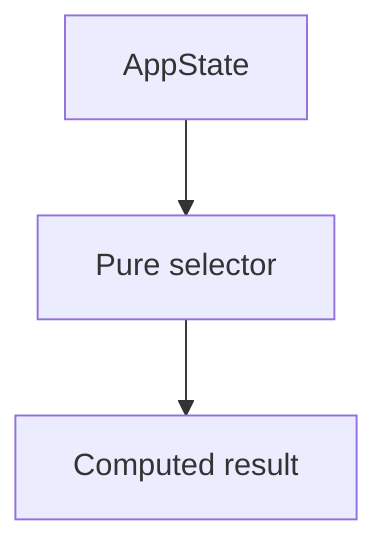
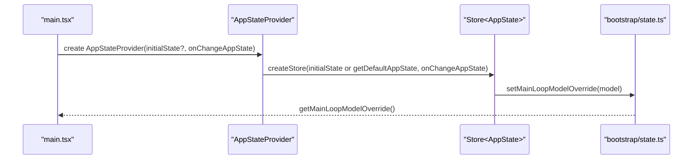
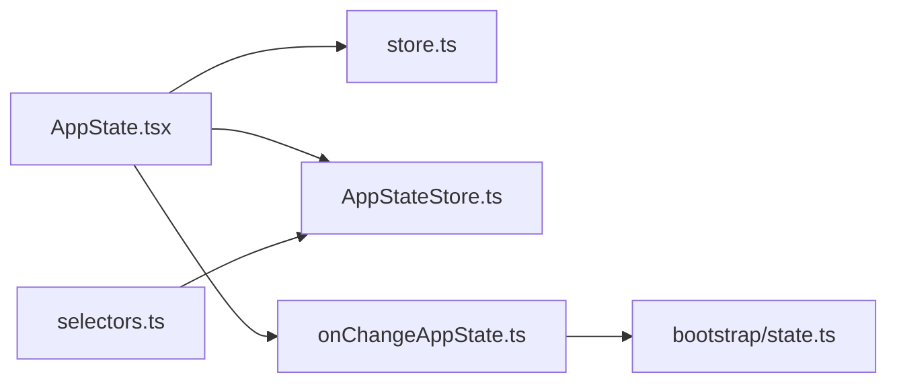

# Application State Store

<cite>
**Referenced Files in This Document**
- [AppStateStore.ts](file://src/state/AppStateStore.ts)
- [AppState.tsx](file://src/state/AppState.tsx)
- [store.ts](file://src/state/store.ts)
- [onChangeAppState.ts](file://src/state/onChangeAppState.ts)
- [selectors.ts](file://src/state/selectors.ts)
- [bootstrap/state.ts](file://src/bootstrap/state.ts)
- [main.tsx](file://src/main.tsx)
</cite>

## Table of Contents
1. [Introduction](#introduction)
2. [Project Structure](#project-structure)
3. [Core Components](#core-components)
4. [Architecture Overview](#architecture-overview)
5. [Detailed Component Analysis](#detailed-component-analysis)
6. [Dependency Analysis](#dependency-analysis)
7. [Performance Considerations](#performance-considerations)
8. [Troubleshooting Guide](#troubleshooting-guide)
9. [Conclusion](#conclusion)

## Introduction
This document explains the Application State Store component that powers global application state in a React-based environment. It covers the AppStateStore singleton pattern, the Store interface, state mutation semantics, subscription and rendering integration with React, state initialization, persistence and synchronization, Redux-like immutability guarantees, validation, hydration, serialization/deserialization, and coordination across UI components, services, and background processes.

## Project Structure
The Application State Store is implemented in the state package and integrates with React via a provider and hooks. It also coordinates with bootstrap-level state and persistence utilities.

**Diagram sources**
- [store.ts:1-35](file://src/state/store.ts#L1-L35)
- [AppStateStore.ts:456-570](file://src/state/AppStateStore.ts#L456-L570)
- [AppState.tsx:37-110](file://src/state/AppState.tsx#L37-L110)
- [onChangeAppState.ts:43-172](file://src/state/onChangeAppState.ts#L43-L172)
- [bootstrap/state.ts:838-854](file://src/bootstrap/state.ts#L838-L854)
- [main.tsx:191-194](file://src/main.tsx#L191-L194)

**Section sources**
- [store.ts:1-35](file://src/state/store.ts#L1-L35)
- [AppStateStore.ts:456-570](file://src/state/AppStateStore.ts#L456-L570)
- [AppState.tsx:37-110](file://src/state/AppState.tsx#L37-L110)
- [onChangeAppState.ts:43-172](file://src/state/onChangeAppState.ts#L43-L172)
- [bootstrap/state.ts:838-854](file://src/bootstrap/state.ts#L838-L854)
- [main.tsx:191-194](file://src/main.tsx#L191-L194)

## Core Components
- Store<T>: A minimal interface with getState, setState, and subscribe for a typed state container.
- AppState: The global application state shape, including settings, UI state, tasks, plugins, MCP, notifications, and more.
- getDefaultAppState(): Factory that initializes AppState with sensible defaults and derived values.
- AppStateProvider: React provider that creates and exposes a singleton store instance to components.
- Hooks: useAppState, useSetAppState, useAppStateStore, and safe variants for selective subscription and updates.
- onChangeAppState: Centralized side-effect handler that reacts to state changes (e.g., persisting settings, notifying external systems).
- Selectors: Pure functions to derive computed state slices for routing and UI decisions.

**Section sources**
- [store.ts:4-8](file://src/state/store.ts#L4-L8)
- [AppStateStore.ts:89-452](file://src/state/AppStateStore.ts#L89-L452)
- [AppStateStore.ts:456-570](file://src/state/AppStateStore.ts#L456-L570)
- [AppState.tsx:27-27](file://src/state/AppState.tsx#L27-L27)
- [AppState.tsx:142-179](file://src/state/AppState.tsx#L142-L179)
- [onChangeAppState.ts:43-172](file://src/state/onChangeAppState.ts#L43-L172)
- [selectors.ts:11-77](file://src/state/selectors.ts#L11-L77)

## Architecture Overview
The store follows a Redux-like immutable update model: updates are pure transformations of the previous state, and subscribers are notified only when the reference changes. React components subscribe to specific slices via useAppState, enabling fine-grained re-renders. Side effects are centralized in onChangeAppState to keep mutations pure and predictable.

**Diagram sources**
- [store.ts:20-27](file://src/state/store.ts#L20-L27)
- [onChangeAppState.ts:43-172](file://src/state/onChangeAppState.ts#L43-L172)
- [AppState.tsx:170-172](file://src/state/AppState.tsx#L170-L172)

## Detailed Component Analysis

### Store<T> and Immutable Updates
- Interface contract: getState, setState, subscribe.
- setState enforces immutability by applying an updater function and comparing references with Object.is. If unchanged, no listeners are notified.
- Subscribers receive notifications via a lightweight listener set.

**Diagram sources**
- [store.ts:4-8](file://src/state/store.ts#L4-L8)

**Section sources**
- [store.ts:10-35](file://src/state/store.ts#L10-L35)

### AppState Type and Initialization
- AppState defines the entire global state shape, including settings, UI flags, tasks, plugins, MCP, notifications, permission context, and more.
- getDefaultAppState constructs the initial state, including derived defaults (e.g., permission mode, initial models, prompt suggestion flags).

**Diagram sources**
- [AppStateStore.ts:456-570](file://src/state/AppStateStore.ts#L456-L570)

**Section sources**
- [AppStateStore.ts:89-452](file://src/state/AppStateStore.ts#L89-L452)
- [AppStateStore.ts:456-570](file://src/state/AppStateStore.ts#L456-L570)

### AppStateProvider and React Integration
- AppStateProvider creates a singleton store with optional initial state and onChange callback.
- It guards against nested providers and ensures settings changes propagate consistently.
- useAppState subscribes to a selected slice using useSyncExternalStore for efficient re-renders.
- useSetAppState returns a stable setState reference for callbacks without forcing re-renders.
- useAppStateMaybeOutsideOfProvider safely accesses state when the provider is not mounted.

**Diagram sources**
- [AppState.tsx:37-110](file://src/state/AppState.tsx#L37-L110)
- [AppState.tsx:142-179](file://src/state/AppState.tsx#L142-L179)

**Section sources**
- [AppState.tsx:37-110](file://src/state/AppState.tsx#L37-L110)
- [AppState.tsx:142-179](file://src/state/AppState.tsx#L142-L179)

### State Mutation Patterns and Subscription
- Mutations are performed via setState with an updater function, ensuring immutability and deterministic updates.
- Subscriptions use Object.is to compare selected values, avoiding unnecessary re-renders.
- For multiple independent fields, call useAppState multiple times with different selectors.

**Diagram sources**
- [store.ts:20-27](file://src/state/store.ts#L20-L27)
- [AppState.tsx:142-163](file://src/state/AppState.tsx#L142-L163)

**Section sources**
- [store.ts:20-27](file://src/state/store.ts#L20-L27)
- [AppState.tsx:142-163](file://src/state/AppState.tsx#L142-L163)

### Side Effects and Persistence
- onChangeAppState centralizes side effects for state changes:
  - Sync permission mode to external metadata and SDK channels.
  - Persist model overrides to settings and bootstrap state.
  - Update global config for UI preferences and verbose flags.
  - Clear auth-related caches on settings changes.
- This keeps mutations pure while enabling cross-cutting concerns.

**Diagram sources**
- [onChangeAppState.ts:43-172](file://src/state/onChangeAppState.ts#L43-L172)
- [bootstrap/state.ts:838-854](file://src/bootstrap/state.ts#L838-L854)

**Section sources**
- [onChangeAppState.ts:43-172](file://src/state/onChangeAppState.ts#L43-L172)
- [bootstrap/state.ts:838-854](file://src/bootstrap/state.ts#L838-L854)

### Selectors and Computed State
- Pure selectors derive computed values from AppState without side effects.
- Examples:
  - getViewedTeammateTask: returns the currently viewed teammate task if valid.
  - getActiveAgentForInput: routes user input to leader, viewed agent, or named agent.

**Diagram sources**
- [selectors.ts:18-40](file://src/state/selectors.ts#L18-L40)
- [selectors.ts:59-76](file://src/state/selectors.ts#L59-L76)

**Section sources**
- [selectors.ts:18-40](file://src/state/selectors.ts#L18-L40)
- [selectors.ts:59-76](file://src/state/selectors.ts#L59-L76)

### Integration with Bootstrap and Entry Point
- The store is created and passed to the React tree in the main entry point.
- Bootstrap state functions (e.g., getMainLoopModelOverride, setMainLoopModelOverride) are used to synchronize model settings across subsystems.

**Diagram sources**
- [main.tsx:191-194](file://src/main.tsx#L191-L194)
- [AppState.tsx:37-110](file://src/state/AppState.tsx#L37-L110)
- [bootstrap/state.ts:838-854](file://src/bootstrap/state.ts#L838-L854)

**Section sources**
- [main.tsx:191-194](file://src/main.tsx#L191-L194)
- [AppState.tsx:37-110](file://src/state/AppState.tsx#L37-L110)
- [bootstrap/state.ts:838-854](file://src/bootstrap/state.ts#L838-L854)

## Dependency Analysis
- AppStateProvider depends on Store<T>, AppState type, and onChangeAppState.
- onChangeAppState depends on bootstrap state and persistence utilities.
- Selectors depend only on AppState and task types for pure derivations.
- The store itself is decoupled from React and can be used by non-React code via useAppStateStore.

**Diagram sources**
- [AppState.tsx:37-110](file://src/state/AppState.tsx#L37-L110)
- [store.ts:10-35](file://src/state/store.ts#L10-L35)
- [AppStateStore.ts:456-570](file://src/state/AppStateStore.ts#L456-L570)
- [onChangeAppState.ts:43-172](file://src/state/onChangeAppState.ts#L43-L172)
- [bootstrap/state.ts:838-854](file://src/bootstrap/state.ts#L838-L854)
- [selectors.ts:18-40](file://src/state/selectors.ts#L18-L40)

**Section sources**
- [AppState.tsx:37-110](file://src/state/AppState.tsx#L37-L110)
- [store.ts:10-35](file://src/state/store.ts#L10-L35)
- [AppStateStore.ts:456-570](file://src/state/AppStateStore.ts#L456-L570)
- [onChangeAppState.ts:43-172](file://src/state/onChangeAppState.ts#L43-L172)
- [bootstrap/state.ts:838-854](file://src/bootstrap/state.ts#L838-L854)
- [selectors.ts:18-40](file://src/state/selectors.ts#L18-L40)

## Performance Considerations
- Prefer narrow selectors in useAppState to minimize re-renders; avoid returning new objects from selectors.
- Use useSetAppState for callbacks that should not trigger re-renders.
- Keep state updates pure and small; avoid unnecessary churn to reduce listener notifications.
- Use Object.is comparisons to detect real changes efficiently.

[No sources needed since this section provides general guidance]

## Troubleshooting Guide
- If a component throws a reference error about being outside AppStateProvider, ensure the component is rendered within AppStateProvider.
- If settings changes do not persist, verify onChangeAppState is wired and that updateSettingsForSource and saveGlobalConfig are invoked.
- If permission mode is inconsistent, confirm that toExternalPermissionMode and notifySessionMetadataChanged are functioning and that mode transitions are detected.

**Section sources**
- [AppState.tsx:117-124](file://src/state/AppState.tsx#L117-L124)
- [onChangeAppState.ts:65-92](file://src/state/onChangeAppState.ts#L65-L92)

## Conclusion
The Application State Store provides a robust, immutable, and predictable state container for the application. Its React integration enables efficient, selective subscriptions, while centralized side effects ensure persistence and cross-system synchronization remain clean and maintainable. The design supports scalability across UI components, services, and background processes.