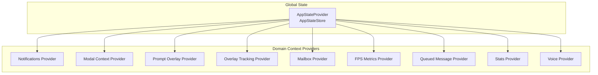
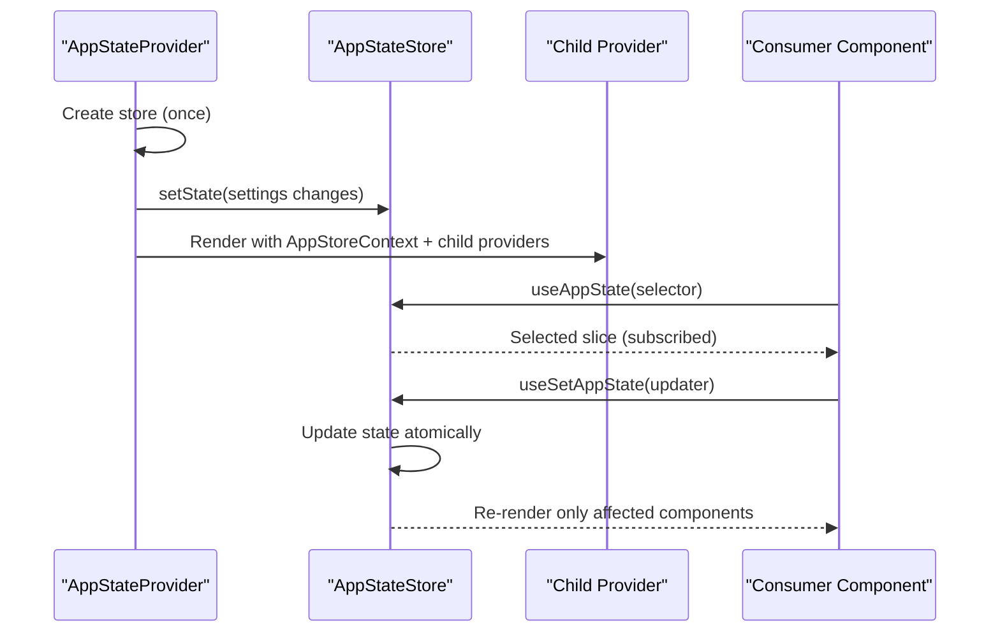
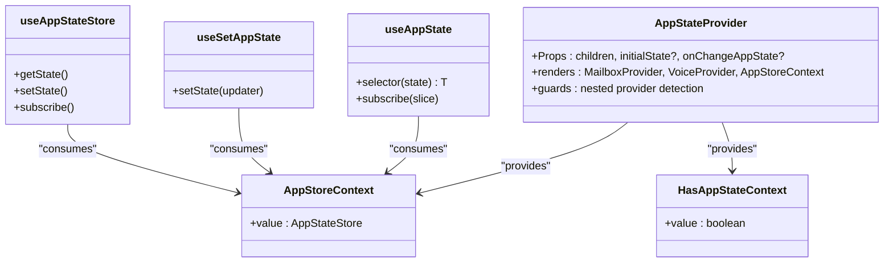
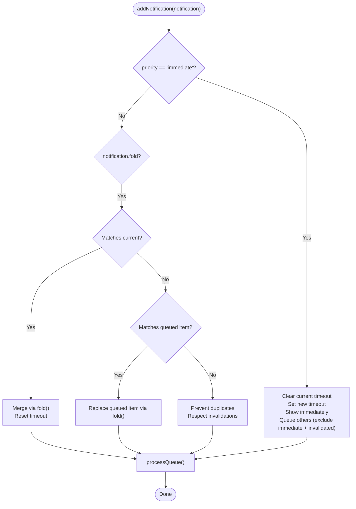
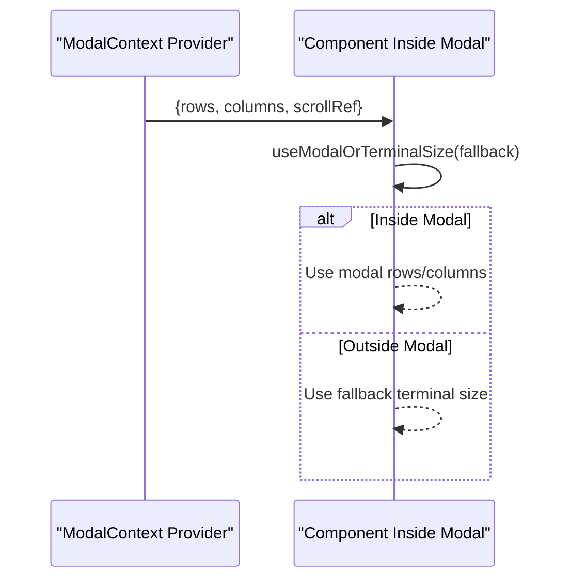
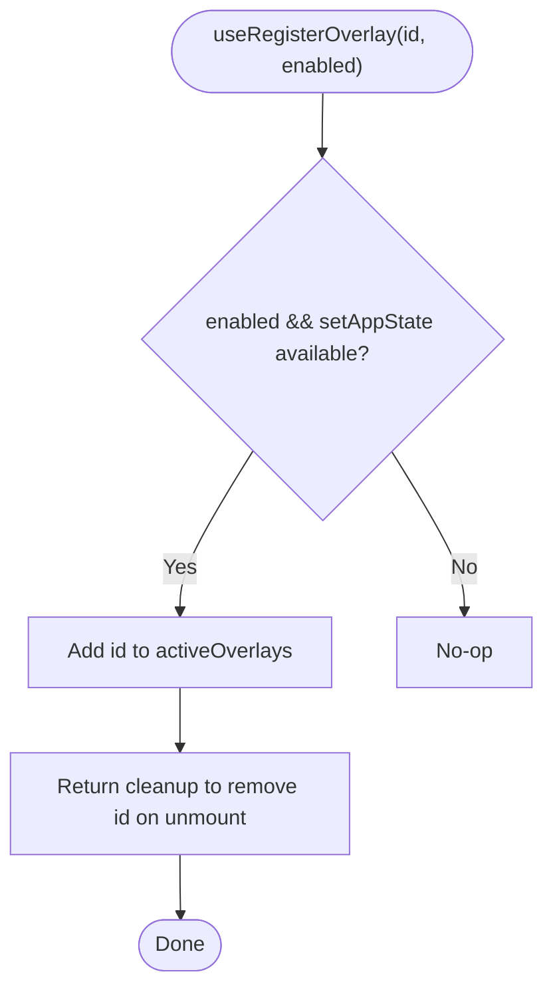
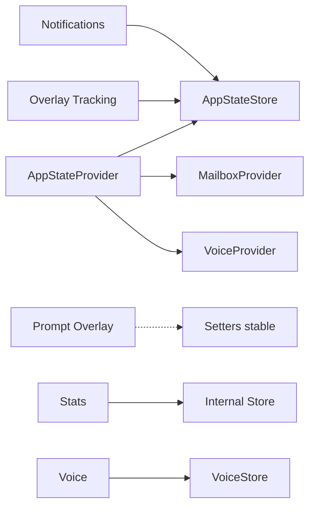

# React Context Providers

<cite>
**Referenced Files in This Document**
- [AppState.tsx](file://src/state/AppState.tsx)
- [AppStateStore.ts](file://src/state/AppStateStore.ts)
- [notifications.tsx](file://src/context/notifications.tsx)
- [modalContext.tsx](file://src/context/modalContext.tsx)
- [promptOverlayContext.tsx](file://src/context/promptOverlayContext.tsx)
- [overlayContext.tsx](file://src/context/overlayContext.tsx)
- [mailbox.tsx](file://src/context/mailbox.tsx)
- [fpsMetrics.tsx](file://src/context/fpsMetrics.tsx)
- [QueuedMessageContext.tsx](file://src/context/QueuedMessageContext.tsx)
- [stats.tsx](file://src/context/stats.tsx)
- [voice.tsx](file://src/context/voice.tsx)
</cite>

## Table of Contents
1. [Introduction](#introduction)
2. [Project Structure](#project-structure)
3. [Core Components](#core-components)
4. [Architecture Overview](#architecture-overview)
5. [Detailed Component Analysis](#detailed-component-analysis)
6. [Dependency Analysis](#dependency-analysis)
7. [Performance Considerations](#performance-considerations)
8. [Troubleshooting Guide](#troubleshooting-guide)
9. [Conclusion](#conclusion)

## Introduction
This document explains how React Context is used for state management across the application, focusing on the AppState provider and related context providers. It covers the context hierarchy, provider composition, context consumption patterns, synchronization with the global AppStateStore, performance optimization strategies, and debugging techniques. It also documents how distinct contexts (notifications, modal, prompt overlay, overlays, mailbox, FPS metrics, stats, voice) integrate and coordinate.

## Project Structure
The React context ecosystem centers around AppStateProvider, which creates and exposes a global AppStateStore. Other context providers encapsulate domain-specific state and utilities, composing beneath AppStateProvider. The key files are:

- AppStateProvider and hooks for global state
- Domain-specific context providers (notifications, modal, prompt overlay, overlays, mailbox, FPS metrics, stats, voice)
- Context consumers in components



**Diagram sources**
- [AppState.tsx:37-110](file://src/state/AppState.tsx#L37-L110)
- [notifications.tsx:38-229](file://src/context/notifications.tsx#L38-L229)
- [modalContext.tsx:22-58](file://src/context/modalContext.tsx#L22-L58)
- [promptOverlayContext.tsx:34-60](file://src/context/promptOverlayContext.tsx#L34-L60)
- [overlayContext.tsx:38-104](file://src/context/overlayContext.tsx#L38-L104)
- [mailbox.tsx:8-30](file://src/context/mailbox.tsx#L8-L30)
- [fpsMetrics.tsx:10-26](file://src/context/fpsMetrics.tsx#L10-L26)
- [QueuedMessageContext.tsx:20-62](file://src/context/QueuedMessageContext.tsx#L20-L62)
- [stats.tsx:104-156](file://src/context/stats.tsx#L104-L156)
- [voice.tsx:23-42](file://src/context/voice.tsx#L23-L42)

**Section sources**
- [AppState.tsx:37-110](file://src/state/AppState.tsx#L37-L110)
- [AppStateStore.ts:89-452](file://src/state/AppStateStore.ts#L89-L452)

## Core Components
- AppStateProvider: Creates and manages the AppStateStore, composes child providers (Mailbox, Voice), and exposes AppStoreContext and HasAppStateContext. It guards against nested providers and wires settings changes into the store.
- useAppState/useSetAppState/useAppStateStore: Subscription and update APIs for global state slices.
- Notifications context: Manages a priority-based notification queue and timeouts, integrating with AppState.notifications.
- Modal context: Supplies terminal-size-aware dimensions and scroll refs when rendering inside a modal slot.
- Prompt overlay context: Provides two channels (data and dialog) for content floating above the prompt, with split setter contexts to avoid re-renders on writes.
- Overlay context: Tracks active overlays for Escape key coordination and integrates with AppState.activeOverlays.
- Mailbox context: Provides a shared Mailbox instance to decouple messaging from global state.
- FPS metrics context: Exposes a getter for FPS metrics to consumers.
- Queued message context: Supplies layout metadata for queued messages.
- Stats context: Provides a metrics store with counters, gauges, timers, and sets, persisting metrics on process exit.
- Voice context: Provides a dedicated store for voice state with subscription and setters.

**Section sources**
- [AppState.tsx:37-110](file://src/state/AppState.tsx#L37-L110)
- [AppState.tsx:142-179](file://src/state/AppState.tsx#L142-L179)
- [AppStateStore.ts:222-225](file://src/state/AppStateStore.ts#L222-L225)
- [AppStateStore.ts:421-421](file://src/state/AppStateStore.ts#L421-L421)
- [notifications.tsx:38-229](file://src/context/notifications.tsx#L38-L229)
- [modalContext.tsx:22-58](file://src/context/modalContext.tsx#L22-L58)
- [promptOverlayContext.tsx:34-60](file://src/context/promptOverlayContext.tsx#L34-L60)
- [overlayContext.tsx:38-104](file://src/context/overlayContext.tsx#L38-L104)
- [mailbox.tsx:8-30](file://src/context/mailbox.tsx#L8-L30)
- [fpsMetrics.tsx:10-26](file://src/context/fpsMetrics.tsx#L10-L26)
- [QueuedMessageContext.tsx:20-62](file://src/context/QueuedMessageContext.tsx#L20-L62)
- [stats.tsx:104-156](file://src/context/stats.tsx#L104-L156)
- [voice.tsx:23-42](file://src/context/voice.tsx#L23-L42)

## Architecture Overview
AppStateProvider composes child providers and exposes the AppStateStore. Domain contexts read/write to AppState via useSetAppState and subscribe to slices via useAppState. Some contexts maintain their own stores (e.g., Voice, Stats) and are composed beneath AppStateProvider.



**Diagram sources**
- [AppState.tsx:37-110](file://src/state/AppState.tsx#L37-L110)
- [AppState.tsx:142-179](file://src/state/AppState.tsx#L142-L179)

## Detailed Component Analysis

### AppStateProvider and Global State Hooks
- Composition: Wraps children with MailboxProvider and VoiceProvider, then AppStoreContext and HasAppStateContext. Guards against nested providers.
- Settings synchronization: Applies settings changes via applySettingsChange and listens to external setting changes.
- Subscriptions: useAppState uses useSyncExternalStore to subscribe to AppState slices; useSetAppState returns a stable updater; useAppStateStore returns the store directly.



**Diagram sources**
- [AppState.tsx:37-110](file://src/state/AppState.tsx#L37-L110)
- [AppState.tsx:142-179](file://src/state/AppState.tsx#L142-L179)

**Section sources**
- [AppState.tsx:37-110](file://src/state/AppState.tsx#L37-L110)
- [AppState.tsx:142-179](file://src/state/AppState.tsx#L142-L179)
- [AppStateStore.ts:89-452](file://src/state/AppStateStore.ts#L89-L452)

### Notifications Context
- Purpose: Manage a priority-ordered notification queue, timeouts, folding, and invalidation.
- Integration: Uses useSetAppState to mutate AppState.notifications and processQueue to advance the queue.
- Behavior: Immediate notifications preempt current displays; folding merges notifications with the same key; invalidation clears current and requeues based on keys.



**Diagram sources**
- [notifications.tsx:38-229](file://src/context/notifications.tsx#L38-L229)
- [AppStateStore.ts:222-225](file://src/state/AppStateStore.ts#L222-L225)

**Section sources**
- [notifications.tsx:38-229](file://src/context/notifications.tsx#L38-L229)
- [AppStateStore.ts:222-225](file://src/state/AppStateStore.ts#L222-L225)

### Modal Context
- Purpose: Communicate terminal-size constraints and scroll state when rendering inside a modal slot.
- API: useIsInsideModal, useModalOrTerminalSize, useModalScrollRef.
- Behavior: When inside modal, provides reduced rows/columns; otherwise falls back to terminal size.



**Diagram sources**
- [modalContext.tsx:22-58](file://src/context/modalContext.tsx#L22-L58)

**Section sources**
- [modalContext.tsx:22-58](file://src/context/modalContext.tsx#L22-L58)

### Prompt Overlay Context
- Purpose: Provide two channels for content floating above the prompt:
  - Data channel: structured suggestion data (e.g., from PromptInputFooter)
  - Dialog channel: arbitrary dialog nodes (e.g., AutoModeOptInDialog)
- Pattern: Split into DataContext/SetContext and DialogContext/SetDialogContext pairs to keep setters stable and avoid re-renders on writes.
- Lifecycle: useSetPromptOverlay and useSetPromptOverlayDialog register and clear on unmount.

```mermaid
sequenceDiagram
participant Writer as "Writer Component"
participant Provider as "PromptOverlayProvider"
participant Reader as "Reader Component"
Writer->>Provider : useSetPromptOverlay(data)
Writer->>Provider : useSetPromptOverlayDialog(node)
Provider->>Provider : setState(data), setState(node)
Reader->>Provider : usePromptOverlay() / usePromptOverlayDialog()
Provider-->>Reader : Current overlay data/dialog
Note over Writer,Reader : Setters are stable; writes do not re-render writers
```

**Diagram sources**
- [promptOverlayContext.tsx:34-60](file://src/context/promptOverlayContext.tsx#L34-L60)
- [promptOverlayContext.tsx:72-95](file://src/context/promptOverlayContext.tsx#L72-L95)
- [promptOverlayContext.tsx:101-124](file://src/context/promptOverlayContext.tsx#L101-L124)

**Section sources**
- [promptOverlayContext.tsx:34-60](file://src/context/promptOverlayContext.tsx#L34-L60)
- [promptOverlayContext.tsx:72-95](file://src/context/promptOverlayContext.tsx#L72-L95)
- [promptOverlayContext.tsx:101-124](file://src/context/promptOverlayContext.tsx#L101-L124)

### Overlay Tracking Context
- Purpose: Coordinate Escape key handling by tracking active overlays and distinguishing modal vs non-modal overlays.
- Integration: useRegisterOverlay registers/unregisters overlays via AppState.activeOverlays; useIsOverlayActive and useIsModalOverlayActive derive booleans from AppState.
- Behavior: Non-modal overlays (e.g., autocomplete) do not disable TextInput focus; modal overlays do.



**Diagram sources**
- [overlayContext.tsx:38-104](file://src/context/overlayContext.tsx#L38-L104)
- [AppStateStore.ts:421-421](file://src/state/AppStateStore.ts#L421-L421)

**Section sources**
- [overlayContext.tsx:38-104](file://src/context/overlayContext.tsx#L38-L104)
- [AppStateStore.ts:421-421](file://src/state/AppStateStore.ts#L421-L421)

### Mailbox Context
- Purpose: Provide a shared Mailbox instance to decouple messaging from AppState.
- Composition: Created once via useMemo and provided to children.

**Section sources**
- [mailbox.tsx:8-30](file://src/context/mailbox.tsx#L8-L30)

### FPS Metrics Context
- Purpose: Expose a getter for FPS metrics to consumers.
- Composition: Provider wraps children with a context value that returns FPS metrics.

**Section sources**
- [fpsMetrics.tsx:10-26](file://src/context/fpsMetrics.tsx#L10-L26)

### Queued Message Context
- Purpose: Supply layout metadata for queued messages, including whether it is the first item and padding width.
- Composition: Provider computes paddingWidth and exposes isQueued, isFirst, and paddingWidth to consumers.

**Section sources**
- [QueuedMessageContext.tsx:20-62](file://src/context/QueuedMessageContext.tsx#L20-L62)

### Stats Context
- Purpose: Provide a metrics store with counters, gauges, timers, and sets; persist metrics on process exit.
- Composition: Provider creates a store (or accepts an external store), registers an exit handler to save metrics, and provides the store via context.

**Section sources**
- [stats.tsx:104-156](file://src/context/stats.tsx#L104-L156)
- [stats.tsx:157-220](file://src/context/stats.tsx#L157-L220)

### Voice Context
- Purpose: Provide a dedicated store for voice state with subscription and setters.
- Composition: Provider creates a VoiceStore with default state; consumers use useVoiceState, useSetVoiceState, and useGetVoiceState.

**Section sources**
- [voice.tsx:23-42](file://src/context/voice.tsx#L23-L42)
- [voice.tsx:55-87](file://src/context/voice.tsx#L55-L87)

## Dependency Analysis
- AppStateProvider depends on:
  - AppStateStore (via createStore/getDefaultAppState)
  - MailboxProvider/VoiceProvider composition
  - Settings synchronization via applySettingsChange
- Domain contexts depend on:
  - AppStateProvider for AppState subscriptions and updates (e.g., Notifications, Overlay)
  - Their own stores (e.g., Voice, Stats)
  - Utility modules (e.g., Mailbox, FPS metrics getter)



**Diagram sources**
- [AppState.tsx:37-110](file://src/state/AppState.tsx#L37-L110)
- [AppStateStore.ts:456-569](file://src/state/AppStateStore.ts#L456-L569)
- [notifications.tsx:38-229](file://src/context/notifications.tsx#L38-L229)
- [overlayContext.tsx:38-104](file://src/context/overlayContext.tsx#L38-L104)
- [promptOverlayContext.tsx:34-60](file://src/context/promptOverlayContext.tsx#L34-L60)
- [stats.tsx:104-156](file://src/context/stats.tsx#L104-L156)
- [voice.tsx:23-42](file://src/context/voice.tsx#L23-L42)

**Section sources**
- [AppState.tsx:37-110](file://src/state/AppState.tsx#L37-L110)
- [AppStateStore.ts:456-569](file://src/state/AppStateStore.ts#L456-L569)

## Performance Considerations
- Prefer useSetAppState for updates without subscribing to state changes to avoid re-renders for writers.
- Use memoization patterns in providers to stabilize values and prevent unnecessary re-renders:
  - Use useMemo for single-instance providers (e.g., Mailbox, Stats store).
  - Use compiler-generated memo caches ($ variables) to stabilize derived values and provider trees.
- Keep context values small and slice-specific:
  - useAppState(selector) should return a stable reference to an existing sub-object to avoid churn.
- Avoid redundant re-renders by:
  - Splitting setter contexts (e.g., PromptOverlay) so writers remain stable.
  - Using stable references for setters and getters.
- Minimize global re-renders:
  - Mutate AppState via useSetAppState with minimal updates.
  - Use domain-specific stores (Voice, Stats) for non-global concerns.

[No sources needed since this section provides general guidance]

## Troubleshooting Guide
- Error: "useAppState/useSetAppState cannot be called outside of an <AppStateProvider />"
  - Cause: Consumer is not wrapped by AppStateProvider.
  - Fix: Wrap the consumer with AppStateProvider and ensure no nested providers.
  - Reference: [AppState.tsx:117-124](file://src/state/AppState.tsx#L117-L124)
- Error: "useMailbox must be used within a MailboxProvider"
  - Cause: Consumer is not wrapped by MailboxProvider.
  - Fix: Ensure MailboxProvider is above the consumer in the tree.
  - Reference: [mailbox.tsx:32-37](file://src/context/mailbox.tsx#L32-L37)
- Overlays still active after dismissal
  - Cause: Overlay not unregistered on unmount or not using useRegisterOverlay correctly.
  - Fix: Ensure useRegisterOverlay is called with enabled=true and that cleanup runs on unmount.
  - Reference: [overlayContext.tsx:38-104](file://src/context/overlayContext.tsx#L38-L104)
- Notifications not advancing
  - Cause: Queue not processed or timeouts not cleared on immediate notifications.
  - Fix: Ensure processQueue is invoked after adding notifications and that timeouts are cleared on immediate arrivals.
  - Reference: [notifications.tsx:38-229](file://src/context/notifications.tsx#L38-L229)

**Section sources**
- [AppState.tsx:117-124](file://src/state/AppState.tsx#L117-L124)
- [mailbox.tsx:32-37](file://src/context/mailbox.tsx#L32-L37)
- [overlayContext.tsx:38-104](file://src/context/overlayContext.tsx#L38-L104)
- [notifications.tsx:38-229](file://src/context/notifications.tsx#L38-L229)

## Conclusion
React Context in this application is centered on AppStateProvider and AppStateStore, enabling efficient, granular state updates and subscriptions. Domain contexts encapsulate specialized concerns (notifications, overlays, modal sizing, voice, stats, mailbox, FPS metrics) and compose beneath AppStateProvider. By leveraging stable setters, memoized providers, and slice-based subscriptions, the system minimizes re-renders and maintains predictable behavior. Proper provider ordering, context splitting, and careful state derivation are essential for performance and correctness.