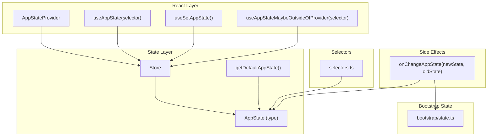
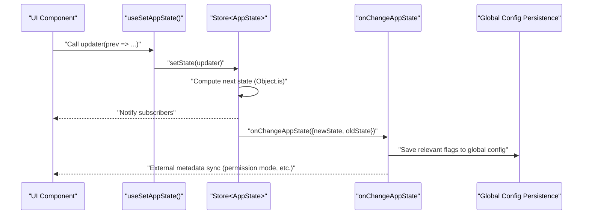
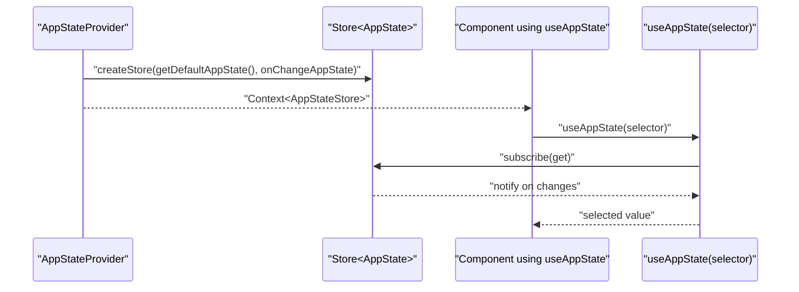
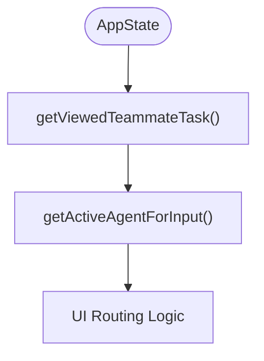
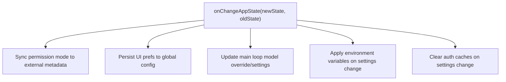
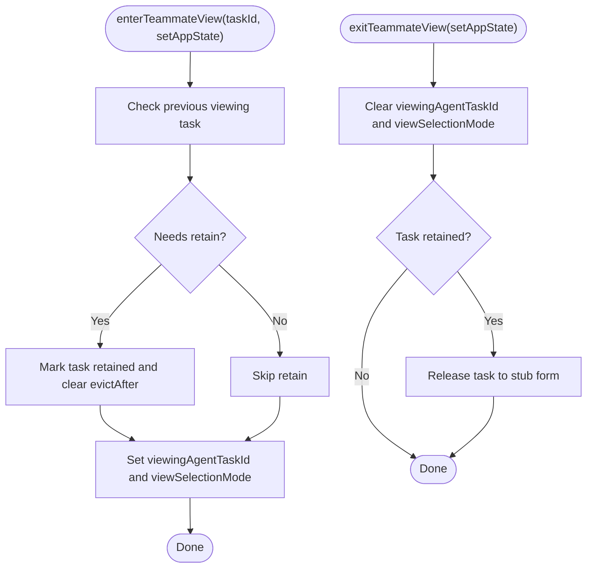
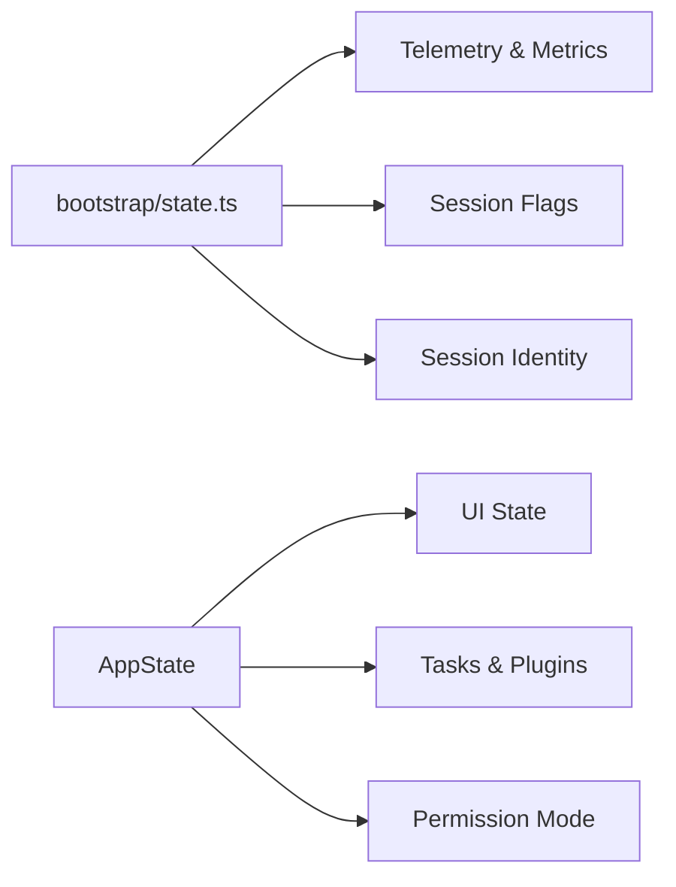
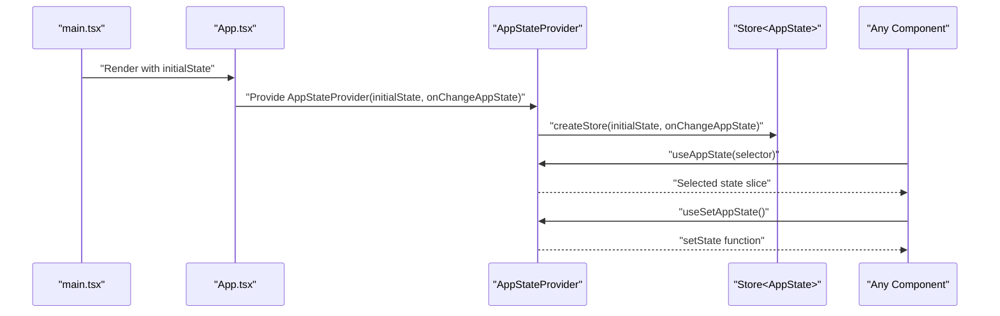
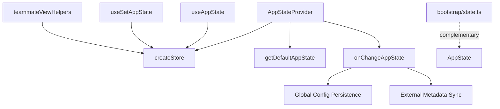

# State Management Architecture

<cite>
**Referenced Files in This Document**
- [AppStateStore.ts](file://src/state/AppStateStore.ts)
- [store.ts](file://src/state/store.ts)
- [AppState.tsx](file://src/state/AppState.tsx)
- [selectors.ts](file://src/state/selectors.ts)
- [onChangeAppState.ts](file://src/state/onChangeAppState.ts)
- [teammateViewHelpers.ts](file://src/state/teammateViewHelpers.ts)
- [state.ts](file://src/bootstrap/state.ts)
- [App.tsx](file://src/components/App.tsx)
- [main.tsx](file://src/main.tsx)
</cite>

## Table of Contents
1. [Introduction](#introduction)
2. [Project Structure](#project-structure)
3. [Core Components](#core-components)
4. [Architecture Overview](#architecture-overview)
5. [Detailed Component Analysis](#detailed-component-analysis)
6. [Dependency Analysis](#dependency-analysis)
7. [Performance Considerations](#performance-considerations)
8. [Troubleshooting Guide](#troubleshooting-guide)
9. [Conclusion](#conclusion)

## Introduction
This document explains the React-based state management architecture used in the application. It focuses on the AppStateStore singleton pattern, React context providers, and state persistence mechanisms. It describes how application state is structured, updated, and synchronized across components, and how global state relates to component and local state. It also covers state selectors, derivation patterns, and performance optimizations, with concrete examples from the codebase. The goal is to make the system understandable for beginners while providing sufficient technical depth for advanced use cases.

## Project Structure
The state management system centers around a small set of files:
- A minimal Store abstraction that encapsulates state, subscription, and change notifications
- An AppState type and default state factory
- A React provider and hooks that expose the store globally and enable efficient selective re-renders
- Selectors for derived state
- A change handler that persists and propagates side effects when AppState changes
- Helpers that update AppState in response to UI actions
- A separate bootstrap state module for session-scoped metrics and flags

**Diagram sources**
- [store.ts:1-35](file://src/state/store.ts#L1-L35)
- [AppStateStore.ts:456-570](file://src/state/AppStateStore.ts#L456-L570)
- [AppState.tsx:27-110](file://src/state/AppState.tsx#L27-L110)
- [AppState.tsx:142-179](file://src/state/AppState.tsx#L142-L179)
- [AppState.tsx:186-199](file://src/state/AppState.tsx#L186-L199)
- [selectors.ts:1-77](file://src/state/selectors.ts#L1-L77)
- [onChangeAppState.ts:43-171](file://src/state/onChangeAppState.ts#L43-L171)
- [state.ts:45-257](file://src/bootstrap/state.ts#L45-L257)

**Section sources**
- [store.ts:1-35](file://src/state/store.ts#L1-L35)
- [AppStateStore.ts:456-570](file://src/state/AppStateStore.ts#L456-L570)
- [AppState.tsx:27-110](file://src/state/AppState.tsx#L27-L110)
- [AppState.tsx:142-179](file://src/state/AppState.tsx#L142-L179)
- [AppState.tsx:186-199](file://src/state/AppState.tsx#L186-L199)
- [selectors.ts:1-77](file://src/state/selectors.ts#L1-L77)
- [onChangeAppState.ts:43-171](file://src/state/onChangeAppState.ts#L43-L171)
- [state.ts:45-257](file://src/bootstrap/state.ts#L45-L257)

## Core Components
- Store<T>: A minimal reactive container with getState, setState, and subscribe. It compares new and old state using Object.is and notifies subscribers only when state actually changes.
- AppState: A comprehensive type describing the global application state, including settings, UI flags, tasks, plugins, MCP connections, notifications, and more.
- getDefaultAppState(): Factory that initializes AppState with sensible defaults.
- AppStateProvider: React context provider that creates a Store<AppState>, wires up onChangeAppState, and composes other providers.
- useAppState(selector): Hook that subscribes to a slice of AppState and re-renders only when the selected value changes.
- useSetAppState(): Hook that returns a stable setState function for updates without subscribing.
- selectors.ts: Pure functions that derive computed state from AppState (e.g., active agent for input).
- onChangeAppState(newState, oldState): Centralized side-effect handler that persists UI preferences, syncs permission mode to external systems, and reacts to settings changes.
- teammateViewHelpers.ts: Helpers that update AppState to manage teammate transcript views and lifecycle transitions.
- bootstrap/state.ts: Separate session-scoped state for telemetry, metrics, and runtime flags.

**Section sources**
- [store.ts:1-35](file://src/state/store.ts#L1-L35)
- [AppStateStore.ts:89-452](file://src/state/AppStateStore.ts#L89-L452)
- [AppStateStore.ts:456-570](file://src/state/AppStateStore.ts#L456-L570)
- [AppState.tsx:27-110](file://src/state/AppState.tsx#L27-L110)
- [AppState.tsx:142-179](file://src/state/AppState.tsx#L142-L179)
- [AppState.tsx:186-199](file://src/state/AppState.tsx#L186-L199)
- [selectors.ts:11-77](file://src/state/selectors.ts#L11-L77)
- [onChangeAppState.ts:43-171](file://src/state/onChangeAppState.ts#L43-L171)
- [teammateViewHelpers.ts:46-141](file://src/state/teammateViewHelpers.ts#L46-L141)
- [state.ts:45-257](file://src/bootstrap/state.ts#L45-L257)

## Architecture Overview
The system uses a singleton-like Store<AppState> exposed via React Context. Components subscribe to slices of state using a selector-based hook, ensuring fine-grained re-renders. Changes propagate through setState, triggering onChangeAppState for side effects and persistence. A separate bootstrap state module manages session-scoped metrics and flags.

**Diagram sources**
- [AppState.tsx:170-172](file://src/state/AppState.tsx#L170-L172)
- [store.ts:20-27](file://src/state/store.ts#L20-L27)
- [onChangeAppState.ts:43-171](file://src/state/onChangeAppState.ts#L43-L171)

**Section sources**
- [AppState.tsx:170-172](file://src/state/AppState.tsx#L170-L172)
- [store.ts:20-27](file://src/state/store.ts#L20-L27)
- [onChangeAppState.ts:43-171](file://src/state/onChangeAppState.ts#L43-L171)

## Detailed Component Analysis

### Store and AppState Container
- Store<T> provides a minimal, immutable-style update mechanism. It prevents unnecessary re-renders by comparing new and old state with Object.is and notifies subscribers only on actual changes.
- AppState is a large, typed object that centralizes all global state. It includes UI flags, tasks, plugins, MCP state, notifications, permission mode, and more. A dedicated factory, getDefaultAppState(), initializes defaults and ensures consistent initial conditions.

```mermaid
classDiagram
class Store_T_ {
+getState() T
+setState((prev : T) => T) void
+subscribe((() => void)) () => void
}
class AppState {
+settings
+verbose
+mainLoopModel
+statusLineText
+expandedView
+isBriefOnly
+selectedIPAgentIndex
+coordinatorTaskIndex
+viewSelectionMode
+footerSelection
+toolPermissionContext
+spinnerTip
+agent
+kairosEnabled
+remoteSessionUrl
+remoteConnectionStatus
+remoteBackgroundTaskCount
+replBridgeEnabled
+replBridgeExplicit
+replBridgeOutboundOnly
+replBridgeConnected
+replBridgeSessionActive
+replBridgeReconnecting
+replBridgeConnectUrl
+replBridgeSessionUrl
+replBridgeEnvironmentId
+replBridgeSessionId
+replBridgeError
+replBridgeInitialName
+showRemoteCallout
+tasks
+agentNameRegistry
+foregroundedTaskId
+viewingAgentTaskId
+companionReaction
+companionPetAt
+mcp
+plugins
+agentDefinitions
+fileHistory
+attribution
+todos
+remoteAgentTaskSuggestions
+notifications
+elicitation
+thinkingEnabled
+promptSuggestionEnabled
+sessionHooks
+tungstenActiveSession
+tungstenLastCapturedTime
+tungstenLastCommand
+tungstenPanelVisible
+tungstenPanelAutoHidden
+bagelActive
+bagelUrl
+bagelPanelVisible
+computerUseMcpState
+replContext
+teamContext
+standaloneAgentContext
+inbox
+workerSandboxPermissions
+pendingWorkerRequest
+pendingSandboxRequest
+promptSuggestion
+speculation
+speculationSessionTimeSavedMs
+skillImprovement
+authVersion
+initialMessage
+pendingPlanVerification
+denialTracking
+activeOverlays
+fastMode
+advisorModel
+effortValue
+ultraplanLaunching
+ultraplanSessionUrl
+ultraplanPendingChoice
+ultraplanLaunchPending
+isUltraplanMode
+replBridgePermissionCallbacks
+channelPermissionCallbacks
}
Store_T_ --> AppState : "manages"
```

**Diagram sources**
- [store.ts:4-8](file://src/state/store.ts#L4-L8)
- [AppStateStore.ts:89-452](file://src/state/AppStateStore.ts#L89-L452)

**Section sources**
- [store.ts:1-35](file://src/state/store.ts#L1-L35)
- [AppStateStore.ts:89-452](file://src/state/AppStateStore.ts#L89-L452)
- [AppStateStore.ts:456-570](file://src/state/AppStateStore.ts#L456-L570)

### React Context Provider and Hooks
- AppStateProvider creates a Store<AppState> once and injects it into the React context. It prevents nesting providers and wires up onChangeAppState to persist UI preferences and synchronize external metadata.
- useAppState(selector) subscribes to a slice of AppState and re-renders only when the selected value changes. It enforces best practices by rejecting selectors that return the entire state and encouraging returning existing sub-object references.
- useSetAppState() returns a stable setState function for updates without subscribing.
- useAppStateMaybeOutsideOfProvider(selector) safely returns undefined when used outside the provider, enabling optional usage in broader trees.

**Diagram sources**
- [AppState.tsx:37-110](file://src/state/AppState.tsx#L37-L110)
- [AppState.tsx:142-163](file://src/state/AppState.tsx#L142-L163)
- [AppState.tsx:170-172](file://src/state/AppState.tsx#L170-L172)
- [AppState.tsx:186-199](file://src/state/AppState.tsx#L186-L199)

**Section sources**
- [AppState.tsx:37-110](file://src/state/AppState.tsx#L37-L110)
- [AppState.tsx:142-163](file://src/state/AppState.tsx#L142-L163)
- [AppState.tsx:170-172](file://src/state/AppState.tsx#L170-L172)
- [AppState.tsx:186-199](file://src/state/AppState.tsx#L186-L199)

### State Derivation and Selectors
- selectors.ts defines pure, deterministic functions that derive computed state from AppState. Examples include determining the currently viewed teammate task and the active agent for input routing.
- These selectors are used by components to avoid recomputing derived data and to keep UI logic declarative.

**Diagram sources**
- [selectors.ts:18-40](file://src/state/selectors.ts#L18-L40)
- [selectors.ts:59-76](file://src/state/selectors.ts#L59-L76)

**Section sources**
- [selectors.ts:18-40](file://src/state/selectors.ts#L18-L40)
- [selectors.ts:59-76](file://src/state/selectors.ts#L59-L76)

### Side Effects and Persistence
- onChangeAppState receives every state change and performs side effects:
  - Syncs permission mode to external metadata and notifies channels
  - Persists UI preferences (e.g., expanded view, verbose) to global config
  - Updates main loop model overrides and settings when model changes
  - Clears auth-related caches when settings change and reapplies environment variables
- These side effects ensure consistency across the UI, external systems, and persisted preferences.

**Diagram sources**
- [onChangeAppState.ts:43-171](file://src/state/onChangeAppState.ts#L43-L171)

**Section sources**
- [onChangeAppState.ts:43-171](file://src/state/onChangeAppState.ts#L43-L171)

### Teammate View Lifecycle Helpers
- teammateViewHelpers.ts updates AppState to manage teammate transcript views:
  - enterTeammateView: sets the viewing task, retains it to prevent eviction, and clears evictAfter
  - exitTeammateView: returns to leader’s view and releases the task back to stub form
  - stopOrDismissAgent: aborts running tasks or dismisses them with immediate eviction
- These helpers encapsulate complex state transitions and ensure UI consistency.

**Diagram sources**
- [teammateViewHelpers.ts:46-109](file://src/state/teammateViewHelpers.ts#L46-L109)

**Section sources**
- [teammateViewHelpers.ts:46-109](file://src/state/teammateViewHelpers.ts#L46-L109)

### Integration with Application Bootstrap State
- bootstrap/state.ts maintains a separate session-scoped state for telemetry, metrics, and runtime flags. It is distinct from AppState and is used for operational concerns such as cost tracking, durations, and session identity.
- While AppState governs UI and application behavior, bootstrap/state.ts handles metrics and session lifecycle.

**Diagram sources**
- [state.ts:45-257](file://src/bootstrap/state.ts#L45-L257)
- [AppStateStore.ts:89-452](file://src/state/AppStateStore.ts#L89-L452)

**Section sources**
- [state.ts:45-257](file://src/bootstrap/state.ts#L45-L257)
- [AppStateStore.ts:89-452](file://src/state/AppStateStore.ts#L89-L452)

### Example: Provider Initialization and Usage
- App.tsx wraps the application with AppStateProvider, passing initial state and the onChangeAppState handler. This establishes the global store for the entire component tree.
- Components can then use useAppState(selector) to subscribe to specific parts of AppState and useSetAppState() to update state without subscribing.

**Diagram sources**
- [App.tsx:19-55](file://src/components/App.tsx#L19-L55)
- [AppState.tsx:37-110](file://src/state/AppState.tsx#L37-L110)
- [AppState.tsx:142-179](file://src/state/AppState.tsx#L142-L179)

**Section sources**
- [App.tsx:19-55](file://src/components/App.tsx#L19-L55)
- [AppState.tsx:37-110](file://src/state/AppState.tsx#L37-L110)
- [AppState.tsx:142-179](file://src/state/AppState.tsx#L142-L179)

## Dependency Analysis
- AppStateProvider depends on createStore and getDefaultAppState to construct the Store and initial state.
- useAppState relies on useSyncExternalStore to subscribe to the Store and re-render only when the selected slice changes.
- onChangeAppState depends on global config persistence and external metadata synchronization.
- teammateViewHelpers depend on AppState to coordinate UI transitions.
- bootstrap/state.ts is independent and complements AppState for session-level concerns.

**Diagram sources**
- [AppState.tsx:37-110](file://src/state/AppState.tsx#L37-L110)
- [AppState.tsx:142-179](file://src/state/AppState.tsx#L142-L179)
- [onChangeAppState.ts:43-171](file://src/state/onChangeAppState.ts#L43-L171)
- [teammateViewHelpers.ts:46-141](file://src/state/teammateViewHelpers.ts#L46-L141)
- [state.ts:45-257](file://src/bootstrap/state.ts#L45-L257)

**Section sources**
- [AppState.tsx:37-110](file://src/state/AppState.tsx#L37-L110)
- [AppState.tsx:142-179](file://src/state/AppState.tsx#L142-L179)
- [onChangeAppState.ts:43-171](file://src/state/onChangeAppState.ts#L43-L171)
- [teammateViewHelpers.ts:46-141](file://src/state/teammateViewHelpers.ts#L46-L141)
- [state.ts:45-257](file://src/bootstrap/state.ts#L45-L257)

## Performance Considerations
- Fine-grained subscriptions: useAppState(selector) re-renders only when the selected slice changes, minimizing unnecessary work.
- Avoid returning new objects from selectors: returning new object instances on each render defeats Object.is comparisons and causes re-renders. Prefer returning existing sub-object references.
- Stable setState reference: useSetAppState() returns a stable function, preventing downstream components from re-rendering due to setState changing identity.
- Efficient updates: Store compares new and old state with Object.is and notifies subscribers only on actual changes.
- Derived state: Use selectors to compute derived values once and reuse references, avoiding recomputation in components.

[No sources needed since this section provides general guidance]

## Troubleshooting Guide
- Selector returns entire state: If a selector returns the whole AppState, it will cause re-renders even when unrelated fields change. Ensure selectors return a specific slice or property.
- Using hooks outside provider: Calling useAppState or useSetAppState outside AppStateProvider throws an error. Wrap components with AppStateProvider or use the safe variant useAppStateMaybeOutsideOfProvider.
- Permission mode desync: onChangeAppState ensures external metadata and SDK channels reflect the latest permission mode. If UI and external systems appear out of sync, verify that mode changes propagate through the centralized handler.
- Settings changes not taking effect: onChangeAppState clears auth-related caches and reapplies environment variables when settings change. If changes do not apply, check for exceptions during the settings change handler.

**Section sources**
- [AppState.tsx:150-152](file://src/state/AppState.tsx#L150-L152)
- [AppState.tsx:120-123](file://src/state/AppState.tsx#L120-L123)
- [AppState.tsx:186-199](file://src/state/AppState.tsx#L186-L199)
- [onChangeAppState.ts:154-170](file://src/state/onChangeAppState.ts#L154-L170)

## Conclusion
The state management architecture combines a minimal Store<T> with a typed AppState, a React provider and hooks for efficient subscriptions, and a centralized side-effect handler for persistence and synchronization. Selectors encapsulate derived state, and helpers manage complex UI transitions. Together, these patterns deliver predictable updates, strong typing, and excellent performance characteristics suitable for both simple and complex UI scenarios.