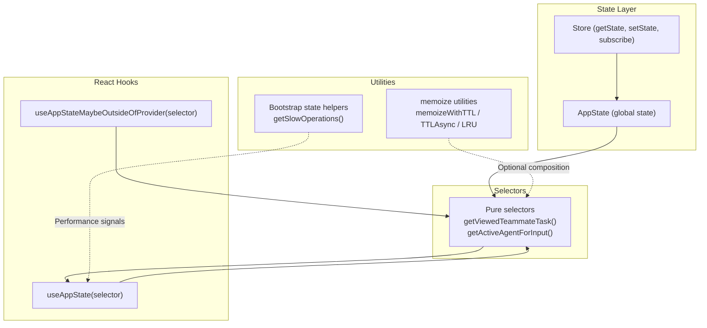
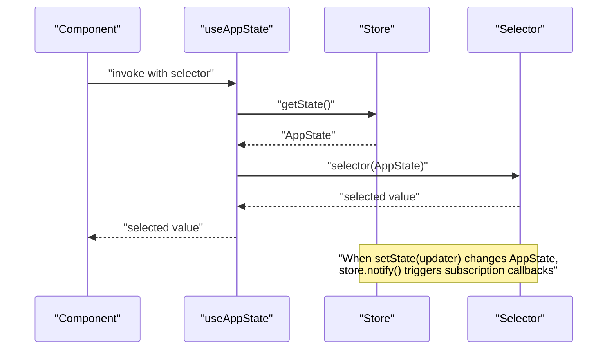
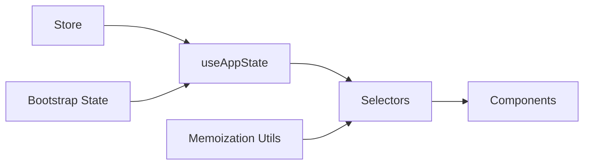

# State Selectors and Derivations

<cite>
**Referenced Files in This Document**
- [AppState.tsx](file://claude_code_src/restored-src/src/state/AppState.tsx)
- [selectors.ts](file://claude_code_src/restored-src/src/state/selectors.ts)
- [store.ts](file://claude_code_src/restored-src/src/state/store.ts)
- [memoize.ts](file://claude_code_src/restored-src/src/utils/memoize.ts)
- [state.ts](file://claude_code_src/restored-src/src/bootstrap/state.ts)
- [ModelPicker.tsx](file://claude_code_src/restored-src/src/components/ModelPicker.tsx)
- [use-select-navigation.ts](file://claude_code_src/restored-src/src/components/CustomSelect/use-select-navigation.ts)
- [select.tsx](file://claude_code_src/restored-src/src/components/CustomSelect/select.tsx)
</cite>

## Table of Contents
1. [Introduction](#introduction)
2. [Project Structure](#project-structure)
3. [Core Components](#core-components)
4. [Architecture Overview](#architecture-overview)
5. [Detailed Component Analysis](#detailed-component-analysis)
6. [Dependency Analysis](#dependency-analysis)
7. [Performance Considerations](#performance-considerations)
8. [Troubleshooting Guide](#troubleshooting-guide)
9. [Conclusion](#conclusion)

## Introduction
This document explains the State Selectors and Derivations system used to derive computed state from the application’s global store. It covers selector architecture, composition patterns, memoization strategies, performance optimization, and practical usage with React hooks. It also includes guidance on debugging, composition for complex queries, and best practices for scaling selectors as applications grow.

## Project Structure
The selector system centers around a lightweight store abstraction and a small set of pure selector functions. React hooks connect selectors to components for efficient, selective re-rendering.

**Diagram sources**
- [store.ts:10-34](file://claude_code_src/restored-src/src/state/store.ts#L10-L34)
- [AppState.tsx:142-163](file://claude_code_src/restored-src/src/state/AppState.tsx#L142-L163)
- [AppState.tsx:186-199](file://claude_code_src/restored-src/src/state/AppState.tsx#L186-L199)
- [selectors.ts:18-76](file://claude_code_src/restored-src/src/state/selectors.ts#L18-L76)
- [memoize.ts:40-270](file://claude_code_src/restored-src/src/utils/memoize.ts#L40-L270)
- [state.ts:1595-1621](file://claude_code_src/restored-src/src/bootstrap/state.ts#L1595-L1621)

**Section sources**
- [store.ts:1-35](file://claude_code_src/restored-src/src/state/store.ts#L1-L35)
- [AppState.tsx:142-199](file://claude_code_src/restored-src/src/state/AppState.tsx#L142-L199)
- [selectors.ts:1-77](file://claude_code_src/restored-src/src/state/selectors.ts#L1-L77)
- [memoize.ts:1-270](file://claude_code_src/restored-src/src/utils/memoize.ts#L1-L270)
- [state.ts:1595-1633](file://claude_code_src/restored-src/src/bootstrap/state.ts#L1595-L1633)

## Core Components
- Store: Minimal reactive store with getState, setState, and subscribe. setState compares previous and next state using Object.is to avoid unnecessary propagation.
- Selectors: Pure functions that derive computed data from AppState slices. They are intentionally simple and free of side effects.
- React Hooks: useAppState and useAppStateMaybeOutsideOfProvider subscribe to store updates and expose selected values to components. They rely on Object.is equality to minimize re-renders.
- Memoization Utilities: Optional helpers for caching computations with TTL, async refresh, and LRU eviction to optimize heavy derivations.

**Section sources**
- [store.ts:10-34](file://claude_code_src/restored-src/src/state/store.ts#L10-L34)
- [selectors.ts:18-76](file://claude_code_src/restored-src/src/state/selectors.ts#L18-L76)
- [AppState.tsx:142-199](file://claude_code_src/restored-src/src/state/AppState.tsx#L142-L199)
- [memoize.ts:40-270](file://claude_code_src/restored-src/src/utils/memoize.ts#L40-L270)

## Architecture Overview
The selector architecture follows a unidirectional data flow:
- Components call useAppState with a selector function.
- The hook computes a selected value from the current store state.
- The store notifies subscribers when state changes.
- React re-renders only when the selected value reference changes (Object.is).

**Diagram sources**
- [AppState.tsx:142-163](file://claude_code_src/restored-src/src/state/AppState.tsx#L142-L163)
- [store.ts:18-27](file://claude_code_src/restored-src/src/state/store.ts#L18-L27)
- [selectors.ts:18-76](file://claude_code_src/restored-src/src/state/selectors.ts#L18-L76)

## Detailed Component Analysis

### Selector Functions
- getViewedTeammateTask: Derives the currently viewed in-process teammate task from AppState, returning undefined if not applicable.
- getActiveAgentForInput: Determines where user input should route based on the current view and task types.

These selectors are pure, composable, and designed to be reused across components.

**Section sources**
- [selectors.ts:18-76](file://claude_code_src/restored-src/src/state/selectors.ts#L18-L76)

### React Hooks for Selectors
- useAppState(selector): Subscribes to store updates and returns the selected value. It warns if a selector returns the entire state object.
- useAppStateMaybeOutsideOfProvider(selector): Safe variant that returns undefined when used outside AppStateProvider.

Both hooks use Object.is to detect changes and avoid unnecessary re-renders.

**Section sources**
- [AppState.tsx:142-163](file://claude_code_src/restored-src/src/state/AppState.tsx#L142-L163)
- [AppState.tsx:186-199](file://claude_code_src/restored-src/src/state/AppState.tsx#L186-L199)

### Memoization Strategies
- memoizeWithTTL: Caches results with TTL, returning stale values immediately while refreshing in the background.
- memoizeWithTTLAsync: Async variant with in-flight deduplication and background refresh.
- memoizeWithLRU: LRU-evicted cache for bounded memory growth.

These utilities enable composing expensive derivations while preserving responsiveness.

**Section sources**
- [memoize.ts:40-270](file://claude_code_src/restored-src/src/utils/memoize.ts#L40-L270)

### Practical Examples and Composition Patterns
- Selector composition: Use smaller selectors to build larger ones. For example, derive a focused model name from a selected model value using a selector that maps options to labels.
- Stable references: Return existing object references from selectors to leverage Object.is equality and prevent re-renders.
- Conditional derivations: Guard against missing data and return undefined or fallbacks to keep selectors predictable.

Example patterns are visible in UI components that transform lists and compute visible counts for selection controls.

**Section sources**
- [ModelPicker.tsx:100-150](file://claude_code_src/restored-src/src/components/ModelPicker.tsx#L100-L150)
- [AppState.tsx:126-141](file://claude_code_src/restored-src/src/state/AppState.tsx#L126-L141)

### Selector-Based Component Optimization
- Prefer multiple small selectors over one monolithic selector to reduce re-renders.
- Use memoization utilities for heavy computations or async operations.
- Avoid returning new objects from selectors; return stable references or primitives.

**Section sources**
- [AppState.tsx:126-141](file://claude_code_src/restored-src/src/state/AppState.tsx#L126-L141)
- [memoize.ts:40-270](file://claude_code_src/restored-src/src/utils/memoize.ts#L40-L270)

### Selector Debugging
- Use safe hooks: useAppStateMaybeOutsideOfProvider to test components outside the provider boundary.
- Monitor performance: Bootstrap state exposes slow operation tracking to surface long-running operations that might impact selector performance.

**Section sources**
- [AppState.tsx:186-199](file://claude_code_src/restored-src/src/state/AppState.tsx#L186-L199)
- [state.ts:1595-1621](file://claude_code_src/restored-src/src/bootstrap/state.ts#L1595-L1621)

### Selector Testing Patterns
- Unit tests: Call selectors with known AppState snapshots and assert derived outputs.
- Edge-case tests: Provide missing IDs, undefined views, or empty collections to verify safe defaults.
- Stability tests: Ensure selectors return the same reference for unchanged inputs to validate Object.is behavior.

[No sources needed since this section provides general guidance]

## Dependency Analysis
The selector system exhibits low coupling and high cohesion:
- Selectors depend only on AppState slices and pure logic.
- React hooks depend on the store contract and rely on Object.is semantics.
- Memoization utilities are optional and layered beneath selectors.

**Diagram sources**
- [store.ts:10-34](file://claude_code_src/restored-src/src/state/store.ts#L10-L34)
- [AppState.tsx:142-163](file://claude_code_src/restored-src/src/state/AppState.tsx#L142-L163)
- [selectors.ts:18-76](file://claude_code_src/restored-src/src/state/selectors.ts#L18-L76)
- [memoize.ts:40-270](file://claude_code_src/restored-src/src/utils/memoize.ts#L40-L270)
- [state.ts:1595-1621](file://claude_code_src/restored-src/src/bootstrap/state.ts#L1595-L1621)

**Section sources**
- [store.ts:10-34](file://claude_code_src/restored-src/src/state/store.ts#L10-L34)
- [AppState.tsx:142-163](file://claude_code_src/restored-src/src/state/AppState.tsx#L142-L163)
- [selectors.ts:18-76](file://claude_code_src/restored-src/src/state/selectors.ts#L18-L76)
- [memoize.ts:40-270](file://claude_code_src/restored-src/src/utils/memoize.ts#L40-L270)
- [state.ts:1595-1621](file://claude_code_src/restored-src/src/bootstrap/state.ts#L1595-L1621)

## Performance Considerations
- Prefer stable references: Returning new objects from selectors causes re-renders even when underlying data is unchanged. Return existing references or primitives.
- Use memoization: For expensive computations or async operations, wrap with memoizeWithTTL or memoizeWithLRU to reduce recomputation and memory growth.
- Compose carefully: Break down complex derivations into smaller selectors to minimize recomputation scope.
- Avoid redundant subscriptions: Use multiple small selectors per component rather than one large selector to limit re-render scope.

[No sources needed since this section provides general guidance]

## Troubleshooting Guide
- Symptom: Component re-renders frequently despite no user-visible changes.
  - Cause: Selector returns a new object reference each time.
  - Fix: Return an existing sub-object reference or primitive; ensure Object.is equality holds.
- Symptom: Selector returns the entire state object.
  - Cause: A selector that returns state instead of a field.
  - Fix: Adjust selector to return a specific property or computed value.
- Symptom: Slow UI during navigation or selection.
  - Cause: Heavy derivations or frequent async refreshes.
  - Fix: Apply memoizeWithTTLAsync or memoizeWithLRU; consider throttling or debouncing.

**Section sources**
- [AppState.tsx:126-141](file://claude_code_src/restored-src/src/state/AppState.tsx#L126-L141)
- [AppState.tsx:142-163](file://claude_code_src/restored-src/src/state/AppState.tsx#L142-L163)
- [memoize.ts:40-270](file://claude_code_src/restored-src/src/utils/memoize.ts#L40-L270)

## Conclusion
The selector and derivation system emphasizes purity, composability, and performance. By keeping selectors simple, returning stable references, and leveraging memoization utilities, applications can scale selector logic efficiently. React hooks integrate seamlessly with the store to ensure selective re-rendering and predictable behavior.