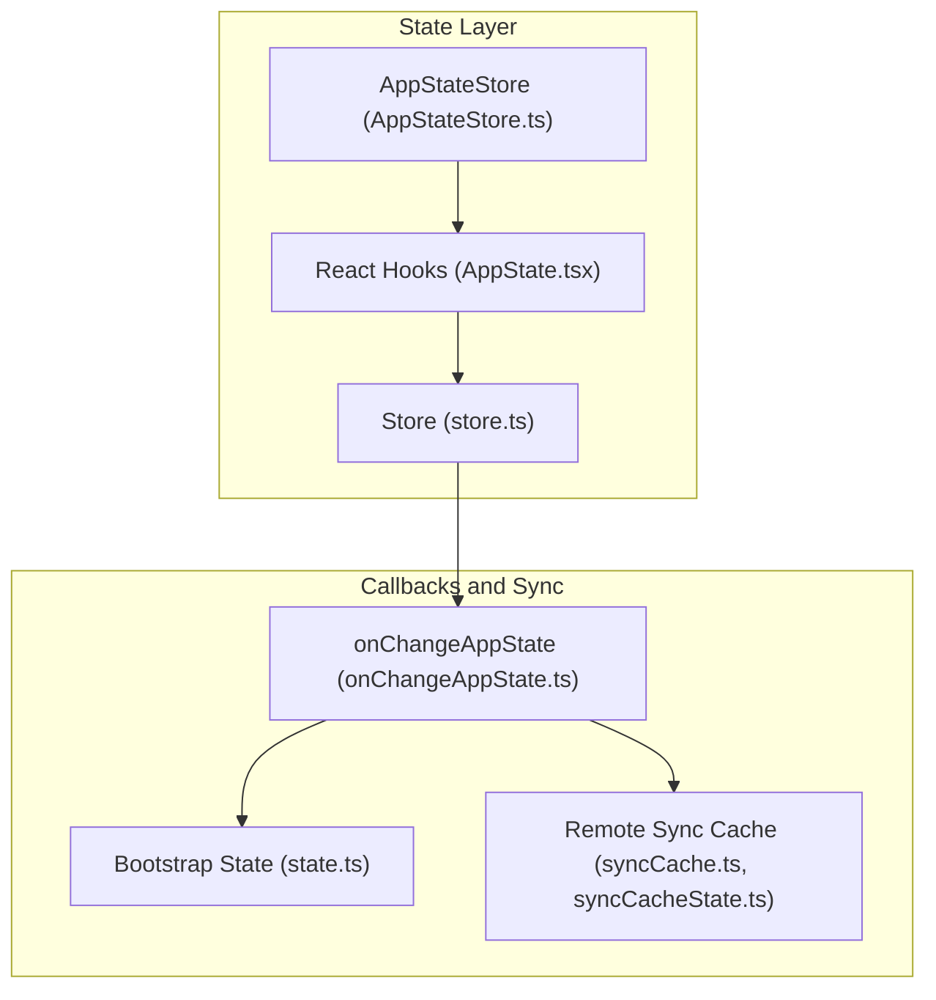
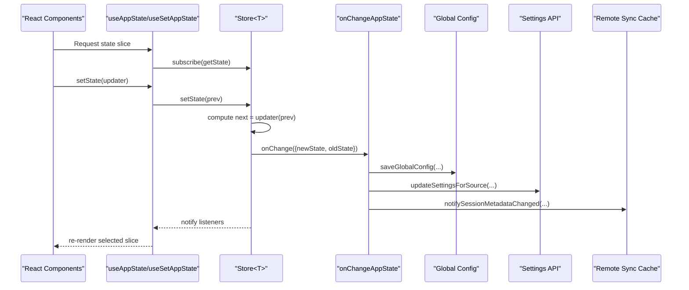
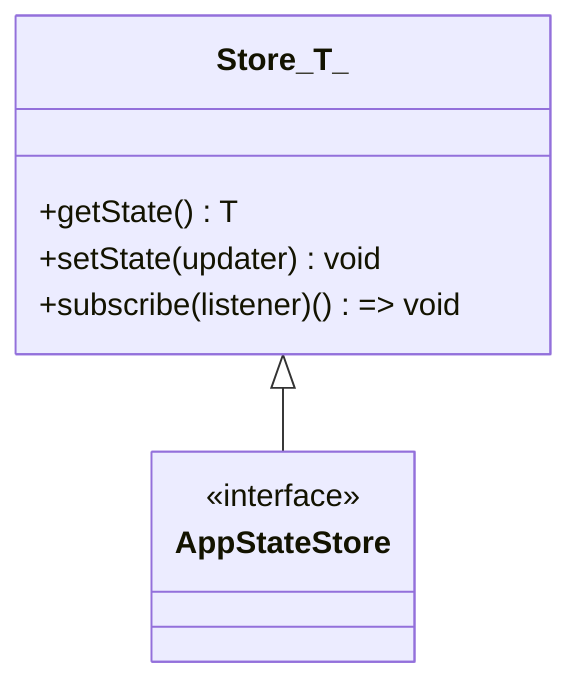
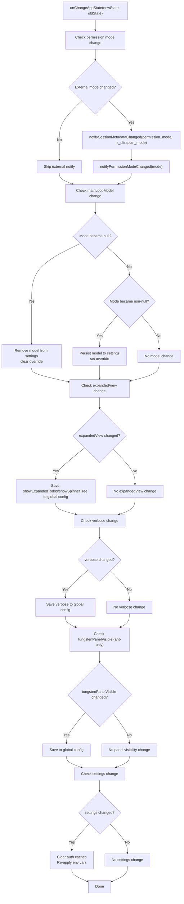
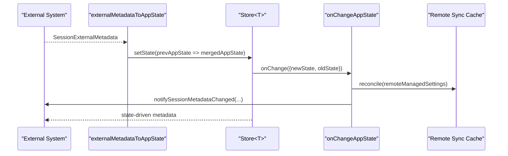
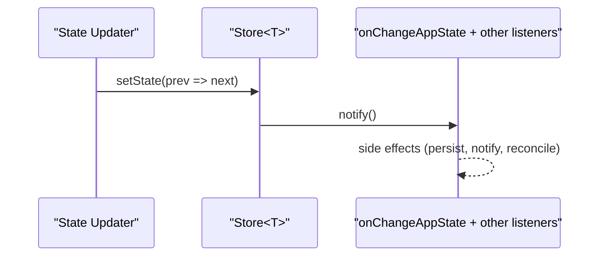
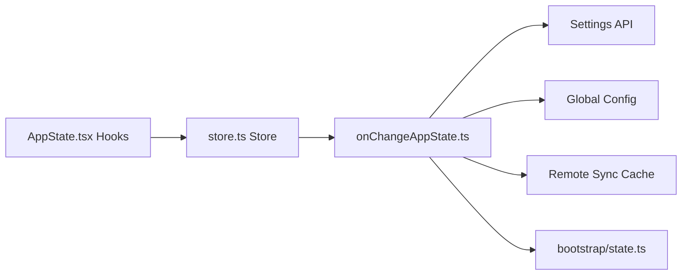

# State Synchronization and Persistence

<cite>
**Referenced Files in This Document**
- [AppState.tsx](file://src/state/AppState.tsx)
- [AppStateStore.ts](file://src/state/AppStateStore.ts)
- [store.ts](file://src/state/store.ts)
- [onChangeAppState.ts](file://src/state/onChangeAppState.ts)
- [state.ts](file://src/bootstrap/state.ts)
- [syncCache.ts](file://src/services/remoteManagedSettings/syncCache.ts)
- [syncCacheState.ts](file://src/services/remoteManagedSettings/syncCacheState.ts)
- [AsyncHookRegistry.ts](file://src/utils/hooks/AsyncHookRegistry.ts)
</cite>

## Table of Contents
1. [Introduction](#introduction)
2. [Project Structure](#project-structure)
3. [Core Components](#core-components)
4. [Architecture Overview](#architecture-overview)
5. [Detailed Component Analysis](#detailed-component-analysis)
6. [Dependency Analysis](#dependency-analysis)
7. [Performance Considerations](#performance-considerations)
8. [Troubleshooting Guide](#troubleshooting-guide)
9. [Conclusion](#conclusion)

## Introduction
This document explains the State Synchronization and Persistence system across the application. It covers how application state is synchronized across layers, how persistence integrates with session storage and external systems, and how state changes propagate and are validated. It also documents the onChangeAppState callback system, state change listeners, and strategies for local, persistent, and remote state alignment in collaborative environments. Finally, it outlines conflict resolution, migration, backup/recovery, and performance considerations for large state objects.

## Project Structure
The state system centers around a lightweight, subscription-based store pattern with React hooks for consumption, and a centralized callback pipeline for propagating state changes to external systems and persistence layers.

**Diagram sources**
- [store.ts:1-35](file://src/state/store.ts#L1-L35)
- [AppStateStore.ts:454-455](file://src/state/AppStateStore.ts#L454-L455)
- [AppState.tsx:142-179](file://src/state/AppState.tsx#L142-L179)
- [onChangeAppState.ts:43-171](file://src/state/onChangeAppState.ts#L43-L171)
- [state.ts:45-257](file://src/bootstrap/state.ts#L45-L257)
- [syncCache.ts](file://src/services/remoteManagedSettings/syncCache.ts)
- [syncCacheState.ts](file://src/services/remoteManagedSettings/syncCacheState.ts)

**Section sources**
- [store.ts:1-35](file://src/state/store.ts#L1-L35)
- [AppStateStore.ts:454-455](file://src/state/AppStateStore.ts#L454-L455)
- [AppState.tsx:142-179](file://src/state/AppState.tsx#L142-L179)
- [onChangeAppState.ts:43-171](file://src/state/onChangeAppState.ts#L43-L171)
- [state.ts:45-257](file://src/bootstrap/state.ts#L45-L257)

## Core Components
- Store<T>: A minimal, immutable-by-equality store with getState, setState, and subscribe. It notifies listeners and invokes an optional onChange callback with old/new state.
- AppStateStore: The typed store for application state, backed by Store<T>.
- React Hooks: useAppState, useSetAppState, and useAppStateStore integrate with React’s useSyncExternalStore for efficient re-renders.
- onChangeAppState: Centralized callback that validates and propagates state changes to external systems and persistence.

Key behaviors:
- Efficient subscriptions: React hooks subscribe via useSyncExternalStore and only re-render when selected slices change.
- Change propagation: onChangeAppState receives old/new state and dispatches side effects (e.g., updating settings, notifying external metadata, applying environment variables).
- Backward compatibility: Persists derived UI flags to global config for legacy compatibility.

**Section sources**
- [store.ts:1-35](file://src/state/store.ts#L1-L35)
- [AppStateStore.ts:89-452](file://src/state/AppStateStore.ts#L89-L452)
- [AppState.tsx:142-179](file://src/state/AppState.tsx#L142-L179)
- [onChangeAppState.ts:43-171](file://src/state/onChangeAppState.ts#L43-L171)

## Architecture Overview
The system follows a layered approach:
- Local state: React hooks read from AppStateStore via useSyncExternalStore.
- Persistent state: onChangeAppState writes to global config and settings APIs for persistence.
- External state: onChangeAppState notifies external systems (e.g., CCR/SDK) and remote sync caches.

**Diagram sources**
- [AppState.tsx:142-179](file://src/state/AppState.tsx#L142-L179)
- [store.ts:20-27](file://src/state/store.ts#L20-L27)
- [onChangeAppState.ts:43-171](file://src/state/onChangeAppState.ts#L43-L171)
- [syncCache.ts](file://src/services/remoteManagedSettings/syncCache.ts)

## Detailed Component Analysis

### Store<T> and AppStateStore
- Store<T> encapsulates state transitions with equality checks to avoid unnecessary updates.
- AppStateStore is the typed interface for application state, enabling strongly-typed subscriptions and updates.

**Diagram sources**
- [store.ts:4-8](file://src/state/store.ts#L4-L8)
- [AppStateStore.ts:454-455](file://src/state/AppStateStore.ts#L454-L455)

**Section sources**
- [store.ts:1-35](file://src/state/store.ts#L1-L35)
- [AppStateStore.ts:89-452](file://src/state/AppStateStore.ts#L89-L452)

### React Hooks for State Consumption
- useAppState: Selects a slice of AppState and subscribes via useSyncExternalStore. It enforces that selectors return existing references to avoid spurious re-renders.
- useSetAppState: Provides a stable reference to setState for components that should not re-render on state changes.
- useAppStateStore: Returns the store directly for non-React integrations.

```mermaid
flowchart TD
Start(["Hook Invocation"]) --> GetState["Get current state from store"]
GetState --> ApplySelector["Apply selector to state"]
ApplySelector --> IsSame{"Selected value unchanged?"}
IsSame --> |Yes| NoRender["Skip re-render"]
IsSame --> |No| Render["Trigger re-render"]
Render --> End(["Done"])
NoRender --> End
```

**Diagram sources**
- [AppState.tsx:142-162](file://src/state/AppState.tsx#L142-L162)

**Section sources**
- [AppState.tsx:142-179](file://src/state/AppState.tsx#L142-L179)

### onChangeAppState: Centralized State Change Callback
onChangeAppState is the single point for reacting to state changes:
- Permission mode synchronization to external metadata and SDK channels.
- Settings synchronization: adds/removes model overrides in settings and applies environment variable changes.
- Global config persistence: writes derived UI flags (e.g., expanded views) and verbosity.
- Credential cache invalidation: clears auth-related caches when settings change.
- Ultraplan mode gating: conditionally sets is_ultraplan_mode based on mode transitions.

**Diagram sources**
- [onChangeAppState.ts:43-171](file://src/state/onChangeAppState.ts#L43-L171)

**Section sources**
- [onChangeAppState.ts:43-171](file://src/state/onChangeAppState.ts#L43-L171)

### Bootstrap State and Session Identity
Bootstrap state maintains session-scoped, ephemeral flags and counters that influence state behavior:
- Session identifiers, telemetry providers, and counters.
- Flags for interactive mode, trust, and persistence disabling.
- Utilities for switching sessions and signaling changes to dependent modules.

These bootstrap flags can influence how state synchronization behaves (e.g., disabling persistence for a session).

**Section sources**
- [state.ts:45-257](file://src/bootstrap/state.ts#L45-L257)

### Remote State Synchronization and Collaboration
Remote synchronization is coordinated via:
- externalMetadataToAppState: Restores external metadata (e.g., permission_mode, is_ultraplan_mode) into AppState.
- notifySessionMetadataChanged: Pushes AppState-derived metadata to external systems (e.g., CCR/SDK).
- Remote sync cache: Maintains a cache of remote-managed settings and state to reconcile differences and reduce conflicts.

**Diagram sources**
- [onChangeAppState.ts:24-41](file://src/state/onChangeAppState.ts#L24-L41)
- [onChangeAppState.ts:86-92](file://src/state/onChangeAppState.ts#L86-L92)
- [syncCache.ts](file://src/services/remoteManagedSettings/syncCache.ts)
- [syncCacheState.ts](file://src/services/remoteManagedSettings/syncCacheState.ts)

**Section sources**
- [onChangeAppState.ts:24-41](file://src/state/onChangeAppState.ts#L24-L41)
- [onChangeAppState.ts:86-92](file://src/state/onChangeAppState.ts#L86-L92)
- [syncCache.ts](file://src/services/remoteManagedSettings/syncCache.ts)
- [syncCacheState.ts](file://src/services/remoteManagedSettings/syncCacheState.ts)

### State Change Listeners and Propagation
- Store<T> maintains a set of listeners and notifies them on state changes.
- onChangeAppState acts as a global listener to propagate changes to external systems and persistence.

**Diagram sources**
- [store.ts:29-32](file://src/state/store.ts#L29-L32)
- [store.ts:25](file://src/state/store.ts#L25)
- [onChangeAppState.ts:25](file://src/state/onChangeAppState.ts#L25)

**Section sources**
- [store.ts:1-35](file://src/state/store.ts#L1-L35)
- [onChangeAppState.ts:25](file://src/state/onChangeAppState.ts#L25)

## Dependency Analysis
- React hooks depend on AppStateStore for state and subscriptions.
- onChangeAppState depends on:
  - Settings APIs for persistence.
  - Global config utilities for UI flags.
  - External metadata notification utilities for collaboration.
  - Remote sync cache for reconciliation.
- Bootstrap state influences session behavior and can gate persistence.

**Diagram sources**
- [AppState.tsx:142-179](file://src/state/AppState.tsx#L142-L179)
- [store.ts:1-35](file://src/state/store.ts#L1-L35)
- [onChangeAppState.ts:43-171](file://src/state/onChangeAppState.ts#L43-L171)
- [state.ts:45-257](file://src/bootstrap/state.ts#L45-L257)
- [syncCache.ts](file://src/services/remoteManagedSettings/syncCache.ts)

**Section sources**
- [AppState.tsx:142-179](file://src/state/AppState.tsx#L142-L179)
- [store.ts:1-35](file://src/state/store.ts#L1-L35)
- [onChangeAppState.ts:43-171](file://src/state/onChangeAppState.ts#L43-L171)
- [state.ts:45-257](file://src/bootstrap/state.ts#L45-L257)

## Performance Considerations
- Efficient re-renders: useSyncExternalStore and Object.is comparisons minimize unnecessary React updates.
- Equality checks: Store<T> avoids notifying listeners when the new state equals the previous state.
- Debounced timestamps: Interaction timestamps are batched to reduce frequent Date.now() calls.
- Large state objects: Prefer selecting small slices with useAppState to limit re-renders. Avoid returning new objects from selectors to maintain referential equality.

[No sources needed since this section provides general guidance]

## Troubleshooting Guide
Common issues and resolutions:
- Selector returns original state: Ensure selectors return existing references to avoid triggering errors and excessive re-renders.
- Settings not persisting: Verify that onChangeAppState is invoked and that settings updates are applied for the correct source.
- External metadata out of sync: Confirm notifySessionMetadataChanged is called when permission mode changes and that external systems are subscribed to metadata updates.
- Credential cache stale: After settings changes, caches are cleared automatically; if still stale, confirm that settings.env changes are applied.

**Section sources**
- [AppState.tsx:142-162](file://src/state/AppState.tsx#L142-L162)
- [onChangeAppState.ts:154-170](file://src/state/onChangeAppState.ts#L154-L170)
- [onChangeAppState.ts:65-92](file://src/state/onChangeAppState.ts#L65-L92)

## Conclusion
The State Synchronization and Persistence system combines a lean Store<T>, React hooks for efficient consumption, and a centralized onChangeAppState callback to propagate changes to external systems and persistence. It supports robust synchronization across local, persistent, and remote layers, with careful attention to performance and correctness. The design enables scalable state management for collaborative environments while maintaining backward compatibility and minimizing unnecessary updates.