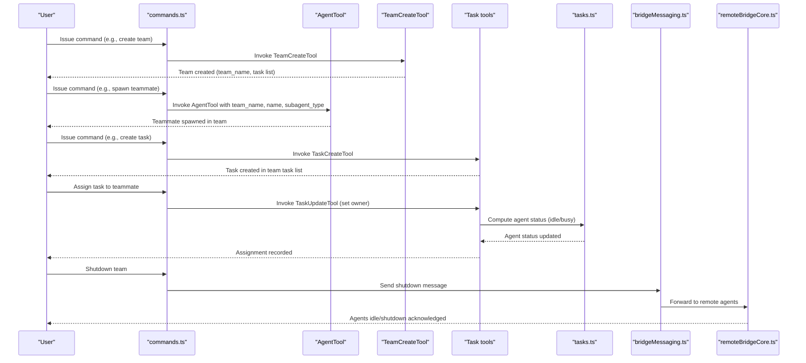
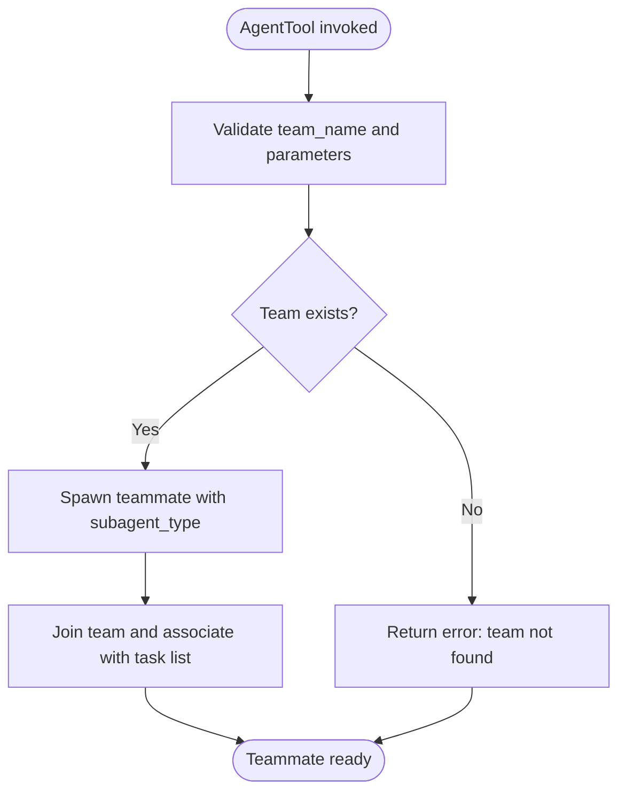
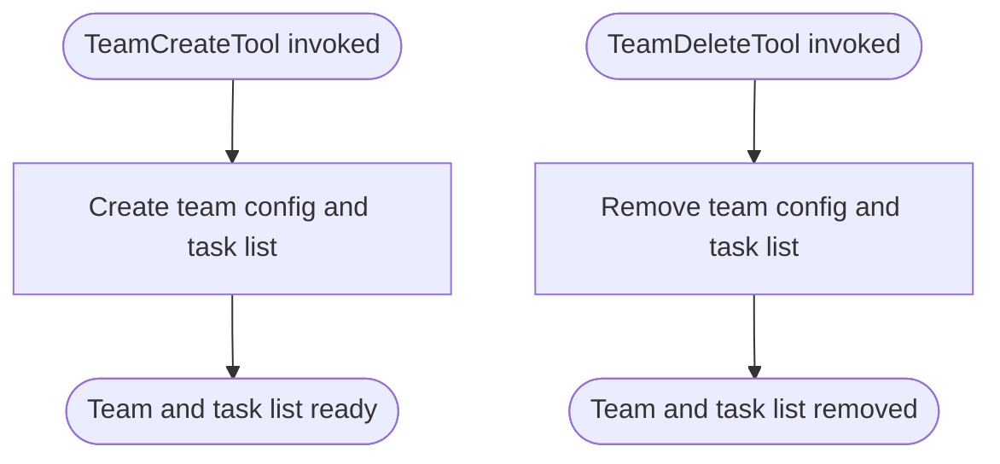
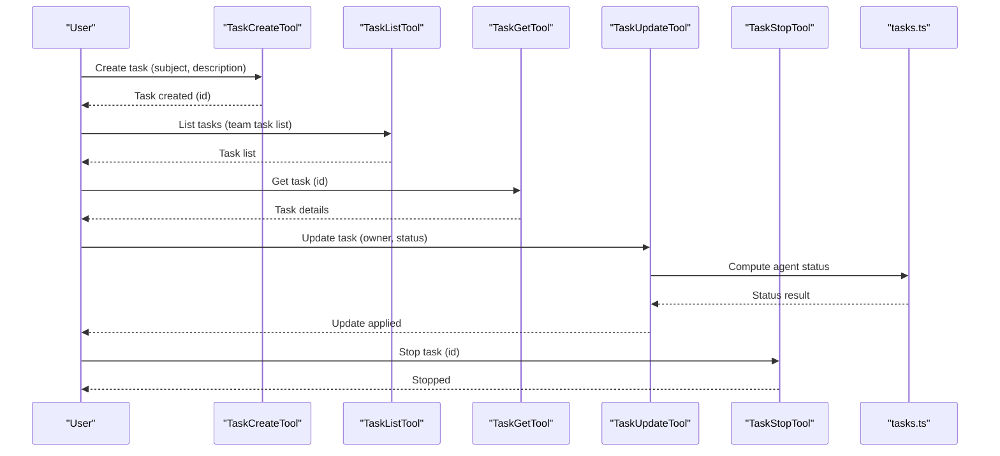
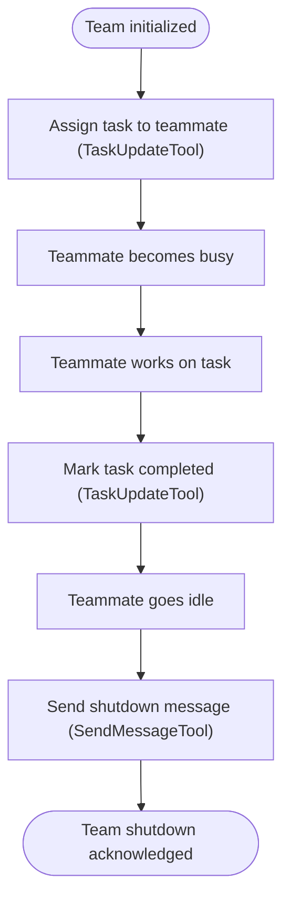
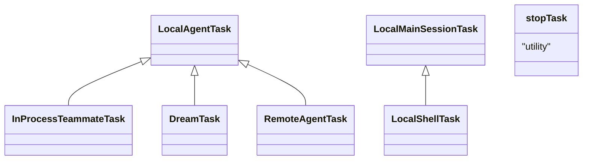
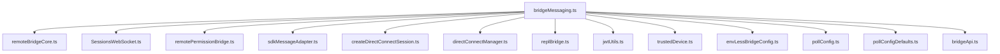
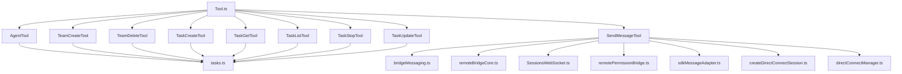

# Agent and Coordination Tools

<cite>
**Referenced Files in This Document**
- [README.md](file://README.md)
- [Tool.ts](file://restored-src/src/Tool.ts)
- [tasks.ts](file://restored-src/src/utils/tasks.ts)
- [AgentTool](file://restored-src/src/tools/AgentTool)
- [TeamCreateTool](file://restored-src/src/tools/TeamCreateTool)
- [TeamDeleteTool](file://restored-src/src/tools/TeamDeleteTool)
- [TaskCreateTool](file://restored-src/src/tools/TaskCreateTool)
- [TaskGetTool](file://restored-src/src/tools/TaskGetTool)
- [TaskListTool](file://restored-src/src/tools/TaskListTool)
- [TaskStopTool](file://restored-src/src/tools/TaskStopTool)
- [TaskUpdateTool](file://restored-src/src/tools/TaskUpdateTool)
- [SendMessageTool](file://restored-src/src/tools/SendMessageTool)
- [LocalAgentTask](file://restored-src/src/tasks/LocalAgentTask)
- [RemoteAgentTask](file://restored-src/src/tasks/RemoteAgentTask)
- [LocalMainSessionTask](file://restored-src/src/tasks/LocalMainSessionTask)
- [LocalShellTask](file://restored-src/src/tasks/LocalShellTask)
- [InProcessTeammateTask](file://restored-src/src/tasks/InProcessTeammateTask)
- [DreamTask](file://restored-src/src/tasks/DreamTask)
- [stopTask](file://restored-src/src/tasks/stopTask)
- [types.ts](file://restored-src/src/tasks/types.ts)
- [commands.ts](file://restored-src/src/commands.ts)
- [hooks.ts](file://restored-src/src/hooks/useMergedTools.ts)
- [bridgeApi.ts](file://restored-src/src/bridge/bridgeApi.ts)
- [bridgeMessaging.ts](file://restored-src/src/bridge/bridgeMessaging.ts)
- [remoteBridgeCore.ts](file://restored-src/src/bridge/remoteBridgeCore.ts)
- [replBridge.ts](file://restored-src/src/bridge/replBridge.ts)
- [jwtUtils.ts](file://restored-src/src/bridge/jwtUtils.ts)
- [trustedDevice.ts](file://restored-src/src/bridge/trustedDevice.ts)
- [envLessBridgeConfig.ts](file://restored-src/src/bridge/envLessBridgeConfig.ts)
- [pollConfig.ts](file://restored-src/src/bridge/pollConfig.ts)
- [pollConfigDefaults.ts](file://restored-src/src/bridge/pollConfigDefaults.ts)
- [sessionIdCompat.ts](file://restored-src/src/bridge/sessionIdCompat.ts)
- [sessionRunner.ts](file://restored-src/src/bridge/sessionRunner.ts)
- [flushGate.ts](file://restored-src/src/bridge/flushGate.ts)
- [inboundMessages.ts](file://restored-src/src/bridge/inboundMessages.ts)
- [inboundAttachments.ts](file://restored-src/src/bridge/inboundAttachments.ts)
- [capacityWake.ts](file://restored-src/src/bridge/capacityWake.ts)
- [codeSessionApi.ts](file://restored-src/src/bridge/codeSessionApi.ts)
- [createSession.ts](file://restored-src/src/bridge/createSession.ts)
- [debugUtils.ts](file://restored-src/src/bridge/debugUtils.ts)
- [bridgeStatusUtil.ts](file://restored-src/src/bridge/bridgeStatusUtil.ts)
- [bridgeUI.ts](file://restored-src/src/bridge/bridgeUI.ts)
- [workSecret.ts](file://restored-src/src/bridge/workSecret.ts)
- [initReplBridge.ts](file://restored-src/src/bridge/initReplBridge.ts)
- [replBridgeHandle.ts](file://restored-src/src/bridge/replBridgeHandle.ts)
- [replBridgeTransport.ts](file://restored-src/src/bridge/replBridgeTransport.ts)
- [sessions.ts](file://restored-src/src/remote/SessionsWebSocket.ts)
- [remotePermissionBridge.ts](file://restored-src/src/remote/remotePermissionBridge.ts)
- [sdkMessageAdapter.ts](file://restored-src/src/remote/sdkMessageAdapter.ts)
- [createDirectConnectSession.ts](file://restored-src/src/server/createDirectConnectSession.ts)
- [directConnectManager.ts](file://restored-src/src/server/directConnectManager.ts)
- [types.ts](file://restored-src/src/server/types.ts)
- [bridgeEnabled.ts](file://restored-src/src/bridge/bridgeEnabled.ts)
- [bridgePointer.ts](file://restored-src/src/bridge/bridgePointer.ts)
- [bridgeConfig.ts](file://restored-src/src/bridge/bridgeConfig.ts)
- [bridgeDebug.ts](file://restored-src/src/bridge/bridgeDebug.ts)
- [bridgePermissionCallbacks.ts](file://restored-src/src/bridge/bridgePermissionCallbacks.ts)
- [bridgeStatusUtil.ts](file://restored-src/src/bridge/bridgeStatusUtil.ts)
- [bridgeUI.ts](file://restored-src/src/bridge/bridgeUI.ts)
- [capacityWake.ts](file://restored-src/src/bridge/capacityWake.ts)
- [codeSessionApi.ts](file://restored-src/src/bridge/codeSessionApi.ts)
- [createSession.ts](file://restored-src/src/bridge/createSession.ts)
- [debugUtils.ts](file://restored-src/src/bridge/debugUtils.ts)
- [envLessBridgeConfig.ts](file://restored-src/src/bridge/envLessBridgeConfig.ts)
- [flushGate.ts](file://restored-src/src/bridge/flushGate.ts)
- [inboundMessages.ts](file://restored-src/src/bridge/inboundMessages.ts)
- [inboundAttachments.ts](file://restored-src/src/bridge/inboundAttachments.ts)
- [initReplBridge.ts](file://restored-src/src/bridge/initReplBridge.ts)
- [jwtUtils.ts](file://restored-src/src/bridge/jwtUtils.ts)
- [pollConfig.ts](file://restored-src/src/bridge/pollConfig.ts)
- [pollConfigDefaults.ts](file://restored-src/src/bridge/pollConfigDefaults.ts)
- [replBridge.ts](file://restored-src/src/bridge/replBridge.ts)
- [replBridgeHandle.ts](file://restored-src/src/bridge/replBridgeHandle.ts)
- [replBridgeTransport.ts](file://restored-src/src/bridge/replBridgeTransport.ts)
- [remoteBridgeCore.ts](file://restored-src/src/bridge/remoteBridgeCore.ts)
- [sessionIdCompat.ts](file://restored-src/src/bridge/sessionIdCompat.ts)
- [sessionRunner.ts](file://restored-src/src/bridge/sessionRunner.ts)
- [trustedDevice.ts](file://restored-src/src/bridge/trustedDevice.ts)
- [workSecret.ts](file://restored-src/src/bridge/workSecret.ts)
- [bridgeEnabled.ts](file://restored-src/src/bridge/bridgeEnabled.ts)
- [bridgePointer.ts](file://restored-src/src/bridge/bridgePointer.ts)
- [bridgeConfig.ts](file://restored-src/src/bridge/bridgeConfig.ts)
- [bridgeDebug.ts](file://restored-src/src/bridge/bridgeDebug.ts)
- [bridgePermissionCallbacks.ts](file://restored-src/src/bridge/bridgePermissionCallbacks.ts)
- [bridgeStatusUtil.ts](file://restored-src/src/bridge/bridgeStatusUtil.ts)
- [bridgeUI.ts](file://restored-src/src/bridge/bridgeUI.ts)
- [capacityWake.ts](file://restored-src/src/bridge/capacityWake.ts)
- [codeSessionApi.ts](file://restored-src/src/bridge/codeSessionApi.ts)
- [createSession.ts](file://restored-src/src/bridge/createSession.ts)
- [debugUtils.ts](file://restored-src/src/bridge/debugUtils.ts)
- [envLessBridgeConfig.ts](file://restored-src/src/bridge/envLessBridgeConfig.ts)
- [flushGate.ts](file://restored-src/src/bridge/flushGate.ts)
- [inboundMessages.ts](file://restored-src/src/bridge/inboundMessages.ts)
- [inboundAttachments.ts](file://restored-src/src/bridge/inboundAttachments.ts)
- [initReplBridge.ts](file://restored-src/src/bridge/initReplBridge.ts)
- [jwtUtils.ts](file://restored-src/src/bridge/jwtUtils.ts)
- [pollConfig.ts](file://restored-src/src/bridge/pollConfig.ts)
- [pollConfigDefaults.ts](file://restored-src/src/bridge/pollConfigDefaults.ts)
- [replBridge.ts](file://restored-src/src/bridge/replBridge.ts)
- [replBridgeHandle.ts](file://restored-src/src/bridge/replBridgeHandle.ts)
- [replBridgeTransport.ts](file://restored-src/src/bridge/replBridgeTransport.ts)
- [remoteBridgeCore.ts](file://restored-src/src/bridge/remoteBridgeCore.ts)
- [sessionIdCompat.ts](file://restored-src/src/bridge/sessionIdCompat.ts)
- [sessionRunner.ts](file://restored-src/src/bridge/sessionRunner.ts)
- [trustedDevice.ts](file://restored-src/src/bridge/trustedDevice.ts)
- [workSecret.ts](file://restored-src/src/bridge/workSecret.ts)
</cite>

## Table of Contents
1. [Introduction](#introduction)
2. [Project Structure](#project-structure)
3. [Core Components](#core-components)
4. [Architecture Overview](#architecture-overview)
5. [Detailed Component Analysis](#detailed-component-analysis)
6. [Dependency Analysis](#dependency-analysis)
7. [Performance Considerations](#performance-considerations)
8. [Troubleshooting Guide](#troubleshooting-guide)
9. [Conclusion](#conclusion)
10. [Appendices](#appendices)

## Introduction
This document describes the agent and coordination tools that enable multi-agent orchestration, team formation, and task lifecycle management. It covers:
- AgentTool for agent management and spawning teammates within a team
- TeamCreateTool and TeamDeleteTool for team lifecycle operations
- Task management tools for task creation, listing, retrieval, updating, stopping, and output handling
- Agent orchestration, team coordination, and task scheduling capabilities
- Practical examples for agent creation, team formation, task assignment, and coordination patterns
- Tool-specific parameters, agent communication protocols, and coordination strategies
- Security, resource allocation, and performance monitoring considerations

## Project Structure
The agent and coordination capabilities are implemented across several subsystems:
- Tools: dedicated tool implementations under src/tools for agent/team/task operations
- Tasks: task abstractions and lifecycle under src/tasks
- Utilities: task status computation and team membership helpers under src/utils
- Bridge and Remote: secure transport and messaging infrastructure under src/bridge and src/remote
- Commands and Hooks: command registration and tool merging under src/commands.ts and src/hooks/useMergedTools.ts

```mermaid
graph TB
subgraph "Tools"
AT["AgentTool"]
TCT["TeamCreateTool"]
TDT["TeamDeleteTool"]
TKT["TaskCreateTool"]
TGT["TaskGetTool"]
TLIT["TaskListTool"]
TST["TaskStopTool"]
TUT["TaskUpdateTool"]
SMT["SendMessageTool"]
end
subgraph "Tasks"
LAT["LocalAgentTask"]
RAT["RemoteAgentTask"]
LMST["LocalMainSessionTask"]
LSLT["LocalShellTask"]
IPT["InProcessTeammateTask"]
DYT["DreamTask"]
STOPT["stopTask"]
end
subgraph "Utilities"
TS["tasks.ts<br/>Agent status & task list helpers"]
end
subgraph "Bridge & Remote"
BA["bridgeApi.ts"]
BM["bridgeMessaging.ts"]
RBC["remoteBridgeCore.ts"]
RB["replBridge.ts"]
JWT["jwtUtils.ts"]
TD["trustedDevice.ts"]
ELC["envLessBridgeConfig.ts"]
PC["pollConfig.ts"]
PCD["pollConfigDefaults.ts"]
SS["SessionsWebSocket.ts"]
RP["remotePermissionBridge.ts"]
SMA["sdkMessageAdapter.ts"]
CDCS["createDirectConnectSession.ts"]
DCM["directConnectManager.ts"]
end
AT --> TCT
AT --> TKT
AT --> TUT
TCT --> TKT
TCT --> TUT
TKT --> TLIT
TGT --> TLIT
TST --> STOPT
SMT --> BA
SMT --> BM
SMT --> RBC
SMT --> RB
SMT --> SS
SMT --> RP
SMT --> SMA
SMT --> CDCS
SMT --> DCM
TS --> TLIT
TS --> TUT
```

**Diagram sources**
- [AgentTool](file://restored-src/src/tools/AgentTool)
- [TeamCreateTool](file://restored-src/src/tools/TeamCreateTool)
- [TeamDeleteTool](file://restored-src/src/tools/TeamDeleteTool)
- [TaskCreateTool](file://restored-src/src/tools/TaskCreateTool)
- [TaskGetTool](file://restored-src/src/tools/TaskGetTool)
- [TaskListTool](file://restored-src/src/tools/TaskListTool)
- [TaskStopTool](file://restored-src/src/tools/TaskStopTool)
- [TaskUpdateTool](file://restored-src/src/tools/TaskUpdateTool)
- [SendMessageTool](file://restored-src/src/tools/SendMessageTool)
- [LocalAgentTask](file://restored-src/src/tasks/LocalAgentTask)
- [RemoteAgentTask](file://restored-src/src/tasks/RemoteAgentTask)
- [LocalMainSessionTask](file://restored-src/src/tasks/LocalMainSessionTask)
- [LocalShellTask](file://restored-src/src/tasks/LocalShellTask)
- [InProcessTeammateTask](file://restored-src/src/tasks/InProcessTeammateTask)
- [DreamTask](file://restored-src/src/tasks/DreamTask)
- [stopTask](file://restored-src/src/tasks/stopTask)
- [tasks.ts](file://restored-src/src/utils/tasks.ts)
- [bridgeApi.ts](file://restored-src/src/bridge/bridgeApi.ts)
- [bridgeMessaging.ts](file://restored-src/src/bridge/bridgeMessaging.ts)
- [remoteBridgeCore.ts](file://restored-src/src/bridge/remoteBridgeCore.ts)
- [replBridge.ts](file://restored-src/src/bridge/replBridge.ts)
- [jwtUtils.ts](file://restored-src/src/bridge/jwtUtils.ts)
- [trustedDevice.ts](file://restored-src/src/bridge/trustedDevice.ts)
- [envLessBridgeConfig.ts](file://restored-src/src/bridge/envLessBridgeConfig.ts)
- [pollConfig.ts](file://restored-src/src/bridge/pollConfig.ts)
- [pollConfigDefaults.ts](file://restored-src/src/bridge/pollConfigDefaults.ts)
- [SessionsWebSocket.ts](file://restored-src/src/remote/SessionsWebSocket.ts)
- [remotePermissionBridge.ts](file://restored-src/src/remote/remotePermissionBridge.ts)
- [sdkMessageAdapter.ts](file://restored-src/src/remote/sdkMessageAdapter.ts)
- [createDirectConnectSession.ts](file://restored-src/src/server/createDirectConnectSession.ts)
- [directConnectManager.ts](file://restored-src/src/server/directConnectManager.ts)

**Section sources**
- [README.md](file://README.md)
- [commands.ts](file://restored-src/src/commands.ts)
- [hooks.ts](file://restored-src/src/hooks/useMergedTools.ts)

## Core Components
This section outlines the primary building blocks for agent and coordination:

- AgentTool
  - Purpose: Spawn and manage teammates within a team, including subagent type selection and team association
  - Key parameters: team_name, name, subagent_type, description, and optional metadata
  - Behavior: Creates a teammate entry in the team configuration and associates it with the team’s task list
  - Related utilities: Team workflow guidance and task ownership semantics are documented alongside the tool prompt

- TeamCreateTool
  - Purpose: Create a new team and its associated task list
  - Key parameters: team_name, description
  - Behavior: Produces a team file and a corresponding task list directory; establishes a 1:1 relationship between team and task list

- TeamDeleteTool
  - Purpose: Remove a team and its task list
  - Key parameters: team_name
  - Behavior: Cleans up team configuration and task list artifacts

- Task management tools
  - TaskCreateTool: Create tasks in a team’s task list
  - TaskGetTool: Retrieve a specific task by ID
  - TaskListTool: List tasks in a team’s task list
  - TaskUpdateTool: Update task attributes (e.g., owner assignment, status)
  - TaskStopTool: Stop or cancel a running task
  - TaskOutputTool: Access task output (if applicable)

- Agent orchestration and coordination
  - Agent status computation: Determines whether agents are idle or busy based on unresolved tasks
  - Team workflow: Creation, task assignment, teammate idle cycles, graceful shutdown via message signaling

**Section sources**
- [AgentTool](file://restored-src/src/tools/AgentTool)
- [TeamCreateTool](file://restored-src/src/tools/TeamCreateTool)
- [TeamDeleteTool](file://restored-src/src/tools/TeamDeleteTool)
- [TaskCreateTool](file://restored-src/src/tools/TaskCreateTool)
- [TaskGetTool](file://restored-src/src/tools/TaskGetTool)
- [TaskListTool](file://restored-src/src/tools/TaskListTool)
- [TaskStopTool](file://restored-src/src/tools/TaskStopTool)
- [TaskUpdateTool](file://restored-src/src/tools/TaskUpdateTool)
- [tasks.ts](file://restored-src/src/utils/tasks.ts)

## Architecture Overview
The agent and coordination system integrates tools, tasks, and transport layers to enable secure, distributed agent operations:

**Diagram sources**
- [commands.ts](file://restored-src/src/commands.ts)
- [AgentTool](file://restored-src/src/tools/AgentTool)
- [TeamCreateTool](file://restored-src/src/tools/TeamCreateTool)
- [TaskCreateTool](file://restored-src/src/tools/TaskCreateTool)
- [TaskUpdateTool](file://restored-src/src/tools/TaskUpdateTool)
- [tasks.ts](file://restored-src/src/utils/tasks.ts)
- [bridgeMessaging.ts](file://restored-src/src/bridge/bridgeMessaging.ts)
- [remoteBridgeCore.ts](file://restored-src/src/bridge/remoteBridgeCore.ts)

## Detailed Component Analysis

### AgentTool
AgentTool orchestrates teammate creation and management within a team. It enforces team-task list alignment and supports subagent type selection aligned with available tools.

**Diagram sources**
- [AgentTool](file://restored-src/src/tools/AgentTool)
- [TeamCreateTool](file://restored-src/src/tools/TeamCreateTool)

**Section sources**
- [AgentTool](file://restored-src/src/tools/AgentTool)
- [TeamCreateTool](file://restored-src/src/tools/TeamCreateTool)

### TeamCreateTool and TeamDeleteTool
TeamCreateTool establishes a new team and its task list, while TeamDeleteTool removes them.

**Diagram sources**
- [TeamCreateTool](file://restored-src/src/tools/TeamCreateTool)
- [TeamDeleteTool](file://restored-src/src/tools/TeamDeleteTool)

**Section sources**
- [TeamCreateTool](file://restored-src/src/tools/TeamCreateTool)
- [TeamDeleteTool](file://restored-src/src/tools/TeamDeleteTool)

### Task Management Tools
TaskCreateTool, TaskGetTool, TaskListTool, TaskUpdateTool, TaskStopTool, and TaskOutputTool collectively manage the task lifecycle within a team’s task list.

**Diagram sources**
- [TaskCreateTool](file://restored-src/src/tools/TaskCreateTool)
- [TaskListTool](file://restored-src/src/tools/TaskListTool)
- [TaskGetTool](file://restored-src/src/tools/TaskGetTool)
- [TaskUpdateTool](file://restored-src/src/tools/TaskUpdateTool)
- [TaskStopTool](file://restored-src/src/tools/TaskStopTool)
- [tasks.ts](file://restored-src/src/utils/tasks.ts)

**Section sources**
- [TaskCreateTool](file://restored-src/src/tools/TaskCreateTool)
- [TaskListTool](file://restored-src/src/tools/TaskListTool)
- [TaskGetTool](file://restored-src/src/tools/TaskGetTool)
- [TaskUpdateTool](file://restored-src/src/tools/TaskUpdateTool)
- [TaskStopTool](file://restored-src/src/tools/TaskStopTool)
- [tasks.ts](file://restored-src/src/utils/tasks.ts)

### Agent Orchestration and Team Coordination
Agent orchestration centers on assigning tasks to idle teammates and transitioning teammates to idle after turns. The system computes agent status based on unresolved tasks and supports graceful shutdown via message signaling.

**Diagram sources**
- [TaskUpdateTool](file://restored-src/src/tools/TaskUpdateTool)
- [SendMessageTool](file://restored-src/src/tools/SendMessageTool)
- [tasks.ts](file://restored-src/src/utils/tasks.ts)

**Section sources**
- [tasks.ts](file://restored-src/src/utils/tasks.ts)
- [TaskUpdateTool](file://restored-src/src/tools/TaskUpdateTool)
- [SendMessageTool](file://restored-src/src/tools/SendMessageTool)

### Task Lifecycle Abstractions
Task abstractions encapsulate agent and session lifecycles, enabling local and remote agent operations.

**Diagram sources**
- [LocalAgentTask](file://restored-src/src/tasks/LocalAgentTask)
- [RemoteAgentTask](file://restored-src/src/tasks/RemoteAgentTask)
- [LocalMainSessionTask](file://restored-src/src/tasks/LocalMainSessionTask)
- [LocalShellTask](file://restored-src/src/tasks/LocalShellTask)
- [InProcessTeammateTask](file://restored-src/src/tasks/InProcessTeammateTask)
- [DreamTask](file://restored-src/src/tasks/DreamTask)
- [stopTask](file://restored-src/src/tasks/stopTask)

**Section sources**
- [LocalAgentTask](file://restored-src/src/tasks/LocalAgentTask)
- [RemoteAgentTask](file://restored-src/src/tasks/RemoteAgentTask)
- [LocalMainSessionTask](file://restored-src/src/tasks/LocalMainSessionTask)
- [LocalShellTask](file://restored-src/src/tasks/LocalShellTask)
- [InProcessTeammateTask](file://restored-src/src/tasks/InProcessTeammateTask)
- [DreamTask](file://restored-src/src/tasks/DreamTask)
- [stopTask](file://restored-src/src/tasks/stopTask)

### Communication Protocols and Transport
Agent communication leverages a secure bridge and messaging infrastructure:
- Bridge messaging: routing tool use requests and responses
- Remote bridge core: forwarding messages to remote agents
- Sessions WebSocket: maintaining persistent connections
- Permission bridge and SDK message adapter: enforcing permissions and adapting SDK messages
- Direct connect session and manager: establishing secure sessions

**Diagram sources**
- [bridgeMessaging.ts](file://restored-src/src/bridge/bridgeMessaging.ts)
- [remoteBridgeCore.ts](file://restored-src/src/bridge/remoteBridgeCore.ts)
- [SessionsWebSocket.ts](file://restored-src/src/remote/SessionsWebSocket.ts)
- [remotePermissionBridge.ts](file://restored-src/src/remote/remotePermissionBridge.ts)
- [sdkMessageAdapter.ts](file://restored-src/src/remote/sdkMessageAdapter.ts)
- [createDirectConnectSession.ts](file://restored-src/src/server/createDirectConnectSession.ts)
- [directConnectManager.ts](file://restored-src/src/server/directConnectManager.ts)
- [replBridge.ts](file://restored-src/src/bridge/replBridge.ts)
- [jwtUtils.ts](file://restored-src/src/bridge/jwtUtils.ts)
- [trustedDevice.ts](file://restored-src/src/bridge/trustedDevice.ts)
- [envLessBridgeConfig.ts](file://restored-src/src/bridge/envLessBridgeConfig.ts)
- [pollConfig.ts](file://restored-src/src/bridge/pollConfig.ts)
- [pollConfigDefaults.ts](file://restored-src/src/bridge/pollConfigDefaults.ts)
- [bridgeApi.ts](file://restored-src/src/bridge/bridgeApi.ts)

**Section sources**
- [bridgeMessaging.ts](file://restored-src/src/bridge/bridgeMessaging.ts)
- [remoteBridgeCore.ts](file://restored-src/src/bridge/remoteBridgeCore.ts)
- [SessionsWebSocket.ts](file://restored-src/src/remote/SessionsWebSocket.ts)
- [remotePermissionBridge.ts](file://restored-src/src/remote/remotePermissionBridge.ts)
- [sdkMessageAdapter.ts](file://restored-src/src/remote/sdkMessageAdapter.ts)
- [createDirectConnectSession.ts](file://restored-src/src/server/createDirectConnectSession.ts)
- [directConnectManager.ts](file://restored-src/src/server/directConnectManager.ts)
- [replBridge.ts](file://restored-src/src/bridge/replBridge.ts)
- [jwtUtils.ts](file://restored-src/src/bridge/jwtUtils.ts)
- [trustedDevice.ts](file://restored-src/src/bridge/trustedDevice.ts)
- [envLessBridgeConfig.ts](file://restored-src/src/bridge/envLessBridgeConfig.ts)
- [pollConfig.ts](file://restored-src/src/bridge/pollConfig.ts)
- [pollConfigDefaults.ts](file://restored-src/src/bridge/pollConfigDefaults.ts)
- [bridgeApi.ts](file://restored-src/src/bridge/bridgeApi.ts)

## Dependency Analysis
The agent and coordination tools depend on:
- Tool base class and command registration for invocation
- Task utilities for status computation and task list operations
- Bridge and remote infrastructure for secure messaging and transport
- Task abstractions for lifecycle management

**Diagram sources**
- [Tool.ts](file://restored-src/src/Tool.ts)
- [AgentTool](file://restored-src/src/tools/AgentTool)
- [TeamCreateTool](file://restored-src/src/tools/TeamCreateTool)
- [TeamDeleteTool](file://restored-src/src/tools/TeamDeleteTool)
- [TaskCreateTool](file://restored-src/src/tools/TaskCreateTool)
- [TaskGetTool](file://restored-src/src/tools/TaskGetTool)
- [TaskListTool](file://restored-src/src/tools/TaskListTool)
- [TaskStopTool](file://restored-src/src/tools/TaskStopTool)
- [TaskUpdateTool](file://restored-src/src/tools/TaskUpdateTool)
- [SendMessageTool](file://restored-src/src/tools/SendMessageTool)
- [tasks.ts](file://restored-src/src/utils/tasks.ts)
- [bridgeMessaging.ts](file://restored-src/src/bridge/bridgeMessaging.ts)
- [remoteBridgeCore.ts](file://restored-src/src/bridge/remoteBridgeCore.ts)
- [SessionsWebSocket.ts](file://restored-src/src/remote/SessionsWebSocket.ts)
- [remotePermissionBridge.ts](file://restored-src/src/remote/remotePermissionBridge.ts)
- [sdkMessageAdapter.ts](file://restored-src/src/remote/sdkMessageAdapter.ts)
- [createDirectConnectSession.ts](file://restored-src/src/server/createDirectConnectSession.ts)
- [directConnectManager.ts](file://restored-src/src/server/directConnectManager.ts)

**Section sources**
- [Tool.ts](file://restored-src/src/Tool.ts)
- [commands.ts](file://restored-src/src/commands.ts)
- [hooks.ts](file://restored-src/src/hooks/useMergedTools.ts)

## Performance Considerations
- Task list operations: Batch updates and minimize repeated reads/writes to reduce latency
- Agent status computation: Cache status results per cycle to avoid redundant computations
- Messaging overhead: Use efficient serialization and batching for tool use messages
- Transport reliability: Employ connection pooling and retry strategies for bridge and remote communications
- Resource allocation: Limit concurrent tasks per agent and enforce quotas to prevent overload

## Troubleshooting Guide
Common issues and resolutions:
- Team not found errors: Verify team_name correctness and existence before invoking AgentTool or Task tools
- Task ownership conflicts: Ensure owner assignments are made only to idle teammates; check agent status before assignment
- Communication failures: Confirm bridge connectivity and permission bridge approvals; validate JWT tokens and trusted device settings
- Task lifecycle anomalies: Use TaskStopTool to cancel stuck tasks and rely on stopTask utility for cleanup
- Remote agent responsiveness: Monitor SessionsWebSocket and remoteBridgeCore for connection health and message delivery

**Section sources**
- [tasks.ts](file://restored-src/src/utils/tasks.ts)
- [bridgeMessaging.ts](file://restored-src/src/bridge/bridgeMessaging.ts)
- [remoteBridgeCore.ts](file://restored-src/src/bridge/remoteBridgeCore.ts)
- [SessionsWebSocket.ts](file://restored-src/src/remote/SessionsWebSocket.ts)
- [remotePermissionBridge.ts](file://restored-src/src/remote/remotePermissionBridge.ts)
- [sdkMessageAdapter.ts](file://restored-src/src/remote/sdkMessageAdapter.ts)
- [createDirectConnectSession.ts](file://restored-src/src/server/createDirectConnectSession.ts)
- [directConnectManager.ts](file://restored-src/src/server/directConnectManager.ts)
- [stopTask](file://restored-src/src/tasks/stopTask)

## Conclusion
The agent and coordination tools provide a robust framework for multi-agent orchestration, team formation, and task lifecycle management. By leveraging secure transport, task utilities, and well-defined tool interfaces, teams can efficiently coordinate agents, assign tasks, and monitor progress while maintaining security and performance.

## Appendices
- Practical examples
  - Agent creation: Use AgentTool with team_name, name, and subagent_type to spawn a teammate
  - Team formation: Use TeamCreateTool with team_name and description to establish a team and task list
  - Task assignment: Use TaskUpdateTool to set owner on a task; confirm agent status via tasks.ts utilities
  - Coordination patterns: Implement idle/busy transitions and graceful shutdown via SendMessageTool
- Tool-specific parameters
  - AgentTool: team_name, name, subagent_type, description
  - TeamCreateTool: team_name, description
  - TeamDeleteTool: team_name
  - TaskCreateTool: subject, description, optional metadata
  - TaskGetTool: id
  - TaskListTool: filters (optional)
  - TaskUpdateTool: id, owner, status, description
  - TaskStopTool: id
  - SendMessageTool: message payload with type (e.g., shutdown_request)
- Security, resource allocation, and performance monitoring
  - Enforce permissions via remotePermissionBridge and SDK message adapter
  - Allocate resources per agent and limit concurrent tasks
  - Monitor bridge and remote connections for reliability and throughput