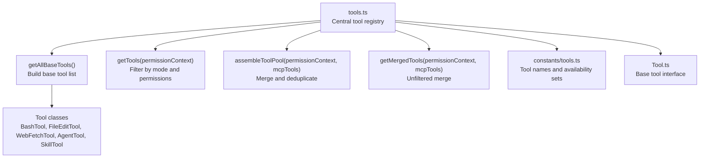
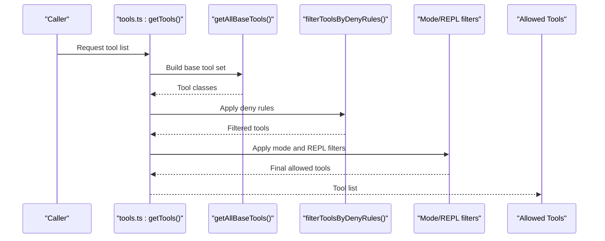
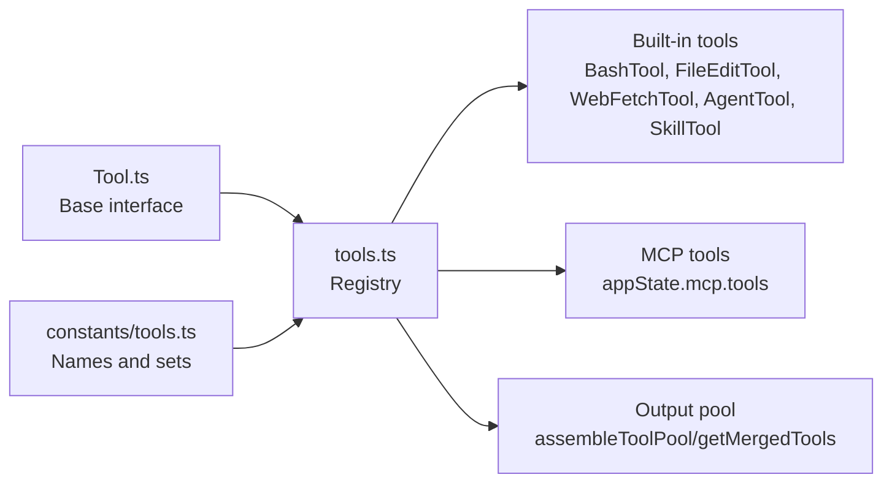

# Built-in Tools Overview

<cite>
**Referenced Files in This Document**
- [tools.ts](file://claude_code_src/restored-src/src/tools.ts)
- [tools.ts](file://claude_code_src/restored-src/src/constants/tools.ts)
- [Tool.ts](file://claude_code_src/restored-src/src/Tool.ts)
- [README.md](file://claude_code_src/README.md)
</cite>

## Table of Contents
1. [Introduction](#introduction)
2. [Project Structure](#project-structure)
3. [Core Components](#core-components)
4. [Architecture Overview](#architecture-overview)
5. [Detailed Component Analysis](#detailed-component-analysis)
6. [Dependency Analysis](#dependency-analysis)
7. [Performance Considerations](#performance-considerations)
8. [Troubleshooting Guide](#troubleshooting-guide)
9. [Conclusion](#conclusion)

## Introduction
This document provides a comprehensive overview of the built-in tools framework, focusing on the core tools: BashTool, FileEditTool, WebFetchTool, AgentTool, and SkillTool. It explains each tool’s purpose, capabilities, configuration options, usage patterns, parameters, constraints, limitations, integration patterns, chaining possibilities, error handling, edge cases, troubleshooting, performance characteristics, and optimization strategies. The goal is to enable both technical and non-technical users to understand how these tools fit into the system, how to use them effectively, and how to combine them safely.

## Project Structure
The built-in tools are centrally defined and assembled in a single module that:
- Imports tool implementations
- Applies environment-based feature flags
- Filters tools by permissions and modes
- Merges with MCP-managed tools
- Exposes a stable, deduplicated tool pool

**Diagram sources**
- [tools.ts:193-251](file://claude_code_src/restored-src/src/tools.ts#L193-L251)
- [tools.ts:271-327](file://claude_code_src/restored-src/src/tools.ts#L271-L327)
- [tools.ts:345-367](file://claude_code_src/restored-src/src/tools.ts#L345-L367)
- [tools.ts:383-389](file://claude_code_src/restored-src/src/tools.ts#L383-L389)
- [constants/tools.ts:36-112](file://claude_code_src/restored-src/src/constants/tools.ts#L36-L112)
- [Tool.ts](file://claude_code_src/restored-src/src/Tool.ts)

**Section sources**
- [tools.ts:193-251](file://claude_code_src/restored-src/src/tools.ts#L193-L251)
- [tools.ts:271-327](file://claude_code_src/restored-src/src/tools.ts#L271-L327)
- [tools.ts:345-367](file://claude_code_src/restored-src/src/tools.ts#L345-L367)
- [tools.ts:383-389](file://claude_code_src/restored-src/src/tools.ts#L383-L389)
- [constants/tools.ts:36-112](file://claude_code_src/restored-src/src/constants/tools.ts#L36-L112)
- [Tool.ts](file://claude_code_src/restored-src/src/Tool.ts)

## Core Components
This section introduces the five core built-in tools covered in this document, along with their roles and typical use cases.

- BashTool
  - Purpose: Execute shell commands securely within a sandboxed environment.
  - Typical uses: Running scripts, invoking CLI utilities, gathering system info, and automating tasks.
  - Constraints: Sandboxed execution; environment isolation; limited to supported shells; subject to permission and rate limits.

- FileEditTool
  - Purpose: Edit files by applying diffs or replacements to existing content.
  - Typical uses: Refactoring, updating configurations, modifying code templates, and batch edits.
  - Constraints: Requires valid file paths; respects read-only flags; handles encoding and line endings carefully.

- WebFetchTool
  - Purpose: Fetch web pages and resources programmatically.
  - Typical uses: Scraping, downloading assets, validating links, and retrieving structured content.
  - Constraints: Respects robots.txt and rate limits; may require headers or cookies; output size limits.

- AgentTool
  - Purpose: Spawn or manage sub-agents for delegated tasks.
  - Typical uses: Parallelizing workloads, delegating specialized tasks, and orchestrating multi-agent workflows.
  - Constraints: Recursion prevention; user-type gating; coordinator-mode restrictions.

- SkillTool
  - Purpose: Apply pre-defined skills to augment capabilities.
  - Typical uses: Code generation, linting, formatting, and domain-specific transformations.
  - Constraints: Skills must be loaded and authorized; performance depends on skill complexity.

**Section sources**
- [constants/tools.ts:36-112](file://claude_code_src/restored-src/src/constants/tools.ts#L36-L112)
- [tools.ts:193-251](file://claude_code_src/restored-src/src/tools.ts#L193-L251)

## Architecture Overview
The tool system follows a modular architecture:
- Central registry defines tool availability, presets, and merging logic.
- Tool availability is controlled by environment flags, feature toggles, and permission contexts.
- Tool pools are assembled per-request, ensuring consistent behavior across UI and backend.

**Diagram sources**
- [tools.ts:271-327](file://claude_code_src/restored-src/src/tools.ts#L271-L327)
- [tools.ts:345-367](file://claude_code_src/restored-src/src/tools.ts#L345-L367)
- [tools.ts:383-389](file://claude_code_src/restored-src/src/tools.ts#L383-L389)

## Detailed Component Analysis

### BashTool
- Purpose and capabilities
  - Executes shell commands in a controlled environment.
  - Supports common shells and sanitization to prevent unsafe operations.
- Configuration options
  - Environment variables and working directory can be configured per invocation.
  - Shell-specific flags and timeouts are enforced.
- Usage patterns
  - Run diagnostics, compile code, fetch remote artifacts, and orchestrate multi-step workflows.
- Parameters and constraints
  - Command string must be validated; arguments are sanitized.
  - Execution time and output size are bounded.
- Integration and chaining
  - Chain with FileReadTool to inspect outputs, or with WebFetchTool to download prerequisites.
- Error handling and edge cases
  - Non-zero exit codes produce structured errors; timeouts are surfaced clearly.
  - Permission denials and sandbox violations are reported with actionable messages.
- Performance and optimization
  - Prefer streaming outputs for large results; reuse working directories when possible.

**Section sources**
- [constants/tools.ts:55-71](file://claude_code_src/restored-src/src/constants/tools.ts#L55-L71)
- [tools.ts:193-251](file://claude_code_src/restored-src/src/tools.ts#L193-L251)

### FileEditTool
- Purpose and capabilities
  - Applies targeted edits to files using diffs or replacement rules.
  - Ensures atomic updates and preserves file metadata.
- Configuration options
  - Target file path, edit strategy, and encoding preferences.
- Usage patterns
  - Update configuration files, refactor code blocks, and apply bulk changes across projects.
- Parameters and constraints
  - Requires write permissions; validates file existence and accessibility.
  - Enforces safe edit boundaries to avoid corrupting files.
- Integration and chaining
  - Combine with FileReadTool to preview changes, or with BashTool to stage changes via scripts.
- Error handling and edge cases
  - Conflicts during edit application are reported; partial failures are minimized.
  - Read-only files and invalid paths are handled gracefully.
- Performance and optimization
  - Batch small edits together to reduce I/O overhead; avoid frequent read-modify-write cycles.

**Section sources**
- [constants/tools.ts:55-71](file://claude_code_src/restored-src/src/constants/tools.ts#L55-L71)
- [tools.ts:193-251](file://claude_code_src/restored-src/src/tools.ts#L193-L251)

### WebFetchTool
- Purpose and capabilities
  - Downloads web content and resources programmatically.
  - Handles redirects, compression, and basic parsing.
- Configuration options
  - Headers, cookies, timeout, and accept-language settings.
- Usage patterns
  - Retrieve API responses, download libraries, and gather external references.
- Parameters and constraints
  - Respects rate limits and robots policies; enforces safe MIME types.
  - Output size and depth are constrained to protect resources.
- Integration and chaining
  - Pair with FileEditTool to persist fetched content, or with BashTool to post-process downloads.
- Error handling and edge cases
  - Network failures, timeouts, and malformed responses are normalized into structured errors.
  - SSL/TLS and certificate issues are surfaced with remediation hints.
- Performance and optimization
  - Use caching headers and etags; parallelize independent fetches where safe.

**Section sources**
- [constants/tools.ts:55-71](file://claude_code_src/restored-src/src/constants/tools.ts#L55-L71)
- [tools.ts:193-251](file://claude_code_src/restored-src/src/tools.ts#L193-L251)

### AgentTool
- Purpose and capabilities
  - Spawns sub-agents to execute delegated tasks concurrently.
- Configuration options
  - Sub-agent instructions, tool allowances, and resource limits.
- Usage patterns
  - Distribute workload across agents, coordinate multi-step plans, and manage parallel tasks.
- Parameters and constraints
  - Recursion is prevented; user-type gating restricts nested agent creation.
  - Coordinator mode allows limited agent management tools.
- Integration and chaining
  - Coordinate with TaskStopTool to cancel runaway agents; use SkillTool for specialized sub-tasks.
- Error handling and edge cases
  - Agent startup failures and deadlocks are detected and reported.
  - Permission denials block unauthorized agent spawning.
- Performance and optimization
  - Limit concurrent agents; monitor resource usage; terminate idle agents proactively.

**Section sources**
- [constants/tools.ts:36-112](file://claude_code_src/restored-src/src/constants/tools.ts#L36-L112)
- [tools.ts:193-251](file://claude_code_src/restored-src/src/tools.ts#L193-L251)

### SkillTool
- Purpose and capabilities
  - Applies predefined skills to augment capabilities with reusable logic.
- Configuration options
  - Skill selection, parameters, and output formatting.
- Usage patterns
  - Automate repetitive tasks like formatting, linting, and generation.
- Parameters and constraints
  - Skills must be loaded and authorized; performance scales with complexity.
- Integration and chaining
  - Chain with FileEditTool to apply skill outputs to files; combine with WebFetchTool for data-driven skills.
- Error handling and edge cases
  - Skill failures are isolated; fallbacks and retries are supported where applicable.
- Performance and optimization
  - Cache skill results when inputs repeat; avoid heavy skills in tight loops.

**Section sources**
- [constants/tools.ts:55-71](file://claude_code_src/restored-src/src/constants/tools.ts#L55-L71)
- [tools.ts:193-251](file://claude_code_src/restored-src/src/tools.ts#L193-L251)

## Dependency Analysis
The tool system relies on a central registry and several supporting modules:
- Tool interface and base behavior are defined in a shared type.
- Constants define tool names and availability sets for agents and modes.
- The registry composes tools from built-ins and MCP sources, deduplicating by name and preserving order for caching stability.

**Diagram sources**
- [Tool.ts](file://claude_code_src/restored-src/src/Tool.ts)
- [constants/tools.ts:36-112](file://claude_code_src/restored-src/src/constants/tools.ts#L36-L112)
- [tools.ts:345-367](file://claude_code_src/restored-src/src/tools.ts#L345-L367)
- [tools.ts:383-389](file://claude_code_src/restored-src/src/tools.ts#L383-L389)

**Section sources**
- [Tool.ts](file://claude_code_src/restored-src/src/Tool.ts)
- [constants/tools.ts:36-112](file://claude_code_src/restored-src/src/constants/tools.ts#L36-L112)
- [tools.ts:345-367](file://claude_code_src/restored-src/src/tools.ts#L345-L367)
- [tools.ts:383-389](file://claude_code_src/restored-src/src/tools.ts#L383-L389)

## Performance Considerations
- Tool availability filtering
  - The registry applies deny rules and mode filters early to reduce unnecessary computations.
- Prompt caching stability
  - Tool lists are sorted by name and deduplicated to maintain stable cache keys across requests.
- Resource bounds
  - Timeouts, output sizes, and concurrency limits are enforced per tool to prevent resource exhaustion.
- Optimization strategies
  - Prefer streaming outputs for large results; batch small operations; reuse working directories; avoid redundant tool invocations.

[No sources needed since this section provides general guidance]

## Troubleshooting Guide
- Permission denials
  - Tools may be hidden or blocked by deny rules. Review the deny rule matcher and adjust permissions.
- Sandbox and environment constraints
  - BashTool and similar tools enforce sandboxing; ensure required binaries and paths are available.
- Network and I/O issues
  - WebFetchTool and FileEditTool surface network and file errors with actionable messages; validate URLs and file paths.
- Agent-related problems
  - AgentTool recursion and user-type gating can prevent spawning; verify environment and mode settings.
- Tool availability mismatches
  - If a tool is missing, confirm feature flags, environment variables, and mode filters.

**Section sources**
- [tools.ts:262-269](file://claude_code_src/restored-src/src/tools.ts#L262-L269)
- [constants/tools.ts:36-112](file://claude_code_src/restored-src/src/constants/tools.ts#L36-L112)

## Conclusion
The built-in tools framework provides a robust, configurable, and secure foundation for automation and orchestration. By understanding each tool’s purpose, constraints, and integration patterns—and by leveraging the central registry’s filtering and merging capabilities—users can compose powerful workflows while maintaining safety, performance, and reliability.