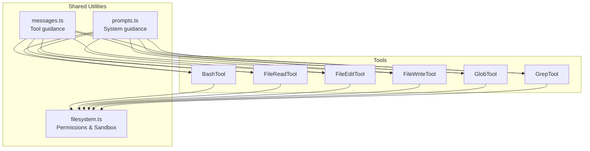
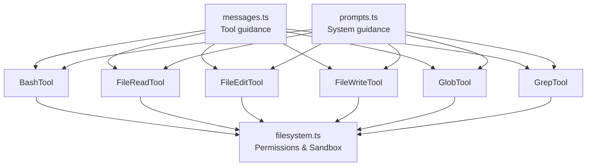
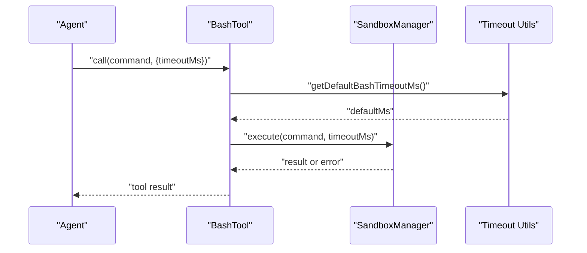
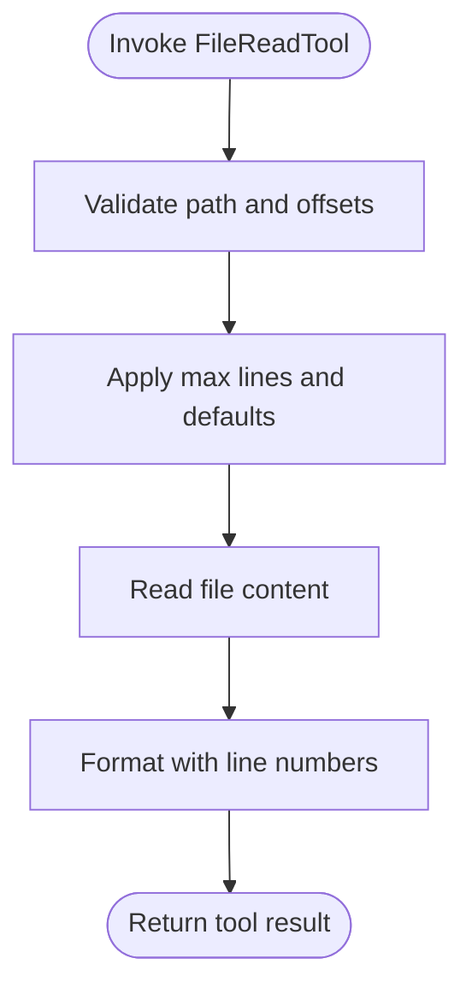
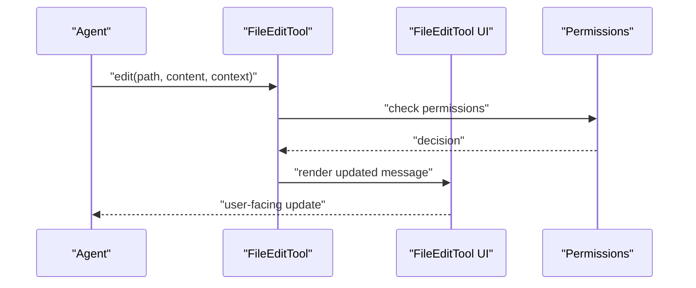
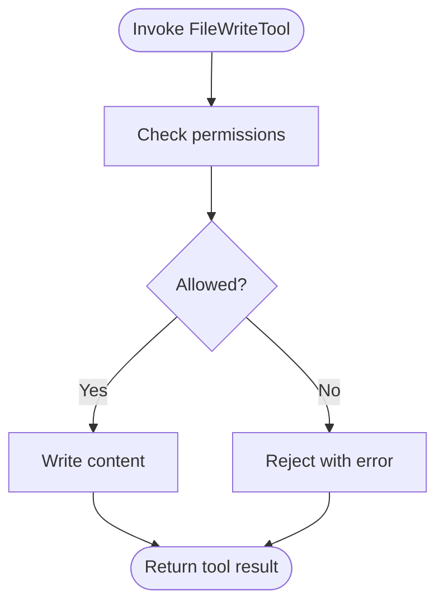
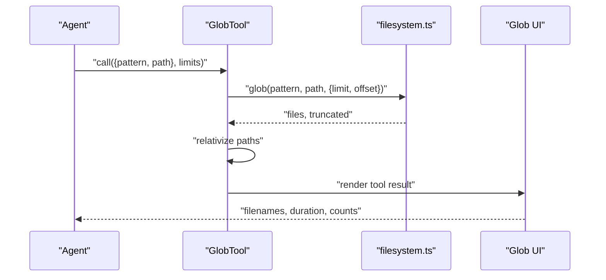
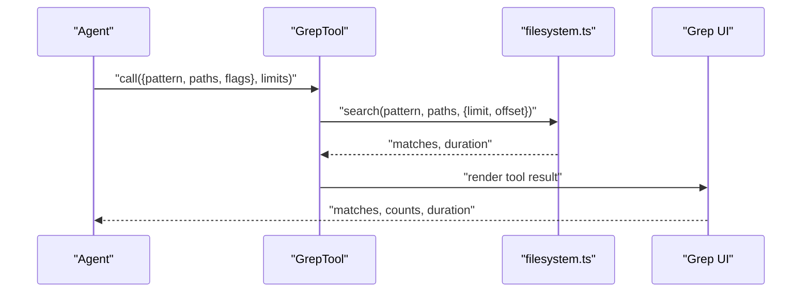
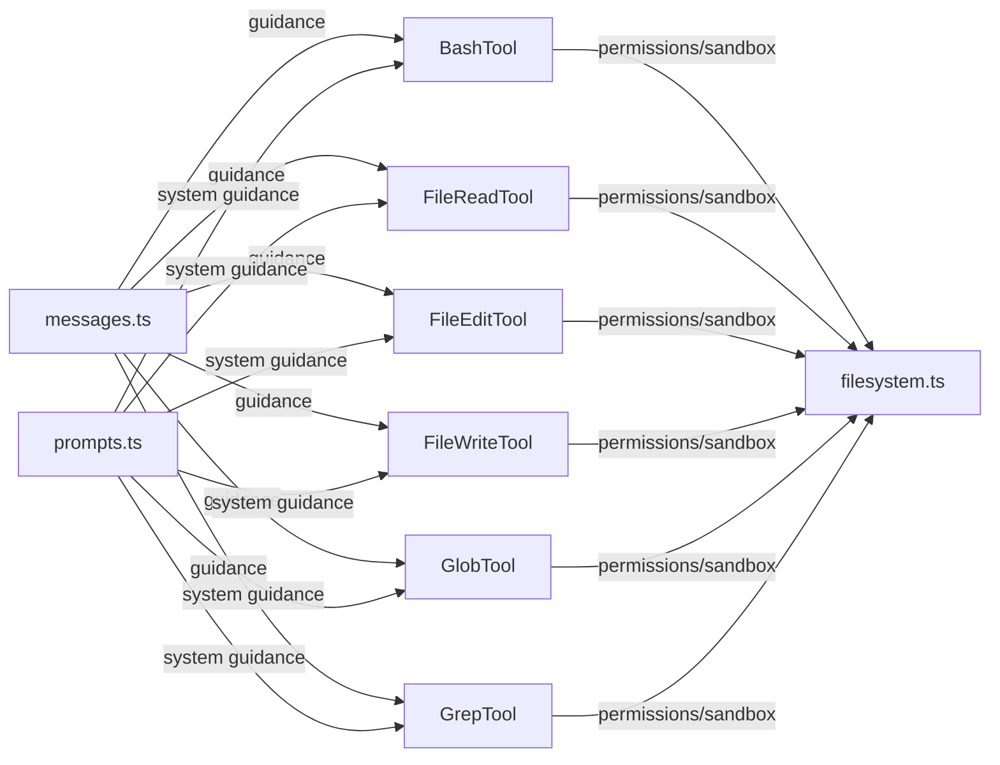

# Core Development Tools

<cite>
**Referenced Files in This Document**
- [BashTool prompt.ts](file://claude_code_src/restored-src/src/tools/BashTool/prompt.ts)
- [BashTool toolName.ts](file://claude_code_src/restored-src/src/tools/BashTool/toolName.ts)
- [FileReadTool prompt.ts](file://claude_code_src/restored-src/src/tools/FileReadTool/prompt.ts)
- [FileReadTool limits.ts](file://claude_code_src/restored-src/src/tools/FileReadTool/limits.ts)
- [FileReadTool FileReadTool.ts](file://claude_code_src/restored-src/src/tools/FileReadTool/FileReadTool.ts)
- [FileEditTool UI.tsx](file://claude_code_src/restored-src/src/components/FileEditToolUpdatedMessage.tsx)
- [FileEditTool constants.ts](file://claude_code_src/restored-src/src/tools/FileEditTool/constants.ts)
- [FileWriteTool prompt.ts](file://claude_code_src/restored-src/src/tools/FileWriteTool/prompt.ts)
- [GlobTool GlobTool.ts](file://claude_code_src/restored-src/src/tools/GlobTool/GlobTool.ts)
- [GlobTool prompt.ts](file://claude_code_src/restored-src/src/tools/GlobTool/prompt.ts)
- [GrepTool GrepTool.ts](file://claude_code_src/restored-src/src/tools/GrepTool/GrepTool.ts)
- [GrepTool prompt.ts](file://claude_code_src/restored-src/src/tools/GrepTool/prompt.ts)
- [prompts.ts](file://claude_code_src/restored-src/src/constants/prompts.ts)
- [messages.ts](file://claude_code_src/restored-src/src/utils/messages.ts)
- [filesystem.ts](file://claude_code_src/restored-src/src/utils/permissions/filesystem.ts)
</cite>

## Table of Contents
1. [Introduction](#introduction)
2. [Project Structure](#project-structure)
3. [Core Components](#core-components)
4. [Architecture Overview](#architecture-overview)
5. [Detailed Component Analysis](#detailed-component-analysis)
6. [Dependency Analysis](#dependency-analysis)
7. [Performance Considerations](#performance-considerations)
8. [Troubleshooting Guide](#troubleshooting-guide)
9. [Conclusion](#conclusion)

## Introduction
This document describes the core development tools used for local file system operations and shell command execution within the application. The focus is on:
- BashTool: executing arbitrary shell commands with timeouts and sandboxing
- FileReadTool: reading files with optional line ranges and safety limits
- FileEditTool: editing files with permission checks and user-facing messaging
- FileWriteTool: writing files with permission checks and safeguards
- GlobTool: pattern-based file discovery with permission enforcement
- GrepTool: content search across files with permission enforcement

Each tool’s purpose, parameters, execution context, constraints, error handling, and security considerations are documented with practical invocation patterns and best practices.

## Project Structure
The tools are implemented as modular components under the tools directory, each with:
- A TypeScript implementation file
- A prompt definition file
- Optional UI helpers and constants
- Shared permission and sandbox utilities

**Diagram sources**
- [BashTool prompt.ts:1-33](file://claude_code_src/restored-src/src/tools/BashTool/prompt.ts#L1-L33)
- [FileReadTool prompt.ts:1-33](file://claude_code_src/restored-src/src/tools/FileReadTool/prompt.ts#L1-L33)
- [FileEditTool constants.ts](file://claude_code_src/restored-src/src/tools/FileEditTool/constants.ts)
- [FileWriteTool prompt.ts](file://claude_code_src/restored-src/src/tools/FileWriteTool/prompt.ts)
- [GlobTool GlobTool.ts:133-178](file://claude_code_src/restored-src/src/tools/GlobTool/GlobTool.ts#L133-L178)
- [GrepTool GrepTool.ts](file://claude_code_src/restored-src/src/tools/GrepTool/GrepTool.ts)
- [prompts.ts:274-302](file://claude_code_src/restored-src/src/constants/prompts.ts#L274-L302)
- [messages.ts:3299-3314](file://claude_code_src/restored-src/src/utils/messages.ts#L3299-L3314)
- [filesystem.ts](file://claude_code_src/restored-src/src/utils/permissions/filesystem.ts)

**Section sources**
- [prompts.ts:274-302](file://claude_code_src/restored-src/src/constants/prompts.ts#L274-L302)
- [messages.ts:3299-3314](file://claude_code_src/restored-src/src/utils/messages.ts#L3299-L3314)

## Core Components
This section summarizes each tool’s role, parameters, execution context, and constraints.

- BashTool
  - Purpose: Execute system commands in a controlled environment with timeouts and sandboxing.
  - Parameters: Command string and optional timeout configuration.
  - Execution context: Uses sandboxing and respects configured timeouts.
  - Constraints: Enforced via timeout utilities and sandbox adapter.
  - Security: Controlled execution environment; integrates with permission and sandbox utilities.

- FileReadTool
  - Purpose: Read files from the local filesystem with optional line range and safety limits.
  - Parameters: Path, optional start line and count.
  - Execution context: Reads within configured limits; supports line-numbered output.
  - Constraints: Line count and max lines per read are enforced.
  - Security: Requires read permission checks and respects project sandbox.

- FileEditTool
  - Purpose: Edit files with permission checks and user-facing messaging.
  - Parameters: Path, replacement content, optional context.
  - Execution context: Validates edits against permissions and renders user-facing messages.
  - Constraints: Uses permission rules and UI messaging for clarity.
  - Security: Enforces read/write permissions and avoids unsafe operations.

- FileWriteTool
  - Purpose: Write files with permission checks and safeguards.
  - Parameters: Path, content, overwrite flag.
  - Execution context: Writes content respecting permissions and limits.
  - Constraints: Enforced via permission checks and sandbox policies.
  - Security: Controlled write operations with permission gating.

- GlobTool
  - Purpose: Discover files matching a glob pattern with permission enforcement.
  - Parameters: Pattern string and base path.
  - Execution context: Returns relative paths and truncation status.
  - Constraints: Limits number of results and offsets.
  - Security: Requires read permission checks and respects sandbox.

- GrepTool
  - Purpose: Search file contents using regular expressions with permission enforcement.
  - Parameters: Pattern, paths, optional flags.
  - Execution context: Searches across files and returns matches.
  - Constraints: Limits number of results and offsets; returns durations.
  - Security: Requires read permission checks and respects sandbox.

**Section sources**
- [BashTool prompt.ts:1-33](file://claude_code_src/restored-src/src/tools/BashTool/prompt.ts#L1-L33)
- [FileReadTool prompt.ts:1-33](file://claude_code_src/restored-src/src/tools/FileReadTool/prompt.ts#L1-L33)
- [FileReadTool limits.ts](file://claude_code_src/restored-src/src/tools/FileReadTool/limits.ts)
- [FileReadTool FileReadTool.ts:67-94](file://claude_code_src/restored-src/src/tools/FileReadTool/FileReadTool.ts#L67-L94)
- [FileEditTool UI.tsx](file://claude_code_src/restored-src/src/components/FileEditToolUpdatedMessage.tsx)
- [FileEditTool constants.ts](file://claude_code_src/restored-src/src/tools/FileEditTool/constants.ts)
- [FileWriteTool prompt.ts](file://claude_code_src/restored-src/src/tools/FileWriteTool/prompt.ts)
- [GlobTool GlobTool.ts:133-178](file://claude_code_src/restored-src/src/tools/GlobTool/GlobTool.ts#L133-L178)
- [GlobTool prompt.ts](file://claude_code_src/restored-src/src/tools/GlobTool/prompt.ts)
- [GrepTool GrepTool.ts](file://claude_code_src/restored-src/src/tools/GrepTool/GrepTool.ts)
- [GrepTool prompt.ts](file://claude_code_src/restored-src/src/tools/GrepTool/prompt.ts)

## Architecture Overview
The tools integrate with shared permission and sandbox utilities, and leverage system prompts to guide usage.

**Diagram sources**
- [BashTool prompt.ts:1-33](file://claude_code_src/restored-src/src/tools/BashTool/prompt.ts#L1-L33)
- [FileReadTool prompt.ts:1-33](file://claude_code_src/restored-src/src/tools/FileReadTool/prompt.ts#L1-L33)
- [FileEditTool constants.ts](file://claude_code_src/restored-src/src/tools/FileEditTool/constants.ts)
- [FileWriteTool prompt.ts](file://claude_code_src/restored-src/src/tools/FileWriteTool/prompt.ts)
- [GlobTool GlobTool.ts:133-178](file://claude_code_src/restored-src/src/tools/GlobTool/GlobTool.ts#L133-L178)
- [GrepTool GrepTool.ts](file://claude_code_src/restored-src/src/tools/GrepTool/GrepTool.ts)
- [prompts.ts:274-302](file://claude_code_src/restored-src/src/constants/prompts.ts#L274-L302)
- [messages.ts:3299-3314](file://claude_code_src/restored-src/src/utils/messages.ts#L3299-L3314)
- [filesystem.ts](file://claude_code_src/restored-src/src/utils/permissions/filesystem.ts)

## Detailed Component Analysis

### BashTool
- Purpose: Execute system commands with timeouts and sandboxing.
- Parameters:
  - command: String containing the command to run.
  - timeoutMs: Optional numeric override for timeout.
- Execution context:
  - Uses sandbox adapter and timeout utilities.
  - Integrates with undercover mode and attribution.
- Constraints:
  - Default and maximum timeout values are configurable.
- Error handling:
  - Errors surfaced via tool result messages and error rendering.
- Best practices:
  - Prefer dedicated tools (Read/Edit/Glob/Grep) when available.
  - Use BashTool for operations requiring shell execution.

**Diagram sources**
- [BashTool prompt.ts:27-33](file://claude_code_src/restored-src/src/tools/BashTool/prompt.ts#L27-L33)

**Section sources**
- [BashTool prompt.ts:1-33](file://claude_code_src/restored-src/src/tools/BashTool/prompt.ts#L1-L33)

### FileReadTool
- Purpose: Read files from the local filesystem with optional line ranges and safety limits.
- Parameters:
  - path: Target file path.
  - startLine: Optional starting line number.
  - count: Optional number of lines to read.
- Execution context:
  - Enforces maximum lines per read and line-numbered output.
  - Uses permission checks and read-in-range utilities.
- Constraints:
  - Max lines per read and default limits are enforced.
- Error handling:
  - Returns appropriate tool result messages and errors.
- Best practices:
  - Read entire files when unknown; use offsets for large files.
  - Avoid repeated reads of unchanged files.

**Diagram sources**
- [FileReadTool prompt.ts:10-18](file://claude_code_src/restored-src/src/tools/FileReadTool/prompt.ts#L10-L18)
- [FileReadTool limits.ts](file://claude_code_src/restored-src/src/tools/FileReadTool/limits.ts)

**Section sources**
- [FileReadTool prompt.ts:1-33](file://claude_code_src/restored-src/src/tools/FileReadTool/prompt.ts#L1-L33)
- [FileReadTool limits.ts](file://claude_code_src/restored-src/src/tools/FileReadTool/limits.ts)
- [FileReadTool FileReadTool.ts:67-94](file://claude_code_src/restored-src/src/tools/FileReadTool/FileReadTool.ts#L67-L94)

### FileEditTool
- Purpose: Edit files with permission checks and user-facing messaging.
- Parameters:
  - path: Target file path.
  - content: Replacement content.
  - context: Optional context for the edit.
- Execution context:
  - Renders user-facing messages for updates and rejections.
  - Enforces permission checks for edits.
- Constraints:
  - Uses permission rules and UI messaging.
- Error handling:
  - Provides updated message and rejection messaging.
- Best practices:
  - Use explicit replacements and avoid partial edits.
  - Confirm changes via user-facing messages.

**Diagram sources**
- [FileEditTool UI.tsx](file://claude_code_src/restored-src/src/components/FileEditToolUpdatedMessage.tsx)
- [FileEditTool constants.ts](file://claude_code_src/restored-src/src/tools/FileEditTool/constants.ts)

**Section sources**
- [FileEditTool UI.tsx](file://claude_code_src/restored-src/src/components/FileEditToolUpdatedMessage.tsx)
- [FileEditTool constants.ts](file://claude_code_src/restored-src/src/tools/FileEditTool/constants.ts)

### FileWriteTool
- Purpose: Write files with permission checks and safeguards.
- Parameters:
  - path: Target file path.
  - content: Content to write.
  - overwrite: Boolean indicating overwrite behavior.
- Execution context:
  - Enforces permission checks and respects sandbox policies.
- Constraints:
  - Controlled via permission checks and sandbox.
- Error handling:
  - Errors surfaced via tool result messages.
- Best practices:
  - Prefer explicit overwrite flags.
  - Validate content before writing.

**Diagram sources**
- [FileWriteTool prompt.ts](file://claude_code_src/restored-src/src/tools/FileWriteTool/prompt.ts)

**Section sources**
- [FileWriteTool prompt.ts](file://claude_code_src/restored-src/src/tools/FileWriteTool/prompt.ts)

### GlobTool
- Purpose: Discover files matching a glob pattern with permission enforcement.
- Parameters:
  - pattern: Glob pattern string.
  - path: Base path for search.
- Execution context:
  - Returns relative paths and truncation status.
  - Enforces max results and offsets.
- Constraints:
  - Limits number of results and offsets.
- Error handling:
  - Truncation and duration included in output.
- Best practices:
  - Use patterns to narrow results.
  - Limit scope to relevant directories.

**Diagram sources**
- [GlobTool GlobTool.ts:154-178](file://claude_code_src/restored-src/src/tools/GlobTool/GlobTool.ts#L154-L178)
- [GlobTool prompt.ts](file://claude_code_src/restored-src/src/tools/GlobTool/prompt.ts)

**Section sources**
- [GlobTool GlobTool.ts:133-178](file://claude_code_src/restored-src/src/tools/GlobTool/GlobTool.ts#L133-L178)
- [GlobTool prompt.ts](file://claude_code_src/restored-src/src/tools/GlobTool/prompt.ts)

### GrepTool
- Purpose: Search file contents using regular expressions with permission enforcement.
- Parameters:
  - pattern: Regular expression string.
  - paths: Paths to search.
  - flags: Optional flags for search behavior.
- Execution context:
  - Searches across files and returns matches.
  - Enforces limits and offsets.
- Constraints:
  - Limits number of results and offsets; returns durations.
- Error handling:
  - Errors surfaced via tool result messages.
- Best practices:
  - Use anchored or bounded patterns for accuracy.
  - Scope search to relevant paths.

**Diagram sources**
- [GrepTool GrepTool.ts](file://claude_code_src/restored-src/src/tools/GrepTool/GrepTool.ts)
- [GrepTool prompt.ts](file://claude_code_src/restored-src/src/tools/GrepTool/prompt.ts)

**Section sources**
- [GrepTool GrepTool.ts](file://claude_code_src/restored-src/src/tools/GrepTool/GrepTool.ts)
- [GrepTool prompt.ts](file://claude_code_src/restored-src/src/tools/GrepTool/prompt.ts)

## Dependency Analysis
The tools depend on shared permission and sandbox utilities, and receive guidance from system prompts.

**Diagram sources**
- [BashTool prompt.ts:1-33](file://claude_code_src/restored-src/src/tools/BashTool/prompt.ts#L1-L33)
- [FileReadTool prompt.ts:1-33](file://claude_code_src/restored-src/src/tools/FileReadTool/prompt.ts#L1-L33)
- [FileEditTool constants.ts](file://claude_code_src/restored-src/src/tools/FileEditTool/constants.ts)
- [FileWriteTool prompt.ts](file://claude_code_src/restored-src/src/tools/FileWriteTool/prompt.ts)
- [GlobTool GlobTool.ts:133-178](file://claude_code_src/restored-src/src/tools/GlobTool/GlobTool.ts#L133-L178)
- [GrepTool GrepTool.ts](file://claude_code_src/restored-src/src/tools/GrepTool/GrepTool.ts)
- [prompts.ts:274-302](file://claude_code_src/restored-src/src/constants/prompts.ts#L274-L302)
- [messages.ts:3299-3314](file://claude_code_src/restored-src/src/utils/messages.ts#L3299-L3314)
- [filesystem.ts](file://claude_code_src/restored-src/src/utils/permissions/filesystem.ts)

**Section sources**
- [prompts.ts:274-302](file://claude_code_src/restored-src/src/constants/prompts.ts#L274-L302)
- [messages.ts:3299-3314](file://claude_code_src/restored-src/src/utils/messages.ts#L3299-L3314)
- [filesystem.ts](file://claude_code_src/restored-src/src/utils/permissions/filesystem.ts)

## Performance Considerations
- Timeouts: BashTool enforces default and maximum timeouts to prevent long-running operations.
- Limits: FileReadTool enforces maximum lines per read; GlobTool and GrepTool enforce result counts and offsets.
- Relative paths: GlobTool and GrepTool relativize paths to reduce token usage.
- Embedded tools: On platforms with embedded search tools, guidance points to using shell equivalents instead of dedicated tools.

[No sources needed since this section provides general guidance]

## Troubleshooting Guide
- Permission denials:
  - All tools rely on permission checks; failures indicate missing permissions or sandbox restrictions.
- Timeout errors:
  - BashTool may fail if the operation exceeds configured timeouts.
- Large file reads:
  - Use offsets in FileReadTool to avoid exceeding max lines or token budgets.
- Pattern mismatches:
  - GlobTool and GrepTool may return empty results if patterns do not match; adjust patterns or scope.
- Embedded tool availability:
  - On systems with embedded search tools, guidance suggests using shell equivalents.

**Section sources**
- [prompts.ts:274-302](file://claude_code_src/restored-src/src/constants/prompts.ts#L274-L302)
- [messages.ts:3299-3314](file://claude_code_src/restored-src/src/utils/messages.ts#L3299-L3314)
- [filesystem.ts](file://claude_code_src/restored-src/src/utils/permissions/filesystem.ts)

## Conclusion
These core tools provide safe, guided, and constrained access to file system operations and shell commands. By leveraging permission checks, sandboxing, and system prompts, they balance flexibility with security. Prefer dedicated tools (Read/Edit/Glob/Grep) when available, and reserve BashTool for operations requiring shell execution.

[No sources needed since this section summarizes without analyzing specific files]