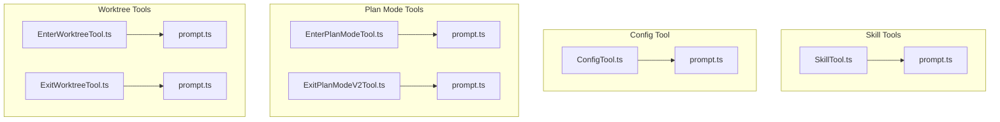
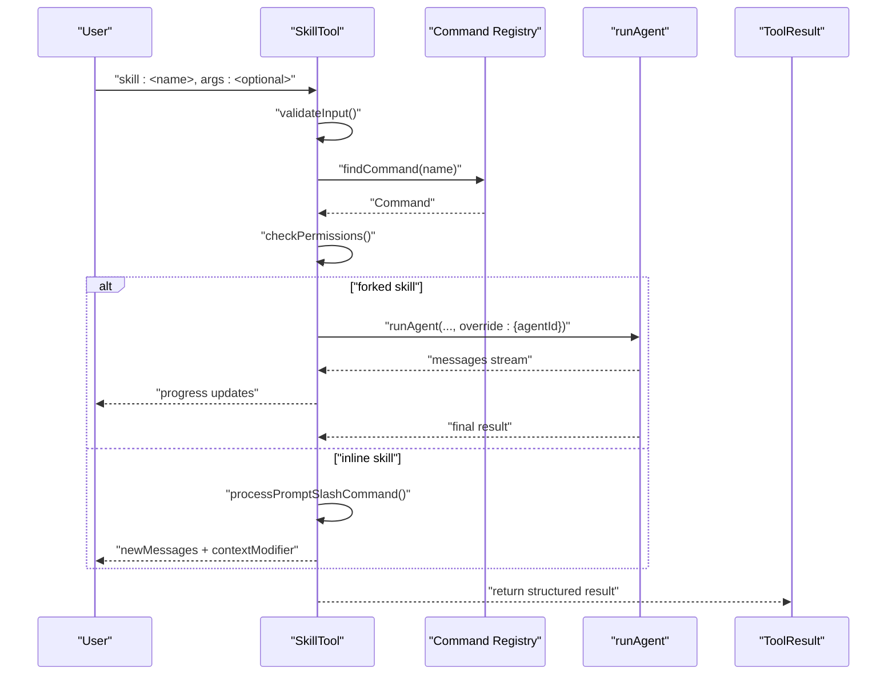
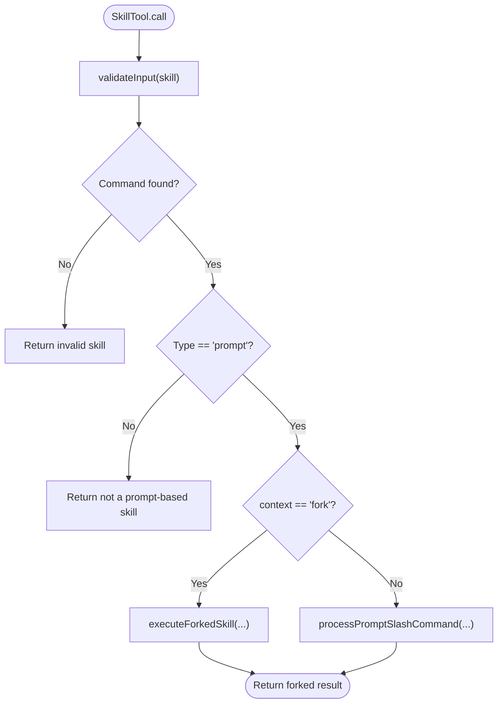
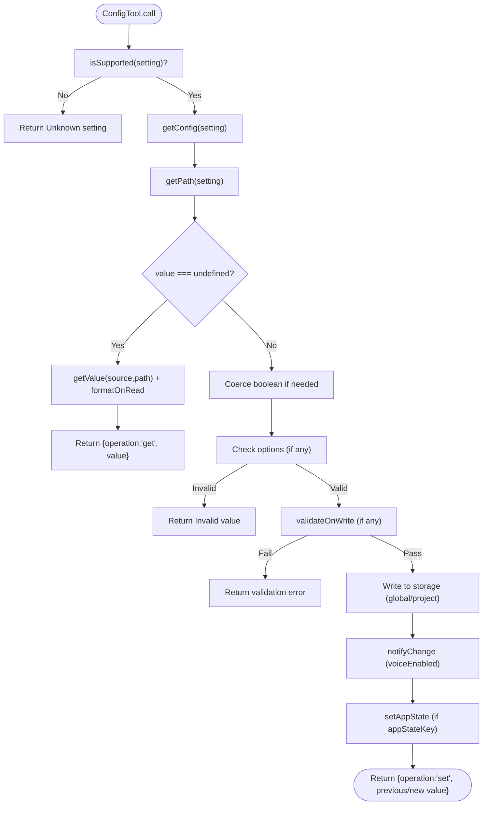
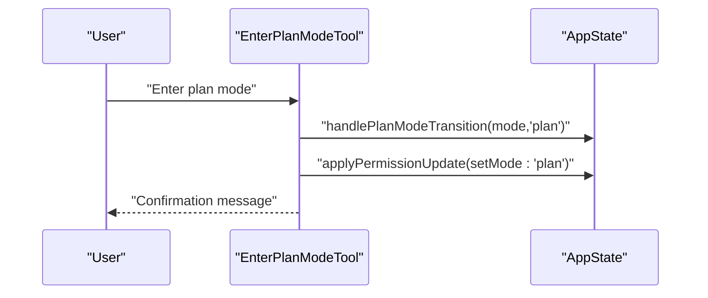
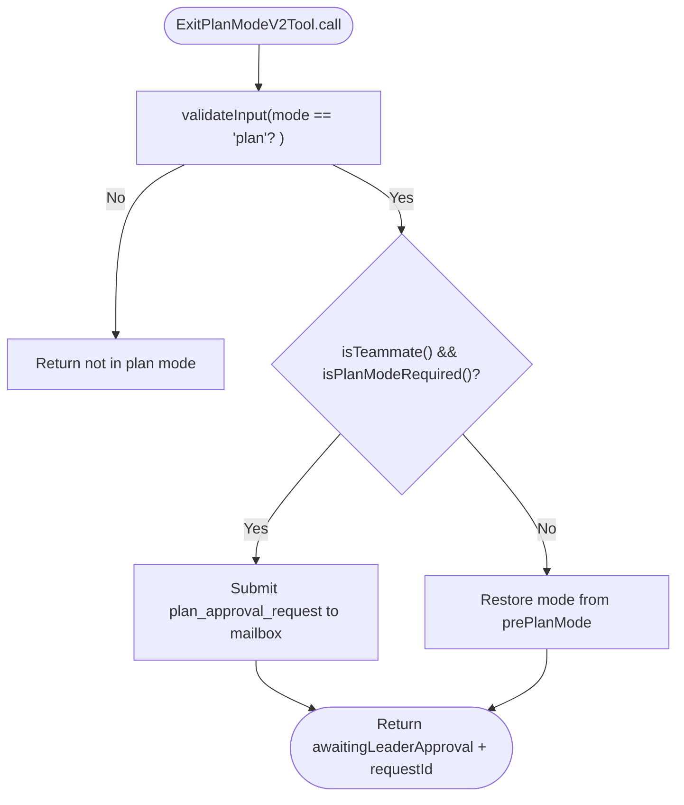
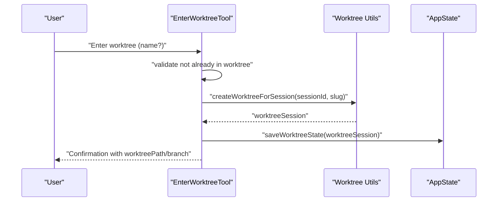
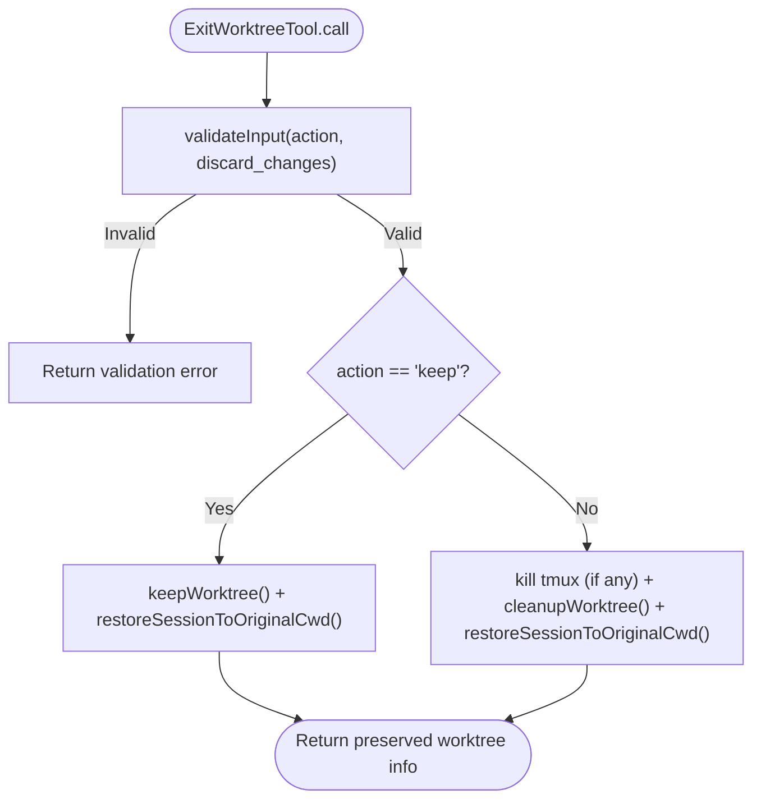
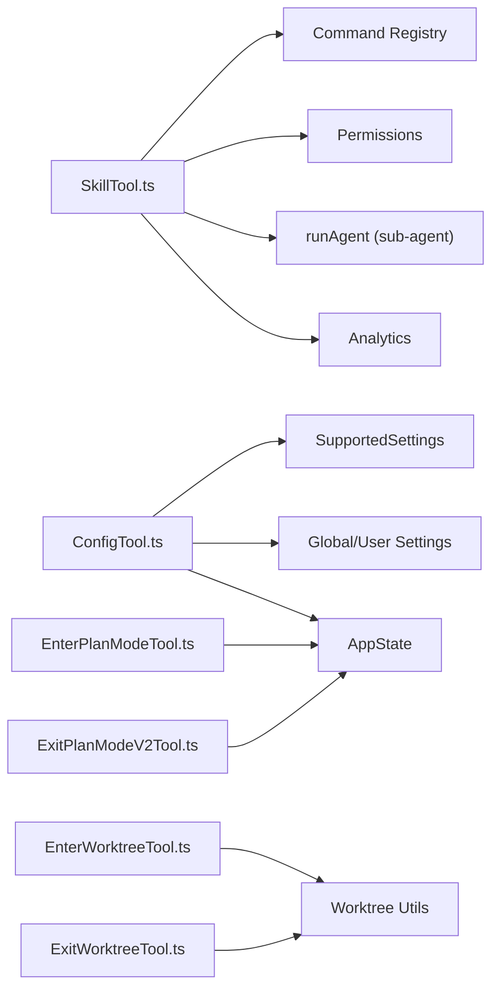

# Skill and Configuration Tools

<cite>
**Referenced Files in This Document**
- [SkillTool.ts](file://src/tools/SkillTool/SkillTool.ts)
- [prompt.ts](file://src/tools/SkillTool/prompt.ts)
- [ConfigTool.ts](file://src/tools/ConfigTool/ConfigTool.ts)
- [prompt.ts](file://src/tools/ConfigTool/prompt.ts)
- [EnterPlanModeTool.ts](file://src/tools/EnterPlanModeTool/EnterPlanModeTool.ts)
- [prompt.ts](file://src/tools/EnterPlanModeTool/prompt.ts)
- [ExitPlanModeV2Tool.ts](file://src/tools/ExitPlanModeTool/ExitPlanModeV2Tool.ts)
- [prompt.ts](file://src/tools/ExitPlanModeTool/prompt.ts)
- [EnterWorktreeTool.ts](file://src/tools/EnterWorktreeTool/EnterWorktreeTool.ts)
- [prompt.ts](file://src/tools/EnterWorktreeTool/prompt.ts)
- [ExitWorktreeTool.ts](file://src/tools/ExitWorktreeTool/ExitWorktreeTool.ts)
- [prompt.ts](file://src/tools/ExitWorktreeTool/prompt.ts)
</cite>

## Table of Contents
1. [Introduction](#introduction)
2. [Project Structure](#project-structure)
3. [Core Components](#core-components)
4. [Architecture Overview](#architecture-overview)
5. [Detailed Component Analysis](#detailed-component-analysis)
6. [Dependency Analysis](#dependency-analysis)
7. [Performance Considerations](#performance-considerations)
8. [Troubleshooting Guide](#troubleshooting-guide)
9. [Conclusion](#conclusion)

## Introduction
This document explains the skill and configuration tools that power the Claude Code IDE. It covers:
- SkillTool: how skills are discovered, validated, permission-checked, executed (inline or forked), and tracked
- ConfigTool: how configuration settings are retrieved, validated, persisted, and synchronized to application state
- Mode switching tools: EnterPlanModeTool and ExitPlanModeV2Tool for plan mode, and EnterWorktreeTool and ExitWorktreeTool for worktree isolation

It provides practical examples, tool-specific parameters, execution context, configuration validation, and guidance on security, persistence, and state management.

## Project Structure
The tools are implemented under src/tools/<ToolName> with per-tool files:
- Tool definition and logic (e.g., SkillTool.ts)
- Prompt generation (e.g., prompt.ts)
- Optional UI rendering helpers (UI.tsx) referenced by the tools

**Diagram sources**
- [SkillTool.ts](file://src/tools/SkillTool/SkillTool.ts)
- [prompt.ts](file://src/tools/SkillTool/prompt.ts)
- [ConfigTool.ts](file://src/tools/ConfigTool/ConfigTool.ts)
- [prompt.ts](file://src/tools/ConfigTool/prompt.ts)
- [EnterPlanModeTool.ts](file://src/tools/EnterPlanModeTool/EnterPlanModeTool.ts)
- [prompt.ts](file://src/tools/EnterPlanModeTool/prompt.ts)
- [ExitPlanModeV2Tool.ts](file://src/tools/ExitPlanModeTool/ExitPlanModeV2Tool.ts)
- [prompt.ts](file://src/tools/ExitPlanModeTool/prompt.ts)
- [EnterWorktreeTool.ts](file://src/tools/EnterWorktreeTool/EnterWorktreeTool.ts)
- [prompt.ts](file://src/tools/EnterWorktreeTool/prompt.ts)
- [ExitWorktreeTool.ts](file://src/tools/ExitWorktreeTool/ExitWorktreeTool.ts)
- [prompt.ts](file://src/tools/ExitWorktreeTool/prompt.ts)

**Section sources**
- [SkillTool.ts](file://src/tools/SkillTool/SkillTool.ts)
- [ConfigTool.ts](file://src/tools/ConfigTool/ConfigTool.ts)
- [EnterPlanModeTool.ts](file://src/tools/EnterPlanModeTool/EnterPlanModeTool.ts)
- [ExitPlanModeV2Tool.ts](file://src/tools/ExitPlanModeTool/ExitPlanModeV2Tool.ts)
- [EnterWorktreeTool.ts](file://src/tools/EnterWorktreeTool/EnterWorktreeTool.ts)
- [ExitWorktreeTool.ts](file://src/tools/ExitWorktreeTool/ExitWorktreeTool.ts)

## Core Components
- SkillTool: Validates skill names, checks permissions, executes skills inline or in a forked sub-agent, and returns structured results with progress reporting.
- ConfigTool: Reads/writes settings across global and project scopes, validates values, enforces options and runtime checks, and syncs to AppState for immediate UI effects.
- Plan Mode Tools: Transition between default and plan modes, enforce concurrency safety, gate transitions under channel constraints, and manage permission context and auto-mode restoration.
- Worktree Tools: Create and manage isolated git worktrees, validate slugs, guard destructive removal, and restore session state upon exit.

**Section sources**
- [SkillTool.ts](file://src/tools/SkillTool/SkillTool.ts)
- [ConfigTool.ts](file://src/tools/ConfigTool/ConfigTool.ts)
- [EnterPlanModeTool.ts](file://src/tools/EnterPlanModeTool/EnterPlanModeTool.ts)
- [ExitPlanModeV2Tool.ts](file://src/tools/ExitPlanModeTool/ExitPlanModeV2Tool.ts)
- [EnterWorktreeTool.ts](file://src/tools/EnterWorktreeTool/EnterWorktreeTool.ts)
- [ExitWorktreeTool.ts](file://src/tools/ExitWorktreeTool/ExitWorktreeTool.ts)

## Architecture Overview
The tools integrate with the broader system via:
- Tool framework: buildTool, ToolDef, ToolResult, ToolCallProgress
- Context: ToolUseContext, AppState, permissions, telemetry
- Execution: inline skill invocation or forked sub-agent with isolated token budget
- Persistence: global config and user settings, AppState synchronization
- Mode management: plan mode transitions and auto-mode gates

**Diagram sources**
- [SkillTool.ts](file://src/tools/SkillTool/SkillTool.ts)

**Section sources**
- [SkillTool.ts](file://src/tools/SkillTool/SkillTool.ts)

## Detailed Component Analysis

### SkillTool
- Purpose: Execute skills (slash commands) with validation, permission checks, and execution modes (inline vs forked).
- Inputs:
  - skill: string (e.g., "commit", "review-pr", "pdf", or fully qualified names)
  - args: string (optional)
- Outputs:
  - Inline: success flag, commandName, allowedTools (if any), model override (if any)
  - Forked: success flag, commandName, status "forked", agentId, result text
- Execution modes:
  - Inline: expand command into messages, tag transient messages, return newMessages and optional contextModifier
  - Forked: spawn sub-agent with isolated context, stream progress, extract final result text
- Permissions:
  - Deny/Allow rules keyed by skill name or prefix patterns
  - Auto-allow for skills with only "safe" properties
  - Suggestions to add rules for exact match or wildcard
- Telemetry:
  - Logs invocation events with sanitized and PII-tagged fields
- Security:
  - Validates existence and type ("prompt"), disables model invocation gating
  - Supports canonical remote skills (ant-only) with discovery gating
  - Sanitizes command names for telemetry and display

**Diagram sources**
- [SkillTool.ts](file://src/tools/SkillTool/SkillTool.ts)

**Section sources**
- [SkillTool.ts](file://src/tools/SkillTool/SkillTool.ts)
- [prompt.ts](file://src/tools/SkillTool/prompt.ts)

Practical examples:
- Invoke a skill with arguments: skill: "commit", args: "-m 'Fix bug'"
- Use fully qualified skill name: skill: "ms-office-suite:pdf"
- Forked execution for skills configured with context "fork"

Tool parameters:
- skill: string (required)
- args: string (optional)

Skill execution context:
- ToolUseContext provides getAppState, options, agentId, and callbacks
- Progress reporting via ToolCallProgress for tool_use/tool_result content
- Context modifier allows updating allowedTools for the current turn

Configuration validation:
- Not applicable to SkillTool; validation is handled by the skill’s command definition and permission rules

Security considerations:
- Permission rules and auto-allow for safe properties
- Canonical remote skills are auto-granted for ant users
- Slash prefix normalization and telemetry sanitization

Persistence and state:
- Skill usage recorded for ranking
- Forked sub-agent state managed internally and cleared after completion

### ConfigTool
- Purpose: Get or set configuration settings across global and project scopes with validation and immediate AppState sync.
- Inputs:
  - setting: string (e.g., "theme", "model", "permissions.defaultMode")
  - value: string | boolean | number (optional; omit to get)
- Outputs:
  - get: success, operation "get", setting, value
  - set: success, operation "set", setting, previousValue, newValue, error (if any)
- Supported settings registry:
  - Centralized via supportedSettings.js; includes type, source, options, format/read/write hooks
- Validation:
  - Type coercion for booleans
  - Option enumeration checks
  - Async validation hooks (e.g., model API checks)
  - Runtime feature gating (e.g., voiceEnabled)
- Persistence:
  - Global config stored in ~/.claude.json
  - Project settings stored in settings.json
- AppState synchronization:
  - Certain settings trigger immediate UI updates via setAppState

**Diagram sources**
- [ConfigTool.ts](file://src/tools/ConfigTool/ConfigTool.ts)

**Section sources**
- [ConfigTool.ts](file://src/tools/ConfigTool/ConfigTool.ts)
- [prompt.ts](file://src/tools/ConfigTool/prompt.ts)

Practical examples:
- Get current theme: { "setting": "theme" }
- Set dark theme: { "setting": "theme", "value": "dark" }
- Enable vim mode: { "setting": "editorMode", "value": "vim" }
- Enable verbose: { "setting": "verbose", "value": true }
- Change model: { "setting": "model", "value": "opus" }
- Change permission mode: { "setting": "permissions.defaultMode", "value": "plan" }

Tool parameters:
- setting: string (required)
- value: string | boolean | number (optional)

Configuration validation:
- Strict typing and option lists
- Async validation hooks for external systems
- Runtime feature gates (e.g., voiceEnabled)

Persistence and state:
- Writes to global or user settings depending on config.source
- Immediate AppState sync for UI responsiveness

### Mode Switching Tools

#### EnterPlanModeTool
- Purpose: Request permission to enter plan mode for complex tasks requiring exploration and design.
- Inputs: none
- Outputs: confirmation message
- Constraints:
  - Disabled under channel gating to prevent stuck transitions
  - Read-only and concurrency-safe
- Behavior:
  - Transitions toolPermissionContext.mode to "plan"
  - Updates permission context for plan mode classification

**Diagram sources**
- [EnterPlanModeTool.ts](file://src/tools/EnterPlanModeTool/EnterPlanModeTool.ts)

**Section sources**
- [EnterPlanModeTool.ts](file://src/tools/EnterPlanModeTool/EnterPlanModeTool.ts)
- [prompt.ts](file://src/tools/EnterPlanModeTool/prompt.ts)

#### ExitPlanModeV2Tool
- Purpose: Present plan for approval and transition back to the prior mode, optionally restoring auto-mode permissions.
- Inputs:
  - allowedPrompts: array of semantic tool permissions (prompt-based)
  - plan: string (SDK-injected; internal schema includes plan and planFilePath)
- Outputs:
  - plan content, isAgent flag, filePath, hasTaskTool indicator, planWasEdited, awaitingLeaderApproval, requestId
- Behavior:
  - Validates it is currently in plan mode
  - For teammates requiring leader approval: submits plan_approval_request to mailbox
  - For local exit: restores prePlanMode (with auto-mode gate fallback), strips/restores dangerous permissions accordingly
  - Attaches plan text to tool_result for downstream consumption

**Diagram sources**
- [ExitPlanModeV2Tool.ts](file://src/tools/ExitPlanModeTool/ExitPlanModeV2Tool.ts)

**Section sources**
- [ExitPlanModeV2Tool.ts](file://src/tools/ExitPlanModeTool/ExitPlanModeV2Tool.ts)
- [prompt.ts](file://src/tools/ExitPlanModeTool/prompt.ts)

#### EnterWorktreeTool
- Purpose: Create an isolated git worktree and switch the session into it.
- Inputs:
  - name: string (optional; validated as worktree slug)
- Outputs:
  - worktreePath, worktreeBranch (optional), message
- Behavior:
  - Guards against nested worktree sessions
  - Resolves to repository root if invoked from within a worktree
  - Creates worktree, chdirs, saves state, clears caches, logs event

**Diagram sources**
- [EnterWorktreeTool.ts](file://src/tools/EnterWorktreeTool/EnterWorktreeTool.ts)

**Section sources**
- [EnterWorktreeTool.ts](file://src/tools/EnterWorktreeTool/EnterWorktreeTool.ts)
- [prompt.ts](file://src/tools/EnterWorktreeTool/prompt.ts)

#### ExitWorktreeTool
- Purpose: Exit a worktree session created by EnterWorktree and return to the original directory.
- Inputs:
  - action: "keep" | "remove" (required)
  - discard_changes: boolean (only for action "remove")
- Outputs:
  - action, originalCwd, worktreePath, worktreeBranch (optional), tmuxSessionName (optional), discardedFiles, discardedCommits, message
- Safety:
  - Validates presence of current worktree session
  - Counts uncommitted changes and commits; refuses removal without explicit confirmation
  - Restores AppState and clears caches

**Diagram sources**
- [ExitWorktreeTool.ts](file://src/tools/ExitWorktreeTool/ExitWorktreeTool.ts)

**Section sources**
- [ExitWorktreeTool.ts](file://src/tools/ExitWorktreeTool/ExitWorktreeTool.ts)
- [prompt.ts](file://src/tools/ExitWorktreeTool/prompt.ts)

## Dependency Analysis
- SkillTool depends on:
  - Command registry (local and MCP skills)
  - Permission rules and auto-classifier inputs
  - Forked agent execution and progress streaming
  - Telemetry and analytics logging
- ConfigTool depends on:
  - Supported settings registry and validators
  - Global and user settings stores
  - AppState synchronization hooks
  - Voice mode runtime checks
- Plan and Worktree tools depend on:
  - AppState mode transitions and permission context
  - Worktree utilities and Git operations
  - Session state and cache clearing

**Diagram sources**
- [SkillTool.ts](file://src/tools/SkillTool/SkillTool.ts)
- [ConfigTool.ts](file://src/tools/ConfigTool/ConfigTool.ts)
- [EnterPlanModeTool.ts](file://src/tools/EnterPlanModeTool/EnterPlanModeTool.ts)
- [ExitPlanModeV2Tool.ts](file://src/tools/ExitPlanModeTool/ExitPlanModeV2Tool.ts)
- [EnterWorktreeTool.ts](file://src/tools/EnterWorktreeTool/EnterWorktreeTool.ts)
- [ExitWorktreeTool.ts](file://src/tools/ExitWorktreeTool/ExitWorktreeTool.ts)

**Section sources**
- [SkillTool.ts](file://src/tools/SkillTool/SkillTool.ts)
- [ConfigTool.ts](file://src/tools/ConfigTool/ConfigTool.ts)
- [EnterPlanModeTool.ts](file://src/tools/EnterPlanModeTool/EnterPlanModeTool.ts)
- [ExitPlanModeV2Tool.ts](file://src/tools/ExitPlanModeTool/ExitPlanModeV2Tool.ts)
- [EnterWorktreeTool.ts](file://src/tools/EnterWorktreeTool/EnterWorktreeTool.ts)
- [ExitWorktreeTool.ts](file://src/tools/ExitWorktreeTool/ExitWorktreeTool.ts)

## Performance Considerations
- SkillTool:
  - Forked execution isolates token budgets and memory; use for heavy or long-running skills
  - Progress streaming avoids large intermediate payloads
  - Prompt budget calculation limits skill listing size to reduce context overhead
- ConfigTool:
  - Value coercion and option checks occur synchronously; async validation defers persistence until successful
  - Immediate AppState sync minimizes UI latency
- Plan and Worktree tools:
  - Guarded transitions prevent unnecessary state churn
  - Cache clearing and system prompt recomputation ensure correctness after mode changes

[No sources needed since this section provides general guidance]

## Troubleshooting Guide
- SkillTool
  - Unknown skill: ensure the skill exists in the command registry (local or MCP)
  - Not a prompt-based skill: only "prompt" type skills are invokable via SkillTool
  - Permission denied: configure allow/deny rules or use suggestions to add rules
  - Forked skill errors: inspect sub-agent messages and logs; ensure model overrides are valid
- ConfigTool
  - Unknown setting: verify the setting is supported and not gated by feature flags
  - Invalid value: check option list and type coercion rules
  - Validation failures: address async validation feedback (e.g., model API)
  - Voice mode issues: ensure authentication, microphone permissions, and dependencies are satisfied
- Plan Mode
  - Cannot exit plan mode: ensure you are in plan mode and the plan file exists (for teammates)
  - Gate fallback: auto mode may fall back to default if the gate is off
- Worktree
  - Already in a worktree: exit the current worktree before creating a new one
  - Removal refused: confirm discard_changes or use "keep" action

**Section sources**
- [SkillTool.ts](file://src/tools/SkillTool/SkillTool.ts)
- [ConfigTool.ts](file://src/tools/ConfigTool/ConfigTool.ts)
- [ExitPlanModeV2Tool.ts](file://src/tools/ExitPlanModeTool/ExitPlanModeV2Tool.ts)
- [ExitWorktreeTool.ts](file://src/tools/ExitWorktreeTool/ExitWorktreeTool.ts)

## Conclusion
The skill and configuration tools provide a robust, secure, and observable foundation for interacting with Claude Code:
- SkillTool offers flexible execution modes, strong permission controls, and clear telemetry
- ConfigTool centralizes configuration management with strict validation and immediate feedback
- Plan and Worktree tools enable disciplined exploration and isolated development workflows with careful state management and safety checks