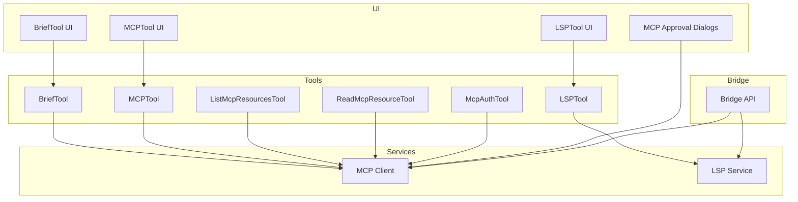
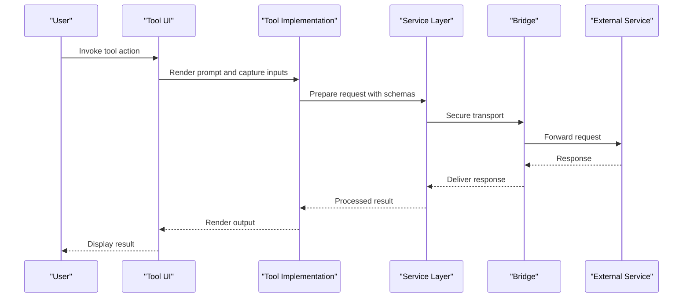
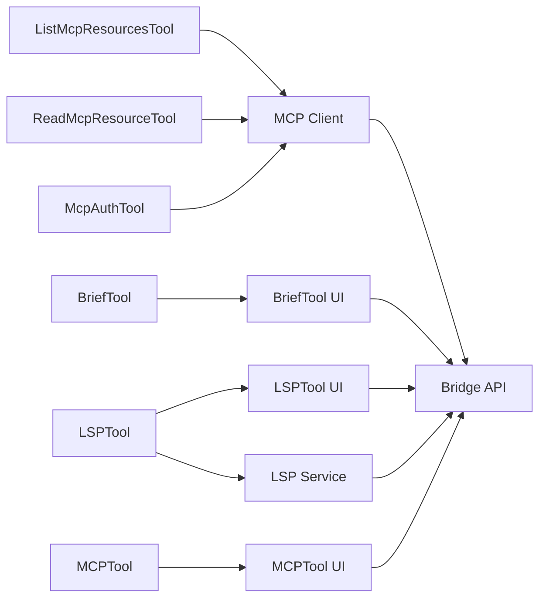

# Specialized Assistant Tools

<cite>
**Referenced Files in This Document**
- [BriefTool.ts](file://claude_code_src/restored-src/src/tools/BriefTool/BriefTool.ts)
- [BriefTool.prompt.ts](file://claude_code_src/restored-src/src/tools/BriefTool/prompt.ts)
- [BriefTool.UI.tsx](file://claude_code_src/restored-src/src/tools/BriefTool/UI.tsx)
- [LSPTool.ts](file://claude_code_src/restored-src/src/tools/LSPTool/LSPTool.ts)
- [LSPTool.prompt.ts](file://claude_code_src/restored-src/src/tools/LSPTool/prompt.ts)
- [LSPTool.UI.tsx](file://claude_code_src/restored-src/src/tools/LSPTool/UI.tsx)
- [MCPTool.ts](file://claude_code_src/restored-src/src/tools/MCPTool/MCPTool.ts)
- [MCPTool.prompt.ts](file://claude_code_src/restored-src/src/tools/MCPTool/prompt.ts)
- [MCPTool.UI.tsx](file://claude_code_src/restored-src/src/tools/MCPTool/UI.tsx)
- [ListMcpResourcesTool.ts](file://claude_code_src/restored-src/src/tools/ListMcpResourcesTool/ListMcpResourcesTool.ts)
- [ReadMcpResourceTool.ts](file://claude_code_src/restored-src/src/tools/ReadMcpResourceTool/ReadMcpResourceTool.ts)
- [McpAuthTool.ts](file://claude_code_src/restored-src/src/tools/McpAuthTool/McpAuthTool.ts)
- [client.ts](file://claude_code_src/restored-src/src/services/mcp/client.ts)
- [mcpServerApproval.tsx](file://claude_code_src/restored-src/src/services/mcp/mcpServerApproval.tsx)
- [MCPServerApprovalDialog.tsx](file://claude_code_src/restored-src/src/components/mcp/MCPServerApprovalDialog.tsx)
- [MCPServerDesktopImportDialog.tsx](file://claude_code_src/restored-src/src/components/mcp/MCPServerDesktopImportDialog.tsx)
- [MCPServerMultiselectDialog.tsx](file://claude_code_src/restored-src/src/components/mcp/MCPServerMultiselectDialog.tsx)
- [MCPServerDialogCopy.tsx](file://claude_code_src/restored-src/src/components/mcp/MCPServerDialogCopy.tsx)
- [lsp.ts](file://claude_code_src/restored-src/src/services/lsp/lsp.ts)
- [lspConfig.ts](file://claude_code_src/restored-src/src/services/lsp/lspConfig.ts)
- [lspPluginRecommendation.tsx](file://claude_code_src/restored-src/src/hooks/useLspPluginRecommendation.tsx)
- [lspRecommendation.tsx](file://claude_code_src/restored-src/src/components/LspRecommendation/LspRecommendation.tsx)
- [bridgeApi.ts](file://claude_code_src/restored-src/src/bridge/bridgeApi.ts)
- [bridgeConfig.ts](file://claude_code_src/restored-src/src/bridge/bridgeConfig.ts)
- [types.ts](file://claude_code_src/restored-src/src/bridge/types.ts)
- [jwtUtils.ts](file://claude_code_src/restored-src/src/bridge/jwtUtils.ts)
- [envLessBridgeConfig.ts](file://claude_code_src/restored-src/src/bridge/envLessBridgeConfig.ts)
- [pollConfig.ts](file://claude_code_src/restored-src/src/bridge/pollConfig.ts)
- [pollConfigDefaults.ts](file://claude_code_src/restored-src/src/bridge/pollConfigDefaults.ts)
- [remoteBridgeCore.ts](file://claude_code_src/restored-src/src/bridge/remoteBridgeCore.ts)
- [replBridge.ts](file://claude_code_src/restored-src/src/bridge/replBridge.ts)
- [replBridgeHandle.ts](file://claude_code_src/restored-src/src/bridge/replBridgeHandle.ts)
- [replBridgeTransport.ts](file://claude_code_src/restored-src/src/bridge/replBridgeTransport.ts)
- [trustedDevice.ts](file://claude_code_src/restored-src/src/bridge/trustedDevice.ts)
- [workSecret.ts](file://claude_code_src/restored-src/src/bridge/workSecret.ts)
- [inboundMessages.ts](file://claude_code_src/restored-src/src/bridge/inboundMessages.ts)
- [inboundAttachments.ts](file://claude_code_src/restored-src/src/bridge/inboundAttachments.ts)
- [flushGate.ts](file://claude_code_src/restored-src/src/bridge/flushGate.ts)
- [capacityWake.ts](file://claude_code_src/restored-src/src/bridge/capacityWake.ts)
- [sessionRunner.ts](file://claude_code_src/restored-src/src/bridge/sessionRunner.ts)
- [sessionIdCompat.ts](file://claude_code_src/restored-src/src/bridge/sessionIdCompat.ts)
- [createSession.ts](file://claude_code_src/restored-src/src/bridge/createSession.ts)
- [codeSessionApi.ts](file://claude_code_src/restored-src/src/bridge/codeSessionApi.ts)
- [initReplBridge.ts](file://claude_code_src/restored-src/src/bridge/initReplBridge.ts)
- [debugUtils.ts](file://claude_code_src/restored-src/src/bridge/debugUtils.ts)
- [bridgeDebug.ts](file://claude_code_src/restored-src/src/bridge/bridgeDebug.ts)
- [bridgeEnabled.ts](file://claude_code_src/restored-src/src/bridge/bridgeEnabled.ts)
- [bridgeMain.ts](file://claude_code_src/restored-src/src/bridge/bridgeMain.ts)
- [bridgeMessaging.ts](file://claude_code_src/restored-src/src/bridge/bridgeMessaging.ts)
- [bridgePermissionCallbacks.ts](file://claude_code_src/restored-src/src/bridge/bridgePermissionCallbacks.ts)
- [bridgePointer.ts](file://claude_code_src/restored-src/src/bridge/bridgePointer.ts)
- [bridgeStatusUtil.ts](file://claude_code_src/restored-src/src/bridge/bridgeStatusUtil.ts)
- [bridgeUI.ts](file://claude_code_src/restored-src/src/bridge/bridgeUI.ts)
- [state.ts](file://claude_code_src/restored-src/src/bootstrap/state.ts)
- [sessionHistory.ts](file://claude_code_src/restored-src/src/assistant/sessionHistory.ts)
- [constants.tools.ts](file://claude_code_src/restored-src/src/constants/tools.ts)
- [constants.betas.ts](file://claude_code_src/restored-src/src/constants/betas.ts)
- [constants.system.ts](file://claude_code_src/restored-src/src/constants/system.ts)
- [constants.prompts.ts](file://claude_code_src/restored-src/src/constants/prompts.ts)
- [constants.messages.ts](file://claude_code_src/restored-src/src/constants/messages.ts)
- [constants.outputStyles.ts](file://claude_code_src/restored-src/src/constants/outputStyles.ts)
- [constants.apiLimits.ts](file://claude_code_src/restored-src/src/constants/apiLimits.ts)
- [constants.errorIds.ts](file://claude_code_src/restored-src/src/constants/errorIds.ts)
- [constants.figures.ts](file://claude_code_src/restored-src/src/constants/figures.ts)
- [constants.files.ts](file://claude_code_src/restored-src/src/constants/files.ts)
- [constants.oauth.ts](file://claude_code_src/restored-src/src/constants/oauth.ts)
- [constants.xml.ts](file://claude_code_src/restored-src/src/constants/xml.ts)
- [constants.common.ts](file://claude_code_src/restored-src/src/constants/common.ts)
- [constants.cyberRiskInstruction.ts](file://claude_code_src/restored-src/src/constants/cyberRiskInstruction.ts)
- [constants.toolLimits.ts](file://claude_code_src/restored-src/src/constants/toolLimits.ts)
- [constants.systemPromptSections.ts](file://claude_code_src/restored-src/src/constants/systemPromptSections.ts)
- [constants.keybindings.ts](file://claude_code_src/restored-src/src/constants/keys.ts)
- [constants.keys.ts](file://claude_code_src/restored-src/src/constants/keys.ts)
- [constants.product.ts](file://claude_code_src/restored-src/src/constants/product.ts)
- [constants.turnCompletionVerbs.ts](file://claude_code_src/restored-src/src/constants/turnCompletionVerbs.ts)
- [constants.spinnerVerbs.ts](file://claude_code_src/restored-src/src/constants/spinnerVerbs.ts)
- [constants.github-app.ts](file://claude_code_src/restored-src/src/constants/github-app.ts)
- [constants.figure.ts](file://claude_code_src/restored-src/src/constants/figures.ts)
- [constants.file.ts](file://claude_code_src/restored-src/src/constants/files.ts)
- [constants.message.ts](file://claude_code_src/restored-src/src/constants/messages.ts)
- [constants.prompt.ts](file://claude_code_src/restored-src/src/constants/prompts.ts)
- [constants.outputStyle.ts](file://claude_code_src/restored-src/src/constants/outputStyles.ts)
- [constants.apiLimit.ts](file://claude_code_src/restored-src/src/constants/apiLimits.ts)
- [constants.errorId.ts](file://claude_code_src/restored-src/src/constants/errorIds.ts)
- [constants.figure.ts](file://claude_code_src/restored-src/src/constants/figures.ts)
- [constants.file.ts](file://claude_code_src/restored-src/src/constants/files.ts)
- [constants.message.ts](file://claude_code_src/restored-src/src/constants/messages.ts)
- [constants.prompt.ts](file://claude_code_src/restored-src/src/constants/prompts.ts)
- [constants.outputStyle.ts](file://claude_code_src/restored-src/src/constants/outputStyles.ts)
- [constants.apiLimit.ts](file://claude_code_src/restored-src/src/constants/apiLimits.ts)
- [constants.errorId.ts](file://claude_code_src/restored-src/src/constants/errorIds.ts)
- [constants.figure.ts](file://claude_code_src/restored-src/src/constants/figures.ts)
- [constants.file.ts](file://claude_code_src/restored-src/src/constants/files.ts)
- [constants.message.ts](file://claude_code_src/restored-src/src/constants/messages.ts)
- [constants.prompt.ts](file://claude_code_src/restored-src/src/constants/prompts.ts)
- [constants.outputStyle.ts](file://claude_code_src/restored-src/src/constants/outputStyles.ts)
- [constants.apiLimit.ts](file://claude_code_src/restored-src/src/constants/apiLimits.ts)
- [constants.errorId.ts](file://claude_code_src/restored-src/src/constants/errorIds.ts)
- [constants.figure.ts](file://claude_code_src/restored-src/src/constants/figures.ts)
- [constants.file.ts](file://claude_code_src/restored-src/src/constants/files.ts)
- [constants.message.ts](file://claude_code_src/restored-src/src/constants/messages.ts)
- [constants.prompt.ts](file://claude_code_src/restored-src/src/constants/prompts.ts)
- [constants.outputStyle.ts](file://claude_code_src/restored-src/src/constants/outputStyles.ts)
- [constants.apiLimit.ts](file://claude_code_src/restored-src/src/constants/apiLimits.ts)
- [constants.errorId.ts](file://claude_code_src/restored-src/src/constants/errorIds.ts)
- [constants.figure.ts](file://claude_code_src/restored-src/src/constants/figures.ts)
- [constants.file.ts](file://claude_code_src/restored-src/src/constants/files.ts)
- [constants.message.ts](file://claude_code_src/restored-src/src/constants/messages.ts)
- [constants.prompt.ts](file://claude_code_src/restored-src/src/constants/prompts.ts)
- [constants.outputStyle.ts](file://claude_code_src/restored-src/src/constants/outputStyles.ts)
- [constants.apiLimit.ts](file://claude_code_src/restored-src/src/constants/apiLimits.ts)
- [constants.errorId.ts](file://claude_code_src/restored-src/src/constants/errorIds.ts)
- [constants.figure.ts](file://claude_code_src/restored-src/src/constants/figures.ts)
- [constants.file.ts](file://claude_code_src/restored-src/src/constants/files.ts)
- [constants.message.ts](file://claude_code_src/restored-src/src/constants/messages.ts)
- [constants.prompt.ts](file://claude_code_src/restored-src/src/constants/prompts.ts)
- [constants.outputStyle.ts](file://claude_code_src/restored-src/src/constants/outputStyles.ts)
- [constants.apiLimit.ts](file://claude_code_src/restored-src/src/constants/apiLimits.ts)
- [constants.errorId.ts](file://claude_code_src/restored-src/src/constants/errorIds.ts)
- [constants.figure.ts](file://claude_code_src/restored-src/src/constants/figures.ts)
- [constants.file.ts](file://claude_code_src/restored-src/src/constants/files.ts)
- [constants.message.ts](file://claude_code_src/restored-src/src/constants/messages.ts)
- [constants.prompt.ts](file://claude_code_src/restored-src/src/constants/prompts.ts)
- [constants.outputStyle.ts](file://claude_code_src/restored-src/src/constants/outputStyles......)
</cite>

## Table of Contents
1. [Introduction](#introduction)
2. [Project Structure](#project-structure)
3. [Core Components](#core-components)
4. [Architecture Overview](#architecture-overview)
5. [Detailed Component Analysis](#detailed-component-analysis)
6. [Dependency Analysis](#dependency-analysis)
7. [Performance Considerations](#performance-considerations)
8. [Troubleshooting Guide](#troubleshooting-guide)
9. [Conclusion](#conclusion)
10. [Appendices](#appendices)

## Introduction
This document focuses on specialized assistant tools that enable AI-assisted functionality, language server protocol (LSP) integration, and Model Context Protocol (MCP) support. It covers:
- BriefTool for content summarization
- LSPTool for language server protocol integration
- MCPTool for Model Context Protocol support
- MCP resource management tools (listing and reading resources)
- Authentication and approval flows for MCP servers
- LSP configuration and recommendation mechanisms
- AI safety considerations, performance characteristics, and security protocols

The goal is to provide practical guidance for invoking tools, configuring LSP, setting up MCP servers, accessing MCP resources, and understanding tool-specific parameters, AI model integration, and external service connectivity.

## Project Structure
The specialized tools are implemented under the tools directory and integrate with services for MCP and LSP. UI components and bridge infrastructure support tool execution and user interaction.

**Diagram sources**
- [BriefTool.ts](file://claude_code_src/restored-src/src/tools/BriefTool/BriefTool.ts)
- [LSPTool.ts](file://claude_code_src/restored-src/src/tools/LSPTool/LSPTool.ts)
- [MCPTool.ts](file://claude_code_src/restored-src/src/tools/MCPTool/MCPTool.ts)
- [ListMcpResourcesTool.ts](file://claude_code_src/restored-src/src/tools/ListMcpResourcesTool/ListMcpResourcesTool.ts)
- [ReadMcpResourceTool.ts](file://claude_code_src/restored-src/src/tools/ReadMcpResourceTool/ReadMcpResourceTool.ts)
- [McpAuthTool.ts](file://claude_code_src/restored-src/src/tools/McpAuthTool/McpAuthTool.ts)
- [client.ts](file://claude_code_src/restored-src/src/services/mcp/client.ts)
- [lsp.ts](file://claude_code_src/restored-src/src/services/lsp/lsp.ts)
- [MCPServerApprovalDialog.tsx](file://claude_code_src/restored-src/src/components/mcp/MCPServerApprovalDialog.tsx)
- [bridgeApi.ts](file://claude_code_src/restored-src/src/bridge/bridgeApi.ts)

**Section sources**
- [BriefTool.ts](file://claude_code_src/restored-src/src/tools/BriefTool/BriefTool.ts)
- [LSPTool.ts](file://claude_code_src/restored-src/src/tools/LSPTool/LSPTool.ts)
- [MCPTool.ts](file://claude_code_src/restored-src/src/tools/MCPTool/MCPTool.ts)
- [ListMcpResourcesTool.ts](file://claude_code_src/restored-src/src/tools/ListMcpResourcesTool/ListMcpResourcesTool.ts)
- [ReadMcpResourceTool.ts](file://claude_code_src/restored-src/src/tools/ReadMcpResourceTool/ReadMcpResourceTool.ts)
- [McpAuthTool.ts](file://claude_code_src/restored-src/src/tools/McpAuthTool/McpAuthTool.ts)
- [client.ts](file://claude_code_src/restored-src/src/services/mcp/client.ts)
- [lsp.ts](file://claude_code_src/restored-src/src/services/lsp/lsp.ts)
- [MCPServerApprovalDialog.tsx](file://claude_code_src/restored-src/src/components/mcp/MCPServerApprovalDialog.tsx)
- [bridgeApi.ts](file://claude_code_src/restored-src/src/bridge/bridgeApi.ts)

## Core Components
This section introduces the specialized tools and their roles:
- BriefTool: Summarizes content using AI to produce concise, accurate summaries.
- LSPTool: Integrates with language servers to provide diagnostics, completions, and refactoring via LSP.
- MCPTool: Executes MCP-capable tools and manages permissions and approvals.
- ListMcpResourcesTool: Lists MCP resources exposed by connected servers.
- ReadMcpResourceTool: Reads MCP resources by URI.
- McpAuthTool: Handles authentication flows for MCP servers.

Each tool defines input/output schemas, prompts, and UI rendering helpers. They rely on services for MCP and LSP, and leverage bridge infrastructure for secure communication.

**Section sources**
- [BriefTool.ts](file://claude_code_src/restored-src/src/tools/BriefTool/BriefTool.ts)
- [BriefTool.prompt.ts](file://claude_code_src/restored-src/src/tools/BriefTool/prompt.ts)
- [BriefTool.UI.tsx](file://claude_code_src/restored-src/src/tools/BriefTool/UI.tsx)
- [LSPTool.ts](file://claude_code_src/restored-src/src/tools/LSPTool/LSPTool.ts)
- [LSPTool.prompt.ts](file://claude_code_src/restored-src/src/tools/LSPTool/prompt.ts)
- [LSPTool.UI.tsx](file://claude_code_src/restored-src/src/tools/LSPTool/UI.tsx)
- [MCPTool.ts](file://claude_code_src/restored-src/src/tools/MCPTool/MCPTool.ts)
- [MCPTool.prompt.ts](file://claude_code_src/restored-src/src/tools/MCPTool/prompt.ts)
- [MCPTool.UI.tsx](file://claude_code_src/restored-src/src/tools/MCPTool/UI.tsx)
- [ListMcpResourcesTool.ts](file://claude_code_src/restored-src/src/tools/ListMcpResourcesTool/ListMcpResourcesTool.ts)
- [ReadMcpResourceTool.ts](file://claude_code_src/restored-src/src/tools/ReadMcpResourceTool/ReadMcpResourceTool.ts)
- [McpAuthTool.ts](file://claude_code_src/restored-src/src/tools/McpAuthTool/McpAuthTool.ts)

## Architecture Overview
The tools integrate with services and UI components, and communicate securely through the bridge layer. MCP tools are validated against client capabilities and permissions, while LSP tools coordinate with language servers configured per project.

**Diagram sources**
- [BriefTool.UI.tsx](file://claude_code_src/restored-src/src/tools/BriefTool/UI.tsx)
- [LSPTool.UI.tsx](file://claude_code_src/restored-src/src/tools/LSPTool/UI.tsx)
- [MCPTool.UI.tsx](file://claude_code_src/restored-src/src/tools/MCPTool/UI.tsx)
- [client.ts](file://claude_code_src/restored-src/src/services/mcp/client.ts)
- [lsp.ts](file://claude_code_src/restored-src/src/services/lsp/lsp.ts)
- [bridgeApi.ts](file://claude_code_src/restored-src/src/bridge/bridgeApi.ts)

## Detailed Component Analysis

### BriefTool: Content Summarization
BriefTool enables AI-assisted summarization of content. It defines input and output schemas, prompts, and UI rendering helpers. Typical usage involves providing content to summarize and optional constraints (e.g., length, tone).

Key aspects:
- Input schema: Accepts content and optional parameters (e.g., target length, audience).
- Output schema: Returns a structured summary with metadata.
- Prompting: Uses curated prompts to guide AI behavior for accuracy and relevance.
- UI: Renders tool use messages and results with truncation handling for long outputs.

Practical example:
- Invoke BriefTool with content and desired summary length.
- Review rendered summary and adjust parameters if needed.

AI model integration:
- Uses AI model configured in the system to generate summaries.
- Leverages prompt engineering to maintain quality and safety.

Safety considerations:
- Truncation checks prevent oversized outputs.
- Controlled prompt templates reduce risk of unsafe content.

**Section sources**
- [BriefTool.ts](file://claude_code_src/restored-src/src/tools/BriefTool/BriefTool.ts)
- [BriefTool.prompt.ts](file://claude_code_src/restored-src/src/tools/BriefTool/prompt.ts)
- [BriefTool.UI.tsx](file://claude_code_src/restored-src/src/tools/BriefTool/UI.tsx)

### LSPTool: Language Server Protocol Integration
LSPTool integrates with language servers to provide IDE-like capabilities. It coordinates with LSP configuration and recommendation systems.

Key aspects:
- Input schema: Accepts document URIs, actions (e.g., hover, completion, diagnostics), and optional filters.
- Output schema: Returns structured LSP responses (e.g., diagnostics, completions).
- Prompting: Guides AI to interpret LSP responses and present actionable insights.
- UI: Renders LSP interactions and recommendations.

Practical example:
- Configure LSP for a project using recommended language servers.
- Invoke LSPTool to fetch diagnostics or completions for a selected file region.

LSP configuration:
- Per-project language server settings.
- Recommendation dialogs to select appropriate LSP plugins.

Performance considerations:
- Caching and throttling to avoid excessive LSP requests.
- Batch operations where supported by the language server.

**Section sources**
- [LSPTool.ts](file://claude_code_src/restored-src/src/tools/LSPTool/LSPTool.ts)
- [LSPTool.prompt.ts](file://claude_code_src/restored-src/src/tools/LSPTool/prompt.ts)
- [LSPTool.UI.tsx](file://claude_code_src/restored-src/src/tools/LSPTool/UI.tsx)
- [lsp.ts](file://claude_code_src/restored-src/src/services/lsp/lsp.ts)
- [lspConfig.ts](file://claude_code_src/restored-src/src/services/lsp/lspConfig.ts)
- [lspPluginRecommendation.tsx](file://claude_code_src/restored-src/src/hooks/useLspPluginRecommendation.tsx)
- [lspRecommendation.tsx](file://claude_code_src/restored-src/src/components/LspRecommendation/LspRecommendation.tsx)

### MCPTool: Model Context Protocol Support
MCPTool executes MCP-capable tools and manages permissions and approvals. It validates tool capabilities and enforces security policies.

Key aspects:
- Input schema: Accepts MCP tool name and parameters.
- Output schema: Returns structured results from MCP tools.
- Permission checks: Requires explicit approval for MCP tools.
- UI: Renders tool use messages and approval prompts.

Practical example:
- Discover MCP tools via ListMcpResourcesTool.
- Invoke MCPTool with required parameters after approval.
- Monitor tool behavior and adjust permissions as needed.

MCP server setup:
- Connect to MCP servers and manage approvals.
- Use approval dialogs to configure server trust and capabilities.

Security protocols:
- Permission gating for MCP tool execution.
- Approval workflows for new or untrusted servers.

**Section sources**
- [MCPTool.ts](file://claude_code_src/restored-src/src/tools/MCPTool/MCPTool.ts)
- [MCPTool.prompt.ts](file://claude_code_src/restored-src/src/tools/MCPTool/prompt.ts)
- [MCPTool.UI.tsx](file://claude_code_src/restored-src/src/tools/MCPTool/UI.tsx)
- [client.ts](file://claude_code_src/restored-src/src/services/mcp/client.ts)
- [mcpServerApproval.tsx](file://claude_code_src/restored-src/src/services/mcp/mcpServerApproval.tsx)
- [MCPServerApprovalDialog.tsx](file://claude_code_src/restored-src/src/components/mcp/MCPServerApprovalDialog.tsx)
- [MCPServerDesktopImportDialog.tsx](file://claude_code_src/restored-src/src/components/mcp/MCPServerDesktopImportDialog.tsx)
- [MCPServerMultiselectDialog.tsx](file://claude_code_src/restored-src/src/components/mcp/MCPServerMultiselectDialog.tsx)
- [MCPServerDialogCopy.tsx](file://claude_code_src/restored-src/src/components/mcp/MCPServerDialogCopy.tsx)

### MCP Resource Management Tools
These tools manage MCP resources exposed by servers:
- ListMcpResourcesTool: Lists resources with metadata (URI, name, MIME type, description, server).
- ReadMcpResourceTool: Reads a specific resource by URI.
- McpAuthTool: Handles authentication flows for MCP servers.

Practical example:
- Use ListMcpResourcesTool to discover available resources.
- Use ReadMcpResourceTool to fetch a specific resource.
- Use McpAuthTool to authenticate with MCP servers requiring credentials.

Security and safety:
- Resource access is governed by MCP permissions and approvals.
- Authentication ensures secure access to protected resources.

**Section sources**
- [ListMcpResourcesTool.ts](file://claude_code_src/restored-src/src/tools/ListMcpResourcesTool/ListMcpResourcesTool.ts)
- [ReadMcpResourceTool.ts](file://claude_code_src/restored-src/src/tools/ReadMcpResourceTool/ReadMcpResourceTool.ts)
- [McpAuthTool.ts](file://claude_code_src/restored-src/src/tools/McpAuthTool/McpAuthTool.ts)
- [client.ts](file://claude_code_src/restored-src/src/services/mcp/client.ts)

## Dependency Analysis
The tools depend on services and UI components, and communicate through the bridge layer. MCP tools are validated against client capabilities and permissions, while LSP tools coordinate with language servers.

**Diagram sources**
- [BriefTool.ts](file://claude_code_src/restored-src/src/tools/BriefTool/BriefTool.ts)
- [BriefTool.UI.tsx](file://claude_code_src/restored-src/src/tools/BriefTool/UI.tsx)
- [LSPTool.ts](file://claude_code_src/restored-src/src/tools/LSPTool/LSPTool.ts)
- [LSPTool.UI.tsx](file://claude_code_src/restored-src/src/tools/LSPTool/UI.tsx)
- [MCPTool.ts](file://claude_code_src/restored-src/src/tools/MCPTool/MCPTool.ts)
- [MCPTool.UI.tsx](file://claude_code_src/restored-src/src/tools/MCPTool/UI.tsx)
- [ListMcpResourcesTool.ts](file://claude_code_src/restored-src/src/tools/ListMcpResourcesTool/ListMcpResourcesTool.ts)
- [ReadMcpResourceTool.ts](file://claude_code_src/restored-src/src/tools/ReadMcpResourceTool/ReadMcpResourceTool.ts)
- [McpAuthTool.ts](file://claude_code_src/restored-src/src/tools/McpAuthTool/McpAuthTool.ts)
- [client.ts](file://claude_code_src/restored-src/src/services/mcp/client.ts)
- [lsp.ts](file://claude_code_src/restored-src/src/services/lsp/lsp.ts)
- [bridgeApi.ts](file://claude_code_src/restored-src/src/bridge/bridgeApi.ts)

**Section sources**
- [client.ts](file://claude_code_src/restored-src/src/services/mcp/client.ts)
- [lsp.ts](file://claude_code_src/restored-src/src/services/lsp/lsp.ts)
- [bridgeApi.ts](file://claude_code_src/restored-src/src/bridge/bridgeApi.ts)

## Performance Considerations
- BriefTool: Truncation checks and controlled prompt templates improve responsiveness and reduce token overhead.
- LSPTool: Caching and throttling minimize repeated LSP requests; batch operations where supported.
- MCPTool: Permission checks and approval workflows prevent unnecessary network calls; ensure servers are configured efficiently.
- Bridge: Secure transport adds minimal overhead; ensure connection stability to avoid retries.

[No sources needed since this section provides general guidance]

## Troubleshooting Guide
Common issues and resolutions:
- MCP server not responding:
  - Verify server approval and connectivity.
  - Use McpAuthTool to re-authenticate if required.
- LSPTool errors:
  - Check LSP configuration and plugin recommendations.
  - Reconfigure language servers if diagnostics are missing.
- Output truncation:
  - Adjust BriefTool parameters to fit terminal width.
  - Use resource listing and reading tools to access full content.

**Section sources**
- [mcpServerApproval.tsx](file://claude_code_src/restored-src/src/services/mcp/mcpServerApproval.tsx)
- [MCPServerApprovalDialog.tsx](file://claude_code_src/restored-src/src/components/mcp/MCPServerApprovalDialog.tsx)
- [lspPluginRecommendation.tsx](file://claude_code_src/restored-src/src/hooks/useLspPluginRecommendation.tsx)
- [BriefTool.UI.tsx](file://claude_code_src/restored-src/src/tools/BriefTool/UI.tsx)

## Conclusion
The specialized assistant tools provide powerful AI-assisted functionality, robust LSP integration, and secure MCP support. By leveraging tool schemas, UI components, and bridge infrastructure, users can summarize content, interact with language servers, and access MCP resources safely and efficiently. Proper configuration, permission management, and performance tuning ensure reliable operation across diverse development scenarios.

[No sources needed since this section summarizes without analyzing specific files]

## Appendices

### Practical Examples Index
- Tool invocation:
  - BriefTool: Provide content and summary constraints.
  - LSPTool: Select document and action (hover/completion/diagnostics).
  - MCPTool: Choose MCP tool and approve execution.
- LSP configuration:
  - Use recommendation dialogs to select language servers.
  - Configure per-project LSP settings.
- MCP server setup:
  - Approve servers via dialogs.
  - Authenticate using McpAuthTool.
- Resource access:
  - List resources with ListMcpResourcesTool.
  - Read specific resources with ReadMcpResourceTool.

[No sources needed since this section provides general guidance]