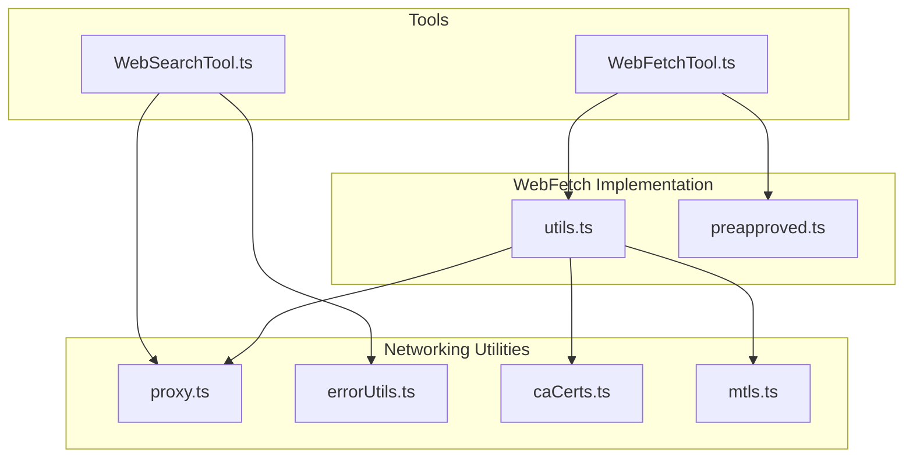
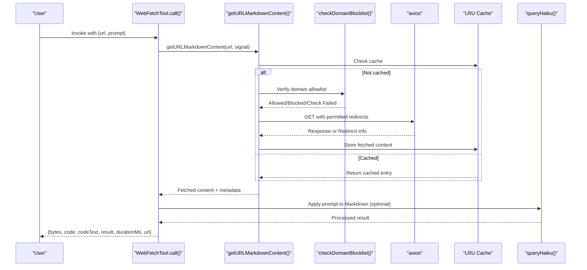
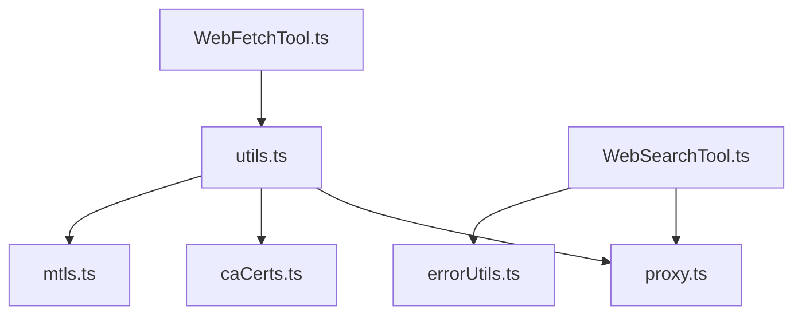

# Web and Network Tools

<cite>
**Referenced Files in This Document**
- [WebFetchTool.ts](file://src/tools/WebFetchTool/WebFetchTool.ts)
- [utils.ts](file://src/tools/WebFetchTool/utils.ts)
- [preapproved.ts](file://src/tools/WebFetchTool/preapproved.ts)
- [WebSearchTool.ts](file://src/tools/WebSearchTool/WebSearchTool.ts)
- [proxy.ts](file://src/utils/proxy.ts)
- [errorUtils.ts](file://src/services/api/errorUtils.ts)
- [caCerts.ts](file://src/utils/caCerts.ts)
- [mtls.ts](file://src/utils/mtls.ts)
</cite>

## Table of Contents
1. [Introduction](#introduction)
2. [Project Structure](#project-structure)
3. [Core Components](#core-components)
4. [Architecture Overview](#architecture-overview)
5. [Detailed Component Analysis](#detailed-component-analysis)
6. [Dependency Analysis](#dependency-analysis)
7. [Performance Considerations](#performance-considerations)
8. [Troubleshooting Guide](#troubleshooting-guide)
9. [Conclusion](#conclusion)

## Introduction
This document explains the web and network tools available in the project, focusing on:
- WebFetchTool: fetching and extracting content from URLs, with permission gating, caching, and safety checks.
- WebSearchTool: performing web searches via a hosted tool interface with streaming progress and domain filtering.

It covers capabilities, configuration options, network security considerations, and practical examples for invocation, URL handling, request/response processing, and error scenarios. It also documents tool-specific parameters, authentication considerations, rate limiting, and proxy/SSL/TLS handling.

## Project Structure
The web tools live under src/tools and integrate with shared networking utilities:
- WebFetchTool: tool definition, permission checks, caching, and content extraction pipeline.
- WebSearchTool: tool definition, streaming progress, and Anthropic-hosted tool orchestration.
- Networking utilities: proxy configuration, mTLS, CA certificates, and error formatting.

**Diagram sources**
- [WebFetchTool.ts:1-319](file://src/tools/WebFetchTool/WebFetchTool.ts#L1-L319)
- [WebSearchTool.ts:1-436](file://src/tools/WebSearchTool/WebSearchTool.ts#L1-L436)
- [utils.ts:1-531](file://src/tools/WebFetchTool/utils.ts#L1-L531)
- [preapproved.ts:1-167](file://src/tools/WebFetchTool/preapproved.ts#L1-L167)
- [proxy.ts:1-427](file://src/utils/proxy.ts#L1-L427)
- [errorUtils.ts:1-261](file://src/services/api/errorUtils.ts#L1-L261)
- [caCerts.ts:1-116](file://src/utils/caCerts.ts#L1-L116)
- [mtls.ts:1-180](file://src/utils/mtls.ts#L1-L180)

**Section sources**
- [WebFetchTool.ts:1-319](file://src/tools/WebFetchTool/WebFetchTool.ts#L1-L319)
- [WebSearchTool.ts:1-436](file://src/tools/WebSearchTool/WebSearchTool.ts#L1-L436)
- [utils.ts:1-531](file://src/tools/WebFetchTool/utils.ts#L1-L531)
- [proxy.ts:1-427](file://src/utils/proxy.ts#L1-L427)

## Core Components
- WebFetchTool
  - Purpose: Fetch a URL, convert HTML to Markdown, optionally apply a user prompt to extract insights, and return structured results with metadata.
  - Key features:
    - Permission gating by hostname and preapproved host list.
    - Redirect handling with strict host-permission checks.
    - Content caching and binary content persistence.
    - Safety validations (URL length, protocol, credentials, internal domains).
    - Optional preflight domain allowlist check.
  - Inputs: url, prompt.
  - Outputs: bytes, code, codeText, result, durationMs, url.
  - Security: Preapproved host exceptions for code-related domains; strict redirect rules; binary content persisted separately; abort signals respected.

- WebSearchTool
  - Purpose: Perform web searches via a hosted tool interface, stream progress, and return results with citations.
  - Key features:
    - Streaming progress updates for query and result counts.
    - Tool schema with allowed/blocked domains and a fixed max uses.
    - Provider/model gating (first-party, Vertex AI, Foundry).
    - Permission gating via rule suggestions.
  - Inputs: query, allowed_domains (optional), blocked_domains (optional).
  - Outputs: query, results (mixed text and search hits), durationSeconds.
  - Security: Domain filters reduce risk; provider gating aligns with supported models.

**Section sources**
- [WebFetchTool.ts:24-46](file://src/tools/WebFetchTool/WebFetchTool.ts#L24-L46)
- [WebFetchTool.ts:208-299](file://src/tools/WebFetchTool/WebFetchTool.ts#L208-L299)
- [utils.ts:139-169](file://src/tools/WebFetchTool/utils.ts#L139-L169)
- [utils.ts:262-329](file://src/tools/WebFetchTool/utils.ts#L262-L329)
- [WebSearchTool.ts:25-67](file://src/tools/WebSearchTool/WebSearchTool.ts#L25-L67)
- [WebSearchTool.ts:254-400](file://src/tools/WebSearchTool/WebSearchTool.ts#L254-L400)

## Architecture Overview
The tools integrate with shared networking utilities for proxy, TLS, and error handling.

**Diagram sources**
- [WebFetchTool.ts:208-299](file://src/tools/WebFetchTool/WebFetchTool.ts#L208-L299)
- [utils.ts:347-482](file://src/tools/WebFetchTool/utils.ts#L347-L482)
- [utils.ts:176-203](file://src/tools/WebFetchTool/utils.ts#L176-L203)
- [utils.ts:262-329](file://src/tools/WebFetchTool/utils.ts#L262-L329)

## Detailed Component Analysis

### WebFetchTool
Capabilities
- Fetches a URL, converts HTML to Markdown, and optionally applies a user prompt to extract insights.
- Respects preapproved hosts and user permission rules.
- Handles redirects safely by validating host changes.
- Persists binary content to disk and references it in the result.
- Applies abort signals and timeouts to prevent hangs.

Configuration options
- url: Target URL (validated for length, protocol, and credentials).
- prompt: Optional prompt applied to Markdown content.

Outputs
- bytes: Size of fetched content in bytes.
- code: HTTP response code.
- codeText: HTTP response text.
- result: Processed result string.
- durationMs: Time taken for fetch and processing.
- url: Original URL.

Permission and safety
- Preapproved host list for code-related domains.
- Redirects are only followed if they preserve the host (including www normalization).
- Domain preflight check against allowlist endpoint.
- Binary content persisted separately for inspection.

Rate limiting and concurrency
- Concurrency-safe; designed for concurrent use.
- Built-in timeouts and redirect limits to avoid resource exhaustion.

Practical examples
- Invocation: Provide url and prompt. If the URL redirects to a different host, the tool returns a message with the redirect details and suggests using the new URL.
- URL handling: http upgrades to https; relative redirects resolved against the original URL.
- Request/response processing: Content-Type determines HTML-to-Markdown conversion; binary content persisted with a derived filename.
- Error scenarios: Redirect without Location header; too many redirects; domain blocked; domain check failure; egress proxy block; timeouts; aborted by user.

Network security considerations
- Strict redirect rules prevent open redirect attacks.
- Preapproved host exceptions are limited to GET requests and do not extend to sandbox network restrictions.
- Proxy and TLS configuration respected globally and per-request.

SSL/TLS and proxy configuration
- Proxy support via environment variables and NO_PROXY.
- mTLS client certificates and custom CA bundles supported.
- Global agent configuration integrates with axios and undici.

**Section sources**
- [WebFetchTool.ts:66-180](file://src/tools/WebFetchTool/WebFetchTool.ts#L66-L180)
- [WebFetchTool.ts:181-204](file://src/tools/WebFetchTool/WebFetchTool.ts#L181-L204)
- [WebFetchTool.ts:208-299](file://src/tools/WebFetchTool/WebFetchTool.ts#L208-L299)
- [utils.ts:139-169](file://src/tools/WebFetchTool/utils.ts#L139-L169)
- [utils.ts:205-243](file://src/tools/WebFetchTool/utils.ts#L205-L243)
- [utils.ts:262-329](file://src/tools/WebFetchTool/utils.ts#L262-L329)
- [utils.ts:347-482](file://src/tools/WebFetchTool/utils.ts#L347-L482)
- [preapproved.ts:1-167](file://src/tools/WebFetchTool/preapproved.ts#L1-L167)
- [proxy.ts:64-129](file://src/utils/proxy.ts#L64-L129)
- [proxy.ts:168-192](file://src/utils/proxy.ts#L168-L192)
- [proxy.ts:198-237](file://src/utils/proxy.ts#L198-L237)
- [proxy.ts:327-388](file://src/utils/proxy.ts#L327-L388)
- [mtls.ts:23-73](file://src/utils/mtls.ts#L23-L73)
- [mtls.ts:78-95](file://src/utils/mtls.ts#L78-L95)
- [mtls.ts:117-151](file://src/utils/mtls.ts#L117-L151)
- [caCerts.ts:28-105](file://src/utils/caCerts.ts#L28-L105)

### WebSearchTool
Capabilities
- Performs web searches via a hosted tool interface with streaming progress.
- Supports allowed_domains and blocked_domains filters.
- Fixed maximum uses enforced per tool use.
- Provider/model gating for first-party, Vertex AI, and Foundry.

Configuration options
- query: Required search query.
- allowed_domains: Optional array of domains to include.
- blocked_domains: Optional array of domains to exclude.

Outputs
- query: Executed query.
- results: Mixed array of text commentary and search result objects with titles and URLs.
- durationSeconds: Total time for the search operation.

Permission and safety
- Requires explicit permission; suggests adding allow rules.
- Domain filters reduce risk of unwanted sources.

Rate limiting and concurrency
- Max uses enforced at the tool schema level.
- Concurrency-safe; designed for concurrent use.

Practical examples
- Invocation: Provide query and optional domain filters. The tool streams progress updates for queries and received results.
- Request/response processing: Parses server_tool_use and web_search_tool_result blocks; aggregates results and text commentary.
- Error scenarios: Tool result error objects surfaced as user-visible errors; provider/model gating may disable the tool.

Network security considerations
- Domain filters reduce exposure to untrusted sources.
- Provider/model gating aligns with supported configurations.

**Section sources**
- [WebSearchTool.ts:25-67](file://src/tools/WebSearchTool/WebSearchTool.ts#L25-L67)
- [WebSearchTool.ts:76-84](file://src/tools/WebSearchTool/WebSearchTool.ts#L76-L84)
- [WebSearchTool.ts:86-150](file://src/tools/WebSearchTool/WebSearchTool.ts#L86-L150)
- [WebSearchTool.ts:152-222](file://src/tools/WebSearchTool/WebSearchTool.ts#L152-L222)
- [WebSearchTool.ts:229-253](file://src/tools/WebSearchTool/WebSearchTool.ts#L229-L253)
- [WebSearchTool.ts:254-400](file://src/tools/WebSearchTool/WebSearchTool.ts#L254-L400)

### Network Security and Proxy Configuration
Proxy
- Environment variables: https_proxy/HTTPS_PROXY, http_proxy/HTTP_PROXY, no_proxy/NO_PROXY.
- NO_PROXY supports exact host, domain suffix, wildcard, and port-specific matches.
- Global agent configuration integrates axios interceptors and undici dispatcher respecting NO_PROXY.

TLS and mTLS
- Client certificates and private keys via environment variables.
- Custom CA bundles via NODE_EXTRA_CA_CERTS; system CA via Node options.
- Global TLS configuration for both axios and undici.

SSL/TLS error handling
- Extracts connection error details from the cause chain.
- Provides actionable hints for SSL/TLS errors, including corporate proxy scenarios.

**Section sources**
- [proxy.ts:64-129](file://src/utils/proxy.ts#L64-L129)
- [proxy.ts:168-192](file://src/utils/proxy.ts#L168-L192)
- [proxy.ts:198-237](file://src/utils/proxy.ts#L198-L237)
- [proxy.ts:327-388](file://src/utils/proxy.ts#L327-L388)
- [mtls.ts:23-73](file://src/utils/mtls.ts#L23-L73)
- [mtls.ts:78-95](file://src/utils/mtls.ts#L78-L95)
- [mtls.ts:117-151](file://src/utils/mtls.ts#L117-L151)
- [caCerts.ts:28-105](file://src/utils/caCerts.ts#L28-L105)
- [errorUtils.ts:42-83](file://src/services/api/errorUtils.ts#L42-L83)
- [errorUtils.ts:200-260](file://src/services/api/errorUtils.ts#L200-L260)

## Dependency Analysis
The tools depend on shared networking utilities for proxy, TLS, and error handling.

**Diagram sources**
- [WebFetchTool.ts:1-319](file://src/tools/WebFetchTool/WebFetchTool.ts#L1-L319)
- [utils.ts:1-531](file://src/tools/WebFetchTool/utils.ts#L1-L531)
- [WebSearchTool.ts:1-436](file://src/tools/WebSearchTool/WebSearchTool.ts#L1-L436)
- [proxy.ts:1-427](file://src/utils/proxy.ts#L1-L427)
- [errorUtils.ts:1-261](file://src/services/api/errorUtils.ts#L1-L261)
- [caCerts.ts:1-116](file://src/utils/caCerts.ts#L1-L116)
- [mtls.ts:1-180](file://src/utils/mtls.ts#L1-L180)

**Section sources**
- [WebFetchTool.ts:1-319](file://src/tools/WebFetchTool/WebFetchTool.ts#L1-L319)
- [WebSearchTool.ts:1-436](file://src/tools/WebSearchTool/WebSearchTool.ts#L1-L436)
- [utils.ts:1-531](file://src/tools/WebFetchTool/utils.ts#L1-L531)
- [proxy.ts:1-427](file://src/utils/proxy.ts#L1-L427)
- [errorUtils.ts:1-261](file://src/services/api/errorUtils.ts#L1-L261)
- [caCerts.ts:1-116](file://src/utils/caCerts.ts#L1-L116)
- [mtls.ts:1-180](file://src/utils/mtls.ts#L1-L180)

## Performance Considerations
- WebFetchTool
  - LRU cache with TTL and size limits reduces repeated fetches.
  - HTML-to-Markdown conversion deferred until needed; binary content persisted separately.
  - Timeouts and redirect limits prevent resource exhaustion.
- WebSearchTool
  - Streaming progress minimizes perceived latency.
  - Provider/model gating ensures efficient execution on supported backends.

[No sources needed since this section provides general guidance]

## Troubleshooting Guide
Common issues and resolutions
- SSL/TLS errors
  - Symptom: Certificate verification failures, expired or revoked certificates, hostname mismatches.
  - Resolution: Configure custom CA bundle via NODE_EXTRA_CA_CERTS; ensure system CA settings are correct; check corporate proxy interception.
- Proxy configuration
  - Symptom: Connectivity failures behind corporate proxies.
  - Resolution: Set HTTPS_PROXY/HTTP_PROXY; configure NO_PROXY for internal domains; verify mTLS settings if required.
- Redirect handling
  - Symptom: Redirect to different host detected.
  - Resolution: Use the suggested redirect URL; ensure the new host is acceptable.
- Domain blocklist
  - Symptom: Domain blocked or preflight check failed.
  - Resolution: Review allowlist configuration or contact administrator; consider skipping preflight for enterprise environments.
- Egress proxy blocks
  - Symptom: 403 with specific header indicating allowlist restriction.
  - Resolution: Adjust egress allowlist or use a different network path.

**Section sources**
- [errorUtils.ts:200-260](file://src/services/api/errorUtils.ts#L200-L260)
- [proxy.ts:64-129](file://src/utils/proxy.ts#L64-L129)
- [proxy.ts:327-388](file://src/utils/proxy.ts#L327-L388)
- [utils.ts:205-243](file://src/tools/WebFetchTool/utils.ts#L205-L243)
- [utils.ts:316-329](file://src/tools/WebFetchTool/utils.ts#L316-L329)

## Conclusion
WebFetchTool and WebSearchTool provide robust, secure, and configurable web access capabilities. They incorporate strong safety measures, proxy and TLS support, and clear error handling. By understanding their parameters, permission models, and network configuration options, users can effectively leverage these tools while maintaining security and performance.