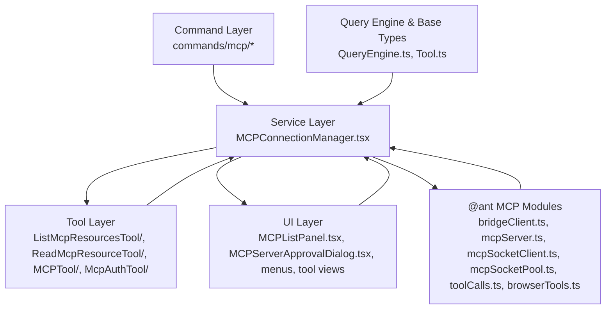
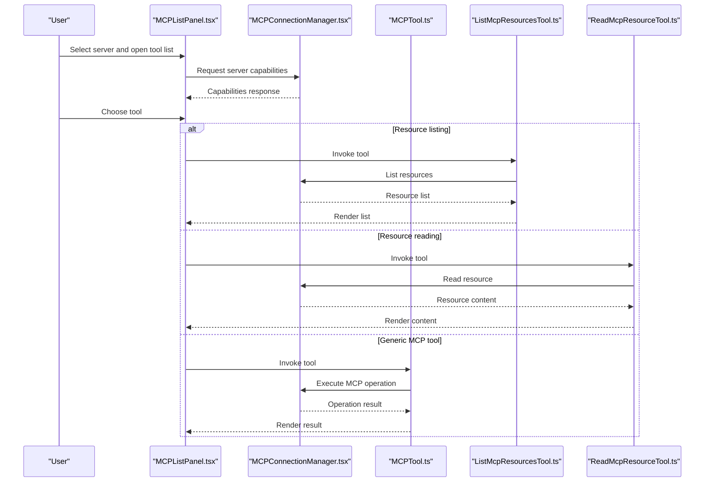
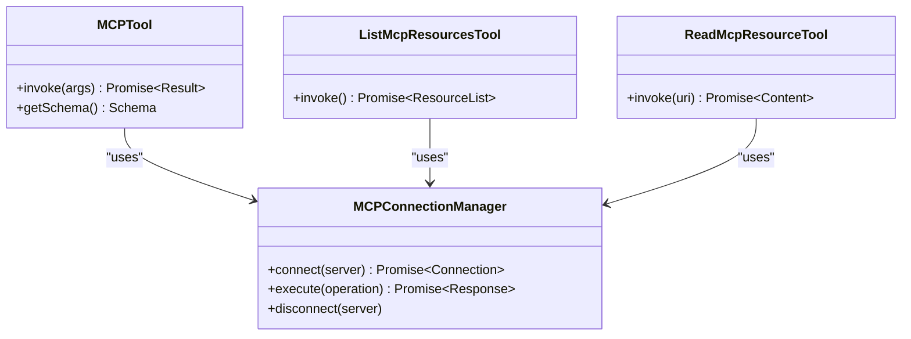
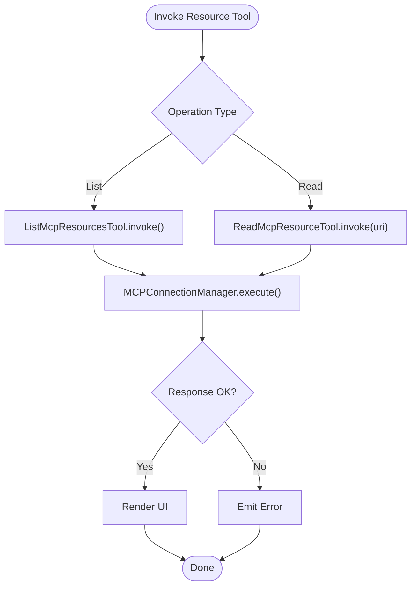
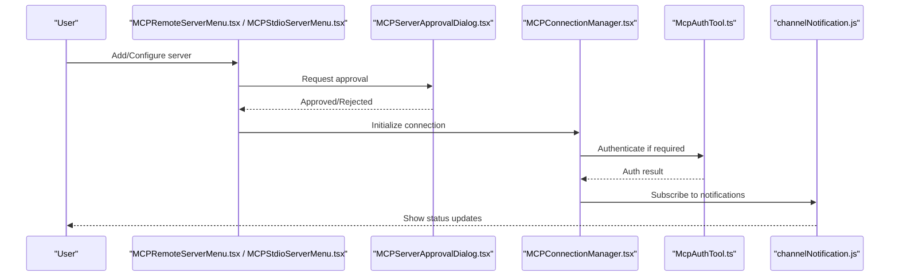
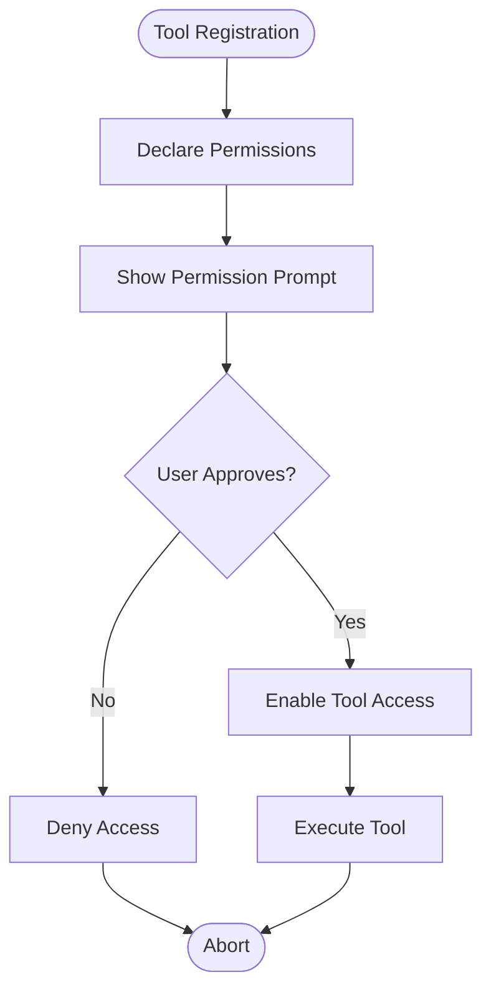
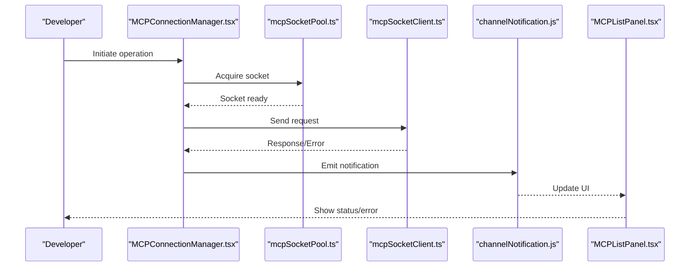
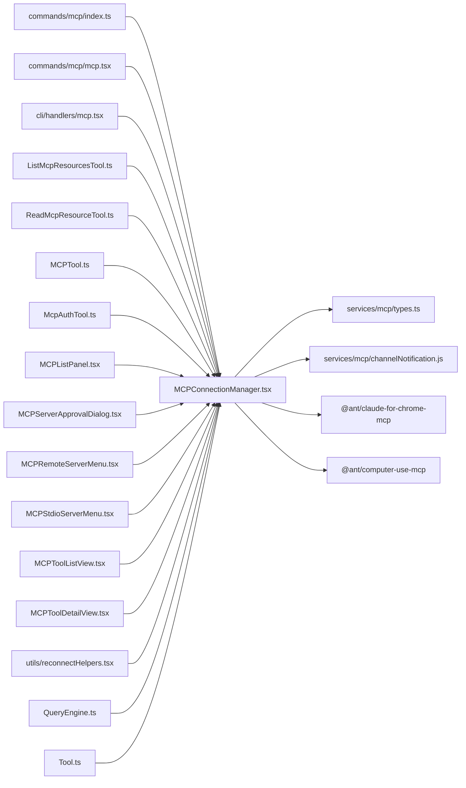

# MCP Tool Integration

<cite>
**Referenced Files in This Document**
- [index.ts](file://claude_code_src/restored-src/src/commands/mcp/index.ts)
- [mcp.tsx](file://claude_code_src/restored-src/src/commands/mcp/mcp.tsx)
- [mcp.tsx](file://claude_code_src/restored-src/src/cli/handlers/mcp.tsx)
- [MCPConnectionManager.tsx](file://claude_code_src/restored-src/src/services/mcp/MCPConnectionManager.tsx)
- [types.ts](file://claude_code_src/restored-src/src/services/mcp/types.ts)
- [channelNotification.js](file://claude_code_src/restored-src/src/services/mcp/channelNotification.js)
- [ListMcpResourcesTool.ts](file://claude_code_src/restored-src/src/tools/ListMcpResourcesTool/)
- [ReadMcpResourceTool.ts](file://claude_code_src/restored-src/src/tools/ReadMcpResourceTool/)
- [MCPTool.ts](file://claude_code_src/restored-src/src/tools/MCPTool/)
- [McpAuthTool.ts](file://claude_code_src/restored-src/src/tools/McpAuthTool/)
- [MCPListPanel.tsx](file://claude_code_src/restored-src/src/components/mcp/MCPListPanel.tsx)
- [MCPServerApprovalDialog.tsx](file://claude_code_src/restored-src/src/components/mcp/MCPServerApprovalDialog.tsx)
- [MCPRemoteServerMenu.tsx](file://claude_code_src/restored-src/src/components/mcp/MCPRemoteServerMenu.tsx)
- [MCPStdioServerMenu.tsx](file://claude_code_src/restored-src/src/components/mcp/MCPStdioServerMenu.tsx)
- [MCPToolListView.tsx](file://claude_code_src/restored-src/src/components/mcp/MCPToolListView.tsx)
- [MCPToolDetailView.tsx](file://claude_code_src/restored-src/src/components/mcp/MCPToolDetailView.tsx)
- [reconnectHelpers.tsx](file://claude_code_src/restored-src/src/components/mcp/utils/reconnectHelpers.tsx)
- [QueryEngine.ts](file://claude_code_src/restored-src/src/QueryEngine.ts)
- [Tool.ts](file://claude_code_src/restored-src/src/Tool.ts)
- [bridgeClient.ts](file://claude_code_src/restored-src/node_modules/@ant/claude-for-chrome-mcp/src/bridgeClient.ts)
- [mcpServer.ts](file://claude_code_src/restored-src/node_modules/@ant/claude-for-chrome-mcp/src/mcpServer.ts)
- [mcpSocketClient.ts](file://claude_code_src/restored-src/node_modules/@ant/claude-for-chrome-mcp/src/mcpSocketClient.ts)
- [mcpSocketPool.ts](file://claude_code_src/restored-src/node_modules/@ant/claude-for-chrome-mcp/src/mcpSocketPool.ts)
- [toolCalls.ts](file://claude_code_src/restored-src/node_modules/@ant/claude-for-chrome-mcp/src/toolCalls.ts)
- [browserTools.ts](file://claude_code_src/restored-src/node_modules/@ant/claude-for-chrome-mcp/src/browserTools.ts)
- [mcpServer.ts](file://claude_code_src/restored-src/node_modules/@ant/computer-use-mcp/src/mcpServer.ts)
- [tools.ts](file://claude_code_src/restored-src/node_modules/@ant/computer-use-mcp/src/tools.ts)
- [types.ts](file://claude_code_src/restored-src/node_modules/@ant/computer-use-mcp/src/types.ts)
</cite>

## Table of Contents
1. [Introduction](#introduction)
2. [Project Structure](#project-structure)
3. [Core Components](#core-components)
4. [Architecture Overview](#architecture-overview)
5. [Detailed Component Analysis](#detailed-component-analysis)
6. [Dependency Analysis](#dependency-analysis)
7. [Performance Considerations](#performance-considerations)
8. [Troubleshooting Guide](#troubleshooting-guide)
9. [Conclusion](#conclusion)

## Introduction
This document explains the Model Context Protocol (MCP) integration architecture within the project. It covers MCP tool discovery, execution patterns, and the MCP tool wrapper implementation. It also documents resource listing and reading capabilities, server configuration, authentication, and connection management. Security considerations, sandboxing, performance optimization, caching, connection pooling, and debugging/monitoring/troubleshooting approaches are included, with concrete references to relevant source files.

## Project Structure
The MCP integration spans several areas:
- CLI and command entry points for managing MCP servers
- Services for connection management and channel notifications
- Tools for listing resources, reading resources, and invoking MCP tools
- UI components for server lists, approval dialogs, menus, and tool views
- Utility helpers for reconnect behavior
- Query engine and base tool abstractions
- Node modules implementing Chrome extension MCP server, socket client/pool, and browser automation tools

```mermaid
graph TB
subgraph "CLI"
CMD["commands/mcp/index.ts"]
CMDC["commands/mcp/mcp.tsx"]
CLIH["cli/handlers/mcp.tsx"]
end
subgraph "Services"
CONN["services/mcp/MCPConnectionManager.tsx"]
TYPES["services/mcp/types.ts"]
CHNOTI["services/mcp/channelNotification.js"]
end
subgraph "Tools"
LISTR["ListMcpResourcesTool/"]
READR["ReadMcpResourceTool/"]
MCT["MCPTool/"]
AUTH["McpAuthTool/"]
end
subgraph "Components"
LISTP["MCPListPanel.tsx"]
APPROV["MCPServerApprovalDialog.tsx"]
REMENU["MCPRemoteServerMenu.tsx"]
SMENU["MCPStdioServerMenu.tsx"]
TLVIEW["MCPToolListView.tsx"]
TDET["MCPToolDetailView.tsx"]
RECONN["utils/reconnectHelpers.tsx"]
end
subgraph "Query & Base Types"
QENG["QueryEngine.ts"]
TOOL["Tool.ts"]
end
subgraph "Node Modules"
BRIDGE["@ant/claude-for-chrome-mcp<br/>bridgeClient.ts, mcpServer.ts, mcpSocketClient.ts, mcpSocketPool.ts, toolCalls.ts, browserTools.ts"]
CUSE["@ant/computer-use-mcp<br/>mcpServer.ts, tools.ts, types.ts"]
end
CMD --> CONN
CMDC --> CONN
CLIH --> CONN
CONN --> TYPES
CONN --> CHNOTI
LISTR --> CONN
READR --> CONN
MCT --> CONN
AUTH --> CONN
LISTP --> CONN
APPROV --> CONN
REMENU --> CONN
SMENU --> CONN
TLVIEW --> CONN
TDET --> CONN
RECONN --> CONN
QENG --> CONN
TOOL --> CONN
CONN --> BRIDGE
CONN --> CUSE
```

**Diagram sources**
- [index.ts:1-13](file://claude_code_src/restored-src/src/commands/mcp/index.ts#L1-L13)
- [mcp.tsx](file://claude_code_src/restored-src/src/commands/mcp/mcp.tsx)
- [mcp.tsx](file://claude_code_src/restored-src/src/cli/handlers/mcp.tsx)
- [MCPConnectionManager.tsx](file://claude_code_src/restored-src/src/services/mcp/MCPConnectionManager.tsx)
- [types.ts](file://claude_code_src/restored-src/src/services/mcp/types.ts)
- [channelNotification.js](file://claude_code_src/restored-src/src/services/mcp/channelNotification.js)
- [ListMcpResourcesTool.ts](file://claude_code_src/restored-src/src/tools/ListMcpResourcesTool/)
- [ReadMcpResourceTool.ts](file://claude_code_src/restored-src/src/tools/ReadMcpResourceTool/)
- [MCPTool.ts](file://claude_code_src/restored-src/src/tools/MCPTool/)
- [McpAuthTool.ts](file://claude_code_src/restored-src/src/tools/McpAuthTool/)
- [MCPListPanel.tsx](file://claude_code_src/restored-src/src/components/mcp/MCPListPanel.tsx)
- [MCPServerApprovalDialog.tsx](file://claude_code_src/restored-src/src/components/mcp/MCPServerApprovalDialog.tsx)
- [MCPRemoteServerMenu.tsx](file://claude_code_src/restored-src/src/components/mcp/MCPRemoteServerMenu.tsx)
- [MCPStdioServerMenu.tsx](file://claude_code_src/restored-src/src/components/mcp/MCPStdioServerMenu.tsx)
- [MCPToolListView.tsx](file://claude_code_src/restored-src/src/components/mcp/MCPToolListView.tsx)
- [MCPToolDetailView.tsx](file://claude_code_src/restored-src/src/components/mcp/MCPToolDetailView.tsx)
- [reconnectHelpers.tsx](file://claude_code_src/restored-src/src/components/mcp/utils/reconnectHelpers.tsx)
- [QueryEngine.ts:36-36](file://claude_code_src/restored-src/src/QueryEngine.ts#L36-L36)
- [Tool.ts:26-26](file://claude_code_src/restored-src/src/Tool.ts#L26-L26)
- [bridgeClient.ts:1-10](file://claude_code_src/restored-src/node_modules/@ant/claude-for-chrome-mcp/src/bridgeClient.ts#L1-L10)
- [mcpServer.ts:1-20](file://claude_code_src/restored-src/node_modules/@ant/claude-for-chrome-mcp/src/mcpServer.ts#L1-L20)
- [mcpSocketClient.ts](file://claude_code_src/restored-src/node_modules/@ant/claude-for-chrome-mcp/src/mcpSocketClient.ts)
- [mcpSocketPool.ts:1-20](file://claude_code_src/restored-src/node_modules/@ant/claude-for-chrome-mcp/src/mcpSocketPool.ts#L1-L20)
- [toolCalls.ts:1-10](file://claude_code_src/restored-src/node_modules/@ant/claude-for-chrome-mcp/src/toolCalls.ts#L1-L10)
- [browserTools.ts:360-375](file://claude_code_src/restored-src/node_modules/@ant/claude-for-chrome-mcp/src/browserTools.ts#L360-L375)
- [mcpServer.ts:1-20](file://claude_code_src/restored-src/node_modules/@ant/computer-use-mcp/src/mcpServer.ts#L1-L20)
- [tools.ts:1-10](file://claude_code_src/restored-src/node_modules/@ant/computer-use-mcp/src/tools.ts#L1-L10)
- [types.ts:20-30](file://claude_code_src/restored-src/node_modules/@ant/computer-use-mcp/src/types.ts#L20-L30)

**Section sources**
- [index.ts:1-13](file://claude_code_src/restored-src/src/commands/mcp/index.ts#L1-L13)
- [mcp.tsx](file://claude_code_src/restored-src/src/commands/mcp/mcp.tsx)
- [mcp.tsx](file://claude_code_src/restored-src/src/cli/handlers/mcp.tsx)
- [MCPConnectionManager.tsx](file://claude_code_src/restored-src/src/services/mcp/MCPConnectionManager.tsx)
- [types.ts](file://claude_code_src/restored-src/src/services/mcp/types.ts)
- [channelNotification.js](file://claude_code_src/restored-src/src/services/mcp/channelNotification.js)
- [ListMcpResourcesTool.ts](file://claude_code_src/restored-src/src/tools/ListMcpResourcesTool/)
- [ReadMcpResourceTool.ts](file://claude_code_src/restored-src/src/tools/ReadMcpResourceTool/)
- [MCPTool.ts](file://claude_code_src/restored-src/src/tools/MCPTool/)
- [McpAuthTool.ts](file://claude_code_src/restored-src/src/tools/McpAuthTool/)
- [MCPListPanel.tsx](file://claude_code_src/restored-src/src/components/mcp/MCPListPanel.tsx)
- [MCPServerApprovalDialog.tsx](file://claude_code_src/restored-src/src/components/mcp/MCPServerApprovalDialog.tsx)
- [MCPRemoteServerMenu.tsx](file://claude_code_src/restored-src/src/components/mcp/MCPRemoteServerMenu.tsx)
- [MCPStdioServerMenu.tsx](file://claude_code_src/restored-src/src/components/mcp/MCPStdioServerMenu.tsx)
- [MCPToolListView.tsx](file://claude_code_src/restored-src/src/components/mcp/MCPToolListView.tsx)
- [MCPToolDetailView.tsx](file://claude_code_src/restored-src/src/components/mcp/MCPToolDetailView.tsx)
- [reconnectHelpers.tsx](file://claude_code_src/restored-src/src/components/mcp/utils/reconnectHelpers.tsx)
- [QueryEngine.ts:36-36](file://claude_code_src/restored-src/src/QueryEngine.ts#L36-L36)
- [Tool.ts:26-26](file://claude_code_src/restored-src/src/Tool.ts#L26-L26)
- [bridgeClient.ts:1-10](file://claude_code_src/restored-src/node_modules/@ant/claude-for-chrome-mcp/src/bridgeClient.ts#L1-L10)
- [mcpServer.ts:1-20](file://claude_code_src/restored-src/node_modules/@ant/claude-for-chrome-mcp/src/mcpServer.ts#L1-L20)
- [mcpSocketClient.ts](file://claude_code_src/restored-src/node_modules/@ant/claude-for-chrome-mcp/src/mcpSocketClient.ts)
- [mcpSocketPool.ts:1-20](file://claude_code_src/restored-src/node_modules/@ant/claude-for-chrome-mcp/src/mcpSocketPool.ts#L1-L20)
- [toolCalls.ts:1-10](file://claude_code_src/restored-src/node_modules/@ant/claude-for-chrome-mcp/src/toolCalls.ts#L1-L10)
- [browserTools.ts:360-375](file://claude_code_src/restored-src/node_modules/@ant/claude-for-chrome-mcp/src/browserTools.ts#L360-L375)
- [mcpServer.ts:1-20](file://claude_code_src/restored-src/node_modules/@ant/computer-use-mcp/src/mcpServer.ts#L1-L20)
- [tools.ts:1-10](file://claude_code_src/restored-src/node_modules/@ant/computer-use-mcp/src/tools.ts#L1-L10)
- [types.ts:20-30](file://claude_code_src/restored-src/node_modules/@ant/computer-use-mcp/src/types.ts#L20-L30)

## Core Components
- Command entry points for MCP management:
  - Local JSX command definition and loader for MCP management
  - CLI handler for MCP operations
- Connection management service:
  - Centralized manager for MCP connections and lifecycle
  - Type definitions and channel notification utilities
- Tools:
  - Resource listing and reading tools
  - Generic MCP tool wrapper
  - Authentication tool for MCP
- UI components:
  - Server list panel, approval dialog, remote/stdio server menus
  - Tool list and detail views
  - Reconnect helpers
- Query engine and base tool abstractions:
  - Integration points for MCP-aware queries and tool invocation
- Node modules:
  - Chrome extension MCP server, bridge client, socket client/pool, tool calls, and browser tools
  - Computer-use MCP server and tool schemas

**Section sources**
- [index.ts:1-13](file://claude_code_src/restored-src/src/commands/mcp/index.ts#L1-L13)
- [mcp.tsx](file://claude_code_src/restored-src/src/cli/handlers/mcp.tsx)
- [MCPConnectionManager.tsx](file://claude_code_src/restored-src/src/services/mcp/MCPConnectionManager.tsx)
- [types.ts](file://claude_code_src/restored-src/src/services/mcp/types.ts)
- [channelNotification.js](file://claude_code_src/restored-src/src/services/mcp/channelNotification.js)
- [ListMcpResourcesTool.ts](file://claude_code_src/restored-src/src/tools/ListMcpResourcesTool/)
- [ReadMcpResourceTool.ts](file://claude_code_src/restored-src/src/tools/ReadMcpResourceTool/)
- [MCPTool.ts](file://claude_code_src/restored-src/src/tools/MCPTool/)
- [McpAuthTool.ts](file://claude_code_src/restored-src/src/tools/McpAuthTool/)
- [MCPListPanel.tsx](file://claude_code_src/restored-src/src/components/mcp/MCPListPanel.tsx)
- [MCPServerApprovalDialog.tsx](file://claude_code_src/restored-src/src/components/mcp/MCPServerApprovalDialog.tsx)
- [MCPRemoteServerMenu.tsx](file://claude_code_src/restored-src/src/components/mcp/MCPRemoteServerMenu.tsx)
- [MCPStdioServerMenu.tsx](file://claude_code_src/restored-src/src/components/mcp/MCPStdioServerMenu.tsx)
- [MCPToolListView.tsx](file://claude_code_src/restored-src/src/components/mcp/MCPToolListView.tsx)
- [MCPToolDetailView.tsx](file://claude_code_src/restored-src/src/components/mcp/MCPToolDetailView.tsx)
- [reconnectHelpers.tsx](file://claude_code_src/restored-src/src/components/mcp/utils/reconnectHelpers.tsx)
- [QueryEngine.ts:36-36](file://claude_code_src/restored-src/src/QueryEngine.ts#L36-L36)
- [Tool.ts:26-26](file://claude_code_src/restored-src/src/Tool.ts#L26-L26)
- [bridgeClient.ts:1-10](file://claude_code_src/restored-src/node_modules/@ant/claude-for-chrome-mcp/src/bridgeClient.ts#L1-L10)
- [mcpServer.ts:1-20](file://claude_code_src/restored-src/node_modules/@ant/claude-for-chrome-mcp/src/mcpServer.ts#L1-L20)
- [mcpSocketClient.ts](file://claude_code_src/restored-src/node_modules/@ant/claude-for-chrome-mcp/src/mcpSocketClient.ts)
- [mcpSocketPool.ts:1-20](file://claude_code_src/restored-src/node_modules/@ant/claude-for-chrome-mcp/src/mcpSocketPool.ts#L1-L20)
- [toolCalls.ts:1-10](file://claude_code_src/restored-src/node_modules/@ant/claude-for-chrome-mcp/src/toolCalls.ts#L1-L10)
- [browserTools.ts:360-375](file://claude_code_src/restored-src/node_modules/@ant/claude-for-chrome-mcp/src/browserTools.ts#L360-L375)
- [mcpServer.ts:1-20](file://claude_code_src/restored-src/node_modules/@ant/computer-use-mcp/src/mcpServer.ts#L1-L20)
- [tools.ts:1-10](file://claude_code_src/restored-src/node_modules/@ant/computer-use-mcp/src/tools.ts#L1-L10)
- [types.ts:20-30](file://claude_code_src/restored-src/node_modules/@ant/computer-use-mcp/src/types.ts#L20-L30)

## Architecture Overview
The MCP integration follows a layered architecture:
- Command layer: exposes CLI and local JSX commands to manage MCP servers
- Service layer: manages connections, handles notifications, and orchestrates tool execution
- Tool layer: provides resource listing, reading, generic MCP invocation, and authentication
- UI layer: renders server lists, approvals, menus, and tool views
- Node module integrations: implement Chrome extension MCP server, socket management, and browser automation tools
- Query engine and base tool abstractions: integrate MCP-aware operations into broader workflows

**Diagram sources**
- [index.ts:1-13](file://claude_code_src/restored-src/src/commands/mcp/index.ts#L1-L13)
- [mcp.tsx](file://claude_code_src/restored-src/src/cli/handlers/mcp.tsx)
- [MCPConnectionManager.tsx](file://claude_code_src/restored-src/src/services/mcp/MCPConnectionManager.tsx)
- [ListMcpResourcesTool.ts](file://claude_code_src/restored-src/src/tools/ListMcpResourcesTool/)
- [ReadMcpResourceTool.ts](file://claude_code_src/restored-src/src/tools/ReadMcpResourceTool/)
- [MCPTool.ts](file://claude_code_src/restored-src/src/tools/MCPTool/)
- [McpAuthTool.ts](file://claude_code_src/restored-src/src/tools/McpAuthTool/)
- [MCPListPanel.tsx](file://claude_code_src/restored-src/src/components/mcp/MCPListPanel.tsx)
- [MCPServerApprovalDialog.tsx](file://claude_code_src/restored-src/src/components/mcp/MCPServerApprovalDialog.tsx)
- [MCPRemoteServerMenu.tsx](file://claude_code_src/restored-src/src/components/mcp/MCPRemoteServerMenu.tsx)
- [MCPStdioServerMenu.tsx](file://claude_code_src/restored-src/src/components/mcp/MCPStdioServerMenu.tsx)
- [MCPToolListView.tsx](file://claude_code_src/restored-src/src/components/mcp/MCPToolListView.tsx)
- [MCPToolDetailView.tsx](file://claude_code_src/restored-src/src/components/mcp/MCPToolDetailView.tsx)
- [bridgeClient.ts:1-10](file://claude_code_src/restored-src/node_modules/@ant/claude-for-chrome-mcp/src/bridgeClient.ts#L1-L10)
- [mcpServer.ts:1-20](file://claude_code_src/restored-src/node_modules/@ant/claude-for-chrome-mcp/src/mcpServer.ts#L1-L20)
- [mcpSocketClient.ts](file://claude_code_src/restored-src/node_modules/@ant/claude-for-chrome-mcp/src/mcpSocketClient.ts)
- [mcpSocketPool.ts:1-20](file://claude_code_src/restored-src/node_modules/@ant/claude-for-chrome-mcp/src/mcpSocketPool.ts#L1-L20)
- [toolCalls.ts:1-10](file://claude_code_src/restored-src/node_modules/@ant/claude-for-chrome-mcp/src/toolCalls.ts#L1-L10)
- [browserTools.ts:360-375](file://claude_code_src/restored-src/node_modules/@ant/claude-for-chrome-mcp/src/browserTools.ts#L360-L375)
- [QueryEngine.ts:36-36](file://claude_code_src/restored-src/src/QueryEngine.ts#L36-L36)
- [Tool.ts:26-26](file://claude_code_src/restored-src/src/Tool.ts#L26-L26)

## Detailed Component Analysis

### MCP Tool Discovery and Execution Patterns
- Discovery:
  - Server list panel enumerates available MCP servers and surfaces capabilities
  - Approval dialog governs server enablement and trust decisions
  - Menus support remote and stdio server configurations
- Execution:
  - Generic MCP tool wrapper invokes MCP operations via the connection manager
  - Resource listing and reading tools provide standardized access to MCP resources
  - Authentication tool handles MCP-specific auth flows

**Diagram sources**
- [MCPListPanel.tsx](file://claude_code_src/restored-src/src/components/mcp/MCPListPanel.tsx)
- [MCPConnectionManager.tsx](file://claude_code_src/restored-src/src/services/mcp/MCPConnectionManager.tsx)
- [MCPTool.ts](file://claude_code_src/restored-src/src/tools/MCPTool/)
- [ListMcpResourcesTool.ts](file://claude_code_src/restored-src/src/tools/ListMcpResourcesTool/)
- [ReadMcpResourceTool.ts](file://claude_code_src/restored-src/src/tools/ReadMcpResourceTool/)

**Section sources**
- [MCPListPanel.tsx](file://claude_code_src/restored-src/src/components/mcp/MCPListPanel.tsx)
- [MCPServerApprovalDialog.tsx](file://claude_code_src/restored-src/src/components/mcp/MCPServerApprovalDialog.tsx)
- [MCPRemoteServerMenu.tsx](file://claude_code_src/restored-src/src/components/mcp/MCPRemoteServerMenu.tsx)
- [MCPStdioServerMenu.tsx](file://claude_code_src/restored-src/src/components/mcp/MCPStdioServerMenu.tsx)
- [MCPToolListView.tsx](file://claude_code_src/restored-src/src/components/mcp/MCPToolListView.tsx)
- [MCPToolDetailView.tsx](file://claude_code_src/restored-src/src/components/mcp/MCPToolDetailView.tsx)
- [MCPConnectionManager.tsx](file://claude_code_src/restored-src/src/services/mcp/MCPConnectionManager.tsx)
- [MCPTool.ts](file://claude_code_src/restored-src/src/tools/MCPTool/)
- [ListMcpResourcesTool.ts](file://claude_code_src/restored-src/src/tools/ListMcpResourcesTool/)
- [ReadMcpResourceTool.ts](file://claude_code_src/restored-src/src/tools/ReadMcpResourceTool/)

### MCP Tool Wrapper Implementation
- Purpose: encapsulates MCP operations behind a consistent interface
- Responsibilities:
  - Delegates to the connection manager for transport and auth
  - Handles tool-specific payload construction and response parsing
  - Integrates with UI tool list/detail views

**Diagram sources**
- [MCPTool.ts](file://claude_code_src/restored-src/src/tools/MCPTool/)
- [MCPConnectionManager.tsx](file://claude_code_src/restored-src/src/services/mcp/MCPConnectionManager.tsx)
- [ListMcpResourcesTool.ts](file://claude_code_src/restored-src/src/tools/ListMcpResourcesTool/)
- [ReadMcpResourceTool.ts](file://claude_code_src/restored-src/src/tools/ReadMcpResourceTool/)

**Section sources**
- [MCPTool.ts](file://claude_code_src/restored-src/src/tools/MCPTool/)
- [ListMcpResourcesTool.ts](file://claude_code_src/restored-src/src/tools/ListMcpResourcesTool/)
- [ReadMcpResourceTool.ts](file://claude_code_src/restored-src/src/tools/ReadMcpResourceTool/)
- [MCPConnectionManager.tsx](file://claude_code_src/restored-src/src/services/mcp/MCPConnectionManager.tsx)

### Resource Listing and Reading Mechanisms
- Resource listing:
  - Lists resources exposed by an MCP server
  - Drives UI tool list view and supports filtering and pagination
- Resource reading:
  - Reads content from MCP resources by URI
  - Supports streaming or batch retrieval depending on server capability

**Diagram sources**
- [ListMcpResourcesTool.ts](file://claude_code_src/restored-src/src/tools/ListMcpResourcesTool/)
- [ReadMcpResourceTool.ts](file://claude_code_src/restored-src/src/tools/ReadMcpResourceTool/)
- [MCPConnectionManager.tsx](file://claude_code_src/restored-src/src/services/mcp/MCPConnectionManager.tsx)

**Section sources**
- [ListMcpResourcesTool.ts](file://claude_code_src/restored-src/src/tools/ListMcpResourcesTool/)
- [ReadMcpResourceTool.ts](file://claude_code_src/restored-src/src/tools/ReadMcpResourceTool/)
- [MCPConnectionManager.tsx](file://claude_code_src/restored-src/src/services/mcp/MCPConnectionManager.tsx)

### MCP Server Configuration, Authentication, and Connection Management
- Configuration:
  - Remote and stdio server menus define server endpoints and transport
  - Approval dialog enforces trust and enablement policies
- Authentication:
  - Authentication tool coordinates MCP auth flows
  - Connection manager integrates auth tokens and credentials
- Connection management:
  - Centralized connection lifecycle management
  - Channel notifications propagate server events to UI
  - Reconnect helpers handle transient failures

**Diagram sources**
- [MCPRemoteServerMenu.tsx](file://claude_code_src/restored-src/src/components/mcp/MCPRemoteServerMenu.tsx)
- [MCPStdioServerMenu.tsx](file://claude_code_src/restored-src/src/components/mcp/MCPStdioServerMenu.tsx)
- [MCPServerApprovalDialog.tsx](file://claude_code_src/restored-src/src/components/mcp/MCPServerApprovalDialog.tsx)
- [MCPConnectionManager.tsx](file://claude_code_src/restored-src/src/services/mcp/MCPConnectionManager.tsx)
- [McpAuthTool.ts](file://claude_code_src/restored-src/src/tools/McpAuthTool.ts)
- [channelNotification.js](file://claude_code_src/restored-src/src/services/mcp/channelNotification.js)

**Section sources**
- [MCPRemoteServerMenu.tsx](file://claude_code_src/restored-src/src/components/mcp/MCPRemoteServerMenu.tsx)
- [MCPStdioServerMenu.tsx](file://claude_code_src/restored-src/src/components/mcp/MCPStdioServerMenu.tsx)
- [MCPServerApprovalDialog.tsx](file://claude_code_src/restored-src/src/components/mcp/MCPServerApprovalDialog.tsx)
- [MCPConnectionManager.tsx](file://claude_code_src/restored-src/src/services/mcp/MCPConnectionManager.tsx)
- [McpAuthTool.ts](file://claude_code_src/restored-src/src/tools/McpAuthTool.ts)
- [channelNotification.js](file://claude_code_src/restored-src/src/services/mcp/channelNotification.js)

### Permission Mapping, Security Considerations, and Sandboxing
- Permission mapping:
  - Tools declare capabilities and required permissions
  - UI surfaces permission requirements and approval prompts
- Security considerations:
  - Approval dialog governs server trust and enablement
  - Browser automation tools include explicit warnings and constraints
- Sandboxing approaches:
  - Chrome extension MCP server isolates tool execution
  - Computer-use MCP server restricts actions and provides guardrails

**Diagram sources**
- [MCPToolListView.tsx](file://claude_code_src/restored-src/src/components/mcp/MCPToolListView.tsx)
- [MCPServerApprovalDialog.tsx](file://claude_code_src/restored-src/src/components/mcp/MCPServerApprovalDialog.tsx)
- [browserTools.ts:360-375](file://claude_code_src/restored-src/node_modules/@ant/claude-for-chrome-mcp/src/browserTools.ts#L360-L375)
- [mcpServer.ts:1-20](file://claude_code_src/restored-src/node_modules/@ant/computer-use-mcp/src/mcpServer.ts#L1-L20)

**Section sources**
- [MCPToolListView.tsx](file://claude_code_src/restored-src/src/components/mcp/MCPToolListView.tsx)
- [MCPServerApprovalDialog.tsx](file://claude_code_src/restored-src/src/components/mcp/MCPServerApprovalDialog.tsx)
- [browserTools.ts:360-375](file://claude_code_src/restored-src/node_modules/@ant/claude-for-chrome-mcp/src/browserTools.ts#L360-L375)
- [mcpServer.ts:1-20](file://claude_code_src/restored-src/node_modules/@ant/computer-use-mcp/src/mcpServer.ts#L1-L20)

### Debugging, Monitoring, and Troubleshooting
- Debugging:
  - Tool call logs and error propagation from node modules
  - Socket client error handling and reconnect helpers
- Monitoring:
  - Channel notifications for server status and events
  - UI components surface connection state and errors
- Troubleshooting:
  - Reconnect helpers for transient failures
  - Approval dialogs for trust and policy issues

**Diagram sources**
- [MCPConnectionManager.tsx](file://claude_code_src/restored-src/src/services/mcp/MCPConnectionManager.tsx)
- [mcpSocketPool.ts:1-20](file://claude_code_src/restored-src/node_modules/@ant/claude-for-chrome-mcp/src/mcpSocketPool.ts#L1-L20)
- [mcpSocketClient.ts](file://claude_code_src/restored-src/node_modules/@ant/claude-for-chrome-mcp/src/mcpSocketClient.ts)
- [channelNotification.js](file://claude_code_src/restored-src/src/services/mcp/channelNotification.js)
- [MCPListPanel.tsx](file://claude_code_src/restored-src/src/components/mcp/MCPListPanel.tsx)

**Section sources**
- [toolCalls.ts:1-10](file://claude_code_src/restored-src/node_modules/@ant/claude-for-chrome-mcp/src/toolCalls.ts#L1-L10)
- [mcpSocketPool.ts:1-20](file://claude_code_src/restored-src/node_modules/@ant/claude-for-chrome-mcp/src/mcpSocketPool.ts#L1-L20)
- [mcpSocketClient.ts](file://claude_code_src/restored-src/node_modules/@ant/claude-for-chrome-mcp/src/mcpSocketClient.ts)
- [channelNotification.js](file://claude_code_src/restored-src/src/services/mcp/channelNotification.js)
- [MCPListPanel.tsx](file://claude_code_src/restored-src/src/components/mcp/MCPListPanel.tsx)
- [reconnectHelpers.tsx](file://claude_code_src/restored-src/src/components/mcp/utils/reconnectHelpers.tsx)

## Dependency Analysis
- Command layer depends on service layer for connection orchestration
- Tool layer depends on service layer for transport and auth
- UI layer depends on service layer for state and notifications
- Node modules provide transport, socket management, and browser automation
- Query engine and base tool abstractions depend on service types

**Diagram sources**
- [index.ts:1-13](file://claude_code_src/restored-src/src/commands/mcp/index.ts#L1-L13)
- [mcp.tsx](file://claude_code_src/restored-src/src/commands/mcp/mcp.tsx)
- [mcp.tsx](file://claude_code_src/restored-src/src/cli/handlers/mcp.tsx)
- [MCPConnectionManager.tsx](file://claude_code_src/restored-src/src/services/mcp/MCPConnectionManager.tsx)
- [types.ts](file://claude_code_src/restored-src/src/services/mcp/types.ts)
- [channelNotification.js](file://claude_code_src/restored-src/src/services/mcp/channelNotification.js)
- [ListMcpResourcesTool.ts](file://claude_code_src/restored-src/src/tools/ListMcpResourcesTool/)
- [ReadMcpResourceTool.ts](file://claude_code_src/restored-src/src/tools/ReadMcpResourceTool/)
- [MCPTool.ts](file://claude_code_src/restored-src/src/tools/MCPTool/)
- [McpAuthTool.ts](file://claude_code_src/restored-src/src/tools/McpAuthTool/)
- [MCPListPanel.tsx](file://claude_code_src/restored-src/src/components/mcp/MCPListPanel.tsx)
- [MCPServerApprovalDialog.tsx](file://claude_code_src/restored-src/src/components/mcp/MCPServerApprovalDialog.tsx)
- [MCPRemoteServerMenu.tsx](file://claude_code_src/restored-src/src/components/mcp/MCPRemoteServerMenu.tsx)
- [MCPStdioServerMenu.tsx](file://claude_code_src/restored-src/src/components/mcp/MCPStdioServerMenu.tsx)
- [MCPToolListView.tsx](file://claude_code_src/restored-src/src/components/mcp/MCPToolListView.tsx)
- [MCPToolDetailView.tsx](file://claude_code_src/restored-src/src/components/mcp/MCPToolDetailView.tsx)
- [reconnectHelpers.tsx](file://claude_code_src/restored-src/src/components/mcp/utils/reconnectHelpers.tsx)
- [QueryEngine.ts:36-36](file://claude_code_src/restored-src/src/QueryEngine.ts#L36-L36)
- [Tool.ts:26-26](file://claude_code_src/restored-src/src/Tool.ts#L26-L26)
- [bridgeClient.ts:1-10](file://claude_code_src/restored-src/node_modules/@ant/claude-for-chrome-mcp/src/bridgeClient.ts#L1-L10)
- [mcpServer.ts:1-20](file://claude_code_src/restored-src/node_modules/@ant/claude-for-chrome-mcp/src/mcpServer.ts#L1-L20)
- [mcpSocketClient.ts](file://claude_code_src/restored-src/node_modules/@ant/claude-for-chrome-mcp/src/mcpSocketClient.ts)
- [mcpSocketPool.ts:1-20](file://claude_code_src/restored-src/node_modules/@ant/claude-for-chrome-mcp/src/mcpSocketPool.ts#L1-L20)
- [toolCalls.ts:1-10](file://claude_code_src/restored-src/node_modules/@ant/claude-for-chrome-mcp/src/toolCalls.ts#L1-L10)
- [browserTools.ts:360-375](file://claude_code_src/restored-src/node_modules/@ant/claude-for-chrome-mcp/src/browserTools.ts#L360-L375)
- [mcpServer.ts:1-20](file://claude_code_src/restored-src/node_modules/@ant/computer-use-mcp/src/mcpServer.ts#L1-L20)
- [tools.ts:1-10](file://claude_code_src/restored-src/node_modules/@ant/computer-use-mcp/src/tools.ts#L1-L10)
- [types.ts:20-30](file://claude_code_src/restored-src/node_modules/@ant/computer-use-mcp/src/types.ts#L20-L30)

**Section sources**
- [index.ts:1-13](file://claude_code_src/restored-src/src/commands/mcp/index.ts#L1-L13)
- [mcp.tsx](file://claude_code_src/restored-src/src/cli/handlers/mcp.tsx)
- [MCPConnectionManager.tsx](file://claude_code_src/restored-src/src/services/mcp/MCPConnectionManager.tsx)
- [types.ts](file://claude_code_src/restored-src/src/services/mcp/types.ts)
- [channelNotification.js](file://claude_code_src/restored-src/src/services/mcp/channelNotification.js)
- [QueryEngine.ts:36-36](file://claude_code_src/restored-src/src/QueryEngine.ts#L36-L36)
- [Tool.ts:26-26](file://claude_code_src/restored-src/src/Tool.ts#L26-L26)
- [bridgeClient.ts:1-10](file://claude_code_src/restored-src/node_modules/@ant/claude-for-chrome-mcp/src/bridgeClient.ts#L1-L10)
- [mcpServer.ts:1-20](file://claude_code_src/restored-src/node_modules/@ant/claude-for-chrome-mcp/src/mcpServer.ts#L1-L20)
- [mcpSocketClient.ts](file://claude_code_src/restored-src/node_modules/@ant/claude-for-chrome-mcp/src/mcpSocketClient.ts)
- [mcpSocketPool.ts:1-20](file://claude_code_src/restored-src/node_modules/@ant/claude-for-chrome-mcp/src/mcpSocketPool.ts#L1-L20)
- [toolCalls.ts:1-10](file://claude_code_src/restored-src/node_modules/@ant/claude-for-chrome-mcp/src/toolCalls.ts#L1-L10)
- [browserTools.ts:360-375](file://claude_code_src/restored-src/node_modules/@ant/claude-for-chrome-mcp/src/browserTools.ts#L360-L375)
- [mcpServer.ts:1-20](file://claude_code_src/restored-src/node_modules/@ant/computer-use-mcp/src/mcpServer.ts#L1-L20)
- [tools.ts:1-10](file://claude_code_src/restored-src/node_modules/@ant/computer-use-mcp/src/tools.ts#L1-L10)
- [types.ts:20-30](file://claude_code_src/restored-src/node_modules/@ant/computer-use-mcp/src/types.ts#L20-L30)

## Performance Considerations
- Connection pooling:
  - Socket pool manages reusable connections to reduce overhead
- Caching:
  - Resource listings and metadata can be cached to minimize repeated queries
- Connection management:
  - Centralized connection lifecycle reduces redundant handshakes
- Transport efficiency:
  - Batch operations where supported by MCP servers
- UI responsiveness:
  - Non-blocking UI updates with notifications and reconnect helpers

**Section sources**
- [mcpSocketPool.ts:1-20](file://claude_code_src/restored-src/node_modules/@ant/claude-for-chrome-mcp/src/mcpSocketPool.ts#L1-L20)
- [MCPConnectionManager.tsx](file://claude_code_src/restored-src/src/services/mcp/MCPConnectionManager.tsx)
- [channelNotification.js](file://claude_code_src/restored-src/src/services/mcp/channelNotification.js)

## Troubleshooting Guide
- Common issues:
  - Server not responding: check approval status and connectivity
  - Tool execution failures: inspect tool call logs and socket client errors
  - Permission denials: verify approvals and permission mappings
- Diagnostic steps:
  - Review channel notifications for status updates
  - Use reconnect helpers for transient failures
  - Validate server configuration in menus

**Section sources**
- [MCPServerApprovalDialog.tsx](file://claude_code_src/restored-src/src/components/mcp/MCPServerApprovalDialog.tsx)
- [MCPRemoteServerMenu.tsx](file://claude_code_src/restored-src/src/components/mcp/MCPRemoteServerMenu.tsx)
- [MCPStdioServerMenu.tsx](file://claude_code_src/restored-src/src/components/mcp/MCPStdioServerMenu.tsx)
- [toolCalls.ts:1-10](file://claude_code_src/restored-src/node_modules/@ant/claude-for-chrome-mcp/src/toolCalls.ts#L1-L10)
- [reconnectHelpers.tsx](file://claude_code_src/restored-src/src/components/mcp/utils/reconnectHelpers.tsx)
- [channelNotification.js](file://claude_code_src/restored-src/src/services/mcp/channelNotification.js)

## Conclusion
The MCP integration provides a robust, modular framework for discovering, authorizing, and executing MCP tools while maintaining strong security boundaries and operational reliability. The layered architecture enables clear separation of concerns, while the UI and service layers offer rich user experiences and resilient connection management. By leveraging connection pooling, caching, and comprehensive error handling, the system supports scalable and maintainable MCP workflows.