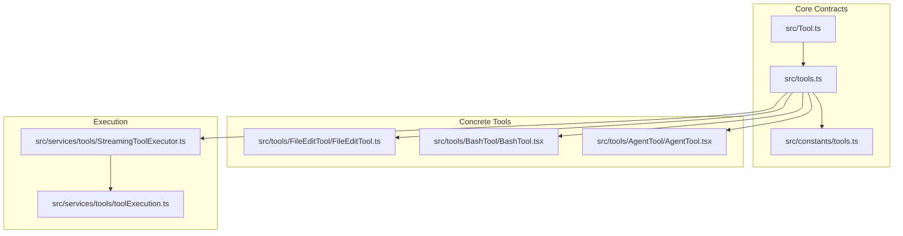
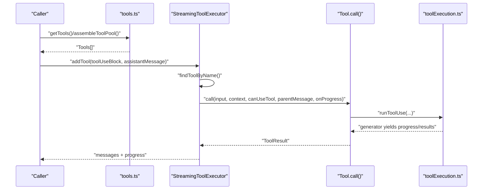
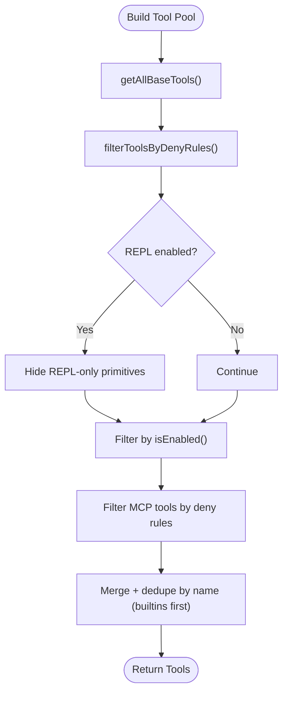
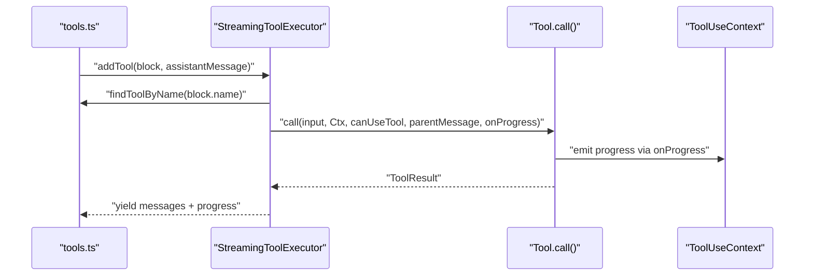
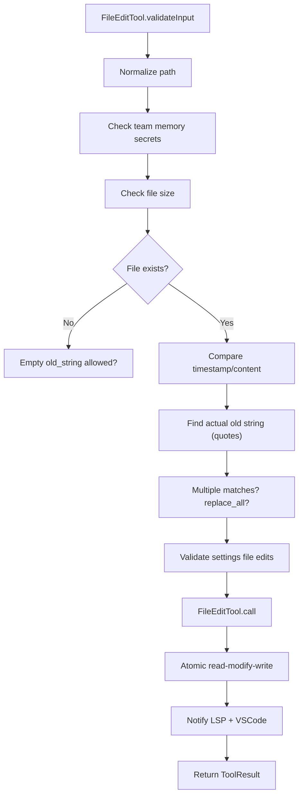
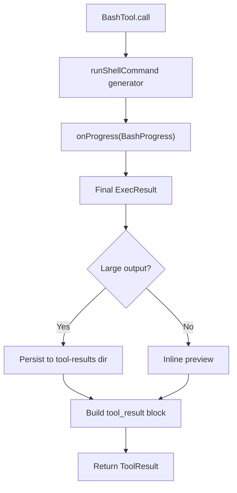
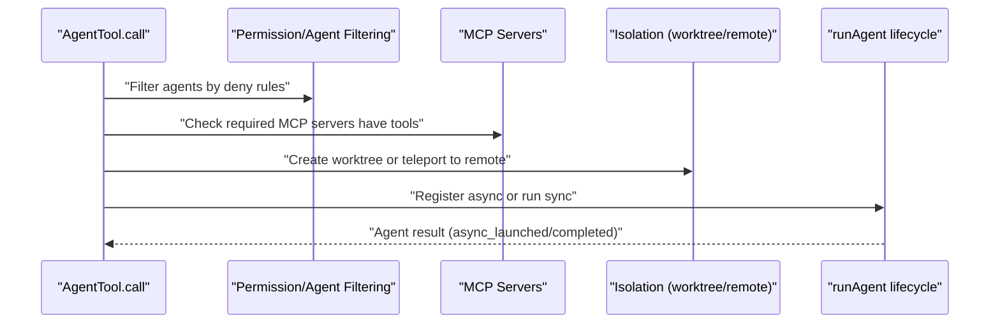
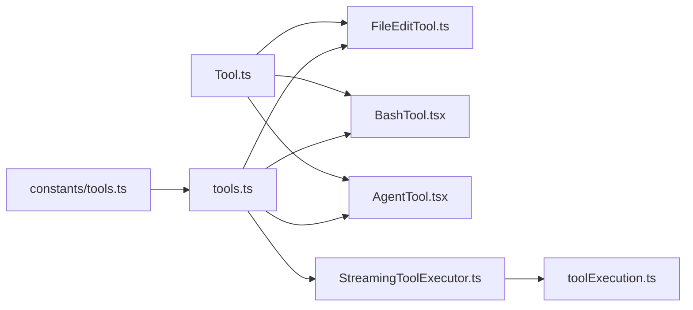

# Tool Design Pattern

<cite>
**Referenced Files in This Document**
- [Tool.ts](file://src/Tool.ts)
- [tools.ts](file://src/tools.ts)
- [tools.ts (constants)](file://src/constants/tools.ts)
- [FileEditTool.ts](file://src/tools/FileEditTool/FileEditTool.ts)
- [BashTool.tsx](file://src/tools/BashTool/BashTool.tsx)
- [AgentTool.tsx](file://src/tools/AgentTool/AgentTool.tsx)
- [StreamingToolExecutor.ts](file://src/services/tools/StreamingToolExecutor.ts)
- [toolExecution.ts](file://src/services/tools/toolExecution.ts)
</cite>

## Table of Contents
1. [Introduction](#introduction)
2. [Project Structure](#project-structure)
3. [Core Components](#core-components)
4. [Architecture Overview](#architecture-overview)
5. [Detailed Component Analysis](#detailed-component-analysis)
6. [Dependency Analysis](#dependency-analysis)
7. [Performance Considerations](#performance-considerations)
8. [Troubleshooting Guide](#troubleshooting-guide)
9. [Conclusion](#conclusion)
10. [Appendices](#appendices)

## Introduction
This document explains the Tool design pattern used across the codebase. It covers the Tool base class architecture, the tool interface contract, common implementation patterns, lifecycle from instantiation to execution, registration and discovery, validation and permissions, metadata and schemas, naming and categorization, serialization and persistence, and testing strategies. Concrete examples are drawn from real tool implementations to illustrate inheritance, abstract method implementations, and tool-specific behaviors.

## Project Structure
The tool system centers around a small set of core files:
- A central Tool interface and builder utility define the contract and defaults.
- A registry aggregates tools, filters them by environment and permissions, and merges MCP tools.
- Concrete tools implement the Tool contract and leverage shared utilities for execution, progress, and UI rendering.
- A streaming executor orchestrates tool execution with concurrency control, progress emission, and cancellation.



**Diagram sources**
- [Tool.ts](file://src/Tool.ts)
- [tools.ts](file://src/tools.ts)
- [tools.ts (constants)](file://src/constants/tools.ts)
- [FileEditTool.ts](file://src/tools/FileEditTool/FileEditTool.ts)
- [BashTool.tsx](file://src/tools/BashTool/BashTool.tsx)
- [AgentTool.tsx](file://src/tools/AgentTool/AgentTool.tsx)
- [StreamingToolExecutor.ts](file://src/services/tools/StreamingToolExecutor.ts)
- [toolExecution.ts](file://src/services/tools/toolExecution.ts)

**Section sources**
- [Tool.ts](file://src/Tool.ts)
- [tools.ts](file://src/tools.ts)
- [tools.ts (constants)](file://src/constants/tools.ts)

## Core Components
- Tool interface and builder:
  - Defines the Tool contract with required and optional methods, metadata, and schemas.
  - Provides a buildTool helper that fills safe defaults for commonly stubbed methods.
- Tool registry and discovery:
  - Aggregates base tools, filters by environment and permission deny rules, merges MCP tools, and exposes convenience getters for presets and merged pools.
- Tool execution orchestration:
  - Streams tool calls, enforces concurrency safety, handles progress, cancellation, and error propagation.
- Concrete tools:
  - Implement the Tool contract with domain-specific validation, permissions, UI rendering, and execution logic.

Key responsibilities:
- Contract enforcement and defaults: Tool.ts
- Registration and filtering: tools.ts
- Execution orchestration: StreamingToolExecutor.ts and toolExecution.ts
- Concrete implementations: FileEditTool.ts, BashTool.tsx, AgentTool.tsx

**Section sources**
- [Tool.ts](file://src/Tool.ts)
- [tools.ts](file://src/tools.ts)
- [StreamingToolExecutor.ts](file://src/services/tools/StreamingToolExecutor.ts)
- [toolExecution.ts](file://src/services/tools/toolExecution.ts)

## Architecture Overview
The tool architecture is a layered design:
- Contract layer: Tool interface and builder define the canonical shape and defaults.
- Registry layer: tools.ts composes the tool pool, respects environment flags, permission rules, and MCP tools.
- Execution layer: StreamingToolExecutor coordinates tool calls, manages concurrency, progress, and cancellation.
- Implementation layer: concrete tools implement the contract with domain-specific logic.



**Diagram sources**
- [tools.ts](file://src/tools.ts)
- [StreamingToolExecutor.ts](file://src/services/tools/StreamingToolExecutor.ts)
- [toolExecution.ts](file://src/services/tools/toolExecution.ts)
- [Tool.ts](file://src/Tool.ts)

## Detailed Component Analysis

### Tool Base Class and Builder
- Tool contract:
  - Required: name, inputSchema, call, description, prompt, userFacingName, renderToolUseMessage, mapToolResultToToolResultBlockParam.
  - Optional: validation, permissions, concurrency safety, read-only, destructive, interrupt behavior, search/read classification, MCP info, strict mode, observable input backfill, UI rendering hooks, grouping, and more.
  - Metadata: searchHint, shouldDefer, alwaysLoad, maxResultSizeChars, strict, aliases.
- buildTool:
  - Merges user-provided definitions with safe defaults for commonly stubbed methods.
  - Ensures consistent behavior across tools without boilerplate.

```mermaid
classDiagram
class ToolContract {
+string name
+aliases? : string[]
+searchHint? : string
+inputSchema
+outputSchema?
+isEnabled() bool
+isConcurrencySafe(input) bool
+isReadOnly(input) bool
+isDestructive?(input) bool
+interruptBehavior?() "cancel|block"
+isSearchOrReadCommand?(input) {...}
+isOpenWorld?(input) bool
+requiresUserInteraction?() bool
+isMcp? : bool
+isLsp? : bool
+shouldDefer? : bool
+alwaysLoad? : bool
+mcpInfo? : {serverName, toolName}
+maxResultSizeChars : number
+strict? : bool
+backfillObservableInput?(input)
+validateInput?(input, context) ValidationResult
+checkPermissions(input, context) PermissionResult
+getPath?(input) string
+preparePermissionMatcher?(input) (pattern)=>bool
+prompt(options) string
+userFacingName(input?) string
+userFacingNameBackgroundColor?(input?)
+isTransparentWrapper?() bool
+getToolUseSummary?(input?) string|null
+getActivityDescription?(input?) string|null
+toAutoClassifierInput(input) any
+mapToolResultToToolResultBlockParam(content, toolUseID)
+renderToolUseMessage(input, options)
+renderToolResultMessage?(content, progress, options)
+extractSearchText?(out) string
+renderToolUseProgressMessage?(progress, options)
+renderToolUseQueuedMessage?()
+renderToolUseRejectedMessage?(input, options)
+renderToolUseErrorMessage?(result, options)
+renderGroupedToolUse?(toolUses, options)
}
class Builder {
+buildTool(def) Tool
}
ToolContract <.. Builder : "fills defaults"
```

**Diagram sources**
- [Tool.ts](file://src/Tool.ts)

**Section sources**
- [Tool.ts](file://src/Tool.ts)

### Tool Registry, Discovery, and Merging
- getAllBaseTools: assembles the base tool set, respecting environment flags and feature gates.
- getTools: filters by permission deny rules, REPL mode visibility, and isEnabled checks.
- assembleToolPool: merges built-in tools with MCP tools, deduplicating by name with built-ins taking precedence.
- getMergedTools: returns combined list for contexts requiring MCP tools.
- Constants:
  - Disallowed and allowed tool sets for agents, teammates, and coordinator modes.



**Diagram sources**
- [tools.ts](file://src/tools.ts)
- [tools.ts (constants)](file://src/constants/tools.ts)

**Section sources**
- [tools.ts](file://src/tools.ts)
- [tools.ts (constants)](file://src/constants/tools.ts)

### Tool Lifecycle: Instantiation to Execution
- Instantiation:
  - Tools are defined via buildTool and collected by the registry.
- Registration and discovery:
  - Tools are discovered by name and alias via toolMatchesName/findToolByName.
- Validation and permissions:
  - validateInput runs before execution; checkPermissions integrates with the permission system.
- Execution:
  - StreamingToolExecutor.addTool parses input, checks concurrency safety, and executes via runToolUse.
  - Progress is emitted and messages are yielded in-order.
- Cleanup and context:
  - Context modifiers are applied for non-concurrent tools; in-progress tool IDs are tracked and cleared upon completion.



**Diagram sources**
- [tools.ts](file://src/tools.ts)
- [StreamingToolExecutor.ts](file://src/services/tools/StreamingToolExecutor.ts)
- [Tool.ts](file://src/Tool.ts)

**Section sources**
- [tools.ts](file://src/tools.ts)
- [StreamingToolExecutor.ts](file://src/services/tools/StreamingToolExecutor.ts)
- [toolExecution.ts](file://src/services/tools/toolExecution.ts)

### Concrete Tool Implementations

#### FileEditTool
- Purpose: edit files with validation, permission checks, quoting preservation, and LSP/VsCode integration.
- Highlights:
  - validateInput: path existence, size limits, content staleness, notebook exclusivity, settings file validation, and permission deny rules.
  - call: atomic read-modify-write with backup, diagnostics clearing, LSP didChange/save, and analytics.
  - UI: renderToolUseMessage, renderToolResultMessage, renderToolUseErrorMessage, renderToolUseRejectedMessage.
  - Permissions: checkPermissions integrates with filesystem rules; backfillObservableInput normalizes paths.



**Diagram sources**
- [FileEditTool.ts](file://src/tools/FileEditTool/FileEditTool.ts)

**Section sources**
- [FileEditTool.ts](file://src/tools/FileEditTool/FileEditTool.ts)

#### BashTool
- Purpose: execute shell commands with sandboxing, progress reporting, large output persistence, and background execution.
- Highlights:
  - validateInput: detects sleep patterns and blocks them when appropriate.
  - isReadOnly: determines read-only safety based on command semantics.
  - isSearchOrReadCommand: classifies commands for UI collapsing.
  - mapToolResultToToolResultBlockParam: handles structured content, images, persisted output, and background info.
  - call: streams progress via onProgress, persists large outputs, annotates sandbox failures, and logs analytics.



**Diagram sources**
- [BashTool.tsx](file://src/tools/BashTool/BashTool.tsx)

**Section sources**
- [BashTool.tsx](file://src/tools/BashTool/BashTool.tsx)

#### AgentTool
- Purpose: spawn subagents with support for built-in and MCP agents, isolation modes (worktree/remote), background execution, and telemetry.
- Highlights:
  - prompt: constructs agent prompt considering MCP availability and permission filters.
  - call: resolves agent type, validates MCP requirements, handles isolation, registers async tasks, and returns either sync or async results.
  - UI: comprehensive rendering for progress, queued, rejected, and error states.



**Diagram sources**
- [AgentTool.tsx](file://src/tools/AgentTool/AgentTool.tsx)

**Section sources**
- [AgentTool.tsx](file://src/tools/AgentTool/AgentTool.tsx)

### Tool Naming, Categorization, and Discovery
- Naming and aliases:
  - Tools expose name and optional aliases for backward compatibility and lookup.
  - Helpers: toolMatchesName and findToolByName.
- Categorization:
  - Tool categories are implicit via tool families (e.g., Bash, FileEdit, Agent, MCP-related).
  - Flags and constants define allowed/disallowed sets per agent type and mode.
- Discovery:
  - tools.ts exposes getAllBaseTools, getTools, assembleToolPool, and getMergedTools for discovery and composition.

**Section sources**
- [Tool.ts](file://src/Tool.ts)
- [tools.ts](file://src/tools.ts)
- [tools.ts (constants)](file://src/constants/tools.ts)

### Tool Metadata, Configuration Schemas, and Parameter Handling
- Metadata:
  - Tool metadata includes searchHint, shouldDefer, alwaysLoad, maxResultSizeChars, strict, aliases, and MCP info.
- Schemas:
  - Tools define inputSchema and optional outputSchema using Zod.
  - Some tools expose inputJSONSchema for MCP tools.
- Parameter handling:
  - backfillObservableInput allows adding derived fields before observers see inputs.
  - inputsEquivalent enables equivalence checks for caching and de-duplication.
  - toAutoClassifierInput shapes inputs for security classification.

**Section sources**
- [Tool.ts](file://src/Tool.ts)
- [FileEditTool.ts](file://src/tools/FileEditTool/FileEditTool.ts)
- [BashTool.tsx](file://src/tools/BashTool/BashTool.tsx)

### Serialization, Deserialization, and Persistence Patterns
- Tool result serialization:
  - mapToolResultToToolResultBlockParam converts tool outputs to model-facing blocks.
  - For large outputs, persistedOutputPath and persistedOutputSize are used; preview is generated for UI.
- Persistence:
  - Large outputs are persisted to a tool-results directory with hard-link or copy; truncation thresholds apply.
- Deserialization:
  - Consumers read persisted files via FileReadTool or MCP resource readers.

**Section sources**
- [BashTool.tsx](file://src/tools/BashTool/BashTool.tsx)
- [FileEditTool.ts](file://src/tools/FileEditTool/FileEditTool.ts)

### Testing Strategies, Mocking, and Unit Testing Patterns
- Test-friendly contracts:
  - Tools implement standardized methods enabling deterministic tests for validation, permissions, and UI rendering.
- Mocking:
  - Use canUseTool and ToolUseContext to simulate permission checks and environment.
  - Stub toolExecution generators to control progress and completion.
- Unit testing patterns:
  - Validate inputs with inputSchema.safeParse.
  - Assert permission decisions and deny rule filtering.
  - Verify UI rendering outputs and progress emissions.

[No sources needed since this section provides general guidance]

## Dependency Analysis
- Coupling:
  - Concrete tools depend on Tool.ts for the contract and buildTool for defaults.
  - tools.ts depends on constants for agent/tool sets and environment flags.
  - StreamingToolExecutor depends on tools.ts for tool lookup and toolExecution.ts for execution.
- Cohesion:
  - Each tool encapsulates domain logic, permissions, and UI rendering.
- External dependencies:
  - Zod for schemas, AbortController for cancellation, filesystem and LSP integrations, analytics/logging.



**Diagram sources**
- [Tool.ts](file://src/Tool.ts)
- [tools.ts](file://src/tools.ts)
- [tools.ts (constants)](file://src/constants/tools.ts)
- [FileEditTool.ts](file://src/tools/FileEditTool/FileEditTool.ts)
- [BashTool.tsx](file://src/tools/BashTool/BashTool.tsx)
- [AgentTool.tsx](file://src/tools/AgentTool/AgentTool.tsx)
- [StreamingToolExecutor.ts](file://src/services/tools/StreamingToolExecutor.ts)
- [toolExecution.ts](file://src/services/tools/toolExecution.ts)

**Section sources**
- [Tool.ts](file://src/Tool.ts)
- [tools.ts](file://src/tools.ts)
- [tools.ts (constants)](file://src/constants/tools.ts)
- [StreamingToolExecutor.ts](file://src/services/tools/StreamingToolExecutor.ts)
- [toolExecution.ts](file://src/services/tools/toolExecution.ts)

## Performance Considerations
- Concurrency control:
  - StreamingToolExecutor ensures concurrent-safe tools run in parallel while non-concurrent tools run exclusively.
- Progress and streaming:
  - Tools emit progress messages to keep UI responsive; executor yields progress immediately.
- Large output handling:
  - BashTool persists large outputs to disk and provides previews to avoid memory pressure.
- Permission checks:
  - Permission matchers and deny rules are computed once per tool and reused to minimize overhead.

[No sources needed since this section provides general guidance]

## Troubleshooting Guide
- Tool not found:
  - Ensure the tool name or alias matches via toolMatchesName/findToolByName.
- Permission denied:
  - Review deny rules and permission mode; tools may be filtered out by filterToolsByDenyRules.
- Validation failures:
  - Inspect validateInput results and error codes; adjust inputs accordingly.
- Cancellation and interrupts:
  - Respect interruptBehavior; user interrupts cancel tools with 'cancel' or block depending on tool.
- Progress stalls:
  - Check executor’s progressAvailableResolve and ensure onProgress is wired.

**Section sources**
- [tools.ts](file://src/tools.ts)
- [StreamingToolExecutor.ts](file://src/services/tools/StreamingToolExecutor.ts)

## Conclusion
The Tool design pattern provides a robust, extensible framework for building capabilities with consistent contracts, safe defaults, and strong composability. The registry and executor layers decouple discovery and execution from implementation, while concrete tools encapsulate domain logic and UI. By adhering to the Tool contract, leveraging buildTool defaults, and following the lifecycle and testing strategies outlined here, developers can reliably add, evolve, and maintain tools across the system.

## Appendices
- Quick reference to key methods:
  - Required: name, inputSchema, call, description, prompt, userFacingName, renderToolUseMessage, mapToolResultToToolResultBlockParam.
  - Optional: validateInput, checkPermissions, isConcurrencySafe, isReadOnly, isDestructive, interruptBehavior, isSearchOrReadCommand, isOpenWorld, requiresUserInteraction, isMcp, isLsp, shouldDefer, alwaysLoad, mcpInfo, maxResultSizeChars, strict, backfillObservableInput, inputsEquivalent, toAutoClassifierInput, renderToolResultMessage, extractSearchText, renderToolUseProgressMessage, renderToolUseQueuedMessage, renderToolUseRejectedMessage, renderToolUseErrorMessage, renderGroupedToolUse.

[No sources needed since this section provides general guidance]