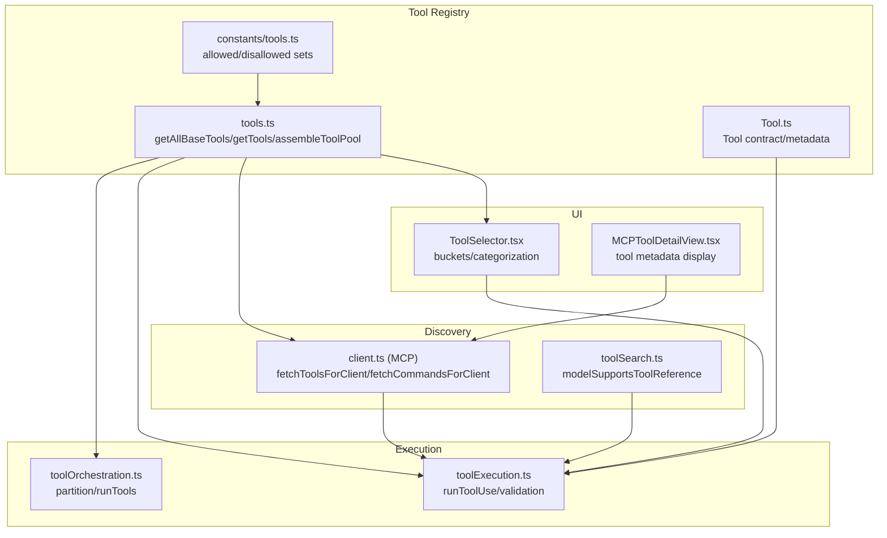
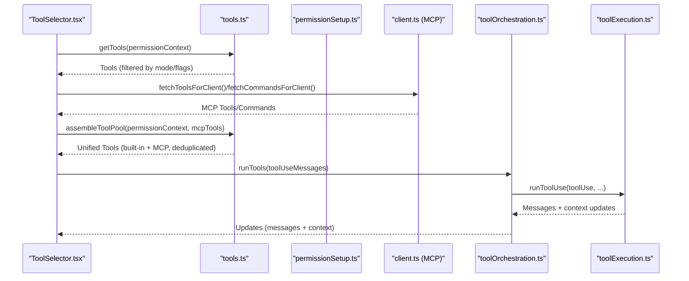
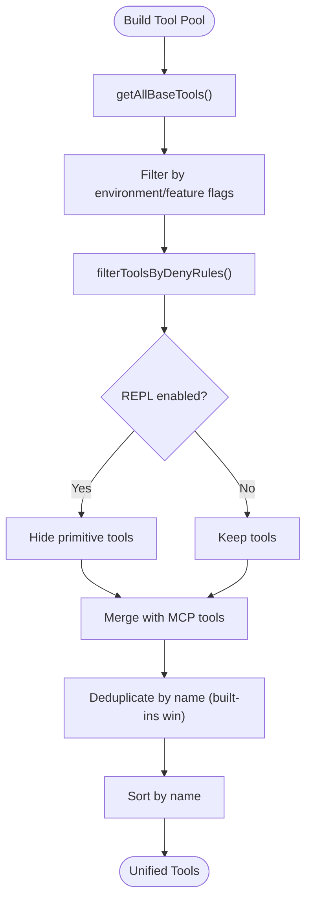
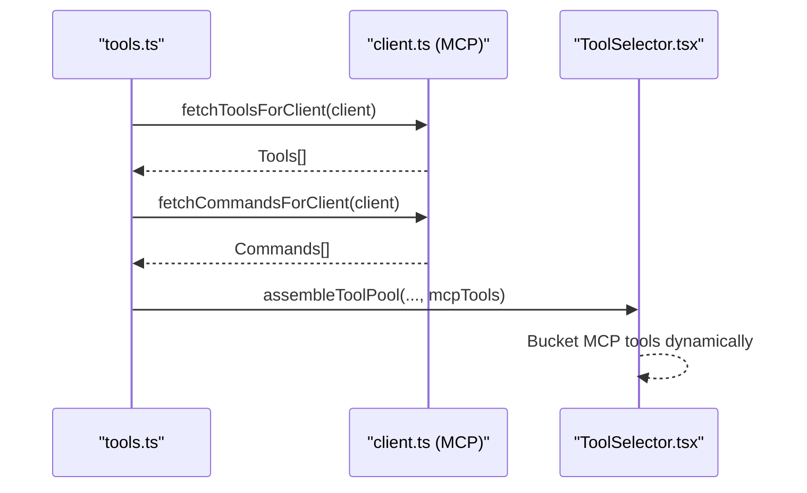
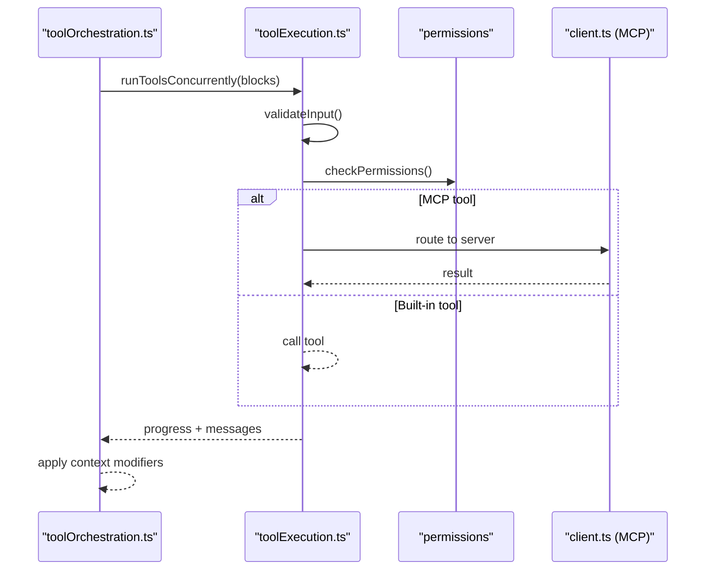
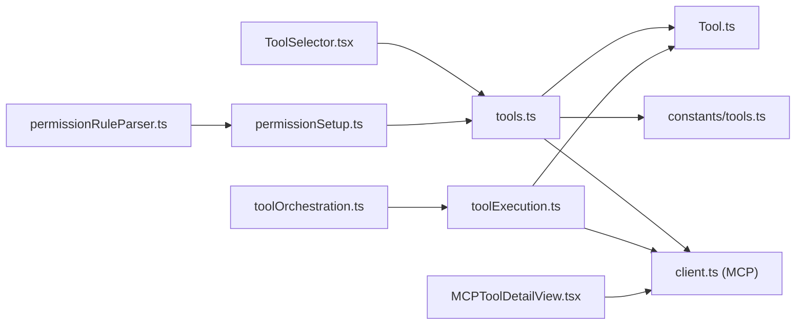

# Tool Discovery and Registration

<cite>
**Referenced Files in This Document**
- [tools.ts](file://src/tools.ts)
- [Tool.ts](file://src/Tool.ts)
- [tools.ts (constants)](file://src/constants/tools.ts)
- [toolExecution.ts](file://src/services/tools/toolExecution.ts)
- [toolOrchestration.ts](file://src/services/tools/toolOrchestration.ts)
- [client.ts (MCP)](file://src/services/mcp/client.ts)
- [ToolSelector.tsx](file://src/components/agents/ToolSelector.tsx)
- [toolSearch.ts](file://src/utils/toolSearch.ts)
- [permissionSetup.ts](file://src/utils/permissions/permissionSetup.ts)
- [permissionRuleParser.ts](file://src/utils/permissions/permissionRuleParser.ts)
- [MCPToolDetailView.tsx](file://src/components/mcp/MCPToolDetailView.tsx)
</cite>

## Table of Contents
1. [Introduction](#introduction)
2. [Project Structure](#project-structure)
3. [Core Components](#core-components)
4. [Architecture Overview](#architecture-overview)
5. [Detailed Component Analysis](#detailed-component-analysis)
6. [Dependency Analysis](#dependency-analysis)
7. [Performance Considerations](#performance-considerations)
8. [Troubleshooting Guide](#troubleshooting-guide)
9. [Conclusion](#conclusion)

## Introduction
This document explains the tool discovery and registration system, focusing on how tools are discovered, registered, filtered, and integrated into the runtime. It covers:
- Automatic tool discovery for built-in tools and MCP servers
- Dynamic tool loading strategies and conditional inclusion
- Tool presets, environment-based filtering, and build-time toggles
- Tool naming conventions, categorization, and metadata management
- Tool lifecycle, validation, conflict resolution, and permission gating
- Tool orchestration, concurrency, and execution flows
- Versioning, compatibility, and migration considerations

## Project Structure
The tool system spans several modules:
- Tool registry and presets: [tools.ts](file://src/tools.ts)
- Tool contract and metadata: [Tool.ts](file://src/Tool.ts)
- Tool availability and categorization: [tools.ts (constants)](file://src/constants/tools.ts)
- Tool execution and orchestration: [toolExecution.ts](file://src/services/tools/toolExecution.ts), [toolOrchestration.ts](file://src/services/tools/toolOrchestration.ts)
- MCP tool discovery and integration: [client.ts (MCP)](file://src/services/mcp/client.ts)
- UI categorization and selection: [ToolSelector.tsx](file://src/components/agents/ToolSelector.tsx), [MCPToolDetailView.tsx](file://src/components/mcp/MCPToolDetailView.tsx)
- Tool search and compatibility: [toolSearch.ts](file://src/utils/toolSearch.ts)
- Permission-driven filtering and CLI base-tools: [permissionSetup.ts](file://src/utils/permissions/permissionSetup.ts), [permissionRuleParser.ts](file://src/utils/permissions/permissionRuleParser.ts)

**Diagram sources**
- [tools.ts](file://src/tools.ts)
- [Tool.ts](file://src/Tool.ts)
- [toolOrchestration.ts](file://src/services/tools/toolOrchestration.ts)
- [toolExecution.ts](file://src/services/tools/toolExecution.ts)
- [client.ts (MCP)](file://src/services/mcp/client.ts)
- [toolSearch.ts](file://src/utils/toolSearch.ts)
- [ToolSelector.tsx](file://src/components/agents/ToolSelector.tsx)
- [MCPToolDetailView.tsx](file://src/components/mcp/MCPToolDetailView.tsx)

**Section sources**
- [tools.ts](file://src/tools.ts)
- [Tool.ts](file://src/Tool.ts)
- [tools.ts (constants)](file://src/constants/tools.ts)
- [toolOrchestration.ts](file://src/services/tools/toolOrchestration.ts)
- [toolExecution.ts](file://src/services/tools/toolExecution.ts)
- [client.ts (MCP)](file://src/services/mcp/client.ts)
- [toolSearch.ts](file://src/utils/toolSearch.ts)
- [ToolSelector.tsx](file://src/components/agents/ToolSelector.tsx)
- [MCPToolDetailView.tsx](file://src/components/mcp/MCPToolDetailView.tsx)

## Core Components
- Tool registry and presets:
  - Centralized tool registry and presets are defined in [tools.ts](file://src/tools.ts). It exposes:
    - Preset parsing and default preset resolution
    - Base tool assembly respecting environment flags and feature toggles
    - Permission-based filtering and REPL-aware hiding of primitive tools
    - Unified tool pool assembly that merges built-in and MCP tools with deterministic ordering
- Tool contract and metadata:
  - The [Tool.ts](file://src/Tool.ts) defines the tool interface, including:
    - Name, aliases, input/output schemas, concurrency/read-only/destructive flags
    - Permission checks, validation hooks, and UI rendering helpers
    - MCP-specific metadata and deferred-loading hints
- Tool availability and categorization:
  - [tools.ts (constants)](file://src/constants/tools.ts) defines:
    - Allowed/disallowed tool sets for agents and modes
    - Mode-specific tool availability (e.g., async agents, in-process teammates)
- Execution and orchestration:
  - [toolOrchestration.ts](file://src/services/tools/toolOrchestration.ts) partitions and runs tool calls:
    - Concurrency-safe batching for read-only tools
    - Serial execution for non-concurrent tools
    - Context modification propagation
  - [toolExecution.ts](file://src/services/tools/toolExecution.ts) validates inputs, permissions, and executes tools:
    - Zod schema validation and deferred-tool hints
    - Permission hooks, MCP routing, and progress reporting
- MCP discovery and integration:
  - [client.ts (MCP)](file://src/services/mcp/client.ts) discovers MCP tools and commands:
    - Memoized fetching with LRU caching
    - Overrides and filtering for specific MCP servers
    - Commands/prompts conversion to tool-like structures
- UI categorization and selection:
  - [ToolSelector.tsx](file://src/components/agents/ToolSelector.tsx) organizes tools into buckets (read-only, edit, execution, MCP, other)
  - [MCPToolDetailView.tsx](file://src/components/mcp/MCPToolDetailView.tsx) surfaces tool metadata (read-only, destructive, open-world)

**Section sources**
- [tools.ts](file://src/tools.ts)
- [Tool.ts](file://src/Tool.ts)
- [tools.ts (constants)](file://src/constants/tools.ts)
- [toolOrchestration.ts](file://src/services/tools/toolOrchestration.ts)
- [toolExecution.ts](file://src/services/tools/toolExecution.ts)
- [client.ts (MCP)](file://src/services/mcp/client.ts)
- [ToolSelector.tsx](file://src/components/agents/ToolSelector.tsx)
- [MCPToolDetailView.tsx](file://src/components/mcp/MCPToolDetailView.tsx)

## Architecture Overview
The tool system follows a layered architecture:
- Registry layer: builds the complete tool set from environment flags and feature toggles
- Permission layer: filters tools based on deny rules and mode constraints
- Discovery layer: integrates MCP tools and commands dynamically
- Orchestration layer: schedules and runs tool calls with concurrency control
- Execution layer: validates inputs, enforces permissions, and streams progress
- UI layer: presents categorized tools and MCP metadata

**Diagram sources**
- [ToolSelector.tsx](file://src/components/agents/ToolSelector.tsx)
- [tools.ts](file://src/tools.ts)
- [client.ts (MCP)](file://src/services/mcp/client.ts)
- [toolOrchestration.ts](file://src/services/tools/toolOrchestration.ts)
- [toolExecution.ts](file://src/services/tools/toolExecution.ts)

## Detailed Component Analysis

### Tool Registry and Presets
- Presets:
  - A minimal preset system is defined with a default preset and parsing logic in [tools.ts](file://src/tools.ts).
  - The default preset resolves to the list of built-in tools that are enabled in the current environment.
- Base tool assembly:
  - [tools.ts](file://src/tools.ts) constructs the base tool list by conditionally importing tools based on:
    - Environment variables (e.g., user type, verification flags)
    - Feature flags (bun:bundle feature gates)
    - Runtime switches (e.g., REPL mode, worktree mode, agent swarms)
    - Embedded tool detection (e.g., embedded search tools)
- Permission filtering:
  - Tools are filtered by deny rules before exposure to the model and runtime.
  - Special handling for REPL mode hides primitive tools when REPL is enabled.
- Unified tool pool:
  - [tools.ts](file://src/tools.ts) merges built-in and MCP tools, deduplicating by name with built-ins taking precedence.
  - Sorting ensures prompt-cache stability and consistent ordering.

**Diagram sources**
- [tools.ts](file://src/tools.ts)

**Section sources**
- [tools.ts](file://src/tools.ts)

### Tool Contract and Metadata
- Tool interface:
  - [Tool.ts](file://src/Tool.ts) defines the tool contract, including:
    - Name, aliases, input/output schemas, and optional JSON schema for MCP
    - Concurrency safety, read-only, destructive, and MCP flags
    - Permission checks, validation hooks, and UI rendering helpers
    - Deferred-loading hints and always-load semantics
- Tool construction:
  - A builder pattern ([Tool.ts](file://src/Tool.ts)) provides safe defaults for commonly stubbed methods, ensuring consistent behavior across tools.

**Section sources**
- [Tool.ts](file://src/Tool.ts)

### Tool Availability and Categorization
- Allowed/disallowed sets:
  - [tools.ts (constants)](file://src/constants/tools.ts) defines:
    - Disallowed tools for agents and custom agents
    - Allowed tools for async agents and in-process teammates
    - Coordinator-mode allowed tools
- Categorization:
  - [ToolSelector.tsx](file://src/components/agents/ToolSelector.tsx) organizes tools into buckets:
    - Read-only, edit, execution, MCP, and other
    - MCP bucket is dynamic and populated from discovered tools

**Section sources**
- [tools.ts (constants)](file://src/constants/tools.ts)
- [ToolSelector.tsx](file://src/components/agents/ToolSelector.tsx)

### MCP Tool Discovery and Integration
- Discovery:
  - [client.ts (MCP)](file://src/services/mcp/client.ts) fetches tools and commands from connected MCP servers:
    - Memoized with LRU caching keyed by server name
    - Supports overrides for specific servers (e.g., CHICAGO_MCP)
- Commands and prompts:
  - Commands and prompts are converted into tool-like structures with user-facing names and argument handling.
- Resource listing:
  - Resources are fetched and annotated with server names for downstream use.

**Diagram sources**
- [tools.ts](file://src/tools.ts)
- [client.ts (MCP)](file://src/services/mcp/client.ts)
- [ToolSelector.tsx](file://src/components/agents/ToolSelector.tsx)

**Section sources**
- [client.ts (MCP)](file://src/services/mcp/client.ts)
- [ToolSelector.tsx](file://src/components/agents/ToolSelector.tsx)

### Tool Execution and Orchestration
- Concurrency control:
  - [toolOrchestration.ts](file://src/services/tools/toolOrchestration.ts) partitions tool calls:
    - Read-only tools grouped into concurrent batches
    - Non-concurrent tools executed serially
- Input validation and permission checks:
  - [toolExecution.ts](file://src/services/tools/toolExecution.ts) validates inputs with Zod schemas and defers invalid inputs with helpful hints for deferred tools.
  - Permissions are checked via hooks and rules; MCP tools are routed to the appropriate server.
- Progress and context:
  - Progress messages are emitted and context is updated incrementally; context modifiers are applied after batches.

**Diagram sources**
- [toolOrchestration.ts](file://src/services/tools/toolOrchestration.ts)
- [toolExecution.ts](file://src/services/tools/toolExecution.ts)
- [client.ts (MCP)](file://src/services/mcp/client.ts)

**Section sources**
- [toolOrchestration.ts](file://src/services/tools/toolOrchestration.ts)
- [toolExecution.ts](file://src/services/tools/toolExecution.ts)

### Tool Naming Conventions, Categories, and Metadata
- Naming conventions:
  - Built-in tools expose a canonical name constant; MCP tools are named with a standardized prefix and server normalization.
  - Aliases enable backward compatibility for renamed tools.
- Categories:
  - Tools are categorized in UI buckets (read-only, edit, execution, MCP, other) based on capabilities and roles.
- Metadata:
  - Tool metadata includes read-only, destructive, open-world flags and user-facing names; MCP tools carry server/tool names and capabilities.

**Section sources**
- [Tool.ts](file://src/Tool.ts)
- [ToolSelector.tsx](file://src/components/agents/ToolSelector.tsx)
- [MCPToolDetailView.tsx](file://src/components/mcp/MCPToolDetailView.tsx)

### Conditional Tool Loading and Build-Time Filtering
- Environment-based inclusion:
  - Tools are conditionally included based on environment variables and feature flags in [tools.ts](file://src/tools.ts).
- REPL-aware filtering:
  - When REPL is enabled, primitive tools are hidden from direct use but remain accessible inside the REPL context.
- CLI base-tools:
  - Users can restrict base tools via CLI, which are normalized and translated into blanket deny rules in [permissionSetup.ts](file://src/utils/permissions/permissionSetup.ts).

**Section sources**
- [tools.ts](file://src/tools.ts)
- [permissionSetup.ts](file://src/utils/permissions/permissionSetup.ts)

### Tool Lifecycle Management, Validation, and Conflict Resolution
- Lifecycle:
  - Tools are constructed, validated, permission-checked, executed, and their results rendered.
- Validation:
  - Input schemas are validated; deferred tools receive hints to load ToolSearch first.
- Conflict resolution:
  - Duplicate tool names are resolved by preferring built-in tools over MCP tools.
  - Deny rules and mode constraints further refine the tool set.

**Section sources**
- [toolExecution.ts](file://src/services/tools/toolExecution.ts)
- [tools.ts](file://src/tools.ts)

### Tool Versioning, Compatibility, and Migration
- Compatibility:
  - Tool search compatibility is gated by model support; [toolSearch.ts](file://src/utils/toolSearch.ts) determines whether a model supports tool_reference blocks.
- Migration:
  - Legacy tool names are normalized and matched to canonical names for rule enforcement and CLI base-tools parsing in [permissionRuleParser.ts](file://src/utils/permissions/permissionRuleParser.ts).

**Section sources**
- [toolSearch.ts](file://src/utils/toolSearch.ts)
- [permissionRuleParser.ts](file://src/utils/permissions/permissionRuleParser.ts)

## Dependency Analysis
The tool system exhibits low coupling and high cohesion:
- tools.ts depends on feature flags, environment variables, and tool-specific modules to assemble the tool set.
- toolExecution.ts depends on Tool.ts for the tool contract and on MCP client for server routing.
- MCP client depends on memoization and server capabilities to discover tools and commands.
- UI components depend on tools.ts and MCP client for dynamic categorization and metadata.

**Diagram sources**
- [tools.ts](file://src/tools.ts)
- [Tool.ts](file://src/Tool.ts)
- [tools.ts (constants)](file://src/constants/tools.ts)
- [toolExecution.ts](file://src/services/tools/toolExecution.ts)
- [toolOrchestration.ts](file://src/services/tools/toolOrchestration.ts)
- [client.ts (MCP)](file://src/services/mcp/client.ts)
- [ToolSelector.tsx](file://src/components/agents/ToolSelector.tsx)
- [MCPToolDetailView.tsx](file://src/components/mcp/MCPToolDetailView.tsx)
- [permissionSetup.ts](file://src/utils/permissions/permissionSetup.ts)
- [permissionRuleParser.ts](file://src/utils/permissions/permissionRuleParser.ts)

**Section sources**
- [tools.ts](file://src/tools.ts)
- [Tool.ts](file://src/Tool.ts)
- [toolExecution.ts](file://src/services/tools/toolExecution.ts)
- [toolOrchestration.ts](file://src/services/tools/toolOrchestration.ts)
- [client.ts (MCP)](file://src/services/mcp/client.ts)
- [ToolSelector.tsx](file://src/components/agents/ToolSelector.tsx)
- [MCPToolDetailView.tsx](file://src/components/mcp/MCPToolDetailView.tsx)
- [permissionSetup.ts](file://src/utils/permissions/permissionSetup.ts)
- [permissionRuleParser.ts](file://src/utils/permissions/permissionRuleParser.ts)

## Performance Considerations
- Concurrency:
  - Read-only tools are executed concurrently to improve throughput; non-concurrent tools are run serially to avoid race conditions.
- Caching:
  - MCP tool and resource discovery is memoized with LRU caching keyed by server name to reduce repeated network calls.
- Sorting and deduplication:
  - Tool pools are sorted and deduplicated deterministically to maintain prompt-cache stability and predictable ordering.

[No sources needed since this section provides general guidance]

## Troubleshooting Guide
- Unknown tool errors:
  - When a tool is not found in the available tool set, the system logs an error and returns a user-facing message with the tool name.
- Input validation failures:
  - Zod validation errors are formatted and, for deferred tools, hints are provided to load ToolSearch first.
- Permission denials:
  - Permission decisions are logged with source classification (user_permanent, user_temporary, user_reject, config) to aid debugging.
- MCP connectivity:
  - MCP tool discovery failures are logged with server-specific messages; commands/prompts are sanitized and routed appropriately.

**Section sources**
- [toolExecution.ts](file://src/services/tools/toolExecution.ts)
- [client.ts (MCP)](file://src/services/mcp/client.ts)

## Conclusion
The tool discovery and registration system combines a robust registry with environment-aware conditional loading, permission-driven filtering, and dynamic MCP integration. It provides strong guarantees around tool validation, concurrency control, and deterministic ordering, while offering flexible categorization and metadata for UI and analytics. Compatibility and migration are addressed through tool search support and legacy name normalization.