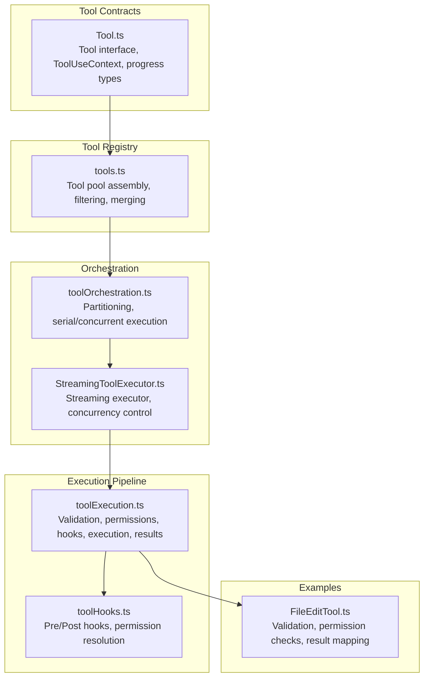
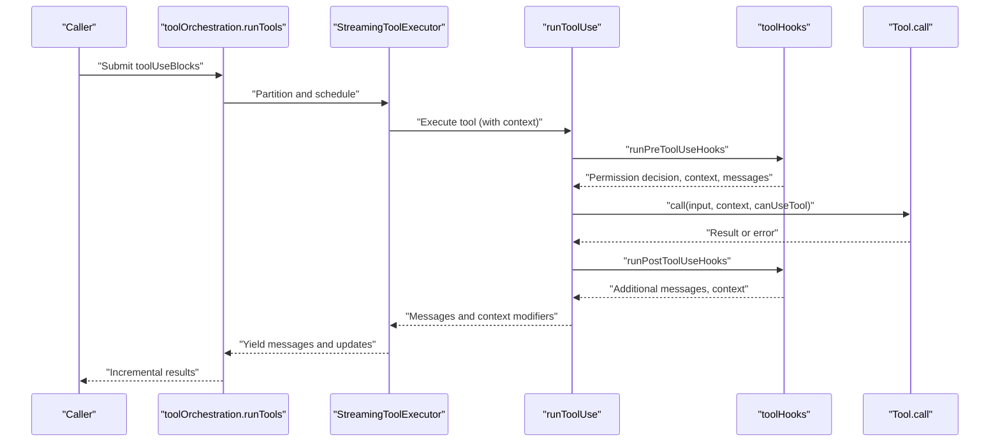
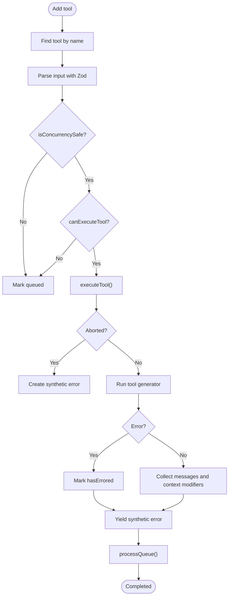
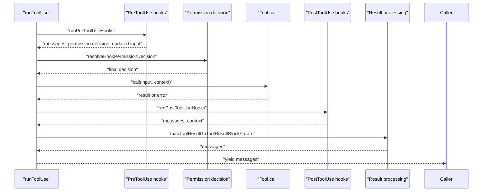
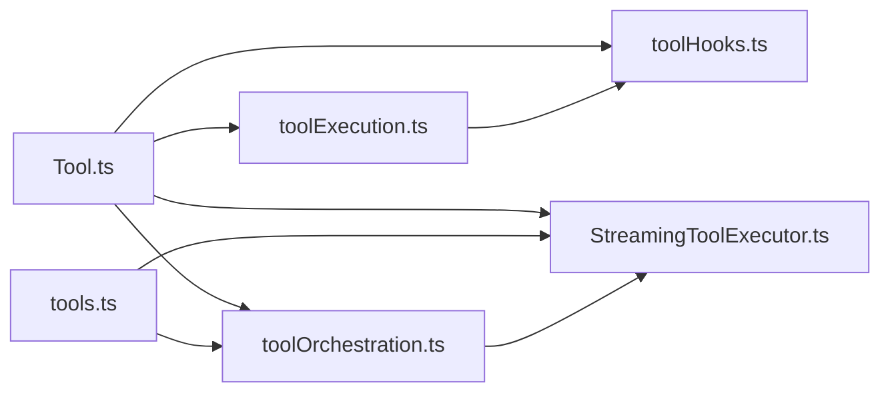

# Tool Execution Engine

<cite>
**Referenced Files in This Document**
- [Tool.ts](file://src/Tool.ts)
- [tools.ts](file://src/tools.ts)
- [StreamingToolExecutor.ts](file://src/services/tools/StreamingToolExecutor.ts)
- [toolExecution.ts](file://src/services/tools/toolExecution.ts)
- [toolOrchestration.ts](file://src/services/tools/toolOrchestration.ts)
- [toolHooks.ts](file://src/services/tools/toolHooks.ts)
- [FileEditTool.ts](file://src/tools/FileEditTool/FileEditTool.ts)
</cite>

## Table of Contents
1. [Introduction](#introduction)
2. [Project Structure](#project-structure)
3. [Core Components](#core-components)
4. [Architecture Overview](#architecture-overview)
5. [Detailed Component Analysis](#detailed-component-analysis)
6. [Dependency Analysis](#dependency-analysis)
7. [Performance Considerations](#performance-considerations)
8. [Troubleshooting Guide](#troubleshooting-guide)
9. [Conclusion](#conclusion)

## Introduction
This document explains the tool execution engine that powers the Claude Code IDE’s tool system. It covers the end-to-end pipeline from tool resolution and parameter validation to execution orchestration, streaming progress delivery, and result processing. It also documents concurrency controls, asynchronous execution patterns, error handling, retries, and failure recovery. Cross-cutting concerns such as logging, auditing, and hooks are included to provide a complete picture of how tools are executed safely and efficiently.

## Project Structure
The tool execution engine is organized around a small set of cohesive modules:
- Tool contract and context: defines the Tool interface, ToolUseContext, and progress/result abstractions.
- Tool registry and composition: aggregates built-in tools and MCP tools, filters by permissions, and exposes a unified tool pool.
- Execution orchestration: partitions tool calls into serial and concurrent batches, manages concurrency limits, and coordinates context propagation.
- Streaming executor: streams progress and results, enforces concurrency rules, and handles cancellation and cascading failures.
- Execution pipeline: validates inputs, resolves permissions, runs pre/post hooks, executes tools, and processes results.
- Hooks: pre/post tool use hooks that can influence decisions, provide feedback, and modify execution behavior.
- Example tool: FileEditTool demonstrates validation, permission checks, and result mapping.

**Diagram sources**
- [Tool.ts:362-793](file://src/Tool.ts#L362-L793)
- [tools.ts:193-390](file://src/tools.ts#L193-L390)
- [toolOrchestration.ts:19-189](file://src/services/tools/toolOrchestration.ts#L19-L189)
- [StreamingToolExecutor.ts:40-531](file://src/services/tools/StreamingToolExecutor.ts#L40-L531)
- [toolExecution.ts:337-1746](file://src/services/tools/toolExecution.ts#L337-L1746)
- [toolHooks.ts:435-651](file://src/services/tools/toolHooks.ts#L435-L651)
- [FileEditTool.ts:137-362](file://src/tools/FileEditTool/FileEditTool.ts#L137-L362)

**Section sources**
- [Tool.ts:158-300](file://src/Tool.ts#L158-L300)
- [tools.ts:193-390](file://src/tools.ts#L193-L390)

## Core Components
- Tool interface and context
  - The Tool type defines the contract for all tools: call, validateInput, checkPermissions, progress rendering, and result mapping. It also includes optional capabilities such as concurrency safety, read-only semantics, destructive operations, and search/read categorization.
  - ToolUseContext encapsulates the execution environment: abort controller, file state cache, app state accessors, permission context, and UI helpers. It is passed through the entire pipeline to support cancellation, progress, and UI updates.
- Tool registry and composition
  - tools.ts builds the complete tool pool by combining built-in tools with MCP tools, applying permission filters, and ensuring deterministic ordering and de-duplication.
- Execution orchestration
  - toolOrchestration.ts partitions tool calls into batches: read-only tools can run concurrently, while non-concurrent tools run serially. It manages context modifiers and yields updates incrementally.
- Streaming executor
  - StreamingToolExecutor.ts orchestrates streaming tool execution with concurrency control, progress emission, and cancellation propagation. It supports discard-on-fallback and sibling-abort semantics for robust error handling.
- Execution pipeline
  - toolExecution.ts implements the full lifecycle: input parsing, validation, permission resolution, pre/post hooks, tool execution, result processing, and analytics/logging.
- Hooks
  - toolHooks.ts provides the hook framework for pre/post tool use, including permission resolution, cancellation, blocking, and additional context injection.

**Section sources**
- [Tool.ts:362-793](file://src/Tool.ts#L362-L793)
- [tools.ts:345-390](file://src/tools.ts#L345-L390)
- [toolOrchestration.ts:19-189](file://src/services/tools/toolOrchestration.ts#L19-L189)
- [StreamingToolExecutor.ts:40-531](file://src/services/tools/StreamingToolExecutor.ts#L40-L531)
- [toolExecution.ts:337-1746](file://src/services/tools/toolExecution.ts#L337-L1746)
- [toolHooks.ts:435-651](file://src/services/tools/toolHooks.ts#L435-L651)

## Architecture Overview
The tool execution engine follows a layered architecture:
- Contract layer: Tool.ts defines the tool contract and context.
- Composition layer: tools.ts composes the tool pool and applies permission filters.
- Orchestration layer: toolOrchestration.ts partitions and schedules tool execution.
- Streaming layer: StreamingToolExecutor.ts streams progress and results with concurrency control.
- Execution layer: toolExecution.ts validates inputs, resolves permissions, runs hooks, executes tools, and processes results.
- Hooks layer: toolHooks.ts integrates pre/post hooks and permission decisions.
- Example tool: FileEditTool.ts demonstrates validation, permission checks, and result mapping.

**Diagram sources**
- [toolOrchestration.ts:19-189](file://src/services/tools/toolOrchestration.ts#L19-L189)
- [StreamingToolExecutor.ts:40-531](file://src/services/tools/StreamingToolExecutor.ts#L40-L531)
- [toolExecution.ts:337-1746](file://src/services/tools/toolExecution.ts#L337-L1746)
- [toolHooks.ts:435-651](file://src/services/tools/toolHooks.ts#L435-L651)

## Detailed Component Analysis

### Tool Resolution and Pool Assembly
- Tool discovery and filtering
  - getAllBaseTools constructs the base tool set, respecting environment flags and feature toggles.
  - filterToolsByDenyRules removes tools denied by permission rules.
  - assembleToolPool merges built-in tools with MCP tools, deduplicating by name and preserving built-in precedence.
- Tool availability
  - getTools returns the effective tool set for a given permission context, optionally hiding REPL-only tools when REPL is enabled.

**Section sources**
- [tools.ts:193-390](file://src/tools.ts#L193-L390)

### Parameter Validation and Permission Resolution
- Input validation
  - Zod schema parsing ensures typed inputs; validation errors are formatted and logged with hints for deferred tools.
- Value validation
  - Tool-specific validateInput checks enforce domain rules and returns structured validation results.
- Permission resolution
  - PreToolUse hooks can influence decisions; resolveHookPermissionDecision consolidates hook outcomes with rule-based checks and user interaction requirements.
- Permission logging and telemetry
  - Decisions are logged with source classification and code-edit counters for headless mode.

**Section sources**
- [toolExecution.ts:614-734](file://src/services/tools/toolExecution.ts#L614-L734)
- [toolExecution.ts:916-1132](file://src/services/tools/toolExecution.ts#L916-L1132)
- [toolHooks.ts:332-433](file://src/services/tools/toolHooks.ts#L332-L433)

### Execution Orchestration and Concurrency Control
- Serial vs concurrent execution
  - toolOrchestration.ts partitions tool calls: read-only tools run concurrently; non-concurrent tools run serially.
  - Concurrency is bounded by CLAUDE_CODE_MAX_TOOL_USE_CONCURRENCY.
- Context propagation
  - Context modifiers returned by tools are applied after concurrent batches complete, ensuring serial consistency.
- Progress and result streaming
  - StreamingToolExecutor.ts streams progress messages immediately and yields completed results in tool-order, while enforcing concurrency rules.

**Section sources**
- [toolOrchestration.ts:19-189](file://src/services/tools/toolOrchestration.ts#L19-L189)
- [StreamingToolExecutor.ts:40-531](file://src/services/tools/StreamingToolExecutor.ts#L40-L531)

### Streaming Tool Executor
- Concurrency enforcement
  - Tracks executing tools and permits parallelism only among concurrency-safe tools.
- Cancellation and cascading failures
  - Supports user interrupts, sibling errors (e.g., Bash failures cancel dependent tools), and streaming fallback discards.
- Progress emission
  - Pending progress messages are yielded immediately; completed results are emitted in order.
- Context updates
  - Applies context modifiers from tools when appropriate and updates in-progress tool IDs.

**Diagram sources**
- [StreamingToolExecutor.ts:76-405](file://src/services/tools/StreamingToolExecutor.ts#L76-L405)

**Section sources**
- [StreamingToolExecutor.ts:40-531](file://src/services/tools/StreamingToolExecutor.ts#L40-L531)

### Tool Execution Pipeline
- Lifecycle stages
  - PreToolUse hooks: gather context, decide permissions, and optionally modify input.
  - Permission decision: combine hook outcomes with rule-based checks and user interaction requirements.
  - Tool execution: call Tool.call with progress callbacks and context.
  - PostToolUse hooks: enrich results, inject additional context, and optionally modify MCP outputs.
  - Result processing: map tool results to API-compatible blocks, attach structured outputs, and handle file-size thresholds.
- Error handling and recovery
  - Errors are classified for telemetry, logged, and transformed into user-visible messages.
  - PostToolUseFailure hooks can provide additional context or retry suggestions.
  - MCP auth errors update client status to prompt re-authentication.

**Diagram sources**
- [toolExecution.ts:337-1746](file://src/services/tools/toolExecution.ts#L337-L1746)
- [toolHooks.ts:39-191](file://src/services/tools/toolHooks.ts#L39-L191)

**Section sources**
- [toolExecution.ts:337-1746](file://src/services/tools/toolExecution.ts#L337-L1746)
- [toolHooks.ts:39-191](file://src/services/tools/toolHooks.ts#L39-L191)

### Example Tool: FileEditTool
- Validation
  - Validates file existence, encoding, size limits, and content staleness against read timestamps.
  - Enforces uniqueness of replacements and rejects notebook edits.
- Permissions
  - Uses filesystem permission checks tailored for write operations.
- Execution
  - Performs atomic read-modify-write with encoding preservation and line-ending normalization.
  - Notifies LSP servers and VSCode about changes.
- Result mapping
  - Produces a structured result summarizing changes and optionally attaches a Git diff.

**Section sources**
- [FileEditTool.ts:137-362](file://src/tools/FileEditTool/FileEditTool.ts#L137-L362)
- [FileEditTool.ts:387-574](file://src/tools/FileEditTool/FileEditTool.ts#L387-L574)

## Dependency Analysis
- Cohesion and coupling
  - Tool.ts defines a stable contract; tools.ts composes tools; orchestration and streaming modules depend on the contract and context.
  - toolExecution.ts depends on toolHooks.ts for permission and hook orchestration, and on tool pools for tool resolution.
- External dependencies
  - Zod for schema validation, AbortController for cancellation, analytics and telemetry utilities, and MCP client utilities for server-aware behavior.
- Potential circularities
  - tools.ts uses lazy requires to avoid circular dependencies in specific cases (e.g., TeamCreateTool/TeamDeleteTool).

**Diagram sources**
- [Tool.ts:362-793](file://src/Tool.ts#L362-L793)
- [tools.ts:193-390](file://src/tools.ts#L193-L390)
- [toolOrchestration.ts:19-189](file://src/services/tools/toolOrchestration.ts#L19-L189)
- [StreamingToolExecutor.ts:40-531](file://src/services/tools/StreamingToolExecutor.ts#L40-L531)
- [toolExecution.ts:337-1746](file://src/services/tools/toolExecution.ts#L337-L1746)
- [toolHooks.ts:435-651](file://src/services/tools/toolHooks.ts#L435-L651)

**Section sources**
- [tools.ts:62-72](file://src/tools.ts#L62-L72)

## Performance Considerations
- Concurrency limits
  - Concurrency is bounded by CLAUDE_CODE_MAX_TOOL_USE_CONCURRENCY to prevent resource contention.
- Streaming and batching
  - StreamingToolExecutor prioritizes progress delivery and maintains order for non-concurrent tools, reducing perceived latency.
- Validation and permission checks
  - Early Zod parsing and tool-specific validation reduce unnecessary execution attempts.
- Telemetry and tracing
  - Tool spans, blocked-on-user spans, and hook timing thresholds help identify slow phases and optimize performance.

[No sources needed since this section provides general guidance]

## Troubleshooting Guide
- Common issues and remedies
  - Unknown tool: The executor yields an error message when a tool name is not found in the tool pool.
  - Permission denied: Permission decisions are logged with source classification; headless mode increments code-edit counters.
  - Deferred tool schema missing: The pipeline provides a hint to call ToolSearch first when a deferred tool’s schema was not sent.
  - MCP auth errors: Client status is updated to “needs-auth” to prompt re-authentication.
  - Slow hooks: Thresholds trigger debug logs for pre/post tool hooks exceeding SLOW_PHASE_LOG_THRESHOLD_MS.
- Cancellation and interrupts
  - User interrupts and sibling errors propagate cancellation signals; StreamingToolExecutor creates synthetic errors for affected tools.
- Retry logic
  - PermissionDenied hooks can indicate retry eligibility for auto-mode classifier denials.

**Section sources**
- [toolExecution.ts:368-490](file://src/services/tools/toolExecution.ts#L368-L490)
- [toolExecution.ts:614-734](file://src/services/tools/toolExecution.ts#L614-L734)
- [toolExecution.ts:1600-1630](file://src/services/tools/toolExecution.ts#L1600-L1630)
- [toolExecution.ts:1696-1746](file://src/services/tools/toolExecution.ts#L1696-L1746)
- [StreamingToolExecutor.ts:210-241](file://src/services/tools/StreamingToolExecutor.ts#L210-L241)
- [toolHooks.ts:105-131](file://src/services/tools/toolHooks.ts#L105-L131)

## Conclusion
The tool execution engine is a robust, modular system that balances safety, observability, and performance. It enforces strong validation and permission checks, supports streaming progress and incremental results, and provides powerful hooks for extensibility. Concurrency controls and cancellation semantics ensure reliable execution under user interrupts and cascading failures. The architecture cleanly separates concerns across contracts, orchestration, streaming, and execution, enabling maintainability and future enhancements.