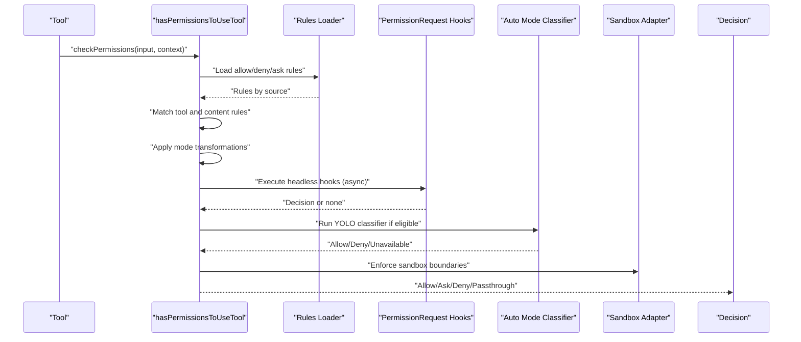
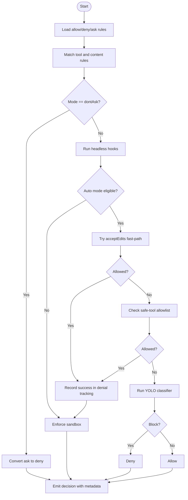
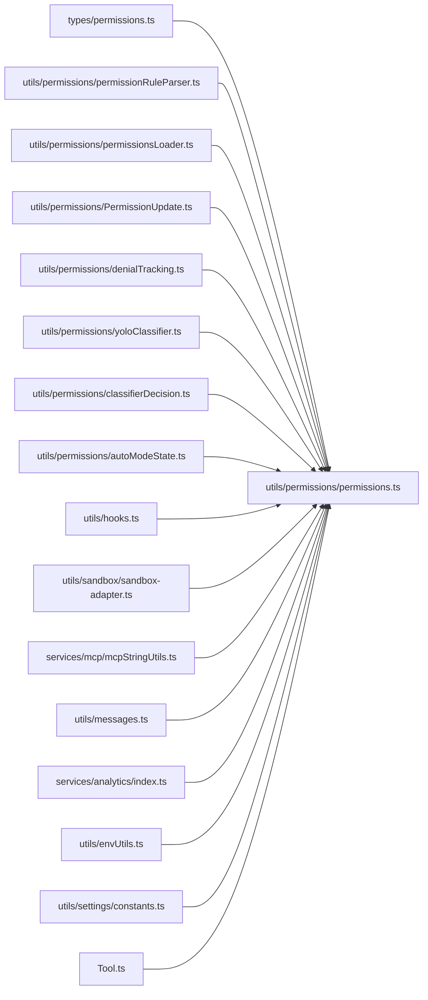

# Tool Permissions and Security

<cite>
**Referenced Files in This Document**
- [permissions.ts](file://src/utils/permissions/permissions.ts)
- [permissions.ts](file://src/types/permissions.ts)
- [index.ts](file://src/commands/permissions/index.ts)
- [permissions.js](file://src/commands/permissions/permissions.js)
- [PermissionMode.ts](file://src/utils/permissions/PermissionMode.ts)
- [PermissionUpdate.ts](file://src/utils/permissions/PermissionUpdate.ts)
- [permissionRuleParser.ts](file://src/utils/permissions/permissionRuleParser.ts)
- [permissionsLoader.ts](file://src/utils/permissions/permissionsLoader.ts)
- [denialTracking.ts](file://src/utils/permissions/denialTracking.ts)
- [yoloClassifier.ts](file://src/utils/permissions/yoloClassifier.ts)
- [classifierDecision.ts](file://src/utils/permissions/classifierDecision.ts)
- [autoModeState.ts](file://src/utils/permissions/autoModeState.ts)
- [sandbox-adapter.ts](file://src/utils/sandbox/sandbox-adapter.ts)
- [BashTool/shouldUseSandbox.ts](file://src/tools/BashTool/shouldUseSandbox.ts)
- [BashTool/toolName.ts](file://src/tools/BashTool/toolName.ts)
- [PowerShellTool/toolName.ts](file://src/tools/PowerShellTool/toolName.ts)
- [REPLTool/constants.ts](file://src/tools/REPLTool/constants.ts)
- [AgentTool/constants.ts](file://src/tools/AgentTool/constants.ts)
- [mcpStringUtils.ts](file://src/services/mcp/mcpStringUtils.ts)
- [messages.ts](file://src/utils/messages.ts)
- [analytics/index.ts](file://src/services/analytics/index.ts)
- [envUtils.ts](file://src/utils/envUtils.ts)
- [hooks.ts](file://src/utils/hooks.ts)
- [state.ts](file://src/bootstrap/state.ts)
- [settings/constants.ts](file://src/utils/settings/constants.ts)
- [Tool.ts](file://src/Tool.ts)
</cite>

## Table of Contents
1. [Introduction](#introduction)
2. [Project Structure](#project-structure)
3. [Core Components](#core-components)
4. [Architecture Overview](#architecture-overview)
5. [Detailed Component Analysis](#detailed-component-analysis)
6. [Dependency Analysis](#dependency-analysis)
7. [Performance Considerations](#performance-considerations)
8. [Troubleshooting Guide](#troubleshooting-guide)
9. [Conclusion](#conclusion)
10. [Appendices](#appendices)

## Introduction
This document explains the tool permissions and security subsystem. It covers the permission system architecture, classification of permission behaviors and modes, the security model for tool execution, and the algorithms used to evaluate permissions. It documents rule matching, deny/allow logic, path validation strategies, filesystem security boundaries, sandboxing mechanisms, permission context propagation, dynamic evaluation, runtime checks, best practices, threat modeling, vulnerability mitigations, and auditing and compliance monitoring approaches.

## Project Structure
The permission system spans several modules:
- Type definitions and constants for permission modes, behaviors, rules, and decisions
- Utilities for permission evaluation, rule parsing, updates, and denial tracking
- Auto mode classifier integration and state management
- Sandbox adapter integration for filesystem and execution boundaries
- Command surface to manage permission rules
- Hooks and analytics integrations for permission request handling and telemetry

```mermaid
graph TB
subgraph "Types"
T1["src/types/permissions.ts"]
end
subgraph "Utilities"
U1["src/utils/permissions/permissions.ts"]
U2["src/utils/permissions/PermissionMode.ts"]
U3["src/utils/permissions/PermissionUpdate.ts"]
U4["src/utils/permissions/permissionRuleParser.ts"]
U5["src/utils/permissions/permissionsLoader.ts"]
U6["src/utils/permissions/denialTracking.ts"]
U7["src/utils/permissions/yoloClassifier.ts"]
U8["src/utils/permissions/classifierDecision.ts"]
U9["src/utils/permissions/autoModeState.ts"]
end
subgraph "Security/Sandbox"
S1["src/utils/sandbox/sandbox-adapter.ts"]
S2["src/tools/BashTool/shouldUseSandbox.ts"]
end
subgraph "Commands"
C1["src/commands/permissions/index.ts"]
C2["src/commands/permissions/permissions.js"]
end
subgraph "Integration"
I1["src/services/mcp/mcpStringUtils.ts"]
I2["src/utils/messages.ts"]
I3["src/services/analytics/index.ts"]
I4["src/utils/envUtils.ts"]
I5["src/utils/hooks.ts"]
I6["src/bootstrap/state.ts"]
I7["src/utils/settings/constants.ts"]
I8["src/Tool.ts"]
end
T1 --> U1
U1 --> U2
U1 --> U3
U1 --> U4
U1 --> U5
U1 --> U6
U1 --> U7
U1 --> U8
U1 --> U9
U1 --> S1
U1 --> S2
U1 --> I1
U1 --> I2
U1 --> I3
U1 --> I4
U1 --> I5
U1 --> I6
U1 --> I7
U1 --> I8
C1 --> C2
```

**Diagram sources**
- [permissions.ts](file://src/utils/permissions/permissions.ts)
- [permissions.ts](file://src/types/permissions.ts)
- [index.ts](file://src/commands/permissions/index.ts)
- [permissions.js](file://src/commands/permissions/permissions.js)
- [PermissionMode.ts](file://src/utils/permissions/PermissionMode.ts)
- [PermissionUpdate.ts](file://src/utils/permissions/PermissionUpdate.ts)
- [permissionRuleParser.ts](file://src/utils/permissions/permissionRuleParser.ts)
- [permissionsLoader.ts](file://src/utils/permissions/permissionsLoader.ts)
- [denialTracking.ts](file://src/utils/permissions/denialTracking.ts)
- [yoloClassifier.ts](file://src/utils/permissions/yoloClassifier.ts)
- [classifierDecision.ts](file://src/utils/permissions/classifierDecision.ts)
- [autoModeState.ts](file://src/utils/permissions/autoModeState.ts)
- [sandbox-adapter.ts](file://src/utils/sandbox/sandbox-adapter.ts)
- [BashTool/shouldUseSandbox.ts](file://src/tools/BashTool/shouldUseSandbox.ts)
- [mcpStringUtils.ts](file://src/services/mcp/mcpStringUtils.ts)
- [messages.ts](file://src/utils/messages.ts)
- [analytics/index.ts](file://src/services/analytics/index.ts)
- [envUtils.ts](file://src/utils/envUtils.ts)
- [hooks.ts](file://src/utils/hooks.ts)
- [state.ts](file://src/bootstrap/state.ts)
- [settings/constants.ts](file://src/utils/settings/constants.ts)
- [Tool.ts](file://src/Tool.ts)

**Section sources**
- [permissions.ts](file://src/utils/permissions/permissions.ts)
- [permissions.ts](file://src/types/permissions.ts)
- [index.ts](file://src/commands/permissions/index.ts)

## Core Components
- Permission types and modes: Defines external/internal permission modes, behaviors (allow/deny/ask), rule sources, rule values, and decision structures.
- Permission evaluation engine: Implements rule matching, mode-based decisions, hook-driven decisions, and auto mode classifier integration.
- Auto mode classifier: Provides a YOLO classifier to approve or block actions without user interaction under controlled conditions.
- Denial tracking: Tracks consecutive and total denials to influence auto mode behavior and reduce friction after success.
- Sandbox integration: Enforces filesystem and execution boundaries for tools that support sandboxing.
- Permission updates: Adds, replaces, removes rules, sets modes, and manages working directories.
- MCP tool support: Handles fully qualified MCP tool names and server-level permissions.

**Section sources**
- [permissions.ts](file://src/types/permissions.ts)
- [permissions.ts](file://src/utils/permissions/permissions.ts)
- [yoloClassifier.ts](file://src/utils/permissions/yoloClassifier.ts)
- [denialTracking.ts](file://src/utils/permissions/denialTracking.ts)
- [sandbox-adapter.ts](file://src/utils/sandbox/sandbox-adapter.ts)
- [PermissionUpdate.ts](file://src/utils/permissions/PermissionUpdate.ts)
- [mcpStringUtils.ts](file://src/services/mcp/mcpStringUtils.ts)

## Architecture Overview
The permission system evaluates tool use requests through a layered pipeline:
- Input normalization and context extraction
- Rule lookup and matching (allow/deny/ask)
- Mode-based transformations (e.g., dontAsk converts ask to deny)
- Hook execution for headless agents
- Auto mode classifier gating for sensitive tools
- Sandbox enforcement for filesystem and execution boundaries
- Decision emission with metadata and analytics

**Diagram sources**
- [permissions.ts](file://src/utils/permissions/permissions.ts)
- [permissionsLoader.ts](file://src/utils/permissions/permissionsLoader.ts)
- [hooks.ts](file://src/utils/hooks.ts)
- [yoloClassifier.ts](file://src/utils/permissions/yoloClassifier.ts)
- [sandbox-adapter.ts](file://src/utils/sandbox/sandbox-adapter.ts)

## Detailed Component Analysis

### Permission Classification and Modes
- Modes: acceptEdits, bypassPermissions, default, dontAsk, plan, auto (internal), bubble (internal)
- Behaviors: allow, deny, ask
- Rule sources: userSettings, projectSettings, localSettings, flagSettings, policySettings, cliArg, command, session
- Decision metadata: reason types include rule, mode, subcommandResults, permissionPromptTool, hook, asyncAgent, sandboxOverride, classifier, workingDir, safetyCheck, other

**Section sources**
- [permissions.ts](file://src/types/permissions.ts)

### Permission Evaluation Algorithm
The evaluation proceeds in stages:
1. Load rules from configured sources and categorize by behavior.
2. Match tool against rules:
   - Entire tool match (no content) supports MCP server-level rules and exact tool names.
   - Content-based rule matching for tools with content (e.g., Bash with prefix).
3. Mode transformations:
   - dontAsk mode converts ask to deny.
   - acceptEdits fast-path may allow without classifier for safe edits.
   - Safe-tool allowlist bypasses classifier for low-risk tools.
4. Auto mode classifier:
   - Formats action for classifier, invokes YOLO, records analytics, and adjusts denial tracking.
5. Hook execution for headless agents to allow/deny before fallback.
6. Sandbox enforcement for tools that require it.
7. Emit decision with metadata and optional updated input.

**Diagram sources**
- [permissions.ts](file://src/utils/permissions/permissions.ts)
- [yoloClassifier.ts](file://src/utils/permissions/yoloClassifier.ts)
- [denialTracking.ts](file://src/utils/permissions/denialTracking.ts)

**Section sources**
- [permissions.ts](file://src/utils/permissions/permissions.ts)

### Rule Matching and Deny/Allow Logic
- Tool-level matching supports exact tool names and MCP server-level rules with wildcards.
- Content-based rules are mapped by content string for granular control.
- Deny rules take precedence over allow rules; ask rules trigger prompts.
- Agent filtering by deny rules prevents invocation of disallowed agent types.

**Section sources**
- [permissions.ts](file://src/utils/permissions/permissions.ts)

### Permission Context Propagation
- ToolPermissionContext carries:
  - mode
  - additionalWorkingDirectories
  - alwaysAllowRules, alwaysDenyRules, alwaysAskRules by source
  - flags for bypass availability, avoiding prompts, and automated checks
  - pre-plan mode state
- Context is propagated to hooks and used to adjust tool permission checks for acceptEdits fast-path.

**Section sources**
- [permissions.ts](file://src/types/permissions.ts)
- [permissions.ts](file://src/utils/permissions/permissions.ts)

### Dynamic Permission Evaluation and Runtime Checks
- Headless agents can receive permission decisions via hooks before falling back to auto-deny.
- Auto mode classifier decisions are logged with analytics metadata and token/latency telemetry.
- Denial tracking is updated on success and influences subsequent auto mode behavior.

**Section sources**
- [permissions.ts](file://src/utils/permissions/permissions.ts)
- [hooks.ts](file://src/utils/hooks.ts)
- [yoloClassifier.ts](file://src/utils/permissions/yoloClassifier.ts)
- [denialTracking.ts](file://src/utils/permissions/denialTracking.ts)
- [analytics/index.ts](file://src/services/analytics/index.ts)

### Path Validation Strategies and Filesystem Security Boundaries
- Working directory scope can be extended via additional directories with source attribution.
- Safety checks can produce classifierApprovable decisions to allow classifier evaluation for sensitive paths while keeping others interactive.
- Protected namespace detection informs analytics and decision-making around sensitive environments.

**Section sources**
- [permissions.ts](file://src/types/permissions.ts)
- [envUtils.ts](file://src/utils/envUtils.ts)

### Sandboxing Mechanisms
- Tools may opt into sandboxing; the sandbox adapter enforces filesystem and execution boundaries.
- BashTool integrates a dedicated decision for whether to use sandboxing.

**Section sources**
- [sandbox-adapter.ts](file://src/utils/sandbox/sandbox-adapter.ts)
- [BashTool/shouldUseSandbox.ts](file://src/tools/BashTool/shouldUseSandbox.ts)

### Auto Mode Classifier Integration
- Safe-tool allowlist and acceptEdits fast-path reduce reliance on the classifier.
- Classifier decisions are recorded with confidence, stage usage, and cost telemetry.
- Classifier unavailability triggers controlled fallback behavior.

**Section sources**
- [yoloClassifier.ts](file://src/utils/permissions/yoloClassifier.ts)
- [classifierDecision.ts](file://src/utils/permissions/classifierDecision.ts)
- [autoModeState.ts](file://src/utils/permissions/autoModeState.ts)
- [state.ts](file://src/bootstrap/state.ts)

### Permission Management Commands
- The permissions command exposes a UI surface to manage allow/deny rules and related settings.

**Section sources**
- [index.ts](file://src/commands/permissions/index.ts)
- [permissions.js](file://src/commands/permissions/permissions.js)

## Dependency Analysis
The permission system depends on:
- Type definitions for consistent modeling across modules
- Rule loader and parser for rule ingestion and matching
- Auto mode classifier and state for dynamic approvals
- Sandbox adapter for execution boundaries
- Hooks for headless agent integration
- Analytics for decision telemetry
- Settings constants for source labeling

**Diagram sources**
- [permissions.ts](file://src/utils/permissions/permissions.ts)
- [permissions.ts](file://src/types/permissions.ts)
- [permissionRuleParser.ts](file://src/utils/permissions/permissionRuleParser.ts)
- [permissionsLoader.ts](file://src/utils/permissions/permissionsLoader.ts)
- [PermissionUpdate.ts](file://src/utils/permissions/PermissionUpdate.ts)
- [denialTracking.ts](file://src/utils/permissions/denialTracking.ts)
- [yoloClassifier.ts](file://src/utils/permissions/yoloClassifier.ts)
- [classifierDecision.ts](file://src/utils/permissions/classifierDecision.ts)
- [autoModeState.ts](file://src/utils/permissions/autoModeState.ts)
- [hooks.ts](file://src/utils/hooks.ts)
- [sandbox-adapter.ts](file://src/utils/sandbox/sandbox-adapter.ts)
- [mcpStringUtils.ts](file://src/services/mcp/mcpStringUtils.ts)
- [messages.ts](file://src/utils/messages.ts)
- [analytics/index.ts](file://src/services/analytics/index.ts)
- [envUtils.ts](file://src/utils/envUtils.ts)
- [settings/constants.ts](file://src/utils/settings/constants.ts)
- [Tool.ts](file://src/Tool.ts)

**Section sources**
- [permissions.ts](file://src/utils/permissions/permissions.ts)

## Performance Considerations
- Classifier cost and latency are tracked for overhead analysis; consider batching or caching where appropriate.
- Denial tracking reduces classifier calls after successes; maintain this pattern for high-frequency tools.
- Avoid repeated parsing of deny rules by collecting denied agent types once per evaluation pass.
- Prefer allowlists and acceptEdits fast-path for low-risk tools to minimize classifier load.

[No sources needed since this section provides general guidance]

## Troubleshooting Guide
Common issues and remedies:
- Unexpected prompts: Verify dontAsk mode and rule precedence; confirm auto mode eligibility.
- Auto mode failures: Inspect classifier availability and transcript length errors; review denial tracking state.
- Headless agent denials: Ensure hooks are registered and return decisions; check abort controller signaling.
- Sandbox violations: Confirm tool supports sandboxing and that working directories are within allowed scope.
- Permission updates not applied: Validate update destinations and persistence logic.

**Section sources**
- [permissions.ts](file://src/utils/permissions/permissions.ts)
- [messages.ts](file://src/utils/messages.ts)
- [denialTracking.ts](file://src/utils/permissions/denialTracking.ts)
- [hooks.ts](file://src/utils/hooks.ts)
- [sandbox-adapter.ts](file://src/utils/sandbox/sandbox-adapter.ts)

## Conclusion
The permission system combines explicit rules, mode-based transformations, dynamic classifier approvals, and sandbox enforcement to secure tool execution. It balances safety and usability through deny/allow logic, context propagation, and robust telemetry. Adhering to the outlined best practices and threat modeling mitigations helps maintain a strong security posture.

[No sources needed since this section summarizes without analyzing specific files]

## Appendices

### Permission Decision Types and Metadata
- Allow: Updated input, user-modified flag, decision reason, tool use ID, feedback acceptance, content blocks
- Ask: Message, updated input, decision reason, suggestions, blocked path, metadata, optional classifier check, content blocks
- Deny: Message, decision reason, tool use ID
- Passthrough: Message, decision reason, suggestions, blocked path, optional classifier check

**Section sources**
- [permissions.ts](file://src/types/permissions.ts)

### MCP Tool Permission Matching
- Fully qualified MCP tool names supported; server-level rules use wildcard semantics.

**Section sources**
- [permissions.ts](file://src/utils/permissions/permissions.ts)
- [mcpStringUtils.ts](file://src/services/mcp/mcpStringUtils.ts)

### Security Best Practices and Mitigations
- Prefer deny rules for sensitive tools and content.
- Use acceptEdits fast-path for safe edits to reduce classifier load.
- Keep auto mode restricted to approved tools and contexts.
- Monitor classifier availability and handle unavailability gracefully.
- Enforce sandboxing for filesystem-privileged tools.
- Track and act on denial trends to tune rules and reduce friction.

[No sources needed since this section provides general guidance]