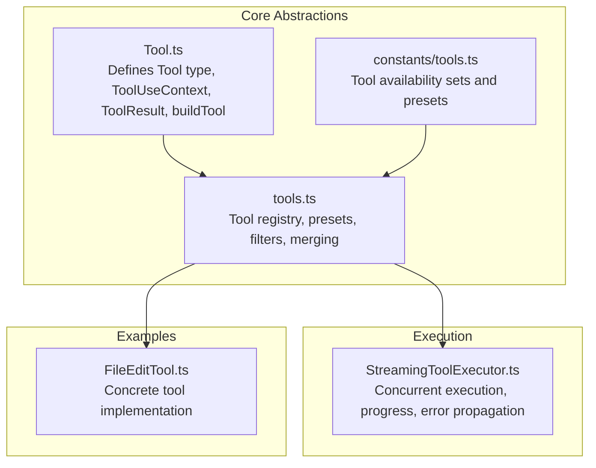
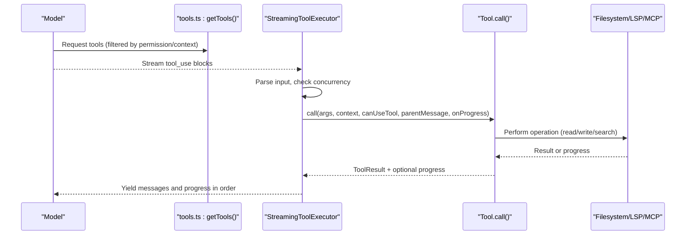
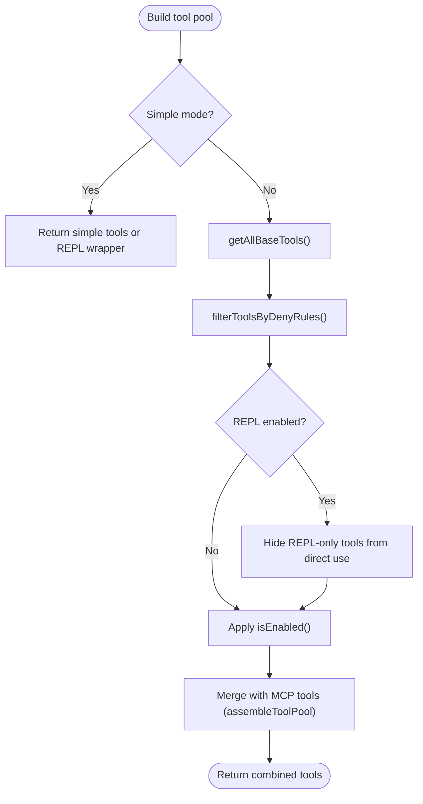
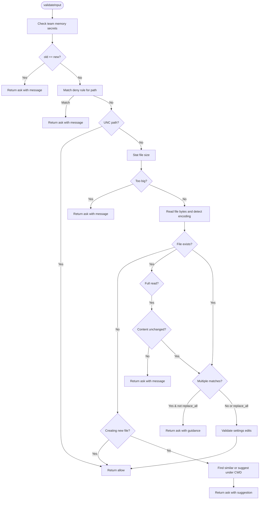
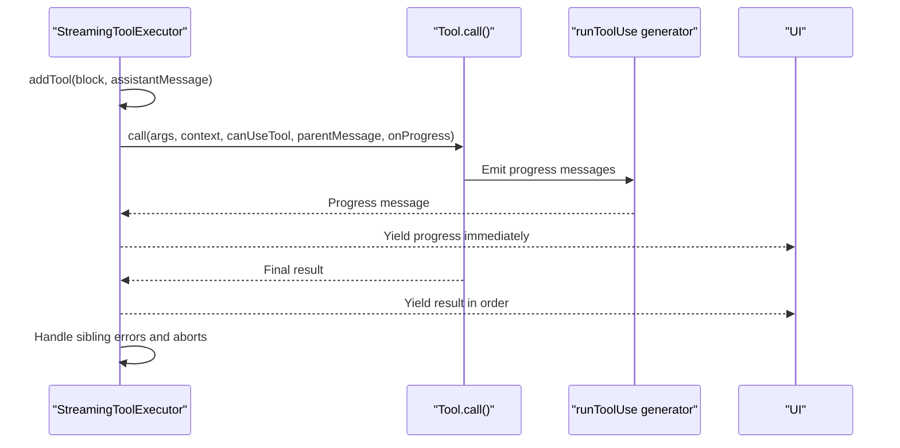
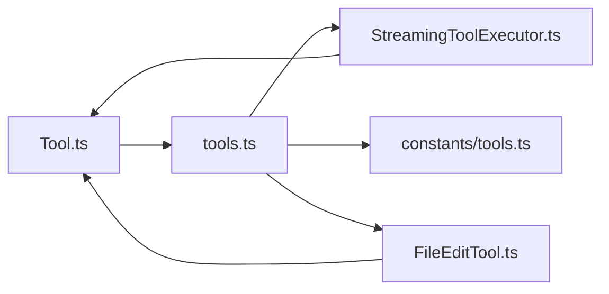

# Tool System Architecture

<cite>
**Referenced Files in This Document**
- [Tool.ts](file://claude_code_src/restored-src/src/Tool.ts)
- [tools.ts](file://claude_code_src/restored-src/src/tools.ts)
- [tools.ts (constants)](file://claude_code_src/restored-src/src/constants/tools.ts)
- [useMergedTools.ts](file://claude_code_src/restored-src/src/hooks/useMergedTools.ts)
- [StreamingToolExecutor.ts](file://claude_code_src/restored-src/src/services/tools/StreamingToolExecutor.ts)
- [FileEditTool.ts](file://claude_code_src/restored-src/src/tools/FileEditTool/FileEditTool.ts)
</cite>

## Table of Contents
1. [Introduction](#introduction)
2. [Project Structure](#project-structure)
3. [Core Components](#core-components)
4. [Architecture Overview](#architecture-overview)
5. [Detailed Component Analysis](#detailed-component-analysis)
6. [Dependency Analysis](#dependency-analysis)
7. [Performance Considerations](#performance-considerations)
8. [Troubleshooting Guide](#troubleshooting-guide)
9. [Conclusion](#conclusion)

## Introduction
This document explains the tool system architecture, focusing on the tool design pattern, registration and lifecycle management, and the relationship between tools and the command system. It covers the Tool base class, execution interfaces, tool-specific configurations, the tool registry and discovery mechanisms, dynamic loading, permissions and security models, sandboxing strategies, validation and error handling, streaming responses, and performance considerations. Concrete examples are drawn from the actual codebase to illustrate implementation patterns and integration points.

## Project Structure
The tool system is centered around a small set of core abstractions and a registry that aggregates built-in and dynamic tools (such as MCP tools). Tools are defined using a builder pattern that injects safe defaults and exposes optional hooks for validation, permissions, UI rendering, and classification.



**Diagram sources**
- [Tool.ts:362-792](file://claude_code_src/restored-src/src/Tool.ts#L362-L792)
- [tools.ts:193-389](file://claude_code_src/restored-src/src/tools.ts#L193-L389)
- [constants/tools.ts:36-112](file://claude_code_src/restored-src/src/constants/tools.ts#L36-L112)
- [StreamingToolExecutor.ts:40-519](file://claude_code_src/restored-src/src/services/tools/StreamingToolExecutor.ts#L40-L519)
- [FileEditTool.ts:86-595](file://claude_code_src/restored-src/src/tools/FileEditTool/FileEditTool.ts#L86-L595)

**Section sources**
- [Tool.ts:362-792](file://claude_code_src/restored-src/src/Tool.ts#L362-L792)
- [tools.ts:193-389](file://claude_code_src/restored-src/src/tools.ts#L193-L389)
- [constants/tools.ts:36-112](file://claude_code_src/restored-src/src/constants/tools.ts#L36-L112)

## Core Components
- Tool base class and builder
  - The Tool type defines the contract for all tools, including call, description, input/output schemas, permission checks, UI rendering hooks, and optional capabilities such as concurrency safety, destructive operations, and search/read categorization.
  - The buildTool function merges a partial tool definition with safe defaults for commonly stubbed methods, ensuring consistent behavior across tools.
- ToolUseContext
  - Provides runtime context for tool execution, including command lists, permissions, MCP clients/resources, abort signals, file state caches, and UI hooks for progress and notifications.
- ToolResult
  - Standardized result container with data, optional new messages, and optional context modifiers for mutating the execution context during streaming.
- Tool registry and presets
  - getAllBaseTools constructs the canonical list of built-in tools, respecting feature flags and environment toggles.
  - getTools filters tools by permission deny rules, REPL-only visibility, and isEnabled checks.
  - assembleToolPool merges built-in tools with MCP tools, deduplicating by name and preserving built-in precedence.
- Permission and security model
  - ToolPermissionContext encapsulates permission mode, deny/allow/ask rules, and additional working directories. Tools implement checkPermissions and optional preparePermissionMatcher for pattern-based matching.
  - Permission deny rules are enforced early in the pipeline to exclude tools before model exposure.

**Section sources**
- [Tool.ts:362-792](file://claude_code_src/restored-src/src/Tool.ts#L362-L792)
- [tools.ts:193-389](file://claude_code_src/restored-src/src/tools.ts#L193-L389)
- [constants/tools.ts:36-112](file://claude_code_src/restored-src/src/constants/tools.ts#L36-L112)

## Architecture Overview
The tool system integrates tightly with the command system and the execution engine. Tools are registered centrally, filtered by permissions and environment, and executed concurrently under a streaming executor that enforces ordering and cancellation semantics.



**Diagram sources**
- [tools.ts:271-327](file://claude_code_src/restored-src/src/tools.ts#L271-L327)
- [StreamingToolExecutor.ts:76-124](file://claude_code_src/restored-src/src/services/tools/StreamingToolExecutor.ts#L76-L124)
- [Tool.ts:379-385](file://claude_code_src/restored-src/src/Tool.ts#L379-L385)

## Detailed Component Analysis

### Tool Base Class and Builder Pattern
- Contract and capabilities
  - Tools expose call, description, inputSchema, outputSchema, and optional hooks for validation, permissions, UI rendering, and classification.
  - Optional flags indicate concurrency safety, read-only, destructive behavior, and whether the tool should be deferred or always loaded.
- Builder and defaults
  - buildTool merges a partial definition with defaults for isEnabled, isConcurrencySafe, isReadOnly, isDestructive, checkPermissions, toAutoClassifierInput, and userFacingName.
- Execution interfaces
  - ToolUseContext provides abortController, file state caches, and UI hooks.
  - ToolResult supports contextModifier to mutate context during streaming.

```mermaid
classDiagram
class Tool {
+name : string
+aliases? : string[]
+searchHint? : string
+call(args, context, canUseTool, parentMessage, onProgress) ToolResult
+description(input, options) string
+inputSchema
+outputSchema?
+inputsEquivalent?(a,b)
+isConcurrencySafe(input) boolean
+isEnabled() boolean
+isReadOnly(input) boolean
+isDestructive?(input) boolean
+interruptBehavior?() "cancel"|"block"
+isSearchOrReadCommand?(input) {isSearch,isRead,isList?}
+isOpenWorld?(input) boolean
+requiresUserInteraction?() boolean
+isMcp?
+isLsp?
+shouldDefer?
+alwaysLoad?
+mcpInfo?
+maxResultSizeChars : number
+strict?
+backfillObservableInput?(input)
+validateInput?(input, context) ValidationResult
+checkPermissions(input, context) PermissionResult
+getPath?(input) string
+preparePermissionMatcher?(input)
+prompt(options) string
+userFacingName(input?) string
+userFacingNameBackgroundColor?(input?)
+isTransparentWrapper?() boolean
+getToolUseSummary?(input?) string|null
+getActivityDescription?(input?) string|null
+toAutoClassifierInput(input) unknown
+mapToolResultToToolResultBlockParam(content, toolUseID)
+renderToolResultMessage?(content, progress, options) ReactNode
+extractSearchText?(out) string
+renderToolUseMessage(input, options) ReactNode
+isResultTruncated?(output) boolean
+renderToolUseTag?(input) ReactNode
+renderToolUseProgressMessage?(progress, options) ReactNode
+renderToolUseQueuedMessage?()
+renderToolUseRejectedMessage?(input, options) ReactNode
+renderToolUseErrorMessage?(result, options) ReactNode
+renderGroupedToolUse?(toolUses, options) ReactNode|null
}
class ToolUseContext {
+options
+abortController
+readFileState
+getAppState()
+setAppState(f)
+setAppStateForTasks?
+handleElicitation?
+setToolJSX?
+addNotification?
+appendSystemMessage?
+sendOSNotification?
+setInProgressToolUseIDs
+setHasInterruptibleToolInProgress?
+setResponseLength
+pushApiMetricsEntry?
+setStreamMode?
+onCompactProgress?
+setSDKStatus?
+openMessageSelector?
+updateFileHistoryState(updater)
+updateAttributionState(updater)
+setConversationId?
+agentId?
+agentType?
+requireCanUseTool?
+messages
+fileReadingLimits?
+globLimits?
+toolDecisions?
+queryTracking?
+requestPrompt?
+toolUseId?
+criticalSystemReminder_EXPERIMENTAL?
+preserveToolUseResults?
+localDenialTracking?
+contentReplacementState?
+renderedSystemPrompt?
}
class ToolResult {
+data
+newMessages?
+contextModifier?
+mcpMeta?
}
Tool --> ToolUseContext : "executes with"
Tool --> ToolResult : "returns"
```

**Diagram sources**
- [Tool.ts:362-695](file://claude_code_src/restored-src/src/Tool.ts#L362-L695)

**Section sources**
- [Tool.ts:362-792](file://claude_code_src/restored-src/src/Tool.ts#L362-L792)

### Tool Registration and Lifecycle Management
- Central registry
  - getAllBaseTools enumerates all built-in tools, respecting feature flags and environment variables.
  - getTools applies permission deny rules, REPL-only visibility, and isEnabled checks.
  - assembleToolPool merges built-in and MCP tools, deduplicating by name and sorting for prompt-cache stability.
- Presets and filtering
  - Tool presets are supported; getToolsForDefaultPreset filters enabled tools by name.
- Dynamic tool loading
  - Conditional imports enable or disable tools based on feature flags and environment variables.
  - Lazy require patterns prevent circular dependencies for certain tools.



**Diagram sources**
- [tools.ts:193-367](file://claude_code_src/restored-src/src/tools.ts#L193-L367)

**Section sources**
- [tools.ts:193-389](file://claude_code_src/restored-src/src/tools.ts#L193-L389)
- [constants/tools.ts:36-112](file://claude_code_src/restored-src/src/constants/tools.ts#L36-L112)

### Relationship Between Tools and the Command System
- Tool discovery and presentation
  - Tools are presented to the model via system prompts and tool schemas; ToolSearch can defer loading until needed.
  - ToolSearch-related flags influence whether tools are deferred or always loaded.
- Permission-aware presentation
  - Permission deny rules filter tools before they are exposed to the model, preventing invalid calls.
- Command integration
  - ToolUseContext includes a commands array and helpers for interactive flows.

**Section sources**
- [tools.ts:247-249](file://claude_code_src/restored-src/src/tools.ts#L247-L249)
- [Tool.ts:158-300](file://claude_code_src/restored-src/src/Tool.ts#L158-L300)

### Tool-Specific Configurations and Examples
- FileEditTool example
  - Implements validateInput with extensive checks (existence, encoding detection, size limits, unexpected modifications, settings validation).
  - Uses checkPermissions for filesystem write permissions and preparePermissionMatcher for wildcard matching.
  - Emits progress messages and updates LSP servers and file history.
  - Provides UI hooks for rendering tool use messages, results, and error/rejection messages.
  - Demonstrates backfillObservableInput to normalize paths for permission matching.



**Diagram sources**
- [FileEditTool.ts:137-362](file://claude_code_src/restored-src/src/tools/FileEditTool/FileEditTool.ts#L137-L362)

**Section sources**
- [FileEditTool.ts:86-595](file://claude_code_src/restored-src/src/tools/FileEditTool/FileEditTool.ts#L86-L595)

### Permissions, Security Model, and Sandboxing Strategies
- Permission context
  - ToolPermissionContext carries mode, deny/allow/ask rules, and additional working directories.
- Tool-level checks
  - Tools implement checkPermissions and optional preparePermissionMatcher for pattern-based matching.
  - Permission deny rules are enforced early in getTools and assembleToolPool.
- Sandboxing and safety
  - isReadOnly and isDestructive flags inform UI and classification.
  - validateInput provides tool-specific safety checks (e.g., size limits, unexpected modifications).
  - UNC path handling avoids NTLM credential leakage.
- Interactive and coordinator modes
  - constants/tools.ts defines allowed/disallowed tools per mode (async agents, in-process teammates, coordinator mode).

**Section sources**
- [Tool.ts:123-148](file://claude_code_src/restored-src/src/Tool.ts#L123-L148)
- [tools.ts:262-327](file://claude_code_src/restored-src/src/tools.ts#L262-L327)
- [constants/tools.ts:36-112](file://claude_code_src/restored-src/src/constants/tools.ts#L36-L112)
- [FileEditTool.ts:125-132](file://claude_code_src/restored-src/src/tools/FileEditTool/FileEditTool.ts#L125-L132)

### Tool Discovery Mechanisms and Dynamic Loading
- Discovery
  - getAllBaseTools enumerates tools and conditionally includes feature-gated tools.
  - isToolSearchEnabledOptimistic influences whether ToolSearchTool is included.
- Dynamic MCP tools
  - assembleToolPool merges MCP tools with built-in tools, applying deny rules and deduplication.
- React integration
  - useMergedTools composes initial tools, assembled pool, and permission context for the REPL UI.

**Section sources**
- [tools.ts:193-249](file://claude_code_src/restored-src/src/tools.ts#L193-L249)
- [tools.ts:345-367](file://claude_code_src/restored-src/src/tools.ts#L345-L367)
- [useMergedTools.ts:20-44](file://claude_code_src/restored-src/src/hooks/useMergedTools.ts#L20-L44)

### Tool Execution Interfaces and Streaming Responses
- StreamingToolExecutor
  - Manages concurrency: concurrent-safe tools run in parallel; non-concurrent tools run exclusively.
  - Enforces ordering and yields results in the order tools were received.
  - Handles progress messages immediately, buffers results, and propagates cancellations and errors.
  - Supports discard for streaming fallback scenarios.
- Interrupt behavior
  - Tools declare interruptBehavior; user interrupts can cancel or block depending on the tool’s setting.
- Context mutation
  - Tools may return contextModifier to mutate the execution context during streaming.



**Diagram sources**
- [StreamingToolExecutor.ts:40-519](file://claude_code_src/restored-src/src/services/tools/StreamingToolExecutor.ts#L40-L519)

**Section sources**
- [StreamingToolExecutor.ts:40-519](file://claude_code_src/restored-src/src/services/tools/StreamingToolExecutor.ts#L40-L519)

### Tool Validation, Error Handling, and Classification
- Validation
  - validateInput returns ValidationResult with behavior and optional meta; tools can request user input or reject with guidance.
- Error handling
  - Synthetic error messages are generated for user interruptions, sibling errors, and streaming fallbacks.
  - Bash tool errors trigger cascading cancellations for dependent parallel tools.
- Auto-classifier input
  - toAutoClassifierInput produces a concise transcript for security classification; tools opt into or out of classification.

**Section sources**
- [Tool.ts:95-101](file://claude_code_src/restored-src/src/Tool.ts#L95-L101)
- [StreamingToolExecutor.ts:153-205](file://claude_code_src/restored-src/src/services/tools/StreamingToolExecutor.ts#L153-L205)
- [FileEditTool.ts:109-111](file://claude_code_src/restored-src/src/tools/FileEditTool/FileEditTool.ts#L109-L111)

## Dependency Analysis
The tool system exhibits low coupling between tools and high cohesion within the registry and executor. The registry centralizes discovery and filtering, while the executor encapsulates concurrency and progress semantics.



**Diagram sources**
- [Tool.ts:362-792](file://claude_code_src/restored-src/src/Tool.ts#L362-L792)
- [tools.ts:193-389](file://claude_code_src/restored-src/src/tools.ts#L193-L389)
- [constants/tools.ts:36-112](file://claude_code_src/restored-src/src/constants/tools.ts#L36-L112)
- [StreamingToolExecutor.ts:40-519](file://claude_code_src/restored-src/src/services/tools/StreamingToolExecutor.ts#L40-L519)
- [FileEditTool.ts:86-595](file://claude_code_src/restored-src/src/tools/FileEditTool/FileEditTool.ts#L86-L595)

**Section sources**
- [tools.ts:193-389](file://claude_code_src/restored-src/src/tools.ts#L193-L389)
- [StreamingToolExecutor.ts:40-519](file://claude_code_src/restored-src/src/services/tools/StreamingToolExecutor.ts#L40-L519)

## Performance Considerations
- Concurrency control
  - StreamingToolExecutor ensures non-concurrent tools run exclusively to avoid race conditions; concurrent-safe tools run in parallel.
- Prompt caching stability
  - Sorting and deduplication in assembleToolPool maintain stable tool ordering for prompt-cache keys.
- Result size limits
  - Tools can set maxResultSizeChars to persist large outputs to disk and reduce memory pressure.
- Early filtering
  - Permission deny rules and isEnabled checks reduce unnecessary work and improve throughput.
- Path normalization
  - expandPath and consistent path handling prevent lookup mismatches and reduce retries.

[No sources needed since this section provides general guidance]

## Troubleshooting Guide
- Tool not available
  - Symptom: Error indicating tool not available.
  - Cause: Tool not included in the current tool pool (disabled, denied, or filtered).
  - Action: Verify permission context, feature flags, and REPL-only visibility.
- Permission denials
  - Symptom: Tool use blocked by permission dialog or immediate rejection.
  - Cause: Deny rules or tool-specific checkPermissions.
  - Action: Adjust ToolPermissionContext rules or tool-specific permission matcher.
- Unexpected modifications
  - Symptom: Write operations rejected due to file changes since last read.
  - Cause: validateInput detects timestamp/content mismatch.
  - Action: Re-read the file or accept the tool’s guidance to retry.
- Streaming fallback or sibling errors
  - Symptom: Parallel tool execution cancelled or discarded.
  - Cause: Bash error cascading to siblings or streaming fallback discarding results.
  - Action: Inspect tool error messages and adjust tool ordering or environment.

**Section sources**
- [StreamingToolExecutor.ts:76-102](file://claude_code_src/restored-src/src/services/tools/StreamingToolExecutor.ts#L76-L102)
- [FileEditTool.ts:290-311](file://claude_code_src/restored-src/src/tools/FileEditTool/FileEditTool.ts#L290-L311)

## Conclusion
The tool system is designed around a robust Tool base class, a centralized registry with permission-aware filtering, and a streaming executor that enforces concurrency and ordering. Safety is layered through validation, permissions, and sandboxing strategies, while UI hooks and classification integrate tools into the broader command and conversation systems. The architecture supports dynamic tool loading, mode-specific availability, and efficient performance through careful concurrency control and caching considerations.