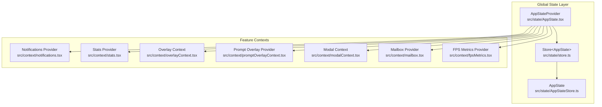
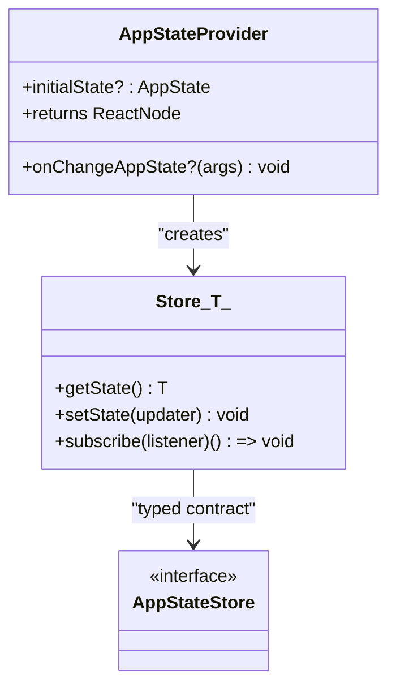
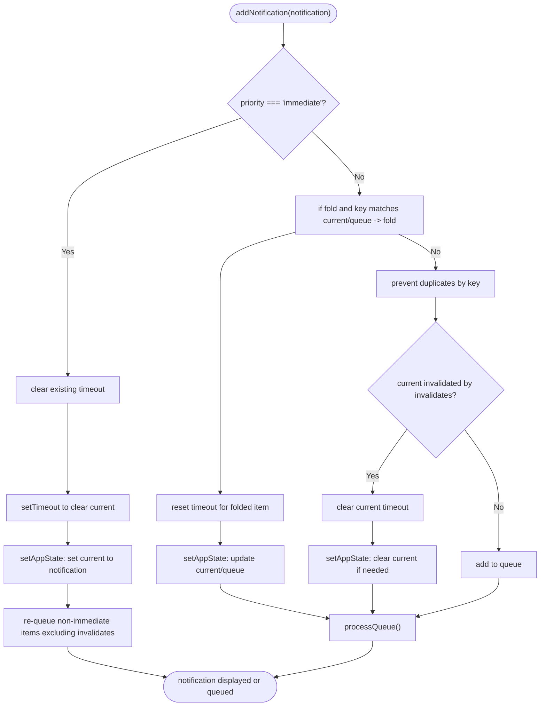
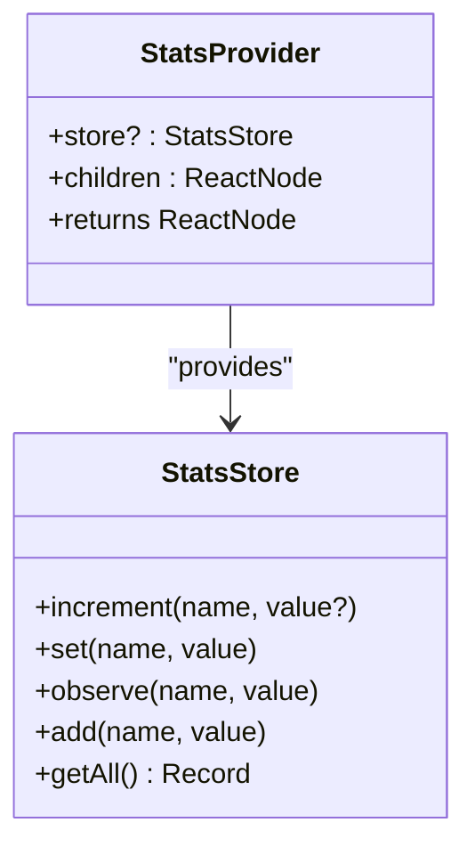
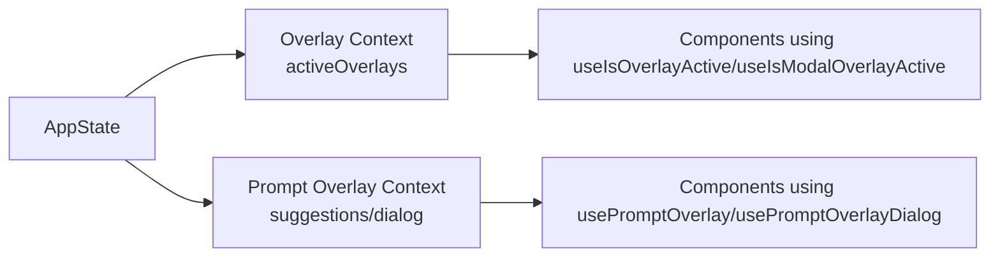
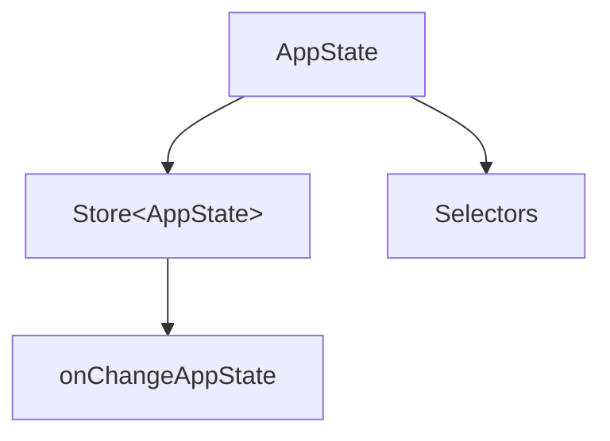

# Context Providers and State Management

<cite>
**Referenced Files in This Document**
- [AppState.tsx](file://src/state/AppState.tsx)
- [AppStateStore.ts](file://src/state/AppStateStore.ts)
- [store.ts](file://src/state/store.ts)
- [onChangeAppState.ts](file://src/state/onChangeAppState.ts)
- [selectors.ts](file://src/state/selectors.ts)
- [notifications.tsx](file://src/context/notifications.tsx)
- [modalContext.tsx](file://src/context/modalContext.tsx)
- [mailbox.tsx](file://src/context/mailbox.tsx)
- [overlayContext.tsx](file://src/context/overlayContext.tsx)
- [promptOverlayContext.tsx](file://src/context/promptOverlayContext.tsx)
- [stats.tsx](file://src/context/stats.tsx)
- [fpsMetrics.tsx](file://src/context/fpsMetrics.tsx)
</cite>

## Table of Contents
1. [Introduction](#introduction)
2. [Project Structure](#project-structure)
3. [Core Components](#core-components)
4. [Architecture Overview](#architecture-overview)
5. [Detailed Component Analysis](#detailed-component-analysis)
6. [Dependency Analysis](#dependency-analysis)
7. [Performance Considerations](#performance-considerations)
8. [Troubleshooting Guide](#troubleshooting-guide)
9. [Conclusion](#conclusion)

## Introduction
This document explains the React context system and state management implementation in the application. It covers how global application state is modeled, initialized, updated, and consumed across components. It also documents the context hierarchy, provider composition, performance optimization techniques, and debugging strategies for tracking state changes and component subscriptions.

## Project Structure
The state management system centers around a single global store with React context providers layered to serve different concerns:
- Global application state is encapsulated in a typed store and exposed via a dedicated context provider.
- Feature-specific contexts (notifications, stats, FPS metrics, overlays, prompt overlays, mailbox) compose around the global state provider.
- Selectors derive computed data from the global state to keep components efficient and predictable.



**Diagram sources**
- [AppState.tsx:37-110](file://src/state/AppState.tsx#L37-L110)
- [store.ts:10-35](file://src/state/store.ts#L10-L35)
- [AppStateStore.ts:89-452](file://src/state/AppStateStore.ts#L89-L452)
- [notifications.tsx:38-229](file://src/context/notifications.tsx#L38-L229)
- [stats.tsx:104-156](file://src/context/stats.tsx#L104-L156)
- [overlayContext.tsx:38-104](file://src/context/overlayContext.tsx#L38-L104)
- [promptOverlayContext.tsx:34-60](file://src/context/promptOverlayContext.tsx#L34-L60)
- [modalContext.tsx:27-58](file://src/context/modalContext.tsx#L27-L58)
- [mailbox.tsx:8-30](file://src/context/mailbox.tsx#L8-L30)
- [fpsMetrics.tsx:10-29](file://src/context/fpsMetrics.tsx#L10-L29)

**Section sources**
- [AppState.tsx:37-110](file://src/state/AppState.tsx#L37-L110)
- [store.ts:10-35](file://src/state/store.ts#L10-L35)
- [AppStateStore.ts:89-452](file://src/state/AppStateStore.ts#L89-L452)

## Core Components
- AppStateProvider: Creates and manages the global store, wires change listeners, composes feature providers, and exposes hooks for consuming and updating state.
- Store: Minimal reactive store with getState, setState, and subscribe APIs.
- AppState and AppStateStore: Strongly typed global state shape and store contract.
- onChangeAppState: Centralized handler for side effects triggered by state changes (e.g., persisting settings, notifying external systems).
- Selectors: Pure functions to compute derived data from AppState.

Key hooks:
- useAppState(selector): Subscribes to a slice of AppState and re-renders only when the selected value changes.
- useSetAppState(): Returns a stable updater without subscribing to state changes.
- useAppStateStore(): Provides direct access to the store for advanced scenarios.

**Section sources**
- [AppState.tsx:117-179](file://src/state/AppState.tsx#L117-L179)
- [store.ts:4-8](file://src/state/store.ts#L4-L8)
- [AppStateStore.ts:454-570](file://src/state/AppStateStore.ts#L454-L570)
- [onChangeAppState.ts:43-171](file://src/state/onChangeAppState.ts#L43-L171)
- [selectors.ts:18-77](file://src/state/selectors.ts#L18-L77)

## Architecture Overview
The global state architecture follows a unidirectional data flow:
- Components call setters from the store to update AppState.
- onChangeAppState reacts to changes and performs side effects (persisting settings, updating external metadata).
- Feature contexts read AppState via selectors or direct subscriptions to render UI or coordinate behavior.

```mermaid
sequenceDiagram
participant UI as "UI Component"
participant Store as "Store&lt;AppState&gt;"
participant Provider as "AppStateProvider"
participant Handler as "onChangeAppState"
participant SideEffects as "Side Effects"
UI->>Provider : useSetAppState()(updater)
Provider->>Store : setState(updater)
Store->>Store : compute nextState
Store-->>Provider : notify subscribers
Store->>Handler : onChangeAppState({newState, oldState})
Handler->>SideEffects : persist settings, notify external systems
Provider-->>UI : useAppState(selector) re-renders only when selected value changes
```

**Diagram sources**
- [AppState.tsx:170-179](file://src/state/AppState.tsx#L170-L179)
- [store.ts:20-27](file://src/state/store.ts#L20-L27)
- [onChangeAppState.ts:43-92](file://src/state/onChangeAppState.ts#L43-L92)

## Detailed Component Analysis

### AppStateProvider and Global Store
AppStateProvider initializes the store with optional initial state and an onChange callback. It composes feature providers (MailboxProvider and VoiceProvider) and exposes the store via context. It guards against nested providers and ensures stable store references to avoid unnecessary re-renders.



**Diagram sources**
- [store.ts:4-8](file://src/state/store.ts#L4-L8)
- [AppState.tsx:37-110](file://src/state/AppState.tsx#L37-L110)
- [AppStateStore.ts:454-454](file://src/state/AppStateStore.ts#L454-L454)

**Section sources**
- [AppState.tsx:37-110](file://src/state/AppState.tsx#L37-L110)
- [store.ts:10-35](file://src/state/store.ts#L10-L35)

### Notifications Context
The notifications context manages a queue and current notification, supporting priorities, folding, invalidation, and timeouts. It uses the global store to mutate AppState.notifications and coordinates rendering via a queue processor.



**Diagram sources**
- [notifications.tsx:46-192](file://src/context/notifications.tsx#L46-L192)

**Section sources**
- [notifications.tsx:38-229](file://src/context/notifications.tsx#L38-L229)

### Stats Context
The stats context provides a metrics store with counters, gauges, timers (histograms), and sets. It persists metrics on process exit and exposes typed hooks for instrumentation.



**Diagram sources**
- [stats.tsx:28-98](file://src/context/stats.tsx#L28-L98)
- [stats.tsx:104-156](file://src/context/stats.tsx#L104-L156)

**Section sources**
- [stats.tsx:104-156](file://src/context/stats.tsx#L104-L156)

### Overlay and Prompt Overlay Contexts
Overlay context tracks active overlays for Escape key coordination and modal detection. Prompt overlay context provides two channels: structured suggestion data and arbitrary dialog nodes, enabling floating UI above the prompt without clipping.



**Diagram sources**
- [overlayContext.tsx:122-150](file://src/context/overlayContext.tsx#L122-L150)
- [promptOverlayContext.tsx:61-124](file://src/context/promptOverlayContext.tsx#L61-L124)

**Section sources**
- [overlayContext.tsx:38-150](file://src/context/overlayContext.tsx#L38-L150)
- [promptOverlayContext.tsx:34-124](file://src/context/promptOverlayContext.tsx#L34-L124)

### Modal Context
Modal context communicates available terminal rows/columns and scroll ref to components rendered inside a modal slot, allowing them to size content appropriately and reset scroll on tab switches.

**Section sources**
- [modalContext.tsx:22-58](file://src/context/modalContext.tsx#L22-L58)

### Mailbox Context
Mailbox context provides a lightweight message bus instance to components that need inter-component communication without prop drilling.

**Section sources**
- [mailbox.tsx:8-37](file://src/context/mailbox.tsx#L8-L37)

### FPS Metrics Context
FPS metrics context exposes a getter for runtime performance metrics to components that need to render performance-sensitive UI.

**Section sources**
- [fpsMetrics.tsx:10-29](file://src/context/fpsMetrics.tsx#L10-L29)

## Dependency Analysis
The global state depends on:
- Store for state transitions and subscriptions.
- onChangeAppState for side effects and synchronization with external systems.
- Selectors for computing derived data efficiently.

Feature contexts depend on:
- AppStateProvider for access to AppState and store.
- Utility modules for specific behaviors (e.g., notifications, stats, overlays).



**Diagram sources**
- [store.ts:10-35](file://src/state/store.ts#L10-L35)
- [AppStateStore.ts:89-452](file://src/state/AppStateStore.ts#L89-L452)
- [onChangeAppState.ts:43-171](file://src/state/onChangeAppState.ts#L43-L171)
- [selectors.ts:18-77](file://src/state/selectors.ts#L18-L77)

**Section sources**
- [AppState.tsx:37-110](file://src/state/AppState.tsx#L37-L110)
- [onChangeAppState.ts:43-171](file://src/state/onChangeAppState.ts#L43-L171)
- [selectors.ts:18-77](file://src/state/selectors.ts#L18-L77)

## Performance Considerations
- useAppState(selector) uses Object.is comparison to minimize re-renders. Avoid returning new objects from selectors; instead, return existing references to enable efficient comparisons.
- Memoization patterns: Feature contexts use memoization caches to stabilize provider values and avoid unnecessary re-renders (e.g., mailbox creation, modal size computation).
- Stable updater: useSetAppState() returns a stable reference, preventing components from re-rendering solely due to state changes.
- Selectors: Keep selectors pure and simple to maintain deterministic re-renders and predictable performance.
- Avoid deep cloning in setState; pass immutable updates to leverage Object.is equality checks.

**Section sources**
- [AppState.tsx:142-163](file://src/state/AppState.tsx#L142-L163)
- [AppState.tsx:170-172](file://src/state/AppState.tsx#L170-L172)
- [mailbox.tsx:14-20](file://src/context/mailbox.tsx#L14-L20)
- [modalContext.tsx:42-53](file://src/context/modalContext.tsx#L42-L53)

## Troubleshooting Guide
- Debugging state changes:
  - Use onChangeAppState to log or track changes to AppState slices (e.g., permission mode, verbose flag, expanded view).
  - Inspect AppState via useAppStateStore() for imperative reads when needed.
- Component subscriptions:
  - Confirm components are wrapped by AppStateProvider; otherwise, hooks like useAppState will throw.
  - Ensure selectors return stable references to avoid excessive re-renders.
- Notifications:
  - Verify add/remove functions are called with unique keys and proper invalidation lists.
  - Check timeout behavior for immediate notifications and queue processing.
- Stats:
  - Confirm metrics are flushed on process exit and persisted to project config.
- Overlays:
  - Ensure useRegisterOverlay is called with a unique id and enabled flag; verify active overlays set/unset correctly.

**Section sources**
- [AppState.tsx:117-124](file://src/state/AppState.tsx#L117-L124)
- [onChangeAppState.ts:43-171](file://src/state/onChangeAppState.ts#L43-L171)
- [notifications.tsx:78-117](file://src/context/notifications.tsx#L78-L117)
- [stats.tsx:123-136](file://src/context/stats.tsx#L123-L136)
- [overlayContext.tsx:46-85](file://src/context/overlayContext.tsx#L46-L85)

## Conclusion
The application employs a robust, scalable state management architecture centered on a typed global store and React context providers. The AppStateProvider orchestrates state initialization, updates, and subscriptions, while feature contexts encapsulate domain-specific concerns. Performance is optimized through memoization, stable references, and efficient subscription patterns. Centralized side effects in onChangeAppState ensure consistent synchronization with external systems and persisted settings.