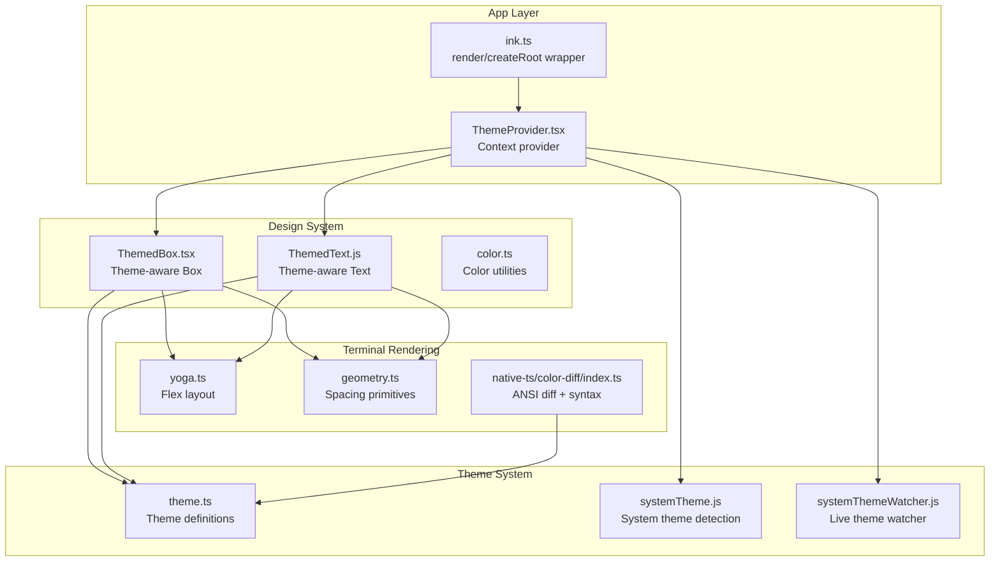
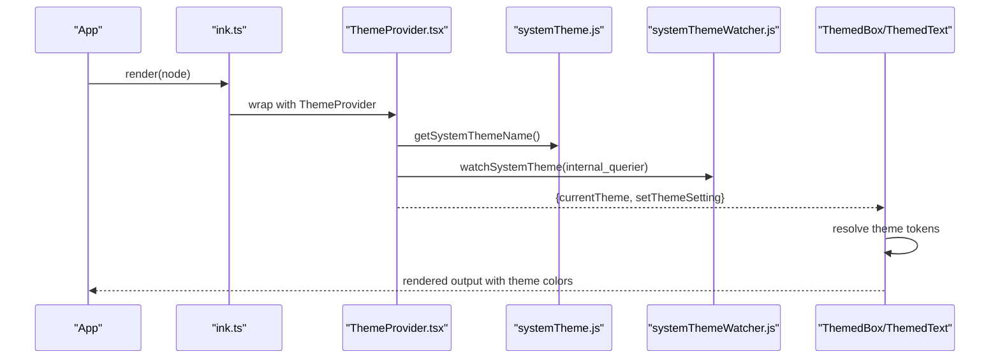
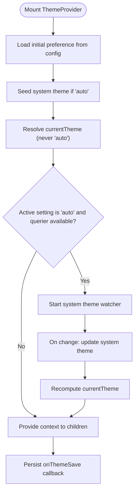
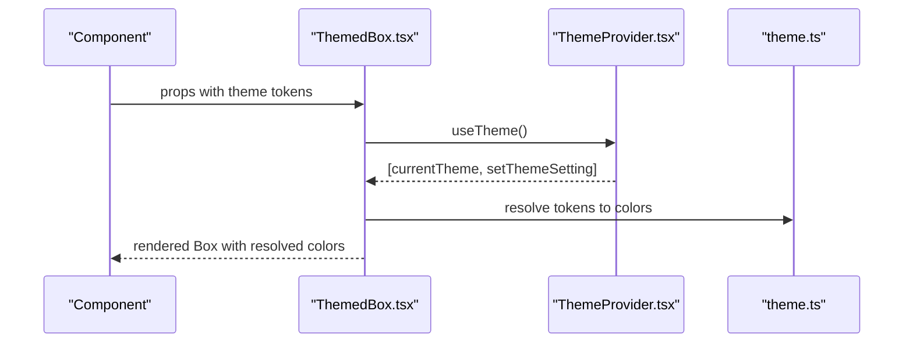
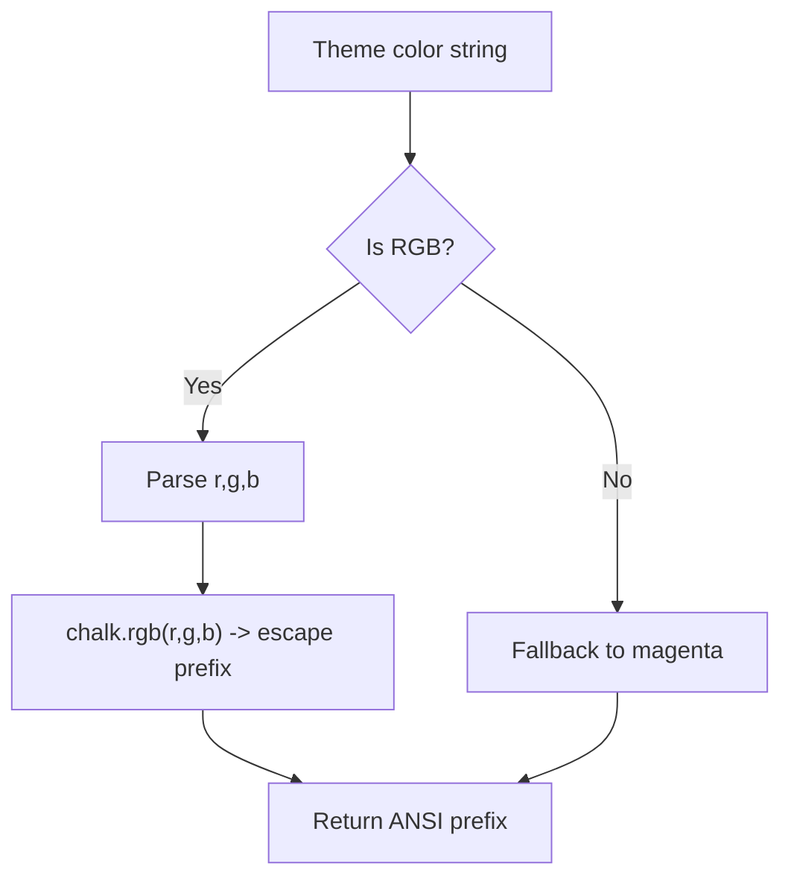
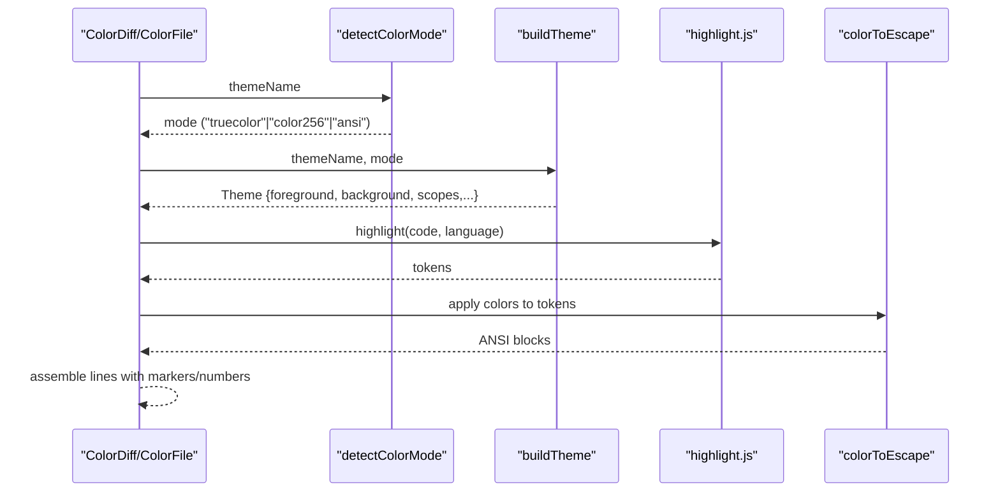
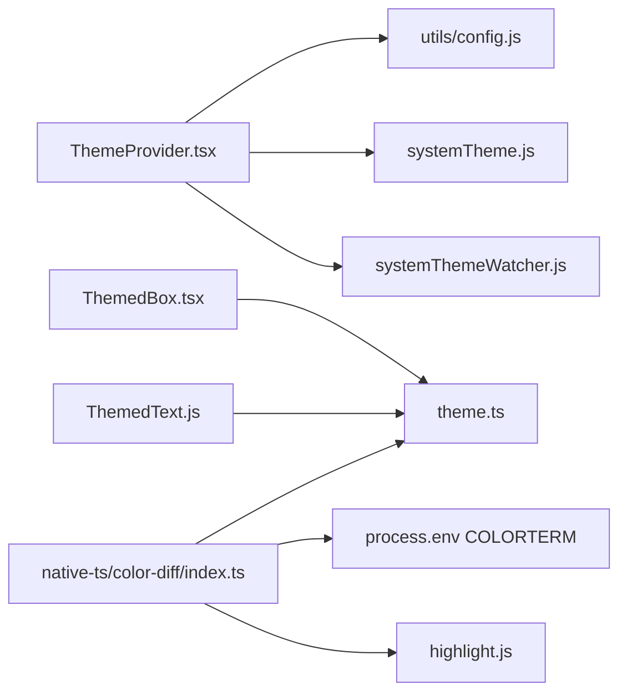

# Design System and Theming

<cite>
**Referenced Files in This Document**
- [ThemeProvider.tsx](file://src/components/design-system/ThemeProvider.tsx)
- [theme.ts](file://src/utils/theme.ts)
- [index.ts](file://src/native-ts/color-diff/index.ts)
- [ink.ts](file://src/ink.ts)
- [ThemedBox.tsx](file://src/components/design-system/ThemedBox.tsx)
- [ThemedText.tsx](file://src/components/design-system/ThemedText.js)
- [color.ts](file://src/components/design-system/color.js)
- [systemTheme.ts](file://src/utils/systemTheme.js)
- [systemThemeWatcher.ts](file://src/utils/systemThemeWatcher.js)
- [useTerminalSize.ts](file://src/hooks/useTerminalSize.ts)
- [geometry.ts](file://src/ink/layout/geometry.ts)
- [yoga.ts](file://src/native-ts/yoga-layout/index.ts)
</cite>

## Table of Contents
1. [Introduction](#introduction)
2. [Project Structure](#project-structure)
3. [Core Components](#core-components)
4. [Architecture Overview](#architecture-overview)
5. [Detailed Component Analysis](#detailed-component-analysis)
6. [Dependency Analysis](#dependency-analysis)
7. [Performance Considerations](#performance-considerations)
8. [Troubleshooting Guide](#troubleshooting-guide)
9. [Conclusion](#conclusion)
10. [Appendices](#appendices)

## Introduction
This document explains the design system and theming architecture for the terminal-based application. It covers the component library, typography system, spacing scale, and color palette; the theme provider implementation and how themes are applied throughout the app; the color system including semantic color definitions and accessibility considerations; component design patterns for reusable UI primitives and composite components; practical examples of implementing themed components; responsive design patterns for terminal interfaces; accessibility features; and customization options for themes and design tokens.

## Project Structure
The design system centers around a theme provider that supplies resolved theme tokens to UI primitives. The terminal rendering layer integrates the theme provider automatically, ensuring all themed components receive consistent styling. Syntax highlighting and diff rendering integrate with the theme system to produce ANSI-compatible output.



**Diagram sources**
- [ink.ts:12-32](file://src/ink.ts#L12-L32)
- [ThemeProvider.tsx:43-116](file://src/components/design-system/ThemeProvider.tsx#L43-L116)
- [ThemedBox.tsx:52-106](file://src/components/design-system/ThemedBox.tsx#L52-L106)
- [ThemedText.tsx](file://src/components/design-system/ThemedText.js)
- [color.ts](file://src/components/design-system/color.js)
- [theme.ts:4-89](file://src/utils/theme.ts#L4-L89)
- [systemTheme.ts](file://src/utils/systemTheme.js)
- [systemThemeWatcher.ts](file://src/utils/systemThemeWatcher.js)
- [yoga.ts:1-411](file://src/native-ts/yoga-layout/index.ts#L1-L411)
- [geometry.ts:1-61](file://src/ink/layout/geometry.ts#L1-L61)
- [index.ts:842-968](file://src/native-ts/color-diff/index.ts#L842-L968)

**Section sources**
- [ink.ts:12-32](file://src/ink.ts#L12-L32)
- [ThemeProvider.tsx:43-116](file://src/components/design-system/ThemeProvider.tsx#L43-L116)

## Core Components
- ThemeProvider: Manages theme preferences, live system theme detection, and exposes resolved theme tokens to consumers.
- ThemedBox and ThemedText: Reusable UI primitives that resolve theme tokens to concrete colors and apply layout.
- Theme definitions: Centralized semantic color tokens and theme variants (light/dark, ANSI, daltonized).
- Color utilities: Helpers to convert theme colors to ANSI for terminal output.
- Diff and syntax highlighting: Renders diffs and code with theme-aware colors and ANSI escapes.

**Section sources**
- [ThemeProvider.tsx:8-28](file://src/components/design-system/ThemeProvider.tsx#L8-L28)
- [ThemedBox.tsx:52-106](file://src/components/design-system/ThemedBox.tsx#L52-L106)
- [ThemedText.tsx](file://src/components/design-system/ThemedText.js)
- [theme.ts:4-89](file://src/utils/theme.ts#L4-L89)
- [index.ts:842-968](file://src/native-ts/color-diff/index.ts#L842-L968)

## Architecture Overview
The theme provider resolves a user’s preference (including “auto”) to a concrete theme name and exposes it via React context. UI primitives consume the resolved theme to render borders, backgrounds, and text. The terminal rendering layer wraps all renders with the theme provider so themed components work without manual wiring. Live system theme watching updates the resolved theme when the OS switches dark/light mode.



**Diagram sources**
- [ink.ts:12-32](file://src/ink.ts#L12-L32)
- [ThemeProvider.tsx:43-116](file://src/components/design-system/ThemeProvider.tsx#L43-L116)
- [systemTheme.ts](file://src/utils/systemTheme.js)
- [systemThemeWatcher.ts](file://src/utils/systemThemeWatcher.js)

## Detailed Component Analysis

### ThemeProvider
- Responsibilities:
  - Stores user theme preference (including “auto”).
  - Resolves “auto” to the current system theme or a seeded default.
  - Watches for live system theme changes and updates the resolved theme.
  - Exposes hooks to read the resolved theme and to modify preferences.
- Key behaviors:
  - Uses global configuration for initial theme and persists changes.
  - Supports a preview mode for theme picker UIs.
  - Integrates with terminal querying to detect system theme.



**Diagram sources**
- [ThemeProvider.tsx:43-116](file://src/components/design-system/ThemeProvider.tsx#L43-L116)

**Section sources**
- [ThemeProvider.tsx:43-116](file://src/components/design-system/ThemeProvider.tsx#L43-L116)

### Theme Definitions and Tokens
- Theme type: A comprehensive set of semantic color tokens covering UI states, diffs, agent colors, and TUI-specific roles.
- Variants: light, dark, light-ansi, dark-ansi, light-daltonized, dark-daltonized.
- ANSI fallback: For terminals without true color, tokens can resolve to ANSI names.
- Terminal-specific conversions: Utilities to convert theme colors to ANSI escape sequences for charts and diffs.

```mermaid
classDiagram
class Theme {
+string autoAccept
+string bashBorder
+string claude
+string claudeShimmer
+string permission
+string planMode
+string ide
+string promptBorder
+string text
+string inverseText
+string inactive
+string subtle
+string suggestion
+string remember
+string background
+string success
+string error
+string warning
+string merged
+string warningShimmer
+string diffAdded
+string diffRemoved
+string diffAddedDimmed
+string diffRemovedDimmed
+string diffAddedWord
+string diffRemovedWord
+string red_FOR_SUBAGENTS_ONLY
+string blue_FOR_SUBAGENTS_ONLY
+string green_FOR_SUBAGENTS_ONLY
+string yellow_FOR_SUBAGENTS_ONLY
+string purple_FOR_SUBAGENTS_ONLY
+string orange_FOR_SUBAGENTS_ONLY
+string pink_FOR_SUBAGENTS_ONLY
+string cyan_FOR_SUBAGENTS_ONLY
+string professionalBlue
+string chromeYellow
+string clawd_body
+string clawd_background
+string userMessageBackground
+string userMessageBackgroundHover
+string messageActionsBackground
+string selectionBg
+string bashMessageBackgroundColor
+string memoryBackgroundColor
+string rate_limit_fill
+string rate_limit_empty
+string fastMode
+string fastModeShimmer
+string briefLabelYou
+string briefLabelClaude
+string rainbow_red
+string rainbow_orange
+string rainbow_yellow
+string rainbow_green
+string rainbow_blue
+string rainbow_indigo
+string rainbow_violet
+string rainbow_red_shimmer
+string rainbow_orange_shimmer
+string rainbow_yellow_shimmer
+string rainbow_green_shimmer
+string rainbow_blue_shimmer
+string rainbow_indigo_shimmer
+string rainbow_violet_shimmer
}
class ThemeName {
<<enumeration>>
"light"
"dark"
"light-ansi"
"dark-ansi"
"light-daltonized"
"dark-daltonized"
}
class ThemeSetting {
<<enumeration>>
"auto"
"light"
"dark"
"light-ansi"
"dark-ansi"
"light-daltonized"
"dark-daltonized"
}
ThemeName --> Theme : "getTheme()"
ThemeSetting --> ThemeName : "resolved to"
```

**Diagram sources**
- [theme.ts:4-89](file://src/utils/theme.ts#L4-L89)
- [theme.ts:91-109](file://src/utils/theme.ts#L91-L109)
- [theme.ts:598-613](file://src/utils/theme.ts#L598-L613)

**Section sources**
- [theme.ts:4-89](file://src/utils/theme.ts#L4-L89)
- [theme.ts:91-109](file://src/utils/theme.ts#L91-L109)
- [theme.ts:598-613](file://src/utils/theme.ts#L598-L613)

### ThemedBox and ThemedText
- ThemedBox: Theme-aware wrapper around the base Box component. It resolves border/background tokens to concrete colors using the current theme and forwards layout props.
- ThemedText: Theme-aware wrapper around the base Text component. It resolves text and background tokens to concrete colors using the current theme.



**Diagram sources**
- [ThemedBox.tsx:52-106](file://src/components/design-system/ThemedBox.tsx#L52-L106)
- [ThemeProvider.tsx:122-138](file://src/components/design-system/ThemeProvider.tsx#L122-L138)
- [theme.ts:598-613](file://src/utils/theme.ts#L598-L613)

**Section sources**
- [ThemedBox.tsx:52-106](file://src/components/design-system/ThemedBox.tsx#L52-L106)
- [ThemedText.tsx](file://src/components/design-system/ThemedText.js)

### Color Utilities and ANSI Conversion
- themeColorToAnsi: Converts a theme color string to an ANSI escape sequence. Uses chalk with 256-color mode for Apple Terminal compatibility.
- Diff rendering: Uses theme-aware color palettes and ANSI escapes to render diffs and syntax-highlighted code.



**Diagram sources**
- [theme.ts:626-639](file://src/utils/theme.ts#L626-L639)
- [index.ts:129-145](file://src/native-ts/color-diff/index.ts#L129-L145)

**Section sources**
- [theme.ts:615-639](file://src/utils/theme.ts#L615-L639)
- [index.ts:129-145](file://src/native-ts/color-diff/index.ts#L129-L145)

### Diff and Syntax Highlighting Integration
- ColorDiff and ColorFile: Render diffs and files with theme-aware colors, syntax highlighting, and word-level diff backgrounds.
- Color mode detection: Chooses truecolor, color256, or ANSI based on environment and theme name.
- ANSI palette mapping: Uses xterm-256 palette approximation for non-truecolor terminals.



**Diagram sources**
- [index.ts:860-932](file://src/native-ts/color-diff/index.ts#L860-L932)
- [index.ts:282-362](file://src/native-ts/color-diff/index.ts#L282-L362)
- [index.ts:129-145](file://src/native-ts/color-diff/index.ts#L129-L145)

**Section sources**
- [index.ts:860-932](file://src/native-ts/color-diff/index.ts#L860-L932)
- [index.ts:282-362](file://src/native-ts/color-diff/index.ts#L282-L362)

## Dependency Analysis
- ThemeProvider depends on:
  - Global configuration for persistence.
  - System theme detection and optional watcher for live updates.
  - React context to expose theme state.
- ThemedBox/ThemedText depend on:
  - ThemeProvider for resolved theme tokens.
  - Theme definitions for semantic color mapping.
- Diff/syntax highlighting depends on:
  - Theme definitions for palettes.
  - Environment detection for color modes.
  - ANSI conversion utilities.



**Diagram sources**
- [ThemeProvider.tsx:43-116](file://src/components/design-system/ThemeProvider.tsx#L43-L116)
- [theme.ts:598-613](file://src/utils/theme.ts#L598-L613)
- [index.ts:842-968](file://src/native-ts/color-diff/index.ts#L842-L968)

**Section sources**
- [ThemeProvider.tsx:43-116](file://src/components/design-system/ThemeProvider.tsx#L43-L116)
- [theme.ts:598-613](file://src/utils/theme.ts#L598-L613)
- [index.ts:842-968](file://src/native-ts/color-diff/index.ts#L842-L968)

## Performance Considerations
- Lazy loading of highlight.js to avoid heavy initialization costs during module evaluation.
- Memoization of context values to minimize re-renders.
- Conditional watcher activation only when “auto” is selected and a terminal querier is available.
- ANSI palette approximation avoids expensive truecolor computations on constrained terminals.

[No sources needed since this section provides general guidance]

## Troubleshooting Guide
- Theme not updating on OS change:
  - Ensure the terminal querier is available and the feature flag allows watcher activation.
  - Verify system theme detection returns a valid theme name.
- ANSI rendering looks incorrect:
  - Confirm COLORTERM environment indicates truecolor or 24bit support.
  - For Apple Terminal, chalk falls back to 256-color mode; verify expected contrast.
- Diff highlights missing:
  - Check language detection for the file path and first line.
  - Verify highlight.js availability and emitter shape compatibility.

**Section sources**
- [ThemeProvider.tsx:64-80](file://src/components/design-system/ThemeProvider.tsx#L64-L80)
- [systemTheme.ts](file://src/utils/systemTheme.js)
- [index.ts:422-451](file://src/native-ts/color-diff/index.ts#L422-L451)
- [index.ts:502-534](file://src/native-ts/color-diff/index.ts#L502-L534)

## Conclusion
The design system provides a robust, theme-aware component library for terminal interfaces. Themes are centralized, highly customizable, and integrated with live system theme detection. UI primitives resolve semantic tokens to concrete colors, while diff and syntax highlighting leverage theme-aware palettes and ANSI escapes. The system balances accessibility (daltonized variants), performance (lazy loaders and memoization), and flexibility (multiple theme variants and customization hooks).

[No sources needed since this section summarizes without analyzing specific files]

## Appendices

### Typography System
- The design system relies on terminal-native text rendering. There is no separate CSS-based typography scale; text appearance is controlled via theme tokens and ANSI attributes.

[No sources needed since this section provides general guidance]

### Spacing Scale
- Spacing is handled via layout primitives and geometry utilities:
  - Uniform and partial edge definitions for margins/padding/borders.
  - Flexbox layout via a simplified yoga implementation for responsive terminal layouts.

**Section sources**
- [geometry.ts:14-61](file://src/ink/layout/geometry.ts#L14-L61)
- [yoga.ts:1-411](file://src/native-ts/yoga-layout/index.ts#L1-L411)

### Accessibility Considerations
- Dalstonized themes improve readability for color-blind users.
- Explicit RGB tokens reduce inconsistency caused by custom terminal ANSI configurations.
- Selection backgrounds and message actions backgrounds are designed to preserve readability across themes.

**Section sources**
- [theme.ts:355-434](file://src/utils/theme.ts#L355-L434)
- [theme.ts:517-596](file://src/utils/theme.ts#L517-L596)

### Responsive Design Patterns for Terminals
- Dynamic width handling in diff rendering accounts for line numbers and markers.
- Layout uses flexbox semantics adapted for terminal constraints.
- Terminal size hook enables components to adapt to viewport changes.

**Section sources**
- [index.ts:860-932](file://src/native-ts/color-diff/index.ts#L860-L932)
- [yoga.ts:1-411](file://src/native-ts/yoga-layout/index.ts#L1-L411)
- [useTerminalSize.ts](file://src/hooks/useTerminalSize.ts)

### Practical Examples: Implementing Themed Components
- Use ThemedBox and ThemedText to apply theme tokens for borders, backgrounds, and text.
- Access the resolved theme via useTheme() to conditionally style based on current theme.
- For diffs and code, rely on the color-diff module to render with theme-aware colors and ANSI escapes.

**Section sources**
- [ThemedBox.tsx:52-106](file://src/components/design-system/ThemedBox.tsx#L52-L106)
- [ThemedText.tsx](file://src/components/design-system/ThemedText.js)
- [ThemeProvider.tsx:122-138](file://src/components/design-system/ThemeProvider.tsx#L122-L138)
- [index.ts:842-968](file://src/native-ts/color-diff/index.ts#L842-L968)

### Customization Options and Creating Custom Tokens
- Extend the Theme type with new semantic tokens.
- Add a new ThemeName variant and implement getTheme() to return the new palette.
- Provide a new ANSI or daltonized variant if needed.
- Persist and restore preferences via the ThemeProvider’s save callback.

**Section sources**
- [theme.ts:4-89](file://src/utils/theme.ts#L4-L89)
- [theme.ts:91-109](file://src/utils/theme.ts#L91-L109)
- [theme.ts:598-613](file://src/utils/theme.ts#L598-L613)
- [ThemeProvider.tsx:37-42](file://src/components/design-system/ThemeProvider.tsx#L37-L42)