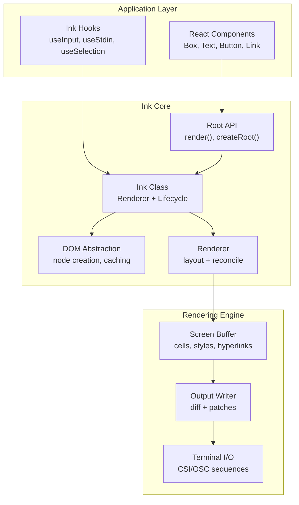
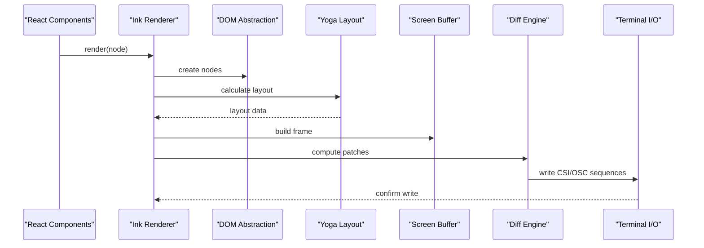
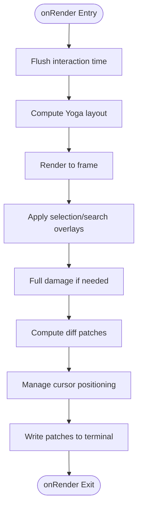
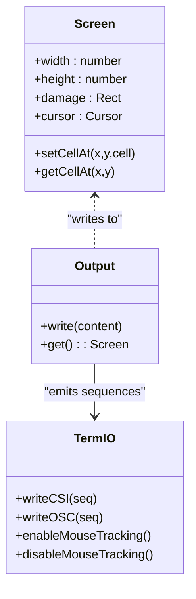
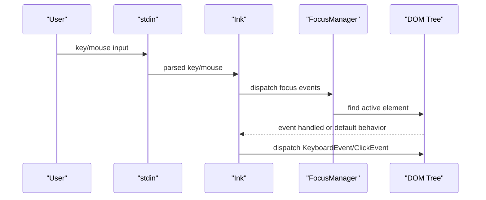
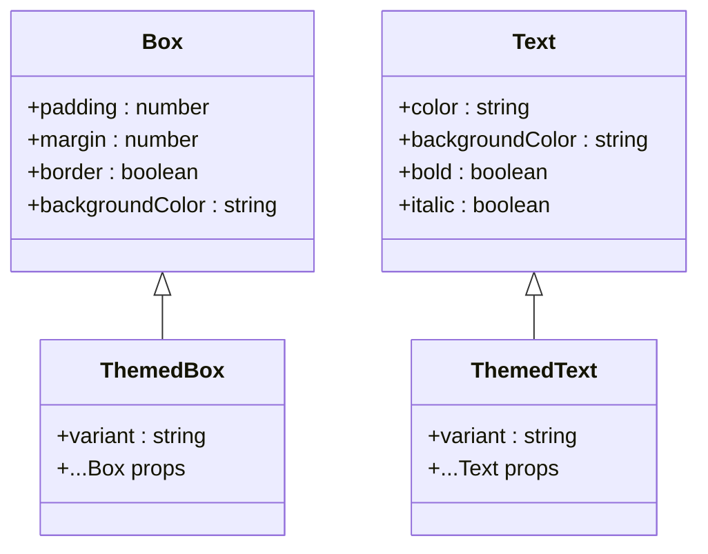
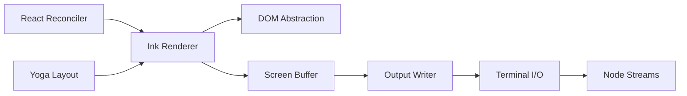

# Ink Framework Integration

<cite>
**Referenced Files in This Document**
- [ink.ts](file://claude_code_src/restored-src/src/ink.ts)
- [ink.tsx](file://claude_code_src/restored-src/src/ink/ink.tsx)
- [root.ts](file://claude_code_src/restored-src/src/ink/root.ts)
- [dom.ts](file://claude_code_src/restored-src/src/ink/dom.ts)
- [renderer.ts](file://claude_code_src/restored-src/src/ink/renderer.ts)
- [screen.ts](file://claude_code_src/restored-src/src/ink/screen.ts)
- [output.ts](file://claude_code_src/restored-src/src/ink/output.ts)
- [termio.ts](file://claude_code_src/restored-src/src/ink/termio.ts)
- [terminal.ts](file://claude_code_src/restored-src/src/ink/terminal.ts)
- [focus.ts](file://claude_code_src/restored-src/src/ink/focus.ts)
- [selection.ts](file://claude_code_src/restored-src/src/ink/selection.ts)
- [wrap-text.ts](file://claude_code_src/restored-src/src/ink/wrap-text.ts)
- [measure-element.ts](file://claude_code_src/restored-src/src/ink/measure-element.ts)
- [useTerminalSize.ts](file://claude_code_src/restored-src/src/hooks/useTerminalSize.ts)
- [useInput.ts](file://claude_code_src/restored-src/src/ink/hooks/use-input.ts)
- [useStdin.ts](file://claude_code_src/restored-src/src/ink/hooks/use-stdin.ts)
- [useSelection.ts](file://claude_code_src/restored-src/src/ink/hooks/use-selection.ts)
- [useTerminalFocus.ts](file://claude_code_src/restored-src/src/ink/hooks/use-terminal-focus.ts)
- [useTerminalViewport.ts](file://claude_code_src/restored-src/src/ink/hooks/use-terminal-viewport.ts)
- [useTerminalTitle.ts](file://claude_code_src/restored-src/src/ink/hooks/use-terminal-title.ts)
- [useTabStatus.ts](file://claude_code_src/restored-src/src/ink/hooks/use-tab-status.ts)
- [useAnimationFrame.ts](file://claude_code_src/restored-src/src/ink/hooks/use-animation-frame.ts)
- [useInterval.ts](file://claude_code_src/restored-src/src/ink/hooks/use-interval.ts)
- [Ansi.tsx](file://claude_code_src/restored-src/src/ink/Ansi.tsx)
- [Box.ts](file://claude_code_src/restored-src/src/ink/components/Box.ts)
- [Text.ts](file://claude_code_src/restored-src/src/ink/components/Text.ts)
- [Button.ts](file://claude_code_src/restored-src/src/ink/components/Button.ts)
- [Link.ts](file://claude_code_src/restored-src/src/ink/components/Link.ts)
- [Newline.ts](file://claude_code_src/restored-src/src/ink/components/Newline.ts)
- [Spacer.ts](file://claude_code_src/restored-src/src/ink/components/Spacer.ts)
- [NoSelect.ts](file://claude_code_src/restored-src/src/ink/components/NoSelect.ts)
- [RawAnsi.ts](file://claude_code_src/restored-src/src/ink/components/RawAnsi.ts)
- [ThemedBox.ts](file://claude_code_src/restored-src/src/components/design-system/ThemedBox.ts)
- [ThemedText.ts](file://claude_code_src/restored-src/src/components/design-system/ThemedText.ts)
- [ThemeProvider.ts](file://claude_code_src/restored-src/src/components/design-system/ThemeProvider.ts)
- [color.ts](file://claude_code_src/restored-src/src/components/design-system/color.ts)
</cite>

## Table of Contents
1. [Introduction](#introduction)
2. [Project Structure](#project-structure)
3. [Core Components](#core-components)
4. [Architecture Overview](#architecture-overview)
5. [Detailed Component Analysis](#detailed-component-analysis)
6. [Dependency Analysis](#dependency-analysis)
7. [Performance Considerations](#performance-considerations)
8. [Troubleshooting Guide](#troubleshooting-guide)
9. [Conclusion](#conclusion)

## Introduction
This document explains how the React-based terminal UI is implemented using the Ink framework within this Python IDE codebase. It covers the core concepts of terminal rendering, component lifecycle, input/output handling, and the Ink component system. It also documents the terminal rendering engine, cursor management, screen updates, input handling (keyboard and mouse), practical usage examples, performance considerations, and debugging techniques specific to Ink applications.

## Project Structure
The Ink integration is organized around a central renderer (`Ink` class) that bridges React components to terminal output. Key areas include:
- Core renderer and lifecycle management
- Rendering pipeline (React reconciliation → layout → diff → terminal output)
- Terminal I/O and cursor management
- Input handling (keyboard, mouse, focus)
- Component library (Box, Text, Button, Link, etc.)
- Hooks for terminal integration (useInput, useStdin, useSelection, etc.)

**Diagram sources**
- [ink.ts:18-31](file://claude_code_src/restored-src/src/ink.ts#L18-L31)
- [ink.tsx:180-279](file://claude_code_src/restored-src/src/ink/ink.tsx#L180-L279)
- [root.ts](file://claude_code_src/restored-src/src/ink/root.ts)
- [dom.ts](file://claude_code_src/restored-src/src/ink/dom.ts)
- [renderer.ts](file://claude_code_src/restored-src/src/ink/renderer.ts)
- [screen.ts](file://claude_code_src/restored-src/src/ink/screen.ts)
- [output.ts](file://claude_code_src/restored-src/src/ink/output.ts)
- [termio.ts](file://claude_code_src/restored-src/src/ink/termio.ts)

**Section sources**
- [ink.ts:1-86](file://claude_code_src/restored-src/src/ink.ts#L1-L86)
- [ink.tsx:1-1723](file://claude_code_src/restored-src/src/ink/ink.tsx#L1-L1723)

## Core Components
- Ink class: Central renderer managing React reconciliation, layout calculation, frame generation, diff computation, and terminal output. Handles resize, pause/resume, alternate screen transitions, and cleanup.
- Root API: Provides render() and createRoot() with ThemeProvider wrapping for design system compatibility.
- DOM abstraction: Lightweight DOM-like nodes for layout and hit-testing.
- Renderer: Bridges React reconciler to Ink's layout and screen rendering.
- Screen buffer: Efficient character/hyperlink/style storage with damage tracking.
- Output writer: Computes minimal terminal patches and applies cursor management.
- Terminal I/O: Writes ANSI control sequences (CSI/DEC/OSC) and manages terminal modes.

**Section sources**
- [ink.ts:18-31](file://claude_code_src/restored-src/src/ink.ts#L18-L31)
- [ink.tsx:76-1723](file://claude_code_src/restored-src/src/ink/ink.tsx#L76-L1723)
- [dom.ts](file://claude_code_src/restored-src/src/ink/dom.ts)
- [renderer.ts](file://claude_code_src/restored-src/src/ink/renderer.ts)
- [screen.ts](file://claude_code_src/restored-src/src/ink/screen.ts)
- [output.ts](file://claude_code_src/restored-src/src/ink/output.ts)
- [termio.ts](file://claude_code_src/restored-src/src/ink/termio.ts)

## Architecture Overview
The Ink architecture follows a React reconciliation-first pipeline:
1. React components render to Ink's DOM abstraction.
2. Yoga layout computes positions and sizes.
3. Ink renderer produces a frame with screen buffer updates.
4. Diff engine computes minimal terminal patches.
5. Cursor management ensures correct positioning for input and accessibility.
6. Terminal sequences are written to stdout/stderr.

**Diagram sources**
- [ink.tsx:420-789](file://claude_code_src/restored-src/src/ink/ink.tsx#L420-L789)
- [renderer.ts](file://claude_code_src/restored-src/src/ink/renderer.ts)
- [screen.ts](file://claude_code_src/restored-src/src/ink/screen.ts)
- [output.ts](file://claude_code_src/restored-src/src/ink/output.ts)
- [termio.ts](file://claude_code_src/restored-src/src/ink/termio.ts)

## Detailed Component Analysis

### Ink Renderer Lifecycle
The Ink class orchestrates rendering, layout, diffing, and output:
- React reconciliation via a custom container and dispatcher.
- Yoga layout calculation synchronized with React's commit phase.
- Frame generation with damage tracking and full-screen vs alternate-screen handling.
- Optimized patch computation and cursor management.
- Terminal mode reassertion and cleanup on exit.

**Diagram sources**
- [ink.tsx:420-789](file://claude_code_src/restored-src/src/ink/ink.tsx#L420-L789)

**Section sources**
- [ink.tsx:180-279](file://claude_code_src/restored-src/src/ink/ink.tsx#L180-L279)
- [ink.tsx:420-789](file://claude_code_src/restored-src/src/ink/ink.tsx#L420-L789)

### Terminal Rendering Engine
- Screen buffer: Stores characters, styles, hyperlinks, and maintains damage regions.
- Output writer: Converts frames to minimal terminal patches, applying cursor moves and absolute positioning.
- Terminal I/O: Manages CSI sequences (cursor moves, home, erase), DEC private modes, and OSC sequences (clipboard, tab status).

**Diagram sources**
- [screen.ts](file://claude_code_src/restored-src/src/ink/screen.ts)
- [output.ts](file://claude_code_src/restored-src/src/ink/output.ts)
- [termio.ts](file://claude_code_src/restored-src/src/ink/termio.ts)

**Section sources**
- [screen.ts](file://claude_code_src/restored-src/src/ink/screen.ts)
- [output.ts](file://claude_code_src/restored-src/src/ink/output.ts)
- [termio.ts](file://claude_code_src/restored-src/src/ink/termio.ts)

### Input Handling System
- Keyboard events: Parsed key sequences mapped to React events, with tab cycling as default behavior.
- Mouse interactions: Hover tracking, click bubbling, and multi-click selection (word/line).
- Focus management: Active element tracking and focus cycling.
- Stdin handling: Raw mode toggling, stdin suspension/resumption for external editors.

**Diagram sources**
- [ink.tsx:1269-1283](file://claude_code_src/restored-src/src/ink/ink.tsx#L1269-L1283)
- [focus.ts](file://claude_code_src/restored-src/src/ink/focus.ts)
- [dom.ts](file://claude_code_src/restored-src/src/ink/dom.ts)

**Section sources**
- [ink.tsx:1269-1283](file://claude_code_src/restored-src/src/ink/ink.tsx#L1269-L1283)
- [focus.ts](file://claude_code_src/restored-src/src/ink/focus.ts)
- [selection.ts](file://claude_code_src/restored-src/src/ink/selection.ts)

### Ink Component System
Ink provides terminal-native components and design system wrappers:
- Base components: Box, Text, Button, Link, Newline, Spacer, NoSelect, RawAnsi, Ansi.
- Design system wrappers: ThemedBox, ThemedText, ThemeProvider.
- Hooks: useInput, useStdin, useSelection, useTerminalFocus, useTerminalViewport, useTerminalTitle, useTabStatus, useAnimationFrame, useInterval.

**Diagram sources**
- [Box.ts](file://claude_code_src/restored-src/src/ink/components/Box.ts)
- [Text.ts](file://claude_code_src/restored-src/src/ink/components/Text.ts)
- [ThemedBox.ts](file://claude_code_src/restored-src/src/components/design-system/ThemedBox.ts)
- [ThemedText.ts](file://claude_code_src/restored-src/src/components/design-system/ThemedText.ts)

**Section sources**
- [ink.ts:46-85](file://claude_code_src/restored-src/src/ink.ts#L46-L85)
- [Box.ts](file://claude_code_src/restored-src/src/ink/components/Box.ts)
- [Text.ts](file://claude_code_src/restored-src/src/ink/components/Text.ts)
- [ThemedBox.ts](file://claude_code_src/restored-src/src/components/design-system/ThemedBox.ts)
- [ThemedText.ts](file://claude_code_src/restored-src/src/components/design-system/ThemedText.ts)
- [Ansi.tsx](file://claude_code_src/restored-src/src/ink/Ansi.tsx)

### Practical Examples
- Creating interactive terminal interfaces:
  - Use Box and Text for layout and typography.
  - Use Button and Link for clickable elements.
  - Use useInput/useStdin for capturing user input.
  - Use useSelection for copy-on-select and search highlighting.
  - Use useTerminalViewport/useTerminalFocus for responsive layouts and focus awareness.

**Section sources**
- [useInput.ts](file://claude_code_src/restored-src/src/ink/hooks/use-input.ts)
- [useStdin.ts](file://claude_code_src/restored-src/src/ink/hooks/use-stdin.ts)
- [useSelection.ts](file://claude_code_src/restored-src/src/ink/hooks/use-selection.ts)
- [useTerminalViewport.ts](file://claude_code_src/restored-src/src/ink/hooks/use-terminal-viewport.ts)
- [useTerminalFocus.ts](file://claude_code_src/restored-src/src/ink/hooks/use-terminal-focus.ts)

## Dependency Analysis
The Ink integration depends on:
- React reconciler for rendering orchestration.
- Yoga layout for flexbox-based positioning.
- Terminal control sequences for cursor and screen management.
- Node streams for stdin/stdout/stderr handling.

**Diagram sources**
- [ink.tsx:260-269](file://claude_code_src/restored-src/src/ink/ink.tsx#L260-L269)
- [renderer.ts](file://claude_code_src/restored-src/src/ink/renderer.ts)
- [screen.ts](file://claude_code_src/restored-src/src/ink/screen.ts)
- [output.ts](file://claude_code_src/restored-src/src/ink/output.ts)
- [termio.ts](file://claude_code_src/restored-src/src/ink/termio.ts)

**Section sources**
- [ink.tsx:1-1723](file://claude_code_src/restored-src/src/ink/ink.tsx#L1-L1723)

## Performance Considerations
- Frame throttling: Uses a throttle to batch rendering and avoid excessive commits.
- Damage tracking: Full-damage fallback for layout shifts, selection overlays, and contaminated frames.
- Pool management: Character and hyperlink pools are periodically reset to prevent unbounded growth.
- Cursor management: Minimizes cursor moves by anchoring to (0,0) in alternate screen and using relative moves when possible.
- Resize handling: Atomic erase+paint during resize to avoid flicker.
- Yoga counters: Tracks layout performance to identify hotspots.

**Section sources**
- [ink.tsx:212-216](file://claude_code_src/restored-src/src/ink/ink.tsx#L212-L216)
- [ink.tsx:597-603](file://claude_code_src/restored-src/src/ink/ink.tsx#L597-L603)
- [ink.tsx:554-566](file://claude_code_src/restored-src/src/ink/ink.tsx#L554-L566)
- [ink.tsx:309-346](file://claude_code_src/restored-src/src/ink/ink.tsx#L309-L346)

## Troubleshooting Guide
- Debugging terminal output:
  - Use `forceRedraw()` to clear and repaint the screen when external processes corrupt the buffer.
  - Enable debug repaints to log repaint reasons and owner chains.
- Inspecting components:
  - Use `scanElementSubtree()` to paint a DOM subtree to a fresh screen and scan for query matches.
  - Use `useTerminalSize()` hook to verify terminal dimensions.
- Input issues:
  - Ensure stdin is not being consumed by external editors; use `suspendStdin()`/`resumeStdin()` during editor handoffs.
  - Verify terminal modes are reasserted after stdin gaps or sleep/wake cycles.
- Selection and search:
  - Use `setSearchHighlight()` and `setSearchPositions()` for search highlighting.
  - Use `copySelection()` or `copySelectionNoClear()` to copy selections to clipboard.

**Section sources**
- [ink.tsx:825-838](file://claude_code_src/restored-src/src/ink/ink.tsx#L825-L838)
- [ink.tsx:1061-1115](file://claude_code_src/restored-src/src/ink/ink.tsx#L1061-L1115)
- [useTerminalSize.ts:1-15](file://claude_code_src/restored-src/src/hooks/useTerminalSize.ts#L1-L15)
- [ink.tsx:1360-1427](file://claude_code_src/restored-src/src/ink/ink.tsx#L1360-L1427)
- [ink.tsx:1055-1059](file://claude_code_src/restored-src/src/ink/ink.tsx#L1055-L1059)

## Conclusion
The Ink framework integration in this codebase provides a robust, high-performance terminal UI layer built on React. It offers precise control over rendering, layout, input, and terminal I/O, enabling interactive command-line experiences with modern React development patterns. The architecture emphasizes efficient diffing, cursor management, and terminal mode handling, while the component and hook APIs simplify building accessible, responsive terminal interfaces.