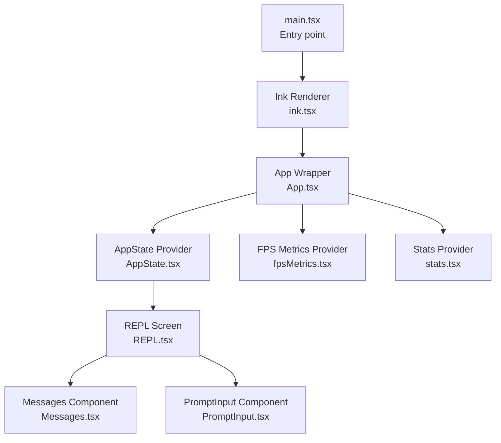
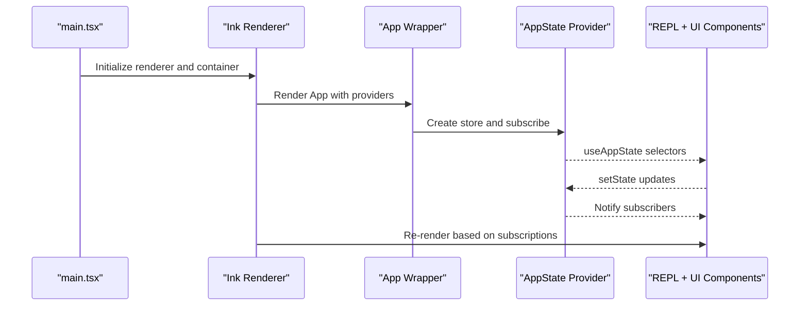
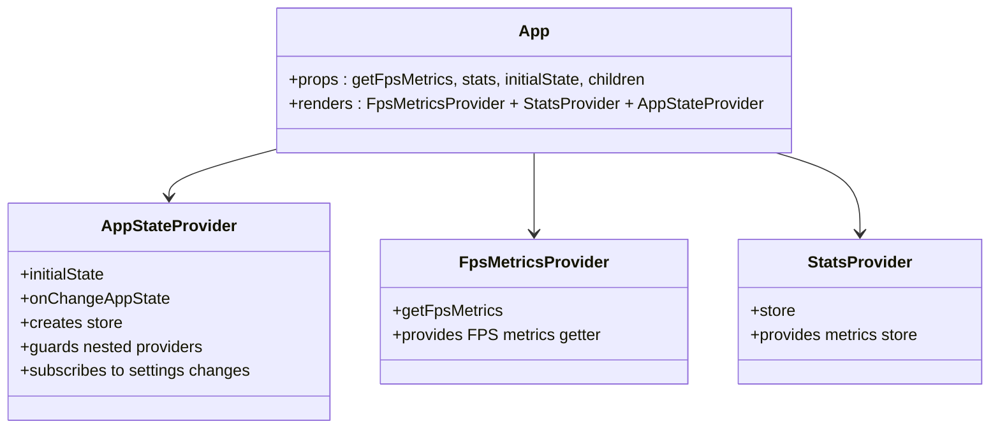
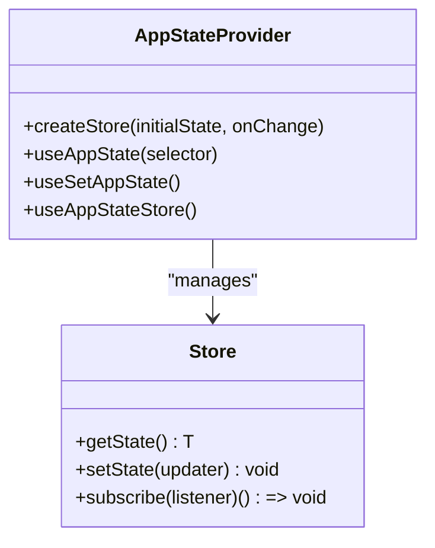
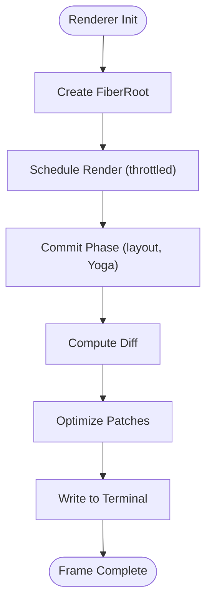
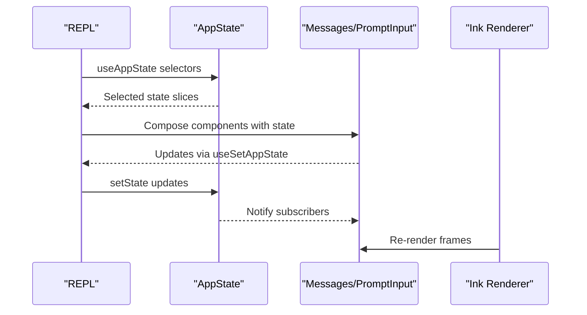
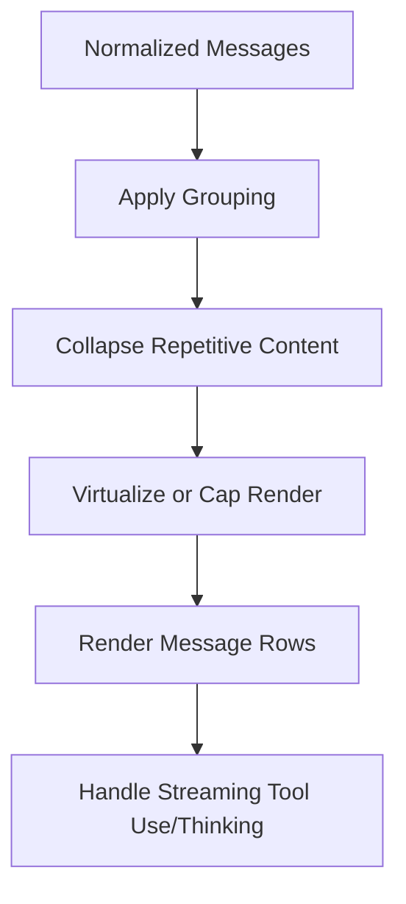
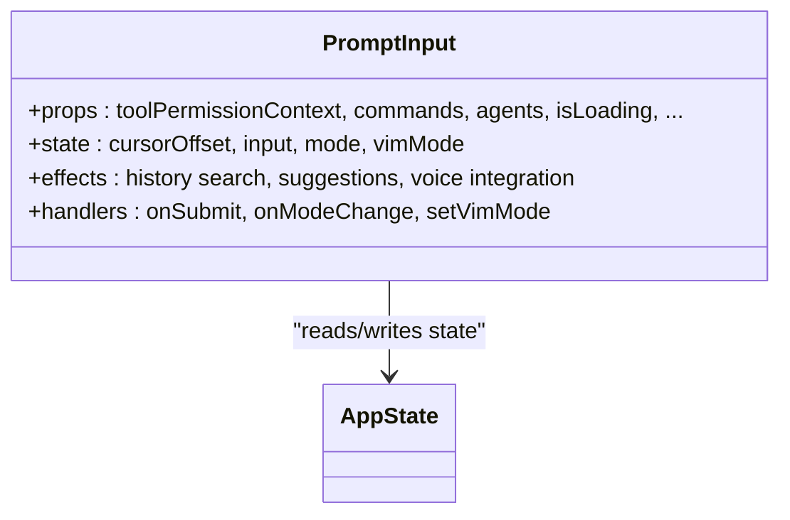
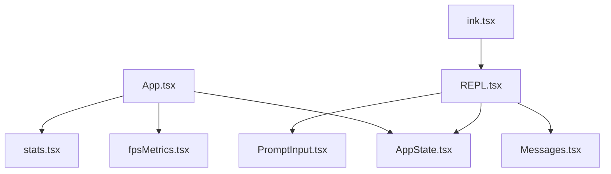

# React Component Architecture

<cite>
**Referenced Files in This Document**
- [App.tsx](file://src/components/App.tsx)
- [AppState.tsx](file://src/state/AppState.tsx)
- [store.ts](file://src/state/store.ts)
- [main.tsx](file://src/main.tsx)
- [ink.tsx](file://src/ink/ink.tsx)
- [REPL.tsx](file://src/screens/REPL.tsx)
- [fpsMetrics.tsx](file://src/context/fpsMetrics.tsx)
- [stats.tsx](file://src/context/stats.tsx)
- [PromptInput.tsx](file://src/components/PromptInput/PromptInput.tsx)
- [Messages.tsx](file://src/components/Messages.tsx)
</cite>

## Table of Contents
1. [Introduction](#introduction)
2. [Project Structure](#project-structure)
3. [Core Components](#core-components)
4. [Architecture Overview](#architecture-overview)
5. [Detailed Component Analysis](#detailed-component-analysis)
6. [Dependency Analysis](#dependency-analysis)
7. [Performance Considerations](#performance-considerations)
8. [Troubleshooting Guide](#troubleshooting-guide)
9. [Conclusion](#conclusion)

## Introduction
This document explains the React component architecture for the terminal-based application, focusing on the component hierarchy, state integration, and lifecycle management. It details how the App wrapper component integrates with the application state system, how components compose and manage props, and how state is synchronized across the UI. It also covers terminal-specific rendering, performance optimization strategies, memory management, and testing/debugging approaches tailored for terminal environments.

## Project Structure
The application follows a layered architecture:
- Entry point initializes the environment and bootstraps the REPL.
- The Ink renderer manages terminal rendering and reconciliation.
- The App wrapper component provides global context providers for FPS metrics, statistics, and application state.
- The REPL orchestrates the interactive terminal session, consuming state from AppState and rendering UI components like Messages and PromptInput.

**Diagram sources**
- [main.tsx](file://src/main.tsx)
- [ink.tsx](file://src/ink/ink.tsx)
- [App.tsx](file://src/components/App.tsx)
- [AppState.tsx](file://src/state/AppState.tsx)
- [fpsMetrics.tsx](file://src/context/fpsMetrics.tsx)
- [stats.tsx](file://src/context/stats.tsx)
- [REPL.tsx](file://src/screens/REPL.tsx)
- [Messages.tsx](file://src/components/Messages.tsx)
- [PromptInput.tsx](file://src/components/PromptInput/PromptInput.tsx)

**Section sources**
- [main.tsx](file://src/main.tsx)
- [ink.tsx](file://src/ink/ink.tsx)
- [App.tsx](file://src/components/App.tsx)

## Core Components
- App wrapper: Provides FPS metrics, stats, and AppState context to the component tree.
- AppState provider: Creates and manages a centralized store, exposes hooks for reading and updating state, and wires settings changes.
- Store abstraction: Lightweight pub/sub store with subscription and change notifications.
- Ink renderer: Manages React reconciliation, layout, and terminal output, handling resize, alternate screen, and cursor management.
- REPL: Orchestrates the interactive terminal session, managing loading states, tool use, streaming, and UI composition.
- Messages: Renders conversation history with virtualization, grouping, and search capabilities.
- PromptInput: Handles user input, command suggestions, permission context, and footer navigation.

**Section sources**
- [App.tsx](file://src/components/App.tsx)
- [AppState.tsx](file://src/state/AppState.tsx)
- [store.ts](file://src/state/store.ts)
- [ink.tsx](file://src/ink/ink.tsx)
- [REPL.tsx](file://src/screens/REPL.tsx)
- [Messages.tsx](file://src/components/Messages.tsx)
- [PromptInput.tsx](file://src/components/PromptInput/PromptInput.tsx)

## Architecture Overview
The component architecture centers on a top-level App wrapper that injects three providers:
- AppStateProvider: Supplies a centralized store and selectors for reactive UI updates.
- FpsMetricsProvider: Exposes FPS metrics retrieval to components that need performance insights.
- StatsProvider: Provides a metrics store for counters, gauges, timers, and sets.

The Ink renderer drives terminal rendering, scheduling commits, computing layouts, and diffing frames to minimize terminal writes. The REPL composes UI components and subscribes to AppState for dynamic behavior.

**Diagram sources**
- [main.tsx](file://src/main.tsx)
- [ink.tsx](file://src/ink/ink.tsx)
- [App.tsx](file://src/components/App.tsx)
- [AppState.tsx](file://src/state/AppState.tsx)

## Detailed Component Analysis

### App Wrapper Component
The App wrapper composes three providers:
- AppStateProvider: Creates a store from initial state and onChange callback, guards against nested providers, and wires settings changes.
- FpsMetricsProvider: Supplies a getter for FPS metrics to descendant components.
- StatsProvider: Provides a metrics store for counters, gauges, timers, and sets.

Composition strategy:
- Uses memoization to avoid re-rendering when props are unchanged.
- Ensures provider ordering to maintain correct context scoping.

**Diagram sources**
- [App.tsx](file://src/components/App.tsx)
- [AppState.tsx](file://src/state/AppState.tsx)
- [fpsMetrics.tsx](file://src/context/fpsMetrics.tsx)
- [stats.tsx](file://src/context/stats.tsx)

**Section sources**
- [App.tsx](file://src/components/App.tsx)
- [AppState.tsx](file://src/state/AppState.tsx)
- [fpsMetrics.tsx](file://src/context/fpsMetrics.tsx)
- [stats.tsx](file://src/context/stats.tsx)

### AppState and Store Integration
AppStateProvider creates a store using a factory and exposes:
- useAppState: Selects a slice of state and subscribes via useSyncExternalStore.
- useSetAppState: Returns a stable setState reference for non-reactive updates.
- useAppStateStore: Returns the store directly for interop with non-React code.

The store abstraction provides:
- getState: Current state snapshot.
- setState: Applies updater and notifies listeners.
- subscribe: Adds a listener and returns an unsubscribe function.

**Diagram sources**
- [AppState.tsx](file://src/state/AppState.tsx)
- [store.ts](file://src/state/store.ts)

**Section sources**
- [AppState.tsx](file://src/state/AppState.tsx)
- [store.ts](file://src/state/store.ts)

### Ink Renderer and Terminal Rendering
The Ink renderer:
- Manages a FiberRoot and schedules renders with throttling.
- Computes Yoga layout during commit phase and diffs frames for minimal terminal writes.
- Handles resize, alternate screen entry/exit, cursor parking, and selection overlays.
- Integrates with terminal capabilities for hyperlinks, mouse tracking, and tab status.

**Diagram sources**
- [ink.tsx](file://src/ink/ink.tsx)

**Section sources**
- [ink.tsx](file://src/ink/ink.tsx)

### REPL Component Composition
The REPL orchestrates:
- Subscriptions to AppState for tool permissions, MCP, plugins, tasks, and UI state.
- Streaming tool use and thinking updates.
- Loading states and external operations (remote sessions, background tasks).
- UI composition with Messages and PromptInput, integrating with Ink’s alternate screen and focus management.

**Diagram sources**
- [REPL.tsx](file://src/screens/REPL.tsx)
- [AppState.tsx](file://src/state/AppState.tsx)
- [Messages.tsx](file://src/components/Messages.tsx)
- [PromptInput.tsx](file://src/components/PromptInput/PromptInput.tsx)
- [ink.tsx](file://src/ink/ink.tsx)

**Section sources**
- [REPL.tsx](file://src/screens/REPL.tsx)
- [AppState.tsx](file://src/state/AppState.tsx)
- [Messages.tsx](file://src/components/Messages.tsx)
- [PromptInput.tsx](file://src/components/PromptInput/PromptInput.tsx)
- [ink.tsx](file://src/ink/ink.tsx)

### Messages Component
The Messages component:
- Normalizes and groups messages, collapses repetitive content, and applies search indexing.
- Supports virtualization for large histories and a capped render path for non-virtualized modes.
- Renders streaming tool use and thinking content, with expandable rows and divider insertion for unseen messages.

**Diagram sources**
- [Messages.tsx](file://src/components/Messages.tsx)

**Section sources**
- [Messages.tsx](file://src/components/Messages.tsx)

### PromptInput Component
PromptInput integrates:
- Tool permission context and footer pill navigation.
- Command suggestions, history search, and typeahead highlighting.
- Voice integration and clipboard image handling.
- Submission helpers and agent task integration.

**Diagram sources**
- [PromptInput.tsx](file://src/components/PromptInput/PromptInput.tsx)
- [AppState.tsx](file://src/state/AppState.tsx)

**Section sources**
- [PromptInput.tsx](file://src/components/PromptInput/PromptInput.tsx)
- [AppState.tsx](file://src/state/AppState.tsx)

## Dependency Analysis
Key dependencies and relationships:
- App depends on AppStateProvider, FpsMetricsProvider, and StatsProvider.
- REPL depends on AppState hooks and renders Messages and PromptInput.
- Ink renderer depends on React reconciler and manages DOM nodes and terminal IO.
- Messages and PromptInput depend on AppState for dynamic behavior and UI state.

**Diagram sources**
- [App.tsx](file://src/components/App.tsx)
- [AppState.tsx](file://src/state/AppState.tsx)
- [fpsMetrics.tsx](file://src/context/fpsMetrics.tsx)
- [stats.tsx](file://src/context/stats.tsx)
- [REPL.tsx](file://src/screens/REPL.tsx)
- [Messages.tsx](file://src/components/Messages.tsx)
- [PromptInput.tsx](file://src/components/PromptInput/PromptInput.tsx)
- [ink.tsx](file://src/ink/ink.tsx)

**Section sources**
- [App.tsx](file://src/components/App.tsx)
- [AppState.tsx](file://src/state/AppState.tsx)
- [REPL.tsx](file://src/screens/REPL.tsx)
- [Messages.tsx](file://src/components/Messages.tsx)
- [PromptInput.tsx](file://src/components/PromptInput/PromptInput.tsx)
- [ink.tsx](file://src/ink/ink.tsx)

## Performance Considerations
- Reactive state updates: useAppState leverages useSyncExternalStore to subscribe to state slices, minimizing re-renders by only notifying when selected values change.
- Memoization: React.memo on Messages and memo caches in providers prevent unnecessary renders.
- Virtualization: VirtualMessageList and capped render path limit memory and CPU usage for large histories.
- Throttled rendering: Ink renderer throttles render scheduling to balance throughput and responsiveness.
- Cursor and diff optimization: Cursor parking, anchor cursor for alternate screen, and optimized patch generation reduce terminal writes.
- Pool resets: Character and hyperlink pools are periodically reset to prevent unbounded growth during long sessions.

[No sources needed since this section provides general guidance]

## Troubleshooting Guide
Common issues and debugging strategies:
- AppStateProvider nesting: Ensure AppStateProvider is not nested; the component throws if detected.
- FPS metrics availability: Verify FpsMetricsProvider supplies a getter; useFpsMetrics returns undefined if not available.
- Stats store usage: Confirm StatsProvider wraps the component tree; useStats throws if used outside the provider.
- REPL lifecycle: Use useEffect logs for mount/unmount diagnostics; watch for unexpected state resets.
- Ink renderer anomalies: Check for alternate screen transitions, cursor drift, and resize handling; ensure mouse tracking and focus reporting are configured correctly.
- Component re-renders: Inspect memoization and selector equality; prefer stable references for props that should not trigger updates.

**Section sources**
- [AppState.tsx](file://src/state/AppState.tsx)
- [fpsMetrics.tsx](file://src/context/fpsMetrics.tsx)
- [stats.tsx](file://src/context/stats.tsx)
- [REPL.tsx](file://src/screens/REPL.tsx)
- [ink.tsx](file://src/ink/ink.tsx)

## Conclusion
The React component architecture combines a top-level App wrapper with AppState-driven UI, Ink-based terminal rendering, and carefully composed components like REPL, Messages, and PromptInput. The system emphasizes reactive state subscriptions, efficient rendering strategies, and terminal-specific optimizations to deliver responsive and reliable terminal experiences.