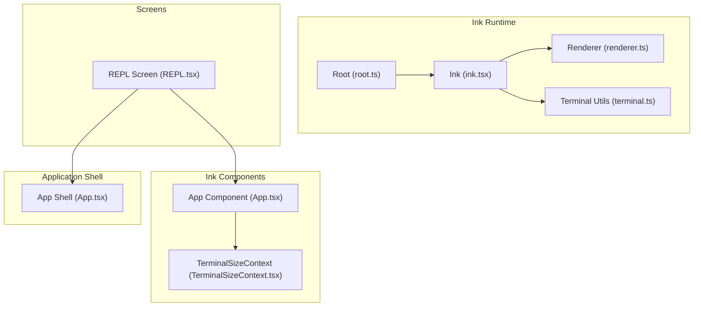
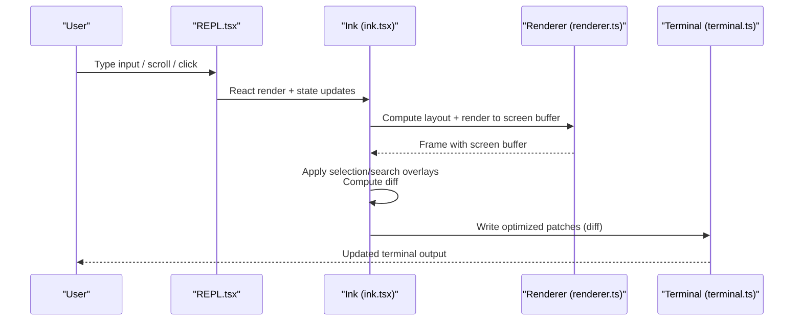
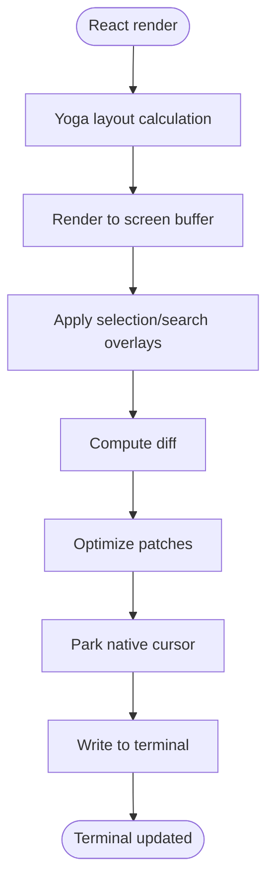
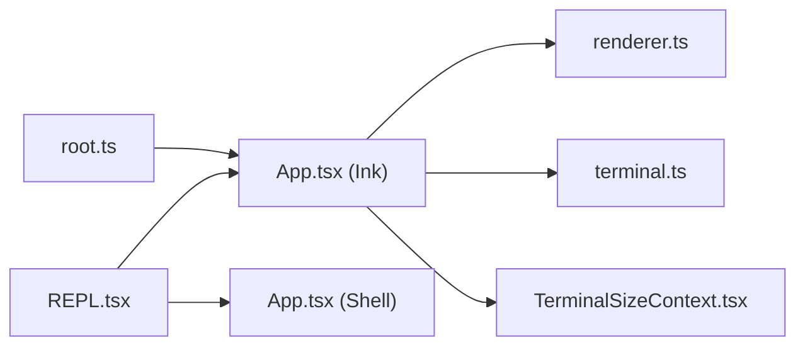

# UI Architecture and Components

<cite>
**Referenced Files in This Document**
- [ink.tsx](file://src/ink/ink.tsx)
- [renderer.ts](file://src/ink/renderer.ts)
- [root.ts](file://src/ink/root.ts)
- [terminal.ts](file://src/ink/terminal.ts)
- [App.tsx](file://src/ink/components/App.tsx)
- [REPL.tsx](file://src/screens/REPL.tsx)
- [useTerminalSize.ts](file://src/hooks/useTerminalSize.ts)
- [TerminalSizeContext.tsx](file://src/ink/components/TerminalSizeContext.tsx)
- [App.tsx](file://src/components/App.tsx)
</cite>

## Table of Contents
1. [Introduction](#introduction)
2. [Project Structure](#project-structure)
3. [Core Components](#core-components)
4. [Architecture Overview](#architecture-overview)
5. [Detailed Component Analysis](#detailed-component-analysis)
6. [Dependency Analysis](#dependency-analysis)
7. [Performance Considerations](#performance-considerations)
8. [Troubleshooting Guide](#troubleshooting-guide)
9. [Conclusion](#conclusion)

## Introduction
This document explains the UI architecture and components of the Claude Code Python IDE’s React-based terminal interface. It focuses on the Ink framework integration, component hierarchy, terminal UI patterns, and how the system composes React components, manages state, and integrates with terminal-specific features such as cursor management, input handling, and output formatting. It also covers theming, responsive design, accessibility, and performance characteristics tailored for terminal rendering.

## Project Structure
The terminal UI is built around a layered architecture:
- Ink runtime: a React renderer specialized for terminal environments, responsible for layout, diffing, and writing to the terminal.
- Ink components: terminal-focused primitives (e.g., alternate screen, focus, sizing, selection, search highlighting).
- Application shell: top-level providers for state, stats, and FPS metrics.
- Screens: high-level interactive screens (e.g., REPL) that compose Ink components and application logic.

**Diagram sources**
- [ink.tsx](file://src/ink/ink.tsx)
- [renderer.ts](file://src/ink/renderer.ts)
- [root.ts](file://src/ink/root.ts)
- [terminal.ts](file://src/ink/terminal.ts)
- [App.tsx](file://src/ink/components/App.tsx)
- [TerminalSizeContext.tsx](file://src/ink/components/TerminalSizeContext.tsx)
- [App.tsx](file://src/components/App.tsx)
- [REPL.tsx](file://src/screens/REPL.tsx)

**Section sources**
- [ink.tsx](file://src/ink/ink.tsx)
- [renderer.ts](file://src/ink/renderer.ts)
- [root.ts](file://src/ink/root.ts)
- [terminal.ts](file://src/ink/terminal.ts)
- [App.tsx](file://src/ink/components/App.tsx)
- [TerminalSizeContext.tsx](file://src/ink/components/TerminalSizeContext.tsx)
- [App.tsx](file://src/components/App.tsx)
- [REPL.tsx](file://src/screens/REPL.tsx)

## Core Components
- Ink runtime: orchestrates rendering, layout, diffing, and terminal writes. It maintains front/back frames, selection/highlight overlays, cursor parking, and synchronized output support.
- Renderer: converts the React tree into a terminal screen buffer using Yoga layout, then produces a diff for efficient terminal updates.
- Root: creates and manages Ink instances, supports re-rendering and unmounting, and exposes lifecycle hooks.
- Terminal utilities: detect terminal capabilities (progress reporting, synchronized output), manage cursor movement, and write optimized patches to stdout/stderr.
- App component: wires stdin/stdout contexts, raw mode, extended key reporting, mouse selection, hyperlink handling, and focus management.
- REPL screen: the primary interactive screen that composes Ink components, manages state, and coordinates terminal features like alternate screen, search, and selection.

**Section sources**
- [ink.tsx](file://src/ink/ink.tsx)
- [renderer.ts](file://src/ink/renderer.ts)
- [root.ts](file://src/ink/root.ts)
- [terminal.ts](file://src/ink/terminal.ts)
- [App.tsx](file://src/ink/components/App.tsx)
- [REPL.tsx](file://src/screens/REPL.tsx)

## Architecture Overview
The system separates concerns across layers:
- Rendering pipeline: React tree → Yoga layout → screen buffer → diff → terminal write.
- Input pipeline: stdin raw mode → key parser → DOM events + Ink state updates → re-render.
- Alternate screen and focus: Ink manages alternate screen transitions, cursor parking, and focus reporting.
- Capability detection: terminal.ts detects features like synchronized output and progress reporting to optimize rendering.

**Diagram sources**
- [REPL.tsx](file://src/screens/REPL.tsx)
- [ink.tsx](file://src/ink/ink.tsx)
- [renderer.ts](file://src/ink/renderer.ts)
- [terminal.ts](file://src/ink/terminal.ts)

## Detailed Component Analysis

### Ink Runtime and Rendering Pipeline
The Ink runtime coordinates rendering and terminal output:
- Maintains front/back frames and applies overlays (selection, search).
- Computes diffs and optimizes writes using synchronized output when supported.
- Parks the native cursor at the declared caret position for IME and accessibility.
- Handles alternate screen transitions, SIGCONT resumption, and resize events.

**Diagram sources**
- [ink.tsx](file://src/ink/ink.tsx)
- [renderer.ts](file://src/ink/renderer.ts)

**Section sources**
- [ink.tsx](file://src/ink/ink.tsx)
- [renderer.ts](file://src/ink/renderer.ts)

### Renderer and Frame Management
The renderer:
- Creates or reuses an Output instance to persist character caches across frames.
- Produces a Frame with screen buffer, viewport, and cursor position.
- Resets layout-shifted and scroll hints, and marks subtrees dirty for efficient blitting.

**Section sources**
- [renderer.ts](file://src/ink/renderer.ts)

### Root and Instance Lifecycle
Root provides:
- Managed Ink instances with re-render and unmount APIs.
- Registration in an instances map for external integrations.
- Support for onFrame callbacks to monitor render performance.

**Section sources**
- [root.ts](file://src/ink/root.ts)

### Terminal Utilities and Capabilities
Terminal utilities:
- Detect synchronized output support and progress reporting capabilities.
- Manage cursor movement, erase lines, and hyperlink sequences.
- Provide helpers for alternate screen transitions and capability probes.

**Section sources**
- [terminal.ts](file://src/ink/terminal.ts)

### Ink App Component and Input Handling
The Ink App component:
- Provides TerminalSizeContext, StdinContext, TerminalFocusProvider, and CursorDeclarationContext.
- Enables raw mode, bracketed paste, focus reporting, and extended key reporting.
- Parses input, handles mouse events, multi-click selection, and hyperlink activation.
- Manages suspend/resume and SIGCONT handling.

**Section sources**
- [App.tsx](file://src/ink/components/App.tsx)

### REPL Screen Composition
The REPL screen:
- Integrates Ink components (alternate screen, scroll boxes, focus).
- Uses hooks for terminal size, search input, and terminal notifications.
- Coordinates state via AppState and context providers.
- Implements terminal title animation and tab status updates.

**Section sources**
- [REPL.tsx](file://src/screens/REPL.tsx)

### Context Providers and State Integration
The application shell provides:
- AppStateProvider for global state.
- StatsProvider and FPS metrics provider.
- App component wraps children with these providers.

**Section sources**
- [App.tsx](file://src/components/App.tsx)

### Terminal Size and Responsive Patterns
- useTerminalSize hook retrieves terminal dimensions from TerminalSizeContext.
- TerminalSizeContext is provided by the Ink App component and updated on resize.

**Section sources**
- [useTerminalSize.ts](file://src/hooks/useTerminalSize.ts)
- [TerminalSizeContext.tsx](file://src/ink/components/TerminalSizeContext.tsx)
- [App.tsx](file://src/ink/components/App.tsx)

## Dependency Analysis
Key dependencies and relationships:
- REPL depends on Ink App component and terminal utilities.
- Ink runtime depends on renderer, terminal utilities, and Ink components.
- Root manages Ink instances and exposes lifecycle hooks.
- App shell provides global state and metrics to the component tree.

**Diagram sources**
- [REPL.tsx](file://src/screens/REPL.tsx)
- [App.tsx](file://src/ink/components/App.tsx)
- [App.tsx](file://src/components/App.tsx)
- [renderer.ts](file://src/ink/renderer.ts)
- [terminal.ts](file://src/ink/terminal.ts)
- [root.ts](file://src/ink/root.ts)
- [TerminalSizeContext.tsx](file://src/ink/components/TerminalSizeContext.tsx)

**Section sources**
- [REPL.tsx](file://src/screens/REPL.tsx)
- [App.tsx](file://src/ink/components/App.tsx)
- [App.tsx](file://src/components/App.tsx)
- [renderer.ts](file://src/ink/renderer.ts)
- [terminal.ts](file://src/ink/terminal.ts)
- [root.ts](file://src/ink/root.ts)
- [TerminalSizeContext.tsx](file://src/ink/components/TerminalSizeContext.tsx)

## Performance Considerations
- Efficient diffing and optimized patches minimize terminal writes.
- Synchronized output support reduces flicker and improves perceived performance.
- Yoga layout caching and persistent char/hyperlink pools reduce overhead during long sessions.
- Frame throttling and microtask scheduling balance responsiveness and throughput.
- Alternate screen transitions and cursor parking reduce unnecessary writes and improve accuracy.

[No sources needed since this section provides general guidance]

## Troubleshooting Guide
Common issues and remedies:
- Terminal flicker: ensure synchronized output is supported; Ink automatically uses BSU/ESU when available.
- Cursor drift: Ink anchors the cursor at (0,0) in alternate screen and parks the native cursor after each frame.
- Mouse tracking disabled after detach/re-attach: Ink reasserts terminal modes after stdin silence exceeds a threshold.
- Alternate screen exit anomalies: Ink provides enter/exit alternate screen routines that handle editor handoffs and re-entry.

**Section sources**
- [ink.tsx](file://src/ink/ink.tsx)
- [terminal.ts](file://src/ink/terminal.ts)

## Conclusion
The Claude Code Python IDE’s terminal UI leverages a robust Ink-based architecture to deliver a responsive, accessible, and high-performance terminal experience. The separation of concerns across rendering, input handling, and capability detection enables maintainable extensions and optimizations. By composing Ink components with application state and context providers, the system achieves a cohesive terminal interface suitable for complex interactive workflows.