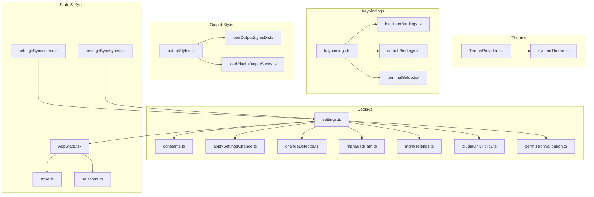
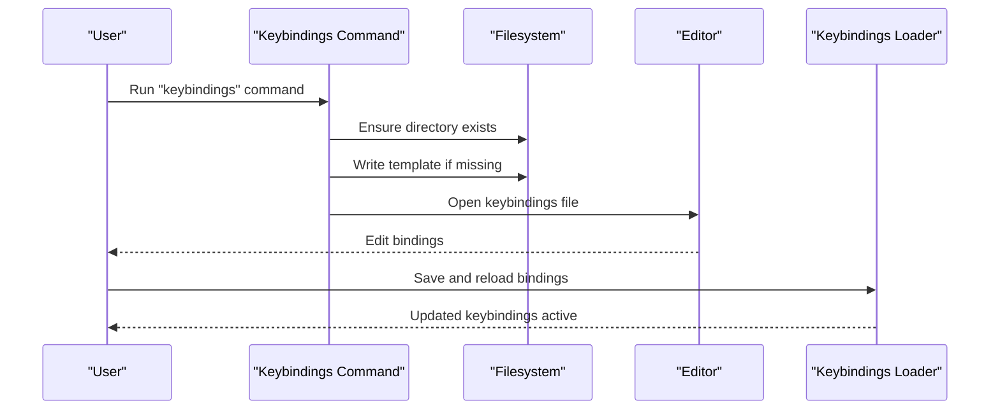
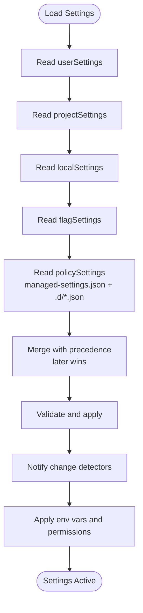
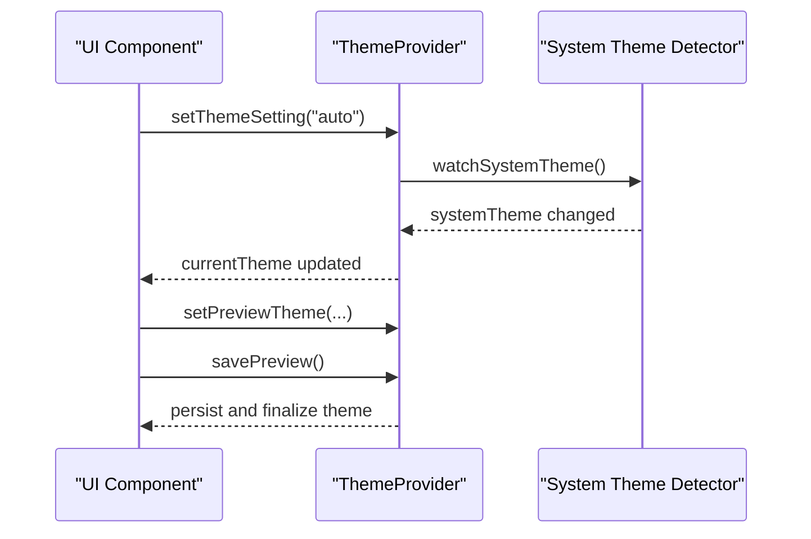
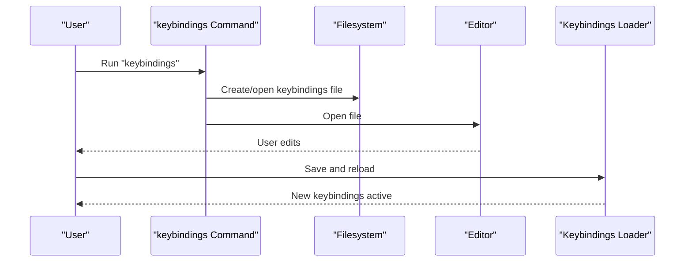
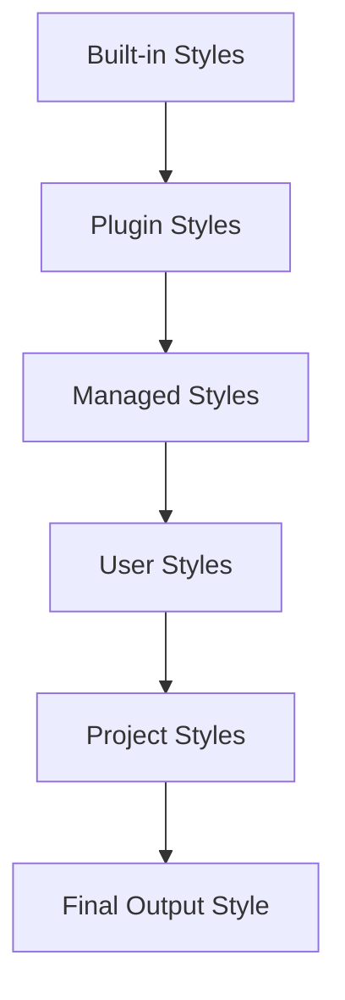
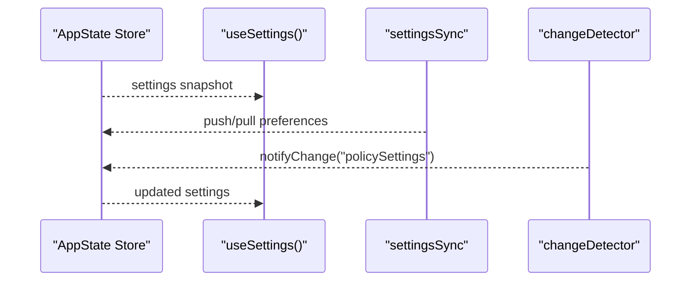
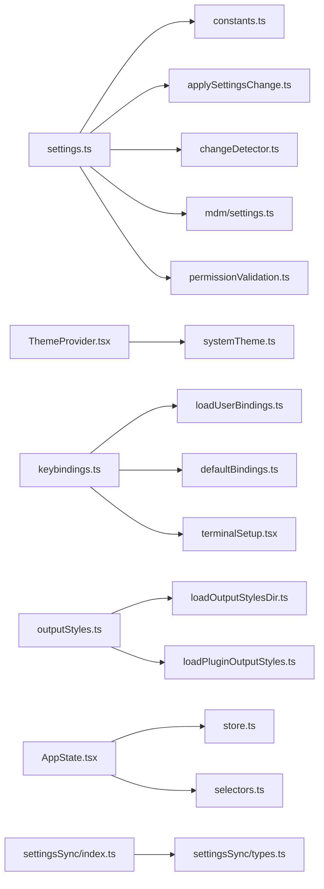

# Configuration and Customization

<cite>
**Referenced Files in This Document**
- [constants.ts](file://claude_code_src/restored-src/src/utils/settings/constants.ts)
- [settings.ts](file://claude_code_src/restored-src/src/utils/settings/settings.ts)
- [applySettingsChange.ts](file://claude_code_src/restored-src/src/utils/settings/applySettingsChange.ts)
- [changeDetector.ts](file://claude_code_src/restored-src/src/utils/settings/changeDetector.ts)
- [managedPath.ts](file://claude_code_src/restored-src/src/utils/settings/managedPath.ts)
- [mdm/settings.ts](file://claude_code_src/restored-src/src/utils/settings/mdm/settings.ts)
- [mdm/rawRead.ts](file://claude_code_src/restored-src/src/utils/settings/mdm/rawRead.ts)
- [mdm/constants.ts](file://claude_code_src/restored-src/src/utils/settings/mdm/constants.ts)
- [pluginOnlyPolicy.ts](file://claude_code_src/restored-src/src/utils/settings/pluginOnlyPolicy.ts)
- [permissionValidation.ts](file://claude_code_src/restored-src/src/utils/settings/permissionValidation.ts)
- [index.ts](file://claude_code_src/restored-src/src/services/remoteManagedSettings/index.ts)
- [useSettings.ts](file://claude_code_src/restored-src/src/hooks/useSettings.ts)
- [ThemeProvider.tsx](file://claude_code_src/restored-src/src/components/design-system/ThemeProvider.tsx)
- [systemTheme.ts](file://claude_code_src/restored-src/src/utils/systemTheme.ts)
- [keybindings.ts](file://claude_code_src/restored-src/src/commands/keybindings/keybindings.ts)
- [index.ts](file://claude_code_src/restored-src/src/commands/keybindings/index.ts)
- [loadUserBindings.ts](file://claude_code_src/restored-src/src/keybindings/loadUserBindings.ts)
- [defaultBindings.ts](file://claude_code_src/restored-src/src/keybindings/defaultBindings.ts)
- [outputStyles.ts](file://claude_code_src/restored-src/src/constants/outputStyles.ts)
- [loadOutputStylesDir.ts](file://claude_code_src/restored-src/src/outputStyles/loadOutputStylesDir.ts)
- [loadPluginOutputStyles.ts](file://claude_code_src/restored-src/src/utils/plugins/loadPluginOutputStyles.ts)
- [config.ts](file://claude_code_src/restored-src/src/utils/config.ts)
- [configConstants.ts](file://claude_code_src/restored-src/src/utils/configConstants.ts)
- [AppState.tsx](file://claude_code_src/restored-src/src/state/AppState.tsx)
- [store.ts](file://claude_code_src/restored-src/src/state/store.ts)
- [selectors.ts](file://claude_code_src/restored-src/src/state/selectors.ts)
- [settingsSync/index.ts](file://claude_code_src/restored-src/src/services/settingsSync/index.ts)
- [settingsSync/types.ts](file://claude_code_src/restored-src/src/services/settingsSync/types.ts)
- [terminalSetup.tsx](file://claude_code_src/restored-src/src/commands/terminalSetup/terminalSetup.tsx)
</cite>

## Table of Contents
1. [Introduction](#introduction)
2. [Project Structure](#project-structure)
3. [Core Components](#core-components)
4. [Architecture Overview](#architecture-overview)
5. [Detailed Component Analysis](#detailed-component-analysis)
6. [Dependency Analysis](#dependency-analysis)
7. [Performance Considerations](#performance-considerations)
8. [Troubleshooting Guide](#troubleshooting-guide)
9. [Conclusion](#conclusion)
10. [Appendices](#appendices)

## Introduction
This document explains how configuration and customization work in the Claude Code Python IDE. It covers the settings management system (sources, merging, policy management), theme and styling customization (including system theme detection and auto mode), keybinding customization (user bindings and editor integration), output style customization, and user preference management. It also includes practical configuration scenarios, troubleshooting steps, security considerations, and performance impacts.

## Project Structure
Configuration spans several subsystems:
- Settings: sources, merging, validation, and change detection
- Themes: theme provider, system theme detection, and persistence
- Keybindings: user keybindings, defaults, and editor-specific setup
- Output Styles: built-in, plugin-provided, and policy-managed styles
- Preferences: persisted global preferences and synchronization

**Diagram sources**
- [settings.ts:1-200](file://claude_code_src/restored-src/src/utils/settings/settings.ts#L1-L200)
- [constants.ts:1-65](file://claude_code_src/restored-src/src/utils/settings/constants.ts#L1-L65)
- [applySettingsChange.ts:1-120](file://claude_code_src/restored-src/src/utils/settings/applySettingsChange.ts#L1-L120)
- [changeDetector.ts:1-120](file://claude_code_src/restored-src/src/utils/settings/changeDetector.ts#L1-L120)
- [managedPath.ts:1-120](file://claude_code_src/restored-src/src/utils/settings/managedPath.ts#L1-L120)
- [mdm/settings.ts:1-200](file://claude_code_src/restored-src/src/utils/settings/mdm/settings.ts#L1-L200)
- [pluginOnlyPolicy.ts:1-120](file://claude_code_src/restored-src/src/utils/settings/pluginOnlyPolicy.ts#L1-L120)
- [permissionValidation.ts:1-120](file://claude_code_src/restored-src/src/utils/settings/permissionValidation.ts#L1-L120)
- [ThemeProvider.tsx:61-169](file://claude_code_src/restored-src/src/components/design-system/ThemeProvider.tsx#L61-L169)
- [systemTheme.ts:102-119](file://claude_code_src/restored-src/src/utils/systemTheme.ts#L102-L119)
- [keybindings.ts:1-53](file://claude_code_src/restored-src/src/commands/keybindings/keybindings.ts#L1-L53)
- [loadUserBindings.ts:1-200](file://claude_code_src/restored-src/src/keybindings/loadUserBindings.ts#L1-L200)
- [defaultBindings.ts:1-200](file://claude_code_src/restored-src/src/keybindings/defaultBindings.ts#L1-L200)
- [terminalSetup.tsx:80-340](file://claude_code_src/restored-src/src/commands/terminalSetup/terminalSetup.tsx#L80-L340)
- [outputStyles.ts:1-217](file://claude_code_src/restored-src/src/constants/outputStyles.ts#L1-L217)
- [loadOutputStylesDir.ts:1-200](file://claude_code_src/restored-src/src/outputStyles/loadOutputStylesDir.ts#L1-L200)
- [loadPluginOutputStyles.ts:1-200](file://claude_code_src/restored-src/src/utils/plugins/loadPluginOutputStyles.ts#L1-L200)
- [AppState.tsx:1-200](file://claude_code_src/restored-src/src/state/AppState.tsx#L1-L200)
- [store.ts:1-200](file://claude_code_src/restored-src/src/state/store.ts#L1-L200)
- [selectors.ts:1-200](file://claude_code_src/restored-src/src/state/selectors.ts#L1-L200)
- [settingsSync/index.ts:1-200](file://claude_code_src/restored-src/src/services/settingsSync/index.ts#L1-L200)
- [settingsSync/types.ts:1-200](file://claude_code_src/restored-src/src/services/settingsSync/types.ts#L1-L200)

**Section sources**
- [constants.ts:1-65](file://claude_code_src/restored-src/src/utils/settings/constants.ts#L1-L65)
- [settings.ts:55-200](file://claude_code_src/restored-src/src/utils/settings/settings.ts#L55-L200)
- [ThemeProvider.tsx:61-169](file://claude_code_src/restored-src/src/components/design-system/ThemeProvider.tsx#L61-L169)
- [keybindings.ts:1-53](file://claude_code_src/restored-src/src/commands/keybindings/keybindings.ts#L1-L53)
- [outputStyles.ts:1-217](file://claude_code_src/restored-src/src/constants/outputStyles.ts#L1-L217)
- [AppState.tsx:1-200](file://claude_code_src/restored-src/src/state/AppState.tsx#L1-L200)

## Core Components
- Settings sources and precedence: user, project, local, CLI flags, and managed policy settings.
- Change detection and hot-reload: automatic reapplication of settings and environment updates.
- Theme system: explicit theme selection, system theme auto-detection, and live preview.
- Keybindings: user customization file creation, validation, and editor-specific installation helpers.
- Output styles: built-in, plugin-provided, and policy-managed styles with forced application logic.
- Preferences sync: cross-device synchronization and conflict resolution.

**Section sources**
- [constants.ts:1-65](file://claude_code_src/restored-src/src/utils/settings/constants.ts#L1-L65)
- [settings.ts:55-200](file://claude_code_src/restored-src/src/utils/settings/settings.ts#L55-L200)
- [changeDetector.ts:1-120](file://claude_code_src/restored-src/src/utils/settings/changeDetector.ts#L1-L120)
- [ThemeProvider.tsx:61-169](file://claude_code_src/restored-src/src/components/design-system/ThemeProvider.tsx#L61-L169)
- [keybindings.ts:1-53](file://claude_code_src/restored-src/src/commands/keybindings/keybindings.ts#L1-L53)
- [outputStyles.ts:1-217](file://claude_code_src/restored-src/src/constants/outputStyles.ts#L1-L217)
- [settingsSync/index.ts:1-200](file://claude_code_src/restored-src/src/services/settingsSync/index.ts#L1-L200)

## Architecture Overview
The configuration system merges settings from multiple sources, validates and applies them, and notifies components to hot-reload. Themes react to user selection and system theme changes. Keybindings are authored in a dedicated file and can be installed into editors. Output styles are aggregated from built-in, plugin, and managed sources.

**Diagram sources**
- [keybindings.ts:1-53](file://claude_code_src/restored-src/src/commands/keybindings/keybindings.ts#L1-L53)
- [loadUserBindings.ts:1-200](file://claude_code_src/restored-src/src/keybindings/loadUserBindings.ts#L1-L200)

**Section sources**
- [keybindings.ts:1-53](file://claude_code_src/restored-src/src/commands/keybindings/keybindings.ts#L1-L53)
- [loadUserBindings.ts:1-200](file://claude_code_src/restored-src/src/keybindings/loadUserBindings.ts#L1-L200)

## Detailed Component Analysis

### Settings Management System
- Sources and precedence: user, project, local, CLI flags, managed policy. Later sources override earlier ones.
- Managed settings: file-based managed-settings.json plus managed-settings.d/*.json fragments; alphabetical merge with later files winning.
- Remote managed settings: fetched and polled periodically; hot-reload triggered on changes.
- Permission validation and plugin-only policies: enforce constraints on settings that affect permissions or plugins.
- Change detection: watches filesystem and caches; notifies listeners to re-evaluate settings and environment variables.

**Diagram sources**
- [constants.ts:1-65](file://claude_code_src/restored-src/src/utils/settings/constants.ts#L1-L65)
- [settings.ts:55-200](file://claude_code_src/restored-src/src/utils/settings/settings.ts#L55-L200)
- [changeDetector.ts:1-120](file://claude_code_src/restored-src/src/utils/settings/changeDetector.ts#L1-L120)
- [mdm/settings.ts:1-200](file://claude_code_src/restored-src/src/utils/settings/mdm/settings.ts#L1-L200)
- [index.ts:534-619](file://claude_code_src/restored-src/src/services/remoteManagedSettings/index.ts#L534-L619)

**Section sources**
- [constants.ts:1-65](file://claude_code_src/restored-src/src/utils/settings/constants.ts#L1-L65)
- [settings.ts:55-200](file://claude_code_src/restored-src/src/utils/settings/settings.ts#L55-L200)
- [changeDetector.ts:1-120](file://claude_code_src/restored-src/src/utils/settings/changeDetector.ts#L1-L120)
- [mdm/settings.ts:1-200](file://claude_code_src/restored-src/src/utils/settings/mdm/settings.ts#L1-L200)
- [index.ts:534-619](file://claude_code_src/restored-src/src/services/remoteManagedSettings/index.ts#L534-L619)

### Theme and Styling System
- Theme provider exposes current theme, preview, and setters. Supports saving previews and switching to auto mode.
- Auto mode watches system theme and updates immediately upon changes.
- System theme detection reads environment hints and terminal OSC queries for best-effort initial guess.

**Diagram sources**
- [ThemeProvider.tsx:61-169](file://claude_code_src/restored-src/src/components/design-system/ThemeProvider.tsx#L61-L169)
- [systemTheme.ts:102-119](file://claude_code_src/restored-src/src/utils/systemTheme.ts#L102-L119)

**Section sources**
- [ThemeProvider.tsx:61-169](file://claude_code_src/restored-src/src/components/design-system/ThemeProvider.tsx#L61-L169)
- [systemTheme.ts:102-119](file://claude_code_src/restored-src/src/utils/systemTheme.ts#L102-L119)

### Keybinding System
- Command creates or opens a user keybindings file and opens it in the editor.
- User bindings are loaded and validated; conflicts with reserved shortcuts are handled.
- Editor-specific helpers install Shift+Enter or Option-as-Meta configurations for supported terminals/editors.

**Diagram sources**
- [keybindings.ts:1-53](file://claude_code_src/restored-src/src/commands/keybindings/keybindings.ts#L1-L53)
- [loadUserBindings.ts:1-200](file://claude_code_src/restored-src/src/keybindings/loadUserBindings.ts#L1-L200)
- [defaultBindings.ts:1-200](file://claude_code_src/restored-src/src/keybindings/defaultBindings.ts#L1-L200)
- [terminalSetup.tsx:80-340](file://claude_code_src/restored-src/src/commands/terminalSetup/terminalSetup.tsx#L80-L340)

**Section sources**
- [keybindings.ts:1-53](file://claude_code_src/restored-src/src/commands/keybindings/keybindings.ts#L1-L53)
- [loadUserBindings.ts:1-200](file://claude_code_src/restored-src/src/keybindings/loadUserBindings.ts#L1-L200)
- [defaultBindings.ts:1-200](file://claude_code_src/restored-src/src/keybindings/defaultBindings.ts#L1-L200)
- [terminalSetup.tsx:80-340](file://claude_code_src/restored-src/src/commands/terminalSetup/terminalSetup.tsx#L80-L340)

### Output Style Customization
- Built-in styles include default, explanatory, and learning modes with curated prompts.
- Plugin-provided styles are merged with higher precedence than built-in.
- Managed policy can inject additional styles; user/project/local styles can override.
- Forced plugin styles are applied when a plugin declares a forced output style.
- Resolution order: built-in → plugin → managed → user → project.

**Diagram sources**
- [outputStyles.ts:137-175](file://claude_code_src/restored-src/src/constants/outputStyles.ts#L137-L175)
- [loadOutputStylesDir.ts:1-200](file://claude_code_src/restored-src/src/outputStyles/loadOutputStylesDir.ts#L1-L200)
- [loadPluginOutputStyles.ts:1-200](file://claude_code_src/restored-src/src/utils/plugins/loadPluginOutputStyles.ts#L1-L200)

**Section sources**
- [outputStyles.ts:1-217](file://claude_code_src/restored-src/src/constants/outputStyles.ts#L1-L217)
- [loadOutputStylesDir.ts:1-200](file://claude_code_src/restored-src/src/outputStyles/loadOutputStylesDir.ts#L1-L200)
- [loadPluginOutputStyles.ts:1-200](file://claude_code_src/restored-src/src/utils/plugins/loadPluginOutputStyles.ts#L1-L200)

### User Preference Management
- Preferences are stored in AppState and accessed via React hooks for reactive updates.
- Settings change detector triggers hot-reloads across the app.
- Settings sync service coordinates cross-device synchronization and conflict resolution.

**Diagram sources**
- [AppState.tsx:1-200](file://claude_code_src/restored-src/src/state/AppState.tsx#L1-L200)
- [useSettings.ts:1-18](file://claude_code_src/restored-src/src/hooks/useSettings.ts#L1-L18)
- [settingsSync/index.ts:1-200](file://claude_code_src/restored-src/src/services/settingsSync/index.ts#L1-L200)
- [changeDetector.ts:1-120](file://claude_code_src/restored-src/src/utils/settings/changeDetector.ts#L1-L120)

**Section sources**
- [AppState.tsx:1-200](file://claude_code_src/restored-src/src/state/AppState.tsx#L1-L200)
- [useSettings.ts:1-18](file://claude_code_src/restored-src/src/hooks/useSettings.ts#L1-L18)
- [settingsSync/index.ts:1-200](file://claude_code_src/restored-src/src/services/settingsSync/index.ts#L1-L200)
- [settingsSync/types.ts:1-200](file://claude_code_src/restored-src/src/services/settingsSync/types.ts#L1-L200)

## Dependency Analysis
- Settings depend on source constants, merging logic, permission validation, and MDM support.
- Theme provider depends on system theme detection and persists selections.
- Keybindings depend on user bindings loader and editor-specific setup helpers.
- Output styles depend on built-in definitions, plugin loaders, and managed policy.
- State and sync integrate settings into the runtime for hot-reload and cross-device persistence.

**Diagram sources**
- [settings.ts:1-200](file://claude_code_src/restored-src/src/utils/settings/settings.ts#L1-L200)
- [constants.ts:1-65](file://claude_code_src/restored-src/src/utils/settings/constants.ts#L1-L65)
- [applySettingsChange.ts:1-120](file://claude_code_src/restored-src/src/utils/settings/applySettingsChange.ts#L1-L120)
- [changeDetector.ts:1-120](file://claude_code_src/restored-src/src/utils/settings/changeDetector.ts#L1-L120)
- [mdm/settings.ts:1-200](file://claude_code_src/restored-src/src/utils/settings/mdm/settings.ts#L1-L200)
- [permissionValidation.ts:1-120](file://claude_code_src/restored-src/src/utils/settings/permissionValidation.ts#L1-L120)
- [ThemeProvider.tsx:61-169](file://claude_code_src/restored-src/src/components/design-system/ThemeProvider.tsx#L61-L169)
- [systemTheme.ts:102-119](file://claude_code_src/restored-src/src/utils/systemTheme.ts#L102-L119)
- [keybindings.ts:1-53](file://claude_code_src/restored-src/src/commands/keybindings/keybindings.ts#L1-L53)
- [loadUserBindings.ts:1-200](file://claude_code_src/restored-src/src/keybindings/loadUserBindings.ts#L1-L200)
- [defaultBindings.ts:1-200](file://claude_code_src/restored-src/src/keybindings/defaultBindings.ts#L1-L200)
- [terminalSetup.tsx:80-340](file://claude_code_src/restored-src/src/commands/terminalSetup/terminalSetup.tsx#L80-L340)
- [outputStyles.ts:1-217](file://claude_code_src/restored-src/src/constants/outputStyles.ts#L1-L217)
- [loadOutputStylesDir.ts:1-200](file://claude_code_src/restored-src/src/outputStyles/loadOutputStylesDir.ts#L1-L200)
- [loadPluginOutputStyles.ts:1-200](file://claude_code_src/restored-src/src/utils/plugins/loadPluginOutputStyles.ts#L1-L200)
- [AppState.tsx:1-200](file://claude_code_src/restored-src/src/state/AppState.tsx#L1-L200)
- [store.ts:1-200](file://claude_code_src/restored-src/src/state/store.ts#L1-L200)
- [selectors.ts:1-200](file://claude_code_src/restored-src/src/state/selectors.ts#L1-L200)
- [settingsSync/index.ts:1-200](file://claude_code_src/restored-src/src/services/settingsSync/index.ts#L1-L200)
- [settingsSync/types.ts:1-200](file://claude_code_src/restored-src/src/services/settingsSync/types.ts#L1-L200)

**Section sources**
- [settings.ts:1-200](file://claude_code_src/restored-src/src/utils/settings/settings.ts#L1-L200)
- [constants.ts:1-65](file://claude_code_src/restored-src/src/utils/settings/constants.ts#L1-L65)
- [ThemeProvider.tsx:61-169](file://claude_code_src/restored-src/src/components/design-system/ThemeProvider.tsx#L61-L169)
- [keybindings.ts:1-53](file://claude_code_src/restored-src/src/commands/keybindings/keybindings.ts#L1-L53)
- [outputStyles.ts:1-217](file://claude_code_src/restored-src/src/constants/outputStyles.ts#L1-L217)
- [AppState.tsx:1-200](file://claude_code_src/restored-src/src/state/AppState.tsx#L1-L200)
- [settingsSync/index.ts:1-200](file://claude_code_src/restored-src/src/services/settingsSync/index.ts#L1-L200)

## Performance Considerations
- Settings merging and caching: merging multiple sources and memoizing output styles reduces repeated computation.
- Hot-reload overhead: frequent file changes trigger re-evaluation; background polling for remote settings is designed to fail open and avoid blocking.
- Theme switching: auto mode watchers introduce periodic checks; initial system theme detection uses environment hints to minimize terminal round-trips.
- Keybindings: parsing and validation occur on save; editor integrations write JSON safely and preserve formatting.

[No sources needed since this section provides general guidance]

## Troubleshooting Guide
Common configuration issues and resolutions:
- Keybinding customization disabled: the feature is in preview; check the command’s enabled condition and availability.
- Keybindings file creation conflicts: exclusive creation avoids race conditions; if the file exists, open it instead of overwriting.
- Remote managed settings not applied: ensure eligibility and that background polling is active; changes trigger hot-reload.
- Theme flashing on auto-switch: initial guess from environment variables minimizes flicker; live watcher updates promptly.
- Output style not taking effect: verify source precedence and whether a plugin forced a style; confirm settings resolution order.
- Settings not updating in UI: ensure change detector is notifying and AppState is reflecting updates; check sync status.

**Section sources**
- [index.ts:534-619](file://claude_code_src/restored-src/src/services/remoteManagedSettings/index.ts#L534-L619)
- [keybindings.ts:1-53](file://claude_code_src/restored-src/src/commands/keybindings/keybindings.ts#L1-L53)
- [ThemeProvider.tsx:61-169](file://claude_code_src/restored-src/src/components/design-system/ThemeProvider.tsx#L61-L169)
- [outputStyles.ts:137-217](file://claude_code_src/restored-src/src/constants/outputStyles.ts#L137-L217)
- [settingsSync/index.ts:1-200](file://claude_code_src/restored-src/src/services/settingsSync/index.ts#L1-L200)

## Conclusion
The Claude Code Python IDE provides a robust, layered configuration system. Settings are merged from multiple sources with clear precedence, validated, and hot-reloaded across the app. Themes support explicit selection and auto-detection with live previews. Keybindings are user-editable and can be installed into editors. Output styles are customizable and policy-managed. Preferences synchronize across devices. Security and performance are addressed through fail-open policies, validation, and efficient caching.

[No sources needed since this section summarizes without analyzing specific files]

## Appendices

### Practical Configuration Scenarios
- Set a custom theme:
  - Use the theme picker to choose a theme or enable auto mode; previews can be saved.
  - Reference: [ThemeProvider.tsx:61-169](file://claude_code_src/restored-src/src/components/design-system/ThemeProvider.tsx#L61-L169)
- Customize keybindings:
  - Run the keybindings command to create or open the user keybindings file; edit and save to activate.
  - Reference: [keybindings.ts:1-53](file://claude_code_src/restored-src/src/commands/keybindings/keybindings.ts#L1-L53)
- Configure output style:
  - Choose from built-in styles or add custom styles via project/user files; managed policy can override.
  - Reference: [outputStyles.ts:1-217](file://claude_code_src/restored-src/src/constants/outputStyles.ts#L1-L217)
- Manage preferences across devices:
  - Use settings sync to push/pull preferences; monitor for conflicts.
  - Reference: [settingsSync/index.ts:1-200](file://claude_code_src/restored-src/src/services/settingsSync/index.ts#L1-L200)

### Security Considerations
- Managed settings and policy: enforced via MDM and permission validation; changes are validated before application.
- Remote managed settings: fetched with fail-open semantics to avoid blocking; changes trigger controlled hot-reload.
- Plugin-only policies: restrict settings that affect permissions or plugins to maintain safety.

**Section sources**
- [mdm/settings.ts:1-200](file://claude_code_src/restored-src/src/utils/settings/mdm/settings.ts#L1-L200)
- [permissionValidation.ts:1-120](file://claude_code_src/restored-src/src/utils/settings/permissionValidation.ts#L1-L120)
- [pluginOnlyPolicy.ts:1-120](file://claude_code_src/restored-src/src/utils/settings/pluginOnlyPolicy.ts#L1-L120)
- [index.ts:534-619](file://claude_code_src/restored-src/src/services/remoteManagedSettings/index.ts#L534-L619)