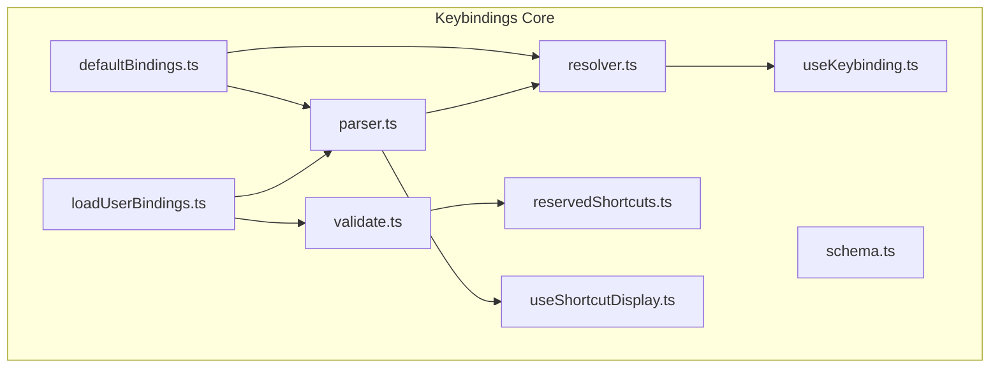
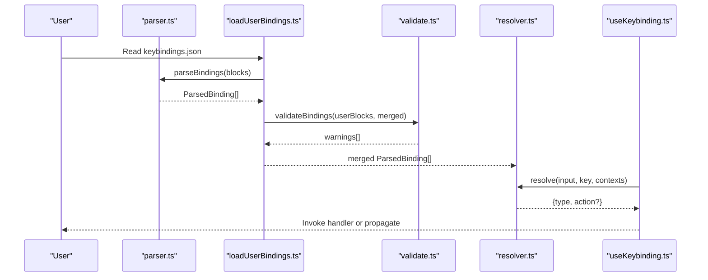
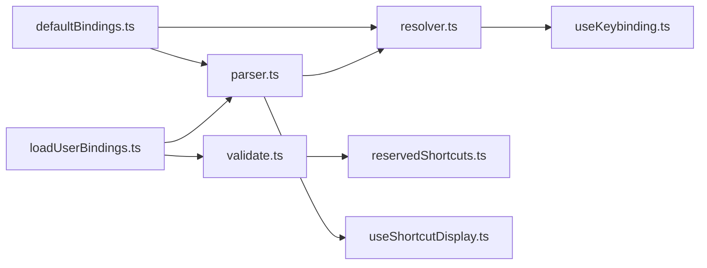

# Keyboard Shortcuts and Keybindings

<cite>
**Referenced Files in This Document**
- [defaultBindings.ts](file://claude_code_src/restored-src/src/keybindings/defaultBindings.ts)
- [resolver.ts](file://claude_code_src/restored-src/src/keybindings/resolver.ts)
- [parser.ts](file://claude_code_src/restored-src/src/keybindings/parser.ts)
- [schema.ts](file://claude_code_src/restored-src/src/keybindings/schema.ts)
- [loadUserBindings.ts](file://claude_code_src/restored-src/src/keybindings/loadUserBindings.ts)
- [validate.ts](file://claude_code_src/restored-src/src/keybindings/validate.ts)
- [reservedShortcuts.ts](file://claude_code_src/restored-src/src/keybindings/reservedShortcuts.ts)
- [useKeybinding.ts](file://claude_code_src/restored-src/src/keybindings/useKeybinding.ts)
- [useShortcutDisplay.ts](file://claude_code_src/restored-src/src/keybindings/useShortcutDisplay.ts)
</cite>

## Table of Contents
1. [Introduction](#introduction)
2. [Project Structure](#project-structure)
3. [Core Components](#core-components)
4. [Architecture Overview](#architecture-overview)
5. [Detailed Component Analysis](#detailed-component-analysis)
6. [Dependency Analysis](#dependency-analysis)
7. [Performance Considerations](#performance-considerations)
8. [Troubleshooting Guide](#troubleshooting-guide)
9. [Conclusion](#conclusion)
10. [Appendices](#appendices)

## Introduction
This document explains the keyboard shortcuts and keybinding customization system in Claude Code Python IDE. It covers the keybinding architecture, default mappings, user-defined configurations, parsing and resolution logic, conflict and validation mechanisms, dynamic updates, and accessibility considerations. Practical examples demonstrate how to customize shortcuts, create keybinding profiles, and troubleshoot conflicts.

## Project Structure
The keybinding system is organized around a small set of focused modules:
- Default keybindings definition
- Parser for keystrokes/chords and display formatting
- Resolver for single-key and chord-based matching
- User configuration loader with hot-reload
- Validation pipeline for user configs
- Reserved shortcuts and conflict detection
- React hooks for integrating keybindings into components
- Display helpers for shortcut hints

**Diagram sources**
- [defaultBindings.ts:1-341](file://claude_code_src/restored-src/src/keybindings/defaultBindings.ts#L1-L341)
- [parser.ts:1-204](file://claude_code_src/restored-src/src/keybindings/parser.ts#L1-L204)
- [resolver.ts:1-245](file://claude_code_src/restored-src/src/keybindings/resolver.ts#L1-L245)
- [schema.ts:1-237](file://claude_code_src/restored-src/src/keybindings/schema.ts#L1-L237)
- [validate.ts:1-499](file://claude_code_src/restored-src/src/keybindings/validate.ts#L1-L499)
- [reservedShortcuts.ts:1-128](file://claude_code_src/restored-src/src/keybindings/reservedShortcuts.ts#L1-L128)
- [loadUserBindings.ts:1-473](file://claude_code_src/restored-src/src/keybindings/loadUserBindings.ts#L1-L473)
- [useKeybinding.ts:1-197](file://claude_code_src/restored-src/src/keybindings/useKeybinding.ts#L1-L197)
- [useShortcutDisplay.ts:1-60](file://claude_code_src/restored-src/src/keybindings/useShortcutDisplay.ts#L1-L60)

**Section sources**
- [defaultBindings.ts:1-341](file://claude_code_src/restored-src/src/keybindings/defaultBindings.ts#L1-L341)
- [parser.ts:1-204](file://claude_code_src/restored-src/src/keybindings/parser.ts#L1-L204)
- [resolver.ts:1-245](file://claude_code_src/restored-src/src/keybindings/resolver.ts#L1-L245)
- [schema.ts:1-237](file://claude_code_src/restored-src/src/keybindings/schema.ts#L1-L237)
- [validate.ts:1-499](file://claude_code_src/restored-src/src/keybindings/validate.ts#L1-L499)
- [reservedShortcuts.ts:1-128](file://claude_code_src/restored-src/src/keybindings/reservedShortcuts.ts#L1-L128)
- [loadUserBindings.ts:1-473](file://claude_code_src/restored-src/src/keybindings/loadUserBindings.ts#L1-L473)
- [useKeybinding.ts:1-197](file://claude_code_src/restored-src/src/keybindings/useKeybinding.ts#L1-L197)
- [useShortcutDisplay.ts:1-60](file://claude_code_src/restored-src/src/keybindings/useShortcutDisplay.ts#L1-L60)

## Core Components
- Default keybindings: Centralized definitions grouped by context (e.g., Global, Chat, Settings). Includes platform-aware defaults and feature-gated entries.
- Parser: Converts keystroke strings into normalized keystroke objects, parses chords, and formats display strings with platform-appropriate labels.
- Resolver: Matches keystrokes to actions considering active contexts, chord prefixes, and unbound entries. Supports single-key and multi-step chord resolution.
- User configuration loader: Reads user keybindings.json, merges with defaults, validates, and hot-reloads changes.
- Validation: Checks structure, duplicates, reserved shortcuts, and command binding constraints.
- Reserved shortcuts: Defines OS/terminal/system shortcuts that cannot be rebound or may not work.
- React hooks: Integrates keybindings into components with automatic chord handling and propagation control.
- Display helpers: Provides shortcut display text with fallbacks and analytics logging.

**Section sources**
- [defaultBindings.ts:32-341](file://claude_code_src/restored-src/src/keybindings/defaultBindings.ts#L32-L341)
- [parser.ts:13-204](file://claude_code_src/restored-src/src/keybindings/parser.ts#L13-L204)
- [resolver.ts:32-245](file://claude_code_src/restored-src/src/keybindings/resolver.ts#L32-L245)
- [loadUserBindings.ts:133-237](file://claude_code_src/restored-src/src/keybindings/loadUserBindings.ts#L133-L237)
- [validate.ts:129-451](file://claude_code_src/restored-src/src/keybindings/validate.ts#L129-L451)
- [reservedShortcuts.ts:16-83](file://claude_code_src/restored-src/src/keybindings/reservedShortcuts.ts#L16-L83)
- [useKeybinding.ts:33-197](file://claude_code_src/restored-src/src/keybindings/useKeybinding.ts#L33-L197)
- [useShortcutDisplay.ts:29-60](file://claude_code_src/restored-src/src/keybindings/useShortcutDisplay.ts#L29-L60)

## Architecture Overview
The keybinding system follows a layered design:
- Data layer: Defaults and user-provided bindings are parsed into a flat list of parsed bindings.
- Validation layer: User configuration is validated for structure, duplicates, reserved shortcuts, and command constraints.
- Resolution layer: Active contexts and chords drive action resolution with precedence rules.
- Presentation layer: Display helpers format shortcuts for UI and analytics.
- Integration layer: React hooks connect keybindings to component handlers and propagate events appropriately.

**Diagram sources**
- [loadUserBindings.ts:133-237](file://claude_code_src/restored-src/src/keybindings/loadUserBindings.ts#L133-L237)
- [parser.ts:191-204](file://claude_code_src/restored-src/src/keybindings/parser.ts#L191-L204)
- [validate.ts:425-451](file://claude_code_src/restored-src/src/keybindings/validate.ts#L425-L451)
- [resolver.ts:32-245](file://claude_code_src/restored-src/src/keybindings/resolver.ts#L32-L245)
- [useKeybinding.ts:47-97](file://claude_code_src/restored-src/src/keybindings/useKeybinding.ts#L47-L97)

## Detailed Component Analysis

### Default Keybindings
- Purpose: Provide baseline mappings grouped by context. Includes platform-aware keys (e.g., paste, mode cycle) and feature-gated entries.
- Behavior: Hardcoded actions and chords; cannot be rebound by users (enforced by reserved shortcuts).
- Examples: Global app actions, Chat input shortcuts, Autocomplete navigation, Settings and Confirmation dialogs, Scroll and selection actions, and specialized contexts like Transcripts and Diff dialogs.

**Section sources**
- [defaultBindings.ts:32-341](file://claude_code_src/restored-src/src/keybindings/defaultBindings.ts#L32-L341)

### Parser
- Keystroke parsing: Normalizes modifier aliases and maps display names to internal names.
- Chord parsing: Splits chord strings into sequences of keystrokes; handles space as a literal key.
- Display formatting: Converts keystrokes/chords to human-readable strings with platform-appropriate labels (e.g., opt vs alt, cmd vs super).

**Section sources**
- [parser.ts:13-186](file://claude_code_src/restored-src/src/keybindings/parser.ts#L13-L186)

### Resolver
- Single-key resolution: Filters bindings by active contexts and matches exact keystrokes; last-wins semantics for overrides.
- Chord resolution: Manages pending chord state, detects prefix matches, and decides whether to wait for more steps or accept a match.
- Unbound handling: Explicitly unbound actions return a dedicated result to prevent propagation.
- Display text: Retrieves the configured display text for an action in a given context.

**Section sources**
- [resolver.ts:32-245](file://claude_code_src/restored-src/src/keybindings/resolver.ts#L32-L245)

### User Configuration Loader
- Gate: Keybinding customization is currently restricted to Anthropic employees via a feature flag.
- File location: ~/.claude/keybindings.json with an object wrapper containing a bindings array.
- Merging: User bindings appended after defaults override earlier entries.
- Hot reload: Watches the file for changes and emits signals with updated bindings and warnings.
- Sync load: Provides cached bindings for initial render paths.

**Section sources**
- [loadUserBindings.ts:41-46](file://claude_code_src/restored-src/src/keybindings/loadUserBindings.ts#L41-L46)
- [loadUserBindings.ts:115-117](file://claude_code_src/restored-src/src/keybindings/loadUserBindings.ts#L115-L117)
- [loadUserBindings.ts:196-198](file://claude_code_src/restored-src/src/keybindings/loadUserBindings.ts#L196-L198)
- [loadUserBindings.ts:353-404](file://claude_code_src/restored-src/src/keybindings/loadUserBindings.ts#L353-L404)
- [loadUserBindings.ts:243-250](file://claude_code_src/restored-src/src/keybindings/loadUserBindings.ts#L243-L250)

### Validation Pipeline
- Structure validation: Ensures the user config is an array of blocks with context and bindings.
- Keystroke parsing: Detects malformed keystrokes and suggests fixes.
- Action validation: Validates command bindings and enforces context constraints.
- Duplicate detection: Warns when the same key is bound multiple times within a context.
- Reserved shortcuts: Flags OS/terminal/system shortcuts that cannot be rebound or may not work.

**Section sources**
- [validate.ts:129-451](file://claude_code_src/restored-src/src/keybindings/validate.ts#L129-L451)
- [reservedShortcuts.ts:73-127](file://claude_code_src/restored-src/src/keybindings/reservedShortcuts.ts#L73-L127)

### Reserved Shortcuts
- Non-rebindable: Certain shortcuts are hardcoded and cannot be rebound (e.g., interrupt/exit).
- Terminal/system: OS/terminal shortcuts that typically do not reach the app.
- Platform-specific: macOS system shortcuts are included when applicable.

**Section sources**
- [reservedShortcuts.ts:16-83](file://claude_code_src/restored-src/src/keybindings/reservedShortcuts.ts#L16-L83)

### React Hooks Integration
- useKeybinding: Registers a single action handler with the keybinding context, resolves matches, manages chord state, and stops propagation when handled.
- useKeybindings: Registers multiple actions efficiently and supports fall-through behavior by returning false.

**Section sources**
- [useKeybinding.ts:33-197](file://claude_code_src/restored-src/src/keybindings/useKeybinding.ts#L33-L197)

### Display Helpers
- useShortcutDisplay: Returns the configured display text for an action/context or falls back to a provided default, logging analytics when needed.

**Section sources**
- [useShortcutDisplay.ts:29-60](file://claude_code_src/restored-src/src/keybindings/useShortcutDisplay.ts#L29-L60)

## Dependency Analysis
The keybinding modules form a tight, cohesive subsystem with clear boundaries:
- Parser depends on types and utilities; used by both loader and resolver.
- Loader depends on parser, validator, and reserved shortcuts; emits signals for hot reload.
- Resolver depends on parser and match utilities; integrates with React hooks.
- Validator depends on parser and reserved shortcuts; also checks duplicates and reserved shortcuts.
- Display helpers depend on resolver’s display text retrieval.

**Diagram sources**
- [defaultBindings.ts:1-341](file://claude_code_src/restored-src/src/keybindings/defaultBindings.ts#L1-L341)
- [parser.ts:1-204](file://claude_code_src/restored-src/src/keybindings/parser.ts#L1-L204)
- [resolver.ts:1-245](file://claude_code_src/restored-src/src/keybindings/resolver.ts#L1-L245)
- [loadUserBindings.ts:1-473](file://claude_code_src/restored-src/src/keybindings/loadUserBindings.ts#L1-L473)
- [validate.ts:1-499](file://claude_code_src/restored-src/src/keybindings/validate.ts#L1-L499)
- [reservedShortcuts.ts:1-128](file://claude_code_src/restored-src/src/keybindings/reservedShortcuts.ts#L1-L128)
- [useKeybinding.ts:1-197](file://claude_code_src/restored-src/src/keybindings/useKeybinding.ts#L1-L197)
- [useShortcutDisplay.ts:1-60](file://claude_code_src/restored-src/src/keybindings/useShortcutDisplay.ts#L1-L60)

**Section sources**
- [defaultBindings.ts:1-341](file://claude_code_src/restored-src/src/keybindings/defaultBindings.ts#L1-L341)
- [parser.ts:1-204](file://claude_code_src/restored-src/src/keybindings/parser.ts#L1-L204)
- [resolver.ts:1-245](file://claude_code_src/restored-src/src/keybindings/resolver.ts#L1-L245)
- [loadUserBindings.ts:1-473](file://claude_code_src/restored-src/src/keybindings/loadUserBindings.ts#L1-L473)
- [validate.ts:1-499](file://claude_code_src/restored-src/src/keybindings/validate.ts#L1-L499)
- [reservedShortcuts.ts:1-128](file://claude_code_src/restored-src/src/keybindings/reservedShortcuts.ts#L1-L128)
- [useKeybinding.ts:1-197](file://claude_code_src/restored-src/src/keybindings/useKeybinding.ts#L1-L197)
- [useShortcutDisplay.ts:1-60](file://claude_code_src/restored-src/src/keybindings/useShortcutDisplay.ts#L1-L60)

## Performance Considerations
- Parsing and merging: User bindings are parsed once and merged after defaults; subsequent resolutions operate on the flattened list.
- Context filtering: Resolvers filter by active contexts using a Set for efficient lookups.
- Chord detection: Prefix checks and winner maps minimize redundant comparisons during chord waits.
- Hot reload stability: File watcher uses stability thresholds to avoid partial-write reloads.
- Display caching: Loader caches parsed bindings and warnings for synchronous initialization.

[No sources needed since this section provides general guidance]

## Troubleshooting Guide
Common issues and resolutions:
- Invalid keybindings.json format
  - Cause: Missing or malformed bindings array.
  - Resolution: Ensure the file is an object with a bindings array; fix typos and extra commas.
  - Evidence: Parse errors and suggestions returned by validation.
  - Section sources
    - [loadUserBindings.ts:148-189](file://claude_code_src/restored-src/src/keybindings/loadUserBindings.ts#L148-L189)
    - [validate.ts:312-330](file://claude_code_src/restored-src/src/keybindings/validate.ts#L312-L330)

- Duplicate keys in the same context
  - Cause: JSON silently ignores earlier values for repeated keys.
  - Resolution: Remove duplicates or consolidate into a single binding.
  - Evidence: Duplicate warnings with suggestions.
  - Section sources
    - [validate.ts:258-307](file://claude_code_src/restored-src/src/keybindings/validate.ts#L258-L307)
    - [validate.ts:336-368](file://claude_code_src/restored-src/src/keybindings/validate.ts#L336-L368)

- Reserved or non-rebindable shortcuts
  - Cause: OS/terminal/system shortcuts or hardcoded actions.
  - Resolution: Choose alternative chords; avoid ctrl+c, ctrl+d, ctrl+m; on macOS, avoid cmd+* system shortcuts.
  - Evidence: Reserved shortcut warnings with severity and reasons.
  - Section sources
    - [reservedShortcuts.ts:16-83](file://claude_code_src/restored-src/src/keybindings/reservedShortcuts.ts#L16-L83)
    - [validate.ts:372-399](file://claude_code_src/restored-src/src/keybindings/validate.ts#L372-L399)

- Command bindings outside Chat context
  - Cause: Command bindings must be in Chat context.
  - Resolution: Move the binding to a Chat context block.
  - Evidence: Warning indicating incorrect context.
  - Section sources
    - [validate.ts:208-219](file://claude_code_src/restored-src/src/keybindings/validate.ts#L208-L219)

- Voice activation shortcut risks
  - Cause: Binding bare letters may print into input during warmup.
  - Resolution: Use space or a modifier combination (e.g., meta+k).
  - Evidence: Warning suggesting safer alternatives.
  - Section sources
    - [validate.ts:220-243](file://claude_code_src/restored-src/src/keybindings/validate.ts#L220-L243)

- Dynamic updates not applying
  - Cause: Feature gate disabled or watcher not initialized.
  - Resolution: Enable the feature flag; ensure the config directory exists and is writable.
  - Section sources
    - [loadUserBindings.ts:41-46](file://claude_code_src/restored-src/src/keybindings/loadUserBindings.ts#L41-L46)
    - [loadUserBindings.ts:353-404](file://claude_code_src/restored-src/src/keybindings/loadUserBindings.ts#L353-L404)

- Shortcut not appearing in UI
  - Cause: Action not found or context unavailable.
  - Resolution: Verify action and context; fallback text is used when unavailable.
  - Section sources
    - [useShortcutDisplay.ts:29-60](file://claude_code_src/restored-src/src/keybindings/useShortcutDisplay.ts#L29-L60)

## Conclusion
Claude Code’s keybinding system combines robust defaults, flexible user customization, and strong validation to deliver a reliable and extensible keyboard interface. The resolver ensures predictable behavior across contexts and chords, while the loader and hooks enable seamless integration and dynamic updates. By following the validation and conflict-resolution guidelines, users can tailor shortcuts to their workflows safely and effectively.

[No sources needed since this section summarizes without analyzing specific files]

## Appendices

### Default Key Mappings by Context
- Global: Application-wide actions (interrupt, exit, redraw, toggle features).
- Chat: Input actions, model picker, undo/edit, stashing, image paste, voice activation.
- Autocomplete: Accept/dismiss and navigation.
- Settings: Panel navigation and search.
- Confirmation: Yes/no, navigation, toggles, permission controls.
- Tabs: Next/previous navigation.
- Transcript: Toggle visibility and exit.
- HistorySearch: Search and execute history.
- Task: Background tasks.
- ThemePicker: Toggle syntax highlighting.
- Scroll: Paging, line movement, top/bottom, copy selection.
- Help: Dismiss overlay.
- Attachments: Navigate and remove attachments.
- Footer: Indicator navigation and selection.
- MessageSelector: Rewind navigation and selection.
- DiffDialog: Dialog navigation and details.
- ModelPicker: Effort adjustment.
- Select: Generic list navigation.
- Plugin: Manage plugins.

**Section sources**
- [defaultBindings.ts:32-341](file://claude_code_src/restored-src/src/keybindings/defaultBindings.ts#L32-L341)

### Keybinding Schema Validation
- File format: Object wrapper with optional $schema/$docs and a bindings array.
- Block structure: Each block has a context and a bindings map of keystroke to action or null.
- Actions: Enumerated action identifiers or command:* bindings.
- Validation coverage: Structure, keystroke syntax, action validity, context constraints, duplicates, reserved shortcuts.

**Section sources**
- [schema.ts:12-229](file://claude_code_src/restored-src/src/keybindings/schema.ts#L12-L229)
- [validate.ts:129-451](file://claude_code_src/restored-src/src/keybindings/validate.ts#L129-L451)

### Practical Customization Examples
- Create a profile
  - Place a bindings array in ~/.claude/keybindings.json with desired context blocks.
  - Example: Bind a custom chord to submit chat or toggle a feature in Chat context.
  - Section sources
    - [loadUserBindings.ts:115-117](file://claude_code_src/restored-src/src/keybindings/loadUserBindings.ts#L115-L117)
    - [schema.ts:177-229](file://claude_code_src/restored-src/src/keybindings/schema.ts#L177-L229)

- Override defaults
  - Add user bindings after defaults; later entries override earlier ones.
  - Section sources
    - [loadUserBindings.ts:196-198](file://claude_code_src/restored-src/src/keybindings/loadUserBindings.ts#L196-L198)

- Unbind a shortcut
  - Set the action to null in the user config to explicitly unbind.
  - Section sources
    - [schema.ts:191-200](file://claude_code_src/restored-src/src/keybindings/schema.ts#L191-L200)

- Dynamic updates
  - Save changes to keybindings.json; the watcher applies updates automatically.
  - Section sources
    - [loadUserBindings.ts:353-404](file://claude_code_src/restored-src/src/keybindings/loadUserBindings.ts#L353-L404)

### Accessibility Considerations and Best Practices
- Prefer chords over single keys to reduce conflicts with OS/terminal shortcuts.
- Avoid reserved/non-rebindable shortcuts (e.g., interrupt/exit keys).
- Use platform-appropriate display labels for clarity (opt vs alt, cmd vs super).
- Provide fallbacks for display text and ensure consistent behavior across contexts.
- Keep command bindings in Chat context to avoid unintended activation.
- Test with real terminals and shells; some combinations may require VT mode or kitty protocol support.

[No sources needed since this section provides general guidance]