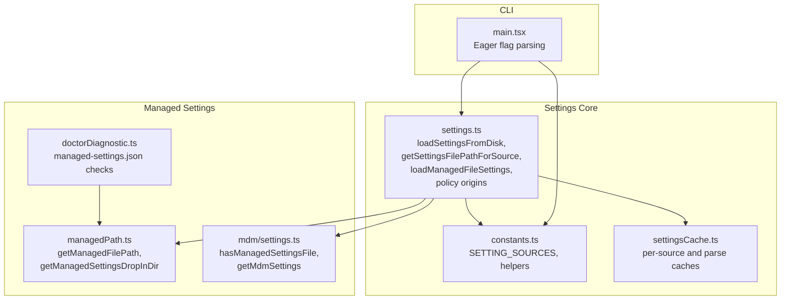
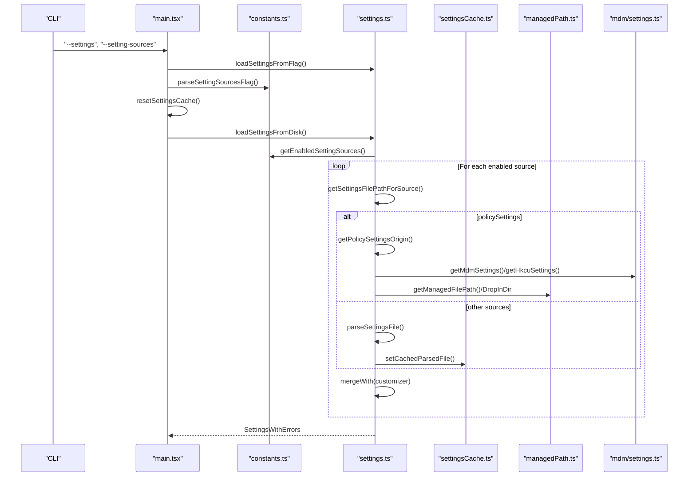
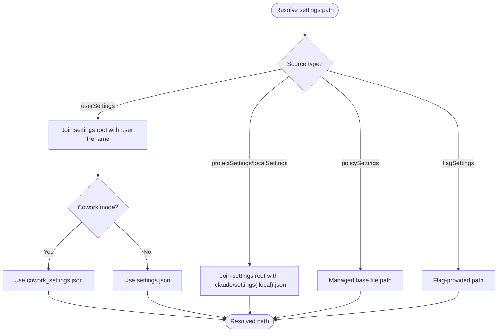
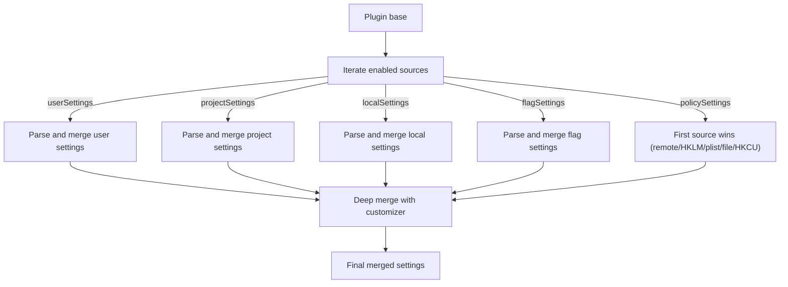
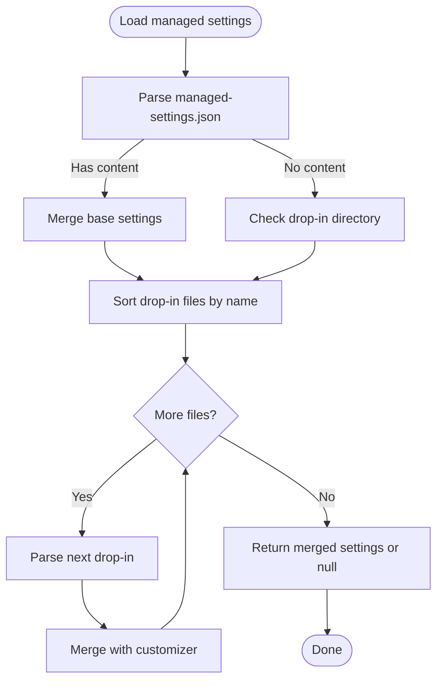
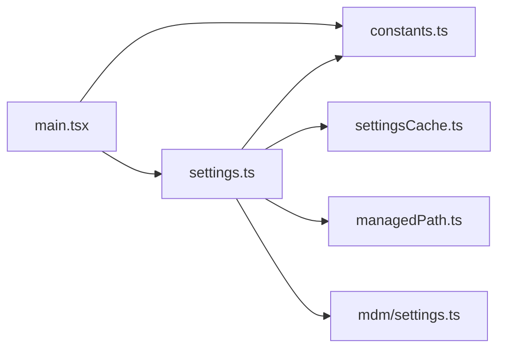

# Configuration Sources and File Structure

<cite>
**Referenced Files in This Document**
- [settings.ts](file://claude_code_src/restored-src/src/utils/settings/settings.ts)
- [constants.ts](file://claude_code_src/restored-src/src/utils/settings/constants.ts)
- [managedPath.ts](file://claude_code_src/restored-src/src/utils/settings/managedPath.ts)
- [settingsCache.ts](file://claude_code_src/restored-src/src/utils/settings/settingsCache.ts)
- [main.tsx](file://claude_code_src/restored-src/src/main.tsx)
- [mdm/settings.ts](file://claude_code_src/restored-src/src/utils/settings/mdm/settings.ts)
- [doctorDiagnostic.ts](file://claude_code_src/restored-src/src/utils/doctorDiagnostic.ts)
</cite>

## Table of Contents
1. [Introduction](#introduction)
2. [Project Structure](#project-structure)
3. [Core Components](#core-components)
4. [Architecture Overview](#architecture-overview)
5. [Detailed Component Analysis](#detailed-component-analysis)
6. [Dependency Analysis](#dependency-analysis)
7. [Performance Considerations](#performance-considerations)
8. [Troubleshooting Guide](#troubleshooting-guide)
9. [Conclusion](#conclusion)

## Introduction
This document explains the configuration sources and file structure used by the Claude Code Python IDE. It covers the five main configuration sources, their intended use cases, file path resolution, platform-specific locations, cowork mode variations, and how they interact with the settings merging system. It also documents file-based policy management with drop-in directories and administrative overrides.

## Project Structure
The configuration system is implemented primarily in the settings utilities and integrates with CLI flag processing and platform detection. Key areas:
- Settings sources and merging logic
- CLI flag parsing for settings and source filtering
- Platform-aware managed settings paths
- Caching and validation layers

**Diagram sources**
- [main.tsx:469-536](file://claude_code_src/restored-src/src/main.tsx#L469-L536)
- [constants.ts:1-203](file://claude_code_src/restored-src/src/utils/settings/constants.ts#L1-L203)
- [settings.ts:1-200](file://claude_code_src/restored-src/src/utils/settings/settings.ts#L1-L200)
- [settings.ts:500-700](file://claude_code_src/restored-src/src/utils/settings/settings.ts#L500-L700)
- [settingsCache.ts:1-45](file://claude_code_src/restored-src/src/utils/settings/settingsCache.ts#L1-L45)
- [managedPath.ts:1-35](file://claude_code_src/restored-src/src/utils/settings/managedPath.ts#L1-L35)
- [mdm/settings.ts:272-316](file://claude_code_src/restored-src/src/utils/settings/mdm/settings.ts#L272-L316)
- [doctorDiagnostic.ts:322-349](file://claude_code_src/restored-src/src/utils/doctorDiagnostic.ts#L322-L349)

**Section sources**
- [constants.ts:1-203](file://claude_code_src/restored-src/src/utils/settings/constants.ts#L1-L203)
- [settings.ts:1-200](file://claude_code_src/restored-src/src/utils/settings/settings.ts#L1-L200)
- [settings.ts:500-700](file://claude_code_src/restored-src/src/utils/settings/settings.ts#L500-L700)
- [settingsCache.ts:1-45](file://claude_code_src/restored-src/src/utils/settings/settingsCache.ts#L1-L45)
- [managedPath.ts:1-35](file://claude_code_src/restored-src/src/utils/settings/managedPath.ts#L1-L35)
- [mdm/settings.ts:272-316](file://claude_code_src/restored-src/src/utils/settings/mdm/settings.ts#L272-L316)
- [doctorDiagnostic.ts:322-349](file://claude_code_src/restored-src/src/utils/doctorDiagnostic.ts#L322-L349)

## Core Components
This section outlines the five configuration sources and their roles:

- User settings (settings.json or cowork_settings.json): Global user preferences stored under the settings root.
- Project settings (.claude/settings.json): Shared per-directory settings for a project.
- Local settings (.claude/settings.local.json): Per-project settings that are gitignored and user-specific.
- Policy settings (managed-settings.json + managed-settings.d/ drop-ins): Enterprise-managed settings with administrative precedence.
- Flag settings (CLI flags): Runtime overrides via command-line arguments.

Each source has a dedicated file path resolver and participates in a layered merging pipeline. Policy settings use a “first source wins” approach among remote, MDM, file-based, and HKCU sources.

**Section sources**
- [constants.ts:7-22](file://claude_code_src/restored-src/src/utils/settings/constants.ts#L7-L22)
- [settings.ts:255-307](file://claude_code_src/restored-src/src/utils/settings/settings.ts#L255-L307)
- [settings.ts:370-381](file://claude_code_src/restored-src/src/utils/settings/settings.ts#L370-L381)
- [settings.ts:674-711](file://claude_code_src/restored-src/src/utils/settings/settings.ts#L674-L711)

## Architecture Overview
The settings architecture resolves file paths per source, validates and merges content, and applies precedence rules. CLI flags can limit which sources are considered and can inject inline settings.

**Diagram sources**
- [main.tsx:469-536](file://claude_code_src/restored-src/src/main.tsx#L469-L536)
- [constants.ts:128-167](file://claude_code_src/restored-src/src/utils/settings/constants.ts#L128-L167)
- [settings.ts:645-711](file://claude_code_src/restored-src/src/utils/settings/settings.ts#L645-L711)
- [settings.ts:178-200](file://claude_code_src/restored-src/src/utils/settings/settings.ts#L178-L200)
- [settingsCache.ts:15-45](file://claude_code_src/restored-src/src/utils/settings/settingsCache.ts#L15-L45)
- [managedPath.ts:8-34](file://claude_code_src/restored-src/src/utils/settings/managedPath.ts#L8-L34)
- [mdm/settings.ts:272-316](file://claude_code_src/restored-src/src/utils/settings/mdm/settings.ts#L272-L316)

## Detailed Component Analysis

### Five Configuration Sources and Their Intended Use Cases
- User settings (settings.json or cowork_settings.json)
  - Purpose: Persistent global user preferences.
  - Resolution: Under the settings root; filename depends on cowork mode.
- Project settings (.claude/settings.json)
  - Purpose: Shared configuration for a project directory.
- Local settings (.claude/settings.local.json)
  - Purpose: Per-user, per-project overrides that are gitignored.
- Policy settings (managed-settings.json + managed-settings.d/)
  - Purpose: Enterprise-managed defaults and overrides via administrative files.
- Flag settings (CLI flags)
  - Purpose: Runtime overrides and source filtering.

**Section sources**
- [settings.ts:255-307](file://claude_code_src/restored-src/src/utils/settings/settings.ts#L255-L307)
- [settings.ts:274-296](file://claude_code_src/restored-src/src/utils/settings/settings.ts#L274-L296)
- [constants.ts:7-22](file://claude_code_src/restored-src/src/utils/settings/constants.ts#L7-L22)

### File Path Resolution Logic and Platform-Specific Locations
- User and project/local settings:
  - Paths are computed from a settings root per source.
  - The filename for user settings switches between settings.json and cowork_settings.json depending on cowork mode.
- Managed settings:
  - Base file path: managed-settings.json under a platform-specific directory.
  - Drop-in directory: managed-settings.d/, containing .json files merged in alphabetical order.
- Platform-specific managed settings roots:
  - macOS: /Library/Application Support/ClaudeCode
  - Windows: C:\Program Files\ClaudeCode
  - Linux/other: /etc/claude-code

**Diagram sources**
- [settings.ts:255-307](file://claude_code_src/restored-src/src/utils/settings/settings.ts#L255-L307)
- [settings.ts:274-296](file://claude_code_src/restored-src/src/utils/settings/settings.ts#L274-L296)
- [managedPath.ts:8-34](file://claude_code_src/restored-src/src/utils/settings/managedPath.ts#L8-L34)

**Section sources**
- [settings.ts:255-307](file://claude_code_src/restored-src/src/utils/settings/settings.ts#L255-L307)
- [settings.ts:274-296](file://claude_code_src/restored-src/src/utils/settings/settings.ts#L274-L296)
- [managedPath.ts:8-34](file://claude_code_src/restored-src/src/utils/settings/managedPath.ts#L8-L34)

### Cowork Mode Variations
- User settings filename switches based on cowork mode detection:
  - Session state or environment variable determines whether to use cowork_settings.json or settings.json.
- CLI flag processing occurs early to set the flag settings path and reset caches.

**Section sources**
- [settings.ts:255-272](file://claude_code_src/restored-src/src/utils/settings/settings.ts#L255-L272)
- [main.tsx:469-496](file://claude_code_src/restored-src/src/main.tsx#L469-L496)

### Settings Merging System
- Enabled sources are determined by allowed sources plus policy and flag settings.
- Merging order:
  - Plugin base (lowest priority)
  - User, Project, Local, Flag, Policy (higher to highest)
- Policy settings use “first source wins” among remote, MDM, file-based, and HKCU.
- Arrays are merged by concatenating and deduplicating; other values use default deep merge behavior.
- Parsing and caching:
  - parseSettingsFile caches parsed results and clones them to avoid mutation.
  - Per-source cache tracks each source’s settings independently.

**Diagram sources**
- [settings.ts:645-711](file://claude_code_src/restored-src/src/utils/settings/settings.ts#L645-L711)
- [settings.ts:529-547](file://claude_code_src/restored-src/src/utils/settings/settings.ts#L529-L547)
- [settingsCache.ts:15-45](file://claude_code_src/restored-src/src/utils/settings/settingsCache.ts#L15-L45)

**Section sources**
- [constants.ts:159-177](file://claude_code_src/restored-src/src/utils/settings/constants.ts#L159-L177)
- [settings.ts:645-711](file://claude_code_src/restored-src/src/utils/settings/settings.ts#L645-L711)
- [settings.ts:529-547](file://claude_code_src/restored-src/src/utils/settings/settings.ts#L529-L547)
- [settingsCache.ts:15-45](file://claude_code_src/restored-src/src/utils/settings/settingsCache.ts#L15-L45)

### File-Based Policy Management with Drop-In Directories
- Base file: managed-settings.json
- Drop-in directory: managed-settings.d/ with .json files merged in alphabetical order.
- Presence detection:
  - hasManagedSettingsFile checks base and drop-in presence to decide whether to skip HKCU.
- Administrative overrides:
  - Remote managed settings take highest precedence.
  - MDM (HKLM/plist) follows.
  - File-based managed-settings.json and drop-ins follow.
  - HKCU is last resort.

**Diagram sources**
- [settings.ts:74-121](file://claude_code_src/restored-src/src/utils/settings/settings.ts#L74-L121)
- [mdm/settings.ts:280-316](file://claude_code_src/restored-src/src/utils/settings/mdm/settings.ts#L280-L316)

**Section sources**
- [settings.ts:74-121](file://claude_code_src/restored-src/src/utils/settings/settings.ts#L74-L121)
- [mdm/settings.ts:280-316](file://claude_code_src/restored-src/src/utils/settings/mdm/settings.ts#L280-L316)
- [managedPath.ts:32-34](file://claude_code_src/restored-src/src/utils/settings/managedPath.ts#L32-L34)

### CLI Flags and Source Filtering
- Early parsing:
  - --settings loads a settings file and sets the flag settings path.
  - --setting-sources filters which sources are enabled (user, project, local).
- Behavior:
  - Allowed sources are combined with policy and flag settings.
  - Parsing errors cause immediate diagnostics and exit.

**Section sources**
- [main.tsx:469-536](file://claude_code_src/restored-src/src/main.tsx#L469-L536)
- [constants.ts:128-167](file://claude_code_src/restored-src/src/utils/settings/constants.ts#L128-L167)

### Examples of Configuration File Types and Use Cases
- User settings (settings.json or cowork_settings.json)
  - Use case: Personal preferences, agent defaults, editor behavior.
  - Resolution: Under settings root; filename depends on cowork mode.
- Project settings (.claude/settings.json)
  - Use case: Team-wide defaults for a repository.
- Local settings (.claude/settings.local.json)
  - Use case: Developer-specific overrides that should not be committed.
- Policy settings (managed-settings.json + managed-settings.d/)
  - Use case: Enterprise-enforced policies, security baselines, and team-specific configurations distributed as drop-ins.
- Flag settings (CLI flags)
  - Use case: Temporary overrides, CI environments, or per-invocation customization.

**Section sources**
- [settings.ts:255-307](file://claude_code_src/restored-src/src/utils/settings/settings.ts#L255-L307)
- [settings.ts:274-296](file://claude_code_src/restored-src/src/utils/settings/settings.ts#L274-L296)
- [constants.ts:7-22](file://claude_code_src/restored-src/src/utils/settings/constants.ts#L7-L22)

## Dependency Analysis
The settings system exhibits clear layering:
- CLI entrypoint depends on constants and settings.
- Settings service depends on constants, caching, managed path utilities, and MDM helpers.
- Managed settings rely on platform detection and drop-in directory conventions.

**Diagram sources**
- [main.tsx:469-536](file://claude_code_src/restored-src/src/main.tsx#L469-L536)
- [constants.ts:1-203](file://claude_code_src/restored-src/src/utils/settings/constants.ts#L1-L203)
- [settings.ts:1-200](file://claude_code_src/restored-src/src/utils/settings/settings.ts#L1-L200)
- [settingsCache.ts:1-45](file://claude_code_src/restored-src/src/utils/settings/settingsCache.ts#L1-L45)
- [managedPath.ts:1-35](file://claude_code_src/restored-src/src/utils/settings/managedPath.ts#L1-L35)
- [mdm/settings.ts:272-316](file://claude_code_src/restored-src/src/utils/settings/mdm/settings.ts#L272-L316)

**Section sources**
- [main.tsx:469-536](file://claude_code_src/restored-src/src/main.tsx#L469-L536)
- [constants.ts:1-203](file://claude_code_src/restored-src/src/utils/settings/constants.ts#L1-L203)
- [settings.ts:1-200](file://claude_code_src/restored-src/src/utils/settings/settings.ts#L1-L200)
- [settingsCache.ts:1-45](file://claude_code_src/restored-src/src/utils/settings/settingsCache.ts#L1-L45)
- [managedPath.ts:1-35](file://claude_code_src/restored-src/src/utils/settings/managedPath.ts#L1-L35)
- [mdm/settings.ts:272-316](file://claude_code_src/restored-src/src/utils/settings/mdm/settings.ts#L272-L316)

## Performance Considerations
- Caching:
  - Per-file parse cache avoids repeated disk reads and JSON parsing.
  - Per-source cache reduces redundant computation when retrieving individual sources.
- Merging:
  - Custom merge preserves arrays while deep-merging objects, minimizing unnecessary allocations.
- Early flag processing:
  - Reduces initialization overhead by limiting which sources are loaded.

[No sources needed since this section provides general guidance]

## Troubleshooting Guide
- Managed settings validation:
  - Doctor diagnostics inspect managed-settings.json for incorrect types and suggest fixes.
- Managed settings presence:
  - hasManagedSettingsFile detects base and drop-in presence to optimize HKCU skipping.
- File system errors:
  - Missing or broken symlinks are logged at debug level; other I/O errors are logged with context.

**Section sources**
- [doctorDiagnostic.ts:322-349](file://claude_code_src/restored-src/src/utils/doctorDiagnostic.ts#L322-L349)
- [mdm/settings.ts:280-316](file://claude_code_src/restored-src/src/utils/settings/mdm/settings.ts#L280-L316)
- [settings.ts:157-170](file://claude_code_src/restored-src/src/utils/settings/settings.ts#L157-L170)

## Conclusion
The Claude Code Python IDE implements a robust, layered settings system supporting user, project, local, policy, and flag sources. Platform-aware managed settings directories enable enterprise-grade policy distribution via base and drop-in files. CLI flags allow precise control over source loading and runtime overrides. The merging logic and caching layers ensure predictable precedence and efficient operation.