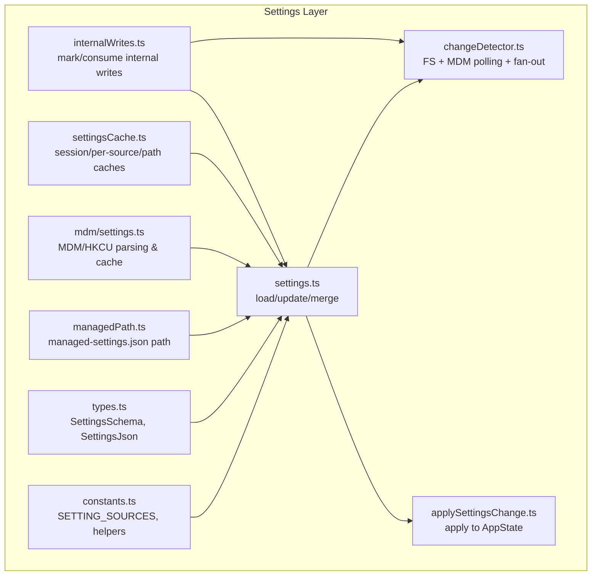
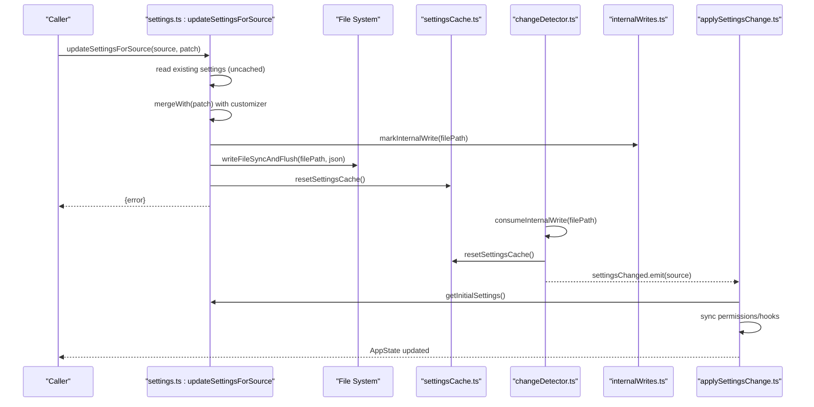
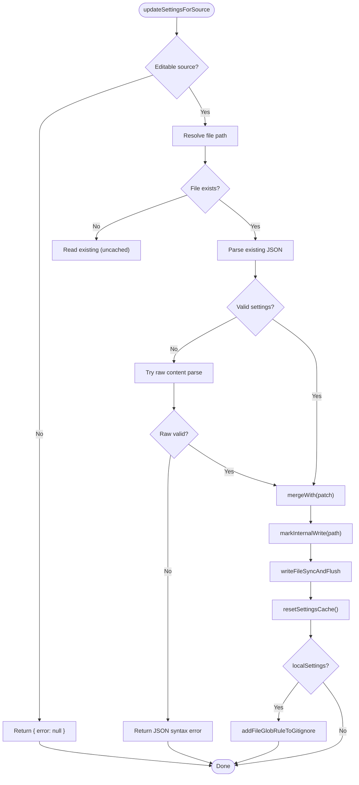
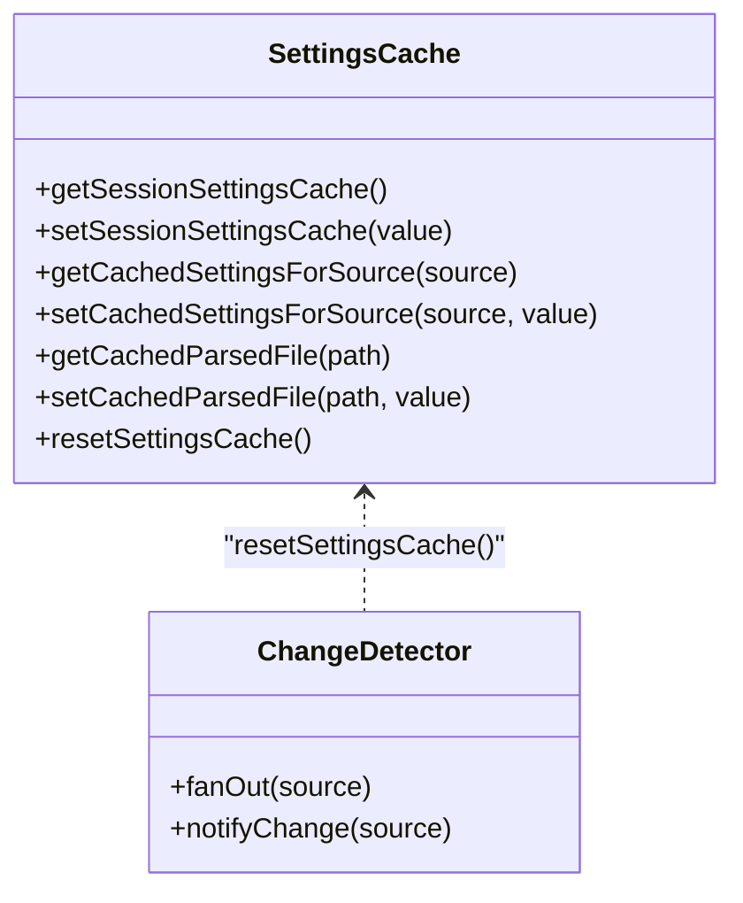
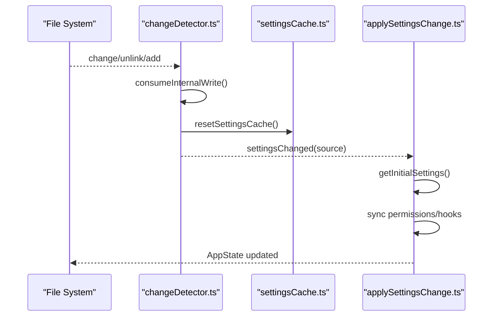
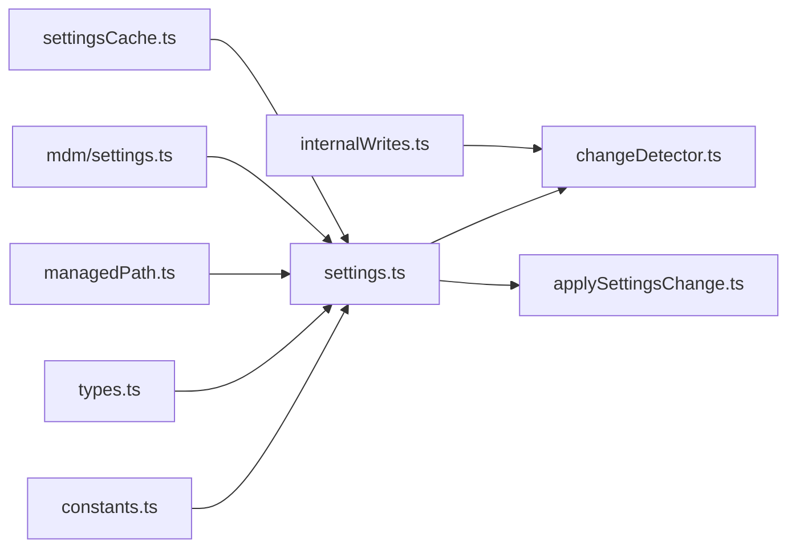

# Settings Management Operations

<cite>
**Referenced Files in This Document**
- [settings.ts](file://claude_code_src/restored-src/src/utils/settings/settings.ts)
- [settingsCache.ts](file://claude_code_src/restored-src/src/utils/settings/settingsCache.ts)
- [internalWrites.ts](file://claude_code_src/restored-src/src/utils/settings/internalWrites.ts)
- [changeDetector.ts](file://claude_code_src/restored-src/src/utils/settings/changeDetector.ts)
- [applySettingsChange.ts](file://claude_code_src/restored-src/src/utils/settings/applySettingsChange.ts)
- [constants.ts](file://claude_code_src/restored-src/src/utils/settings/constants.ts)
- [managedPath.ts](file://claude_code_src/restored-src/src/utils/settings/managedPath.ts)
- [mdm/settings.ts](file://claude_code_src/restored-src/src/utils/settings/mdm/settings.ts)
- [types.ts](file://claude_code_src/restored-src/src/utils/settings/types.ts)
</cite>

## Table of Contents
1. [Introduction](#introduction)
2. [Project Structure](#project-structure)
3. [Core Components](#core-components)
4. [Architecture Overview](#architecture-overview)
5. [Detailed Component Analysis](#detailed-component-analysis)
6. [Dependency Analysis](#dependency-analysis)
7. [Performance Considerations](#performance-considerations)
8. [Troubleshooting Guide](#troubleshooting-guide)
9. [Conclusion](#conclusion)

## Introduction
This document explains the complete lifecycle of settings management in Claude Code Python IDE, covering loading, updating, caching, persistence, and propagation. It focuses on the updateSettingsForSource function, file writing mechanisms, cache invalidation strategies, internal write detection, file system error handling, and transaction-like operations for settings updates. It also provides examples of programmatic updates, bulk operations, rollback scenarios, performance considerations, atomic operations, and how changes propagate through the system.

## Project Structure
The settings subsystem is organized around a layered approach:
- Constants define the setting sources and their priorities.
- The settings loader reads and merges settings from multiple sources.
- Caches optimize repeated reads and writes.
- Change detection monitors file system events and MDM polling.
- Internal write markers prevent watchers from echoing their own writes.
- Application state updates react to settings changes.

**Diagram sources**
- [constants.ts:7-22](file://claude_code_src/restored-src/src/utils/settings/constants.ts#L7-L22)
- [types.ts:255-800](file://claude_code_src/restored-src/src/utils/settings/types.ts#L255-L800)
- [managedPath.ts:8-34](file://claude_code_src/restored-src/src/utils/settings/managedPath.ts#L8-L34)
- [mdm/settings.ts:124-134](file://claude_code_src/restored-src/src/utils/settings/mdm/settings.ts#L124-L134)
- [settingsCache.ts:5-81](file://claude_code_src/restored-src/src/utils/settings/settingsCache.ts#L5-L81)
- [settings.ts:416-524](file://claude_code_src/restored-src/src/utils/settings/settings.ts#L416-L524)
- [changeDetector.ts:437-450](file://claude_code_src/restored-src/src/utils/settings/changeDetector.ts#L437-L450)
- [internalWrites.ts:17-33](file://claude_code_src/restored-src/src/utils/settings/internalWrites.ts#L17-L33)
- [applySettingsChange.ts:33-92](file://claude_code_src/restored-src/src/utils/settings/applySettingsChange.ts#L33-L92)

**Section sources**
- [constants.ts:7-22](file://claude_code_src/restored-src/src/utils/settings/constants.ts#L7-L22)
- [settings.ts:645-868](file://claude_code_src/restored-src/src/utils/settings/settings.ts#L645-L868)

## Core Components
- Settings loader and merger: Loads from user/project/local/flag/policy sources, validates, merges, and caches results.
- Update pipeline: Validates and persists changes to editable sources, marks internal writes, writes atomically, invalidates caches, and notifies listeners.
- Change detection: Watches file system and polls MDM/HKCU for changes; suppresses internal echoes; fans out notifications.
- Cache management: Session-level, per-source, and path-level caches with deterministic invalidation.
- Application integration: Applies settings changes to AppState, permissions, and hooks.

**Section sources**
- [settings.ts:416-524](file://claude_code_src/restored-src/src/utils/settings/settings.ts#L416-L524)
- [settingsCache.ts:55-81](file://claude_code_src/restored-src/src/utils/settings/settingsCache.ts#L55-L81)
- [changeDetector.ts:437-450](file://claude_code_src/restored-src/src/utils/settings/changeDetector.ts#L437-L450)
- [applySettingsChange.ts:33-92](file://claude_code_src/restored-src/src/utils/settings/applySettingsChange.ts#L33-L92)

## Architecture Overview
The settings lifecycle spans several stages:
1. Load: Read and merge sources; cache results.
2. Update: Validate and persist changes to editable sources; mark internal write; write atomically; invalidate caches.
3. Detect: Watch file system and poll MDM/HKCU; suppress internal echoes; fan out notifications.
4. Apply: Re-read settings, sync permissions/hooks, update AppState.

**Diagram sources**
- [settings.ts:416-524](file://claude_code_src/restored-src/src/utils/settings/settings.ts#L416-L524)
- [settingsCache.ts:55-59](file://claude_code_src/restored-src/src/utils/settings/settingsCache.ts#L55-L59)
- [internalWrites.ts:17-33](file://claude_code_src/restored-src/src/utils/settings/internalWrites.ts#L17-L33)
- [changeDetector.ts:268-302](file://claude_code_src/restored-src/src/utils/settings/changeDetector.ts#L268-L302)
- [applySettingsChange.ts:33-92](file://claude_code_src/restored-src/src/utils/settings/applySettingsChange.ts#L33-L92)

## Detailed Component Analysis

### updateSettingsForSource: Programmatic Updates and Persistence
- Purpose: Persist changes to editable sources (user, project, local). Policy and flag sources are read-only.
- Validation and fallback:
  - If existing file is invalid JSON, attempts to parse raw content; if still invalid, returns an error instead of overwriting.
  - If existing file is valid but schema-invalid, merges with provided patch and validates again.
- Merge behavior:
  - Arrays are replaced (caller computes final state).
  - Undefined deletes keys from records.
  - Nested objects merged with customizer.
- Atomic write:
  - Creates directory if missing.
  - Marks internal write before writing.
  - Writes with flush to reduce partial-write risk.
- Cache invalidation:
  - Resets session and per-source caches to ensure next read reflects persisted changes.
- Gitignore integration:
  - Adds local settings glob asynchronously after successful write.

**Diagram sources**
- [settings.ts:416-524](file://claude_code_src/restored-src/src/utils/settings/settings.ts#L416-L524)
- [internalWrites.ts:17-19](file://claude_code_src/restored-src/src/utils/settings/internalWrites.ts#L17-L19)
- [settingsCache.ts:55-59](file://claude_code_src/restored-src/src/utils/settings/settingsCache.ts#L55-L59)

**Section sources**
- [settings.ts:416-524](file://claude_code_src/restored-src/src/utils/settings/settings.ts#L416-L524)

### File Writing Mechanisms and Atomicity
- Directory creation: Ensures the target directory exists before writing.
- Internal write marking: Timestamps the path to suppress watcher echoes.
- Flush write: Uses a flush-capable writer to reduce partial-write risk.
- Delete-and-recreate safety: Change detector uses a grace window to treat recreate as change, avoiding premature deletions.

**Section sources**
- [settings.ts:433-503](file://claude_code_src/restored-src/src/utils/settings/settings.ts#L433-L503)
- [internalWrites.ts:17-33](file://claude_code_src/restored-src/src/utils/settings/internalWrites.ts#L17-L33)
- [changeDetector.ts:324-360](file://claude_code_src/restored-src/src/utils/settings/changeDetector.ts#L324-L360)

### Cache Invalidation Strategies
- Session cache: Stores merged settings and errors for the lifetime of the process.
- Per-source cache: Stores parsed settings for each SettingSource.
- Path cache: Stores parsed file results keyed by path.
- Reset policy: Centralized reset in change detector fan-out to avoid N-way cache thrashing.

**Diagram sources**
- [settingsCache.ts:5-81](file://claude_code_src/restored-src/src/utils/settings/settingsCache.ts#L5-L81)
- [changeDetector.ts:437-450](file://claude_code_src/restored-src/src/utils/settings/changeDetector.ts#L437-L450)

**Section sources**
- [settingsCache.ts:55-81](file://claude_code_src/restored-src/src/utils/settings/settingsCache.ts#L55-L81)
- [changeDetector.ts:437-450](file://claude_code_src/restored-src/src/utils/settings/changeDetector.ts#L437-L450)

### Internal Write Detection and Echo Suppression
- Marking: Before writing, the path is timestamped.
- Consumption: During file events, if a recent internal write is detected within a window, the event is suppressed.
- Window: A fixed millisecond window prevents suppressing legitimate external changes indefinitely.

**Section sources**
- [internalWrites.ts:17-33](file://claude_code_src/restored-src/src/utils/settings/internalWrites.ts#L17-L33)
- [changeDetector.ts:283-286](file://claude_code_src/restored-src/src/utils/settings/changeDetector.ts#L283-L286)

### File System Error Handling
- Broken symlinks and missing files: Logged at a debugging level; does not crash.
- Non-ENOENT errors: Logged as diagnostics.
- Empty files: Interpreted as empty settings.
- JSON parsing: Invalid JSON yields warnings and empty settings; raw-parse fallback used when validation fails.

**Section sources**
- [settings.ts:157-170](file://claude_code_src/restored-src/src/utils/settings/settings.ts#L157-L170)
- [settings.ts:201-231](file://claude_code_src/restored-src/src/utils/settings/settings.ts#L201-L231)

### Transaction-like Operations and Rollback Scenarios
- Transaction semantics:
  - Merge occurs in-memory against the latest disk state (uncached read).
  - If write fails, caches are reset; the next read reverts to the previous disk state.
- Rollback:
  - On write failure, caches are reset and errors logged; no partial state is exposed.
  - Consumers should re-read settings after failures.

**Section sources**
- [settings.ts:433-524](file://claude_code_src/restored-src/src/utils/settings/settings.ts#L433-L524)
- [settingsCache.ts:55-59](file://claude_code_src/restored-src/src/utils/settings/settingsCache.ts#L55-L59)

### Propagation Through the System
- Change detection: Watches files and polls MDM/HKCU; suppresses internal echoes; fans out notifications.
- Application state: Re-reads settings, syncs permissions and hooks, updates AppState.

**Diagram sources**
- [changeDetector.ts:268-302](file://claude_code_src/restored-src/src/utils/settings/changeDetector.ts#L268-L302)
- [settingsCache.ts:55-59](file://claude_code_src/restored-src/src/utils/settings/settingsCache.ts#L55-L59)
- [applySettingsChange.ts:33-92](file://claude_code_src/restored-src/src/utils/settings/applySettingsChange.ts#L33-L92)

**Section sources**
- [changeDetector.ts:437-450](file://claude_code_src/restored-src/src/utils/settings/changeDetector.ts#L437-L450)
- [applySettingsChange.ts:33-92](file://claude_code_src/restored-src/src/utils/settings/applySettingsChange.ts#L33-L92)

### Examples and Patterns

- Programmatic settings updates:
  - Use updateSettingsForSource with an editable source to persist changes atomically.
  - After the call, caches are reset; listeners receive notifications; AppState updates.

- Bulk operations:
  - Merge multiple patches in-memory (e.g., via a loop computing a final state) and call updateSettingsForSource once to minimize writes and cache thrashing.

- Rollback scenarios:
  - On write failure, resetSettingsCache() is invoked; subsequent reads reflect the prior disk state until a successful write occurs.

- Managed settings propagation:
  - Policy settings use “first source wins” (remote > HKLM/plist > file > HKCU). Changes are detected via MDM polling and fan-out.

**Section sources**
- [settings.ts:416-524](file://claude_code_src/restored-src/src/utils/settings/settings.ts#L416-L524)
- [mdm/settings.ts:124-134](file://claude_code_src/restored-src/src/utils/settings/mdm/settings.ts#L124-L134)
- [changeDetector.ts:381-418](file://claude_code_src/restored-src/src/utils/settings/changeDetector.ts#L381-L418)

## Dependency Analysis
- Settings loader depends on:
  - Constants for source ordering.
  - Types for schema validation.
  - Managed path for policy file locations.
  - MDM module for admin-only sources.
  - Cache module for performance.
- Change detector depends on:
  - Settings loader for path resolution.
  - Internal writes for echo suppression.
  - MDM module for polling.
  - Cache module for invalidation.
- Application integration depends on:
  - Settings loader for fresh state.
  - Permissions and hooks modules for side effects.

**Diagram sources**
- [constants.ts:7-22](file://claude_code_src/restored-src/src/utils/settings/constants.ts#L7-L22)
- [types.ts:255-800](file://claude_code_src/restored-src/src/utils/settings/types.ts#L255-L800)
- [managedPath.ts:8-34](file://claude_code_src/restored-src/src/utils/settings/managedPath.ts#L8-L34)
- [mdm/settings.ts:124-134](file://claude_code_src/restored-src/src/utils/settings/mdm/settings.ts#L124-L134)
- [settingsCache.ts:5-81](file://claude_code_src/restored-src/src/utils/settings/settingsCache.ts#L5-L81)
- [settings.ts:416-524](file://claude_code_src/restored-src/src/utils/settings/settings.ts#L416-L524)
- [changeDetector.ts:437-450](file://claude_code_src/restored-src/src/utils/settings/changeDetector.ts#L437-L450)
- [internalWrites.ts:17-33](file://claude_code_src/restored-src/src/utils/settings/internalWrites.ts#L17-L33)
- [applySettingsChange.ts:33-92](file://claude_code_src/restored-src/src/utils/settings/applySettingsChange.ts#L33-L92)

**Section sources**
- [settings.ts:645-868](file://claude_code_src/restored-src/src/utils/settings/settings.ts#L645-L868)
- [changeDetector.ts:437-450](file://claude_code_src/restored-src/src/utils/settings/changeDetector.ts#L437-L450)

## Performance Considerations
- Caching:
  - Session-level cache avoids repeated disk I/O.
  - Per-source and path caches deduplicate reads and parsing.
- Fan-out optimization:
  - Single producer (change detector) resets caches; listeners avoid redundant disk reloads.
- Stability thresholds:
  - File watcher waits for write stabilization and uses polling intervals to avoid partial reads.
- MDM polling:
  - Periodic polling balances responsiveness with resource usage.

[No sources needed since this section provides general guidance]

## Troubleshooting Guide
- Settings not updating:
  - Verify the source is editable; policy and flag sources are read-only.
  - Check for JSON syntax errors; invalid files return errors instead of overwrites.
- Infinite loops or thrashing:
  - Ensure change detector fan-out resets caches centrally; avoid per-listener resets.
- Internal write echoes:
  - Confirm internal write timestamps are recorded and consumed within the window.
- MDM changes not reflected:
  - Confirm polling is running and snapshots differ; verify cache updates and fan-out.

**Section sources**
- [settings.ts:416-524](file://claude_code_src/restored-src/src/utils/settings/settings.ts#L416-L524)
- [changeDetector.ts:381-418](file://claude_code_src/restored-src/src/utils/settings/changeDetector.ts#L381-L418)
- [internalWrites.ts:26-33](file://claude_code_src/restored-src/src/utils/settings/internalWrites.ts#L26-L33)

## Conclusion
Claude Code’s settings management provides a robust, layered system for loading, validating, merging, persisting, and propagating configuration changes. The updateSettingsForSource function encapsulates safe, atomic writes with cache invalidation and internal echo suppression. Change detection and MDM polling ensure timely propagation, while centralized fan-out minimizes redundant disk reads. Together, these mechanisms deliver predictable, resilient settings operations suitable for both interactive and headless usage.