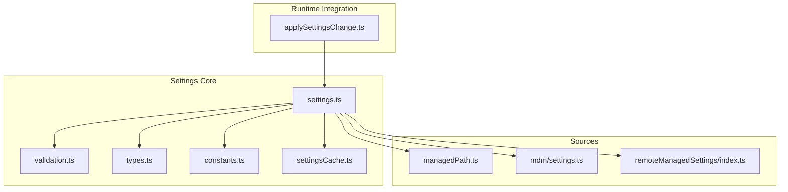
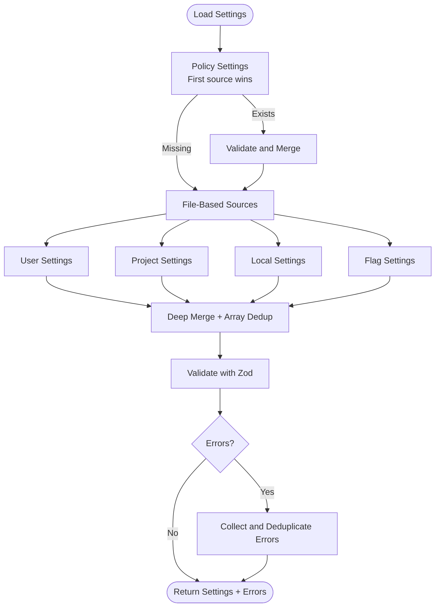
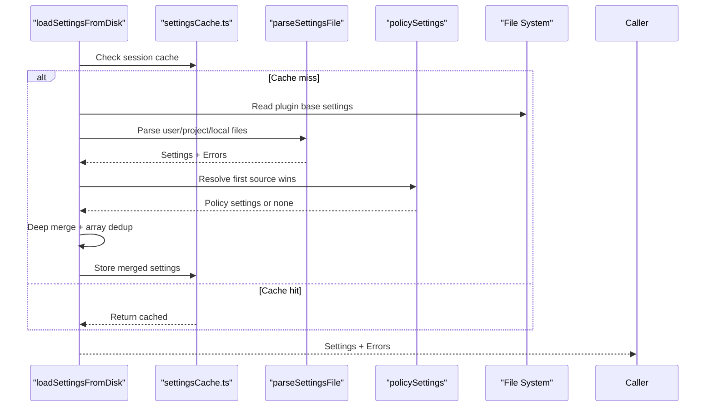
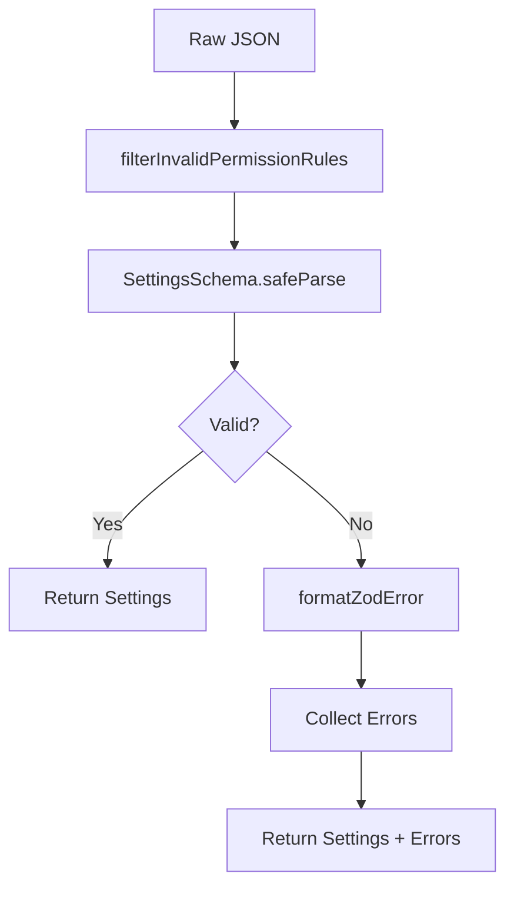
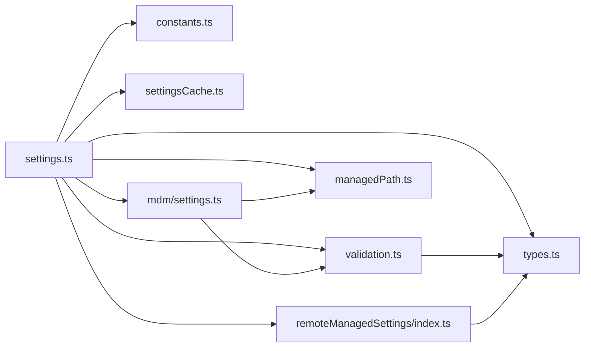

# Settings Management System

<cite>
**Referenced Files in This Document**
- [settings.ts](file://claude_code_src/restored-src/src/utils/settings/settings.ts)
- [validation.ts](file://claude_code_src/restored-src/src/utils/settings/validation.ts)
- [types.ts](file://claude_code_src/restored-src/src/utils/settings/types.ts)
- [constants.ts](file://claude_code_src/restored-src/src/utils/settings/constants.ts)
- [settingsCache.ts](file://claude_code_src/restored-src/src/utils/settings/settingsCache.ts)
- [managedPath.ts](file://claude_code_src/restored-src/src/utils/settings/managedPath.ts)
- [mdm/settings.ts](file://claude_code_src/restored-src/src/utils/settings/mdm/settings.ts)
- [remoteManagedSettings/index.ts](file://claude_code_src/restored-src/src/services/remoteManagedSettings/index.ts)
- [applySettingsChange.ts](file://claude_code_src/restored-src/src/utils/settings/applySettingsChange.ts)
</cite>

## Table of Contents
1. [Introduction](#introduction)
2. [Project Structure](#project-structure)
3. [Core Components](#core-components)
4. [Architecture Overview](#architecture-overview)
5. [Detailed Component Analysis](#detailed-component-analysis)
6. [Dependency Analysis](#dependency-analysis)
7. [Performance Considerations](#performance-considerations)
8. [Troubleshooting Guide](#troubleshooting-guide)
9. [Conclusion](#conclusion)

## Introduction
This document explains the settings management system in Claude Code Python IDE. It covers the hierarchical settings architecture (user, project, local, policy, and flag), the loading mechanism, file-based configuration sources, priority resolution order, validation using Zod schemas, error handling, configuration merging strategies, security considerations, and performance optimizations. Practical examples and troubleshooting guidance are included to help users and administrators configure and maintain settings effectively.

## Project Structure
The settings system is implemented primarily in the utils/settings package and integrates with services for remote managed settings and MDM (mobile device management) sources. Key modules include:
- settings.ts: Central orchestrator for loading, merging, and writing settings
- validation.ts: Zod-based validation and error formatting
- types.ts: Zod schema definitions for settings
- constants.ts: Source ordering and display helpers
- settingsCache.ts: Caches for merged and per-source settings
- managedPath.ts: Platform-specific managed settings directory resolution
- mdm/settings.ts: OS-level MDM integration (Windows HKLM/HKCU, macOS plist)
- remoteManagedSettings/index.ts: Remote settings service with caching and polling
- applySettingsChange.ts: Applies settings changes to app state and subsystems

**Diagram sources**
- [settings.ts:1-1016](file://claude_code_src/restored-src/src/utils/settings/settings.ts#L1-L1016)
- [validation.ts:1-266](file://claude_code_src/restored-src/src/utils/settings/validation.ts#L1-L266)
- [types.ts:1-1149](file://claude_code_src/restored-src/src/utils/settings/types.ts#L1-L1149)
- [constants.ts:1-203](file://claude_code_src/restored-src/src/utils/settings/constants.ts#L1-L203)
- [settingsCache.ts:1-81](file://claude_code_src/restored-src/src/utils/settings/settingsCache.ts#L1-L81)
- [managedPath.ts:1-35](file://claude_code_src/restored-src/src/utils/settings/managedPath.ts#L1-L35)
- [mdm/settings.ts:1-317](file://claude_code_src/restored-src/src/utils/settings/mdm/settings.ts#L1-L317)
- [remoteManagedSettings/index.ts:1-639](file://claude_code_src/restored-src/src/services/remoteManagedSettings/index.ts#L1-L639)
- [applySettingsChange.ts:1-93](file://claude_code_src/restored-src/src/utils/settings/applySettingsChange.ts#L1-L93)

**Section sources**
- [settings.ts:1-1016](file://claude_code_src/restored-src/src/utils/settings/settings.ts#L1-L1016)
- [constants.ts:1-203](file://claude_code_src/restored-src/src/utils/settings/constants.ts#L1-L203)

## Core Components
- Settings schema and validation: Zod-based schema validates user and policy settings, formats errors, and filters invalid permission rules.
- Source enumeration and priority: Ordered sources define precedence; policy uses “first source wins” while file-based sources merge with deep merge and array deduplication.
- File-based sources: User, project, and local settings use platform-aware paths; managed settings use drop-in files; flag settings are merged from CLI.
- Policy sources: Remote managed settings (enterprise), OS MDM (Windows HKLM/HKCU, macOS plist), file-based managed-settings.json and drop-ins, then HKCU.
- Caching: Session-wide and per-source caches reduce redundant disk reads and parsing.
- Change application: Subsystems (permissions, hooks, app state) react to settings changes via a change detector.

**Section sources**
- [validation.ts:1-266](file://claude_code_src/restored-src/src/utils/settings/validation.ts#L1-L266)
- [types.ts:1-1149](file://claude_code_src/restored-src/src/utils/settings/types.ts#L1-L1149)
- [constants.ts:1-203](file://claude_code_src/restored-src/src/utils/settings/constants.ts#L1-L203)
- [settingsCache.ts:1-81](file://claude_code_src/restored-src/src/utils/settings/settingsCache.ts#L1-L81)
- [settings.ts:645-796](file://claude_code_src/restored-src/src/utils/settings/settings.ts#L645-L796)

## Architecture Overview
The settings architecture follows a layered approach:
- Layer 1: Policy settings (highest precedence) via “first source wins”
- Layer 2: File-based sources (user, project, local) merged with deep merge and array deduplication
- Layer 3: Flag settings merged last
- Validation and error collection occur at each stage; invalid fields are preserved in files to aid repair

**Diagram sources**
- [settings.ts:645-796](file://claude_code_src/restored-src/src/utils/settings/settings.ts#L645-L796)
- [validation.ts:97-173](file://claude_code_src/restored-src/src/utils/settings/validation.ts#L97-L173)
- [constants.ts:7-22](file://claude_code_src/restored-src/src/utils/settings/constants.ts#L7-L22)

## Detailed Component Analysis

### Hierarchical Settings Architecture
- Sources and precedence:
  - policySettings: First source wins (remote > HKLM/plist > managed-settings.json > HKCU)
  - userSettings: ~/.claude/settings.json or cowork settings variant
  - projectSettings: .claude/settings.json in project root
  - localSettings: .claude/settings.local.json in project root (gitignored)
  - flagSettings: Inline settings from CLI flag plus file path
- Paths:
  - User settings path depends on cowork mode detection
  - Project/local paths resolve relative to original working directory
  - Managed settings path is platform-specific (/etc/claude-code on Unix-like, Program Files on Windows, /Library/Application Support on macOS)
- Policy origins:
  - Remote managed settings (enterprise)
  - OS MDM (Windows HKLM/HKCU, macOS plist)
  - File-based managed-settings.json and drop-in .json files
  - HKCU (lowest priority)

**Section sources**
- [settings.ts:239-307](file://claude_code_src/restored-src/src/utils/settings/settings.ts#L239-L307)
- [settings.ts:322-407](file://claude_code_src/restored-src/src/utils/settings/settings.ts#L322-L407)
- [managedPath.ts:8-34](file://claude_code_src/restored-src/src/utils/settings/managedPath.ts#L8-L34)
- [mdm/settings.ts:1-317](file://claude_code_src/restored-src/src/utils/settings/mdm/settings.ts#L1-L317)
- [remoteManagedSettings/index.ts:1-639](file://claude_code_src/restored-src/src/services/remoteManagedSettings/index.ts#L1-L639)

### Settings Loading Mechanism
- Entry points:
  - loadSettingsFromDisk: Loads and merges settings from all enabled sources
  - getSettingsForSource: Retrieves validated settings for a specific source
  - parseSettingsFile: Reads and parses a settings file with caching and error handling
- Behavior:
  - Starts with plugin settings base (lowest priority)
  - For policySettings, selects the first available source (first source wins)
  - For file-based sources, merges with deep merge and array deduplication
  - Deduplicates errors across files and sources
  - Skips duplicate files across sources
  - Merges flagSettings inline settings after file parsing

**Diagram sources**
- [settings.ts:645-796](file://claude_code_src/restored-src/src/utils/settings/settings.ts#L645-L796)
- [settingsCache.ts:1-81](file://claude_code_src/restored-src/src/utils/settings/settingsCache.ts#L1-L81)
- [validation.ts:97-173](file://claude_code_src/restored-src/src/utils/settings/validation.ts#L97-L173)

**Section sources**
- [settings.ts:645-796](file://claude_code_src/restored-src/src/utils/settings/settings.ts#L645-L796)
- [settings.ts:178-231](file://claude_code_src/restored-src/src/utils/settings/settings.ts#L178-L231)

### Settings Validation System (Zod)
- Schema validation:
  - SettingsSchema validates the entire settings object
  - Strict mode is used for file editing validation
  - filterInvalidPermissionRules removes invalid permission rules before schema validation to avoid total rejection
- Error formatting:
  - formatZodError converts Zod issues into human-readable errors with paths, expected types/values, and suggestions
- Error collection:
  - Errors are deduplicated by combining file path, field path, and message
  - Errors are aggregated across all sources and files

**Diagram sources**
- [validation.ts:179-217](file://claude_code_src/restored-src/src/utils/settings/validation.ts#L179-L217)
- [validation.ts:224-265](file://claude_code_src/restored-src/src/utils/settings/validation.ts#L224-L265)
- [types.ts:255-1073](file://claude_code_src/restored-src/src/utils/settings/types.ts#L255-L1073)

**Section sources**
- [validation.ts:97-173](file://claude_code_src/restored-src/src/utils/settings/validation.ts#L97-L173)
- [validation.ts:179-217](file://claude_code_src/restored-src/src/utils/settings/validation.ts#L179-L217)
- [validation.ts:224-265](file://claude_code_src/restored-src/src/utils/settings/validation.ts#L224-L265)

### Configuration Merging Strategies
- Deep merge:
  - lodash mergeWith with a customizer for arrays
  - Arrays are concatenated and deduplicated
  - Nested objects are merged recursively
- Deletion semantics:
  - Explicitly deleting a key requires setting it to undefined in the update payload
- First source wins for policy:
  - Highest-priority source that has content determines policy settings
- File-based vs. policy:
  - File-based sources (user, project, local) merge with deep merge
  - Policy source uses first source wins

**Section sources**
- [settings.ts:416-524](file://claude_code_src/restored-src/src/utils/settings/settings.ts#L416-L524)
- [settings.ts:538-547](file://claude_code_src/restored-src/src/utils/settings/settings.ts#L538-L547)
- [settings.ts:677-739](file://claude_code_src/restored-src/src/utils/settings/settings.ts#L677-L739)

### File-Based Configuration Sources
- User settings:
  - Path: ~/.claude/settings.json or cowork variant depending on mode
  - Used for global user preferences
- Project settings:
  - Path: .claude/settings.json in project root
  - Shared among team members
- Local settings:
  - Path: .claude/settings.local.json in project root
  - Gitignored; used for machine-local overrides
- Managed settings:
  - Base: managed-settings.json in platform-specific directory
  - Drop-ins: managed-settings.d/*.json, merged alphabetically (later files override earlier)
  - Supported on macOS (/Library/Application Support), Windows (Program Files), Linux (/etc)

**Section sources**
- [settings.ts:264-272](file://claude_code_src/restored-src/src/utils/settings/settings.ts#L264-L272)
- [settings.ts:298-307](file://claude_code_src/restored-src/src/utils/settings/settings.ts#L298-L307)
- [managedPath.ts:8-34](file://claude_code_src/restored-src/src/utils/settings/managedPath.ts#L8-L34)
- [settings.ts:74-121](file://claude_code_src/restored-src/src/utils/settings/settings.ts#L74-L121)

### Policy Settings Sources
- Remote managed settings:
  - Enterprise feature; fetched with ETag-based caching and retry logic
  - Fails open on errors; supports background polling
- OS MDM:
  - macOS: /Library/Managed Preferences com.anthropic.claudecode
  - Windows: HKLM/HKCU SOFTWARE\Policies\ClaudeCode
  - Linux: managed-settings.json/drop-ins in /etc/claude-code
- First source wins:
  - Highest-priority source that has content supplies all policy settings

**Section sources**
- [remoteManagedSettings/index.ts:1-639](file://claude_code_src/restored-src/src/services/remoteManagedSettings/index.ts#L1-L639)
- [mdm/settings.ts:1-317](file://claude_code_src/restored-src/src/utils/settings/mdm/settings.ts#L1-L317)
- [settings.ts:322-407](file://claude_code_src/restored-src/src/utils/settings/settings.ts#L322-L407)

### Settings Writing and Persistence
- Supported editable sources:
  - userSettings, projectSettings, localSettings
  - policySettings and flagSettings are read-only
- Write behavior:
  - Creates parent directories if missing
  - Reads existing settings with validation; if validation fails due to JSON syntax error, uses raw content to avoid overwriting
  - Merges with customizer supporting deletion via undefined and array replacement
  - Writes atomically with flush and invalidates caches
  - Adds local settings to .gitignore asynchronously

**Section sources**
- [settings.ts:416-524](file://claude_code_src/restored-src/src/utils/settings/settings.ts#L416-L524)

### Settings Change Application
- Change detection:
  - After settings change, caches are reset and listeners notified
- Runtime updates:
  - Permissions, hooks, and app state are synchronized
  - Special handling for overly broad Bash permissions and auto mode transitions

**Section sources**
- [applySettingsChange.ts:1-93](file://claude_code_src/restored-src/src/utils/settings/applySettingsChange.ts#L1-L93)
- [settings.ts:505-524](file://claude_code_src/restored-src/src/utils/settings/settings.ts#L505-L524)

## Dependency Analysis
The settings system exhibits low coupling and high cohesion:
- settings.ts depends on validation.ts, types.ts, constants.ts, settingsCache.ts, managedPath.ts, mdm/settings.ts, and remoteManagedSettings/index.ts
- validation.ts depends on types.ts and schemaOutput.ts
- mdm/settings.ts depends on managedPath.ts and validation.ts
- remoteManagedSettings/index.ts depends on types.ts and security checks

**Diagram sources**
- [settings.ts:1-1016](file://claude_code_src/restored-src/src/utils/settings/settings.ts#L1-L1016)
- [validation.ts:1-266](file://claude_code_src/restored-src/src/utils/settings/validation.ts#L1-L266)
- [types.ts:1-1149](file://claude_code_src/restored-src/src/utils/settings/types.ts#L1-L1149)
- [constants.ts:1-203](file://claude_code_src/restored-src/src/utils/settings/constants.ts#L1-L203)
- [settingsCache.ts:1-81](file://claude_code_src/restored-src/src/utils/settings/settingsCache.ts#L1-L81)
- [managedPath.ts:1-35](file://claude_code_src/restored-src/src/utils/settings/managedPath.ts#L1-L35)
- [mdm/settings.ts:1-317](file://claude_code_src/restored-src/src/utils/settings/mdm/settings.ts#L1-L317)
- [remoteManagedSettings/index.ts:1-639](file://claude_code_src/restored-src/src/services/remoteManagedSettings/index.ts#L1-L639)

**Section sources**
- [settings.ts:1-1016](file://claude_code_src/restored-src/src/utils/settings/settings.ts#L1-L1016)
- [mdm/settings.ts:1-317](file://claude_code_src/restored-src/src/utils/settings/mdm/settings.ts#L1-L317)
- [remoteManagedSettings/index.ts:1-639](file://claude_code_src/restored-src/src/services/remoteManagedSettings/index.ts#L1-L639)

## Performance Considerations
- Caching:
  - Session-wide settings cache and per-source cache reduce repeated disk reads and parsing
  - Path-keyed parse cache prevents duplicate parsing of the same file
- Early MDM load:
  - Asynchronous MDM/HKCU reads are initiated early to overlap with module loading
- Lazy plugin base:
  - Plugin settings base is loaded once and reused as the lowest-priority layer
- Efficient merges:
  - Custom mergeWith with array deduplication minimizes overhead
- Network resilience:
  - Remote settings use ETag caching, timeouts, and fail-open behavior to avoid blocking startup

[No sources needed since this section provides general guidance]

## Troubleshooting Guide
- Invalid JSON syntax in settings file:
  - Validation returns an error; if the file had valid JSON but failed schema validation, raw content is used to avoid overwriting
- Unrecognized fields or invalid values:
  - Errors are formatted with field paths and suggestions; review the reported paths and adjust accordingly
- Permission rule issues:
  - Invalid permission rules are filtered and warned; remove or fix the offending entries
- Settings not taking effect:
  - Ensure the correct source is enabled; remember policy uses first source wins and may override lower-priority sources
  - Verify file paths and permissions (especially managed-settings.d files)
- Remote settings not applied:
  - Check eligibility and authentication; the system fails open on errors and may use cached settings
- Local settings not gitignored:
  - Local settings are added to .gitignore asynchronously; verify the project’s .gitignore contains the appropriate rule

**Section sources**
- [settings.ts:442-471](file://claude_code_src/restored-src/src/utils/settings/settings.ts#L442-L471)
- [validation.ts:224-265](file://claude_code_src/restored-src/src/utils/settings/validation.ts#L224-L265)
- [remoteManagedSettings/index.ts:391-503](file://claude_code_src/restored-src/src/services/remoteManagedSettings/index.ts#L391-L503)

## Conclusion
Claude Code’s settings management system provides a robust, hierarchical configuration model with strong validation, resilient loading, and clear precedence rules. By leveraging Zod schemas, caching, and targeted merging strategies, it balances flexibility for users with enforceability for enterprise policy. The system’s design supports practical scenarios such as team-shared project settings, machine-local overrides, and centralized managed settings, while maintaining performance and reliability.